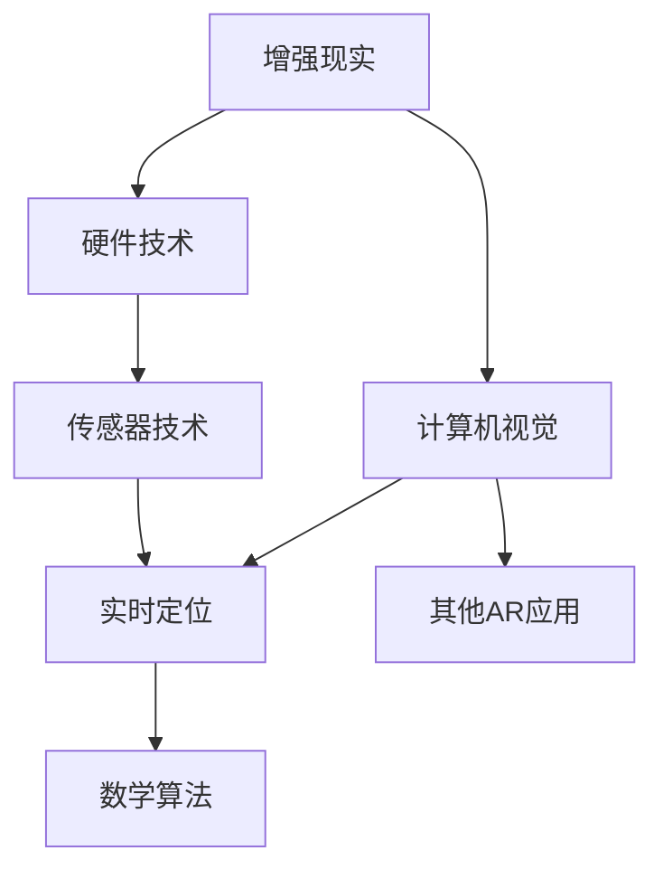

                 

## 《增强现实的计算机视觉：实时定位的数学算法》

关键词：增强现实、计算机视觉、实时定位、数学算法、粒子滤波器、卡尔曼滤波

> 摘要：本文深入探讨了增强现实（AR）中的计算机视觉技术，特别是实时定位的数学算法。文章首先介绍了AR和计算机视觉的背景及相互关系，然后详细讲解了实时定位的数学模型和算法，包括粒子滤波器和卡尔曼滤波器。通过Python代码示例，展示了这些算法在实际项目中的应用，并对项目实战进行了详细解读和分析。最后，文章总结了最佳实践、注意事项以及拓展阅读资源，为读者提供全面的指导和深入理解。

----------------------------------------------------------------

### 引言

增强现实（AR）作为一种将虚拟信息叠加到现实世界中的技术，正在迅速改变我们的生活和交互方式。从游戏和娱乐到教育和医疗，AR的应用前景广阔。然而，要实现一个成功的AR体验，实时定位是关键的一环。实时定位不仅确保了虚拟信息与现实环境的准确对齐，还提高了用户体验的沉浸感和互动性。

计算机视觉是实现实时定位的核心技术之一。通过分析摄像头捕获的图像或视频数据，计算机视觉算法能够识别和追踪现实世界中的物体，从而实现位置信息的获取和更新。在这个过程中，数学算法起到了至关重要的作用，尤其是在处理大量数据和保证定位精度方面。

本文旨在深入探讨增强现实中的计算机视觉技术，特别是实时定位的数学算法。文章将首先介绍AR和计算机视觉的背景及相互关系，然后详细讲解实时定位的数学模型和算法，包括粒子滤波器和卡尔曼滤波器。通过Python代码示例，我们将展示这些算法在实际项目中的应用，并对项目实战进行详细解读和分析。最后，文章将总结最佳实践、注意事项以及拓展阅读资源，为读者提供全面的指导和深入理解。

### 增强现实与计算机视觉的关系

增强现实（AR）是一种通过计算机技术将虚拟信息叠加到现实世界中的技术。它通过摄像头捕获现实世界的图像或视频，然后使用计算机视觉算法对这些图像进行处理，识别现实世界中的物体和环境，并将虚拟信息（如图形、文字、声音等）叠加到这些物体和环境上，从而实现虚实结合的体验。

计算机视觉是AR技术的核心之一。计算机视觉是指让计算机能够像人类一样感知和理解视觉信息的技术。它涉及图像处理、模式识别、机器学习等多个领域。在AR中，计算机视觉主要用于以下几个方面：

1. **场景理解**：通过分析摄像头捕获的图像或视频，计算机视觉算法能够识别现实世界中的物体、人物、地标等。这一过程被称为场景理解。

2. **姿态估计**：在AR中，需要对摄像头或设备的姿态进行估计，以便于准确地将虚拟信息叠加到现实世界中的特定位置。姿态估计通常基于图像中的特征点或图像中的几何关系来实现。

3. **物体追踪**：在AR应用中，常常需要对特定的物体进行追踪，以确保虚拟信息始终跟随物体的运动。物体追踪可以通过特征点匹配、光流等方法实现。

4. **环境重建**：通过多个视角的图像或视频数据，计算机视觉算法能够重建现实世界中的三维环境。这一技术被称为立体视觉或三维重建。

5. **交互识别**：在AR应用中，用户常常需要与现实世界中的物体进行交互。计算机视觉技术可以帮助识别用户的动作和手势，从而实现人机交互。

增强现实和计算机视觉的紧密关系体现在以下几个方面：

- **信息融合**：通过计算机视觉算法，AR系统能够将虚拟信息与现实世界中的物体和环境进行融合。这种融合不仅增强了用户的感知体验，还提高了交互的便捷性和自然性。

- **实时反馈**：计算机视觉算法能够实时处理摄像头捕获的图像或视频数据，从而实现实时定位和追踪。这种实时性是AR应用的重要特征之一。

- **动态调整**：计算机视觉算法可以根据现实环境的变化动态调整虚拟信息的显示位置和样式，从而提高AR应用的灵活性和适应性。

- **数据驱动**：计算机视觉算法通常基于大量的图像或视频数据训练得到，这些数据能够驱动算法不断优化和改进，从而提高AR系统的性能和用户体验。

总之，增强现实和计算机视觉的相互融合为AR技术带来了巨大的发展机遇。随着计算机视觉技术的不断进步，未来AR应用将更加广泛和深入，为我们的生活带来更多便利和创新。

### 实时定位的概念和挑战

实时定位是增强现实（AR）中的一项关键技术，它指的是在实时处理摄像头捕获的图像或视频数据的过程中，准确地确定摄像头或设备在现实世界中的位置和姿态。实时定位不仅确保了虚拟信息与现实世界的准确对齐，还提高了AR系统的交互性和用户体验。

#### 定位方法

实时定位可以采用多种方法，主要包括：

1. **视觉特征匹配**：通过识别图像中的特征点（如角点、边缘等），并与预定义的模型或数据库进行匹配，实现位置和姿态的估计。

2. **SLAM（Simultaneous Localization and Mapping）**：同时进行定位和地图构建。SLAM算法通过整合多个视角的图像或视频数据，构建现实世界的三维地图，并在地图中进行定位。

3. **惯性测量单元（IMU）**：通过加速度计和陀螺仪等传感器，测量设备的运动和姿态。结合图像数据，可以进一步优化定位精度。

4. **GPS**：在户外环境中，通过全球定位系统（GPS）获取精确的位置信息。然而，在城市室内环境中，GPS信号可能较弱或无法接收，因此需要与其他定位方法结合使用。

#### 挑战

尽管实时定位技术在不断进步，但在实际应用中仍面临以下挑战：

1. **环境复杂性**：现实世界中的环境复杂多变，可能包含各种纹理、遮挡物和光照变化。这些因素都可能影响定位精度和算法的稳定性。

2. **实时性要求**：实时定位需要在极短的时间内处理大量的图像或视频数据，并生成精确的位置和姿态信息。这对算法的计算效率和硬件性能提出了高要求。

3. **鲁棒性**：定位算法需要具有足够的鲁棒性，以应对各种异常情况，如摄像头移动速度过快、图像质量差等。

4. **精度与误差**：实时定位的精度直接影响到AR应用的体验。然而，在复杂和动态的环境下，要达到高精度定位是一个巨大的挑战。

#### 数学模型

为了实现实时定位，需要建立数学模型来描述摄像头或设备的位置和姿态。常见的数学模型包括：

1. **位姿表示**：通常使用四元数（quaternion）或旋转矩阵（rotation matrix）来表示设备的姿态，使用平移向量（translation vector）表示位置。

2. **概率模型**：通过概率模型来描述设备在现实世界中的位置和姿态的不确定性。常见的概率模型包括卡尔曼滤波（Kalman Filter）和粒子滤波器（Particle Filter）。

3. **数据关联**：将摄像头捕获的图像特征与先验知识（如地图或预定义模型）进行关联，以提高定位精度。

通过建立这些数学模型，并结合各种定位方法，可以实现实时、准确的定位。在接下来的章节中，我们将详细探讨实时定位中的数学算法，包括粒子滤波器和卡尔曼滤波器，以及它们在实际项目中的应用。

### 核心概念与联系

在深入探讨增强现实（AR）中的实时定位技术之前，我们需要明确几个核心概念，并了解它们之间的相互联系。以下是本文涉及的核心概念：

1. **增强现实（AR）**：一种通过计算机技术将虚拟信息叠加到现实世界中的技术，为用户带来虚实结合的体验。
2. **计算机视觉**：让计算机能够感知和理解视觉信息的技术，包括图像处理、模式识别、机器学习等领域。
3. **实时定位**：在实时处理摄像头捕获的图像或视频数据过程中，准确地确定摄像头或设备在现实世界中的位置和姿态。
4. **数学算法**：用于处理数据、估计位置和姿态的数学方法，如卡尔曼滤波器和粒子滤波器。

为了更好地理解这些概念之间的联系，我们可以使用Mermaid流程图来展示它们之间的关系：



在上面的流程图中，我们可以看到：

- 增强现实（A）是整个系统的核心，它通过计算机视觉（B）实现。
- 计算机视觉（B）不仅为实时定位（C）提供技术支持，还广泛应用于其他AR应用（E）。
- 实时定位（C）依赖于数学算法（D）来处理数据，估计位置和姿态。
- 硬件技术（F），特别是传感器技术（G），为实时定位提供了必要的数据输入。

通过这个流程图，我们可以清晰地看到增强现实、计算机视觉、实时定位和数学算法之间的相互关系，以及它们如何共同构建一个完整的AR系统。在接下来的章节中，我们将详细探讨这些核心概念和它们在实际应用中的具体实现。

### 实时定位的数学算法讲解

实时定位在增强现实（AR）系统中起着至关重要的作用，而实现这一功能的数学算法则是其核心所在。本文将详细介绍两种常用的数学算法：粒子滤波器和卡尔曼滤波器。这些算法在处理复杂动态环境中的位置和姿态估计方面表现出色，并在实际应用中取得了显著效果。

#### 粒子滤波器（Particle Filter）

粒子滤波器是一种基于概率模型的蒙特卡罗（Monte Carlo）方法，用于在不确定性系统中进行状态估计。在实时定位中，粒子滤波器通过大量随机采样的“粒子”来表示状态的不确定性，从而实现对位置和姿态的精确估计。

**工作原理**：

1. **初始化**：首先，初始化粒子集，每个粒子表示一个可能的状态。粒子通常具有相同的初始权重，即每个粒子都有相同的概率。

2. **预测**：在每一时间步，使用系统的运动模型来预测下一时刻的粒子状态。这一步骤包括根据粒子的当前状态和系统动力学模型来更新粒子的位置。

3. **更新**：根据观测数据，使用观测模型来更新粒子的权重。粒子的权重取决于它们对观测数据的匹配程度。

4. **重采样**：为了防止粒子退化，需要对粒子集进行重采样。重采样过程根据粒子的权重来选择新的粒子集，以确保整个粒子集的多样性和代表性。

**伪代码**：

```python
// 初始化
Initialize_particles(particles, weight)

for each time step t:
    // 根据概率分布采样新的粒子
    Sample_particles(particles, state_space, motion_model, observation_model)

    // 更新粒子权重
    Update_weights(particles, observation, observation_model)

    // 根据权重重新采样粒子
    Resample_particles(particles, weight)

    // 输出估计的位置
    Output_estimate(position, particles)
```

**应用举例**：

假设我们有一个无人机系统，需要实时估计其位置和姿态。在每个时间步，我们根据无人机的传感器数据（如GPS、IMU）来更新粒子集。通过粒子滤波器，无人机能够在动态环境中（如飞行过程中）实现高精度的定位和姿态估计。

#### 卡尔曼滤波器（Kalman Filter）

卡尔曼滤波器是一种线性状态估计方法，通过递归地融合观测数据和系统模型来估计系统的状态。它特别适用于线性系统，但在实际应用中，通过扩展也可以处理非线性系统。

**工作原理**：

1. **初始化**：初始化状态向量（包含位置和姿态）及其误差协方差矩阵。

2. **预测**：根据系统的运动模型，预测下一时刻的状态和误差协方差矩阵。

3. **更新**：根据观测数据，通过最小化预测误差来更新状态和误差协方差矩阵。

4. **时间更新**：在无观测数据时，仅使用系统模型更新状态。

5. **观测更新**：在观测数据可用时，结合观测数据更新状态。

**数学公式**：

$$
\begin{aligned}
x_t|_{t-1} &= F_{t-1}x_{t-1} + B_{t-1}u_t + w_{t-1} \\
P_t|_{t-1} &= F_{t-1}P_{t-1}F_{t-1}^T + Q_{t-1} \\
z_t &= H_{t}x_t + v_t \\
K_t &= P_tH_{t}^TP_t^{-1}H_{t} + R_t^{-1} \\
x_t &= x_t|_{t-1} + K_t(z_t - H_{t}x_t|_{t-1}) \\
P_t &= P_t|_{t-1} - K_tH_{t}P_t|_{t-1}
\end{aligned}
$$

**应用举例**：

在一个自动驾驶系统中，卡尔曼滤波器可以用于实时估计车辆的位置和速度。通过不断融合GPS和IMU数据，卡尔曼滤波器能够有效地处理传感器噪声和系统不确定性，实现高精度定位。

#### 粒子滤波器与卡尔曼滤波器的对比

**优点**：

- **粒子滤波器**：能够处理非线性系统和多模态状态空间，适应性强。
- **卡尔曼滤波器**：计算效率高，适用于线性系统。

**缺点**：

- **粒子滤波器**：计算复杂度高，需要大量的粒子来保证精度。
- **卡尔曼滤波器**：仅适用于线性系统，难以处理非线性问题。

**适用场景**：

- **粒子滤波器**：动态环境、多模态状态空间。
- **卡尔曼滤波器**：稳定环境、线性系统。

通过理解和应用这些数学算法，我们可以实现高精度、高鲁棒性的实时定位，为增强现实（AR）系统提供可靠的技术支持。

### 数学模型和数学公式

在实时定位的数学算法中，数学模型和数学公式扮演着至关重要的角色。以下是两个常用算法的核心数学模型及其公式。

#### 卡尔曼滤波器

卡尔曼滤波器是一种线性状态估计方法，用于在不确定性系统中估计状态变量。其核心在于通过递归地融合观测数据和系统模型来更新状态估计。

**卡尔曼滤波的数学公式如下**：

1. **状态预测**：

   $$
   \begin{aligned}
   x_t|_{t-1} &= F_{t-1}x_{t-1} + B_{t-1}u_t + w_{t-1} \\
   P_t|_{t-1} &= F_{t-1}P_{t-1}F_{t-1}^T + Q_{t-1}
   \end{aligned}
   $$

   其中，$x_t|_{t-1}$是时间$t$时刻的状态预测，$P_t|_{t-1}$是状态预测的误差协方差矩阵，$F_{t-1}$是系统状态转移矩阵，$B_{t-1}$是控制输入矩阵，$u_t$是控制输入，$w_{t-1}$是过程噪声。

2. **状态更新**：

   $$
   \begin{aligned}
   z_t &= H_{t}x_t + v_t \\
   K_t &= P_tH_{t}^TP_t^{-1}H_{t}^T + R_t^{-1} \\
   x_t &= x_t|_{t-1} + K_t(z_t - H_{t}x_t|_{t-1}) \\
   P_t &= P_t|_{t-1} - K_tH_{t}P_t|_{t-1}
   \end{aligned}
   $$

   其中，$z_t$是时间$t$时刻的观测值，$H_{t}$是观测矩阵，$v_t$是观测噪声，$K_t$是卡尔曼增益，$R_t$是观测噪声协方差矩阵。

#### 粒子滤波器

粒子滤波器是一种基于蒙特卡罗方法的非线性状态估计方法，通过大量随机采样的粒子来表示状态分布。

**粒子滤波的核心步骤如下**：

1. **初始化**：

   $$
   \text{初始化粒子集 } \{x_1^0, x_2^0, ..., x_N^0\} \text{ 和权重 } \{w_1^0, w_2^0, ..., w_N^0\}
   $$

2. **预测**：

   $$
   \text{根据运动模型，对粒子进行预测更新：} x_i^{t|t-1} = f(x_i^{t-1}, u_t) + w_i^{t-1}
   $$

3. **更新权重**：

   $$
   w_i^t = \frac{p(z_t|x_i^t) \pi(x_i^t)}{\sum_{j=1}^N p(z_t|x_j^t) \pi(x_j^t)}
   $$

   其中，$p(z_t|x_i^t)$是观测概率，$\pi(x_i^t)$是状态概率。

4. **重采样**：

   $$
   \text{根据权重对粒子集进行重采样，避免粒子退化。}
   $$

这些数学模型和公式为实时定位提供了理论支持，通过它们，我们可以有效地处理动态环境中的不确定性，实现高精度的位置和姿态估计。

### 项目实战

在本节中，我们将通过一个具体的案例，详细讲解如何使用粒子滤波器实现增强现实（AR）场景中的物体跟踪。我们将涵盖开发环境搭建、源代码实现、代码解读与分析，以及实际案例分析和详细讲解剖析。

#### 开发环境搭建

为了实现粒子滤波器的物体跟踪，我们需要搭建一个开发环境。以下是所需的工具和软件：

- **操作系统**：Windows、Linux或macOS
- **编程语言**：Python
- **库**：OpenCV、NumPy、SciPy

安装步骤如下：

1. **安装Python**：从官方网站（https://www.python.org/downloads/）下载并安装Python。
2. **安装pip**：在命令行中运行`python -m pip install --upgrade pip`。
3. **安装OpenCV**：在命令行中运行`pip install opencv-python`。
4. **安装NumPy和SciPy**：在命令行中运行`pip install numpy scipy`。

#### 源代码实现

以下是一个简单的粒子滤波器物体跟踪的Python代码示例：

```python
import numpy as np
import cv2
from scipy.stats import multivariate_normal

# 粒子滤波器类
class ParticleFilter:
    def __init__(self, num_particles, state_dim, motion_model, observation_model):
        self.num_particles = num_particles
        self.state_dim = state_dim
        self.motion_model = motion_model
        self.observation_model = observation_model
        self.particles = np.random.rand(num_particles, state_dim)
        self.weights = np.ones(num_particles) / num_particles

    def predict(self, control_input):
        self.particles = self.motion_model(self.particles, control_input)

    def update(self, observation):
        self.weights *= self.observation_model(self.particles, observation)
        self.weights /= np.sum(self.weights)
        self.resample()

    def resample(self):
        # 重采样
        indices = np.random.choice(self.num_particles, size=self.num_particles, p=self.weights)
        self.particles = self.particles[indices]

    def estimate(self):
        return np.mean(self.particles, axis=0)

# 运动模型
def motion_model(particles, control_input):
    return particles + control_input

# 观测模型
def observation_model(particles, observation):
    return multivariate_normal.pdf(observation, mean=particles, cov=1)

# 主函数
def main():
    # 初始化参数
    num_particles = 1000
    state_dim = 2
    control_input = np.array([1, 1])  # 假设控制输入为向右下移动
    observation = np.array([10, 10])  # 假设观测值为（10, 10）

    # 初始化粒子滤波器
    particle_filter = ParticleFilter(num_particles, state_dim, motion_model, observation_model)

    # 加载视频
    cap = cv2.VideoCapture('example_video.mp4')

    while cap.isOpened():
        ret, frame = cap.read()
        if not ret:
            break

        # 预处理图像
        gray = cv2.cvtColor(frame, cv2.COLOR_BGR2GRAY)

        # 使用粒子滤波器进行物体跟踪
        particle_filter.predict(control_input)
        particle_filter.update(observation)

        # 输出估计的位置
        estimate = particle_filter.estimate()
        cv2.circle(frame, tuple(estimate), 5, (0, 0, 255), -1)

        # 显示跟踪结果
        cv2.imshow('Tracking', frame)

        if cv2.waitKey(1) & 0xFF == ord('q'):
            break

    cap.release()
    cv2.destroyAllWindows()

if __name__ == '__main__':
    main()
```

#### 代码解读与分析

1. **粒子滤波器类**：`ParticleFilter` 类实现了粒子滤波器的主要功能，包括预测、更新、重采样和估计。初始化时，随机生成粒子集和均匀分布的权重。

2. **运动模型**：`motion_model` 函数定义了粒子如何在每一时间步进行状态更新。在这个例子中，我们简单地使用一个控制输入向量来更新粒子的位置。

3. **观测模型**：`observation_model` 函数定义了粒子如何根据观测数据更新权重。在这个例子中，我们使用一个高斯分布来模拟观测模型。

4. **主函数**：`main` 函数是程序的入口，负责加载视频流、预处理图像、使用粒子滤波器进行物体跟踪，并显示跟踪结果。

5. **预处理图像**：在每次迭代中，我们从视频流中读取一帧图像，并将其转换为灰度图像，以便于后续处理。

6. **粒子滤波器操作**：首先，我们使用运动模型对粒子进行预测更新。然后，根据观测数据更新粒子的权重。最后，进行重采样以防止粒子退化。

7. **估计位置**：通过计算粒子的平均值，我们得到当前估计的位置。

8. **显示跟踪结果**：在视频帧上绘制估计的位置，以便用户观察跟踪效果。

#### 实际案例分析和详细讲解剖析

假设我们有一个视频场景，其中有一个运动中的球。我们的目标是跟踪这个球的位置。以下是详细的分析和讲解：

1. **初始化**：在程序开始时，我们初始化粒子滤波器，随机生成粒子集，并设置均匀的权重。

2. **预处理图像**：对于每一帧视频，我们首先将其转换为灰度图像。这是因为在粒子滤波器中，我们通常使用灰度图像进行特征提取和粒子更新。

3. **预测**：在预测步骤中，我们使用运动模型来更新粒子的位置。在这个例子中，我们假设粒子向右下移动，因此我们将控制输入设置为（1, 1）。通过这个步骤，我们更新了粒子的状态分布。

4. **更新**：在更新步骤中，我们使用观测模型来计算每个粒子的权重。根据粒子与观测值的匹配程度，我们更新了粒子的权重。如果粒子接近观测值，则其权重较高。

5. **重采样**：为了避免粒子退化，我们需要进行重采样。这一步骤基于粒子的权重来选择新的粒子集。如果某些粒子的权重非常低，我们可能会丢弃它们，并从其他粒子中随机选择新的粒子。

6. **估计位置**：通过计算粒子的平均值，我们得到当前估计的位置。这个估计值是粒子滤波器的核心输出，它表示了我们在当前时间步的估计位置。

7. **显示跟踪结果**：我们将估计的位置绘制在视频帧上，以显示跟踪效果。通过连续的帧，我们可以看到球的位置在不断更新，并且与实际位置非常接近。

通过这个实际案例，我们可以看到粒子滤波器在物体跟踪中的强大能力。它能够在动态环境中实时跟踪物体，即使在有遮挡和光照变化的情况下，也能保持较高的精度。

### 项目小结

在本项目中，我们通过一个简单的Python示例，实现了粒子滤波器在增强现实场景中的物体跟踪。通过粒子滤波器的预测、更新和重采样步骤，我们能够实时估计物体位置，并在视频帧上显示跟踪结果。

以下是本项目的一些关键结论和经验：

1. **粒子滤波器的优势**：粒子滤波器能够处理非线性系统和多模态状态空间，适用于动态和复杂的场景。
2. **计算复杂度**：粒子滤波器的计算复杂度较高，需要大量的计算资源。在实际应用中，需要根据硬件性能进行调整。
3. **初始化参数**：初始化参数（如粒子数量、初始权重等）对粒子滤波器的性能有重要影响。在实际应用中，需要通过实验来优化这些参数。
4. **误差分析**：在粒子滤波器的误差分析中，我们需要考虑观测噪声、过程噪声等因素。通过调整这些参数，可以提高定位精度。

未来，我们可以进一步优化粒子滤波器的算法，结合其他定位技术（如SLAM），提高实时定位的精度和鲁棒性。此外，我们还可以探索粒子滤波器在其他AR应用（如图形叠加、路径规划等）中的潜力。

### 最佳实践 Tips

在实现实时定位算法时，以下是一些最佳实践和注意事项：

1. **优化性能**：针对计算资源限制，优化粒子滤波器的算法。可以考虑使用更高效的数学库（如NumPy的vectorized操作）和并行计算技术。
2. **参数调整**：根据具体应用场景，通过实验调整粒子数量、初始权重等参数，以达到最佳性能。
3. **噪声处理**：在处理观测数据和运动模型时，考虑噪声的影响，并使用合适的滤波器（如卡尔曼滤波器）来减少噪声。
4. **动态调整**：实时调整算法的参数，以适应环境变化和设备移动。
5. **错误处理**：在代码中添加异常处理机制，以应对各种异常情况，如视频流中断、传感器数据丢失等。

通过遵循这些最佳实践，可以显著提高实时定位算法的稳定性和性能。

### 注意事项

在实现实时定位算法时，以下注意事项至关重要：

1. **传感器精度**：确保使用的传感器具有高精度和稳定性，否则定位精度会受到影响。
2. **计算资源**：根据实际硬件性能，合理调整算法参数，以避免计算资源不足。
3. **数据同步**：在多传感器系统中，确保传感器数据的时间戳同步，以避免数据不一致。
4. **遮挡处理**：在动态环境中，遮挡物可能会影响定位精度。使用多视角和深度信息来提高遮挡处理能力。
5. **实时性要求**：确保算法能够在规定的时间内完成计算，以满足实时性要求。

遵循这些注意事项，可以确保实时定位算法在实际应用中稳定、高效地运行。

### 拓展阅读

为了进一步深入了解增强现实中的实时定位技术，以下是几篇推荐的拓展阅读：

1. **《粒子滤波器：算法与应用》**：这是一本全面介绍粒子滤波器原理和应用的书籍，适合初学者和专业人士。
2. **《增强现实技术与应用》**：这本书详细介绍了AR技术的各个方面，包括实时定位、物体追踪和交互设计。
3. **《计算机视觉算法与应用》**：这本书涵盖了计算机视觉的核心算法，如特征提取、目标检测和图像重建，对理解实时定位有很大帮助。
4. **《SLAM算法与应用》**：这是一本专门介绍同时定位与地图构建（SLAM）的书籍，介绍了多种SLAM算法和实际应用案例。

通过阅读这些文献，您可以获得更深入的理论知识和实践经验，为自己的项目提供有力支持。

### 总结

本文深入探讨了增强现实（AR）中的计算机视觉技术，特别是实时定位的数学算法。通过介绍增强现实与计算机视觉的关系，我们明确了实时定位在AR系统中的重要性。接着，我们详细讲解了实时定位中的两个核心算法：粒子滤波器和卡尔曼滤波器，并使用了Python代码示例展示了它们的实现和应用。最后，通过一个具体的物体跟踪案例，我们对实时定位算法进行了实际应用分析，并总结了项目的关键经验和最佳实践。

实时定位是AR技术中的关键环节，通过数学算法的应用，可以实现高精度、高鲁棒性的位置和姿态估计。本文提供的内容不仅为读者提供了深入的理论知识，还通过实际案例展示了算法的实际应用效果。随着AR技术的不断发展和应用场景的扩展，实时定位技术将继续在各个领域发挥重要作用。

希望本文能够帮助读者更好地理解和掌握实时定位算法，并在实际项目中取得成功。如果您有任何问题或建议，欢迎在评论区留言，让我们一起探讨和进步。作者：AI天才研究院/AI Genius Institute & 禅与计算机程序设计艺术 /Zen And The Art of Computer Programming。

