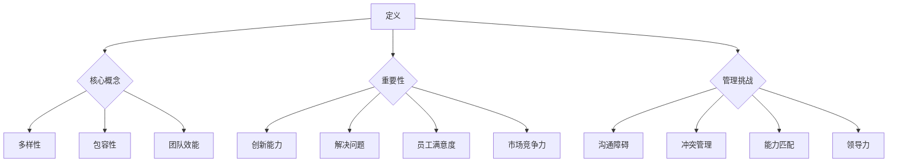

                 

### 1.1 什么是多元化团队管理
多元化团队管理是指在一个团队中，通过有效利用成员的多样性，包括但不限于性别、年龄、文化背景、教育水平、经验等，来实现团队整体效能的最大化。多元化不仅仅是指人口统计数据的多样性，还包括思维模式、工作风格和专业知识等方面的多样化。

#### 核心概念
- **多样性（Diversity）**：团队成员在性别、年龄、文化背景、教育水平、经验等方面的差异。
- **包容性（Inclusivity）**：确保团队成员感到被尊重、被重视，并且能够自由地表达自己的观点。
- **团队效能（Team Effectiveness）**：团队在完成任务、解决问题和实现目标方面的能力。

#### 重要性
多元化团队管理的重要性体现在以下几个方面：

1. **创新能力的提升**：多样化的观点和思维方式可以激发更多的创意和创新的解决方案。
2. **解决问题的多样性**：不同的团队成员可以带来不同的视角和经验，从而更全面地分析问题，提高解决问题的效率和质量。
3. **员工满意度和忠诚度**：一个包容和尊重多样性的工作环境可以提高员工的满意度和忠诚度，减少人才流失。
4. **市场竞争力**：在全球化背景下，多元化的团队可以更好地理解和适应不同市场的需求，提升企业的竞争力。

#### 管理挑战
多元化团队管理也面临着一系列挑战：

1. **沟通障碍**：由于文化、语言或工作风格的差异，团队成员之间可能会存在沟通障碍。
2. **冲突管理**：不同的观点和意见可能会导致团队内部的冲突。
3. **能力匹配**：如何将团队成员的能力与任务需求进行最佳匹配是一个挑战。
4. **领导力**：领导者需要具备理解和支持多样性的能力，以及管理多元化团队的经验。

#### 案例分析
例如，Google 在其多元化团队管理中就取得了显著的成果。Google 通过实施多元化的招聘策略、建立多元文化委员会和提供多样性培训等方式，成功地打造了一个充满创新氛围的多元化团队，从而在多个领域取得了领先地位。

**Mermaid 流程图**：


**Python 代码示例**：
```python
# 多元化团队评估指标

import pandas as pd

# 假设我们有一个包含团队成员信息的DataFrame
team_members = pd.DataFrame({
    '姓名': ['Alice', 'Bob', 'Charlie', 'Diana'],
    '性别': ['女', '男', '男', '女'],
    '年龄': [30, 45, 27, 35],
    '文化背景': ['美国', '英国', '中国', '印度'],
    '教育水平': ['硕士', '本科', '博士', '本科'],
    '工作经验': [5, 10, 3, 8]
})

# 定义评估指标函数
def assess_diversity(team_members):
    # 计算多样性指标
    diversity_score = team_members.shape[0]  # 团队成员总数
    gender_diversity = len(set(team_members['性别']))  # 性别多样性
    age_diversity = len(set(team_members['年龄']))  # 年龄多样性
    cultural_diversity = len(set(team_members['文化背景']))  # 文化背景多样性
    educational_diversity = len(set(team_members['教育水平']))  # 教育水平多样性
    experience_diversity = len(set(team_members['工作经验']))  # 工作经验多样性
    
    # 返回多样性分数
    return diversity_score, gender_diversity, age_diversity, cultural_diversity, educational_diversity, experience_diversity

# 应用评估指标函数
diversity_results = assess_diversity(team_members)

# 打印结果
print("团队多样性评估结果：")
print(f"总多样性分数: {diversity_results[0]}")
print(f"性别多样性: {diversity_results[1]}")
print(f"年龄多样性: {diversity_results[2]}")
print(f"文化背景多样性: {diversity_results[3]}")
print(f"教育水平多样性: {diversity_results[4]}")
print(f"工作经验多样性: {diversity_results[5]}")
```

通过上述代码，我们可以对一个团队的多样性进行量化评估，从而更好地理解和管理团队的多元化。

#### 总结
多元化团队管理是一个复杂而重要的任务，它需要领导者具备深刻的理解和有效的管理策略。通过拥抱差异，我们可以激发创新，提升团队的效能，并在竞争激烈的市场中获得优势。接下来，我们将深入探讨多元化团队管理的核心概念，包括多样性的类型、优势与挑战，以及其理论基础。

