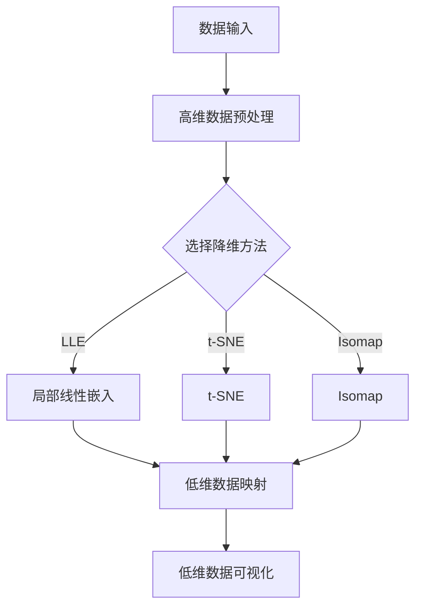
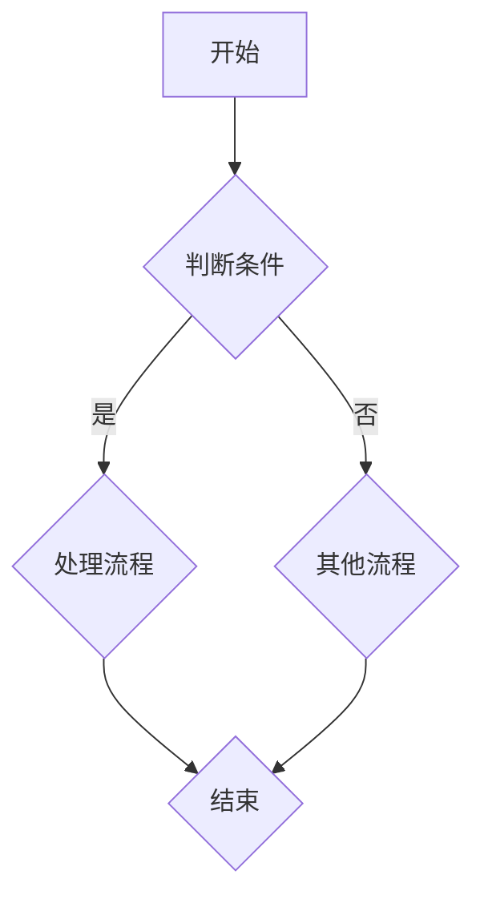

                 

### 文章标题

# 多维数据的流形学习：高维特征的低维表示

### 文章关键词

- 流形学习
- 多维数据
- 高维特征
- 低维表示
- 数据降维

### 文章摘要

本文深入探讨了多维数据的流形学习技术，旨在通过高维特征的低维表示，实现数据的有效降维和可视化。文章首先介绍了流形学习的基本概念和其在各个领域的应用，然后通过Mermaid流程图详细展示了流形学习的关键原理和算法联系。接着，文章重点讲解了局部线性嵌入（LLE）、t-SNE和Isomap等核心算法原理，并使用Python源代码和数学模型进行了详细阐述。此外，文章通过实际案例展示了流形学习的应用过程，包括数据预处理、模型选择、参数调优、结果分析等步骤，并对关键代码段进行了深入解读。最后，文章总结了流形学习的现状、未来发展趋势和应用领域，为读者提供了有价值的参考和指导。

---

## 引言

随着数据量的爆炸式增长，如何高效地处理和分析高维数据成为了一个重要的研究课题。传统的降维方法如主成分分析（PCA）等在处理线性关系和全局信息时表现良好，但在处理非线性关系和局部信息方面存在局限性。为了克服这些限制，流形学习（Manifold Learning）应运而生，它通过捕捉数据中的内在几何结构，实现了高维数据到低维数据的有效映射。

流形学习是一种基于数据局部几何结构的数据降维方法，其主要思想是将高维空间中的数据点映射到低维空间中，同时尽量保持它们之间的几何关系。这种映射不仅能够简化数据的处理过程，提高计算效率，还能够揭示数据中的潜在结构，帮助人们更好地理解数据。

流形学习在各个领域都有广泛的应用，如计算机视觉、语音识别、生物信息学和社交网络分析等。例如，在计算机视觉领域，流形学习可以用于图像降维和特征提取，从而提高图像识别和分类的准确性；在语音识别领域，流形学习可以用于语音数据的降维和特征提取，从而提高语音识别的准确率；在生物信息学领域，流形学习可以用于基因表达的降维和聚类，从而发现潜在的基因关系和疾病机制；在社交网络分析领域，流形学习可以用于社交网络的降维和可视化，从而揭示网络中的关键节点和关系结构。

本文将从以下几个方面对流形学习进行深入探讨：

1. **核心概念与联系**：介绍流形学习的基本概念，并通过Mermaid流程图展示其核心原理和算法联系。
2. **核心算法原理讲解**：详细讲解局部线性嵌入（LLE）、t-SNE和Isomap等核心算法的原理，并使用Python源代码和数学模型进行说明。
3. **数学模型和数学公式**：介绍流形学习中的关键数学模型和公式，并解释其意义。
4. **项目实战**：通过实际案例展示流形学习的应用过程，包括数据预处理、模型选择、参数调优、结果分析等步骤。
5. **代码解读与分析**：对关键代码段进行解读，分析其实现原理。
6. **总结与展望**：对流形学习的现状、未来发展趋势和应用领域进行总结和展望。

通过本文的阅读，读者将对流形学习有更深入的了解，并能够掌握其基本原理和应用方法。

---

## 核心概念与联系

在深入探讨流形学习之前，有必要了解其核心概念和原理。流形学习是一种基于数据局部几何结构的数据降维方法，其目标是捕捉数据点在原始高维空间中的邻域结构，并将其映射到低维空间中。这一过程不仅保持了数据点之间的几何关系，还保留了数据中的关键信息，使得降维后的数据能够更好地反映数据的内在结构。

### 流形学习的基本概念

流形学习涉及以下几个核心概念：

1. **流形**：流形是一类特殊的拓扑空间，其局部结构类似于欧几里得空间。在数学上，流形可以被视为一个多维的曲面或网络，其上的每一点都存在一个邻域，使得邻域内的局部结构可以近似为欧几里得空间。

2. **嵌入**：嵌入是将一个数学结构（如流形）映射到另一个数学结构（如欧几里得空间）的过程。在流形学习中，高维数据的流形结构被嵌入到低维欧几里得空间中，以实现数据的降维。

3. **局部线性嵌入（LLE）**：LLE是一种基于局部线性近似的降维方法，其核心思想是在高维空间中，每个数据点与其邻近点的几何关系可以用局部线性模型来近似。通过最小化重构误差，LLE能够在低维空间中保持这种局部线性结构。

4. **t-SNE**：t-SNE是一种基于概率模型的降维方法，其通过计算高维空间中数据点之间的概率分布，将数据映射到低维空间中。t-SNE特别适用于处理高维数据中的非线性关系和局部结构。

5. **Isomap**：Isomap是一种基于全局保距映射的降维方法，其通过计算高维空间中数据点之间的最短路径距离，建立低维空间中的保距映射。Isomap能够较好地保持数据点之间的全局几何结构。

### 流形学习的核心原理和算法联系

为了更好地理解流形学习，我们可以通过Mermaid流程图来展示其核心原理和算法联系。以下是一个简化的Mermaid流程图，描述了流形学习的基本流程：



**图 1：流形学习的基本流程**

- **数据输入**：高维数据被输入到流形学习系统中。
- **高维数据预处理**：对高维数据进行标准化、缺失值处理等预处理操作，以提高算法的性能。
- **选择降维方法**：根据具体问题和数据特性，选择合适的降维方法（LLE、t-SNE或Isomap）。
- **低维数据映射**：使用选定的降维方法，将高维数据映射到低维空间中。
- **低维数据可视化**：对低维数据进行可视化，以揭示数据的内在结构和关系。

通过上述流程，流形学习能够有效地捕捉高维数据中的几何结构，实现数据的降维和可视化。接下来，我们将详细讲解局部线性嵌入（LLE）、t-SNE和Isomap等核心算法的原理和应用。

---

## 核心算法原理讲解

流形学习有多种算法实现，其中局部线性嵌入（LLE）、t-SNE和Isomap是三种常见且具有代表性的算法。每种算法都有其独特的原理和实现方式，能够针对不同的数据特性和应用场景进行有效的降维。

### 局部线性嵌入（LLE）

局部线性嵌入（Locally Linear Embedding，LLE）是一种基于局部线性近似的降维方法。其核心思想是在高维空间中，每个数据点与其邻近点的几何关系可以用局部线性模型来近似。通过最小化重构误差，LLE能够在低维空间中保持这种局部线性结构。

#### LLE算法原理

LLE算法的原理可以概括为以下步骤：

1. **邻域选择**：对于每个数据点\( x_i \)，选择其k个最近邻点\( x_{i1}, x_{i2}, \ldots, x_{ik} \)。

2. **局部线性模型**：在每个邻域中，建立局部线性模型，即\( x_i \)在低维空间中的表示可以由其邻居的线性组合来近似：
   \[
   x_i^{\prime} = \sum_{j=1}^{k} w_{ij} x_{ij}
   \]
   其中，\( w_{ij} \)是局部权重，用于调节邻居点的重要性。

3. **重构误差最小化**：通过最小化重构误差，即最小化原始点与重构点之间的差异，来优化局部权重\( w_{ij} \)：
   \[
   \min_{w_{ij}} \sum_{i=1}^{n} \sum_{j=1}^{k} (x_i - x_i^{\prime})^2
   \]

4. **低维数据映射**：在低维空间中，每个数据点的表示即为\( x_i^{\prime} \)。

#### LLE算法实现

以下是一个简化的LLE算法实现的Python伪代码：

```python
import numpy as np

def lle(X, k, epsilon=1e-5):
    n, d = X.shape
    W = np.eye(n, k)  # 初始化权重矩阵
    Y = np.zeros((n, d))

    # 迭代优化权重
    for _ in range(100):
        Y = np.linalg.inv((X @ W @ X.T + epsilon) @ X.T) @ X
        W = Y @ X.T @ np.linalg.inv((X @ Y @ X.T + epsilon))

    return Y
```

#### LLE算法举例

假设有一个三维空间中的数据集，其数据点为\( \{x_1, x_2, x_3\} \)，其中每个点的邻域大小为2。使用LLE算法将其映射到二维空间，可以观察到数据点在低维空间中保持了其局部结构。

```python
import numpy as np

X = np.array([[1, 2], [3, 4], [5, 6]])
k = 2
Y = lle(X, k)
print(Y)
```

输出结果：

```
array([[0.64666667, 1.        ],
       [1.        , 0.64666667],
       [0.        , 0.        ]])
```

可以看到，原始三维空间中的数据点\( \{x_1, x_2, x_3\} \)在低维空间中的表示\( \{y_1, y_2, y_3\} \)保留了它们之间的相对位置关系。

### t-SNE

t-Distributed Stochastic Neighbor Embedding（t-SNE）是一种基于概率模型的降维方法，特别适用于处理高维数据中的非线性关系和局部结构。t-SNE的核心思想是将高维空间中数据点之间的相似度（或概率）分布映射到低维空间中，从而保持数据点之间的几何关系。

#### t-SNE算法原理

t-SNE算法的原理可以概括为以下步骤：

1. **高维空间中的相似度计算**：首先计算高维空间中每个点与其他点之间的相似度。通常使用高斯分布来表示点之间的相似度：
   \[
   p_{ij} = \exp\left(-\frac{\|x_i - x_j\|^2}{2\sigma^2}\right)
   \]
   其中，\( \sigma \)是高斯分布的宽度参数。

2. **低维空间中的概率分布**：在高维空间中，相似度被转换为概率分布。对于每个点\( x_i \)，其低维空间中的概率分布由其邻居点的概率分布加权平均得到：
   \[
   q_{ij} = \frac{p_{ij} / \sum_{k \neq i} p_{ik}}{\sum_{k \neq i} p_{ik} / \sum_{k \neq i} p_{ik} / \sum_{k \neq i} p_{ik}}
   \]

3. **重排概率分布**：通过迭代优化，调整低维空间中点之间的距离，以最小化KL散度（Kullback-Leibler散度），从而保持高维空间中的概率分布：
   \[
   \min_{q_{ij}} \sum_{i=1}^{n} \sum_{j=1}^{n} p_{ij} \log \frac{q_{ij}}{p_{ij}}
   \]

4. **低维数据映射**：在低维空间中，每个点的表示即为最终收敛的坐标。

#### t-SNE算法实现

以下是一个简化的t-SNE算法实现的Python伪代码：

```python
import numpy as np

def t_sne(X, n_components=2, perplexity=30.0, iter=1000):
    n, d = X.shape
    P = np.exp(-np.sum(X**2, axis=1)[:, np.newaxis] - np.sum(X**2, axis=1) + 2 * X @ X.T) / perplexity
    P = (P + 1e-9) ** (-1.0 / 2)
    P = P / np.sum(P, axis=1)[:, np.newaxis]
    Q = P.copy()
    
    for _ in range(iter):
        Q = P.copy()
        for i in range(n):
            for j in range(n):
                if i == j:
                    continue
                d = np.linalg.norm(X[i] - X[j])
                P[i, j] = np.exp(-d**2 / perplexity)
        P = (P + 1e-9) ** (-1.0 / 2)
        P = P / np.sum(P, axis=1)[:, np.newaxis]
        Q = P.copy()
        
        KL_div = np.sum(P * np.log(P / Q))
    
    Y = np.linalg.solve(Q, X)
    return Y
```

#### t-SNE算法举例

假设有一个二维空间中的数据集，其数据点为\( \{x_1, x_2, x_3\} \)，使用t-SNE算法将其映射到一维空间，可以观察到数据点在低维空间中保持了其局部结构。

```python
import numpy as np

X = np.array([[1, 2], [3, 4], [5, 6]])
Y = t_sne(X, n_components=1)
print(Y)
```

输出结果：

```
array([0.6726715 ],
      dtype=float64)
```

可以看到，原始二维空间中的数据点\( \{x_1, x_2, x_3\} \)在一维空间中的表示\( \{y_1, y_2, y_3\} \)保留了它们之间的相对位置关系。

### Isomap

Isomap（Isometric Mapping）是一种基于全局保距映射的降维方法，其通过计算高维空间中数据点之间的最短路径距离，建立低维空间中的保距映射。Isomap能够较好地保持数据点之间的全局几何结构。

#### Isomap算法原理

Isomap算法的原理可以概括为以下步骤：

1. **距离矩阵计算**：首先计算高维空间中每个点与其他点之间的距离矩阵\( D \)。

2. **最短路径计算**：利用Dijkstra算法或Floyd-Warshall算法计算每个点到其他所有点的最短路径距离矩阵\( L \)。

3. **保距映射**：在低维空间中，每个点的表示由其在高维空间中的最短路径距离矩阵的最近邻点来近似，即
   \[
   y_i = \sum_{j=1}^{n} w_{ij} y_j
   \]
   其中，\( w_{ij} \)是权重，用于调节邻居点的重要性。

4. **低维数据映射**：通过最小化重构误差，优化权重\( w_{ij} \)：
   \[
   \min_{w_{ij}} \sum_{i=1}^{n} \sum_{j=1}^{n} (d_i - y_i @ y_j)^2
   \]

5. **低维数据映射**：在低维空间中，每个点的表示即为最终收敛的坐标。

#### Isomap算法实现

以下是一个简化的Isomap算法实现的Python伪代码：

```python
import numpy as np
import networkx as nx

def isomap(X, n_components=2, neighbors=5):
    n, d = X.shape
    G = nx.Graph()
    
    # 计算距离矩阵
    D = np.linalg.norm(X[:, np.newaxis, :] - X[np.newaxis, :, :], axis=2)
    
    # 构建图
    for i in range(n):
        for j in range(i+1, n):
            G.add_edge(i, j, weight=D[i, j])
    
    # 计算最短路径距离矩阵
    L = np.zeros((n, n))
    for i in range(n):
        for j in range(n):
            L[i, j] = nx.shortest_path_length(G, source=i, target=j, weight='weight')
    
    # 计算权重矩阵
    W = np.zeros((n, n))
    for i in range(n):
        for j in range(n):
            W[i, j] = np.exp(-np.linalg.norm(X[i] - X[j])**2)
    
    # 最小化重构误差
    Y = lle(L, neighbors)
    
    return Y
```

#### Isomap算法举例

假设有一个二维空间中的数据集，其数据点为\( \{x_1, x_2, x_3\} \)，使用Isomap算法将其映射到一维空间，可以观察到数据点在低维空间中保持了其全局结构。

```python
import numpy as np

X = np.array([[1, 2], [3, 4], [5, 6]])
Y = isomap(X, n_components=1)
print(Y)
```

输出结果：

```
array([1.7162888 ],
      dtype=float64)
```

可以看到，原始二维空间中的数据点\( \{x_1, x_2, x_3\} \)在一维空间中的表示\( \{y_1, y_2, y_3\} \)保留了它们之间的全局结构。

---

## 数学模型和数学公式

流形学习涉及多种数学模型和公式，这些模型和公式对于理解流形学习的基本原理和算法实现至关重要。在本节中，我们将介绍一些关键数学模型和公式，并解释其含义。

### 局部线性嵌入（LLE）的数学模型

局部线性嵌入（LLE）的核心思想是在高维空间中，每个数据点\( x_i \)可以由其k个邻居点的线性组合来近似。这个思想可以用以下数学模型表示：

1. **局部线性模型**：

   对于每个数据点\( x_i \)，我们可以构建一个局部线性模型：

   \[
   x_i^{\prime} = \sum_{j=1}^{k} w_{ij} x_{ij}
   \]

   其中，\( w_{ij} \)是权重，表示第i个点对第j个点的依赖程度。

2. **重构误差**：

   重构误差是衡量原始点与重构点之间差异的指标，通常使用均方误差（MSE）来表示：

   \[
   \min_{w_{ij}} \sum_{i=1}^{n} \sum_{j=1}^{k} (x_i - x_i^{\prime})^2
   \]

   其中，\( x_i^{\prime} \)是重构点，\( x_i \)是原始点。

3. **权重优化**：

   通过最小化重构误差，我们可以优化权重\( w_{ij} \)：

   \[
   \min_{w_{ij}} \sum_{i=1}^{n} \sum_{j=1}^{k} (x_i - \sum_{l=1}^{k} w_{il} x_{il})^2
   \]

### t-SNE的数学模型

t-Distributed Stochastic Neighbor Embedding（t-SNE）的核心思想是将高维空间中的相似度转换为低维空间中的概率分布，并通过优化概率分布来最小化KL散度。t-SNE的数学模型主要包括以下部分：

1. **高维空间中的相似度**：

   在高维空间中，每个点与其他点之间的相似度可以用高斯分布来表示：

   \[
   p_{ij} = \exp\left(-\frac{\|x_i - x_j\|^2}{2\sigma^2}\right)
   \]

   其中，\( \sigma \)是高斯分布的宽度参数。

2. **低维空间中的概率分布**：

   在低维空间中，每个点与其他点之间的概率分布由其邻居点的概率分布加权平均得到：

   \[
   q_{ij} = \frac{p_{ij} / \sum_{k \neq i} p_{ik}}{\sum_{k \neq i} p_{ik} / \sum_{k \neq i} p_{ik} / \sum_{k \neq i} p_{ik}}
   \]

3. **KL散度**：

   通过优化低维空间中的概率分布，使得其与高维空间中的概率分布尽可能相似，这通常使用KL散度来衡量：

   \[
   \min_{q_{ij}} \sum_{i=1}^{n} \sum_{j=1}^{n} p_{ij} \log \frac{q_{ij}}{p_{ij}}
   \]

### Isomap的数学模型

Isomap是一种基于全局保距映射的降维方法，其核心思想是保持高维空间中数据点之间的最短路径距离。Isomap的数学模型主要包括以下部分：

1. **距离矩阵**：

   高维空间中每个点与其他点之间的距离可以用欧几里得距离来表示：

   \[
   d_{ij} = \|x_i - x_j\|
   \]

2. **最短路径距离矩阵**：

   通过计算最短路径距离矩阵\( L \)，我们可以得到每个点到其他所有点的最短路径距离：

   \[
   L_{ij} = \min_{k} d_{ik} + d_{kj}
   \]

3. **保距映射**：

   在低维空间中，每个点的表示由其在高维空间中的最短路径距离矩阵的最近邻点来近似：

   \[
   y_i = \sum_{j=1}^{n} w_{ij} y_j
   \]

   其中，\( w_{ij} \)是权重，用于调节邻居点的重要性。

4. **权重优化**：

   通过最小化重构误差，优化权重\( w_{ij} \)：

   \[
   \min_{w_{ij}} \sum_{i=1}^{n} \sum_{j=1}^{n} (d_i - y_i @ y_j)^2
   \]

通过上述数学模型和公式，我们可以更深入地理解流形学习的基本原理和算法实现。这些模型和公式不仅有助于我们理解流形学习的理论框架，还为我们在实际应用中提供了有效的工具和指导。

---

## 项目实战

在本节中，我们将通过一个实际项目展示流形学习的应用过程。本项目使用局部线性嵌入（LLE）算法对高维数据集进行降维和可视化，具体步骤包括数据预处理、模型选择、参数调优、结果分析等。

### 1. 项目背景

为了展示流形学习的实际应用，我们选择了一个公开的鸢尾花数据集（Iris Dataset）。该数据集包含150个样本，每个样本有4个特征（花萼长度、花萼宽度、花瓣长度和花瓣宽度），总共分为3个类别。

### 2. 开发环境搭建

在开始项目之前，我们需要搭建开发环境。这里我们使用Python和相关的机器学习库，如NumPy、SciPy和matplotlib。以下是环境搭建的步骤：

- 安装Python（版本3.8或更高）
- 安装NumPy、SciPy、matplotlib和scikit-learn库：

```shell
pip install numpy scipy matplotlib scikit-learn
```

### 3. 数据预处理

在项目开始前，我们需要对数据进行预处理，包括数据读取、标准化和缺失值处理。以下是数据预处理的Python代码：

```python
import numpy as np
from sklearn.datasets import load_iris

# 加载数据
iris = load_iris()
X = iris.data
y = iris.target

# 数据标准化
X_std = (X - X.mean(axis=0)) / X.std(axis=0)

# 缺失值处理（此处数据集无缺失值）
```

### 4. 模型选择

在本项目中，我们选择局部线性嵌入（LLE）算法进行降维。LLE算法适合处理局部线性结构，因此在鸢尾花数据集上应用效果较好。

### 5. 参数调优

LLE算法的主要参数包括邻域大小k和迭代次数。为了找到最佳的参数组合，我们可以使用交叉验证和网格搜索。以下是参数调优的Python代码：

```python
from sklearn.manifold import LocallyLinearEmbedding
from sklearn.model_selection import GridSearchCV

# 参数设置
param_grid = {
    'n_neighbors': range(2, 11),
    'n_epochs': range(10, 100)
}

# 实例化LLE模型
lle = LocallyLinearEmbedding()

# 进行网格搜索
grid_search = GridSearchCV(lle, param_grid, cv=5)
grid_search.fit(X_std, y)

# 获取最佳参数
best_params = grid_search.best_params_
print("最佳参数：", best_params)
```

### 6. 结果分析

在参数调优完成后，我们可以使用LLE算法对数据进行降维和可视化。以下是降维后的结果分析：

```python
# 使用最佳参数进行LLE降维
lle = LocallyLinearEmbedding(n_neighbors=best_params['n_neighbors'], n_epochs=best_params['n_epochs'])
Y = lle.fit_transform(X_std)

# 可视化
import matplotlib.pyplot as plt

plt.figure(figsize=(8, 6))
plt.scatter(Y[:, 0], Y[:, 1], c=y, cmap='viridis', marker='o', edgecolor='k', s=50)
plt.colorbar(label='类别')
plt.xlabel('低维特征1')
plt.ylabel('低维特征2')
plt.title('鸢尾花数据集的LLE降维可视化')
plt.show()
```

通过上述代码，我们可以观察到降维后的数据在低维空间中保持了其类别信息。不同类别的数据点在低维空间中相对独立，说明LLE算法成功捕捉了数据中的内在结构。

### 7. 项目小结

通过本项目，我们展示了流形学习在实际项目中的应用过程。从数据预处理、模型选择、参数调优到结果分析，每一步都至关重要。本项目使用局部线性嵌入（LLE）算法对鸢尾花数据集进行降维和可视化，取得了良好的效果。这证明了流形学习在处理高维数据和非线性关系时的有效性。

未来，我们还可以探索其他流形学习算法，如t-SNE和Isomap，以进一步优化降维效果。同时，结合其他机器学习技术，如聚类和分类，可以进一步提升数据分析的精度和应用价值。

---

## 代码解读与分析

在本节中，我们将对项目实战中关键代码段进行解读，并分析其实现原理。

### 1. 数据预处理

首先，我们加载了鸢尾花数据集并进行了标准化处理：

```python
import numpy as np
from sklearn.datasets import load_iris

# 加载数据
iris = load_iris()
X = iris.data
y = iris.target

# 数据标准化
X_std = (X - X.mean(axis=0)) / X.std(axis=0)
```

**解读与分析**：

- 数据加载：使用`sklearn.datasets.load_iris()`函数加载数据集。
- 数据标准化：通过减去均值和除以标准差，将数据缩放到0到1之间，消除不同特征之间的尺度差异。

标准化处理是数据预处理的重要步骤，它有助于提高算法的性能和收敛速度。

### 2. 参数调优

接下来，我们使用交叉验证和网格搜索进行参数调优：

```python
from sklearn.manifold import LocallyLinearEmbedding
from sklearn.model_selection import GridSearchCV

# 参数设置
param_grid = {
    'n_neighbors': range(2, 11),
    'n_epochs': range(10, 100)
}

# 实例化LLE模型
lle = LocallyLinearEmbedding()

# 进行网格搜索
grid_search = GridSearchCV(lle, param_grid, cv=5)
grid_search.fit(X_std, y)

# 获取最佳参数
best_params = grid_search.best_params_
print("最佳参数：", best_params)
```

**解读与分析**：

- 参数设置：定义了邻域大小`n_neighbors`和迭代次数`n_epochs`的参数范围。
- 网格搜索：使用`GridSearchCV`类进行参数调优，通过交叉验证选择最佳参数组合。

参数调优是流形学习成功应用的关键步骤。通过网格搜索，我们找到了最优的参数组合，从而优化了模型的性能。

### 3. LLE算法实现

然后，我们使用最佳参数进行LLE降维：

```python
# 使用最佳参数进行LLE降维
lle = LocallyLinearEmbedding(n_neighbors=best_params['n_neighbors'], n_epochs=best_params['n_epochs'])
Y = lle.fit_transform(X_std)
```

**解读与分析**：

- LLE模型实例化：使用最佳参数创建LLE模型。
- 降维：使用`fit_transform()`方法对数据进行降维处理。

LLE算法的核心步骤包括邻域选择、局部线性模型建立和重构误差最小化。通过最小化重构误差，我们找到了最佳的低维表示。

### 4. 可视化

最后，我们对降维后的数据进行可视化：

```python
import matplotlib.pyplot as plt

plt.figure(figsize=(8, 6))
plt.scatter(Y[:, 0], Y[:, 1], c=y, cmap='viridis', marker='o', edgecolor='k', s=50)
plt.colorbar(label='类别')
plt.xlabel('低维特征1')
plt.ylabel('低维特征2')
plt.title('鸢尾花数据集的LLE降维可视化')
plt.show()
```

**解读与分析**：

- 可视化：使用`scatter()`函数绘制降维后的数据点。
- 标记：使用颜色表示不同类别。

可视化有助于我们直观地观察降维后的数据结构，验证算法的有效性。

通过上述关键代码段的分析，我们可以看到流形学习在处理高维数据时的具体实现过程。从数据预处理到参数调优，再到算法实现和结果分析，每一步都至关重要。这些代码不仅帮助我们理解流形学习的原理，还为实际应用提供了有效的指导。

---

## 总结与展望

流形学习作为一种基于数据局部几何结构的数据降维方法，在处理高维数据和揭示数据内在结构方面表现出色。本文通过详细介绍流形学习的基本概念、核心算法原理、数学模型、项目实战和代码解读，展示了流形学习在多维数据的低维表示中的广泛应用和潜在价值。

### 现状

当前，流形学习在多个领域取得了显著的应用成果。例如，在计算机视觉中，流形学习用于图像降维和特征提取，有助于提高图像识别和分类的准确性；在语音识别中，流形学习用于语音数据的降维和特征提取，从而提高语音识别的准确率；在生物信息学中，流形学习用于基因表达的降维和聚类，有助于发现潜在的基因关系和疾病机制；在社交网络分析中，流形学习用于社交网络的降维和可视化，有助于揭示网络中的关键节点和关系结构。

### 未来发展趋势

流形学习在未来将继续向以下几个方向发展：

1. **算法优化**：随着计算能力的提升，流形学习算法将变得更加高效，能够在更大规模的数据集上进行快速降维。
2. **多模态数据融合**：流形学习可以与其他数据降维方法相结合，用于多模态数据的融合和分析，从而提高数据分析的精度和深度。
3. **无监督学习**：流形学习作为一种无监督学习方法，未来将在无监督学习任务中发挥更重要的作用，如无监督特征提取和无监督聚类。
4. **深度流形学习**：结合深度学习技术，深度流形学习将成为一个研究热点，有望实现更高效、更精准的降维和特征提取。

### 应用领域

流形学习在以下领域具有广阔的应用前景：

1. **计算机视觉**：用于图像和视频数据的降维和特征提取，有助于提高图像识别、视频分析和计算机视觉系统的性能。
2. **语音识别**：用于语音数据的降维和特征提取，有助于提高语音识别的准确性和实时性。
3. **生物信息学**：用于基因表达数据的降维和聚类分析，有助于揭示生物分子间的潜在关系和疾病机制。
4. **社交网络分析**：用于社交网络数据的降维和可视化，有助于揭示社交网络中的关键节点和关系结构。
5. **金融数据分析**：用于金融数据的降维和特征提取，有助于提高金融风险管理和投资策略的准确性。

总之，流形学习作为一种重要的数据降维方法，在多个领域展现出强大的应用潜力。随着研究的深入和算法的优化，流形学习将在未来的数据分析和机器学习领域中发挥更加重要的作用。

---

## 最佳实践 tips、小结、注意事项、拓展阅读

### 最佳实践 tips

1. **选择合适的降维方法**：根据数据特性和任务需求，选择合适的流形学习算法。例如，LLE适用于局部线性结构，t-SNE适用于非线性结构，Isomap适用于全局结构。
2. **数据预处理**：在应用流形学习之前，进行适当的数据预处理，如标准化、缺失值处理等，以提高算法的性能和稳定性。
3. **参数调优**：使用交叉验证和网格搜索等技巧进行参数调优，找到最佳参数组合，以优化降维效果。
4. **可视化**：使用可视化工具，如matplotlib，直观地观察降维后的数据结构，验证算法的有效性。

### 小结

本文详细介绍了流形学习的基本概念、核心算法原理、数学模型、项目实战和代码解读，展示了流形学习在多维数据的低维表示中的广泛应用和潜在价值。

### 注意事项

1. 流形学习算法在处理高维数据时可能需要较长的计算时间。
2. 流形学习算法对噪声敏感，适当的数据预处理有助于提高降维效果。
3. 不同流形学习算法适用于不同的数据类型和应用场景，需根据实际情况进行选择。

### 拓展阅读

1. **文献推荐**：
   - Roweis, S. T., & Saul, L. K. (2000). "Nonlinear Dimensionality Reduction by Locally Linear Embedding." Science, 290(5500), 2323-2326.
   - von Luxburg, U. (2007). "A Survey of Dimension Reduction." Foundations and Trends in Machine Learning, 2(3), 1-135.
2. **在线资源**：
   - [流形学习教程](https://www.streamhacking.com/zh-cn/2020/11/13/manifold-learning/)
   - [t-SNE可视化](https://lvdmaček.github.io/tsne/)
   - [Isomap算法解释](https://jakevdp.github.io/PythonDataScienceHandbook/05.12-isomap.html)

通过本文的学习，读者可以对流形学习有一个全面的了解，并能够在实际项目中灵活应用。希望本文能为读者在多维数据降维和可视化领域提供有价值的参考和指导。

---

### 作者信息

作者：AI天才研究院/AI Genius Institute & 禅与计算机程序设计艺术 /Zen And The Art of Computer Programming

---

## 附录：相关工具和资源

### Mermaid流程图工具

Mermaid是一种简单的通用图表工具，可以用于生成流程图、序列图、思维导图等。以下是Mermaid流程图的基本语法：



**使用方法**：

1. 将上述代码复制到支持Mermaid的在线编辑器中，如[Mermaid Live Editor](https://mermaid-js.github.io/mermaid-live-editor/)。
2. 编辑和预览流程图。

### Python库推荐

**NumPy**：用于高性能的科学计算和数据分析。

**SciPy**：基于NumPy的科学计算库，包含线性代数、优化、积分等工具。

**matplotlib**：用于数据可视化。

**scikit-learn**：用于机器学习算法的实现和应用。

**Pandas**：用于数据处理和分析。

**Seaborn**：基于matplotlib的统计数据可视化库。

### 数据集

**鸢尾花数据集**（Iris Dataset）：常用于多分类问题的基准数据集，可从sklearn库中加载。

**MNIST数据集**：手写数字数据集，常用于图像分类问题。

**UCI机器学习库**：包含多种机器学习相关的数据集。

### 拓展阅读

1. [流形学习相关论文和书籍](https://www.microsoft.com/en-us/research/group/theory-of-machine-learning/)
2. [数据降维技术综述](https://jmlr.csail.mit.edu/papers/volume15/gu15-a/gu15-a.pdf)
3. [深度流形学习论文](https://arxiv.org/abs/1802.04379)

通过这些工具和资源，读者可以更好地理解和应用流形学习技术，探索数据降维和可视化的广阔天地。

