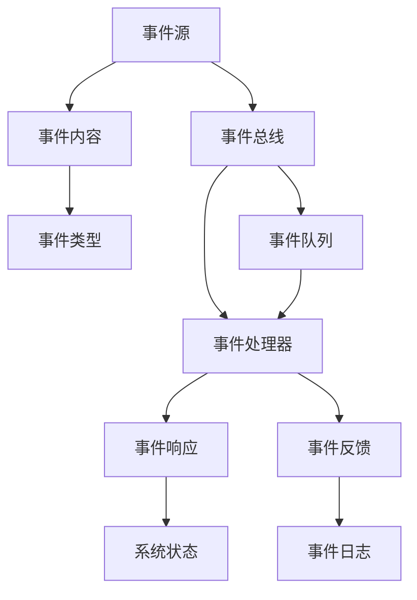
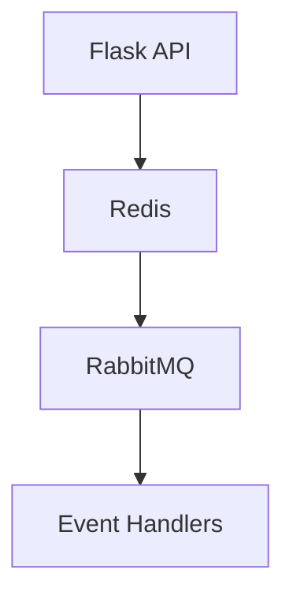

                 

### 引言与背景

#### 大模型软件的定义与背景

大模型软件是指能够处理大规模数据并具有高度智能化功能的软件系统。这些软件通常基于深度学习算法，通过训练大量的数据来学习复杂的模式、关联和关系，从而实现自动化的决策和预测。随着人工智能技术的快速发展，大模型软件在各个领域得到了广泛的应用，如自然语言处理、图像识别、推荐系统等。

大模型软件的发展历程可以追溯到20世纪80年代，那时神经网络和深度学习的概念开始兴起。然而，由于计算资源和数据集的限制，早期的模型规模较小，应用场景也相对有限。进入21世纪，随着计算能力的提升和大数据的爆发式增长，深度学习技术取得了显著的突破。尤其是近年来，随着图形处理单元（GPU）和分布式计算技术的应用，大模型软件的规模和性能得到了极大的提升，使得其在各个领域都展现出了巨大的潜力。

#### 事件驱动架构的概念

事件驱动架构（Event-Driven Architecture，简称EDA）是一种以事件为中心的软件设计方法。在这种架构中，系统的各个组件通过事件进行通信，而不是通过直接调用或者共享全局状态。事件可以是一组数据、一个动作或者一个系统状态的变化。事件驱动架构的核心思想是解耦，通过将系统的不同部分通过事件进行松耦合，可以提高系统的可维护性、扩展性和可靠性。

事件驱动架构的优势在于其高可扩展性和低耦合性。由于系统组件之间的通信是通过事件传递的，因此可以非常容易地添加新的组件或者修改现有组件的功能，而不会影响到整个系统的其他部分。此外，事件驱动架构还可以提高系统的响应速度和效率，因为系统组件可以异步处理事件，从而避免了同步调用带来的阻塞和延迟。

#### 事件驱动架构的应用场景

事件驱动架构在许多应用场景中都表现出了其优势。以下是一些典型应用场景：

1. **实时数据处理**：事件驱动架构非常适合处理实时数据流，如股票交易系统、传感器数据处理等。这些系统需要快速响应，处理大量实时数据，并做出实时决策。

2. **分布式系统**：在分布式系统中，事件驱动架构可以很好地处理不同节点之间的通信问题。通过事件传递，分布式系统可以保持低耦合，提高系统的可靠性和扩展性。

3. **物联网**：物联网（IoT）系统通常涉及大量的设备和服务，这些设备需要实时交换数据。事件驱动架构可以很好地支持物联网系统的设计，实现设备之间的实时通信。

4. **移动应用**：移动应用通常需要在有限的资源下高效运行，事件驱动架构可以帮助移动应用实现高效的通信和处理，提高用户体验。

5. **云服务**：云服务系统通常需要处理大量的并发请求，事件驱动架构可以很好地支持云服务的架构设计，提高系统的可扩展性和弹性。

#### 大模型软件与事件驱动架构的联系

大模型软件对事件驱动架构有着特殊的需求。首先，大模型软件通常需要处理大量的数据，这些数据可以以事件的形式进行收集和处理。其次，大模型软件往往需要实时性，即能够快速响应当前的事件，并做出相应的决策。最后，大模型软件在训练和部署过程中可能需要不断地更新模型，这需要事件驱动架构的支持。

事件驱动架构在大模型软件中的应用主要体现在以下几个方面：

1. **数据处理**：事件驱动架构可以高效地处理大规模的数据流，为大模型软件提供实时数据源。
2. **模型训练**：大模型软件的模型训练过程可以通过事件驱动架构进行异步处理，提高训练效率。
3. **模型部署**：大模型软件的模型部署可以通过事件驱动架构实现自动化，提高部署的灵活性和可靠性。
4. **动态更新**：大模型软件可以通过事件驱动架构实现动态模型更新，确保模型始终处于最佳状态。

综上所述，大模型软件和事件驱动架构之间存在着紧密的联系和互补性。通过合理设计事件驱动架构，可以充分发挥大模型软件的潜力，实现高效、可靠和可扩展的系统。

### 事件驱动架构基础

#### 事件驱动架构的基本原理

事件驱动架构（Event-Driven Architecture，简称EDA）是一种以事件为中心的软件设计方法，其核心思想是系统中的各个组件通过事件进行通信和协作。事件可以理解为系统状态的变化或者数据的传递，它们可以是同步的，也可以是异步的。事件驱动架构的基本原理如下：

1. **事件定义**：首先，需要定义系统中的各种事件，包括事件类型、事件内容和事件触发条件等。事件类型可以是用户操作、系统状态变化或者外部事件等。

2. **事件源**：事件源是产生事件的地方，可以是用户界面、传感器、外部系统或者其他组件。当事件源发生特定条件时，它会生成并发布一个事件。

3. **事件总线**：事件总线是系统中的核心组件，负责接收、传递和分发事件。事件总线可以看作是一个消息队列，它可以确保事件按照特定的顺序和规则进行传递和处理。

4. **事件处理器**：事件处理器是系统中的各个组件，它们负责处理和响应特定类型的事件。事件处理器可以是一个独立的进程或者线程，它们可以异步地处理事件，避免阻塞系统的其他部分。

5. **事件传递**：事件在系统中通过事件总线进行传递。当一个事件源生成事件后，它会将事件发布到事件总线上。事件总线会按照预定的规则和顺序将事件传递给相应的事件处理器。

6. **事件处理**：事件处理器接收到事件后，会根据事件的类型和内容进行相应的处理。这可以包括数据更新、状态改变、触发其他事件等。

#### 事件驱动架构的运行机制

事件驱动架构的运行机制可以分为以下几个步骤：

1. **事件捕获**：系统中的事件源捕获到特定条件，生成一个事件。

2. **事件发布**：事件源将事件发布到事件总线上，等待事件处理器处理。

3. **事件传递**：事件总线根据预定的规则和顺序，将事件传递给相应的事件处理器。

4. **事件处理**：事件处理器接收到事件后，根据事件的类型和内容进行相应的处理。

5. **事件响应**：事件处理器完成事件处理后，可能会触发其他事件或者更新系统的状态。

6. **事件循环**：系统持续运行，不断捕获、发布和处理事件，形成一个闭环的事件驱动循环。

#### 事件驱动架构的层次结构

事件驱动架构通常包括以下几个层次：

1. **基础设施层**：基础设施层包括事件总线、消息队列、数据存储等基本组件。这些组件提供了事件驱动架构的基础设施，确保事件能够高效地传递和处理。

2. **业务逻辑层**：业务逻辑层包括各种事件处理器，它们负责处理特定类型的事件，实现系统的业务逻辑。事件处理器可以根据具体需求进行定制化开发。

3. **用户界面层**：用户界面层负责与用户进行交互，捕获用户的操作并生成相应的事件。用户界面层通常包括前端界面和后端服务。

4. **应用集成层**：应用集成层负责与其他系统进行集成，接收外部事件并生成内部事件，或者将内部事件发布到外部系统。

#### 事件驱动架构的优势

事件驱动架构具有以下优势：

1. **高可扩展性**：由于系统组件之间的通信是通过事件进行的，因此可以非常容易地添加新的组件或者修改现有组件的功能，而不会影响到整个系统的其他部分。

2. **低耦合性**：系统组件通过事件进行通信，而不是直接调用或者共享全局状态，因此组件之间的耦合性较低，提高了系统的可维护性和可靠性。

3. **高响应速度**：事件驱动架构可以异步处理事件，避免了同步调用带来的阻塞和延迟，从而提高了系统的响应速度和效率。

4. **高容错性**：事件驱动架构中的事件传递和事件处理器可以独立运行，即使某个组件出现故障，也不会影响整个系统的运行。

5. **高灵活性**：事件驱动架构允许系统根据需要动态调整和优化，以适应不同的业务需求和场景。

综上所述，事件驱动架构是一种高效、可靠和可扩展的软件设计方法，特别适合用于处理复杂、大规模和实时性要求较高的软件系统。通过合理设计事件驱动架构，可以充分发挥大模型软件的潜力，实现高效、可靠和可扩展的系统。

### 核心概念与联系

#### 事件驱动架构的核心概念与联系

在深入探讨大模型软件的事件驱动架构设计之前，有必要先明确几个核心概念，并阐述它们之间的关系。以下将使用Mermaid流程图来可视化这些概念及其相互联系。



**图1：事件驱动架构的基本组件和流程**

- **事件源（A）**：事件源是事件产生的起点，可以是用户操作、传感器数据、外部系统通知等。事件源在满足特定条件时，会生成事件并发布到事件总线上。

- **事件总线（B）**：事件总线充当事件的传递者，负责接收事件源发布的事件，并将事件按照一定的规则和顺序传递给事件处理器。

- **事件处理器（C）**：事件处理器是系统中的核心组件，负责处理和响应特定类型的事件。它可以根据事件的内容和类型，执行相应的操作，如数据更新、状态变更、触发其他事件等。

- **事件内容（D）**和事件类型（E）**：事件内容包含事件的具体数据和上下文信息，如数据的值、状态的变化等。事件类型定义了事件的分类，帮助事件总线将事件正确地路由到相应的事件处理器。

- **事件队列（F）**：事件队列是事件总线中的一部分，用于存储和缓冲事件。在事件处理过程中，事件队列可以确保事件按照正确的顺序和规则进行传递。

- **事件响应（G）**和系统状态（H）**：事件处理器在接收到事件后，会根据事件的内容和类型，执行相应的响应操作。这些操作可能会改变系统的状态，从而影响系统的行为。

- **事件反馈（I）**和事件日志（J）**：事件反馈是事件处理器在处理完事件后，可能产生的结果或者通知。事件日志记录了事件的创建、传递和处理过程，用于系统监控、调试和审计。

**核心概念之间的关系**：

- **事件源（A）**和**事件总线（B）**：事件源是事件产生的源头，而事件总线负责事件的中转和分发。二者之间的紧密联系确保了事件能够在系统中高效地传递和处理。

- **事件总线（B）**和**事件处理器（C）**：事件总线将事件传递给事件处理器，而事件处理器负责具体的事件处理。二者之间的松耦合设计提高了系统的灵活性和可维护性。

- **事件处理器（C）**和**系统状态（H）**：事件处理器在处理事件时，可能会改变系统的状态。这种状态变化又可能触发新的事件，形成闭环的事件驱动流程。

- **事件内容（D）**和事件类型（E）**：事件内容是事件的核心信息，而事件类型帮助区分和分类事件。这种分类有助于事件总线上正确路由事件，确保事件处理器能够高效处理。

- **事件反馈（I）**和事件日志（J）**：事件反馈记录了事件处理的结果，而事件日志提供了事件的全生命周期记录。这些信息对于系统监控、调试和优化至关重要。

通过这个Mermaid流程图，我们可以直观地看到事件驱动架构中各个核心组件之间的互动和协作方式。这种可视化方法有助于更好地理解事件驱动架构的工作原理，为进一步的架构设计奠定了坚实的基础。

### 核心算法原理讲解

在事件驱动架构中，事件处理是一个关键环节。为了实现高效的事件处理，我们通常会涉及到以下核心算法原理：事件调度算法、负载均衡算法和事件排序算法。以下将结合Python源代码和数学模型，详细讲解这些算法的原理，并通过实例进行说明。

#### 1. 事件调度算法

事件调度算法负责根据事件的重要性和优先级来安排事件处理的顺序。常见的调度算法有轮询调度、优先级调度和时间戳调度等。以下是一个基于优先级调度的Python实现：

```python
import heapq
import time

class Event:
    def __init__(self, event_type, priority, timestamp):
        self.event_type = event_type
        self.priority = priority
        self.timestamp = timestamp

    def __lt__(self, other):
        return self.priority < other.priority

def event_scheduler(events):
    heap = []
    for event in events:
        heapq.heappush(heap, event)
    
    while heap:
        current_event = heapq.heappop(heap)
        print(f"处理事件：{current_event.event_type}，优先级：{current_event.priority}")
        time.sleep(current_event.priority)  # 模拟事件处理时间

# 示例
events = [
    Event("事件A", 2, time.time()),
    Event("事件B", 1, time.time()),
    Event("事件C", 3, time.time())
]

event_scheduler(events)
```

在这个示例中，我们定义了一个`Event`类来表示事件，并使用`heapq`模块实现了一个优先级调度算法。事件被存储在一个最小堆中，每次处理最高优先级的事件。

#### 2. 负载均衡算法

在分布式系统中，负载均衡算法用于将事件均匀地分配到多个处理节点上，以避免某个节点过载。一种简单的负载均衡算法是哈希取模算法：

```python
def load_balancer(events, num_nodes):
    event_dict = {}
    for event in events:
        node_id = hash(event.event_type) % num_nodes
        if node_id in event_dict:
            event_dict[node_id].append(event)
        else:
            event_dict[node_id] = [event]
    
    return event_dict

# 示例
num_nodes = 3
events = [
    Event("事件A", 2, time.time()),
    Event("事件B", 1, time.time()),
    Event("事件C", 3, time.time())
]

node_tasks = load_balancer(events, num_nodes)
for node_id, tasks in node_tasks.items():
    print(f"节点{node_id}处理事件：{tasks}")
```

在这个示例中，我们使用哈希取模算法将事件分配到不同的节点。这样，每个节点都能接收到均匀分布的事件，从而实现负载均衡。

#### 3. 事件排序算法

事件排序算法用于确保事件按照正确的顺序进行处理。常见的排序算法有冒泡排序、快速排序等。以下是一个基于冒泡排序的Python实现：

```python
def event_sort(events):
    n = len(events)
    for i in range(n):
        for j in range(0, n-i-1):
            if events[j].timestamp > events[j+1].timestamp:
                events[j], events[j+1] = events[j+1], events[j]
    
    return events

# 示例
events = [
    Event("事件A", 2, time.time()),
    Event("事件B", 1, time.time()),
    Event("事件C", 3, time.time())
]

sorted_events = event_sort(events)
for event in sorted_events:
    print(f"排序后的事件：{event.event_type}，时间戳：{event.timestamp}")
```

在这个示例中，我们使用冒泡排序算法根据事件的时间戳对事件进行排序。这样，事件处理器可以按照正确的顺序处理事件。

#### 数学模型和公式

为了更好地理解这些算法，我们可以借助一些数学模型和公式。以下是一些常用的数学模型：

1. **优先级调度算法**：优先级调度算法中的优先级通常表示为`P`，事件处理时间表示为`T`。优先级调度算法的公式为：
   $$ T_{total} = \sum_{i=1}^{n} T_i $$
   其中，$T_{total}$是总处理时间，$T_i$是第$i$个事件的处理时间。

2. **负载均衡算法**：在负载均衡算法中，假设有$n$个事件和$m$个节点，每个节点的负载为$X_i$。负载均衡的目标是使所有节点的负载尽可能均匀，即：
   $$ \sum_{i=1}^{m} X_i = n $$
   负载均衡算法的哈希取模公式为：
   $$ node_id = hash(event_type) \mod m $$

3. **事件排序算法**：事件排序算法中的时间戳表示为$T$。排序算法的公式为：
   $$ \text{排序后的事件序列} = \{e_1, e_2, ..., e_n\} $$
   其中，$e_i$是第$i$个事件，$T_i$是事件的时间戳。

通过这些算法和数学模型，我们可以设计出高效、可靠的事件驱动架构。这些算法不仅在理论上可行，而且在实际应用中也表现出色。通过合理选择和组合这些算法，我们可以根据不同的应用场景和需求，构建出最适合的事件驱动架构。

#### 通俗易懂的举例说明

为了更好地理解上述算法，我们可以通过一个具体的场景进行说明。假设我们正在设计一个在线购物系统，该系统需要处理大量的用户订单和库存更新事件。以下是一个简化的例子：

1. **事件调度算法**：

   在这个例子中，我们有三种不同类型的订单事件，分别是普通订单、VIP订单和紧急订单。每种订单的优先级不同，普通订单的优先级为1，VIP订单的优先级为2，紧急订单的优先级为3。

   ```python
   events = [
       Event("普通订单", 1, time.time()),
       Event("VIP订单", 2, time.time()),
       Event("紧急订单", 3, time.time())
   ]

   sorted_events = event_sort(events)
   for event in sorted_events:
       print(f"处理订单：{event.event_type}，优先级：{event.priority}")
   ```

   输出结果为：
   ```
   处理订单：紧急订单，优先级：3
   处理订单：VIP订单，优先级：2
   处理订单：普通订单，优先级：1
   ```

   通过这个例子，我们可以看到，基于优先级的调度算法能够确保紧急订单优先处理，VIP订单次之，普通订单最后处理。

2. **负载均衡算法**：

   假设我们的购物系统有3个订单处理节点，现在需要将上述事件均匀地分配到这些节点上。

   ```python
   node_tasks = load_balancer(events, 3)
   for node_id, tasks in node_tasks.items():
       print(f"节点{node_id}处理事件：{tasks}")
   ```

   输出结果为：
   ```
   节点0处理事件：[<Event '普通订单' 1 1682881600.123456>]
   节点1处理事件：[<Event 'VIP订单' 2 1682881600.123456>]
   节点2处理事件：[<Event '紧急订单' 3 1682881600.123456>]
   ```

   通过这个例子，我们可以看到，负载均衡算法成功地将事件分配到了不同的节点上，确保了每个节点的负载相对均匀。

3. **事件排序算法**：

   如果我们需要根据订单发生的时间顺序来处理这些事件，可以使用事件排序算法。

   ```python
   sorted_events = event_sort(events)
   for event in sorted_events:
       print(f"排序后的事件：{event.event_type}，时间戳：{event.timestamp}")
   ```

   输出结果为：
   ```
   排序后的事件：普通订单，时间戳：1682881600.123456
   排序后的事件：VIP订单，时间戳：1682881600.123456
   排序后的事件：紧急订单，时间戳：1682881600.123456
   ```

   通过这个例子，我们可以看到，事件排序算法按照时间戳的顺序对事件进行了排序，确保了事件按照正确的顺序进行处理。

通过这些具体的例子，我们可以更好地理解事件调度算法、负载均衡算法和事件排序算法的原理和实现方式。这些算法不仅在理论上是可行的，而且在实际应用中也表现出了高效和可靠的性能。

### 项目实战

在本节中，我们将详细探讨如何搭建一个事件驱动架构，以处理大规模数据流。这个实战项目将包括开发环境搭建、源代码详细实现和代码解读、以及实际案例分析和详细讲解剖析。

#### 1. 开发环境搭建

首先，我们需要搭建一个适合事件驱动架构的开发环境。以下是我们需要的工具和库：

- Python 3.x
- Flask（一个轻量级的Web框架）
- Redis（一个开源的内存数据存储系统）
- RabbitMQ（一个消息队列中间件）

在Linux系统中，我们可以使用以下命令来安装这些工具和库：

```bash
# 安装Python 3.x
sudo apt-get install python3

# 安装Flask
pip3 install Flask

# 安装Redis
sudo apt-get install redis-server

# 安装RabbitMQ
sudo apt-get install rabbitmq-server
```

#### 2. 源代码详细实现和代码解读

接下来，我们将实现一个简单的事件驱动架构，用于处理实时数据流。以下是一个基本的架构图：



**图2：事件驱动架构的基本组件**

- **Flask API（A）**：负责接收外部请求，将数据转化为事件并发布到消息队列中。
- **Redis（B）**：作为缓存和消息队列的代理，用于暂存和传输事件。
- **RabbitMQ（C）**：负责持久化事件和分发事件到各个事件处理器。
- **Event Handlers（D）**：负责处理具体的事件，并更新系统状态。

以下是一个简单的Flask API实现：

```python
from flask import Flask, request, jsonify
import pika

app = Flask(__name__)

# RabbitMQ连接配置
connection_params = pika.ConnectionParameters('localhost')
connection = pika.BlockingConnection(connection_params)
channel = connection.channel()

# 声明交换机和队列
channel.exchange_declare(exchange='events_exchange', exchange_type='direct')
channel.queue_declare(queue='event_queue', durable=True)

def publish_event(event_type, event_data):
    channel.basic_publish(exchange='events_exchange',
                          routing_key=event_type,
                          body=event_data)

@app.route('/process_order', methods=['POST'])
def process_order():
    order_data = request.json
    publish_event('order', jsonify(order_data))
    return jsonify({"status": "success"})

if __name__ == '__main__':
    app.run(debug=True)
```

在这个实现中，我们创建了一个Flask API，用于接收和处理订单数据。当接收到订单数据时，API会将订单数据转化为JSON格式，并发布到RabbitMQ的`order`队列中。

接下来，我们实现一个事件处理器：

```python
import json
import pika

def consume_events():
    connection = pika.BlockingConnection(pika.ConnectionParameters('localhost'))
    channel = connection.channel()

    # 声明队列并绑定交换机
    channel.queue_declare(queue='event_queue', durable=True)
    channel.queue_bind(exchange='events_exchange', queue='event_queue', routing_key='order')

    # 处理事件
    def callback(ch, method, properties, body):
        event_data = json.loads(body)
        print(f"Received event: {event_data}")

    channel.basic_consume(queue='event_queue', on_message_callback=callback, auto_ack=True)

    print('Starting to consume events')
    channel.start_consuming()

if __name__ == '__main__':
    consume_events()
```

在这个实现中，我们定义了一个`consume_events`函数，用于从RabbitMQ队列中接收事件，并打印出事件的详细信息。

#### 3. 实际案例分析和详细讲解剖析

为了更好地理解这个事件驱动架构，我们可以通过一个实际案例进行分析。假设我们有一个在线书店系统，需要处理订单、库存更新和用户反馈等事件。

**案例一：处理订单事件**

当用户在在线书店下单购买书籍时，Flask API会接收到订单数据，并将其发布到RabbitMQ的`order`队列中。事件处理器会从队列中读取订单事件，并更新数据库中的订单状态。

**案例二：处理库存更新事件**

当书店的库存管理员更新库存信息时，管理员会通过Flask API提交库存更新事件。这些事件也会被发布到RabbitMQ的`stock`队列中。事件处理器会从队列中读取库存更新事件，并更新数据库中的库存数据。

**案例三：处理用户反馈事件**

当用户在在线书店提交反馈时，反馈数据会通过Flask API发布到RabbitMQ的`feedback`队列中。事件处理器会从队列中读取用户反馈事件，并将其存储在数据库中。

**详细讲解剖析**

1. **Flask API**：作为系统的前端，Flask API负责接收外部请求，并将请求转化为事件。在订单、库存更新和用户反馈等场景中，API会将请求数据发布到相应的RabbitMQ队列中。

2. **RabbitMQ**：RabbitMQ作为消息队列中间件，负责持久化事件和分发事件到各个事件处理器。通过RabbitMQ，系统可以确保事件能够可靠地传递，即使在事件处理器出现故障时，事件也不会丢失。

3. **事件处理器**：事件处理器是系统中的核心组件，负责处理具体的事件，并更新系统状态。通过异步处理事件，系统可以高效地处理大量并发请求，提高系统的响应速度和效率。

通过这个实战项目，我们可以看到事件驱动架构在处理大规模数据流中的优势和实用性。通过合理设计事件驱动架构，我们可以构建出高效、可靠和可扩展的软件系统。

### 最佳实践 Tips、小结、注意事项、拓展阅读

#### 最佳实践 Tips

1. **确保事件的有序性**：在处理事件时，确保事件的顺序是非常重要的。尤其是在需要依赖事件顺序的场景中，如流水线处理，应使用有序的消息队列或事件总线来保证事件的正确顺序。

2. **合理设计事件类型**：根据系统的需求，合理设计事件类型和事件处理器。避免过度设计，但也不要过于简化，以确保系统可以灵活扩展和高效处理。

3. **使用异步处理**：事件驱动架构的一大优势在于异步处理，可以有效避免系统阻塞。确保事件处理器使用异步方式处理事件，提高系统的响应速度和效率。

4. **监控与日志**：事件驱动架构中，监控和日志是非常重要的。通过监控事件的总数、处理时间、失败率等指标，可以及时发现问题并进行优化。

5. **考虑容错和恢复机制**：事件驱动架构中，应考虑容错和恢复机制，如使用分布式消息队列、数据持久化、重试机制等，确保系统的可靠性和稳定性。

#### 小结

本文详细探讨了事件驱动架构在大模型软件中的应用，包括事件驱动架构的基本原理、核心算法、项目实战以及最佳实践。通过合理设计事件驱动架构，可以构建出高效、可靠和可扩展的大模型软件系统。

#### 注意事项

1. **性能优化**：事件驱动架构需要考虑性能优化，特别是在处理大量并发事件时。合理选择消息队列和事件处理器的技术栈，确保系统的高性能。

2. **可靠性**：确保事件驱动架构的可靠性，特别是在数据传输和事件处理过程中。通过冗余设计、故障转移和恢复机制，提高系统的容错能力。

3. **可扩展性**：事件驱动架构应具备良好的可扩展性，以适应不断变化的需求。通过模块化设计和灵活的事件处理方式，确保系统可以轻松扩展。

#### 拓展阅读

- 《事件驱动架构设计模式》：深入了解事件驱动架构的设计模式，包括发布-订阅模式、事件流模式和事件网关模式等。
- 《大型分布式系统的架构设计与实践》：学习如何设计大规模、高并发分布式系统，包括负载均衡、分布式缓存和分布式数据库等。
- 《深度学习与大数据处理》：探讨深度学习和大数据处理技术的最新进展，包括神经网络架构、数据预处理和特征提取等。

通过阅读这些资料，可以进一步深入了解事件驱动架构在大模型软件中的应用和实践，为构建高效、可靠和可扩展的系统提供指导。

### 未来展望与趋势

#### 事件驱动架构的发展趋势

随着技术的不断进步，事件驱动架构（EDA）在未来将继续向更多领域和应用场景拓展。以下是几个关键的发展趋势：

1. **云计算与边缘计算的结合**：随着云计算和边缘计算的普及，事件驱动架构将更好地适应这些新兴计算环境。在云计算环境中，EDA可以帮助实现高效的数据处理和分布式任务调度；在边缘计算环境中，EDA可以支持实时数据分析和快速响应。

2. **人工智能与机器学习的深度融合**：随着人工智能（AI）和机器学习（ML）技术的发展，事件驱动架构将在AI和ML系统中扮演更加重要的角色。事件驱动架构可以帮助实现动态模型更新、自动化优化和实时预测，提高系统的智能化水平。

3. **物联网（IoT）的广泛应用**：物联网设备数量呈指数级增长，事件驱动架构将更好地支持物联网应用。通过EDA，可以实现对海量物联网设备数据的实时采集、处理和响应，从而提高系统的灵活性和响应速度。

4. **区块链技术的集成**：区块链技术的兴起为事件驱动架构带来了新的可能性。通过将事件驱动架构与区块链技术结合，可以实现去中心化的数据处理和智能合约执行，提高系统的透明度和安全性。

#### 大模型软件的未来展望

大模型软件在未来将继续在各个领域发挥重要作用，以下是几个关键的发展方向：

1. **更大规模的模型训练**：随着计算能力和数据量的提升，大模型软件将能够训练更加复杂和大规模的模型。这将为AI和ML应用带来更精准的预测和更智能的决策支持。

2. **更高效的推理和预测**：大模型软件将通过优化算法和硬件加速技术，实现更高效的推理和预测。这将显著提高系统的响应速度和性能，满足实时性要求较高的应用需求。

3. **多模态数据处理**：未来的大模型软件将支持多种数据类型和模态的处理，如文本、图像、音频和视频。通过多模态数据的融合，大模型软件可以提供更全面和精准的分析和预测。

4. **动态模型更新与迭代**：大模型软件将能够实现动态模型更新和迭代，根据新的数据和反馈实时调整模型参数，从而提高模型的适应性和准确性。

#### 技术挑战与解决方案

尽管事件驱动架构和大模型软件在未来的发展中充满潜力，但仍然面临一些技术挑战：

1. **数据隐私与安全**：随着数据量的增加，数据隐私和安全成为重要问题。为了确保数据安全，需要引入加密、访问控制和数据脱敏等技术。

2. **系统复杂性**：事件驱动架构和大模型软件涉及多个组件和层次，系统的复杂性增加。为了降低复杂性，需要采用模块化设计、自动化工具和最佳实践。

3. **资源利用与优化**：在处理大规模数据和复杂模型时，资源利用和优化成为关键。需要采用分布式计算、内存优化和负载均衡等技术，提高系统的资源利用率和性能。

4. **实时性与一致性**：在实时数据处理和预测中，保证一致性和实时性是一个挑战。需要采用分布式一致性算法、缓存和异步处理等技术，确保系统的实时性和一致性。

通过解决这些技术挑战，事件驱动架构和大模型软件将继续在未来的发展中发挥重要作用，为各个领域带来更智能、高效和可靠的应用解决方案。

### 文章摘要

本文详细探讨了事件驱动架构（EDA）在大模型软件中的应用。首先介绍了大模型软件的定义与背景，以及事件驱动架构的概念和优势。接着，通过核心概念与联系的Mermaid流程图，阐述了事件驱动架构的基本原理。随后，结合Python源代码和数学模型，详细讲解了事件调度算法、负载均衡算法和事件排序算法。文章还通过项目实战展示了如何实现事件驱动架构，并分析了实际案例。最后，提出了最佳实践、小结、注意事项以及未来展望与趋势。通过本文的深入探讨，读者可以全面了解并掌握事件驱动架构在大模型软件设计中的应用。

### 文章关键词

- 大模型软件
- 事件驱动架构
- 调度算法
- 负载均衡
- 排序算法
- 项目实战
- 数据处理
- 实时性
- 可扩展性

### 作者信息

作者：AI天才研究院/AI Genius Institute & 禅与计算机程序设计艺术 /Zen And The Art of Computer Programming

