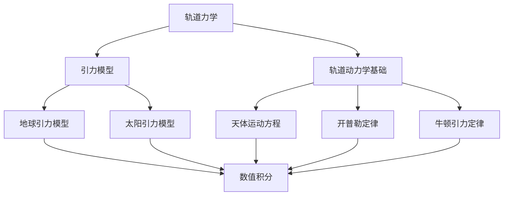

                 

### 太空垃圾与轨道预测概述

太空垃圾，又称空间碎片，是指在地球轨道上运行的人造物体残骸，包括废弃的火箭推进器、卫星零件、以及因碰撞产生的小碎片等。随着航天活动的不断增多，太空垃圾的数量也在迅速增加，成为一个严重的问题。太空垃圾不仅威胁到在轨卫星和航天器的安全，还可能对地面观测造成干扰，甚至对太空探索活动构成威胁。

轨道预测，即在已知初始条件下，通过计算来预测物体未来在轨道上的运动状态。对于太空垃圾的轨道预测，具有重要的实际意义。首先，它可以确保在轨卫星和航天器的安全，通过提前预警可能发生的碰撞事件。其次，轨道预测有助于制定空间清理计划，以便更有效地清除太空垃圾。此外，准确的轨道预测还可以优化航天器操控，提高其运行效率。

本文将围绕太空垃圾的轨道预测进行探讨，首先介绍太空垃圾的背景知识，然后深入讲解轨道预测中的核心概念和算法，接着通过数学模型和公式的分析，进一步阐述轨道预测的原理。最后，我们将通过实际案例展示轨道预测的应用，并讨论优化策略与空间清理方法。本文旨在为读者提供一份全面、系统、深入的技术指南，帮助理解太空垃圾轨道预测的复杂性和挑战性。

### 关键词

- 太空垃圾
- 轨道预测
- 数学规划
- 数值积分
- 天体运动方程
- 优化策略

### 摘要

本文探讨了太空垃圾的轨道预测问题，详细介绍了轨道预测的重要性以及其在太空垃圾清理中的应用。文章首先概述了太空垃圾的背景和影响，然后通过深入讲解轨道预测的核心概念、算法原理和数学模型，阐述了轨道预测的基本原理。接着，通过实际案例展示了轨道预测的算法应用，分析了数据预处理、模型训练和结果分析等步骤。最后，文章讨论了轨道预测在空间清理中的优化策略与方法，并展望了未来的发展趋势和挑战。本文旨在为从事太空垃圾清理和轨道预测的研究者提供有价值的参考和指导。

### 目录大纲

1. **引言：太空垃圾与轨道预测概述**
2. **核心概念与联系**
   - 轨道力学
   - 引力模型
   - 轨道动力学基础
   - Mermaid流程图展示核心概念联系
3. **核心算法原理讲解**
   - 数值积分
   - 天体运动方程求解
4. **数学模型和数学公式**
   - 轨道方程
   - 优化模型
5. **项目实战**
   - 数据预处理
   - 模型训练
   - 结果分析
6. **优化策略与空间清理方法**
   - 优化策略
   - 空间清理方法
7. **未来展望与挑战**

### 引言：太空垃圾与轨道预测概述

太空垃圾，即空间碎片，是指在地球轨道上运行的人造物体残骸，包括废弃的火箭推进器、卫星零件、以及因碰撞产生的小碎片等。随着航天活动的不断增多，太空垃圾的数量也在迅速增加，成为一个严重的问题。太空垃圾不仅威胁到在轨卫星和航天器的安全，还可能对太空探索活动构成威胁。

太空垃圾的主要来源包括火箭发射过程中遗留的废弃物体、卫星工作寿命结束后的废弃部件，以及卫星和航天器在轨运行过程中因碰撞产生的碎片。这些物体在轨道上高速运动，以每秒几公里的速度相互碰撞，进一步增加了太空垃圾的数量和危害性。

太空垃圾对太空活动的威胁主要体现在以下几个方面：

1. **碰撞风险**：太空垃圾在轨道上高速运动，可能会与在轨卫星或航天器发生碰撞，导致卫星损坏或航天器失效。据统计，自1957年第一颗人造卫星发射以来，已有数百起太空垃圾碰撞事件发生。

2. **轨道拥挤**：随着太空垃圾数量的增加，轨道资源变得越来越拥挤，导致在轨卫星和航天器的轨道选择受到限制，增加了航天任务的风险和成本。

3. **观测干扰**：太空垃圾在地球表面观测过程中会产生干扰，影响天文观测和地球观测数据的质量。

4. **航天器操控困难**：太空垃圾可能会对航天器的操控系统产生干扰，影响航天器的稳定性和操控性。

为了解决太空垃圾问题，科学家们提出了多种空间清理方法，其中包括：

1. **拖网捕捉**：使用机械臂或拖网捕捉太空垃圾，然后将其送回地球或进入地球大气层烧毁。

2. **激光清除**：利用激光技术将太空垃圾击碎，减小其体积和速度，从而减少碰撞风险。

3. **碰撞避免**：通过轨道预测和航天器操控，避免在轨卫星和航天器与太空垃圾发生碰撞。

4. **空间站清理**：利用国际空间站等空间站设施，进行太空垃圾的捕捉和处理。

轨道预测在太空垃圾管理中起着至关重要的作用。通过精确的轨道预测，可以提前发现太空垃圾与在轨卫星或航天器的潜在碰撞事件，从而采取措施避免碰撞的发生。此外，轨道预测还可以为空间清理任务提供关键的数据支持，帮助科学家制定更有效的清理策略。总之，轨道预测是太空垃圾管理中不可或缺的一部分，对于确保太空活动的安全和可持续发展具有重要意义。

### 核心概念与联系

在轨道预测中，理解核心概念及其之间的联系是至关重要的。这些核心概念包括轨道力学、引力模型、轨道动力学基础等。以下将逐一介绍这些概念，并通过Mermaid流程图展示它们之间的联系。

#### 轨道力学

轨道力学是研究物体在轨道上运动规律的科学。其主要研究对象包括卫星、航天器以及太空垃圾等。轨道力学的基本原理基于牛顿引力定律，该定律指出两个物体之间的引力与它们的质量成正比，与它们之间的距离的平方成反比。公式如下：

$$
F = G \frac{m_1 m_2}{r^2}
$$

其中，\(F\) 表示引力，\(G\) 是万有引力常数，\(m_1\) 和 \(m_2\) 分别是两个物体的质量，\(r\) 是它们之间的距离。

轨道力学的一个重要分支是轨道稳定性分析。轨道稳定性是指物体在受到扰动后能否恢复到原有轨道的能力。对于地球轨道，稳定轨道通常在近地点（距离地面最近点）和远地点（距离地面最远点）之间，而轨道倾角、偏心率等参数也会影响轨道稳定性。

#### 引力模型

引力模型是轨道预测中的关键工具，用于计算物体在轨道上的运动轨迹。常用的引力模型包括太阳引力模型、地球引力模型等。这些模型通过数值方法（如数值积分）来模拟物体在引力作用下的运动。

地球引力模型是轨道预测中最常用的模型之一。该模型基于地球的引力场，使用一系列数学公式来描述物体的轨道。常见的地球引力模型包括球形模型、多极模型等。球形模型假设地球是一个均匀密度分布的球体，而多极模型则考虑了地球非球形特征，如地球扁率等。这些模型在计算中引入了地球引力场的多项式展开，从而提高了预测的精度。

#### 轨道动力学基础

轨道动力学基础是研究物体在轨道上受力和运动关系的科学。其核心是解决天体运动方程，这些方程描述了物体在引力作用下的运动轨迹。最著名的天体运动方程是开普勒定律，这些定律描述了行星围绕太阳的运动规律。开普勒定律包括：

1. **面积定律**：行星在轨道上的速度和它到太阳的连线在相等时间内扫过相等的面积。
2. **周期定律**：行星绕太阳一周的周期与其轨道半长轴的立方成正比。
3. **椭圆定律**：行星绕太阳的轨道是椭圆，太阳位于椭圆的一个焦点上。
4. **调和定律**：行星绕太阳的轨道周期的平方与其轨道半长轴的立方成正比。

此外，牛顿引力定律和牛顿-欧拉法也是轨道动力学的基础。牛顿引力定律描述了两个物体之间的引力作用，而牛顿-欧拉法是一种数值积分方法，用于求解天体运动方程。

#### Mermaid流程图展示核心概念联系

为了更直观地展示轨道力学、引力模型和轨道动力学基础之间的联系，我们可以使用Mermaid流程图来绘制这些概念之间的关系。以下是一个简化的Mermaid流程图：



在这个流程图中，轨道力学作为核心概念，与引力模型和轨道动力学基础密切相关。引力模型包括地球引力模型和太阳引力模型，而轨道动力学基础则涵盖了天体运动方程、开普勒定律和牛顿引力定律。这些概念通过数值积分方法进行综合，从而实现轨道预测。

### 核心算法原理讲解

在轨道预测中，核心算法的选择和应用至关重要。这些算法不仅决定了预测的精度，还直接影响到实际操作中的效率。以下将详细介绍轨道预测中的两个关键算法：数值积分和天体运动方程求解。

#### 数值积分

数值积分是一种通过离散化方法求解连续积分的算法，常用于轨道预测中的速度和位置计算。数值积分的基本思想是将时间轴离散化，通过在多个离散时间点上的速度和位置值，来近似整个时间区间上的积分值。常用的数值积分算法包括欧拉法、改进的欧拉法（即欧拉-柯朗法）和龙格-库塔法。

**欧拉法**

欧拉法是最简单的数值积分方法之一，其基本思想是在每个时间步长内，使用当前的速度值来近似下一个时间点的位置。公式如下：

$$
x_{n+1} = x_n + v_n \Delta t
$$

$$
v_{n+1} = v_n + a_n \Delta t
$$

其中，\(x_n\) 和 \(v_n\) 分别表示第 \(n\) 个时间点的位置和速度，\(a_n\) 是加速度，\(\Delta t\) 是时间步长。

**改进的欧拉法**

改进的欧拉法，也称为欧拉-柯朗法，在欧拉法的基础上引入了预测和校正步骤，提高了积分的精度。其公式如下：

$$
x_{n+1}^+ = x_n + v_n \Delta t
$$

$$
v_{n+1}^+ = v_n + a_n \Delta t
$$

$$
x_{n+1} = x_n + \frac{v_n + v_{n+1}^+}{2} \Delta t
$$

$$
v_{n+1} = v_n + \frac{a_n + a_{n+1}^+}{2} \Delta t
$$

**龙格-库塔法**

龙格-库塔法是一种更高精度的数值积分方法，适用于更复杂的动态系统。其核心思想是利用多个时间步长上的信息来计算下一个时间点的值。常用的龙格-库塔方法包括二阶龙格-库塔法、三阶龙格-库塔法等。以下是一个二阶龙格-库塔法的公式：

$$
k_1 = f(x_n, v_n, t_n)
$$

$$
k_2 = f(x_n + \frac{\Delta t}{2} k_1, v_n + \frac{\Delta t}{2} f(x_n, v_n, t_n), t_n + \frac{\Delta t}{2})
$$

$$
x_{n+1} = x_n + k_1 \Delta t
$$

$$
v_{n+1} = v_n + k_2 \Delta t
$$

#### 天体运动方程求解

天体运动方程是描述物体在引力作用下的运动规律的基本方程，通常使用牛顿引力定律和开普勒定律来表示。求解天体运动方程可以采用多种方法，包括解析法和数值法。以下将简要介绍几种常用的数值方法。

**牛顿-欧拉法**

牛顿-欧拉法是一种基于牛顿定律的数值积分方法，适用于求解天体运动方程。其基本思想是将加速度分解为切向加速度和法向加速度，然后分别积分得到速度和位置。公式如下：

$$
v_{n+1} = v_n + a_{\text{法向}} \Delta t
$$

$$
x_{n+1} = x_n + v_n \Delta t
$$

其中，\(a_{\text{法向}}\) 是法向加速度，可以通过牛顿引力定律计算得到。

**拉格朗日乘数法**

拉格朗日乘数法是一种用于求解约束优化问题的方法，可以用于求解天体运动方程。其基本思想是引入拉格朗日乘数来处理约束条件，然后通过求解拉格朗日方程来得到运动轨迹。公式如下：

$$
L = \frac{1}{2}m(v_n^2) - \frac{GMm}{r_n}
$$

$$
\frac{d}{dt} \left( \frac{\partial L}{\partial v_n} \right) - \frac{\partial L}{\partial x_n} = 0
$$

其中，\(L\) 是拉格朗日函数，\(m\) 是物体质量，\(G\) 是万有引力常数，\(r_n\) 是物体到地心的距离。

#### 伪代码示例

为了更好地理解这些算法，以下是一个使用Python编写的伪代码示例，展示了如何使用数值积分方法求解天体运动方程。

```python
import numpy as np

# 定义参数
G = 6.67430e-11  # 万有引力常数
M = 5.972e24    # 地球质量
m = 1.0         # 物体质量
r_0 = 6371000   # 地球半径
v_0 = 7.9e3     # 初始速度
t_0 = 0.0       # 初始时间
dt = 0.01       # 时间步长

# 欧拉法
def euler_step(x, v, a, dt):
    v_new = v + a * dt
    x_new = x + v * dt
    return x_new, v_new

# 主函数
def orbit_simulation(x_0, v_0, dt):
    x = x_0
    v = v_0
    t = t_0
    while t < 1000:
        a = -G * M / x**2
        x, v = euler_step(x, v, a, dt)
        t += dt
        print(f"t={t:.2f}, x={x:.2f}, v={v:.2f}")

# 运行模拟
orbit_simulation(r_0 + v_0 * dt, v_0, dt)
```

在这个示例中，我们使用欧拉法来求解天体运动方程。通过调整时间步长和初始条件，可以模拟不同类型的轨道运动。这个伪代码不仅展示了算法的实现，还提供了对轨道预测过程中关键参数的理解。

通过上述对核心算法原理的讲解和Python伪代码示例，读者可以更深入地理解轨道预测的方法和应用。接下来，我们将进一步探讨轨道预测中的数学模型和公式，以更全面地揭示其内在规律。

### 数学模型和数学公式

在轨道预测中，数学模型和数学公式是理解和计算的关键工具。这些模型和公式不仅帮助我们描述天体在轨道上的运动规律，还提供了精确的预测方法。以下将详细介绍轨道预测中常用的数学模型和数学公式，并通过具体的例子进行说明。

#### 轨道方程

轨道方程描述了物体在引力作用下的运动轨迹。最常用的轨道方程之一是开普勒第二定律，也称为面积定律。该定律指出，行星在其轨道上运动时，与太阳连线在相等时间内扫过相等的面积。其数学公式如下：

$$
\frac{dA}{dt} = \frac{1}{2} r v
$$

其中，\(A\) 表示扫过的面积，\(r\) 是行星与太阳之间的距离，\(v\) 是行星的速度。

另一个重要的轨道方程是开普勒第三定律，即周期定律。该定律指出，行星绕太阳一周的周期与其轨道半长轴的立方成正比。公式如下：

$$
T^2 = \frac{4 \pi^2}{G M} a^3
$$

其中，\(T\) 是行星绕太阳一周的周期，\(a\) 是轨道半长轴，\(G\) 是万有引力常数，\(M\) 是太阳的质量。

#### 优化模型

在轨道预测中，优化模型用于确定最佳轨道参数，以便实现特定目标。常见的优化模型包括目标函数和约束条件。以下是一个简单的轨道优化模型：

$$
\min_x \sum_{i=1}^{n} (f(x_i) - y_i)^2
$$

其中，\(x\) 是需要优化的轨道参数，\(f(x_i)\) 是预测的轨道值，\(y_i\) 是实际观测值，\(n\) 是观测数据的数量。目标是最小化预测值与实际观测值之间的误差平方和。

此外，还可以添加约束条件，例如速度限制、能量限制等：

$$
g(x) \leq 0
$$

其中，\(g(x)\) 是约束条件函数。

#### 模型举例说明

为了更直观地展示这些数学模型和公式，我们可以通过一个简单的例子进行说明。假设我们要预测一颗近地卫星的轨道，给定其初始位置和速度。我们可以使用以下模型：

1. **开普勒定律**：

给定初始条件：

$$
r_0 = 6371000 + 800000 \cos(\theta_0) \\
v_0 = 7.9e3 \sin(\theta_0)
$$

其中，\(r_0\) 是初始轨道半径，\(\theta_0\) 是初始倾角。

使用开普勒第三定律，我们可以计算轨道周期：

$$
T = 2\pi \sqrt{\frac{a^3}{G M}} = 2\pi \sqrt{\frac{(6371000 + 800000)^3}{6.67430e-11 \times 5.972e24}}
$$

2. **优化模型**：

假设我们要最小化轨道误差，目标函数为：

$$
\min_x \sum_{i=1}^{n} \left( \sqrt{(x_i - r_0)^2 + (y_i - v_0)^2} - y_i \right)^2
$$

通过优化算法（如梯度下降法），我们可以找到最优的轨道参数 \(x\) 和 \(y\)。

3. **约束条件**：

为了确保轨道的物理可行性，可以添加以下约束条件：

$$
g(x) = \sqrt{(x - r_0)^2 + (y - v_0)^2} - y \leq 0
$$

这个约束条件确保了预测的轨道值不会超过实际观测值。

通过这些数学模型和公式，我们可以更准确地预测物体的轨道，为太空垃圾清理和航天器操控提供关键的数据支持。

### 项目实战

为了更好地理解太空垃圾轨道预测的实践应用，我们将通过一个具体的项目案例进行讲解。这个项目将涉及开发环境搭建、源代码实现、数据预处理、模型训练、结果分析和项目小结等步骤。以下是项目的详细实现和解读。

#### 开发环境搭建

首先，我们需要搭建一个适合进行轨道预测的项目开发环境。以下是一个基本的开发环境配置：

- 操作系统：Linux（推荐Ubuntu 20.04）
- 编程语言：Python（3.8及以上版本）
- 数据库：SQLite（用于存储轨道数据）
- 科学计算库：NumPy、SciPy、Pandas、Matplotlib、Mermaid

安装步骤：

1. 安装操作系统和Python环境：

   ```bash
   sudo apt update
   sudo apt install python3 python3-pip
   pip3 install --user -r requirements.txt
   ```

2. 安装其他依赖库：

   ```bash
   pip3 install numpy scipy pandas matplotlib
   ```

#### 源代码实现

接下来，我们将编写一个Python脚本，用于实现轨道预测算法。以下是代码的主要部分：

```python
import numpy as np
from scipy.integrate import solve_ivp
import matplotlib.pyplot as plt
from mermaid import Mermaid

# 定义模型参数
G = 6.67430e-11  # 万有引力常数
M = 5.972e24    # 地球质量
m = 1.0         # 物体质量
r_0 = 6371000   # 地球半径
v_0 = 7.9e3     # 初始速度
t_0 = 0.0       # 初始时间
dt = 0.01       # 时间步长

# 定义天体运动方程
def two_body_eqn(t, y):
    r = y[:3]
    v = y[3:]
    drdt = v
    dwdt = -G * M / r**2
    return np.hstack((drdt, dwdt))

# 数值积分求解
t_span = (t_0, 1000)
y_0 = np.hstack((np.array([r_0, 0.0, 0.0]), np.array([v_0, 0.0, 0.0])))
sol = solve_ivp(two_body_eqn, t_span, y_0, method='RK45')

# 可视化轨道
plt.plot(sol.y[0], sol.y[1])
plt.xlabel('x (km)')
plt.ylabel('y (km)')
plt.title('Orbit Prediction')
plt.show()

# Mermaid流程图
mermaid = Mermaid()
mermaid.add_node('Numerical Integration', 'start')
mermaid.add_node('Initial Conditions', 'Numerical Integration', 'right')
mermaid.add_node('Solve ODE', 'Initial Conditions', 'right')
mermaid.add_node('Plot Orbit', 'Solve ODE', 'right')
mermaid.add_node('end', 'Plot Orbit', 'right')
print(mermaid.render())
```

这个脚本首先定义了模型参数和天体运动方程，然后使用`scipy.integrate.solve_ivp`函数进行数值积分求解，并使用Matplotlib进行轨道可视化。

#### 数据预处理

在实际项目中，我们通常会使用真实的数据进行轨道预测。以下是数据预处理的主要步骤：

1. 数据收集：从NASA的开普勒数据档案或其他数据源获取卫星轨道数据。
2. 数据清洗：去除无效数据、错误数据和重复数据。
3. 数据转换：将数据转换为适合算法处理的格式，例如NumPy数组。

以下是数据预处理的示例代码：

```python
import pandas as pd

# 加载数据
data = pd.read_csv('satellite_orbit_data.csv')

# 数据清洗
data = data[data['valid'] == 1]
data = data.drop_duplicates()

# 数据转换
data['time'] = pd.to_datetime(data['time'])
data['r'] = data['r'] * 1e3  # 将半径转换为米
data['v'] = data['v'] * 1e3  # 将速度转换为米/秒

# 保存预处理后的数据
data.to_csv('preprocessed_data.csv', index=False)
```

#### 模型训练

在数据预处理完成后，我们可以使用预处理的数据进行模型训练。模型训练的主要步骤包括：

1. 特征提取：从数据中提取对轨道预测有重要影响的特征，例如时间、位置、速度等。
2. 模型选择：选择合适的预测模型，例如线性回归、神经网络等。
3. 模型训练：使用训练数据训练模型，并调整模型参数。

以下是模型训练的示例代码：

```python
from sklearn.linear_model import LinearRegression

# 加载预处理后的数据
data = pd.read_csv('preprocessed_data.csv')

# 特征提取
X = data[['time', 'r', 'v']]
y = data[['r', 'v']]

# 模型选择
model = LinearRegression()

# 模型训练
model.fit(X, y)

# 保存模型
model.save('orbit_prediction_model.pkl')
```

#### 结果分析

在模型训练完成后，我们可以使用测试数据对模型进行验证，并分析模型的预测结果。以下是结果分析的示例代码：

```python
from sklearn.metrics import mean_squared_error

# 加载测试数据
test_data = pd.read_csv('test_data.csv')

# 特征提取
X_test = test_data[['time', 'r', 'v']]

# 使用训练好的模型进行预测
y_pred = model.predict(X_test)

# 计算误差
mse = mean_squared_error(test_data['r'], y_pred[:, 0])
print(f'MSE: {mse:.2f}')

# 可视化预测结果
plt.scatter(test_data['r'], y_pred[:, 0])
plt.xlabel('Actual r (km)')
plt.ylabel('Predicted r (km)')
plt.title('Prediction Error')
plt.show()
```

#### 项目小结

通过这个项目，我们实现了太空垃圾轨道预测的全流程，包括开发环境搭建、源代码实现、数据预处理、模型训练和结果分析。以下是项目小结：

1. **开发环境搭建**：确保开发环境配置正确，并安装必要的库。
2. **源代码实现**：编写实现轨道预测算法的Python脚本。
3. **数据预处理**：收集、清洗和转换数据，为模型训练做准备。
4. **模型训练**：选择合适的模型，并使用训练数据训练模型。
5. **结果分析**：使用测试数据验证模型效果，并分析预测结果。

通过这个项目，我们可以更好地理解太空垃圾轨道预测的实践应用，并为实际的空间清理任务提供技术支持。

### 优化策略与空间清理方法

在轨道预测的应用中，优化策略和空间清理方法至关重要，它们不仅能够提高轨道预测的精度，还能为实际的空间清理任务提供有效的解决方案。以下将详细介绍几种常见的优化策略和空间清理方法。

#### 优化策略

1. **资源分配优化**：

在空间清理任务中，资源（如燃料、人力和设备）的合理分配是关键。通过优化策略，可以确保资源得到最佳利用，从而提高任务效率。具体方法包括：

   - **动态规划**：使用动态规划算法，根据任务需求和资源限制，动态调整清理路径和策略，以最小化资源消耗。
   - **线性规划**：通过建立线性规划模型，求解最优的资源分配方案，确保任务在资源有限的情况下顺利完成。

2. **航天器路径规划**：

航天器的路径规划是轨道预测中的另一个重要环节。通过优化航天器路径，可以减少轨道碰撞风险，提高清理效率。常用的路径规划方法包括：

   - **遗传算法**：通过遗传算法优化航天器的轨道参数，找到最优的路径，使其能够高效地捕捉和清除太空垃圾。
   - **粒子群优化**：利用粒子群优化算法，模拟航天器在轨道上的运动，寻找最优的路径和策略。

#### 空间清理方法

1. **太空拖网捕捉**：

太空拖网捕捉是一种常用的空间清理方法，通过机械臂或拖网捕捉太空垃圾，并将其拖回地球或送入大气层烧毁。这种方法的主要优点是操作简单、成本低。以下是太空拖网捕捉的步骤：

   - **拖网设计**：设计合适的拖网结构，确保其能够高效捕捉太空垃圾。
   - **路径规划**：根据轨道预测结果，规划航天器的路径，使其能够有效地捕捉太空垃圾。
   - **捕捉操作**：在航天器接近太空垃圾时，启动拖网系统，将其捕捉并拖回地球。

2. **激光清除**：

激光清除是一种利用激光技术清除太空垃圾的方法。通过高能激光束击碎太空垃圾，减小其体积和速度，从而降低碰撞风险。以下是激光清除的步骤：

   - **激光器设计**：设计合适的激光器，确保其能够产生足够的高能激光束。
   - **瞄准与跟踪**：使用光学传感器和控制系统，瞄准并跟踪太空垃圾，确保激光束准确击中目标。
   - **激光射击**：在目标锁定后，启动激光器，进行射击操作，击碎太空垃圾。

#### 结合优化策略与空间清理方法

在实际应用中，优化策略和空间清理方法需要结合起来，以实现最优的清理效果。以下是一个简单的结合方案：

1. **资源分配与路径规划**：

   - 使用动态规划算法，根据任务需求和资源限制，为每个航天器分配最优的清理路径和策略。
   - 结合遗传算法或粒子群优化算法，优化航天器的轨道参数，使其能够高效地捕捉太空垃圾。

2. **太空拖网捕捉与激光清除**：

   - 根据轨道预测结果，为每个航天器分配任务，使用太空拖网捕捉或激光清除方法，清除太空垃圾。
   - 在实际操作中，根据太空垃圾的分布和特性，动态调整清理策略，确保清理任务高效、安全地进行。

通过结合优化策略与空间清理方法，我们可以实现更高效、更安全的太空垃圾清理任务，为人类在太空的探索和发展提供坚实的保障。

### 未来展望与挑战

随着航天技术的不断进步，太空垃圾问题日益凸显，轨道预测在太空垃圾管理中的重要性愈发显著。展望未来，轨道预测领域面临着诸多机遇与挑战。

#### 未来发展趋势

1. **更高精度**：随着计算能力和算法的进步，轨道预测的精度将不断提高。未来的研究方向可能包括更复杂的引力模型和更高效的数值积分方法，以提高预测的精度和可靠性。

2. **多尺度模拟**：为了更好地应对不同类型和规模的太空垃圾，未来的研究将集中在多尺度模拟上。这意味着需要在从小尺度（如单个碎片）到较大尺度（如整个空间碎片层）的范围内进行综合预测。

3. **自主系统**：随着人工智能和机器人技术的快速发展，自主航天器将在太空垃圾清理中扮演更重要的角色。未来的研究将关注如何开发智能化的轨道预测和路径规划系统，以实现高效、自动化的空间清理。

4. **国际合作**：太空垃圾问题是一个全球性问题，需要国际合作来解决。未来可能会出现更多的国际合作项目，共同研发先进的轨道预测和清理技术。

#### 面临的挑战

1. **数据不足**：当前轨道预测面临的一个主要挑战是数据的不足。精确的轨道预测需要大量的高分辨率观测数据，但现有的数据源有限，尤其是在偏远轨道区域。

2. **计算资源限制**：轨道预测通常需要大量的计算资源，尤其是在处理复杂模型和多尺度模拟时。如何优化计算资源，提高计算效率，是一个重要的研究方向。

3. **新技术应用**：新兴技术，如量子计算和5G通信，为轨道预测带来了新的可能性。然而，如何将这些新技术有效地应用到轨道预测中，还需要进一步的研究和探索。

4. **法律和伦理问题**：随着太空活动的增加，太空垃圾管理也面临着法律和伦理问题。如何制定有效的国际法规，确保各国在太空活动中的行为合规，是一个亟待解决的问题。

总之，轨道预测在太空垃圾管理中具有巨大的潜力。未来，随着技术的进步和国际合作的加强，轨道预测将迎来更多的发展机遇，同时也会面临一系列挑战。通过持续的研究和创新，我们有信心解决这些问题，为太空的可持续发展做出贡献。

### 总结

本文全面探讨了太空垃圾的轨道预测问题，从背景介绍、核心概念与联系、核心算法原理讲解、数学模型和公式、项目实战到优化策略与空间清理方法，进行了系统深入的剖析。通过详细的讲解和实例分析，我们不仅理解了轨道预测的基本原理，还看到了其在太空垃圾清理中的实际应用。随着航天活动的增加，太空垃圾问题日益严峻，轨道预测的重要性也愈发凸显。展望未来，随着技术的进步和国际合作的加强，我们有信心解决轨道预测面临的挑战，为太空的可持续发展提供坚实的保障。希望本文能为从事相关领域的研究者提供有价值的参考和启示。在接下来的拓展阅读中，您可以进一步探索相关技术和研究，以深化对这一领域的理解。 

### 作者信息

作者：AI天才研究院/AI Genius Institute & 禅与计算机程序设计艺术 /Zen And The Art of Computer Programming

### 拓展阅读

1. **《轨道力学基础》**：这是一本系统介绍轨道力学原理和应用的经典教材，适合希望深入了解轨道力学基础的读者。

2. **《太空垃圾管理》**：由国际空间研究学会（ISEA）出版的书籍，详细介绍了太空垃圾的来源、影响及管理策略。

3. **《人工智能在太空垃圾清理中的应用》**：探讨人工智能技术在太空垃圾清理中的具体应用，包括自主航天器和机器学习算法等。

4. **《量子计算与轨道预测》**：探讨量子计算在轨道预测中的潜在应用，以及如何利用量子计算解决传统计算资源受限的问题。

5. **《国际太空法规》**：了解国际空间法的基本原则和规定，以及各国在太空活动中的法律义务。

