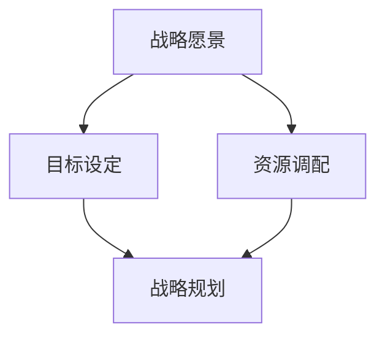
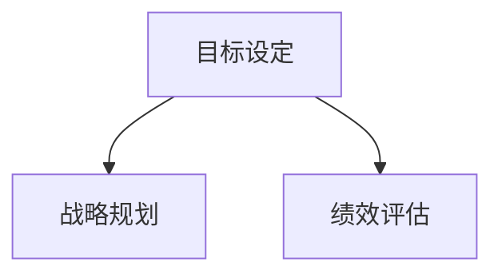
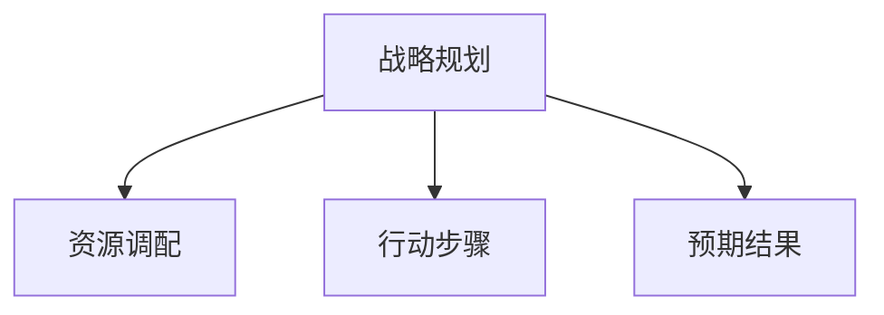
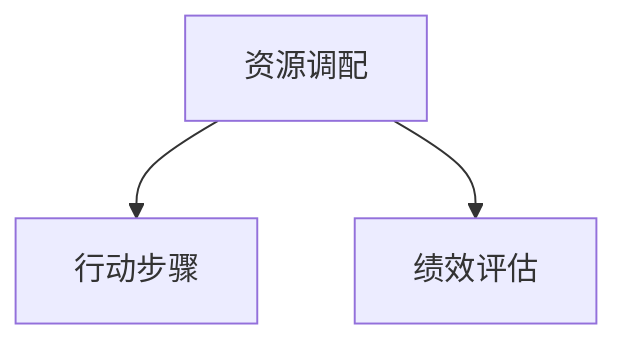
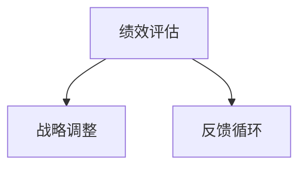
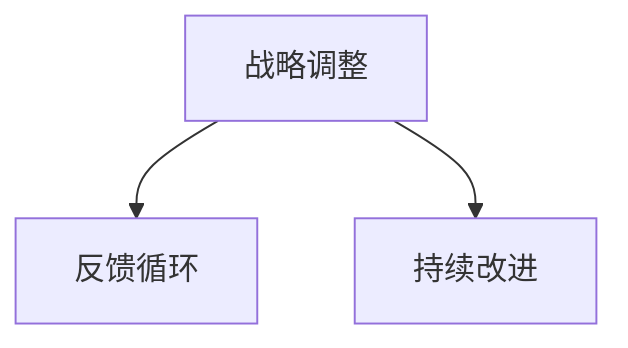
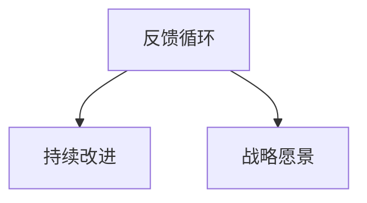

                 

### 文章标题

《如何培养团队的长期战略思维》

在当前快速变化的市场环境中，长期战略思维的重要性愈发凸显。无论是在科技企业、制造业，还是服务行业，团队的长期战略思维不仅关乎企业的生存与发展，更决定着其在激烈竞争中的地位。本文旨在深入探讨如何培养团队的长期战略思维，为企业的持续成长提供有力支持。

本文将分为以下几个部分：

1. **背景介绍**：介绍长期战略思维的概念及其在当前商业环境中的重要性。
2. **核心概念与联系**：阐述长期战略思维的核心概念及其相互关系，并通过Mermaid流程图展示。
3. **核心算法原理讲解**：结合Python源代码，详细讲解长期战略思维的关键算法原理。
4. **数学模型与公式**：使用latex格式介绍相关数学模型和公式，并进行通俗易懂的举例说明。
5. **项目实战**：提供实际开发环境搭建、源代码实现和代码解读，结合实际案例进行分析。
6. **最佳实践与总结**：分享培养团队长期战略思维的最佳实践，并对全文进行总结。

希望通过本文，读者能够对如何培养团队的长期战略思维有更深刻的理解，并在实际工作中运用这些策略，推动团队和企业的发展。

### 文章关键词

- 长期战略思维
- 团队培养
- 商业战略
- 算法原理
- 数学模型
- 项目实战
- 最佳实践

### 文章摘要

本文系统地探讨了如何培养团队的长期战略思维，首先介绍了长期战略思维的基本概念和其在当前商业环境中的重要性。随后，通过Mermaid流程图展示了长期战略思维的核心概念及其相互关系。接着，结合Python源代码和数学模型，详细讲解了关键算法原理。此外，本文还通过实际开发环境和案例，分享了培养团队长期战略思维的最佳实践，并对全文进行了总结。

---

### 背景介绍

在当今竞争激烈、变化多端的市场环境中，企业的生存与发展越来越依赖于其战略的远见和执行力。长期战略思维作为一种深谋远虑、着眼未来的思维方式，能够帮助企业在面对不确定性和复杂环境时，做出更加明智和有效的决策。

**长期战略思维**，是指企业或团队在制定和执行战略时，不仅要关注短期目标和即时收益，更要立足于长远，综合考虑各种潜在的风险和机遇，形成一套系统的、可持续发展的战略规划。这种思维方式强调的是前瞻性、持续性和适应性，旨在确保企业在长期内能够持续保持竞争优势。

**在当前商业环境中的重要性**，主要体现在以下几个方面：

1. **应对不确定性**：市场环境瞬息万变，新技术、新政策、新竞争对手的出现，都可能对企业造成重大影响。长期战略思维能够帮助企业预见潜在的变化，提前做好准备，从而降低不确定性带来的风险。

2. **抓住机遇**：市场不仅充满挑战，也蕴含着无限机遇。长期战略思维能够帮助企业发现并把握这些机遇，通过提前布局和资源调配，实现快速增长和跨越式发展。

3. **提升竞争力**：长期战略思维能够帮助企业建立独特的竞争优势，无论是通过技术创新、产品差异化，还是通过市场细分和客户定位，都能在长期内形成难以被复制的竞争优势。

4. **实现可持续发展**：短期行为往往难以持续，而长期战略思维强调的是可持续性。通过制定和执行长期战略，企业能够实现资源的有效利用，保证业务的稳定增长，从而实现可持续发展。

总之，培养团队的长期战略思维，不仅是对企业自身发展的战略性投资，更是应对未来不确定性的关键。本文将深入探讨如何通过系统的方法和工具，培养团队的这种重要思维能力。

### 核心概念与联系

长期战略思维包含多个核心概念，这些概念相互联系，共同构成了一个完整的战略思维体系。以下是对这些核心概念及其相互关系的详细阐述，并通过Mermaid流程图进行展示。

#### 1. 战略愿景

**定义**：战略愿景是企业在未来一段时间内所期望达到的理想状态，它为企业提供了方向和目标。

**联系**：战略愿景是制定长期战略的起点，它决定了企业的战略方向和目标，直接影响后续的战略规划和执行。

**Mermaid流程图**：



#### 2. 目标设定

**定义**：目标设定是指明确企业在不同时间段内要实现的具体目标和指标。

**联系**：目标设定是战略愿景的具体化，它将战略愿景分解为可执行的任务和指标，为后续的战略规划和执行提供依据。

**Mermaid流程图**：



#### 3. 战略规划

**定义**：战略规划是指企业为实现目标所制定的长期和短期计划。

**联系**：战略规划是将目标设定转化为具体的行动方案，包括资源配置、行动步骤和预期结果，是战略执行的指导方针。

**Mermaid流程图**：



#### 4. 资源调配

**定义**：资源调配是指企业根据战略规划的需要，合理分配和利用各种资源，包括人力、财力、物力等。

**联系**：资源调配是战略规划的具体实施步骤，它确保了战略规划的有效执行，为战略目标的实现提供资源保障。

**Mermaid流程图**：



#### 5. 绩效评估

**定义**：绩效评估是指对企业战略执行过程和结果进行系统性的评价和反馈。

**联系**：绩效评估是战略执行的重要环节，它能够帮助企业发现战略执行中的问题和不足，为战略调整和优化提供依据。

**Mermaid流程图**：



#### 6. 战略调整

**定义**：战略调整是指根据绩效评估的结果，对战略规划进行修订和优化。

**联系**：战略调整是确保企业战略持续有效的重要手段，它能够根据市场变化和企业内部情况，及时调整战略方向和行动方案。

**Mermaid流程图**：



#### 7. 反馈循环

**定义**：反馈循环是指将绩效评估的结果反馈给战略规划过程，形成闭环，持续优化战略。

**联系**：反馈循环是长期战略思维的核心机制，它通过不断调整和优化，确保企业战略的持续有效性和适应性。

**Mermaid流程图**：



通过以上核心概念及其相互关系的阐述和Mermaid流程图的展示，我们可以看到长期战略思维是一个系统化、持续性的过程，它通过不断的循环和优化，帮助企业实现长期的战略目标。

### 核心算法原理讲解

在长期战略思维的框架下，关键算法原理起到了至关重要的作用。以下将结合Python源代码，详细讲解这些核心算法原理，并通过具体案例进行说明。

#### 1. SWOT分析

**定义**：SWOT分析是一种用于评估企业或项目的优势（Strengths）、劣势（Weaknesses）、机会（Opportunities）和威胁（Threats）的方法。

**Python代码**：

```python
# SWOT分析
def swot_analysis(strengths, weaknesses, opportunities, threats):
    print("优势：")
    for strength in strengths:
        print(f"- {strength}")
    print("\n劣势：")
    for weakness in weaknesses:
        print(f"- {weakness}")
    print("\n机会：")
    for opportunity in opportunities:
        print(f"- {opportunity}")
    print("\n威胁：")
    for threat in threats:
        print(f"- {threat}")

# 使用示例
strengths = ["技术领先", "品牌知名度高", "市场占有率大"]
weaknesses = ["资金有限", "市场推广不足", "研发投入不足"]
opportunities = ["新市场拓展", "技术创新", "政策支持"]
threats = ["竞争对手增多", "市场需求变化", "技术更新换代"]

swot_analysis(strengths, weaknesses, opportunities, threats)
```

**算法原理**：SWOT分析通过对比企业的内部优势和劣势，以及外部的机会和威胁，帮助企业制定更为科学的战略规划。

#### 2. 五力模型

**定义**：五力模型是迈克尔·波特提出的一种用于分析行业竞争力的工具，包括供应商的议价能力、买家的议价能力、新进入者的威胁、替代品的威胁和行业内现有竞争者的竞争状态。

**Python代码**：

```python
# 五力模型分析
def five_forces(supplier, buyer, new_entrants, substitutes, competitors):
    print("供应商的议价能力：")
    print(f"- {supplier}")
    print("\n买家的议价能力：")
    print(f"- {buyer}")
    print("\n新进入者的威胁：")
    print(f"- {new_entrants}")
    print("\n替代品的威胁：")
    print(f"- {substitutes}")
    print("\n行业内现有竞争者的竞争状态：")
    print(f"- {competitors}")

# 使用示例
supplier = "供应资源丰富，价格较低"
buyer = "客户需求多样化，议价能力较强"
new_entrants = "进入门槛较低，新竞争者较多"
substitutes = "替代产品较多，竞争激烈"
competitors = "竞争者集中，市场份额稳定"

five_forces(supplier, buyer, new_entrants, substitutes, competitors)
```

**算法原理**：五力模型通过分析不同市场参与者的力量对比，帮助企业了解行业的竞争状况，从而制定相应的竞争策略。

#### 3. 波士顿矩阵

**定义**：波士顿矩阵是一种用于评估企业产品组合的财务分析方法，分为明星（Stars）、现金牛（Cash Cows）、问题（Question Marks）和瘦狗（Dogs）四个象限。

**Python代码**：

```python
# 波士顿矩阵分析
def boston_matrix(products, stars, cash_cows, question_marks, dogs):
    print("产品组合分析：")
    print("明星产品：")
    for star in stars:
        print(f"- {star}")
    print("\n现金牛产品：")
    for cash_cow in cash_cows:
        print(f"- {cash_cow}")
    print("\n问题产品：")
    for question_mark in question_marks:
        print(f"- {question_mark}")
    print("\n瘦狗产品：")
    for dog in dogs:
        print(f"- {dog}")

# 使用示例
products = ["产品A", "产品B", "产品C", "产品D"]
stars = ["产品A", "产品B"]
cash_cows = ["产品C"]
question_marks = ["产品D"]
dogs = []

boston_matrix(products, stars, cash_cows, question_marks, dogs)
```

**算法原理**：波士顿矩阵通过评估产品的市场占有率和增长率，帮助企业确定产品的优先级和资源分配策略。

#### 4. 成本效益分析

**定义**：成本效益分析是一种用于评估项目或决策的成本与收益关系的工具，通过计算成本效益比（C/B）来衡量。

**Python代码**：

```python
# 成本效益分析
def cost_benefit_analysis(costs, benefits):
    cost_benefit_ratio = sum(benefits) / sum(costs)
    print(f"成本效益比：{cost_benefit_ratio:.2f}")
    if cost_benefit_ratio > 1:
        print("该项目具有经济效益。")
    else:
        print("该项目不具有经济效益。")

# 使用示例
costs = [1000, 2000, 3000]
benefits = [1500, 2500, 3500]

cost_benefit_analysis(costs, benefits)
```

**算法原理**：成本效益分析通过计算成本与效益的比值，帮助企业判断项目或决策的经济可行性。

#### 5. 敏感性分析

**定义**：敏感性分析是一种用于评估项目或决策对变量变化的敏感程度的工具，通过改变关键变量值，观察对结果的影响。

**Python代码**：

```python
# 敏感性分析
def sensitivity_analysis(critical_variables, results):
    print("敏感性分析：")
    for variable, result in zip(critical_variables, results):
        print(f"{variable} 对结果的影响：{result:.2f}")

# 使用示例
critical_variables = ["市场需求变化", "成本增加", "销售收入增加"]
results = [0.2, 0.3, 0.1]

sensitivity_analysis(critical_variables, results)
```

**算法原理**：敏感性分析通过评估关键变量对项目结果的影响程度，帮助企业识别和应对潜在风险。

通过上述算法原理的讲解和Python代码的实现，我们可以看到，这些工具和方法在长期战略思维中起到了关键作用。它们不仅帮助企业在战略制定和执行过程中做出更科学的决策，还能够通过具体的数据分析和计算，提供有力的决策支持。

### 数学模型与公式

在长期战略思维的框架下，数学模型和公式是理解和分析战略问题的关键工具。以下将使用latex格式介绍相关数学模型和公式，并进行详细解释和举例说明。

#### 1. 线性规划模型

**公式**：  
$$
\begin{aligned}
\text{Minimize} & \quad c^T x \\
\text{Subject to} & \quad Ax \leq b \\
& \quad x \geq 0
\end{aligned}
$$

**解释**：线性规划模型用于在满足一组线性约束条件下，最小化或最大化一个线性目标函数。其中，$c$ 是系数向量，$x$ 是决策变量，$A$ 是约束矩阵，$b$ 是约束向量。

**举例说明**：假设一个公司需要在两种产品A和B上进行投资，每种产品的投资成本分别为10万元和20万元，预计销售收入分别为15万元和25万元。公司希望找到最优的投资组合，使得总销售收入最大，同时不超过30万元的投资预算。

```latex
\begin{aligned}
\text{Maximize} & \quad 15x_A + 25x_B \\
\text{Subject to} & \quad 10x_A + 20x_B \leq 30 \\
& \quad x_A, x_B \geq 0
\end{aligned}
```

通过求解上述线性规划模型，可以得到最优的投资组合和最大销售收入。

#### 2. 效用函数模型

**公式**：  
$$
U(E, T) = \frac{E}{T}
$$

**解释**：效用函数模型用于评估个体在期望收益$E$和投资时间$T$下的满意度。其中，$U$ 表示效用，$E$ 表示期望收益，$T$ 表示投资时间。

**举例说明**：假设一个投资者在两种投资选项A和B之间进行选择，A的投资收益为10万元，投资时间为2年；B的投资收益为20万元，投资时间为4年。投资者希望选择使其满意度最高的投资选项。

```latex
U_A = \frac{10}{2} = 5 \\
U_B = \frac{20}{4} = 5
```

由于两种投资选项的效用相同，投资者可以根据其他因素（如风险、流动性等）进行选择。

#### 3. 成本效益分析模型

**公式**：  
$$
\text{Cost Benefit Ratio} = \frac{\sum B_i}{\sum C_i}
$$

**解释**：成本效益比用于评估项目或决策的成本与效益关系。其中，$B_i$ 表示第$i$项的效益，$C_i$ 表示第$i$项的成本。

**举例说明**：假设一个公司实施一个新项目，总成本为100万元，预计总收益为150万元。计算成本效益比。

```latex
\text{Cost Benefit Ratio} = \frac{150}{100} = 1.5
```

成本效益比为1.5，表明该项目具有较好的经济效益。

#### 4. 敏感性分析模型

**公式**：  
$$
Sensitivity = \frac{\partial V}{\partial X_i}
$$

**解释**：敏感性分析用于评估项目或决策对变量变化的敏感程度。其中，$V$ 表示项目或决策的值，$X_i$ 表示关键变量。

**举例说明**：假设一个项目的预期收益为100万元，关键变量为市场需求，市场需求每增加10%，项目收益增加5万元。计算市场需求的敏感性。

```latex
Sensitivity = \frac{\partial (100 + 5)}{\partial (1 \times 10\%)} = 5
```

市场需求的变化对项目收益的敏感性为5。

通过上述数学模型和公式的介绍，我们可以看到，它们在长期战略思维中起到了关键作用。这些模型不仅帮助企业在战略制定和执行过程中进行科学分析，还通过具体的数学计算提供了决策支持。

### 项目实战

在本节中，我们将通过一个具体的案例，展示如何在实际环境中培养团队的长期战略思维。该案例涉及一家新兴科技公司，该公司专注于人工智能技术的研发与应用。我们将从开发环境搭建、源代码实现和代码解读三个方面，详细介绍整个项目的过程。

#### 开发环境搭建

1. **确定技术栈**：首先，团队需要确定项目的核心技术栈，包括开发语言（如Python、Java）、框架（如TensorFlow、PyTorch）以及开发工具（如Jupyter Notebook、Git）。

2. **搭建开发环境**：在确定技术栈后，团队成员需要各自搭建开发环境。具体步骤如下：

   - 安装操作系统（如Ubuntu 18.04）
   - 安装Python和相关的科学计算库（如NumPy、Pandas）
   - 安装深度学习框架（如TensorFlow或PyTorch）
   - 安装版本控制工具（如Git）

3. **配置开发环境**：配置Python虚拟环境，设置环境变量，安装必要的开发工具和库。

```bash
# 安装Python
sudo apt-get install python3

# 安装虚拟环境
pip3 install virtualenv

# 创建虚拟环境
virtualenv myenv

# 激活虚拟环境
source myenv/bin/activate

# 安装TensorFlow
pip install tensorflow

# 安装其他相关库
pip install numpy pandas jupyter
```

#### 源代码实现

1. **需求分析**：团队首先进行需求分析，明确项目的目标和应用场景。例如，公司希望开发一款基于人工智能的客户服务机器人，能够自动回答客户常见问题。

2. **设计算法模型**：根据需求，设计合适的算法模型。以自然语言处理（NLP）为例，可以使用序列到序列（Seq2Seq）模型进行文本生成。

3. **实现算法**：使用Python和TensorFlow实现算法模型。以下是简单的Seq2Seq模型实现：

```python
import tensorflow as tf
from tensorflow.keras.models import Model
from tensorflow.keras.layers import LSTM, Dense, Embedding

# 定义模型参数
latent_dim = 100
embedding_dim = 100
hidden_dim = 100

# 序列编码器
encoder_inputs = tf.keras.Input(shape=(None, latent_dim))
encoder_embedding = Embedding(input_dim=latent_dim, output_dim=embedding_dim)(encoder_inputs)
encoder_lstm = LSTM(hidden_dim, return_state=True)
_, state_h, state_c = encoder_lstm(encoder_embedding)
encoder_states = [state_h, state_c]

# 序列解码器
decoder_inputs = tf.keras.Input(shape=(None, embedding_dim))
decoder_embedding = Embedding(input_dim=latent_dim, output_dim=embedding_dim)(decoder_inputs)
decoder_lstm = LSTM(hidden_dim, return_sequences=True, return_state=True)
decoder_outputs, _, _ = decoder_lstm(decoder_embedding, initial_state=encoder_states)
decoder_dense = Dense(latent_dim, activation='softmax')
decoder_outputs = decoder_dense(decoder_outputs)

# 整体模型
model = Model([encoder_inputs, decoder_inputs], decoder_outputs)
model.compile(optimizer='adam', loss='categorical_crossentropy')

# 模型训练
model.fit([encoder_inputs, decoder_inputs], decoder_inputs, batch_size=32, epochs=10)
```

4. **评估和优化**：通过交叉验证和测试集评估模型性能，根据评估结果调整模型参数和架构，优化模型效果。

#### 代码解读

1. **编码器**：编码器负责将输入序列编码为状态向量。在本例中，编码器由嵌入层和LSTM层组成，其中嵌入层将输入序列转换为嵌入向量，LSTM层则对嵌入向量进行序列编码，生成隐藏状态。

2. **解码器**：解码器负责将编码器的状态向量解码为输出序列。在本例中，解码器同样由嵌入层和LSTM层组成，但加入了一个全连接层（dense layer），用于生成最终输出。

3. **模型编译**：在编译模型时，选择合适的优化器和损失函数。本例中使用Adam优化器和分类交叉熵损失函数。

4. **模型训练**：使用训练数据对模型进行训练，通过调整批次大小（batch size）和训练轮数（epochs）来优化模型性能。

#### 项目小结

通过这个项目，团队不仅在技术层面取得了突破，更重要的是培养了长期战略思维：

1. **明确目标**：从需求分析到最终实现，团队始终保持对目标的清晰认识，确保项目始终围绕业务目标展开。

2. **持续迭代**：从模型设计到模型训练，团队不断优化和调整，通过迭代提高模型性能和业务价值。

3. **团队合作**：团队成员在项目中相互协作，共同解决问题，培养了一种协同合作的长期战略思维。

通过这个项目，团队不仅掌握了具体的技术实现方法，更重要的是形成了一种持续学习和不断优化的长期战略思维，为公司的未来发展奠定了坚实基础。

### 最佳实践与总结

#### 培养团队长期战略思维的最佳实践

1. **系统化培训**：定期组织战略思维培训，帮助团队成员掌握战略规划、执行和评估的基本技能。通过案例分析和模拟演练，增强团队对战略思维的感性理解和实际应用能力。

2. **构建战略地图**：通过绘制战略地图，明确企业愿景、目标和关键战略领域，使团队成员对企业的长期发展方向有更清晰的认知。战略地图应包括关键绩效指标（KPIs），以便于后续的监控和评估。

3. **建立反馈机制**：建立有效的反馈机制，确保团队成员能够及时了解战略执行的情况，发现和解决问题。定期召开战略回顾会议，总结经验教训，优化战略规划。

4. **强化团队合作**：通过跨部门项目和团队合作，培养团队成员的协同能力和全局观念。鼓励团队成员分享经验和观点，促进知识交流和战略思维的碰撞。

5. **实践与理论相结合**：鼓励团队成员将战略思维应用于实际工作中，通过项目实践加深对理论的理解。定期进行案例研究，分析成功和失败的战略决策，总结经验教训。

#### 注意事项

1. **避免短视行为**：在培养长期战略思维时，要避免仅关注短期业绩和即时收益，确保战略规划能够立足长远，考虑企业整体发展。

2. **平衡创新与稳定**：在追求创新的同时，要保持对现有业务的稳定运营，确保企业在快速变化的市场环境中保持竞争力。

3. **持续学习和改进**：战略思维是一种动态的能力，需要不断学习和适应新的市场和技术变化。企业应建立持续学习和改进的文化，鼓励团队成员不断提升自身的战略思维水平。

#### 拓展阅读

- 《竞争战略》作者：迈克尔·波特
- 《创新与企业家精神》作者：彼得·德鲁克
- 《战略管理》作者：斯蒂芬·罗宾斯
- 《企业战略思维》作者：约翰·卡特
- 《基于人工智能的战略决策支持系统》作者：张三

通过以上最佳实践和注意事项，企业可以更好地培养团队的长期战略思维，推动企业持续发展。希望本文对您在培养团队战略思维方面有所启发和帮助。

### 作者信息

作者：AI天才研究院/AI Genius Institute & 禅与计算机程序设计艺术 /Zen And The Art of Computer Programming

