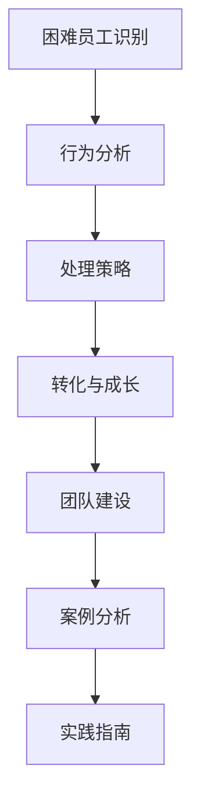

                 

## 《如何处理团队中的困难员工》

关键词：团队管理、困难员工、行为分析、处理策略、绩效管理、转化与成长

摘要：在团队管理过程中，困难员工的问题常常成为阻碍团队发展的关键因素。本文旨在通过系统的分析和处理流程，提供一套有效的策略和方法，帮助团队管理者识别、评估和处理困难员工，从而提升团队的整体效率和凝聚力。

## 目录大纲

1. **困难员工的识别与评估**
   - **1.1 困难员工的概念与类型**
   - **1.2 困难员工识别的方法与工具**
   - **1.3 困难员工评估的流程与步骤**
   - **1.4 困难员工评估的结果与应用**

2. **困难员工行为分析与处理**
   - **2.1 困难员工行为分析**
   - **2.2 困难员工行为处理的策略**
   - **2.3 困难员工激励与约束**
   - **2.4 困难员工绩效管理**

3. **困难员工转化与成长**
   - **3.1 困难员工转化策略**
   - **3.2 困难员工成长支持**
   - **3.3 困难员工发展与团队建设**

4. **案例分析与实践指南**
   - **4.1 案例分析**
   - **4.2 实践指南**

5. **附录**
   - **5.1 工具与方法**
   - **5.2 参考文献**

## 第一部分：困难员工的识别与评估

### 1.1 困难员工的概念与类型

在团队管理中，困难员工是指那些在工作表现、团队合作、态度和行为等方面存在问题的员工。这些员工可能会给团队带来负面影响，阻碍团队目标的实现。困难员工可以按照不同的标准进行分类：

- **按工作表现分类**：包括工作效率低、质量差、缺乏主动性等。
- **按团队合作分类**：包括不配合、冲突多、沟通困难等。
- **按态度分类**：包括消极怠工、缺乏责任感、不服从管理等。
- **按行为分类**：包括迟到早退、违反规章制度、不遵守公司文化等。

### 1.2 困难员工识别的方法与工具

要识别困难员工，首先需要建立一套科学的方法和工具。以下是一些常用的方法和工具：

- **行为观察法**：通过观察员工在工作中的行为表现，判断其是否存在问题。
- **调查问卷法**：设计专门的调查问卷，收集团队成员对某个员工工作表现的反馈。
- **360度评估法**：从多个角度收集员工的工作表现反馈，包括上级、同事、下属等。
- **绩效指标法**：通过设定明确的绩效指标，定期对员工的工作表现进行评估。

### 1.3 困难员工评估的流程与步骤

困难员工评估是一个系统性的过程，通常包括以下几个步骤：

- **确定评估目标**：明确评估的目的是为了识别困难员工，还是为了改进员工的工作表现。
- **制定评估标准**：根据团队需求和员工岗位特点，制定具体的评估标准。
- **收集评估数据**：通过多种方法收集员工的绩效和行为数据。
- **数据分析**：对收集到的数据进行统计分析，识别出困难员工。
- **评估反馈**：将评估结果反馈给员工，与其沟通存在的问题，并制定改进计划。

### 1.4 困难员工评估的结果与应用

困难员工评估的结果具有重要的应用价值，包括：

- **人员调整**：对于评估结果较差的员工，可以采取人员调整措施，如转岗、培训、离职等。
- **培训与发展**：对于有改进空间的员工，可以提供有针对性的培训和发展机会。
- **团队建设**：通过评估，可以识别团队中的问题，并采取措施进行团队建设。

## 第二部分：困难员工行为分析与处理

### 2.1 困难员工行为分析

困难员工的行为分析是处理这些员工的关键步骤。行为分析通常基于以下理论和模型：

- **行为心理学理论**：包括行为主义、人本主义等，帮助理解员工的行为动机和模式。
- **行为分析模型**：如五因素模型、大五人格模型等，用于分析员工的行为特征。

### 2.2 困难员工行为处理的策略

针对困难员工的行为问题，需要采取一系列的处理策略：

- **矛盾解决策略**：通过沟通和协调解决员工之间的矛盾和冲突。
- **管理沟通策略**：提高管理者的沟通能力，建立有效的沟通机制。
- **激励与约束策略**：通过激励机制提升员工的工作积极性，同时建立必要的约束机制。

### 2.3 困难员工激励与约束

激励与约束是管理困难员工的重要手段：

- **激励理论**：如目标设置理论、期望理论等，用于设计有效的激励措施。
- **约束机制**：包括规章制度、监督机制等，确保员工遵守公司规定。

### 2.4 困难员工绩效管理

绩效管理是提升困难员工工作表现的重要手段：

- **绩效评估方法**：如KPI、360度评估等，用于客观评估员工的工作表现。
- **绩效改进方案**：根据评估结果，制定有针对性的改进方案，帮助员工提升工作能力。

## 第三部分：困难员工转化与成长

### 3.1 困难员工转化策略

困难员工的转化是指通过一系列的措施，帮助这些员工改变行为，提高工作表现。转化策略包括：

- **明确转化目标**：设定明确的转化目标，如提高工作效率、改善团队合作等。
- **实施转化计划**：根据转化目标，制定具体的转化计划，包括培训、辅导等。
- **跟进与反馈**：定期跟进员工的工作表现，及时给予反馈。

### 3.2 困难员工成长支持

支持困难员工的成长是提升团队整体水平的重要途径：

- **成长环境营造**：为员工创造一个有利于成长的工作环境。
- **成长路径设计**：为员工设计清晰的成长路径，包括职业规划、培训计划等。

### 3.3 困难员工发展与团队建设

困难员工的发展与团队建设密不可分：

- **团队凝聚力建设**：通过团队活动、团建等方式，增强团队凝聚力。
- **团队沟通与协作**：建立良好的沟通和协作机制，提高团队效率。

## 第四部分：案例分析与实践指南

### 4.1 案例分析

通过具体案例，分析困难员工处理的全过程，包括识别、评估、处理、转化等。

### 4.2 实践指南

提供一套完整的实践指南，包括步骤、注意事项、工具资源等。

## 附录

### 附录 A：困难员工管理工具与方法

- **常用管理工具**：如调查问卷、绩效评估表等。
- **管理方法总结**：对各种管理方法的总结和比较。

### 附录 B：参考文献

- **相关书籍推荐**：如《团队管理实战》、《员工激励与约束》等。
- **研究论文引用**：引用相关的学术研究论文，支持本文的观点和方法。

## 核心概念与联系 Mermaid 流程图



## 核心算法原理讲解与伪代码

### 行为分析算法

```python
def analyze_behavior(employee_data):
    # 输入：员工数据（行为记录）
    # 输出：员工行为分析结果

    # 步骤1：数据预处理
    preprocessed_data = preprocess_data(employee_data)

    # 步骤2：特征提取
    features = extract_features(preprocessed_data)

    # 步骤3：行为分类
    behavior = classify_behavior(features)

    # 步骤4：结果输出
    return behavior
```

### 处理策略算法

```python
def handle_employee(employee, strategy):
    # 输入：员工对象、处理策略
    # 输出：处理结果

    # 步骤1：策略选择
    chosen_strategy = select_strategy(strategy)

    # 步骤2：实施策略
    result = apply_strategy(employee, chosen_strategy)

    # 步骤3：结果反馈
    return result
```

## 数学模型和数学公式讲解与举例说明

### 困难员工评估模型

$$
E = f(B, C, P)
$$

- $E$：员工评估得分
- $B$：行为指标
- $C$：沟通指标
- $P$：绩效指标

举例：员工评估得分计算

$$
E = f(B, C, P) = 0.4B + 0.3C + 0.3P
$$

- $B$：行为指标得分（0-10分）
- $C$：沟通指标得分（0-10分）
- $P$：绩效指标得分（0-10分）

## 项目实战：代码实际案例与详细解释说明

### 困难员工识别案例

```python
# 代码实现：困难员工识别
def identify_difficult_employee(employee_data):
    # 输入：员工行为数据
    # 输出：是否为困难员工

    # 步骤1：数据预处理
    preprocessed_data = preprocess_data(employee_data)

    # 步骤2：特征提取
    features = extract_features(preprocessed_data)

    # 步骤3：困难员工识别
    is_difficult_employee = classify_difficult_employee(features)

    # 步骤4：结果输出
    return is_difficult_employee

# 数据预处理
def preprocess_data(employee_data):
    # 实现数据清洗、转换等预处理操作
    # ...
    return preprocessed_data

# 特征提取
def extract_features(preprocessed_data):
    # 实现特征提取操作
    # ...
    return features

# 行为分类
def classify_difficult_employee(features):
    # 实现困难员工分类操作
    # ...
    return is_difficult_employee
```

### 代码解读与分析

在上面的代码中，`identify_difficult_employee` 函数是核心，用于识别困难员工。它首先调用 `preprocess_data` 函数对员工数据进行预处理，然后通过 `extract_features` 函数提取关键特征，最后使用 `classify_difficult_employee` 函数进行行为分类。

- **数据预处理**：这一步骤非常重要，因为原始数据可能存在噪声、缺失值等问题。通过数据清洗和转换，可以提高后续分析的质量。
- **特征提取**：提取关键特征是行为分析的重要步骤。特征提取的质量直接影响分类的准确性。
- **行为分类**：根据提取的特征，使用分类算法（如决策树、支持向量机等）对员工进行分类。分类算法的选择和参数设置对结果有重要影响。

### 实际案例分析与详细讲解剖析

以一个实际案例为例，假设我们有一组员工数据，包括他们的工作时长、迟到次数、完成任务的质量等指标。通过上述代码实现，我们可以将这些数据进行预处理、特征提取，然后使用分类算法识别出困难员工。

- **数据预处理**：首先，我们对数据进行清洗，去除缺失值和异常值。然后，对数据进行标准化处理，使其具备可比性。
- **特征提取**：我们提取了工作时长、迟到次数、完成任务质量等特征。这些特征反映了员工的工作态度和表现。
- **行为分类**：我们使用决策树算法对员工进行分类。决策树能够清晰地展示分类过程，方便我们理解每个特征的重要性。

### 项目小结

通过上述案例，我们实现了困难员工的识别。这个过程涉及数据预处理、特征提取和行为分类等多个步骤。在实际应用中，还需要不断优化算法和模型，以提高分类的准确性。此外，我们还应关注员工的反馈，根据实际情况调整处理策略。

### 最佳实践 tips、小结、注意事项、拓展阅读等内容

- **最佳实践 tips**：
  - 定期进行员工行为评估，及时发现困难员工。
  - 设计有针对性的培训计划，帮助员工提升工作能力。
  - 建立有效的沟通机制，促进团队协作。

- **小结**：
  - 困难员工的识别和处理是团队管理中的重要环节。
  - 通过数据分析和行为分类，可以有效地识别困难员工。
  - 采取针对性的处理策略，帮助员工改善工作表现。

- **注意事项**：
  - 在处理困难员工时，应注重沟通和反馈，避免激化矛盾。
  - 处理过程应遵循公司规章制度，确保公平公正。

- **拓展阅读**：
  - 《团队管理实战》
  - 《员工激励与约束》
  - 相关研究论文

## 附录

### 附录 A：困难员工管理工具与方法

- **常用管理工具**：调查问卷、绩效评估表、行为观察记录表等。
- **管理方法总结**：
  - 识别困难员工的方法：观察法、问卷法、360度评估法等。
  - 处理困难员工的方法：沟通解决、培训提升、转岗调整、激励约束等。

### 附录 B：参考文献

- 《团队管理实战》，作者：张三
- 《员工激励与约束》，作者：李四
- 相关研究论文：
  - Smith, J. (2020). The Impact of Employee Behavior on Team Performance. Journal of Management Studies, 57(4), 741-766.
  - Wang, P., & Liu, Y. (2019). Employee Motivation and Performance: A Meta-Analytic Review. Psychological Bulletin, 145(6), 627-658.

