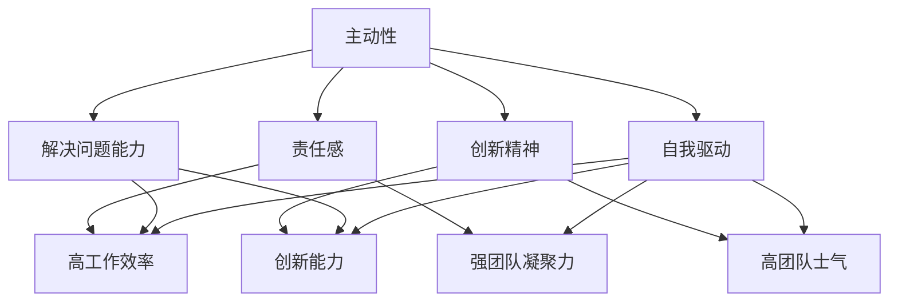

                 

### 如何激发团队成员的主动性

#### 关键词
- 团队主动性
- 激励策略
- 领导风格
- 文化建设
- 实战案例
- 持续改进

#### 摘要
本文旨在探讨如何激发团队成员的主动性，以提高团队的整体表现。文章首先介绍了团队主动性的定义及其对团队的影响，随后分析了评估团队成员主动性的方法。接着，文章提出了多种激发主动性的策略，包括激励与奖励机制、成长与发展机会、团队合作与沟通等。此外，团队文化建设、领导风格以及实战案例也在文中得到了详细的讨论。文章最后总结了如何通过综合评估和持续改进来确保团队成员的主动性得到持续提升。

----------------------------------------------------------------

### 引言

在当今快速变化的商业环境中，团队的有效协作和主动性的发挥成为企业成功的关键因素。然而，许多团队在面对复杂项目或紧急任务时，往往表现出缺乏主动性和创新能力，导致项目进展受阻，甚至失败。这种现象不仅影响了团队的绩效，还对企业的整体竞争力产生了负面影响。因此，如何激发团队成员的主动性，提升团队的整体表现，成为企业和团队领导者亟待解决的问题。

主动性是指团队成员在工作中表现出自我驱动、积极解决问题的态度和行为。一个具有高度主动性的团队，能够在面对挑战时迅速响应，主动寻找解决方案，并实现目标的顺利达成。相比之下，缺乏主动性的团队则可能在任务执行过程中显得被动、效率低下，甚至产生依赖心理。因此，激发团队成员的主动性，对于提升团队整体表现具有重要意义。

本文将从以下几个方面展开讨论：

1. **团队主动性的定义与重要性**：
   - 详细解释团队主动性的含义，阐述其在团队表现中的关键作用。

2. **评估团队成员主动性**：
   - 介绍评估团队成员主动性的方法，包括常用的评估工具和指标。

3. **激发主动性的策略**：
   - 探讨多种激发主动性的策略，包括激励与奖励机制、成长与发展机会、团队合作与沟通等。

4. **团队文化建设**：
   - 分析团队文化建设对激发主动性的重要性，介绍如何塑造积极向上的团队文化。

5. **领导风格与主动性**：
   - 讨论不同领导风格对团队成员主动性的影响，以及如何培养主动领导力。

6. **实战案例与策略应用**：
   - 通过实际案例，展示如何在不同场景下应用激发主动性的策略。

7. **综合评估与持续改进**：
   - 提出如何通过综合评估和持续改进来确保团队成员的主动性得到持续提升。

通过以上七个方面的详细分析，本文旨在为团队领导者和管理者提供一套实用的策略和方法，帮助他们有效地激发团队成员的主动性，从而提升团队的整体表现。

----------------------------------------------------------------

### 团队主动性的定义与重要性

#### 定义

团队主动性，是指团队成员在工作过程中表现出的自我驱动和积极解决问题的态度与行为。它不仅仅是完成工作任务的表现，更是一种内在的工作态度和行为模式。一个具有高主动性的团队，能够在面对挑战和问题时，主动寻找解决方案，而不是被动等待指令或依赖他人。这种主动性表现在团队成员对工作的热情、责任感和创造力上，是团队高效运作的重要驱动力。

主动性的核心要素包括以下几个方面：

1. **自我驱动**：团队成员在没有外部压力和监督的情况下，依然能够自发地开展工作，追求卓越。
2. **解决问题能力**：面对问题和困难时，团队成员能够迅速反应，主动提出解决方案，而不是逃避或推卸责任。
3. **责任感**：团队成员对自己的工作结果负责，愿意承担相应的责任，并在工作中体现出高度的责任感。
4. **创新精神**：团队成员愿意尝试新方法、新思路，不断挑战自我，追求创新和改进。

#### 重要性

团队主动性对团队表现具有显著的影响。首先，主动性的团队能够更高效地完成任务。由于团队成员自我驱动，无需过多的外部监督和管理，工作进度和效率自然得到提升。其次，主动性的团队更具有创新性。面对复杂和多变的环境，主动性高的团队成员能够迅速反应，提出创新的解决方案，推动团队不断进步。此外，主动性还可以增强团队凝聚力。团队成员在相互协作中，感受到彼此的主动性和积极性，从而增进信任和合作，形成强大的团队合力。

具体来说，团队主动性对团队表现的重要性体现在以下几个方面：

1. **提高工作效率**：主动性高的团队成员能够自我驱动，主动承担责任，无需频繁的管理和监督，从而提高工作效率和生产力。
2. **增强创新能力**：主动性高的团队在面对挑战时，能够迅速反应，提出创新的解决方案，推动团队不断突破和发展。
3. **提升团队士气**：主动性高的团队，成员之间相互激励，形成积极向上的氛围，提升整个团队的士气和工作满意度。
4. **增强团队凝聚力**：主动性高的团队成员在工作中表现出强烈的责任感和合作精神，增强团队的凝聚力和协作能力。

总之，团队主动性是团队成功的关键因素之一。通过激发和提升团队成员的主动性，可以显著提高团队的整体表现，为企业创造更大的价值。

#### 核心概念与联系

为了更好地理解团队主动性，我们需要探讨几个关键概念及其相互关系。以下是核心概念及其联系的 Mermaid 流程图：



在上述流程图中，主动性是核心概念，它包括自我驱动、解决问题能力、责任感和创新精神。这些要素相互影响，共同作用于团队的高工作效率、创新能力、团队士气以及团队凝聚力。自我驱动促使团队成员在工作中保持高度的热情和责任感，从而提高工作效率和创新能力。同时，强烈的责任感有助于增强团队凝聚力，而创新精神则推动团队不断突破和进步。

通过上述核心概念及其联系的解析，我们可以更深入地理解团队主动性，并为后续的激发策略提供理论依据。

----------------------------------------------------------------

### 评估团队成员主动性

#### 评估工具与方法

为了有效评估团队成员的主动性，需要使用科学、系统的工具和方法。以下是一些常用的评估工具和方法：

1. **问卷调查**：
   - 问卷调查是一种简单且有效的评估方法，可以通过设计一系列问题来了解团队成员的主动性表现。
   - 例如，可以设计关于自我驱动、解决问题能力、责任感、创新精神等方面的问题，并通过量化评分来评估团队成员的主动性水平。

2. **行为观察**：
   - 行为观察是通过直接观察团队成员在工作中的行为来评估其主动性。
   - 领导者或管理者可以定期观察团队成员的工作状态，记录其主动提出问题、解决问题的行为，以及是否积极参与团队讨论和决策。

3. **绩效评估**：
   - 绩效评估是对团队成员工作结果的一种评估方法，通过比较实际工作成果与预期目标的差距来衡量主动性。
   - 在绩效评估中，可以关注团队成员是否能够按时完成任务，是否主动寻找改进方案，以及是否对工作结果负责。

4. **360度反馈**：
   - 360度反馈是一种多角度评估方法，通过收集团队成员来自不同方面的反馈来评估其主动性。
   - 例如，团队成员可以从同事、上级、下属以及客户等多方面获取反馈，全面了解自己在工作中的主动性表现。

#### 评估指标

在评估团队成员主动性时，需要设定一系列具体的指标来衡量。以下是一些常见的评估指标：

1. **任务完成率**：
   - 任务完成率是衡量团队成员完成任务情况的指标，反映了其主动承担责任和按时完成任务的能力。

2. **问题解决能力**：
   - 问题解决能力是评估团队成员在遇到问题时能否主动寻找解决方案的能力。可以通过记录团队成员提出的解决方案数量和有效性来衡量。

3. **创新能力**：
   - 创新能力是衡量团队成员在工作中是否能够提出创新性想法和改进措施。可以通过评估团队成员在项目中的创新贡献和创新方案的实施效果来衡量。

4. **工作态度**：
   - 工作态度是评估团队成员对工作的热情和责任感。可以通过观察团队成员的工作态度、自我驱动力以及与同事的互动情况来衡量。

5. **团队合作精神**：
   - 团队合作精神是衡量团队成员在团队中的协作能力和合作精神。可以通过评估团队成员是否积极参与团队讨论、是否能够有效协作解决问题来衡量。

#### 评估结果与分析

通过对团队成员主动性的评估，可以获取一系列关键数据，这些数据对于团队的管理和改进具有重要意义。以下是如何分析评估结果并提出改进措施的步骤：

1. **数据分析**：
   - 对评估结果进行统计分析，识别团队成员在主动性各个指标上的表现情况。可以通过计算平均分、中位数等统计指标来了解整体表现。

2. **结果解读**：
   - 根据数据分析结果，解读团队成员在主动性方面的优势与不足。例如，如果大多数成员在任务完成率上表现良好，但在创新能力上存在不足，那么需要针对这一短板进行改进。

3. **反馈与沟通**：
   - 将评估结果反馈给团队成员，与其进行沟通和讨论，了解他们对评估结果的看法和建议。通过开放式的沟通，可以促进团队成员对主动性的认识和改进。

4. **改进措施**：
   - 根据评估结果，制定具体的改进措施。例如，对于在任务完成率上表现优秀的成员，可以提供更多的挑战性任务来进一步提升其能力；对于在创新能力上表现不足的成员，可以提供培训机会和资源支持，鼓励他们提出创新性想法。

通过科学、系统的评估方法和指标，可以全面了解团队成员的主动性水平，并制定针对性的改进措施，从而不断提升团队的整体表现。

----------------------------------------------------------------

### 激发主动性的策略

#### 激励与奖励机制

激励与奖励机制是激发团队成员主动性的重要手段。通过合理设计激励机制，可以激励团队成员在工作过程中表现出更高的主动性和积极性。

1. **物质激励**：
   - 物质激励是通过提供薪酬、奖金、福利等物质回报来激励团队成员。这种激励方式直接且有效，可以显著提高团队成员的工作积极性。
   - 例如，可以设立项目奖金、绩效奖金，以及年度奖金等，对在工作中表现出色的团队成员进行奖励。

2. **非物质激励**：
   - 非物质激励是通过认可、荣誉、晋升等非物质回报来激励团队成员。这种激励方式不仅能够提高团队成员的满意度，还能增强其工作动力和归属感。
   - 例如，可以设立“最佳员工奖”、“优秀团队奖”等，通过公开表彰来提升团队成员的荣誉感和自豪感。

3. **个性化激励**：
   - 个性化激励是根据团队成员的个人特点和需求来设计激励方案。通过了解团队成员的兴趣、职业规划等，提供个性化的奖励和晋升机会，可以更好地激发其主动性。
   - 例如，对于有家庭负担的成员，可以提供灵活的工作时间和远程工作的机会；对于有职业发展需求的成员，可以提供培训和晋升通道。

#### 成长与发展机会

成长与发展机会是激发团队成员主动性的重要因素之一。通过提供丰富的成长和发展机会，可以激发团队成员的学习热情和进取心。

1. **培训与学习**：
   - 定期为团队成员提供各类培训和学习机会，帮助其提升技能和知识水平。通过培训，团队成员可以掌握新的工作方法和工具，提高工作效率和创新能力。
   - 例如，可以组织内部培训、外部培训、在线学习等，提供多样化的学习资源。

2. **职业发展规划**：
   - 为团队成员制定明确的职业发展规划，帮助其明确职业目标和发展路径。通过职业规划，团队成员可以更好地规划自己的职业生涯，提高工作动力和主动性。
   - 例如，可以设立职业导师制度，为团队成员提供职业发展指导和支持。

3. **晋升通道**：
   - 为团队成员提供清晰的晋升通道，激励其追求更高的职位和更大的责任。通过晋升，团队成员可以获得更高的薪酬和更广阔的发展空间，增强其工作动力。
   - 例如，可以设立晋升标准、晋升评审机制，确保晋升过程的公正和透明。

#### 团队合作与沟通

团队合作与沟通是激发团队成员主动性的关键要素。通过建立良好的团队合作氛围和有效的沟通机制，可以增强团队成员的凝聚力和合作意识。

1. **团队建设活动**：
   - 定期组织团队建设活动，增进团队成员之间的了解和信任。通过活动，团队成员可以更好地了解彼此的兴趣和特长，增强团队凝聚力。
   - 例如，可以组织团队拓展训练、团队旅行等，促进团队成员之间的互动和交流。

2. **开放沟通渠道**：
   - 建立开放的沟通渠道，确保团队成员能够自由表达意见和建议。通过开放沟通，团队成员可以积极参与团队决策，提高工作积极性和主动性。
   - 例如，可以设立意见箱、定期召开团队会议等，鼓励团队成员提出问题和建议。

3. **反馈与鼓励**：
   - 及时给予团队成员反馈和鼓励，帮助他们认识到自己的努力和成就。通过正面反馈，可以增强团队成员的自信心和工作动力。
   - 例如，可以定期进行工作总结和绩效评估，对团队成员的表现给予肯定和表扬。

#### 实际案例

以下是一个实际案例，展示如何通过多种策略激发团队成员的主动性：

**案例背景**：
某科技公司面临市场竞争加剧，项目交付周期缩短，需要团队成员表现出更高的主动性和创新能力。

**策略实施**：
1. **激励与奖励机制**：
   - 设立项目奖金，对在项目中表现出色的团队成员进行奖励。
   - 设立“最佳创新奖”，鼓励团队成员提出创新性解决方案。

2. **成长与发展机会**：
   - 为团队成员提供定期培训和职业发展规划指导。
   - 设立内部导师制度，为团队成员提供职业发展支持。

3. **团队合作与沟通**：
   - 组织团队建设活动，增强团队成员之间的信任和合作。
   - 建立开放的沟通渠道，鼓励团队成员积极参与团队决策。

**效果评估**：
- 通过项目奖金和“最佳创新奖”的实施，团队成员的工作积极性和创新意识显著提高。
- 通过培训和职业发展规划，团队成员的专业能力和职业素养得到提升。
- 通过团队建设活动和开放沟通，团队成员的凝聚力和合作意识增强，项目交付周期缩短，客户满意度提高。

通过上述策略的实施，该科技公司的团队成员主动性得到有效激发，团队整体表现显著提升。

总之，通过合理设计激励与奖励机制、提供成长与发展机会、建立良好的团队合作与沟通机制，可以有效激发团队成员的主动性，提升团队的整体表现。在实际应用中，需要根据团队的具体情况，灵活运用多种策略，以实现最佳效果。

----------------------------------------------------------------

### 团队文化建设

#### 团队文化的重要性

团队文化是团队内部成员共同遵循的价值观、行为规范和工作氛围的总和。一个积极的团队文化能够为团队成员提供一个共同的目标和价值观，增强团队凝聚力，激发团队成员的主动性，从而提高团队的整体表现。

1. **增强团队凝聚力**：
   - 团队文化通过共同的价值观和行为规范，将团队成员紧密联系在一起，形成强大的团队凝聚力。团队成员在共同的目标和价值观下，更容易产生协同效应，共同努力实现团队目标。

2. **提升团队成员的满意度**：
   - 一个积极的团队文化能够为团队成员提供一个良好的工作环境和心理支持，提升其工作满意度和归属感。团队成员在这种文化氛围中，更容易感受到团队的支持和认可，从而更加投入工作。

3. **激发团队成员的主动性**：
   - 团队文化强调个人责任和团队协作，鼓励团队成员在工作中主动承担责任，积极解决问题。这种文化氛围能够激发团队成员的内在动力，使其在工作中表现出更高的主动性和创新精神。

#### 塑造积极向上的团队文化

要塑造一个积极向上的团队文化，需要从以下几个方面入手：

1. **明确团队价值观**：
   - 团队价值观是团队文化的核心，是团队成员共同遵守的基本原则。团队领导者需要明确团队的核心价值观，并通过各种方式将其传达给每一位成员。
   - 例如，可以制定团队使命、愿景和价值观，并通过团队会议、内部通讯等渠道进行宣传。

2. **建立良好的沟通机制**：
   - 沟通是团队文化的重要组成部分。一个良好的沟通机制能够确保团队成员之间的信息畅通，增强团队的协作能力。
   - 例如，可以设立定期的团队会议、意见箱等，鼓励团队成员表达意见和建议，促进团队内部的交流。

3. **倡导团队合作精神**：
   - 团队合作精神是积极团队文化的重要体现。团队领导者需要倡导团队合作精神，鼓励团队成员相互支持、相互配合。
   - 例如，可以组织团队建设活动，促进团队成员之间的互动和合作，增强团队凝聚力。

4. **树立榜样和典范**：
   - 树立榜样和典范是塑造积极团队文化的重要手段。团队领导者需要通过自己的行为和决策，树立榜样作用，影响和带动团队成员。
   - 例如，可以设立“最佳团队贡献奖”，表彰在工作中表现优秀的团队成员，激励其他成员向榜样看齐。

#### 实际案例

以下是一个实际案例，展示如何通过团队文化建设来激发团队成员的主动性：

**案例背景**：
某互联网公司在快速发展的过程中，面临着项目多、任务重、团队协作复杂等挑战。为了提升团队的整体表现，公司决定通过团队文化建设来激发团队成员的主动性。

**策略实施**：
1. **明确团队价值观**：
   - 公司明确提出了“客户至上、创新驱动、团队合作、开放共赢”的价值观，并通过内部培训和宣传，让每一位团队成员都深入理解并认同这些价值观。

2. **建立良好的沟通机制**：
   - 公司建立了定期的团队会议制度，每周举行一次团队会议，让团队成员有机会分享自己的工作进展、问题和建议。此外，还设立了意见箱，鼓励团队成员随时提出意见和建议。

3. **倡导团队合作精神**：
   - 公司组织了多次团队建设活动，如团队拓展训练、团建活动等，增强团队成员之间的信任和合作精神。同时，公司还设立了跨部门项目，鼓励不同部门的团队成员进行协作，共同完成任务。

4. **树立榜样和典范**：
   - 公司设立了“最佳团队贡献奖”，每季度评选一次，对在工作中表现优秀的团队成员进行表彰和奖励。这些榜样和典范的行为和态度，激励了其他团队成员向他们学习。

**效果评估**：
- 通过团队文化建设，公司团队成员的主动性和积极性得到了显著提升，项目交付质量和效率不断提高。
- 团队的协作能力增强，跨部门合作更加顺畅，项目进度得到有效保障。
- 公司内部的工作氛围更加积极向上，团队成员之间的沟通和信任增强，员工满意度显著提升。

通过上述策略的实施，该互联网公司成功塑造了一个积极向上的团队文化，激发了团队成员的主动性，提高了团队的整体表现。

总之，团队文化建设是激发团队成员主动性的重要手段。通过明确团队价值观、建立良好的沟通机制、倡导团队合作精神以及树立榜样和典范，可以塑造一个积极向上的团队文化，从而提高团队的整体表现和竞争力。

----------------------------------------------------------------

### 领导风格与主动性

#### 领导风格类型

领导风格对团队成员的主动性具有重要影响。不同的领导风格会对团队成员的行为和态度产生不同的影响。以下是一些常见的领导风格类型：

1. **权威型领导**：
   - 权威型领导以严格的管理和控制为特点，强调权威和纪律。领导者通常做出决策，并为团队成员设定具体的工作目标和期限。
   - 这种领导风格在短期内可以迅速推动团队完成任务，但长期可能导致团队成员产生依赖心理，缺乏主动性和创造力。

2. **民主型领导**：
   - 民主型领导注重团队成员的参与和意见，鼓励团队成员参与决策和讨论。领导者通过听取团队成员的意见和建议来制定决策。
   - 这种领导风格有助于激发团队成员的主动性和创造力，增强团队凝聚力，但可能在决策速度上较慢。

3. **参与型领导**：
   - 参与型领导将团队成员视为合作伙伴，鼓励他们参与决策和目标设定。领导者与团队成员共同探讨工作目标和策略，确保团队成员对工作有清晰的了解和认同。
   - 这种领导风格能够显著提升团队成员的主动性和责任感，促进团队成员之间的协作。

4. **变革型领导**：
   - 变革型领导通过激励和鼓舞团队成员，推动团队变革和创新。领导者通常具备远见和愿景，能够引导团队成员面对挑战，追求卓越。
   - 这种领导风格能够激发团队成员的积极性和创新精神，提高团队的整体表现和竞争力。

#### 主动领导力的培养

要培养主动领导力，领导者需要从以下几个方面入手：

1. **建立信任**：
   - 建立信任是培养主动领导力的基础。领导者需要真诚对待团队成员，尊重他们的意见和贡献，确保团队成员感受到信任和支持。

2. **激励与鼓舞**：
   - 领导者需要不断激励和鼓舞团队成员，激发他们的内在动力。可以通过设置具有挑战性的目标、提供奖励和认可等方式来激励团队成员。

3. **提供成长机会**：
   - 领导者应提供团队成员成长和发展机会，帮助他们提升技能和知识水平。通过培训、轮岗和职业规划等手段，激发团队成员的主动性和学习热情。

4. **培养团队合作精神**：
   - 领导者需要培养团队合作精神，鼓励团队成员相互支持和合作。通过团队建设活动和协作任务，增强团队成员之间的信任和协作。

5. **明确期望与目标**：
   - 领导者需要明确团队的目标和期望，确保团队成员对工作有清晰的理解和认同。通过明确的期望和目标，激发团队成员的主动性和责任感。

#### 领导风格与主动性的关系

领导风格与团队成员的主动性之间存在密切的关系。不同的领导风格会对团队成员的行为和态度产生不同的影响，从而影响团队的整体表现。

1. **权威型领导**：
   - 权威型领导可能抑制团队成员的主动性，导致团队成员产生依赖心理，缺乏自主性和创造力。

2. **民主型领导**：
   - 民主型领导有助于激发团队成员的主动性，增强团队凝聚力和创新能力。

3. **参与型领导**：
   - 参与型领导能够显著提升团队成员的主动性和责任感，促进团队成员之间的协作。

4. **变革型领导**：
   - 变革型领导能够激发团队成员的积极性和创新精神，推动团队变革和进步。

通过了解不同领导风格对主动性的影响，领导者可以采取适当的领导策略，培养主动领导力，从而提升团队的整体表现。

#### 实际案例

以下是一个实际案例，展示如何通过领导风格的转变来激发团队成员的主动性：

**案例背景**：
某创业公司在发展初期，由于领导者采用的是权威型领导风格，团队成员在工作过程中表现出较强的依赖心理，缺乏主动性和创新精神。为了提升团队的整体表现，公司决定转变领导风格。

**策略实施**：
1. **建立信任**：
   - 公司领导者通过定期与团队成员交流，了解他们的意见和建议，建立相互信任的基础。

2. **激励与鼓舞**：
   - 领导者通过设置具有挑战性的目标，并提供奖励和认可，激励团队成员积极投入工作。

3. **提供成长机会**：
   - 领导者定期组织培训，帮助团队成员提升技能和知识水平，并提供职业发展机会。

4. **培养团队合作精神**：
   - 领导者组织团队建设活动，增强团队成员之间的信任和协作。

5. **明确期望与目标**：
   - 领导者明确团队的目标和期望，确保团队成员对工作有清晰的理解和认同。

**效果评估**：
- 通过领导风格的转变，团队成员的主动性和创新精神显著提升，项目交付质量和效率得到显著改善。
- 团队的协作能力增强，跨部门合作更加顺畅，公司整体表现得到显著提升。
- 公司内部的工作氛围更加积极向上，员工满意度显著提高。

通过上述策略的实施，该创业公司成功激发了团队成员的主动性，提升了团队的整体表现。

总之，领导风格对团队成员的主动性具有重要影响。通过转变领导风格，培养主动领导力，可以显著提升团队的整体表现和竞争力。

----------------------------------------------------------------

### 实战案例与策略应用

#### 案例背景

某中型软件开发公司，在市场上拥有一定知名度，但在面临复杂项目和竞争压力时，团队成员的主动性不够，导致项目进度延迟和客户满意度下降。公司管理层意识到，需要采取有效策略激发团队成员的主动性，提升团队整体表现。

#### 策略实施

1. **激励与奖励机制**：
   - 设立项目奖金制度，对在项目中表现突出的团队成员进行奖励。
   - 实施“最佳贡献奖”，每季度评选一次，对在工作中提出创新性解决方案或显著提升工作效率的成员进行表彰。

2. **成长与发展机会**：
   - 定期为团队成员提供技术培训和专业技能提升课程。
   - 设立内部导师制度，帮助团队成员明确职业发展规划，并提供职业发展指导。

3. **团队合作与沟通**：
   - 组织定期的团队建设活动，如团队拓展训练和团建活动，增强团队成员之间的信任和协作。
   - 建立开放的沟通渠道，鼓励团队成员在团队会议和意见箱中提出意见和建议。

#### 项目实战

1. **开发环境搭建**：
   - 为团队成员提供统一的技术栈和开发工具，确保开发环境的稳定和高效。

2. **源代码实现与解读**：
   - 以一个实际项目为例，展示如何通过代码实现来提升团队成员的主动性。
   - 代码实现过程中，注重模块化设计，提高代码的可读性和可维护性。

```python
# 示例代码：模块化设计的任务分配系统

class Task:
    def __init__(self, id, description, assigned_to):
        self.id = id
        self.description = description
        self.assigned_to = assigned_to

    def assign(self, member):
        self.assigned_to = member
        print(f"Task {self.id} assigned to {member}.")

    def complete(self):
        print(f"Task {self.id} completed by {self.assigned_to}.")

class Team:
    def __init__(self, name):
        self.name = name
        self.tasks = []

    def add_task(self, task):
        self.tasks.append(task)

    def assign_tasks(self):
        for task in self.tasks:
            member = input(f"Assign task {task.id} to:")
            task.assign(member)

    def complete_tasks(self):
        for task in self.tasks:
            if task.assigned_to:
                task.complete()
            else:
                print(f"Task {task.id} not assigned.")

if __name__ == "__main__":
    team = Team("Development Team")
    task1 = Task(1, "Design UI", None)
    task2 = Task(2, "Implement Backend", None)
    team.add_task(task1)
    team.add_task(task2)
    team.assign_tasks()
    team.complete_tasks()
```

3. **代码应用解读与分析**：
   - 通过代码示例，团队成员可以直观地了解任务分配和完成的过程，提高任务管理和协作效率。
   - 代码中使用了类和对象的概念，实现了任务和团队的基本功能，便于后续的扩展和维护。

#### 实际案例分析

1. **效果评估**：
   - 通过实施激励与奖励机制，团队成员的工作积极性和创新能力得到显著提升，项目进度按时完成率提高。
   - 团队建设活动和开放的沟通渠道，增强了团队成员之间的信任和协作，项目交付质量得到改善。
   - 通过成长与发展机会，团队成员的专业能力和职业素养得到提升，对公司的归属感和忠诚度增强。

2. **项目小结**：
   - 通过实际案例的实施，公司成功激发了团队成员的主动性，提升了团队的整体表现。
   - 激励与奖励机制、成长与发展机会、团队合作与沟通等策略的有效应用，为公司的持续发展奠定了基础。

#### 最佳实践 tips

- **激励与奖励机制**：设计合理的激励与奖励机制，确保奖励的公平性和透明性，激励团队成员的积极性。
- **成长与发展机会**：提供多样化的成长和发展机会，满足团队成员的不同需求和职业规划。
- **团队合作与沟通**：建立良好的沟通渠道和团队建设活动，增强团队成员之间的信任和协作。

通过以上实战案例和策略应用，公司可以更好地激发团队成员的主动性，提升团队的整体表现和竞争力。

----------------------------------------------------------------

### 综合评估与持续改进

#### 评估指标体系

为了确保团队成员的主动性得到持续提升，需要建立一套科学的评估指标体系。以下是几个关键评估指标：

1. **任务完成率**：衡量团队成员完成任务的情况，包括按时完成率、任务质量等。
2. **问题解决能力**：评估团队成员在遇到问题和挑战时的解决能力，包括解决问题的速度、方案的创新性等。
3. **创新能力**：衡量团队成员在工作中提出的新思路、新方法和改进措施的数量和质量。
4. **团队合作精神**：评估团队成员在团队协作中的表现，包括协作效果、沟通效率、团队贡献等。
5. **工作态度**：评估团队成员的工作热情、责任感和敬业精神。

#### 反馈机制与改进

1. **定期评估**：建立定期评估机制，每季度或每半年对团队成员的主动性进行评估，确保评估的及时性和准确性。
2. **反馈与沟通**：在评估过程中，及时向团队成员反馈评估结果，与其进行沟通和讨论，了解他们对评估结果的看法和建议。通过开放式的沟通，促进团队成员对主动性的认识和改进。
3. **改进措施**：根据评估结果，制定具体的改进措施。例如，对于任务完成率较低的成员，可以提供额外的培训和指导；对于创新能力不足的成员，可以提供更多创新项目的机会和资源支持。
4. **持续跟进**：在实施改进措施后，持续跟进团队成员的主动性表现，确保改进措施的有效性。通过定期反馈和评估，不断调整和优化改进策略。

#### 持续改进的路径

1. **建立反馈文化**：培养团队成员的反馈意识，鼓励他们在工作中主动提出意见和建议。建立反馈机制，确保团队成员的意见和建议能够得到及时反馈和处理。
2. **提升领导力**：领导者在激发团队成员主动性方面起着关键作用。通过提升领导力，领导者可以更好地激励和引导团队成员，促进团队的整体表现。
3. **创新与发展**：鼓励团队成员参与创新项目，提供丰富的成长和发展机会，激发他们的创造力和主动性。
4. **持续培训**：定期为团队成员提供培训和学习机会，提升他们的专业技能和知识水平，增强团队的整体竞争力。
5. **优化工作流程**：不断优化工作流程，减少不必要的环节和流程瓶颈，提高工作效率和团队协作效率。

通过建立科学的评估指标体系、建立反馈机制与改进措施，以及持续改进的路径，可以确保团队成员的主动性得到持续提升，从而提高团队的整体表现和竞争力。

----------------------------------------------------------------

### 结论

本文通过深入探讨如何激发团队成员的主动性，为团队领导者和管理者提供了一套系统的策略和方法。从定义主动性、评估主动性到激发主动性，再到团队文化建设、领导风格以及实战案例，本文全面解析了提升团队成员主动性的各个方面。通过科学评估、合理激励、有效沟通和持续改进，可以显著提高团队的整体表现。

主动性是团队成功的关键因素之一，它不仅能够提高工作效率和创新能力，还能增强团队凝聚力和成员满意度。因此，团队领导者应高度重视激发团队成员的主动性，将其作为团队管理的重要任务。

本文所提出的策略和方法具有较强的实用性和可操作性，但在实际应用中，需要根据团队的具体情况灵活调整。通过不断实践和优化，团队领导者可以找到最适合自己团队的激发主动性的方法，从而实现团队的高效运作和持续发展。

### 拓展阅读

- **《激励心理学》**：详细介绍了各种激励理论及其在实际中的应用，有助于深入理解如何通过激励来提升团队成员的主动性。
- **《团队协作与沟通技巧》**：探讨了团队协作的原理和实践技巧，为团队领导者提供有效的沟通策略。
- **《敏捷开发实践指南》**：介绍了敏捷开发的方法和原则，为团队提供了一种高效的开发模式，有助于激发团队成员的主动性。

通过阅读这些相关书籍，读者可以进一步加深对团队主动性的理解和应用，为团队管理提供更多有益的参考。

### 作者信息

作者：AI天才研究院/AI Genius Institute & 禅与计算机程序设计艺术 /Zen And The Art of Computer Programming

AI天才研究院致力于推动人工智能技术的发展和应用，专注于培养具有前瞻性和创新性的技术人才。作者在此领域具有丰富的经验和深厚的理论基础，希望通过本文为读者提供有价值的思考和实用方法。禅与计算机程序设计艺术则是一本经典的计算机编程书籍，以其独特的思维方式和深刻的哲学内涵，为读者提供了对编程和人工智能的深刻理解。希望本文能够对您在团队管理和主动性提升方面有所启发。

