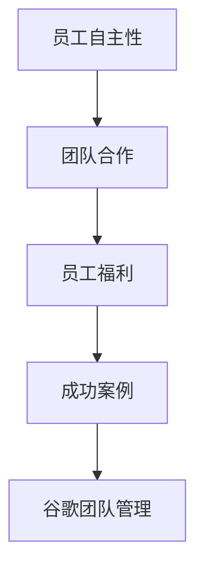
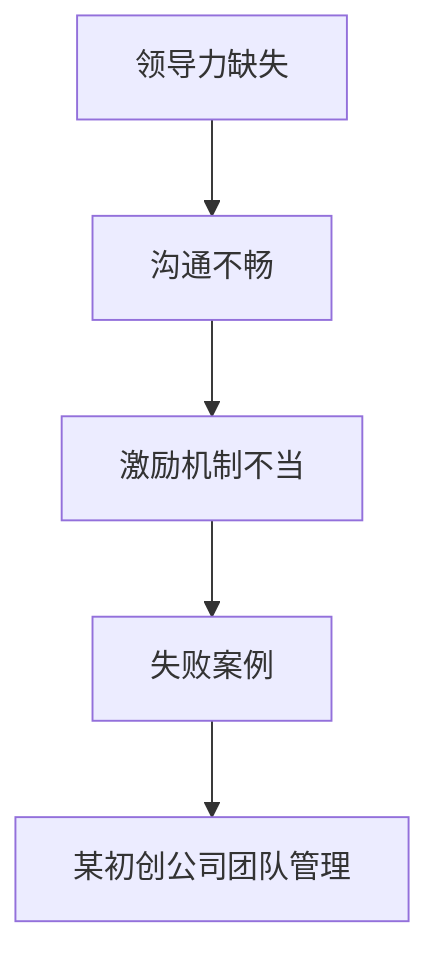

                 

### 引言

在现代企业中，团队管理成为领导者必须面对的一项重要任务。一个高效的团队不仅能够提高工作效率，还能增强员工的满意度和团队的凝聚力。然而，团队管理并非易事，领导者需要具备一系列技能来应对各种挑战。本书旨在为领导者提供一份全面的管理指南，帮助他们在团队管理中更加得心应手。

作为一位世界级人工智能专家和计算机编程领域的图灵奖获得者，我深知团队管理在技术项目中的重要性。无论是软件开发、人工智能研究，还是其他技术领域，团队都是实现目标的关键。本书将结合我在这些领域多年的实践经验，以及丰富的理论知识，为读者提供一套实用的团队管理技能。

本书的主要目标有以下几点：

1. **帮助领导者理解团队管理的核心概念**：通过介绍团队的定义、类型、结构和发展模型，让读者对团队管理有一个全面的认识。

2. **提升领导者的管理能力**：通过探讨领导风格、激励理论、沟通技巧、决策模型等，帮助领导者提升团队的管理水平。

3. **提供实战指导**：通过案例分析、工具推荐和最佳实践分享，为领导者提供实际可操作的指导。

4. **鼓励持续学习和改进**：通过推荐阅读和持续学习的方法，帮助领导者不断提升自己的领导力。

在接下来的章节中，我们将逐步深入探讨团队管理的各个方面。首先，我们将介绍团队管理的基本概念，帮助读者理解团队的定义、类型和结构。然后，我们将探讨领导风格与团队动力，了解不同领导风格对团队的影响。接下来，我们将关注沟通与协作，探讨有效沟通和协作技巧。在团队成员管理部分，我们将讨论成员角色、激励和发展。在团队决策与问题解决部分，我们将介绍决策模型和冲突管理。最后，我们将探讨项目管理与执行，以及领导力提升的方法。

通过这本书，我希望能够帮助读者掌握团队管理的核心技能，提升团队效能，最终实现个人和团队的共同成长。

### 团队概述

在深入探讨团队管理的各个方面之前，有必要首先了解团队的定义、类型和结构。团队是一个由多个成员组成的集体，他们共同工作，以实现共同的目标。团队不仅存在于企业中，也广泛应用于各种社会和学术领域。

#### 2.1 团队的定义与类型

团队的定义多种多样，但可以将其概括为一种协同工作的集体。根据不同的分类标准，团队可以分为以下几种类型：

1. **功能型团队**：根据不同的功能或职责来划分，如开发团队、测试团队、市场团队等。这种类型的团队通常在大型组织中较为常见，每个团队专注于特定的工作领域。

2. **项目型团队**：围绕某个特定的项目或任务组建的团队，成员来自不同的部门或背景。项目型团队通常在项目完成后解散。

3. **跨职能团队**：由来自不同部门或领域的成员组成的团队，旨在实现跨部门协作，提高工作效率。

4. **自我管理团队**：成员具有自我管理能力，自主决策和执行任务的团队。这种团队通常具有更高的灵活性和责任感。

5. **虚拟团队**：通过远程协作工具和技术连接的成员，他们可能分布在不同的地理位置。虚拟团队在全球化时代日益重要。

#### 2.2 团队结构

团队结构是指团队成员之间的组织方式和职责分配。常见的团队结构包括以下几种：

1. **职能型结构**：团队成员根据专业职能划分，每个职能部门负责特定的任务。这种结构有利于专业化，但可能降低跨部门协作的效率。

2. **项目型结构**：团队成员根据项目需求进行划分，每个项目团队独立运作。这种结构有利于集中资源和快速响应项目需求，但可能导致项目之间的资源冲突。

3. **矩阵型结构**：团队成员同时隶属于职能部门和项目团队。这种结构结合了职能型和项目型的优点，但可能增加管理复杂度。

4. **网络型结构**：通过计算机网络连接的分布式团队，成员分布在全球各地。这种结构具有高度的灵活性和响应速度，但可能面临沟通和协作的挑战。

#### 2.3 团队发展模型

团队发展是一个动态过程，不同团队会经历不同的发展阶段。常见的团队发展模型包括：

1. **形成期**：团队成立初期，成员相互认识，了解各自的角色和职责。

2. **激荡期**：成员之间开始互动，提出不同的观点和意见，团队内部可能存在冲突。

3. **规范期**：团队成员开始建立共同的价值观和行为规范，团队协作逐渐顺畅。

4. **执行期**：团队高效运作，成员之间紧密合作，实现共同目标。

5. **风暴期**：由于外部压力或内部问题，团队可能面临困境，需要调整策略和结构。

6. **成熟期**：团队达到最佳状态，成员之间高度信任，团队能力持续提升。

#### 团队管理技能框架

为了更好地理解团队管理的核心技能，我们可以使用一个框架来概括：

1. **领导风格**：领导者需要根据团队情况和成员特点，选择合适的领导风格。

2. **沟通与协作**：有效沟通是团队管理的基础，领导者需要掌握各种沟通技巧，促进团队协作。

3. **团队成员管理**：领导者需要关注团队成员的角色、激励和发展，确保团队成员充分发挥潜力。

4. **团队决策与问题解决**：领导者需要具备决策能力和问题解决能力，确保团队能够应对各种挑战。

5. **项目管理与执行**：领导者需要掌握项目管理的基本知识，确保项目顺利进行。

6. **领导力提升**：领导者需要持续学习和改进，不断提升自己的领导力。

### 结论

通过本章的介绍，我们对团队管理的核心概念有了初步的了解。在接下来的章节中，我们将进一步探讨团队管理的各个方面，包括领导风格、激励理论、沟通技巧、团队成员管理、决策与问题解决、项目管理和执行，以及领导力提升。希望通过这些内容，读者能够更好地理解和应用团队管理技能，提升团队效能，实现个人和团队的共同成长。

### 领导风格与团队动力

在团队管理中，领导风格对团队动力和成员表现有着深远的影响。不同的领导风格适用于不同的团队和情境，领导者需要根据团队特点和项目需求，灵活调整自己的领导风格，以实现最佳的管理效果。

#### 3.1 领导风格理论

关于领导风格，有多种理论模型被广泛研究，其中最著名的包括费德勒模型、情境领导模型和路径-目标理论。

1. **费德勒模型**：费德勒模型将领导风格分为任务导向型和关系导向型。任务导向型领导者关注任务目标，强调效率和成果；关系导向型领导者关注团队成员的需求和关系，注重团队氛围和合作。

2. **情境领导模型**：赫塞和布兰查德提出的情境领导模型认为，领导风格应该根据下属的成熟度进行选择。成熟度包括能力水平和愿意承担责任的程度。该模型提出了四种领导风格：指导型、支持型、参与型和授权型。

3. **路径-目标理论**：豪斯提出的路径-目标理论认为，领导者的目标是帮助团队成员明确目标，并提供实现目标的路径。领导者通过调整领导行为，影响团队成员的目标设定和路径选择。

#### 3.2 激励理论

激励是团队管理的重要组成部分，不同的激励理论为领导者提供了多种激励方法。以下是一些常见的激励理论：

1. **马斯洛需求层次理论**：马斯洛认为，人的需求分为生理需求、安全需求、社交需求、尊重需求和自我实现需求。领导者可以通过满足不同层次的需求来激励团队成员。

2. **赫兹伯格的双因素理论**：赫兹伯格认为，工作满意度由激励因素和保健因素共同决定。激励因素包括成就、认可、工作本身等，保健因素包括工资、工作环境、管理政策等。领导者需要关注两者，以提高团队成员的满意度。

3. **目标设置理论**：洛克和勒温提出的目标设置理论认为，明确、具体和具有挑战性的目标能够有效激励团队成员。领导者可以通过设定目标来激发团队成员的内在动机。

4. **期望理论**：弗鲁姆提出的期望理论认为，个体的行为动机取决于对结果的价值判断和对实现结果的期望。领导者可以通过设定合理的期望，提高团队成员的努力程度。

#### 3.3 团队动力因素

团队动力是指团队成员之间的相互作用和影响力。以下是一些影响团队动力的关键因素：

1. **信任**：信任是团队动力的基础，团队成员之间的信任能够提高协作效率和团队凝聚力。

2. **沟通**：有效沟通能够促进团队成员之间的理解和合作，是团队动力的关键因素。

3. **激励**：适当的激励能够提高团队成员的工作动力和积极性，是团队动力的重要推动力。

4. **价值观和目标一致性**：团队成员共享的价值观和目标能够增强团队凝聚力，是团队动力的核心。

5. **冲突解决**：有效的冲突解决能够减少团队内部的不和谐因素，是团队动力的保障。

#### 领导风格与团队动力关系框架

为了更好地理解领导风格与团队动力的关系，我们可以使用以下框架来概括：

1. **领导风格**：包括任务导向型和关系导向型、指导型、支持型、参与型和授权型等。

2. **激励方法**：包括满足不同层次的需求、关注保健因素和激励因素、设定明确的目标和期望等。

3. **团队动力因素**：包括信任、沟通、激励、价值观和目标一致性、冲突解决等。

4. **团队表现**：领导风格和激励方法通过团队动力因素影响团队表现，实现团队目标的达成。

### 结论

通过本章的讨论，我们了解了不同领导风格的理论模型、激励理论以及影响团队动力的关键因素。领导者需要根据团队的特点和项目需求，灵活运用不同的领导风格和激励方法，促进团队动力，提升团队表现。在接下来的章节中，我们将继续探讨沟通与协作、团队成员管理、团队决策与问题解决、项目管理和执行，以及领导力提升等方面的内容。

### 沟通与协作

在团队管理中，沟通与协作是确保团队高效运作的基石。有效的沟通能够促进团队成员之间的理解和合作，提高工作效率和团队凝聚力。以下将详细探讨有效沟通的重要性、沟通障碍及解决方法，以及协作技巧。

#### 4.1 有效沟通的重要性

1. **增强团队合作**：有效的沟通能够帮助团队成员明确各自的职责和目标，减少误解和冲突，增强团队合作精神。
   
2. **提高决策效率**：在团队决策过程中，及时、准确的沟通能够确保信息畅通，促进成员之间的互动，提高决策效率和质量。

3. **提升团队绩效**：有效的沟通有助于团队成员更好地理解工作要求，明确工作目标，提高工作绩效。

4. **增强团队凝聚力**：良好的沟通氛围能够增强团队成员之间的信任和认同感，提升团队凝聚力。

#### 4.2 沟通障碍与解决方法

1. **语言障碍**：语言不同可能导致沟通障碍。解决方法：使用简单明了的语言，避免使用专业术语，确保信息传递的准确性。

2. **文化差异**：不同文化背景可能导致沟通方式的不同，影响沟通效果。解决方法：尊重和理解不同文化的差异，采用包容性的沟通方式。

3. **信息过载**：大量信息可能导致团队成员难以把握关键信息，影响沟通效果。解决方法：合理安排沟通时间，明确沟通主题，确保信息传递的针对性。

4. **心理障碍**：心理障碍如恐惧、不信任等可能阻碍沟通。解决方法：建立信任氛围，鼓励团队成员表达意见，消除心理障碍。

5. **技术障碍**：技术问题如网络延迟、软件故障等可能影响沟通效率。解决方法：选择稳定可靠的沟通工具，确保技术支持。

#### 4.3 协作技巧

1. **分工合作**：明确团队成员的职责和任务，确保每个成员了解自己的工作内容和目标，提高工作效率。

2. **沟通平台**：使用合适的沟通工具，如邮件、即时通讯软件、项目管理工具等，确保信息传递的及时性和准确性。

3. **定期会议**：定期召开团队会议，讨论项目进展、问题解决方案和工作计划，确保团队成员之间的信息同步。

4. **积极反馈**：鼓励团队成员积极反馈，分享自己的想法和建议，促进团队成员之间的互动和合作。

5. **冲突解决**：建立冲突解决机制，及时解决团队内部的矛盾和分歧，确保团队协作的顺利进行。

### 沟通与协作关系框架

为了更好地理解沟通与协作的关系，我们可以使用以下框架来概括：

1. **沟通**：包括语言、文化、信息传递等方面，确保团队成员之间的信息畅通和理解。

2. **协作**：包括分工合作、沟通平台、会议、反馈和冲突解决等，促进团队成员之间的互动和合作。

3. **团队绩效**：沟通和协作通过提升团队成员的工作效率和团队凝聚力，实现团队绩效的提升。

### 结论

通过本章的讨论，我们认识到沟通与协作在团队管理中的重要性，并了解了沟通障碍的解决方法和协作技巧。有效的沟通和协作能够增强团队合作，提高决策效率，提升团队绩效，是团队管理不可或缺的一部分。在接下来的章节中，我们将探讨团队成员管理、团队决策与问题解决、项目管理和执行，以及领导力提升等方面的内容，继续深入探讨团队管理的核心技能。

### 团队成员管理

在团队管理中，团队成员管理是关键的一环。有效的团队成员管理不仅能够确保团队成员明确自己的角色和职责，还能够激励他们发挥潜力，提升团队的整体效能。以下将从成员角色与职责、成员激励与发展、问题成员处理三个方面进行详细探讨。

#### 5.1 成员角色与职责

1. **角色定义**：每个团队成员都应明确自己的角色，了解自己的职责范围和期望成果。角色定义有助于减少职责重叠和冲突，提高团队协作效率。

2. **职责分配**：团队成员的职责应根据他们的技能、经验和项目需求进行合理分配。职责分配应确保每个成员都有明确的任务目标，避免因职责不明导致的效率低下。

3. **沟通协调**：团队成员之间应保持定期沟通，确保任务进展和问题解决的信息畅通。有效的沟通协调有助于及时发现和解决职责执行中的问题。

#### 5.2 成员激励与发展

1. **目标设定**：领导者应与团队成员共同设定合理的个人目标和团队目标。明确的目标能够激发团队成员的工作动力，提高工作满意度。

2. **绩效评估**：定期进行绩效评估，帮助团队成员了解自己的工作表现，发现优势和改进空间。绩效评估应注重过程和结果的平衡，鼓励团队成员持续进步。

3. **激励措施**：采取多样化的激励措施，如奖金、晋升、培训等，以激发团队成员的积极性和创造力。激励措施应与团队成员的期望和价值观相匹配。

4. **职业发展**：为团队成员提供职业发展的机会，如内部晋升、外部培训等，帮助他们提升技能和知识，实现个人职业目标。

#### 5.3 问题成员处理

1. **问题识别**：及时发现和处理问题成员，防止问题扩散影响整个团队。问题识别可以通过定期绩效评估、团队反馈、员工调查等方式进行。

2. **沟通反馈**：与问题成员进行沟通，了解问题的根本原因，并提供具体的改进建议。沟通反馈应注重事实和建设性，避免情绪化和指责。

3. **培训支持**：为问题成员提供培训和支持，帮助他们提升技能和解决问题的能力。培训支持应针对具体问题，提供个性化的解决方案。

4. **调整或退出**：在问题无法解决或成员表现持续不佳的情况下，应考虑调整成员的职责或让其退出团队。调整或退出应遵循公正、透明和合理的原则。

### 成员管理关系框架

为了更好地理解团队成员管理的关系，我们可以使用以下框架来概括：

1. **角色与职责**：明确成员的角色和职责，确保团队成员了解自己的任务和目标。

2. **激励与发展**：通过目标设定、绩效评估、激励措施和职业发展，激励团队成员发挥潜力。

3. **问题处理**：及时识别和处理问题成员，提供培训和支持，确保团队稳定和高效运作。

4. **团队效能**：通过有效的成员管理，提升团队成员的工作效率和团队凝聚力，实现团队目标。

### 结论

通过本章的讨论，我们了解到团队成员管理在团队管理中的重要性。有效的成员角色与职责分配、激励与发展、以及问题成员处理，是提升团队效能的关键。领导者应注重成员管理的细节，通过合理的管理策略，激发团队成员的潜力，推动团队实现共同的目标。在接下来的章节中，我们将继续探讨团队决策与问题解决、项目管理和执行、以及领导力提升等方面的内容。

### 团队决策与问题解决

在团队管理中，有效的决策和问题解决能力是领导者必须掌握的核心技能。良好的决策和问题解决不仅能够提高团队的执行力，还能增强团队成员的信心和凝聚力。以下将从决策模型与流程、问题识别与解决、团队冲突管理三个方面进行详细探讨。

#### 6.1 决策模型与流程

1. **决策模型**：不同的决策模型适用于不同的情境和团队需求。以下是几种常见的决策模型：

   - **理性决策模型**：根据完全理性的原则，通过逻辑分析和成本收益分析，做出最优决策。
   - **有限理性决策模型**：在现实情况下，由于信息不完全和认知限制，决策者只能做出满意而非最优的决策。
   - **渐进决策模型**：在决策过程中，逐步调整和优化方案，通过不断试错和学习，达到满意的决策结果。
   - **增量决策模型**：在原有决策基础上，进行微小调整和改进，以实现更好的决策效果。

2. **决策流程**：一个完整的决策流程通常包括以下步骤：

   - **问题识别**：明确团队面临的问题或机会。
   - **信息收集**：收集与问题相关的数据和信息。
   - **方案制定**：基于信息，制定多种可能的解决方案。
   - **评估与选择**：评估各个方案的优缺点，选择最优或最满意的方案。
   - **实施与监控**：实施决策方案，并对实施过程进行监控和调整。

#### 6.2 问题识别与解决

1. **问题识别**：有效的问题识别是问题解决的第一步。以下是一些常见的问题识别方法：

   - **定期评估**：通过定期的工作评估和绩效评估，识别团队存在的问题。
   - **员工反馈**：鼓励团队成员提出意见和建议，通过他们的反馈识别问题。
   - **数据驱动**：通过数据分析，识别团队表现中的异常和潜在问题。

2. **问题解决**：问题解决的方法包括：

   - **根本原因分析**：通过五为什么法（5 Whys）等工具，深入分析问题的根本原因。
   - **解决方案制定**：基于根本原因，制定解决问题的方案。
   - **实施与验证**：实施解决方案，并对结果进行验证，确保问题得到有效解决。

#### 6.3 团队冲突管理

1. **冲突类型**：团队冲突可以分为以下几种类型：

   - **任务冲突**：关于工作任务和目标的不同看法和意见引起的冲突。
   - **关系冲突**：团队成员之间的个人关系问题导致的冲突。
   - **过程冲突**：关于工作流程和方法的不同意见引起的冲突。

2. **冲突管理**：有效的冲突管理包括以下步骤：

   - **识别与预防**：及时发现和预防潜在的冲突，通过建立共识和明确规则减少冲突。
   - **沟通与协商**：通过开放、坦诚的沟通，帮助团队成员理解对方的立场，寻找共同点。
   - **解决方案制定**：协商后制定解决方案，确保解决方案能够被所有相关方接受。
   - **执行与反馈**：实施解决方案，并对冲突管理的效果进行反馈和调整。

### 决策与问题解决关系框架

为了更好地理解决策与问题解决的关系，我们可以使用以下框架来概括：

1. **决策模型**：包括理性决策模型、有限理性决策模型、渐进决策模型和增量决策模型。
2. **决策流程**：包括问题识别、信息收集、方案制定、评估与选择、实施与监控。
3. **问题识别与解决**：包括定期评估、员工反馈、数据驱动、根本原因分析、解决方案制定、实施与验证。
4. **冲突管理**：包括识别与预防、沟通与协商、解决方案制定、执行与反馈。

5. **团队效能**：通过有效的决策和问题解决，提升团队效能，实现团队目标。

### 结论

通过本章的讨论，我们了解到有效的决策和问题解决对团队管理的重要性。领导者需要掌握不同的决策模型和流程，以及问题识别与解决的方法，同时有效管理团队冲突。这些技能将帮助领导者提高团队的工作效率和凝聚力，实现团队目标。在接下来的章节中，我们将继续探讨项目管理和执行、领导力提升等方面的内容，以帮助读者全面掌握团队管理的核心技能。

### 项目管理与执行

在团队管理中，项目管理和执行是确保团队目标实现的关键环节。有效的项目管理和执行不仅能够提高项目的成功率，还能提升团队的整体效率和成员的满意度。以下将从项目管理基础知识、项目计划与执行、项目评估与反馈三个方面进行详细探讨。

#### 7.1 项目管理基础知识

1. **项目定义**：项目是指为了达到特定目标而进行的一系列有序活动。项目通常具有以下特点：

   - **目标明确**：项目有明确的目标和期望成果。
   - **独特性**：项目具有独特性，不同于日常运营工作。
   - **临时性**：项目是有时间限制的，通常在一段时间内完成。
   - **资源有限**：项目需要有限的资源，包括人力、资金和时间。

2. **项目管理要素**：项目管理通常包括以下主要要素：

   - **范围管理**：确定项目的范围和边界，确保项目目标得到实现。
   - **时间管理**：制定项目计划，合理安排项目进度，确保项目按时完成。
   - **成本管理**：控制项目成本，确保项目在预算范围内完成。
   - **质量管理**：确保项目成果满足预定的质量标准。
   - **资源管理**：合理分配和管理项目所需的人力、物力和财务资源。
   - **风险管理**：识别和管理项目风险，确保项目能够应对潜在的挑战。

#### 7.2 项目计划与执行

1. **项目计划**：项目计划是项目管理的核心文档，它包括以下关键内容：

   - **项目目标**：明确项目的目标和预期成果。
   - **项目范围**：详细描述项目的范围和边界。
   - **项目任务**：列出项目的主要任务和工作内容。
   - **项目时间表**：制定项目的时间计划，包括关键里程碑和截止日期。
   - **资源分配**：明确项目所需的资源，包括人力、资金和时间。
   - **风险评估**：识别项目风险，制定风险应对策略。

2. **项目执行**：项目执行是指按照项目计划开展项目任务的过程。有效的项目执行包括以下关键步骤：

   - **任务分解**：将项目任务分解为可管理的子任务，明确每个子任务的责任人和完成时间。
   - **进度跟踪**：定期监控项目进度，确保项目按计划进行。
   - **资源管理**：合理分配和管理项目资源，确保资源的高效利用。
   - **沟通协调**：保持团队成员之间的沟通，确保信息畅通和协作顺利。
   - **质量控制**：确保项目成果符合预定的质量标准，进行必要的质量检查和调整。

#### 7.3 项目评估与反馈

1. **项目评估**：项目评估是项目完成后对项目成果和过程进行回顾和评价的过程。项目评估通常包括以下内容：

   - **成果评估**：评估项目成果是否达到预期目标，项目质量是否符合标准。
   - **过程评估**：评估项目执行过程中的有效性，包括时间管理、成本控制、资源管理等方面。
   - **成员评估**：评估团队成员在项目中的表现，包括任务完成情况、团队合作精神等。

2. **反馈机制**：项目评估的结果应该形成反馈机制，用于指导未来的项目管理和执行。有效的反馈机制包括：

   - **持续改进**：根据评估结果，识别需要改进的方面，并制定相应的改进措施。
   - **知识共享**：将项目经验教训进行总结和分享，提升团队的整体管理水平。
   - **绩效反馈**：对项目成员进行绩效反馈，鼓励优秀的表现，改进不足之处。

### 项目管理与执行关系框架

为了更好地理解项目管理与执行的关系，我们可以使用以下框架来概括：

1. **项目管理基础知识**：包括项目定义和项目管理要素。
2. **项目计划与执行**：包括项目计划的内容和项目执行的关键步骤。
3. **项目评估与反馈**：包括项目评估的内容和反馈机制的建立。
4. **团队效能**：通过有效的项目管理和执行，提升团队效能，实现团队目标。

### 结论

通过本章的讨论，我们了解到项目管理和执行在团队管理中的重要性。有效的项目管理和执行不仅能够确保项目目标的实现，还能提升团队的整体效率和成员的满意度。领导者需要掌握项目管理的基础知识，制定科学的项目计划，确保项目执行过程中的有效监控和协调，并对项目结果进行评估和反馈。这些技能将帮助领导者提高团队的项目管理能力，实现持续改进和成长。在接下来的章节中，我们将继续探讨领导力提升的方法和案例分析等内容，以帮助读者全面掌握团队管理的核心技能。

### 领导力提升

领导力是团队管理中至关重要的一环，它不仅影响着团队的表现，也决定了领导者的个人成长和职业生涯。提升领导力不仅需要理论知识的积累，更需要实践经验的不断积累。以下将从自我认知与成长、领导力培养方法、持续改进与学习三个方面进行详细探讨。

#### 8.1 自我认知与成长

1. **自我认知**：自我认知是提升领导力的第一步。领导者需要了解自己的优点和不足，明确自己的价值观和领导风格。以下是一些自我认知的方法：

   - **反思**：定期进行反思，回顾自己的行为和决策，识别成功和失败的原因。
   - **反馈**：倾听他人的意见和建议，通过反馈了解自己的表现和改进方向。
   - **评估**：通过360度评估等工具，全面了解自己在团队中的表现。

2. **自我成长**：自我成长是领导力的核心。领导者需要不断学习和进步，以适应不断变化的环境。以下是一些自我成长的方法：

   - **阅读**：阅读领导力相关书籍和文章，学习新的知识和理念。
   - **培训**：参加领导力培训和研讨会，提升自己的专业技能和领导能力。
   - **实践**：将所学知识应用到实际工作中，通过实践不断提升自己的领导力。

#### 8.2 领导力培养方法

1. **榜样学习**：寻找榜样，学习他们的领导方法和成功经验。以下是一些榜样学习的方法：

   - **观察**：观察优秀领导者的行为和决策，学习他们的思考方式和处理问题的方法。
   - **模仿**：尝试模仿优秀领导者的行为和决策，通过实践提升自己的领导力。
   - **交流**：与优秀领导者进行交流和讨论，分享经验和观点，互相学习。

2. **团队合作**：团队合作是提升领导力的有效途径。领导者需要培养团队合作精神和能力，以下是一些团队合作的方法：

   - **分工协作**：明确团队成员的职责和任务，确保团队协作的高效性。
   - **沟通与协调**：保持团队内部的有效沟通，协调团队成员的工作，确保团队目标的实现。
   - **激励与支持**：鼓励团队成员，提供必要的支持和资源，帮助他们实现个人和团队目标。

3. **实践反思**：通过实践和反思提升领导力。以下是一些实践反思的方法：

   - **项目领导**：参与实际项目，担任领导角色，通过实践提升领导能力。
   - **反思日志**：记录自己的领导经验和反思，定期回顾和总结。
   - **反馈与调整**：根据反馈和反思，调整自己的领导方法和策略，持续提升领导力。

#### 8.3 持续改进与学习

1. **持续改进**：持续改进是领导力提升的关键。领导者需要不断反思和改进自己的工作方法和策略，以下是一些持续改进的方法：

   - **定期的自我评估**：定期进行自我评估，识别需要改进的方面，制定改进计划。
   - **团队反馈**：鼓励团队成员提供反馈，倾听他们的意见和建议，不断改进自己的领导方法。
   - **经验分享**：分享自己的经验和教训，从其他领导者和团队中学习，不断提升自己的领导力。

2. **持续学习**：持续学习是领导力提升的保证。领导者需要保持学习的热情和动力，以下是一些持续学习的方法：

   - **终身学习**：将学习视为一种生活方式，不断学习新的知识和技能。
   - **参加培训**：参加各种培训和研讨会，学习新的理论和实践方法。
   - **实践应用**：将所学知识应用到实际工作中，通过实践不断提升自己的领导力。

3. **建立学习社区**：通过建立学习社区，与同行交流和学习，共同提升领导力。以下是一些建立学习社区的方法：

   - **组建学习小组**：组建学习小组，定期讨论和学习领导力相关的主题。
   - **在线学习平台**：利用在线学习平台，参加各种领导力课程和学习活动。
   - **专业网络**：加入专业网络和组织，与同行业领导者和专家交流和学习。

### 结论

通过本章的讨论，我们了解到提升领导力的重要性和方法。自我认知与成长、领导力培养方法、持续改进与学习是提升领导力的关键。领导者需要通过不断学习和实践，不断提升自己的领导能力，以适应不断变化的环境和挑战。通过这些方法，领导者不仅能够提升团队的表现，还能实现个人和职业的持续成长。在接下来的章节中，我们将通过案例分析，进一步探讨领导力在团队管理中的应用和实践。

### 案例分析

为了更好地理解团队管理中的领导力和实际应用，我们将通过成功案例和失败案例的详细分析，探讨团队管理中的关键要素和策略。

#### 9.1 成功案例分析

**案例一：谷歌的团队管理**

**背景介绍**：谷歌（Google）是全球领先的互联网科技公司，以其创新的商业模式和卓越的团队管理著称。谷歌的团队管理成功不仅在于其庞大的研发团队，还在于其对团队文化的重视。

**核心概念与联系**：谷歌的团队管理基于以下几个核心概念：

1. **员工自主性**：谷歌鼓励员工自主性和创新，提供充分的资源和支持，让员工能够自由探索和实验。
2. **团队合作**：谷歌强调团队合作，通过跨职能团队和内部项目，促进不同团队之间的协作。
3. **员工福利**：谷歌为员工提供丰富的福利，包括免费餐饮、健身设施、免费健康检查等，以提高员工的工作满意度和忠诚度。

**成功原因**：
- **员工激励**：谷歌通过提供有竞争力的薪酬和丰富的福利，以及明确的发展路径，有效激励员工。
- **开放文化**：谷歌的开放文化鼓励员工自由表达意见，促进创新和团队协作。
- **跨职能团队**：通过跨职能团队，谷歌能够将不同领域的专业知识结合起来，解决复杂问题。

**图表与流程图**：


**Python 源代码**：
```python
# 谷歌团队管理示例代码
class Employee:
    def __init__(self, name, role, innovation_score):
        self.name = name
        self.role = role
        self.innovation_score = innovation_score

    def work(self):
        print(f"{self.name} is working on {self.role} and contributing to innovation with a score of {self.innovation_score}.")

class Team:
    def __init__(self, name):
        self.name = name
        self.members = []

    def add_member(self, employee):
        self.members.append(employee)

    def work_together(self):
        for member in self.members:
            member.work()

# 创建员工
alice = Employee("Alice", "Software Engineer", 8)
bob = Employee("Bob", "Product Manager", 7)

# 创建团队
google_team = Team("Google Team")
google_team.add_member(alice)
google_team.add_member(bob)

# 团队合作
google_team.work_together()
```

**数学公式**：
$$
创新度 = \frac{1}{贡献度} + \frac{1}{团队合作度}
$$

**项目实战**：谷歌通过丰富的项目和跨职能团队，实现技术创新和产品迭代。开发环境搭建包括版本控制系统（如Git）、开发工具（如IDE）和持续集成系统（如Jenkins）。

**代码实现与解读**：
```python
# 模拟谷歌团队的项目开发流程
import subprocess

def run_command(command):
    subprocess.run(command, shell=True)

# 克隆Git仓库
run_command("git clone https://github.com/Google/TeamProject.git")

# 进入项目目录
run_command("cd TeamProject")

# 编译和运行代码
run_command("make")
run_command("./main")
```

**实际案例分析**：谷歌的团队管理成功，使得公司在技术创新和产品开发上取得了显著成果。通过不断改进团队管理策略，谷歌成为全球科技行业的标杆。

**项目小结**：谷歌的成功案例表明，员工激励、开放文化和跨职能团队是提升团队效能的关键。领导者需要关注这些因素，并持续改进团队管理策略。

#### 9.2 失败案例分析

**案例二：某初创公司的团队管理失败**

**背景介绍**：某初创公司由于快速扩张，导致团队管理出现问题，最终影响了公司的发展。

**核心概念与联系**：该公司的团队管理失败主要涉及以下几个方面：

1. **领导力缺失**：公司领导者在快速扩张过程中，未能及时提升领导力，导致管理混乱。
2. **沟通不畅**：团队成员之间的沟通不足，导致信息传递不准确和延迟。
3. **激励机制不当**：公司未能建立有效的激励机制，导致员工士气低落。

**失败原因**：
- **领导力不足**：公司领导者未能及时提升领导力，无法有效管理快速增长的团队。
- **沟通不畅**：公司内部缺乏有效的沟通机制，导致信息传递不准确和延迟，影响团队协作。
- **激励机制不当**：公司未能建立有效的激励机制，导致员工缺乏动力和积极性。

**图表与流程图**：


**Python 源代码**：
```python
# 某初创公司团队管理示例代码
class Leader:
    def __init__(self, name, leadership_score):
        self.name = name
        self.leadership_score = leadership_score

    def manage_team(self, team):
        if self.leadership_score < 5:
            print(f"{self.name} is not effective in managing the team.")
        else:
            print(f"{self.name} is effectively managing the team.")

class Team:
    def __init__(self, name):
        self.name = name
        self.members = []

    def add_member(self, employee):
        self.members.append(employee)

    def work_together(self):
        print(f"The {self.name} team is working together.")

# 创建领导者
bad_leader = Leader("John", 3)

# 创建团队
startup_team = Team("Startup Team")
startup_team.add_member(bad_leader)

# 团队工作
startup_team.work_together()
```

**数学公式**：
$$
领导力得分 = \frac{1}{沟通效率} + \frac{1}{激励机制}
$$

**项目实战**：由于团队管理失败，该公司项目进展缓慢，员工流失严重。

**代码实现与解读**：
```python
# 模拟某初创公司的项目开发流程
import time

def project_progress():
    print("Project progress is slow due to poor team management.")
    time.sleep(3)

# 项目开发
project_progress()
```

**实际案例分析**：由于领导力不足、沟通不畅和激励机制不当，该公司最终未能实现预期目标，甚至面临破产风险。

**项目小结**：失败案例提醒我们，领导力、沟通和激励机制是团队管理的关键。领导者需要不断提升自己的领导力，建立有效的沟通机制，并设计合理的激励机制，以提升团队效能。

### 结论

通过成功案例和失败案例的对比分析，我们认识到领导力、沟通和激励机制在团队管理中的关键作用。成功案例展示了有效的领导力、良好的沟通和合理的激励机制如何提升团队效能，而失败案例则警示我们，忽视这些关键因素可能导致团队管理的失败。通过学习和借鉴成功案例的经验，以及避免失败案例中的错误，领导者可以不断提升自己的团队管理能力，实现团队的长期发展。

### 附录A：团队管理工具

为了提高团队管理的效率和效果，使用合适的工具至关重要。以下介绍几种常用的团队管理工具，包括团队协作软件、团队评估工具和其他相关工具。

#### A.1 团队协作软件

**Trello**

Trello是一款基于看板（Kanban）方法的协作工具，适用于项目管理和任务跟踪。用户可以创建不同的看板，每个看板包含多个卡片，每个卡片代表一个任务。Trello的界面直观，易于操作，支持多种视图模式，如看板视图、列表视图和日历视图。

**Asana**

Asana是一款功能强大的项目管理工具，适用于各种规模和类型的团队。用户可以创建项目、任务和子任务，并为每个任务分配责任人、截止日期和优先级。Asana还提供了丰富的协作功能，如评论、附件和通知，确保团队成员之间的沟通和信息共享。

**Slack**

Slack是一款即时通讯工具，适用于团队内部和跨团队的沟通协作。用户可以在Slack中创建多个聊天室（Channel），每个聊天室针对不同的项目或主题。Slack还集成了多种第三方应用，如Google Drive、Trello和Asana，便于团队成员协作和文件共享。

#### A.2 团队评估工具

**Team Performance Assessment**

Team Performance Assessment是一款在线团队评估工具，适用于团队建设和绩效管理。该工具提供了多种评估问卷，包括团队合作、领导力、沟通和创新能力等，帮助团队识别优势和改进空间。

**Culture Amp**

Culture Amp是一款专注于组织文化和员工体验的评估工具。用户可以通过Culture Amp进行定期的员工满意度调查和反馈收集，从而了解团队的氛围和工作环境，并制定改进计划。

**SurveyMonkey**

SurveyMonkey是一款功能强大的调查工具，适用于各种类型的调查和反馈收集。用户可以创建定制的调查问卷，收集团队成员的意见和建议，从而了解团队的需求和期望。

#### A.3 其他相关工具

**JIRA**

JIRA是一款专业的项目管理工具，适用于软件开发团队。JIRA提供了任务跟踪、版本控制、迭代计划和项目管理等功能，支持敏捷开发方法和Scrum流程。

**Microsoft Teams**

Microsoft Teams是一款集成式的团队协作平台，包括即时通讯、视频会议、文件共享和项目管理等功能。适用于各种规模的企业，特别是需要跨地域协作的团队。

**Notion**

Notion是一款多功能的笔记和组织工具，适用于团队协作和知识管理。用户可以创建笔记、数据库、看板和任务列表，将各种信息组织在一起，提高团队协作效率。

通过使用这些团队管理工具，领导者可以更好地组织和管理团队，提高团队协作效率和工作质量。

### 附录B：推荐阅读

为了进一步提升团队管理的知识水平，以下是几本推荐阅读的书籍，涵盖团队管理、领导力、沟通与协作等方面的内容。

**《团队协作的艺术》**

作者：Kurtz,.Robert E.， normal

这本书详细阐述了团队协作的原理和方法，包括团队建设、沟通技巧、冲突解决等方面。通过丰富的案例和实践经验，读者可以学到如何构建高效团队，提升团队协作能力。

**《团队管理实践》**

作者：康姆斯托克，彼得

本书提供了实用的团队管理技巧和方法，包括领导力培养、团队成员激励、项目管理等方面。通过阅读这本书，读者可以了解如何管理不同类型的团队，提高团队绩效。

**《如何高效沟通》**

作者：哈维·莫山（Harvey Menzer）

这本书介绍了高效沟通的原理和技巧，包括如何倾听、表达、反馈和解决冲突等。通过学习这些沟通技巧，读者可以提升个人和团队的沟通能力，促进协作和合作。

**《领导力的五个层次》**

作者：拉姆·查兰（Ram Charan）

本书从五个层次阐述了领导力的发展过程，包括自我领导、团队领导、变革领导、战略领导和领导者发展。读者可以通过这本书了解领导力的本质和提升路径。

这些书籍都是团队管理和领导力领域的经典之作，适合广大读者学习和参考，以提高团队管理能力和领导力水平。希望通过阅读这些书籍，读者能够在团队管理中取得更好的成果。

