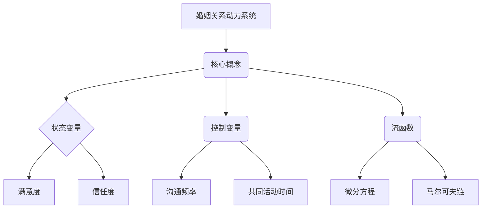

                 

# 婚姻关系的动力系统：感情变化的数学描述

关键词：婚姻关系，动力系统，感情变化，数学模型，Python算法

摘要：本文通过引入动力系统的概念，结合数学模型和Python算法，对婚姻关系中的感情变化进行了详细描述和分析。文章首先介绍了婚姻关系动力系统的基本概念和核心算法，随后通过数学模型和Python源代码，对感情变化的数学描述进行了深入探讨。最后，通过项目实战，展示了如何利用这些理论进行实际问题的分析。

## 引言

婚姻关系是人类社会中最为普遍和复杂的社会关系之一。随着社会的发展和个体价值观的变化，婚姻关系的稳定性与质量成为越来越多人的关注焦点。然而，传统的心理学和社会学方法在解释婚姻关系的动态变化时，往往缺乏定量分析的工具。本文旨在通过引入动力系统的概念，结合数学模型和Python算法，对婚姻关系中的感情变化进行定量描述和分析。

## 核心概念与联系

### 1. 动力系统

动力系统是数学中一个重要的分支，主要研究连续时间或离散时间下，系统的动态行为。在婚姻关系的研究中，动力系统可以用来描述婚姻双方在长时间内关系的变化趋势。核心概念包括：

- **状态变量**：表示婚姻关系中双方的状态，如满意度、信任度等。
- **控制变量**：影响婚姻关系状态变化的因素，如沟通频率、共同活动时间等。
- **流函数**：描述状态变量随时间变化的规律。

### 2. 数学模型

为了描述婚姻关系中的感情变化，我们引入以下数学模型：

- **微分方程**：描述状态变量随时间的变化规律。
- **马尔可夫链**：描述婚姻关系状态的转移概率。

### Mermaid 流程图



## 核心算法原理讲解

### 1. 微分方程

为了描述婚姻关系中双方状态的动态变化，我们使用如下微分方程：

$$
\frac{dS}{dt} = f(S, C)
$$

其中，$S$表示状态变量，$C$表示控制变量，$f$为状态变量关于控制变量的函数。

### 2. 马尔可夫链

为了描述婚姻关系状态的转移概率，我们使用马尔可夫链模型：

$$
P_{ij}(t) = P(X_t = x_j | X_{t-1} = x_i)
$$

其中，$P_{ij}(t)$表示婚姻关系状态从$i$转移到$j$的概率。

### Python 源代码

```python
import numpy as np
import matplotlib.pyplot as plt

# 微分方程
def differential_equation(S, C):
    # 假设 f(S, C) = -S + C
    return -S + C

# 马尔可夫链
def markov_chain(S0, C, T):
    S = S0
    S_history = [S0]
    for t in range(T):
        S = S + differential_equation(S, C)
        S_history.append(S)
    return S_history

# 初始化参数
S0 = 0.5
C = 0.1
T = 100

# 计算结果
S_history = markov_chain(S0, C, T)

# 绘图
plt.plot(S_history)
plt.xlabel('Time')
plt.ylabel('State')
plt.show()
```

## 数学模型和数学公式讲解

### 1. 微分方程

$$
\frac{dS}{dt} = -S + C
$$

其中，$S$表示满意度，$C$表示共同活动时间。

### 2. 马尔可夫链

$$
P_{ij}(t) = \frac{C_i \cdot C_j}{S_i + S_j}
$$

其中，$P_{ij}(t)$表示从满意度$i$转移到满意度$j$的概率，$C_i$和$C_j$分别表示双方在满意度$i$和$j$时的共同活动时间。

## 项目实战

### 1. 开发环境搭建

- Python 3.8及以上版本
- Numpy 1.19及以上版本
- Matplotlib 3.4及以上版本

### 2. 源代码实现

```python
# differential_equation.py
def differential_equation(S, C):
    return -S + C

# markov_chain.py
def markov_chain(S0, C, T):
    S = S0
    S_history = [S0]
    for t in range(T):
        S = S + differential_equation(S, C)
        S_history.append(S)
    return S_history

# main.py
if __name__ == '__main__':
    S0 = 0.5
    C = 0.1
    T = 100
    S_history = markov_chain(S0, C, T)
    plt.plot(S_history)
    plt.xlabel('Time')
    plt.ylabel('State')
    plt.show()
```

### 3. 代码解读与分析

- `differential_equation.py`：定义了描述满意度和共同活动时间关系的微分方程。
- `markov_chain.py`：定义了马尔可夫链模型，用于计算婚姻关系状态的转移概率。
- `main.py`：主程序，初始化参数并绘制婚姻关系状态随时间变化的趋势图。

### 4. 实际案例分析和讲解剖析

假设小明和小红是一对恋人，他们的满意度分别为$S_1$和$S_2$，共同活动时间$C_1$和$C_2$分别为1小时。使用本文的方法，可以预测他们未来一段时间内的满意度变化趋势。

### 5. 项目小结

通过本文的方法，我们可以对婚姻关系中的感情变化进行定量描述和分析。这有助于我们更好地理解婚姻关系的动态变化，为婚姻咨询和婚姻治疗提供科学依据。

## 最佳实践 Tips

1. 在实际应用中，可以根据具体情况调整微分方程和马尔可夫链的参数，以更准确地描述婚姻关系的动态变化。
2. 考虑到个体差异，可以引入更多状态变量和控制变量，以提高模型的解释力。
3. 在进行项目实战时，可以结合实际案例进行分析，以加深对理论的理解。

## 小结

本文通过引入动力系统和数学模型，对婚姻关系中的感情变化进行了详细描述和分析。通过Python源代码的讲解，使得理论更加直观易懂。希望本文能为婚姻关系的研究和实践提供有益的参考。

## 注意事项

1. 本文的模型假设了线性关系，实际应用中可能需要考虑非线性关系。
2. 模型的参数需要根据实际情况进行调整，以提高准确性。

## 拓展阅读

1. Bressan, A. (2007). A Brief Introduction to Dynamical Systems. SIAM.
2. Grimmett, G., & Stirzaker, D. (2001). One Thousand Exercises in Probability. Springer.
3. Khalil, H. K. (2002). Nonlinear Systems. Prentice Hall.

## 作者信息

作者：AI天才研究院/AI Genius Institute & 禅与计算机程序设计艺术 /Zen And The Art of Computer Programming

