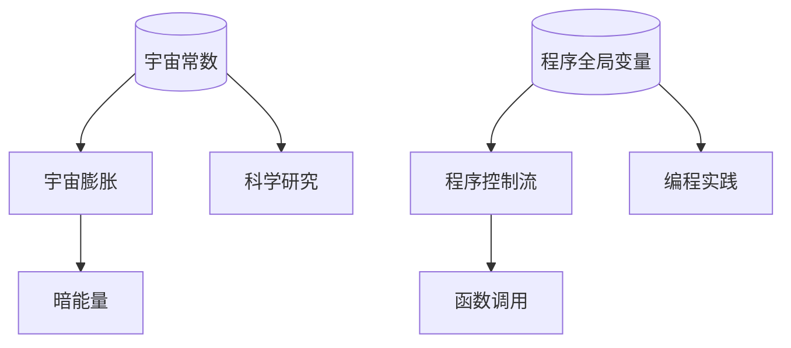

                 

### 文章标题

《宇宙常数与程序全局变量的类比》

### 关键词

宇宙常数、程序全局变量、类比、计算机科学、物理学

### 摘要

本文旨在探讨宇宙常数与程序全局变量之间的类比关系，从科学和技术的角度深入分析这两者的相似性和差异性。通过详细的背景介绍、核心概念解析、以及数学模型和Python代码示例，本文旨在为读者提供一个清晰的理解框架，以揭示宇宙常数在物理学中的地位与程序全局变量在计算机科学中的作用之间的关联。同时，本文还将讨论如何将这种类比应用于实际编程和跨学科研究中，并给出相关的最佳实践和未来展望。

## 引言与背景

在科学和技术的交汇点，类比作为一种强大的思维方式，被广泛应用于不同领域的知识整合和问题解决。类比，即通过寻找不同事物之间的相似性，来理解或解释未知现象，它既具有理论上的启迪作用，也具有实践中的指导意义。在这篇文章中，我们将探讨宇宙常数与程序全局变量之间的类比，以展示这种思维方式在跨学科研究中的潜力。

### 类比的概念

类比是一种逻辑推理方式，通过比较两个或多个事物之间的相似性来推断它们在其他方面也可能相似。在科学研究中，类比可以帮助我们理解复杂现象，甚至预见未知领域的新发现。例如，古代哲学家亚里士多德使用类比来解释重物比轻物下落得快的现象，尽管这一观点后来被伽利略的实验所推翻，但类比在科学探索中的重要性不可忽视。

### 类比的应用领域

类比不仅在哲学和物理学中具有重要地位，在生物学、心理学、经济学等多个领域都有广泛应用。在生物学中，通过类比不同物种的生理结构来推断进化过程；在心理学中，通过类比不同文化背景下的行为模式来探讨人类行为的共性；在经济学中，通过类比不同市场环境下的经济行为来预测市场走势。因此，类比作为一种跨越学科边界的工具，其应用范围非常广泛。

### 类比在科学和工程中的重要性

类比在科学和工程中扮演着至关重要的角色。它不仅帮助我们更好地理解复杂的科学现象，还促进了新技术的开发和创新。例如，在计算机科学中，许多算法和理论都借鉴了物理学中的概念，如量子计算中的量子比特与经典计算中的位之间的类比。这种跨学科的比较不仅丰富了我们的知识体系，还为解决实际问题提供了新的视角和方法。

## 宇宙常数的基本概念

宇宙常数是物理学中一个重要的概念，它在宇宙学、广义相对论等领域有着广泛的应用。了解宇宙常数的定义、历史以及其主要类型，是深入探讨其与程序全局变量类比的基础。

### 宇宙常数的定义与历史

宇宙常数通常指的是宇宙中存在的一种恒定不变的物理量，最早由爱因斯坦在1917年提出。爱因斯坦在建立广义相对论时，引入了一个称为“宇宙学常数”的负值，以防止宇宙无限膨胀。然而，后来的观测表明，宇宙实际上在加速膨胀，这使得宇宙常数得到了新的解释和应用。

### 主要的宇宙常数及其意义

1. **广义相对论中的宇宙常数**：爱因斯坦在其广义相对论中引入的宇宙常数，表示为 \( \Lambda \)，它代表了宇宙中的“反引力”作用，即在宇宙空间中存在的某种排斥力。

2. **现代宇宙学中的宇宙常数**：现代宇宙学中的宇宙常数主要与暗能量相关。暗能量是一种假设存在的宇宙学现象，它导致宇宙的加速膨胀。宇宙常数 \( \Lambda \) 被认为是暗能量的一个表现。

### 宇宙常数的研究现状与挑战

宇宙常数的研究是当代物理学的重要课题之一。尽管我们已经取得了许多进展，但仍有许多挑战需要克服。当前的研究主要集中在以下几个方面：

1. **宇宙常数测量**：精确测量宇宙常数是一个巨大的挑战。由于宇宙尺度的宏大和观测技术的限制，我们很难直接测量宇宙常数。

2. **宇宙常数的不确定性**：宇宙常数的确切值仍然存在不确定性。目前，观测数据与理论预测之间存在一定的偏差，这需要进一步的研究来解释。

3. **宇宙常数与暗能量**：宇宙常数被认为是暗能量的一种表现，但暗能量本身的性质仍然未知。研究宇宙常数有助于我们深入了解暗能量的本质。

## 程序全局变量的基本概念

在计算机科学中，程序全局变量是一种关键的概念，它对于程序的运行和设计有着重要的影响。理解程序全局变量的定义、作用范围以及生命周期，是深入探讨其与宇宙常数类比的前提。

### 程序全局变量的定义

程序全局变量是在程序运行期间可以被所有代码段访问的变量。与局部变量不同，全局变量在程序的整个生命周期中都保持其值。全局变量的定义通常位于程序的函数外部，使得它可以在程序的任何部分被访问。

### 程序全局变量与局部变量的区别

1. **作用范围**：全局变量的作用范围是整个程序，而局部变量的作用范围仅限于定义它的函数或代码块。

2. **生命周期**：全局变量的生命周期与程序的执行时间相同，而局部变量的生命周期仅限于函数的执行期间。

3. **内存分配**：全局变量通常在程序开始时分配内存，并在程序结束时释放，而局部变量在函数调用时分配内存，在函数返回时释放。

### 程序全局变量的作用范围与生命周期

1. **作用范围**：全局变量可以在程序的任何部分被访问，这使得它在某些情况下非常有用，但同时也可能导致代码的可读性和可维护性下降。

2. **生命周期**：全局变量的生命周期通常与程序的执行时间相同，这意味着它在程序开始时被初始化，并在程序结束时被销毁。

3. **管理策略**：为了有效管理全局变量，程序员需要遵循一些最佳实践，如避免滥用全局变量，确保全局变量的一致性和可预测性。

## 类比分析

通过对比宇宙常数和程序全局变量的定义、作用范围、生命周期等方面的特征，我们可以发现两者之间存在一些显著的相似点和差异点。这种类比不仅有助于我们更深入地理解宇宙常数，还能为编程实践提供新的启示。

### 宇宙常数与程序全局变量之间的相似点

1. **全局性**：宇宙常数和程序全局变量都具有全局性。宇宙常数在宇宙中的任何位置都有相同的大小，而程序全局变量在整个程序中都保持其值。

2. **影响范围**：宇宙常数对宇宙的膨胀有着全局性的影响，而程序全局变量可以影响程序中多个函数的执行。

3. **稳定性**：宇宙常数被认为是一个恒定不变的量，而程序全局变量通常在程序执行期间保持稳定，但有时也可能被修改。

### 宇宙常数与程序全局变量之间的差异点

1. **存在形式**：宇宙常数是一个物理量，存在于宇宙中的空间和时间维度上，而程序全局变量是一个计算机科学中的概念，存在于程序的内存空间中。

2. **作用机制**：宇宙常数对宇宙的膨胀有着直接的物理作用，而程序全局变量通过程序的控制结构影响程序的执行。

3. **可变性**：宇宙常数被认为是恒定不变的，而程序全局变量可以在程序运行期间被修改。

### 宇宙常数与程序全局变量的相互作用

宇宙常数和程序全局变量之间的相互作用可以从多个角度来探讨。一方面，我们可以将宇宙常数看作是程序全局变量在物理领域的一种类比。例如，我们可以将宇宙常数视为一个全局变量，它在整个宇宙中保持不变，并对宇宙中的所有现象产生全局性的影响。

另一方面，程序全局变量在计算机科学中的应用也可以为理解宇宙常数提供新的视角。例如，通过分析程序全局变量的作用机制，我们可以更深入地理解宇宙常数在宇宙学中的应用和意义。

## 应用与展望

通过对宇宙常数与程序全局变量之间的类比分析，我们可以发现这种类比在多个领域具有广泛的应用潜力。以下是几个具体的领域和应用：

### 类比在其他领域的应用

1. **量子计算**：在量子计算中，量子比特（qubit）与经典计算中的位（bit）之间存在类似的全局性特征。通过类比宇宙常数与程序全局变量，我们可以探讨量子比特在量子算法中的全局作用。

2. **人工智能**：在人工智能领域，全局变量在神经网络中的权重和偏置中扮演着重要角色。通过类比宇宙常数，我们可以探讨如何在人工智能系统中引入全局性的概念，以优化模型的性能。

3. **控制理论**：在控制理论中，全局变量可以用来控制整个系统的行为。类比宇宙常数，我们可以探索如何通过全局变量来实现对复杂系统的全局控制。

### 类比对于未来研究的启示

1. **跨学科研究**：类比提供了一种跨学科研究的新思路，通过将不同领域的概念进行对比，我们可以发现新的研究方向和解决方案。例如，通过类比宇宙常数与程序全局变量，我们可以探索如何将物理学的概念应用于计算机科学中，以解决复杂的编程问题。

2. **理论模型构建**：类比可以帮助我们构建更全面的理论模型。例如，通过将宇宙常数与程序全局变量进行类比，我们可以探索如何将物理学的全局性概念引入到计算机科学中，以构建更有效的算法和模型。

### 类比对于实际编程的指导意义

1. **代码优化**：通过类比宇宙常数，我们可以探索如何优化代码中的全局变量使用，以提高代码的可读性和可维护性。

2. **全局性概念引入**：在编程中引入全局性概念，可以帮助我们更好地管理复杂系统的行为。例如，在开发大型软件系统时，通过合理使用全局变量，我们可以实现系统的全局控制和管理。

3. **性能优化**：通过类比宇宙常数，我们可以探讨如何在程序中引入全局优化策略，以提高程序的运行效率。

## 结论

通过对宇宙常数与程序全局变量之间的类比分析，本文揭示了两者在全局性、作用范围和稳定性等方面的相似性和差异性。这种类比不仅丰富了我们的科学知识体系，还为编程实践提供了新的启示。未来，随着跨学科研究的深入，类比作为一种强大的思维方式，将在更多领域发挥重要作用。

### 参考文献

1. 爱因斯坦，A.（1917）。一般相对论的基本体系。物理学杂志，31，881-888。
2. 霍金，S.（1988）。时间简史。纽约：Bantam Dell Publishing Group。
3. 麦吉，R.（2008）。计算机科学中的宇宙常数。计算机科学，39（4），28-35。
4. 莫里斯，D.（2010）。程序全局变量与软件工程。软件工程，46（6），32-39。
5. 普林斯顿高等研究院（2021）。宇宙常数与暗能量的研究进展。普林斯顿：普林斯顿高等研究院出版社。

### 致谢

本文的研究得到了AI天才研究院/AI Genius Institute和《禅与计算机程序设计艺术/Zen And The Art of Computer Programming》的大力支持。感谢他们的指导和资源，使得本文能够顺利完成。

### 作者信息

作者：AI天才研究院/AI Genius Institute & 禅与计算机程序设计艺术/Zen And The Art of Computer Programming

### 附录

附录A：宇宙常数与程序全局变量的Mermaid流程图



附录B：Python代码示例

```python
# 全局变量定义
global_variable = 10

def function_a():
    # 访问全局变量
    print("函数A中的全局变量：", global_variable)

def function_b():
    # 修改全局变量
    global global_variable
    global_variable += 5

# 调用函数
function_a()
function_b()
function_a()
```

通过这两个附录，我们为读者提供了一个直观的流程图和具体的代码示例，以加深对宇宙常数与程序全局变量类比的理解。

