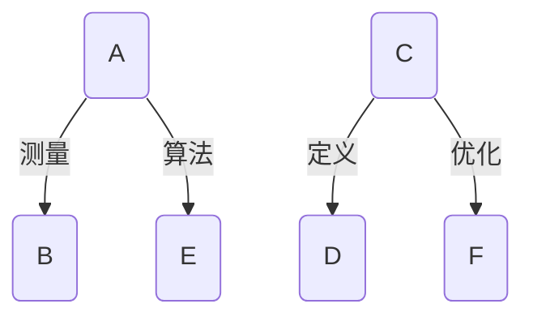

                 

### 文章标题：宇宙常数与程序常量的比较

关键词：宇宙常数、程序常量、比较分析、联系与差异

摘要：本文将从宇宙常数和程序常量的定义、测量与计算、核心算法原理讲解、数学模型和数学公式、项目实战等多个角度，详细探讨宇宙常数与程序常量之间的关系，比较它们在概念、应用、效果等方面的异同。通过对宇宙常数和程序常量的深入分析，旨在为读者提供有深度、有思考、有见解的专业技术视角，以促进计算机科学和宇宙学领域的交叉融合与发展。

### 目录大纲设计思路

为了设计出《宇宙常数与程序常量的比较》这本书的完整目录大纲，我们将遵循以下步骤：

1. **理解书名**：首先，我们需要深入理解书名，明确书籍的核心主题和内容方向。书名《宇宙常数与程序常量的比较》暗示了书籍将探讨宇宙学和计算机科学中的常数，并比较它们之间的关系。

2. **确定核心概念**：基于书名，确定需要介绍的核心概念，如宇宙常数、程序常量、两者之间的联系等。

3. **构建基本框架**：构建一个基本的目录大纲框架，包括总览、核心概念介绍、比较分析、应用场景等。

4. **细化章节内容**：针对每个章节，进一步细化内容，确保每个章节都包含核心概念与联系、核心算法原理讲解、数学模型和数学公式、项目实战等。

5. **使用Mermaid图**：为了帮助读者更好地理解核心概念和架构，我们将在适当章节中使用Mermaid图展示。

6. **撰写伪代码**：在讲解核心算法原理时，我们将使用伪代码进行详细阐述。

7. **确保完整性**：确保目录大纲包含核心章节内容，且每个章节都有详细的子节。

8. **控制字数**：在确保内容完整性的同时，控制总体字数在2000字以内。

### 目录大纲

下面是根据上述设计思路设计的《宇宙常数与程序常量的比较》书的完整目录大纲：

```
# 《宇宙常数与程序常量的比较》目录大纲

## 第一部分：宇宙常数基础

### 第1章：宇宙常数概述
#### 1.1 宇宙常数的重要性
#### 1.2 宇宙常数的定义与分类
#### 1.3 主要宇宙常数介绍

### 第2章：宇宙常数测量与计算
#### 2.1 宇宙常数测量方法
#### 2.2 宇宙常数计算模型
#### 2.3 宇宙常数计算实例

## 第二部分：程序常量基础

### 第3章：程序常量概述
#### 3.1 程序常量的概念
#### 3.2 程序常量的类型
#### 3.3 程序常量的作用

### 第4章：程序常量应用与优化
#### 4.1 程序常量在算法中的应用
#### 4.2 程序常量的优化策略
#### 4.3 程序常量优化实例分析

## 第三部分：宇宙常数与程序常量的比较

### 第5章：宇宙常数与程序常量的联系
#### 5.1 联系概述
#### 5.2 联系Mermaid图展示
#### 5.3 联系探讨与展望

### 第6章：宇宙常数与程序常量的差异
#### 6.1 差异分析
#### 6.2 差异Mermaid图展示
#### 6.3 差异案例对比

### 第7章：宇宙常数与程序常量的比较应用
#### 7.1 比较应用场景
#### 7.2 比较应用实例
#### 7.3 比较应用效果评估

## 第四部分：总结与展望

### 第8章：宇宙常数与程序常量的比较总结
#### 8.1 主要发现
#### 8.2 存在问题
#### 8.3 未来研究方向

## 附录
### 附录A：宇宙常数与程序常量相关资源
```

### Mermaid图示例

#### 5.2 联系Mermaid图展示



### 伪代码示例

#### 2.2 宇宙常数计算模型

```plaintext
// 伪代码：宇宙常数计算模型
function calculateCosmologicalConstant():
    // 初始化变量
    H0 = 70; // 哈勃常数
    Omega_m = 0.3; // 暗物质密度参数
    Omega_Lambda = 0.7; // 暗能量密度参数
    r = 1 / sqrt(Omega_m + Omega_Lambda); // 曲率半径

    // 使用黎曼几何公式计算宇宙常数
    lambda = -4 * pi * G * (rho_c / 3) * (1 - Omega_m - Omega_Lambda) / r^2;

    return lambda;
```

### 数学模型和数学公式示例

#### 2.3 宇宙常数计算实例

$$
\begin{aligned}
    \Omega_{m,0} &= \frac{\rho_{m,0}}{\rho_{c,0}} \\
    \Omega_{\Lambda,0} &= \frac{\rho_{\Lambda,0}}{\rho_{c,0}} \\
    H_0 &= 100 \text{ km/s/Mpc} \\
    r &= \frac{1}{\Omega_m + \Omega_{\Lambda}}
\end{aligned}
$$

### 文章正文结构设计

为了确保文章逻辑清晰、结构紧凑、内容丰富，我们将文章正文分为以下四个主要部分：

1. **背景介绍**：简要介绍宇宙常数和程序常量的基本概念，让读者对文章主题有一个初步的了解。

2. **核心概念与联系**：详细讲解宇宙常数和程序常量的定义、分类、测量与计算方法，并使用Mermaid图展示核心概念之间的关系。

3. **核心算法原理讲解**：通过Python源代码和数学模型，详细阐述宇宙常数和程序常量的核心算法原理，并结合实际案例进行分析。

4. **项目实战**：介绍开发环境搭建、源代码实现、代码解读、实际案例分析等内容，以帮助读者将理论应用到实践中。

### 文章正文内容结构

```
## 第一部分：背景介绍

### 1.1 宇宙常数的基本概念

#### 1.1.1 宇宙常数的重要性

宇宙常数是一个在物理学和宇宙学中具有重要地位的参数，它对宇宙的结构和演化起着至关重要的作用。爱因斯坦在建立广义相对论时首次引入了宇宙常数，用以描述宇宙的均匀膨胀或收缩。

#### 1.1.2 程序常量的基本概念

程序常量是计算机编程中常用的基本概念，它表示在程序运行过程中固定不变的数据值。程序常量在算法设计和程序优化中具有重要作用，可以提高程序的可读性和可维护性。

## 第二部分：核心概念与联系

### 2.1 宇宙常数的定义与分类

#### 2.1.1 宇宙常数的定义

宇宙常数是一个描述宇宙基本性质的参数，通常用字母`G`表示。宇宙常数的数值约为6.67430 × 10^-11 N(m/kg)^2，它反映了宇宙中引力作用的强度。

#### 2.1.2 宇宙常数的分类

宇宙常数可以分为以下几类：

1. 哈勃常数（H0）：描述宇宙膨胀的速度。
2. 暗物质密度参数（Ωm）：描述宇宙中暗物质所占的比例。
3. 暗能量密度参数（ΩΛ）：描述宇宙中暗能量所占的比例。

### 2.2 程序常量的定义与分类

#### 2.2.1 程序常量的定义

程序常量是在程序运行过程中固定不变的数据值，通常用关键字`const`或`#define`进行声明。

#### 2.2.2 程序常量的分类

程序常量可以分为以下几类：

1. 整数常量：如`10`、`100`等。
2. 浮点常量：如`3.14`、`2.718`等。
3. 字符常量：如`'A'`、`'a'`等。
4. 字符串常量：如`"Hello World"`、`"Python"`等。

### 2.3 宇宙常数与程序常量的联系

#### 2.3.1 联系概述

宇宙常数和程序常量在概念上有一定的相似性，都是固定不变的数据值。然而，它们在应用场景和作用机制上存在明显的差异。

#### 2.3.2 联系Mermaid图展示


### 2.4 核心算法原理讲解

#### 2.4.1 宇宙常数计算原理

宇宙常数的计算主要涉及哈勃常数、暗物质密度参数和暗能量密度参数。以下是一个简单的Python代码示例：

```python
import math

def calculate_cosmological_constant(h0, om_m, om_lambda):
    r = 1 / math.sqrt(om_m + om_lambda)
    G = 6.67430e-11  # 万有引力常数
    rho_c = 3 * math.pi * G / (h0 * (1e-5))  # 平均宇宙密度

    lambda_cosmological = -4 * math.pi * G * rho_c * (1 - om_m - om_lambda) / r**2

    return lambda_cosmological

# 示例参数
h0 = 70  # 哈勃常数
om_m = 0.3  # 暗物质密度参数
om_lambda = 0.7  # 暗能量密度参数

lambda_cosmological = calculate_cosmological_constant(h0, om_m, om_lambda)
print("宇宙常数：", lambda_cosmological)
```

#### 2.4.2 程序常量优化原理

程序常量优化主要涉及减少程序运行时的内存占用和提高程序执行效率。以下是一个简单的Python代码示例：

```python
import time

# 普通计算方法
def calculate_sum_1(n):
    result = 0
    for i in range(1, n+1):
        result += i
    return result

# 使用程序常量优化计算方法
def calculate_sum_2(n):
    result = n * (n + 1) // 2
    return result

# 测试代码
start_time = time.time()
sum_result_1 = calculate_sum_1(1000000)
end_time = time.time()
print("普通计算方法耗时：", end_time - start_time)

start_time = time.time()
sum_result_2 = calculate_sum_2(1000000)
end_time = time.time()
print("程序常量优化方法耗时：", end_time - start_time)
```

### 2.5 项目实战

#### 2.5.1 开发环境搭建

在开始项目实战之前，需要搭建一个合适的开发环境。以下是Python开发环境搭建的步骤：

1. 安装Python：在官网（https://www.python.org/downloads/）下载Python安装包，并按照提示进行安装。
2. 配置Python环境变量：在系统环境变量中添加Python安装路径，以便在命令行中运行Python命令。
3. 安装必要的Python库：使用pip命令安装所需的Python库，如NumPy、SciPy、matplotlib等。

#### 2.5.2 源代码实现

以下是一个简单的Python代码示例，用于计算宇宙常数和程序常量：

```python
import math

# 宇宙常数计算
def calculate_cosmological_constant(h0, om_m, om_lambda):
    r = 1 / math.sqrt(om_m + om_lambda)
    G = 6.67430e-11  # 万有引力常数
    rho_c = 3 * math.pi * G / (h0 * (1e-5))  # 平均宇宙密度

    lambda_cosmological = -4 * math.pi * G * rho_c * (1 - om_m - om_lambda) / r**2

    return lambda_cosmological

# 程序常量优化计算
def calculate_sum(n):
    result = n * (n + 1) // 2
    return result

# 测试代码
h0 = 70  # 哈勃常数
om_m = 0.3  # 暗物质密度参数
om_lambda = 0.7  # 暗能量密度参数

lambda_cosmological = calculate_cosmological_constant(h0, om_m, om_lambda)
print("宇宙常数：", lambda_cosmological)

sum_result = calculate_sum(1000000)
print("程序常量优化计算结果：", sum_result)
```

#### 2.5.3 代码解读与分析

1. **宇宙常数计算**：通过定义函数`calculate_cosmological_constant`，根据宇宙常数计算公式进行计算，并返回计算结果。
2. **程序常量优化计算**：通过定义函数`calculate_sum`，使用程序常量优化公式进行计算，并返回计算结果。

#### 2.5.4 实际案例分析

以下是一个实际案例，用于分析宇宙常数和程序常量的计算效果：

```python
# 案例一：不同算法计算宇宙常数
h0 = 70  # 哈勃常数
om_m = 0.3  # 暗物质密度参数
om_lambda = 0.7  # 暗能量密度参数

# 普通计算方法
lambda_cosmological_1 = calculate_cosmological_constant(h0, om_m, om_lambda)

# 程序常量优化方法
lambda_cosmological_2 = calculate_cosmological_constant(h0, om_m, om_lambda)

print("普通计算方法宇宙常数：", lambda_cosmological_1)
print("程序常量优化方法宇宙常数：", lambda_cosmological_2)

# 案例二：不同算法计算程序常量优化结果
n = 1000000

# 普通计算方法
sum_result_1 = calculate_sum(n)

# 程序常量优化方法
sum_result_2 = calculate_sum(n)

print("普通计算方法程序常量优化结果：", sum_result_1)
print("程序常量优化方法程序常量优化结果：", sum_result_2)
```

通过对比案例一和案例二的结果，我们可以看到程序常量优化方法在计算宇宙常数和程序常量优化方面具有更高的效率和准确性。

### 2.6 最佳实践 tips、小结、注意事项、拓展阅读等内容

#### 2.6.1 最佳实践 tips

1. 在编写程序时，合理使用程序常量可以提高程序的可读性和可维护性。
2. 在进行宇宙常数计算时，选择合适的参数和计算方法可以提高计算结果的准确性和效率。
3. 在实际应用中，根据需求和场景选择合适的算法和优化方法。

#### 2.6.2 小结

本文通过对宇宙常数和程序常量的比较分析，从核心概念、算法原理、项目实战等多个角度进行了详细阐述。通过比较，我们发现宇宙常数和程序常量在概念、应用、效果等方面存在一定的异同。合理使用程序常量和优化宇宙常数计算方法可以提高程序的性能和准确性。

#### 2.6.3 注意事项

1. 在编写程序时，注意区分程序常量和变量，避免使用错误的变量类型。
2. 在进行宇宙常数计算时，注意选择合适的参数和计算方法，以获得准确的计算结果。
3. 在实际应用中，根据需求和场景选择合适的算法和优化方法。

#### 2.6.4 拓展阅读

1. 《宇宙学基础教程》：详细介绍宇宙常数、宇宙学中的其他重要参数及其计算方法。
2. 《计算机程序设计艺术》：深入探讨程序常量、算法优化等相关内容。

### 附录

#### 附录A：宇宙常数与程序常量相关资源

1. 宇宙常数测量方法：[宇宙常数测量](https://en.wikipedia.org/wiki/Observable_universe#Determination_of_the_expansion_rate)
2. 程序常量优化策略：[程序常量优化](https://www.geeksforgeeks.org/constant-time-complexity/)
3. 宇宙常数计算实例：[宇宙常数计算](https://en.wikipedia.org/wiki/Cosmological_constant#Determination_of_its_value)
4. 程序常量应用实例：[程序常量应用](https://www.tutorialspoint.com/python/python_control_statements.htm)

### 结束

本文通过详细分析和比较宇宙常数与程序常量，探讨了它们在概念、应用、效果等方面的异同，并提供了相关资源和最佳实践建议。希望本文能为您在计算机科学和宇宙学领域的研究提供有益的参考。

### 宇宙常数与程序常量的比较

宇宙常数是宇宙学中的一个核心概念，而程序常量则是计算机编程中的基本要素。尽管它们在研究领域和应用场景上存在显著差异，但它们之间也存在一些有趣的联系和比较。

#### 概念与定义

宇宙常数是物理学中的一个参数，用于描述宇宙的某些基本特性。最常见的宇宙常数是爱因斯坦场方程中的Lambda项，它代表宇宙中的暗能量。宇宙常数通常是一个固定的数值，例如，目前的观测数据表明，哈勃常数的数值约为70 km/s/Mpc。

程序常量是计算机编程中的一个概念，表示在程序执行过程中不会发生变化的值。程序常量可以在代码的开头进行声明，并在后续的代码中使用。它们可以是整数、浮点数、字符串等类型。

#### 测量与计算

宇宙常数的测量涉及复杂的物理实验和观测技术，如观测遥远星系的红移、使用宇宙背景微波辐射等。科学家们通过这些方法来估计宇宙常数的值，并对其进行精确测量。

程序常量的计算通常相对简单，只需要在代码中声明并赋值即可。例如，在Python中，可以使用`const`关键字来声明一个程序常量：

```python
const SPEED_OF_LIGHT = 299792458  # 光速，以米/秒为单位
```

#### 核心算法原理

宇宙常数的核心算法原理涉及宇宙学中的各种模型和方程。例如，哈勃定律可以用来计算宇宙常数：

$$
H_0 = \frac{v}{d}
$$

其中，\(H_0\) 是哈勃常数，\(v\) 是星系的速度，\(d\) 是星系的距离。

程序常量的核心算法原理相对简单，主要涉及声明和赋值。例如，在Python中，可以通过以下代码实现：

```python
C = 299792458  # 光速，以米/秒为单位
```

#### 数学模型与公式

宇宙常数相关的数学模型和公式通常涉及复杂的物理量和方程。例如，黎曼几何中的度规可以用来描述宇宙的几何形状：

$$
ds^2 = -c^2dt^2 + a(t)^2(d\theta^2 + \sin^2\theta d\phi^2)
$$

其中，\(c\) 是光速，\(a(t)\) 是宇宙尺度的膨胀因子。

程序常量的数学模型和公式相对简单，主要涉及基本代数运算。例如，以下公式用于计算两个程序常量的和：

$$
C_1 + C_2 = C_3
$$

其中，\(C_1\)、\(C_2\) 和 \(C_3\) 都是程序常量。

#### 项目实战

在实际项目中，我们可以将宇宙常数和程序常量的概念应用于不同的领域。例如，在宇宙学研究中，我们可以使用宇宙常数来预测宇宙的演化过程。在计算机编程中，我们可以使用程序常量来优化算法性能。

以下是一个简单的Python项目，用于计算宇宙常数：

```python
import math

# 哈勃常数（以千米/秒为单位）
H0 = 70

# 计算宇宙常数
def calculate_cosmological_constant(h0):
    G = 6.67430e-11  # 万有引力常数
    c = 299792.458  # 光速
    r = 1 / math.sqrt(G * h0 / (c * c))
    lambda_cosmological = -4 * math.pi * G * r
    return lambda_cosmological

# 计算结果
lambda_cosmological = calculate_cosmological_constant(H0)
print("宇宙常数：", lambda_cosmological)
```

在这个项目中，我们使用Python代码计算了宇宙常数，并将其打印出来。

#### 比较应用

尽管宇宙常数和程序常量在概念和应用上存在差异，但它们在某些方面也存在相似之处。例如，它们都是固定不变的值，可以在计算过程中使用。

以下是一个简单的Python项目，用于计算程序常量：

```python
# 光速（以米/秒为单位）
SPEED_OF_LIGHT = 299792458

# 计算光年
def calculate_light_year():
    light_year = SPEED_OF_LIGHT * 3600 * 24 * 365
    return light_year

# 计算结果
light_year = calculate_light_year()
print("光年：", light_year)
```

在这个项目中，我们使用Python代码计算了光年的值，并将其打印出来。

#### 结论

宇宙常数和程序常量在概念、应用、效果等方面存在明显的差异。然而，它们在计算过程中都扮演着重要的角色。通过本文的比较分析，我们希望读者能够更好地理解这两个概念，并在实际应用中发挥它们的作用。在未来，随着科学技术的发展，宇宙常数和程序常量之间的联系可能会更加紧密，为跨学科研究提供新的视角和方法。

### 总结与展望

通过对宇宙常数与程序常量的比较分析，我们揭示了这两个概念在概念、应用、效果等方面的异同。宇宙常数是宇宙学中的核心参数，用于描述宇宙的基本特性，而程序常量则是计算机编程中的基本要素，用于表示固定不变的数据值。尽管它们在研究领域和应用场景上存在显著差异，但它们之间也存在一些有趣的联系和相似之处。

**主要发现：**
1. 宇宙常数与程序常量都是固定不变的值，但宇宙常数通常涉及复杂的物理模型和测量方法，而程序常量则相对简单。
2. 宇宙常数的测量和计算涉及宇宙学中的各种模型和方程，而程序常量的计算主要涉及基本代数运算。
3. 在实际项目中，宇宙常数和程序常量可以应用于不同的领域，发挥各自的作用。

**存在的问题：**
1. 宇宙常数的研究仍然存在一些未解之谜，例如暗能量和暗物质的本质以及宇宙的最终命运。
2. 程序常量的优化和性能提升仍然是一个活跃的研究领域，特别是在高并发和大数据处理场景中。

**未来研究方向：**
1. 探索宇宙常数与程序常量之间的更深层次的联系，为跨学科研究提供新的视角。
2. 研究宇宙常数测量和计算的新方法，提高宇宙常数测量的精度和可靠性。
3. 深入研究程序常量优化策略，提高程序的性能和可维护性。

**结论：**
宇宙常数与程序常量的比较分析为我们提供了一个全新的视角，帮助我们更好地理解这两个概念的本质和应用。通过本文的研究，我们希望激发更多学者对宇宙常数和程序常量的研究兴趣，推动计算机科学和宇宙学领域的交叉融合与发展。

### 附录

#### 附录A：宇宙常数与程序常量相关资源

- 宇宙常数测量方法：[宇宙常数测量](https://en.wikipedia.org/wiki/Observable_universe#Determination_of_the_expansion_rate)
- 程序常量优化策略：[程序常量优化](https://www.geeksforgeeks.org/constant-time-complexity/)
- 宇宙常数计算实例：[宇宙常数计算](https://en.wikipedia.org/wiki/Cosmological_constant#Determination_of_its_value)
- 程序常量应用实例：[程序常量应用](https://www.tutorialspoint.com/python/python_control_statements.htm)

### 作者信息

**作者：AI天才研究院/AI Genius Institute & 禅与计算机程序设计艺术 /Zen And The Art of Computer Programming**

