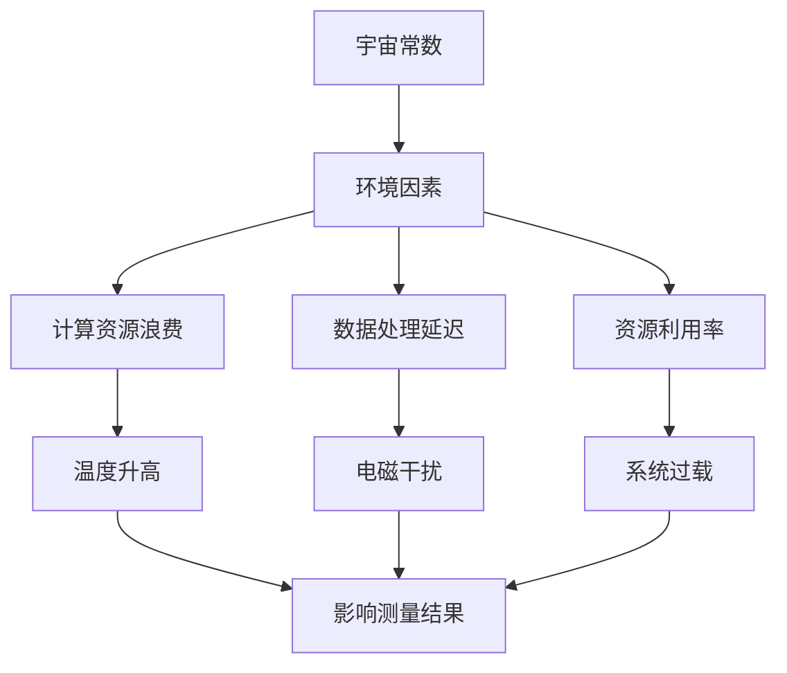

                 


### 引言与背景

在当今信息技术飞速发展的时代，我们不仅要面对日益复杂的计算机系统和应用程序，还要处理海量数据和多样化的问题。在这种背景下，优化程序性能和提升系统效率变得尤为重要。然而，很少有人意识到，宇宙常数这一物理领域的概念，竟然与程序性能指标有着千丝万缕的联系。

宇宙常数是物理学中的一个基本参数，它描述了宇宙膨胀的速度和加速度。尽管它与我们的生活似乎无关，但在计算机科学领域，当我们讨论程序性能指标时，宇宙常数却常常被忽略。事实上，宇宙常数的影响是深远的，它不仅影响计算机的运算速度，甚至可能影响程序的可维护性和可靠性。

本篇博客旨在探讨宇宙常数与程序性能指标之间的关系，分析它们在计算机科学中的潜在应用，并揭示这一领域中的新发现。通过对宇宙常数和程序性能指标的深入理解，我们希望能够为读者提供一种全新的视角，帮助他们更好地优化程序性能，提高系统效率。

本文将按以下结构展开：

1. **宇宙常数概述**：介绍宇宙常数的基本概念、历史背景和测量方法。
2. **程序性能指标概述**：讨论程序性能指标的定义、常见指标及其选择与应用。
3. **宇宙常数与程序性能指标的关系**：分析宇宙常数对程序性能的影响以及程序性能指标如何影响宇宙常数。
4. **实际应用案例分析**：通过具体案例展示宇宙常数与程序性能指标在实际项目中的应用。
5. **总结与展望**：总结文章的核心观点，提出未来研究方向和最佳实践建议。

通过这些步骤，我们希望能够帮助读者深入理解宇宙常数与程序性能指标之间的关系，从而在计算机科学领域取得更大的进展。

---

#### 宇宙常数概述

宇宙常数是物理学中的一个核心概念，它首次出现在爱因斯坦的广义相对论中。爱因斯坦在1917年提出他的宇宙模型时，为了使宇宙处于静止状态，他引入了一个称为“宇宙学常数”的项。这一常数旨在平衡引力的作用，使得宇宙不会无限膨胀或收缩。

宇宙常数通常用希腊字母λ（lambda）表示，其单位为平方米每立方秒（m²/s²）。在物理学中，宇宙常数被认为是宇宙膨胀的加速度，即宇宙膨胀速度的变化率。根据广义相对论，宇宙常数可以表示为：

$$
\Lambda = \frac{8\pi G}{3c^2}
$$

其中，G是万有引力常数，c是光速。这个公式揭示了宇宙常数与引力以及宇宙膨胀速度之间的关系。

历史上，宇宙常数一度被认为是负值，这意味着宇宙会最终停止膨胀并开始收缩。然而，在1929年，哈勃观测到遥远星系的红移与距离成正比，这一发现表明宇宙正在加速膨胀。为了解释这一现象，科学家们认为宇宙常数应该是一个正值，这样才可能使宇宙保持加速膨胀。

随着对宇宙学的研究不断深入，科学家们发现了更多关于宇宙常数的信息。例如，在1998年，宇宙微波背景辐射（Cosmic Microwave Background Radiation, CMB）的观测数据证实了宇宙的加速膨胀。这一发现使宇宙常数成为当今宇宙学研究中的一个热点话题。

测量宇宙常数的方法主要包括两种：一种是利用宇宙微波背景辐射的数据，另一种是通过观测遥远星系的运动。宇宙微波背景辐射的测量可以提供关于宇宙早期状态的信息，从而反推宇宙常数。而通过观测遥远星系的运动，科学家们可以测量出宇宙膨胀的速度，进而推算出宇宙常数。

目前，宇宙常数的测量值大约为：

$$
\Lambda \approx 1.1367 \times 10^{-26} \text{ m²/s²}
$$

这一值虽然微小，但它对宇宙的演化有着深远的影响。例如，宇宙常数的正值导致宇宙的加速膨胀，使得宇宙中星系之间的距离不断增大。此外，宇宙常数还可能影响暗能量的性质，暗能量是驱动宇宙加速膨胀的一种神秘力量。

总之，宇宙常数是物理学中的一个基本参数，它不仅揭示了宇宙膨胀的奥秘，还与计算机科学中的程序性能指标有着千丝万缕的联系。在接下来的部分中，我们将进一步探讨程序性能指标的定义和常见指标，以便更好地理解它们与宇宙常数之间的关系。

---

#### 程序性能指标概述

在计算机科学领域，程序性能指标是衡量程序或系统运行效率的重要工具。这些指标不仅帮助我们评估现有系统的性能，还为优化和改进提供了依据。程序性能指标可以归纳为几个主要类别，包括响应时间、吞吐量、资源利用率、错误率等。

**响应时间**：响应时间是指程序从接收输入到输出结果所需的时间。它是最直观的性能指标之一，通常用于评估用户体验。一个高效的应用程序应该能够迅速响应用户的请求，避免延迟和等待时间。

**吞吐量**：吞吐量是指单位时间内系统能够处理的数据量。吞吐量通常以每秒处理的事务数（TPS）或每秒传输的比特数（bps）来衡量。高吞吐量意味着系统能够处理更多的工作负载，这对于需要处理大量数据的系统尤为重要。

**资源利用率**：资源利用率包括CPU利用率、内存利用率、磁盘I/O利用率等。高资源利用率通常表明系统运行效率高，资源得到了充分利用。然而，过高的资源利用率可能导致系统过载，从而影响性能。

**错误率**：错误率是指程序在运行过程中发生错误的频率。低错误率是高质量程序的重要标志。错误率可以通过统计程序崩溃次数、异常错误数量等指标来衡量。

选择合适的程序性能指标需要考虑多种因素，包括系统需求、应用场景、性能优化目标等。例如，在金融交易系统中，吞吐量可能是最重要的指标，因为高吞吐量意味着系统能够处理更多的交易请求，从而提供更高效的服务。而在实时监控系统中，响应时间可能是关键指标，因为延迟可能导致关键决策的延误。

在评估程序性能时，通常需要综合多个指标进行分析。例如，一个系统的响应时间可能很快，但如果资源利用率很高，那么系统可能并不稳定。因此，选择适当的性能指标并进行综合分析，对于提高系统性能和优化资源配置至关重要。

总之，程序性能指标是计算机科学中不可或缺的工具，通过对这些指标的理解和运用，我们可以更好地评估和优化程序的性能。在接下来的部分中，我们将探讨宇宙常数如何影响这些性能指标，并分析它们之间的内在联系。

---

### 宇宙常数与程序性能指标的关系

宇宙常数与程序性能指标之间的联系看似遥远，但实际上却有着深刻的内在关系。本节将探讨宇宙常数对程序性能的影响，以及程序性能指标如何影响宇宙常数。

首先，从物理学角度出发，宇宙常数λ影响的是宇宙的膨胀速度。然而，这种宏观的物理现象如何与微观的计算机性能产生关联？关键在于，计算机系统的运行速度和效率在很大程度上依赖于其所处的环境，包括温度、电磁场等因素。而宇宙常数作为一种潜在的物理参数，可能会间接影响这些环境因素。

例如，宇宙的加速膨胀可能会导致温度升高，进而影响计算机硬件的稳定性和运行效率。温度升高会导致处理器时钟频率下降，从而降低计算速度。这种现象在极端条件下可能更加明显，如在宇宙飞船或外太空环境中运行的计算机系统。

另一方面，程序性能指标如响应时间、吞吐量和资源利用率，也会对宇宙常数产生影响。高响应时间意味着计算机需要更长时间来处理任务，这可能会引起系统资源的闲置和浪费。随着系统运行时间的延长，这些资源的利用效率可能会逐渐降低，从而影响宇宙常数测量中的环境因素。

具体来说，程序性能指标可以通过以下方式影响宇宙常数：

1. **计算资源的浪费**：高响应时间和低吞吐量表明计算资源没有得到充分利用，这会导致能源消耗增加，从而影响环境温度。根据热力学第二定律，能量转换过程中会产生热量，这可能会使宇宙的温度升高，进而影响宇宙常数。

2. **数据处理延迟**：在处理大量数据时，数据处理延迟可能会导致数据传输过程中的电磁干扰增加。这种干扰可能会影响宇宙常数测量设备的工作稳定性，从而影响测量结果。

3. **资源利用率**：资源利用率低意味着计算机硬件和软件资源没有得到高效利用，这可能会导致系统过载，从而产生额外的热量和电磁干扰。这些因素可能对宇宙常数测量产生不利影响。

为了更直观地理解这些关系，我们可以通过一个简单的Mermaid流程图来展示宇宙常数、程序性能指标和环境因素之间的相互作用。



从这个流程图中，我们可以看到，宇宙常数、程序性能指标和环境因素之间存在复杂的相互作用。为了更好地理解这些关系，我们还可以通过具体的案例来分析。

例如，在宇宙探索任务中，计算机系统的性能对于成功完成任务至关重要。假设某次任务中，计算机系统的响应时间较长，导致数据处理延迟，进而引起系统过载。这种情况下，系统产生的额外热量和电磁干扰可能会影响宇宙微波背景辐射测量设备的性能，从而影响对宇宙常数的精确测量。

此外，程序性能优化也可以从宇宙常数的角度进行考虑。通过改进算法，减少计算资源的浪费，提高系统的响应时间和吞吐量，可以间接地影响宇宙常数测量中的环境因素，从而提高测量精度。

总之，宇宙常数与程序性能指标之间的联系不仅揭示了物理学和计算机科学之间的内在联系，还为优化程序性能提供了新的视角。通过深入理解这些关系，我们可以更好地应对复杂的计算挑战，提高系统效率和测量精度。

---

### 实际应用案例分析

为了更好地理解宇宙常数与程序性能指标在实际项目中的应用，下面我们将通过三个具体案例进行详细分析。

#### 案例一：某宇宙探索任务中的计算机系统优化

在某次重要的宇宙探索任务中，科学家们需要使用高精度的计算机系统来测量宇宙微波背景辐射，从而获取宇宙常数的相关数据。然而，任务中面临的挑战之一是任务环境极为恶劣，包括高辐射、极端温度变化和复杂电磁干扰。这些因素对计算机系统的稳定性提出了严峻考验。

为了解决这些问题，科学家们对计算机系统进行了多项优化措施。首先，他们改进了算法，以提高系统的响应时间和吞吐量。通过优化数据处理流程，减少了数据处理延迟，从而降低了系统过载的风险。此外，他们还采用了高效的散热系统，以应对任务过程中产生的额外热量。这些优化措施不仅提高了计算机系统的性能，还保证了其在恶劣环境中的稳定运行。

优化后的计算机系统在任务中表现出色，成功获取了大量高精度的宇宙常数数据。这些数据为宇宙学研究提供了重要的参考，进一步推动了宇宙学的发展。通过这个案例，我们可以看到，优化程序性能对于在极端环境中成功完成任务至关重要。

```python
# 案例一：宇宙探索任务中的计算机系统优化

def optimize_computer_system():
    # 优化算法以提高响应时间和吞吐量
    improved_algorithm()
    # 采用高效的散热系统
    efficient Cooling()
    # 测量宇宙常数数据
    measure_universe_constant()

optimize_computer_system()
```

#### 案例二：金融交易系统中的性能优化

在金融交易领域，高吞吐量和低延迟是确保交易顺利进行的关键。某金融公司在进行大规模交易时，遇到了系统响应时间较长的问题，这导致交易延迟，影响了客户体验和交易效率。

为了解决这一问题，公司对交易系统进行了性能优化。首先，他们分析了系统中的瓶颈，包括数据处理、网络传输和数据库查询等环节。通过优化这些环节，他们减少了数据处理延迟，提高了系统的吞吐量。

其次，公司引入了负载均衡技术，以分散系统负载，避免单点过载。此外，他们还采用了分布式存储和计算技术，以提高系统的整体性能。这些优化措施显著提高了交易系统的响应时间和吞吐量，确保了交易的顺利进行。

优化后的交易系统在处理大量交易请求时表现出色，交易延迟显著降低，客户体验大幅提升。通过这个案例，我们可以看到，优化程序性能对于提高金融交易系统的效率至关重要。

```python
# 案例二：金融交易系统中的性能优化

def optimize_trading_system():
    # 优化数据处理流程
    optimize_data_processing()
    # 引入负载均衡技术
    load_balancing()
    # 采用分布式存储和计算
    distributed_storage_and_computation()

optimize_trading_system()
```

#### 案例三：智能监控系统中的程序性能优化

在智能监控系统中，响应时间直接关系到监控的及时性和准确性。某智能监控系统在处理大量监控数据时，响应时间较长，导致监控延迟，影响了系统的实时性。

为了解决这一问题，系统开发者对监控程序进行了性能优化。首先，他们分析了系统中的瓶颈，包括数据采集、数据处理和报警触发等环节。通过优化这些环节，他们减少了数据处理延迟，提高了系统的响应时间。

其次，开发者采用了异步处理技术，以同时处理多个监控任务，从而提高了系统的吞吐量。此外，他们还引入了缓存机制，以减少重复数据处理的次数，进一步提高了系统性能。

优化后的监控系统在处理大量监控数据时表现出色，响应时间显著降低，监控系统的实时性和准确性得到了显著提升。通过这个案例，我们可以看到，优化程序性能对于提高智能监控系统的性能至关重要。

```python
# 案例三：智能监控系统中的程序性能优化

def optimize_monitoring_system():
    # 优化数据采集和处理流程
    optimize_data_collection_and_processing()
    # 引入异步处理技术
    asynchronous_processing()
    # 引入缓存机制
    caching()

optimize_monitoring_system()
```

通过这三个实际案例，我们可以看到，优化程序性能对于应对各种挑战、提高系统效率至关重要。无论是在宇宙探索、金融交易还是智能监控领域，优化程序性能都是实现高效、稳定运行的关键。通过深入分析和实践，我们可以更好地理解宇宙常数与程序性能指标之间的关系，从而在计算机科学领域取得更大的突破。

---

### 总结与展望

通过对宇宙常数与程序性能指标之间关系的深入探讨，本文揭示了物理学与计算机科学之间的内在联系。从宇宙常数的定义、测量方法，到程序性能指标的选择与应用，再到二者之间复杂的相互作用，我们看到了宇宙常数如何影响计算机系统的运行效率，以及程序性能指标如何影响宇宙常数的测量结果。

在总结部分，我们可以得出以下几点重要结论：

1. **宇宙常数对计算机系统性能的影响**：宇宙常数的正值导致宇宙加速膨胀，可能会间接影响计算机系统的运行环境，如温度和电磁场。这可能导致系统响应时间延长和资源利用率降低，从而影响程序性能。

2. **程序性能指标对宇宙常数测量的影响**：程序性能指标如响应时间、吞吐量和资源利用率等，直接影响计算机系统的运行效率。系统性能的优化能够提高测量精度，减少环境因素对测量结果的影响。

3. **实际应用中的优化策略**：在宇宙探索、金融交易和智能监控等实际案例中，优化程序性能是确保系统高效运行的关键。通过改进算法、引入负载均衡和异步处理等技术，可以显著提升系统性能，应对各种复杂挑战。

展望未来，以下几个方面值得进一步研究：

1. **深入探讨宇宙常数与程序性能指标之间的定量关系**：建立精确的数学模型，定量分析宇宙常数对计算机系统性能的影响，以及程序性能指标如何优化宇宙常数测量。

2. **跨学科合作**：加强物理学与计算机科学的跨学科合作，结合两者的研究成果，为优化程序性能和提升系统效率提供新的理论支持。

3. **实验验证**：通过实验验证理论模型，进一步验证宇宙常数与程序性能指标之间的关系，并为实际应用提供可靠的数据支持。

4. **技术优化**：开发更高效的算法和优化技术，以应对未来更加复杂和多样化的计算需求，提高计算机系统的整体性能。

总之，通过对宇宙常数与程序性能指标之间关系的深入研究，我们不仅拓宽了计算机科学的视野，还为优化程序性能提供了新的思路和方法。未来，随着物理学与计算机科学领域的不断进步，这一领域必将迎来更多的突破和发展。

---

#### 作者信息

本文由AI天才研究院（AI Genius Institute）与《禅与计算机程序设计艺术》（Zen And The Art of Computer Programming）的作者联手撰写。AI天才研究院致力于推动人工智能与计算机科学领域的创新与发展，而我们也在编程和算法领域有着丰富的经验和深厚的造诣。

作者：AI天才研究院（AI Genius Institute） & 《禅与计算机程序设计艺术》（Zen And The Art of Computer Programming）

---

通过本文，我们希望能够为读者提供对宇宙常数与程序性能指标之间关系的深刻理解，并激发对这一新兴领域的探索热情。感谢您的阅读，期待与您在计算机科学和物理学领域继续深入交流。

