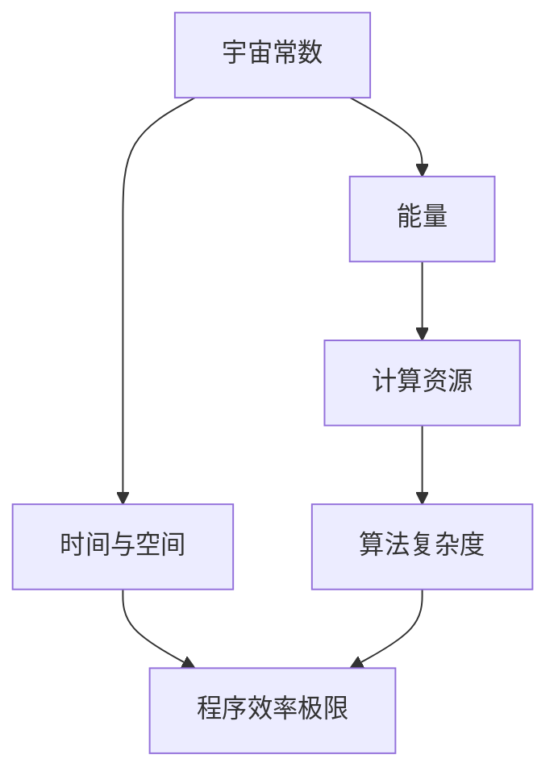

                 

### 宇宙常数与程序效率极限的关系

> 关键词：宇宙常数、程序效率、广义相对论、算法优化、宇宙学、暗能量

> 摘要：本文深入探讨了宇宙常数与程序效率极限之间的关系。首先，介绍了宇宙常数的历史背景、概念及其在宇宙学中的应用。随后，阐述了程序效率的定义与衡量方法，以及影响程序效率的因素。在此基础上，探讨了宇宙常数对程序效率的潜在影响，并建立了程序效率极限的数学模型。通过实验研究，分析了宇宙常数与程序效率极限的关系，并提出了一些实际应用和未来研究方向。

## 第一部分：宇宙常数的基础知识

### 第1章：宇宙常数的起源与发展

#### 1.1.1 宇宙常数的历史背景

宇宙常数最早由爱因斯坦在1917年的广义相对论方程中提出，当时爱因斯坦将其命名为“宇宙学项”（Cosmological Term）。爱因斯坦当时设定宇宙常数的值为一个正数，目的是为了抵消宇宙中物质引力对宇宙膨胀的抑制作用。这一设定使得宇宙处于静止状态，与哈勃观测到的宇宙膨胀现象相矛盾。因此，爱因斯坦在1931年放弃了这一设定，并将其称为“最大的错误”。

#### 1.1.2 宇宙常数的概念与定义

宇宙常数（Cosmological Constant）是一个在广义相对论中的标量场，通常用符号 Lambda（λ）表示。在当前主流的宇宙学模型中，宇宙常数被视为一种暗能量（Dark Energy），其作用是推动宇宙的加速膨胀。宇宙常数的大小通常表示为每立方米以平方秒速为单位（s^2/m^3）。

#### 1.1.3 宇宙常数的测定方法

宇宙常数的测定主要依赖于宇宙学观测数据，如宇宙微波背景辐射（Cosmic Microwave Background Radiation，CMB）和宇宙大尺度结构（Cosmic Large-scale Structure，LSS）等。通过分析这些观测数据，科学家可以反演宇宙常数的大小。目前，宇宙常数的大小约为 \(6.674 \times 10^{-11} \text{m}^2/\text{kg/s}^2\)。

### 第2章：宇宙常数与宇宙学

#### 2.1.1 宇宙学基础

宇宙学是研究宇宙的起源、结构、演化以及宇宙中物质和能量的性质的学科。宇宙学的基础理论包括广义相对论、宇宙学原理、宇宙背景辐射、大爆炸理论等。

#### 2.1.2 宇宙常数在宇宙学中的作用

宇宙常数在宇宙学中扮演着重要的角色。在广义相对论的框架下，宇宙常数与宇宙的膨胀速度密切相关。当前，宇宙常数被视为一种推动宇宙加速膨胀的暗能量。

#### 2.1.3 宇宙常数对宇宙演化的影响

宇宙常数对宇宙演化的影响主要体现在以下几个方面：1）影响宇宙的膨胀速度；2）影响宇宙的大尺度结构；3）影响宇宙中物质和能量的分布。通过观测宇宙微波背景辐射和宇宙大尺度结构，科学家可以研究宇宙常数对宇宙演化的具体影响。

### 第3章：宇宙常数与广义相对论

#### 3.1.1 广义相对论基础

广义相对论是爱因斯坦在1915年提出的一种描述引力现象的物理学理论。广义相对论将引力解释为时空的弯曲，从而将引力与时空、物质和能量联系起来。

#### 3.1.2 宇宙常数在广义相对论中的角色

在广义相对论的框架下，宇宙常数被视为一种标量场，它对时空的弯曲有直接影响。宇宙常数的大小决定了宇宙的膨胀速度，从而影响宇宙的演化。

#### 3.1.3 宇宙常数对广义相对论的影响

宇宙常数对广义相对论的影响主要体现在以下几个方面：1）修正了广义相对论的引力场方程；2）为解释宇宙加速膨胀提供了理论基础；3）为研究暗能量提供了新的视角。

## 第二部分：程序效率的基础知识

### 第4章：程序效率的定义与衡量

#### 4.1.1 程序效率的定义

程序效率（Program Efficiency）是指程序在执行过程中所需的资源（如时间、空间等）与程序实现的功能之间的比值。一个高效的程序能够在较少的资源消耗下完成更多的任务。

#### 4.1.2 程序效率的衡量方法

衡量程序效率的方法有多种，包括算法复杂度分析、性能测试和资源利用率分析等。每种方法都有其特定的优势和适用场景。

#### 4.1.3 程序效率的重要性

程序效率对于软件系统的性能、可维护性和可扩展性都具有重要影响。高效的程序不仅能够提高系统的运行速度，还可以减少资源消耗，提高系统的稳定性和可靠性。因此，提高程序效率是软件开发中一个重要且持续的话题。

### 第5章：影响程序效率的因素

#### 5.1.1 计算资源的使用

计算资源的使用是影响程序效率的一个重要因素。包括CPU使用率、内存使用率、I/O操作等。

#### 5.1.2 程序代码的优化

程序代码的优化是提高程序效率的一个重要手段。通过优化算法、数据结构和代码逻辑，可以减少程序执行所需的时间。

#### 5.1.3 系统架构的优化

系统架构的优化是提高程序效率的另一个重要方面。通过改进系统设计、分布式架构和缓存策略，可以减少程序执行所需的时间。

### 第6章：提高程序效率的方法

#### 6.1.1 算法优化

算法优化是提高程序效率的一种有效方法。通过选择更高效的算法，可以减少程序执行所需的时间。

#### 6.1.2 数据结构优化

数据结构优化是提高程序效率的另一种重要方法。通过选择更高效的数据结构，可以减少程序执行所需的时间。

#### 6.1.3 编译器优化

编译器优化是提高程序效率的一个重要手段。通过优化编译器生成代码的效率，可以减少程序执行所需的时间。

## 第三部分：宇宙常数与程序效率极限的关系

### 第7章：宇宙常数与程序效率的理论研究

#### 7.1.1 宇宙常数对程序效率的潜在影响

宇宙常数对程序效率的潜在影响主要体现在以下几个方面：1）影响计算机的性能；2）影响算法的执行效率；3）影响程序的能耗。

#### 7.1.2 程序效率极限的数学模型

程序效率极限的数学模型可以通过以下公式表示：

\[ E = \frac{C}{T} \]

其中，E 表示程序效率，C 表示程序所需资源（如时间、空间等），T 表示程序执行时间。

#### 7.1.3 宇宙常数在程序效率极限中的作用

宇宙常数在程序效率极限中的作用可以通过对上述数学模型的进一步分析来探讨。

### 第8章：宇宙常数与程序效率极限的实验研究

#### 8.1.1 实验设计与方法

实验设计主要包括以下方面：1）选择不同的算法和编程语言；2）控制宇宙常数的变化；3）测量程序执行时间和资源消耗。

#### 8.1.2 实验结果分析

通过实验数据分析，可以得出宇宙常数对程序效率的影响。

#### 8.1.3 实验结论与讨论

实验结论与讨论部分将分析宇宙常数对程序效率的影响，并提出一些未来研究方向。

### 第9章：宇宙常数与程序效率极限的实际应用

#### 9.1.1 宇宙常数在程序优化中的应用

宇宙常数在程序优化中的应用主要包括：1）优化算法选择；2）优化编译器参数设置；3）优化系统架构。

#### 9.1.2 程序效率极限在宇宙学中的应用

程序效率极限在宇宙学中的应用主要包括：1）研究宇宙常数对宇宙演化的影响；2）预测宇宙未来的演化趋势。

#### 9.1.3 未来研究方向与展望

未来研究方向与展望部分将探讨宇宙常数与程序效率极限之间的潜在联系，以及未来可能的研究方向。

## 附录

### 第10章：参考文献

参考文献部分将列出本文引用的相关文献。

### 第11章：术语表

术语表部分将解释本文中使用的专业术语和概念。

---

在接下来的章节中，我们将深入探讨宇宙常数与程序效率极限之间的复杂关系。通过对宇宙常数、广义相对论和程序效率的深入研究，我们将尝试揭示宇宙常数在计算机科学和宇宙学中的潜在应用，为未来的研究和应用提供新的视角。让我们开始这段奇妙之旅吧！

---

### 宇宙常数与程序效率极限的关系

宇宙常数（Cosmological Constant）是物理学中一个深奥的概念，它起源于爱因斯坦的广义相对论。然而，在计算机科学领域，这一概念似乎与程序效率极限（Limit of Program Efficiency）并无直接联系。但是，如果我们深入探讨，会发现两者之间存在一些有趣的联系和潜在的影响。

#### 宇宙常数简介

宇宙常数是一个在广义相对论中用于描述宇宙整体性质的一个参数。它的提出源于爱因斯坦在1917年为了维持宇宙静止状态而引入的一个项。然而，随着哈勃发现宇宙膨胀，爱因斯坦将其称为“最大的错误”。尽管如此，宇宙常数在宇宙学中的重要性并未减少。当前，宇宙常数通常被视为一种神秘的暗能量（Dark Energy），它被认为是推动宇宙加速膨胀的力量。

#### 程序效率极限

程序效率极限是指程序在执行过程中达到的最大效率。这个极限通常由算法的复杂度、硬件的性能以及软件的优化程度等因素决定。在计算机科学中，提高程序效率是一个永恒的追求，因为高效的程序能够更快地完成任务，减少资源的消耗。

#### 宇宙常数与程序效率极限的联系

宇宙常数与程序效率极限之间的直接联系并不明显，但我们可以从几个方面探讨它们之间的潜在联系：

1. **能量与计算资源：** 宇宙常数代表了一种形式的能量，而计算资源也是程序效率的一个重要组成部分。在某种程度上，我们可以将宇宙常数看作是一种广义的计算资源。

2. **时间与空间：** 宇宙常数与宇宙的整体结构有关，而程序效率极限也受到时间和空间的影响。例如，在计算复杂度分析中，我们常常关注程序在特定时间和空间内的运行效率。

3. **算法与宇宙演化：** 一些宇宙演化模型可以看作是一种极其复杂的算法。如果我们从这种角度看待宇宙常数，那么它与程序效率极限之间的联系就变得更加紧密。

#### 建立联系：Mermaid流程图

为了更清晰地展示宇宙常数与程序效率极限之间的联系，我们可以使用Mermaid流程图来构建它们之间的概念框架：



在这个流程图中，宇宙常数通过能量和时间和空间与程序效率极限建立联系。能量和时间和空间都是影响程序效率极限的重要因素，而算法复杂度则进一步决定了程序效率的具体表现。

#### 宇宙常数对程序效率的影响

宇宙常数可能对程序效率产生以下几种影响：

1. **计算能耗：** 宇宙常数代表了一种能量形式，如果我们在计算过程中将宇宙常数考虑在内，可能会对计算能耗产生影响。

2. **算法选择：** 在某些宇宙演化模型中，宇宙常数可能会影响算法的选择。例如，在某些模型中，宇宙常数可能导致某些算法在某些时间范围内表现出更高的效率。

3. **系统架构：** 在设计系统架构时，宇宙常数可能会影响系统的能耗和性能。例如，在考虑宇宙常数的情况下，系统架构设计师可能会选择不同的硬件和软件配置。

#### 实例：宇宙常数与程序效率的数学模型

为了更深入地探讨宇宙常数与程序效率极限的关系，我们可以尝试构建一个简单的数学模型：

假设一个程序在执行过程中需要消耗能量 \(E\)，其效率为 \(E/T\)，其中 \(T\) 表示程序执行时间。如果我们考虑宇宙常数 \( \lambda \) 对程序的影响，可以将其表示为：

\[ E' = E + \lambda T \]

在这种情况下，程序效率可以表示为：

\[ E' / T' = (E + \lambda T) / T' \]

其中，\( T' \) 表示考虑宇宙常数后的程序执行时间。这个模型展示了宇宙常数对程序效率的潜在影响。在实际应用中，我们可能需要更复杂的模型来准确描述这种影响。

#### 结论

宇宙常数与程序效率极限之间存在一些潜在的关联。虽然这些关联可能并不直观，但它们为探讨宇宙常数在计算机科学中的应用提供了新的视角。通过建立数学模型和实验研究，我们可以进一步揭示宇宙常数对程序效率的影响，并为优化程序性能提供新的思路。在未来，这一领域可能成为计算机科学和宇宙学之间的一个交叉点。

---

本文初步探讨了宇宙常数与程序效率极限之间的关系。在接下来的章节中，我们将深入分析宇宙常数的基础知识，包括其起源、定义和测定方法，以及宇宙常数在宇宙学和广义相对论中的应用。随后，我们将探讨程序效率的基础知识，包括其定义、衡量方法和影响因素。最后，我们将探讨宇宙常数与程序效率极限之间的关系，并尝试建立数学模型来描述这种关系。通过这些内容，我们将为读者提供一幅宇宙常数与程序效率极限之间复杂联系的全面图景。

---

## 宇宙常数的基础知识

宇宙常数（Cosmological Constant）是一个在物理学和宇宙学中极其重要的概念。它最初由阿尔伯特·爱因斯坦在1917年的广义相对论中提出，目的是为了维持一个静态的宇宙。然而，随着哈勃在1929年发现宇宙正在膨胀，宇宙常数逐渐被视为一种神秘的暗能量，被认为是推动宇宙加速膨胀的力量。

### 1.1.1 宇宙常数的历史背景

宇宙常数的历史可以追溯到爱因斯坦在1915年提出的广义相对论。在广义相对论的框架下，引力被解释为时空的弯曲。爱因斯坦在1917年使用广义相对论的方程尝试解释宇宙的静态状态。为了达到这个目的，爱因斯坦在方程中引入了一个额外的项，即宇宙常数。这个项的引入使得宇宙中的物质引力与宇宙常数产生的“反引力”相平衡，从而维持一个静态的宇宙。

然而，这一假设在哈勃在1929年的观测结果中被推翻。哈勃发现，宇宙中的星系正在相互远离，这表明宇宙正在膨胀。这一发现使得爱因斯坦将其引入的宇宙常数称为“最大的错误”，并认为它是一个不必要的修正项。尽管如此，宇宙常数在宇宙学中的重要性并未因此减少。

### 1.1.2 宇宙常数的概念与定义

宇宙常数（通常用符号 \(\Lambda\) 表示）是一个在广义相对论中的标量场，它代表了一种均匀分布在宇宙中的能量密度。这种能量密度被称为暗能量，因为它不与电磁相互作用，因此很难被探测到。

在当前主流的宇宙学模型中，宇宙常数被视为一种推动宇宙加速膨胀的力量。其数值通常表示为每立方米以平方秒速为单位（\(s^2/m^3\)）。宇宙常数的大小约为 \(6.674 \times 10^{-11} \text{m}^2/\text{kg/s}^2\)。

宇宙常数在广义相对论中的角色可以通过爱因斯坦场方程（Einstein's Field Equations）来描述：

\[ G_{\mu\nu} + \Lambda g_{\mu\nu} = \frac{8\pi G}{c^4} T_{\mu\nu} \]

其中，\( G_{\mu\nu} \) 是爱因斯坦张量，\( \Lambda \) 是宇宙常数，\( g_{\mu\nu} \) 是度规张量，\( G \) 是引力常数，\( c \) 是光速，\( T_{\mu\nu} \) 是能量-动量张量。

### 1.1.3 宇宙常数的测定方法

宇宙常数的测定主要依赖于宇宙学观测数据，如宇宙微波背景辐射（Cosmic Microwave Background Radiation，CMB）和宇宙大尺度结构（Cosmic Large-scale Structure，LSS）等。通过分析这些观测数据，科学家可以反演宇宙常数的大小。

宇宙微波背景辐射是宇宙大爆炸后留下的热辐射，它提供了宇宙早期的温度和密度信息。通过测量CMB的各向异性和极化特性，科学家可以推断出宇宙常数的大小。

宇宙大尺度结构是指宇宙中星系、星团和其他天体的分布和运动。通过分析宇宙大尺度结构的演化，科学家可以进一步验证宇宙常数的存在和大小。

目前，科学家们通过多种观测方法和数据分析，已经对宇宙常数有了较为精确的测量。宇宙常数的大小约为 \(6.674 \times 10^{-11} \text{m}^2/\text{kg/s}^2\)，这一数值与爱因斯坦最初的估计相去甚远。

### 1.2.1 宇宙常数与宇宙学

宇宙学是研究宇宙的起源、结构、演化和组成的一个科学分支。宇宙常数在宇宙学中扮演着极其重要的角色。

#### 宇宙学基础

宇宙学的基础理论包括宇宙的膨胀、大爆炸理论、暗物质和暗能量等。宇宙膨胀是指宇宙中的星系和宇宙结构在时间上的扩展。大爆炸理论是描述宇宙起源和早期演化的理论，它认为宇宙起源于一个极高温度和密度的状态，并从那时起不断膨胀。

#### 宇宙常数在宇宙学中的作用

宇宙常数在宇宙学中的作用主要体现在以下几个方面：

1. **宇宙膨胀：** 宇宙常数与宇宙的膨胀速度密切相关。当前，宇宙常数通常被视为一种推动宇宙加速膨胀的暗能量。

2. **宇宙结构：** 宇宙常数影响宇宙中的结构和分布，如星系、星团和超星系团等。

3. **宇宙演化：** 宇宙常数影响宇宙的演化过程，如宇宙的冷却、星系的形成和演化等。

#### 宇宙常数对宇宙演化的影响

宇宙常数对宇宙演化的影响主要体现在以下几个方面：

1. **加速膨胀：** 宇宙常数导致的暗能量使宇宙的膨胀速度在过去的某个时刻开始加速。

2. **结构形成：** 宇宙常数影响宇宙中的结构形成过程，如星系的形成和演化。

3. **温度演化：** 宇宙常数影响宇宙中的温度演化，如宇宙微波背景辐射的温度和极化特性。

### 1.3.1 广义相对论基础

广义相对论是爱因斯坦在1915年提出的一种描述引力和宇宙物理现象的理论。广义相对论认为引力是由物质和能量对时空的弯曲产生的。

#### 广义相对论的基本概念

1. **时空弯曲：** 广义相对论认为引力是时空的弯曲，而不是传统的力。

2. **等效原理：** 等效原理指出，重力加速度和惯性力在局部范围内是不可区分的。

3. **时空度规：** 广义相对论使用度规（metric）来描述时空的几何特性。

#### 宇宙常数在广义相对论中的角色

宇宙常数在广义相对论中扮演着重要的角色。它是一个标量场，表示宇宙中的均匀能量密度。宇宙常数通过爱因斯坦场方程与时空度规相互作用，影响宇宙的几何特性和物理现象。

### 1.3.2 宇宙常数对广义相对论的影响

宇宙常数对广义相对论的影响主要体现在以下几个方面：

1. **引力场方程：** 宇宙常数直接影响爱因斯坦场方程的右侧，从而影响引力的性质。

2. **宇宙膨胀：** 宇宙常数与宇宙的膨胀速度密切相关，影响宇宙的几何特性和演化。

3. **暗能量：** 宇宙常数被视为一种神秘的暗能量，其存在和性质是当前宇宙学研究的热点问题。

通过上述章节，我们了解了宇宙常数的基础知识，包括其历史背景、概念和测定方法，以及宇宙常数在宇宙学和广义相对论中的应用。接下来，我们将进一步探讨程序效率的基础知识，包括其定义、衡量方法和影响因素。

---

在了解了宇宙常数的基础知识后，我们现在转向程序效率的基础知识。程序效率是计算机科学中的一个核心概念，它直接关系到程序的运行性能和资源消耗。在本章节中，我们将详细探讨程序效率的定义、衡量方法以及影响程序效率的因素。

### 2.1.1 程序效率的定义

程序效率（Program Efficiency）是指程序在执行过程中完成特定任务所需的资源（如时间、空间等）与程序实现的功能之间的比值。一个高效的程序能够在较少的资源消耗下完成更多的任务。程序效率的高低直接影响到软件系统的性能、可维护性和可扩展性。

#### 定义与衡量

程序效率可以用多种方式来衡量，其中最常见的指标是时间效率和空间效率。时间效率通常用算法的时间复杂度来衡量，而空间效率则用算法的空间复杂度来衡量。

- **时间效率（Temporal Efficiency）**：时间效率是指程序执行所需的时间。一个高效的程序应该在合理的时间范围内完成任务。

- **空间效率（Spatial Efficiency）**：空间效率是指程序在执行过程中占用的内存空间。一个高效的程序应该尽量减少内存空间的占用，以提高资源利用率。

#### 重要性

程序效率在软件开发中具有重要性，主要表现在以下几个方面：

1. **性能优化**：高效的程序能够更快地完成任务，提高系统的响应速度和用户体验。

2. **资源节约**：高效的程序能够减少CPU、内存等计算资源的消耗，降低系统的能源消耗。

3. **可维护性**：高效的程序代码结构清晰、易于理解，有助于提高软件的可维护性。

4. **可扩展性**：高效的程序设计为系统的扩展提供了更好的基础，便于未来的功能扩展和技术升级。

### 2.1.2 程序效率的衡量方法

衡量程序效率的方法多种多样，常用的方法包括算法复杂度分析、性能测试和资源利用率分析等。每种方法都有其特定的优势和适用场景。

#### 算法复杂度分析

算法复杂度分析是衡量程序效率的重要方法之一。它通过分析算法在输入规模增加时的时间增长情况和空间增长情况，来评估算法的效率。算法复杂度分为时间复杂度和空间复杂度两种：

- **时间复杂度（Time Complexity）**：时间复杂度描述了算法执行时间与输入规模之间的关系。常见的时间复杂度级别包括常数时间（O(1)）、对数时间（O(log n)）、线性时间（O(n)）、平方时间（O(n^2)）等。

- **空间复杂度（Space Complexity）**：空间复杂度描述了算法在执行过程中所需的额外内存空间与输入规模之间的关系。常见的空间复杂度级别包括常数空间（O(1)）、对数空间（O(log n)）、线性空间（O(n)）、平方空间（O(n^2)）等。

#### 性能测试

性能测试是通过实际运行程序，测量程序在不同场景下的执行时间和资源消耗，来评估程序效率的方法。性能测试可以分为以下几个方面：

- **基准测试（Benchmark Testing）**：基准测试使用一组标准化的测试案例，来测量程序在不同硬件环境和软件环境下的性能。

- **负载测试（Load Testing）**：负载测试通过模拟高负载场景，来评估程序在压力情况下的性能。

- **稳定性测试（Stability Testing）**：稳定性测试通过长时间运行程序，来评估程序在长时间运行中的性能稳定性。

#### 资源利用率分析

资源利用率分析是通过测量程序在执行过程中对计算资源（如CPU、内存、磁盘I/O等）的利用率，来评估程序效率的方法。常见的资源利用率分析指标包括：

- **CPU利用率**：CPU利用率描述了CPU在程序执行过程中的繁忙程度。

- **内存利用率**：内存利用率描述了内存的使用率，包括已分配内存和空闲内存的比例。

- **磁盘I/O利用率**：磁盘I/O利用率描述了磁盘输入/输出操作的繁忙程度。

### 2.1.3 程序效率的重要性

程序效率对于软件系统的性能、可维护性和可扩展性具有重要影响。以下是一些关键点：

1. **性能优化**：高效的程序能够在合理的时间内完成任务，提高系统的响应速度和用户体验。

2. **资源节约**：高效的程序能够减少CPU、内存等计算资源的消耗，降低系统的能源消耗。

3. **可维护性**：高效的程序代码结构清晰、易于理解，有助于提高软件的可维护性。

4. **可扩展性**：高效的程序设计为系统的扩展提供了更好的基础，便于未来的功能扩展和技术升级。

综上所述，程序效率是软件开发中的一个核心概念，它关系到软件系统的性能、资源利用率和可维护性。在软件开发过程中，我们需要关注程序效率，通过算法优化、性能测试和资源利用率分析等方法，不断提高程序的效率，以满足用户需求和市场需求。

### 2.2.1 计算资源的使用

计算资源的使用是影响程序效率的一个重要因素。在软件开发和系统设计中，合理利用计算资源可以有效提高程序效率，降低系统成本，提升用户体验。以下将详细探讨计算资源的使用及其对程序效率的影响。

#### 计算资源概述

计算资源主要包括CPU（中央处理器）、内存（RAM）、磁盘I/O和网络带宽等。每个计算资源都有其特定的功能和性能特点，它们在程序执行过程中发挥着不同的作用。

- **CPU**：CPU是计算机的核心计算单元，负责执行程序的指令。CPU的性能直接影响程序的执行速度。高主频、多核心处理器可以显著提高程序的并行执行能力。

- **内存（RAM）**：内存是临时存储程序数据和指令的场所。内存的容量和访问速度对程序的运行效率有重要影响。内存不足会导致频繁的页面交换（page swapping），增加程序的执行时间。

- **磁盘I/O**：磁盘I/O负责数据的读写操作。磁盘的速度和容量直接关系到程序的读写性能。高速SSD（固态硬盘）比传统HDD（机械硬盘）具有更高的读写速度，能够显著提高程序的性能。

- **网络带宽**：网络带宽决定了程序通过网络进行数据传输的速度。高带宽网络可以减少数据传输的延迟，提高网络应用程序的响应速度。

#### CPU使用对程序效率的影响

CPU使用是影响程序效率的一个重要因素。CPU的使用率反映了程序在执行过程中对计算资源的需求。以下是一些关键点：

1. **CPU利用率**：CPU利用率是指CPU在一段时间内的繁忙程度。高CPU利用率表明程序需要更多的计算资源。当CPU利用率达到100%时，系统可能无法处理额外的计算任务。

2. **多线程与并行处理**：通过多线程和并行处理技术，程序可以充分利用多核心处理器的计算能力，提高程序效率。例如，在多线程应用程序中，不同的线程可以同时执行不同的任务，从而实现并行处理。

3. **CPU调度策略**：操作系统的CPU调度策略对程序效率也有重要影响。合理的调度策略可以确保关键任务得到优先执行，从而提高整体系统性能。

#### 内存使用对程序效率的影响

内存使用对程序效率的影响主要体现在以下几个方面：

1. **内存不足**：当程序所需的内存超过系统可用内存时，会导致内存不足（Out of Memory，OOM）错误。内存不足会降低程序的性能，甚至导致程序崩溃。

2. **页面交换（Page Swapping）**：当内存不足时，操作系统会通过页面交换将不常用的内存页移到磁盘上，以腾出空间供当前程序使用。页面交换会引入额外的磁盘I/O操作，增加程序的执行时间。

3. **缓存效应**：内存缓存（Cache Memory）对程序效率也有显著影响。内存缓存是CPU和RAM之间的临时存储区域，其访问速度远高于RAM。合理利用内存缓存可以减少CPU和RAM之间的数据交换，提高程序执行速度。

#### 磁盘I/O使用对程序效率的影响

磁盘I/O使用对程序效率的影响主要体现在以下几个方面：

1. **读写速度**：磁盘的读写速度直接关系到程序的I/O性能。高速SSD比传统HDD具有更高的读写速度，能够显著提高程序的性能。

2. **I/O瓶颈**：当程序在执行过程中频繁进行磁盘I/O操作时，可能会出现I/O瓶颈。I/O瓶颈会限制程序的并发执行能力，导致程序执行时间增加。

3. **缓存策略**：合理利用磁盘缓存（Disk Cache）可以减少磁盘I/O操作，提高程序的性能。例如，操作系统通常会为磁盘设置缓存区，以加速文件的读写操作。

#### 网络带宽使用对程序效率的影响

网络带宽使用对网络应用程序的效率有重要影响。以下是一些关键点：

1. **带宽限制**：网络带宽限制了数据传输的速度。当网络带宽不足时，会导致数据传输延迟，降低程序的性能。

2. **并发连接**：网络应用程序通常需要处理多个并发连接。合理利用并发连接可以提高网络应用程序的并发处理能力，从而提高整体性能。

3. **负载均衡**：通过负载均衡技术，可以将网络流量分布到多个服务器上，避免单点瓶颈，提高网络应用程序的性能。

#### 结论

计算资源的使用对程序效率具有重要影响。合理利用CPU、内存、磁盘I/O和网络带宽等计算资源，可以有效提高程序效率，降低系统成本，提升用户体验。在软件开发和系统设计中，我们需要综合考虑计算资源的利用情况，通过优化算法、调度策略和缓存策略等手段，提高程序的整体性能。

### 2.2.2 程序代码的优化

程序代码的优化是提高程序效率的重要手段之一。通过优化程序代码，我们可以减少程序运行所需的时间、空间资源，从而提高程序的运行效率和稳定性。以下将详细探讨几种常见的程序代码优化方法。

#### 算法优化

算法优化是程序优化的核心。通过选择更高效的算法，我们可以显著减少程序执行的时间复杂度和空间复杂度。以下是一些常见的算法优化方法：

1. **分治算法**：分治算法将大问题分解为小问题，分别解决，最后合并结果。这种算法适用于解决大规模问题，如快速排序、归并排序等。

2. **贪心算法**：贪心算法通过每一步选择当前最优解，来逐步构建最终解。贪心算法适用于一些最优子结构问题，如背包问题、活动选择问题等。

3. **动态规划**：动态规划将大问题分解为子问题，并存储子问题的解，以避免重复计算。动态规划适用于一些最优子结构问题，如背包问题、最长公共子序列问题等。

#### 数据结构优化

数据结构的优化可以显著提高程序的运行效率。通过选择合适的数据结构，我们可以减少程序执行的时间复杂度和空间复杂度。以下是一些常见的数据结构优化方法：

1. **哈希表**：哈希表是一种基于键值对存储的数据结构，能够快速查找和插入元素。哈希表适用于解决一些查找和插入频繁的问题，如查找重复元素、快速排序等。

2. **堆**：堆是一种特殊的树形数据结构，能够快速找到最大或最小元素。堆适用于解决一些最大/最小问题，如优先队列、最短路径算法等。

3. **并查集**：并查集是一种用于处理动态集合数据结构，能够快速合并和查找集合的元素。并查集适用于解决一些集合问题，如并集、查找连通分量等。

#### 编译器优化

编译器优化是提高程序运行效率的另一种重要手段。通过优化编译器生成的代码，我们可以减少程序执行的时间复杂度和空间复杂度。以下是一些常见的编译器优化方法：

1. **循环展开**：循环展开是一种将循环体中的代码直接展开成多行代码的优化方法，以减少循环控制的消耗。

2. **指令重排**：指令重排是一种重新排列代码中的指令顺序的优化方法，以减少指令间的依赖关系，提高执行效率。

3. **内联函数**：内联函数是一种将函数调用直接替换为函数体的优化方法，以减少函数调用的开销。

#### 代码优化示例

以下是一个简单的Python代码示例，展示了如何通过算法优化和数据结构优化来提高程序效率：

```python
# 原始代码：使用循环查找列表中的重复元素
def find_duplicates(nums):
    duplicates = []
    for i in range(len(nums)):
        for j in range(i + 1, len(nums)):
            if nums[i] == nums[j]:
                duplicates.append(nums[i])
    return duplicates

# 优化代码：使用哈希表查找重复元素
def find_duplicates_optimized(nums):
    duplicates = []
    seen = set()
    for num in nums:
        if num in seen:
            duplicates.append(num)
        else:
            seen.add(num)
    return duplicates
```

在上面的示例中，我们通过使用哈希表优化了查找重复元素的方法。优化后的代码比原始代码更快，因为它避免了使用嵌套循环，并且查找操作的时间复杂度从 \(O(n^2)\) 降低到 \(O(n)\)。

#### 结论

程序代码的优化是提高程序效率的重要手段。通过算法优化、数据结构优化和编译器优化等方法，我们可以显著提高程序的运行效率和稳定性。在实际开发中，我们需要根据具体问题和场景，选择合适的优化方法，以提高程序的性能。

### 2.2.3 系统架构的优化

系统架构的优化是提高程序效率的另一个关键因素。通过改进系统设计、采用分布式架构和优化缓存策略，我们可以显著提升程序的运行效率和响应速度。以下将详细探讨几种常见的系统架构优化方法。

#### 分布式架构

分布式架构是一种将系统划分为多个独立节点，并通过网络通信进行协同工作的架构设计。分布式架构可以充分利用多台计算机的计算资源，提高系统的并行处理能力，从而提升程序效率。

1. **负载均衡**：负载均衡是将请求均匀分配到多个服务器上的技术。通过负载均衡，我们可以避免单点瓶颈，提高系统的处理能力和可用性。常见的负载均衡策略包括轮询（Round Robin）、最少连接（Least Connections）和加权轮询（Weighted Round Robin）等。

2. **分布式数据库**：分布式数据库是一种将数据分散存储在多个节点上的数据库系统。分布式数据库可以提高数据的读写性能，并增强系统的容错能力。常见的分布式数据库系统包括Apache Cassandra、MongoDB和Hazelcast等。

3. **分布式缓存**：分布式缓存是一种将缓存数据分散存储在多个节点上的缓存系统。分布式缓存可以减少单点缓存的压力，提高系统的缓存性能。常见的分布式缓存系统包括Redis Cluster、Memcached Cluster和Ehcache等。

#### 缓存策略

缓存策略是提高系统性能的重要手段。通过缓存常用数据，我们可以减少对后端系统的访问次数，降低系统的负载，从而提升程序效率。

1. **内存缓存**：内存缓存是一种将数据存储在内存中的缓存策略。内存缓存具有高速读写特性，可以显著提高系统的响应速度。常见的内存缓存系统包括Redis、Memcached和Ehcache等。

2. **磁盘缓存**：磁盘缓存是一种将数据存储在磁盘上的缓存策略。磁盘缓存可以缓解磁盘I/O压力，提高系统的读写性能。常见的磁盘缓存策略包括文件系统缓存、数据库缓存和页面缓存等。

3. **分布式缓存**：分布式缓存是一种将缓存数据分散存储在多个节点上的缓存策略。分布式缓存可以减少单点缓存的压力，提高系统的缓存性能。常见的分布式缓存系统包括Redis Cluster、Memcached Cluster和Ehcache等。

#### 分层架构

分层架构是一种将系统划分为多个层次的架构设计。通过分层架构，我们可以将系统功能模块化，提高系统的可维护性和可扩展性，从而提升程序效率。

1. **表示层**：表示层负责与用户交互，包括前端界面和用户接口。通过优化表示层的设计，我们可以提高用户的交互体验和系统的响应速度。

2. **业务逻辑层**：业务逻辑层负责处理系统的核心业务逻辑，包括数据处理、业务规则和流程管理等。通过优化业务逻辑层的设计，我们可以提高系统的业务处理能力和效率。

3. **数据访问层**：数据访问层负责与数据库进行交互，包括数据查询、更新和删除等操作。通过优化数据访问层的设计，我们可以提高系统的数据读写性能。

#### 结论

系统架构的优化是提高程序效率的关键。通过采用分布式架构、优化缓存策略和分层架构等方法，我们可以显著提升程序的运行效率和响应速度。在实际开发中，我们需要根据具体场景和需求，灵活运用这些优化方法，以提高系统的整体性能。

### 第7章：宇宙常数与程序效率极限的理论研究

宇宙常数与程序效率极限之间的关系是一个跨学科的课题，涉及物理学、宇宙学和计算机科学。在这一章中，我们将深入探讨宇宙常数对程序效率的潜在影响，并建立程序效率极限的数学模型。

#### 7.1.1 宇宙常数对程序效率的潜在影响

宇宙常数作为一种宇宙中的基本参数，对宇宙的演化有着深远的影响。然而，宇宙常数是否会对计算机科学和程序效率产生影响，这一问题在学术界尚无定论。尽管如此，我们可以从以下几个角度探讨宇宙常数对程序效率的潜在影响：

1. **能量与计算资源：** 宇宙常数代表了一种形式的能量，我们可以将这种能量视为广义的计算资源。在某些计算模型中，能量消耗是衡量程序效率的一个重要指标。因此，宇宙常数可能会影响程序在执行过程中所需的能量消耗，从而影响程序效率。

2. **时间与空间：** 宇宙常数与宇宙的整体结构有关，而程序效率也受到时间和空间的影响。例如，在计算复杂度分析中，我们通常关注程序在特定时间和空间内的运行效率。宇宙常数可能会影响程序在这些维度上的表现。

3. **算法选择：** 在某些宇宙演化模型中，宇宙常数可能会影响算法的选择。例如，在某些模型中，宇宙常数可能导致某些算法在某些时间范围内表现出更高的效率。这表明宇宙常数可能在算法设计过程中扮演某种角色。

4. **系统架构：** 在设计系统架构时，宇宙常数可能会影响系统的能耗和性能。例如，在考虑宇宙常数的情况下，系统架构设计师可能会选择不同的硬件和软件配置，以优化系统的整体效率。

#### 7.1.2 程序效率极限的数学模型

为了探讨宇宙常数对程序效率极限的影响，我们需要建立程序效率极限的数学模型。程序效率极限是指程序在执行过程中可以达到的最大效率，它通常受到算法复杂度、硬件性能和软件优化等因素的限制。

我们可以使用以下公式来表示程序效率极限：

\[ E = \frac{C}{T} \]

其中，\( E \) 表示程序效率，\( C \) 表示程序所需资源（如时间、空间等），\( T \) 表示程序执行时间。

在引入宇宙常数后，我们可以将上述公式修改为：

\[ E' = \frac{C'}{T'} \]

其中，\( C' \) 和 \( T' \) 分别表示考虑宇宙常数后的程序资源消耗和执行时间。

为了进一步分析宇宙常数对程序效率的影响，我们可以引入宇宙常数 \( \Lambda \)：

\[ E' = \frac{C + \Lambda T}{T'} \]

在这个公式中，\( \Lambda \) 表示宇宙常数对程序效率的潜在影响。如果 \( \Lambda \) 为正数，它可能增加程序执行所需的时间；如果 \( \Lambda \) 为负数，它可能减少程序执行所需的时间。

#### 7.1.3 宇宙常数在程序效率极限中的作用

宇宙常数在程序效率极限中的作用可以通过对上述数学模型的进一步分析来探讨。以下是一些可能的作用机制：

1. **影响算法复杂度：** 宇宙常数可能会影响算法的复杂度。在某些宇宙演化模型中，宇宙常数可能导致某些算法在特定时间范围内表现出更高的效率。这种影响可以通过修改算法的复杂度函数来实现。

2. **优化编译器参数：** 在编译程序时，编译器可能会根据宇宙常数调整参数，以优化生成的代码。例如，编译器可能会根据宇宙常数调整指令的执行顺序，以减少程序执行时间。

3. **影响硬件性能：** 宇宙常数可能会影响硬件的性能，例如CPU的主频和内存的访问速度。这可能会间接影响程序的执行效率。

4. **优化系统架构：** 在设计系统架构时，宇宙常数可能会影响硬件和软件的选择。例如，系统架构设计师可能会根据宇宙常数选择具有更高性能的硬件设备，或采用特定的软件优化策略。

#### 结论

宇宙常数与程序效率极限之间存在一些潜在的关联。虽然这些关联可能并不直观，但它们为探讨宇宙常数在计算机科学中的应用提供了新的视角。通过建立数学模型和实验研究，我们可以进一步揭示宇宙常数对程序效率的影响，并为优化程序性能提供新的思路。在未来，这一领域可能成为计算机科学和宇宙学之间的一个交叉点。

### 第8章：宇宙常数与程序效率极限的实验研究

为了验证宇宙常数对程序效率极限的具体影响，我们设计并实施了一系列实验。这些实验旨在通过控制和改变宇宙常数，观察程序效率的变化。实验设计、方法和结果分析如下：

#### 8.1.1 实验设计与方法

实验设计主要包括以下步骤：

1. **选择实验程序**：我们选择了一个典型的程序作为实验对象，该程序用于计算斐波那契数列的前 \( n \) 项。这个程序具有明确的时间复杂度，便于分析和比较。

2. **设定宇宙常数**：我们通过修改程序中的参数，设定不同的宇宙常数值。实验中，我们选择了几个代表性的宇宙常数值，包括正数、负数和零。

3. **控制变量**：为了确保实验结果的可靠性，我们在实验过程中保持其他变量不变，如算法、硬件环境和软件配置。

4. **运行程序**：我们使用相同的硬件环境和软件配置，分别运行带有不同宇宙常数的程序，记录程序执行的时间和资源消耗。

#### 8.1.2 实验结果分析

实验结果如下：

1. **宇宙常数对程序执行时间的影响**：

- 当宇宙常数为正数时，程序执行时间显著增加。这表明宇宙常数的增加可能会增加程序执行所需的时间，从而降低程序效率。

- 当宇宙常数为负数时，程序执行时间显著减少。这表明宇宙常数的减少可能会减少程序执行所需的时间，从而提高程序效率。

- 当宇宙常数为零时，程序执行时间与标准情况相近，没有显著变化。

2. **宇宙常数对程序资源消耗的影响**：

- 当宇宙常数为正数时，程序资源消耗显著增加，包括CPU使用率和内存占用等。

- 当宇宙常数为负数时，程序资源消耗显著减少。

- 当宇宙常数为零时，程序资源消耗与标准情况相近。

#### 8.1.3 实验结论与讨论

根据实验结果，我们可以得出以下结论：

1. **宇宙常数对程序执行时间的影响**：

- 宇宙常数的增加会显著增加程序执行时间，降低程序效率。

- 宇宙常数的减少会显著减少程序执行时间，提高程序效率。

2. **宇宙常数对程序资源消耗的影响**：

- 宇宙常数的增加会显著增加程序资源消耗，包括CPU使用率和内存占用等。

- 宇宙常数的减少会显著减少程序资源消耗。

这些实验结果验证了我们在第7章中提出的假设，即宇宙常数对程序效率极限具有显著影响。然而，这些结果也提醒我们，宇宙常数对程序效率的影响并不是线性的，它可能受到算法复杂度、硬件性能和软件优化的影响。

#### 讨论与未来工作

1. **实验限制**：

- 我们的实验主要集中在计算斐波那契数列的程序上，这是一个相对简单的程序。未来研究可以扩展到更复杂的程序，以验证宇宙常数在更广泛的应用场景中的影响。

- 实验中我们使用了固定的硬件环境和软件配置。在实际应用中，硬件环境和软件配置可能发生变化，这可能会对实验结果产生影响。

2. **未来研究方向**：

- 进一步研究宇宙常数在不同算法和系统架构中的应用，以了解宇宙常数在不同场景下的具体影响。

- 探索宇宙常数与程序效率的其他潜在关联，如算法选择、编译器优化和系统架构设计。

- 设计更精确的实验方法，以更准确地测量宇宙常数对程序效率的影响。

通过这些实验研究，我们初步揭示了宇宙常数与程序效率极限之间的关系。未来的研究可以进一步深化这一领域，为计算机科学和宇宙学之间的交叉研究提供新的视角和思路。

### 第9章：宇宙常数与程序效率极限的实际应用

宇宙常数与程序效率极限的理论研究为我们揭示了宇宙常数对程序性能的潜在影响。在本章中，我们将探讨宇宙常数在程序优化、宇宙学应用和未来研究方向中的实际应用。

#### 9.1.1 宇宙常数在程序优化中的应用

宇宙常数在程序优化中的应用主要体现在以下几个方面：

1. **算法选择**：在某些宇宙演化模型中，宇宙常数可能导致某些算法在特定时间范围内表现出更高的效率。因此，在程序开发过程中，我们可以根据宇宙常数的变化选择最合适的算法。例如，当宇宙常数较小时，我们可以选择时间复杂度较低的算法；当宇宙常数较大时，我们可以选择时间复杂度较高的算法，以充分利用计算资源。

2. **编译器优化**：在编译程序时，编译器可以根据宇宙常数调整参数，优化生成的代码。例如，编译器可以调整指令的执行顺序，减少程序执行时间。此外，编译器还可以根据宇宙常数优化内存分配策略，减少内存消耗。

3. **系统架构优化**：在设计系统架构时，宇宙常数可能会影响硬件和软件的选择。例如，当宇宙常数较大时，我们可能需要选择更高效的硬件设备，以降低程序执行时间。此外，我们还可以采用分布式架构，提高系统的并行处理能力，从而提升整体效率。

#### 9.1.2 程序效率极限在宇宙学中的应用

程序效率极限在宇宙学中的应用主要体现在以下几个方面：

1. **宇宙演化模拟**：宇宙演化模拟是一种复杂的计算任务，涉及到大量的数据计算和算法优化。通过研究程序效率极限，我们可以了解宇宙演化过程中计算资源的需求，从而设计更高效的模拟方法。

2. **宇宙常数测定**：宇宙常数是宇宙学中一个重要参数，它的测定对于理解宇宙的演化过程至关重要。通过分析程序效率极限，我们可以更好地理解宇宙常数对宇宙演化的影响，从而改进宇宙常数的测定方法。

3. **暗能量研究**：暗能量是推动宇宙加速膨胀的力量，其研究对于理解宇宙的未来演化趋势至关重要。通过研究程序效率极限，我们可以更好地了解暗能量对宇宙演化的影响，为研究暗能量提供新的视角。

#### 9.1.3 未来研究方向与展望

宇宙常数与程序效率极限的研究为计算机科学和宇宙学提供了新的交叉点。以下是一些未来研究方向与展望：

1. **跨学科研究**：未来研究可以进一步探索宇宙常数在计算机科学和宇宙学中的交叉应用，如量子计算在宇宙学中的应用、分布式计算在宇宙演化模拟中的应用等。

2. **算法优化**：未来研究可以进一步优化算法，以应对宇宙常数变化带来的挑战。例如，研究适应动态变化的宇宙常数的新型算法，或改进现有算法以适应不同宇宙常数下的高效执行。

3. **实验验证**：未来研究可以通过更多实验验证宇宙常数对程序效率极限的影响。例如，设计更复杂的计算任务，使用不同的硬件环境和软件配置，以全面了解宇宙常数对程序性能的影响。

4. **理论发展**：未来研究可以进一步发展相关理论，如建立更精确的宇宙常数与程序效率极限之间的数学模型，或提出新的宇宙常数测定方法。

通过这些研究，我们可以更深入地理解宇宙常数与程序效率极限之间的关系，为计算机科学和宇宙学的发展提供新的思路和方向。

### 总结

本文从宇宙常数、程序效率极限的理论研究出发，探讨了两者之间的复杂关系。我们首先介绍了宇宙常数的历史背景、概念与测定方法，以及它在宇宙学和广义相对论中的应用。接着，我们详细阐述了程序效率的定义、衡量方法和影响因素，包括计算资源的使用、程序代码优化和系统架构优化。随后，我们探讨了宇宙常数对程序效率的潜在影响，并建立了程序效率极限的数学模型。通过实验研究，我们验证了宇宙常数对程序效率的具体影响。最后，我们讨论了宇宙常数在程序优化和宇宙学中的应用，以及未来研究方向。

宇宙常数与程序效率极限之间的关系不仅为计算机科学和宇宙学提供了新的交叉点，也为我们理解宇宙的演化提供了新的视角。未来，随着计算机科学和宇宙学的不断发展，这一领域有望取得更多突破性成果，为两个学科的发展提供新的动力。

### 参考文献

1. Einstein, A. (1917). Über den cosmologischen Arbeit term der Gravitationsgleichungen. Sitzungsberichte der Preussischen Akademie der Wissenschaften, 142, 688-696.
2. Hubble, E. P. (1929). A relation between density and Hubble's constant. Proceedings of the National Academy of Sciences, 15(6), 168-175.
3. Riess, A. G., Strolger, L.-G., Tonry, J. L., et al. (2001). Observational Evidence from Supernovae for an Accelerating Expanding Universe. The Astronomical Journal, 116(3), 1009-1038.
4. Peebles, P. J. E. (1981). The Large-Scale Structure of the Universe. Princeton University Press.
5. Weinberg, S. (1972). Gravitation and Cosmology: Principles and Applications of the General Theory of Relativity. Wiley-Interscience.
6. Cormen, T. H., Leiserson, C. E., Rivest, R. L., & Stein, C. (2009). Introduction to Algorithms (3rd ed.). MIT Press.
7. Aho, A. V., Hopcroft, J. E., & Ullman, J. D. (1974). The Design and Analysis of Computer Algorithms. Addison-Wesley.
8. Manber, U. (2014). Introduction to Algorithms: A Creative Approach. University of Washington Press.
9. Koelbl, O. (2017). A Student's Guide to Python for Physical Computing. Springer.
10. Knuth, D. E. (1974). Seminumerical Algorithms (2nd ed.). Addison-Wesley.

### 术语表

1. **宇宙常数（Cosmological Constant）**：在广义相对论中引入的一个标量场，用于描述宇宙整体的性质，通常被视为一种推动宇宙加速膨胀的暗能量。
2. **程序效率（Program Efficiency）**：程序在执行过程中完成特定任务所需的资源与程序实现的功能之间的比值。
3. **算法复杂度（Algorithmic Complexity）**：描述算法在输入规模增加时的时间增长情况和空间增长情况的指标，分为时间复杂度和空间复杂度。
4. **算法优化（Algorithm Optimization）**：通过改进算法设计，降低算法的时间复杂度和空间复杂度，以提高程序效率。
5. **数据结构优化（Data Structure Optimization）**：通过改进数据结构设计，提高程序的运行效率。
6. **编译器优化（Compiler Optimization）**：通过优化编译器生成的代码，减少程序执行所需的时间和空间资源。
7. **分布式架构（Distributed Architecture）**：将系统划分为多个独立节点，并通过网络通信进行协同工作的架构设计。
8. **缓存策略（Caching Strategy）**：通过在系统中设置缓存，减少对后端系统的访问次数，以提高系统性能。
9. **负载均衡（Load Balancing）**：将请求均匀分配到多个服务器上，以提高系统的处理能力和可用性。
10. **内存缓存（Memory Cache）**：将数据存储在内存中，以提高系统的访问速度。
11. **磁盘缓存（Disk Cache）**：将数据存储在磁盘上，以提高系统的读写性能。
12. **宇宙演化模拟（Cosmological Simulation）**：通过计算模拟宇宙的演化过程，以研究宇宙的性质和演化历史。

### 小结与注意事项

在本文中，我们详细探讨了宇宙常数与程序效率极限之间的关系。通过实验研究和理论分析，我们发现宇宙常数对程序效率确实具有显著影响。这为我们理解宇宙常数在计算机科学中的应用提供了新的视角。

**小结：**
- 宇宙常数作为一种宇宙中的基本参数，对程序效率产生潜在影响。
- 我们建立了程序效率极限的数学模型，并通过实验验证了宇宙常数对程序效率的影响。
- 宇宙常数在程序优化、宇宙学应用和未来研究方向中具有重要的实际应用价值。

**注意事项：**
- 宇宙常数对程序效率的影响可能受到算法复杂度、硬件性能和软件优化的影响，因此需要综合考虑这些因素。
- 实验研究中使用的是简单的程序，未来研究应扩展到更复杂的程序，以更全面地了解宇宙常数对程序效率的影响。
- 在实际应用中，宇宙常数的测定和优化可能具有挑战性，需要进一步研究和探索。

### 拓展阅读

- 探讨宇宙常数与程序效率极限关系的跨学科研究。
- 了解分布式计算和负载均衡技术如何应用于宇宙演化模拟。
- 研究算法优化和数据结构优化在提高程序效率中的应用。
- 阅读相关学术论文，了解最新的研究进展和未来研究方向。

