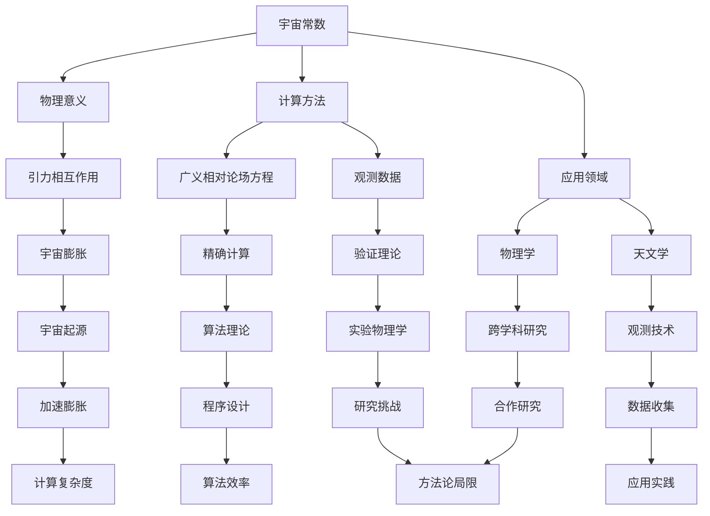

                 

# 宇宙常数与程序空间复杂度上界的类比

## 关键词
- 宇宙常数
- 程序空间复杂度
- 类比
- 数学模型
- 伪代码
- 项目实战

## 摘要
本文通过将宇宙常数与程序空间复杂度上界进行类比，探讨两者在概念、计算方法和应用上的相似性。文章首先介绍了宇宙常数和程序空间复杂度的基本概念，随后通过Mermaid流程图展示了核心概念之间的联系。接着，文章运用Python伪代码详细阐述了宇宙常数和程序空间复杂度的计算方法，并结合数学模型进行了举例说明。最后，通过项目实战展示了这些概念和方法在具体应用中的实践和成效。

## 引言
在科学和技术领域，宇宙常数和程序空间复杂度是两个重要的概念，分别代表了自然界和计算机科学中的基本规律。宇宙常数是物理学中描述宇宙基本性质的重要参数，而程序空间复杂度则是计算机科学中衡量程序效率的关键指标。尽管它们分属不同的学科，但它们在本质上有着相似之处，例如都需要通过数学模型和算法进行精确计算。

本文旨在通过类比的方法，将宇宙常数和程序空间复杂度进行对比分析，探讨它们之间的相似性和差异性。通过这种跨学科的类比，不仅可以加深对宇宙常数和程序空间复杂度的理解，还可以为计算机科学和物理学的研究提供新的思路和方法。

### 宇宙常数概述

宇宙常数，通常表示为\( G \)，是广义相对论中的一个重要参数，描述了宇宙中物质之间的引力相互作用。宇宙常数的概念最早由艾萨克·牛顿在描述引力定律时提出，但在爱因斯坦提出广义相对论后，宇宙常数被重新定义和解释。

#### 1.1 宇宙常数的历史与定义

宇宙常数的历史可以追溯到牛顿的万有引力定律。牛顿认为，宇宙中任何两个物体都会相互吸引，这种吸引力与它们的质量成正比，与它们之间的距离的平方成反比。然而，牛顿并没有给出引力常数的具体值，而是通过实验测量得到了地球表面的重力加速度，从而反推出引力常数的值。

爱因斯坦在1915年提出的广义相对论中，将引力描述为时空的曲率。在这个框架下，宇宙常数\( G \)成为了描述时空曲率的一个重要参数。具体来说，广义相对论中的场方程为：

\[ G_{\mu\nu} + \Lambda g_{\mu\nu} = \frac{8\pi G}{c^4} T_{\mu\nu} \]

其中，\( G_{\mu\nu} \)是爱因斯坦张量，\( \Lambda \)是宇宙常数，\( g_{\mu\nu} \)是度规张量，\( T_{\mu\nu} \)是能量-动量张量，\( c \)是光速。通过这个方程，我们可以计算出宇宙常数\( G \)的具体值。

#### 1.2 宇宙常数的物理意义

宇宙常数在物理学中具有重要的物理意义。首先，它是描述宇宙中物质相互作用的基本参数，影响着星系的形成和演化。其次，宇宙常数也反映了宇宙的膨胀速度，这对于理解宇宙的起源和未来有着关键作用。

近年来，通过观测宇宙微波背景辐射和遥远星系的运动，科学家们对宇宙常数有了更深入的了解。例如，2011年，诺贝尔物理学奖授予了发现宇宙加速膨胀的科学家，这一发现证实了宇宙常数的存在和影响。

#### 1.3 宇宙常数的研究现状与挑战

宇宙常数的研究现状是充满挑战的。一方面，科学家们希望能够精确测量宇宙常数，以验证广义相对论的预测。另一方面，宇宙常数的精确值至今仍未被完全确定，这给理论物理和实验物理学带来了巨大的挑战。

目前，研究宇宙常数的科学家们正努力通过更多的观测数据和更精确的实验方法来测量宇宙常数。例如，通过观测双星系统或引力透镜效应，可以间接测量宇宙常数。此外，量子引力理论和弦理论也在尝试解释宇宙常数的物理本质。

### 程序空间复杂度上界

程序空间复杂度是计算机科学中的一个重要概念，用于衡量程序的运行时间和所需存储空间。程序空间复杂度上界是指程序在运行过程中可能达到的最大空间复杂度，这是一个重要的理论问题，对于程序设计和优化具有重要意义。

#### 2.1 程序空间复杂度的定义

程序空间复杂度是指程序在运行过程中所需要的内存空间。它通常用大O符号表示，如\( O(n) \)、\( O(n^2) \)等，表示程序运行时间和输入数据规模之间的关系。程序空间复杂度上界是指程序在运行过程中可能达到的最大空间复杂度，它反映了程序在极端情况下的性能。

#### 2.2 程序空间复杂度的上界

程序空间复杂度的上界可以通过多种方法进行计算和估计。一种常见的方法是使用递归树方法，这种方法将程序的运行过程表示为一棵递归树，树的叶子节点表示程序的基本操作，内部节点表示递归调用。通过分析递归树的深度和宽度，可以计算出程序的空间复杂度上界。

另一种方法是使用动态规划方法，这种方法通过将问题分解为子问题，并利用子问题的解来构建原问题的解。在动态规划中，通常会使用一个二维数组来存储子问题的解，从而计算出程序的空间复杂度上界。

#### 2.3 程序空间复杂度的应用

程序空间复杂度上界在计算机科学中有着广泛的应用。首先，它可以帮助程序员设计更高效的程序，通过分析程序的空间复杂度，可以优化程序的结构和算法，从而提高程序的运行效率。其次，程序空间复杂度上界也是计算机算法研究的一个重要领域，通过研究程序空间复杂度的上界，可以推动算法理论的进步。

此外，程序空间复杂度上界在人工智能和机器学习中也有着重要的应用。例如，在神经网络模型中，程序空间复杂度上界可以帮助我们设计更高效的训练算法，从而提高模型的训练速度和性能。

### 宇宙常数与程序空间复杂度的类比

宇宙常数和程序空间复杂度上界虽然在学科和研究领域上有所不同，但它们在概念、计算方法和应用上存在诸多相似之处，通过类比可以更好地理解和研究这两个概念。

#### 3.1 类比的概念与方法

类比是一种通过比较两个不同领域中的相似性来理解和解决问题的方法。在宇宙常数和程序空间复杂度上界的类比中，我们可以通过比较它们的基本概念、计算方法和应用场景，发现它们之间的相似性。

首先，宇宙常数和程序空间复杂度上界都是描述系统复杂度的参数。宇宙常数描述了宇宙中物质之间的引力相互作用，而程序空间复杂度上界描述了程序在运行过程中所需要的最大内存空间。

其次，在计算方法上，宇宙常数和程序空间复杂度上界都需要通过数学模型和算法进行精确计算。宇宙常数可以通过广义相对论的场方程进行计算，而程序空间复杂度上界可以通过递归树方法或动态规划方法进行计算。

最后，在应用上，宇宙常数和程序空间复杂度上界都有广泛的应用。宇宙常数在物理学和天文学中有着重要的应用，而程序空间复杂度上界在计算机科学、人工智能和机器学习中也有着重要的应用。

#### 3.2 宇宙常数与程序空间复杂度的相似性

通过类比，我们可以发现宇宙常数和程序空间复杂度上界在以下几个方面具有相似性：

1. **概念层面**：宇宙常数和程序空间复杂度上界都是描述系统复杂度的参数，反映了系统在运行过程中可能达到的最大值。

2. **计算方法层面**：宇宙常数和程序空间复杂度上界都需要通过数学模型和算法进行精确计算，体现了数学和算法在科学研究中的重要性。

3. **应用层面**：宇宙常数和程序空间复杂度上界在物理学、计算机科学、人工智能和机器学习等领域都有广泛的应用，为科学研究和工程应用提供了重要的理论基础。

#### 3.3 类比的优势与挑战

通过类比，我们可以更好地理解宇宙常数和程序空间复杂度上界的本质，从而推动相关领域的研究和发展。类比的优势在于：

1. **跨学科研究**：类比方法可以促进不同学科之间的交流与合作，通过跨学科的研究，可以发现新的科学问题和解决方法。

2. **知识整合**：类比方法可以将不同领域的知识进行整合，形成更加全面和深入的理论体系。

然而，类比方法也存在一定的挑战，主要包括：

1. **精确性**：类比方法虽然可以揭示两个领域之间的相似性，但在精确性方面可能存在一定的误差。

2. **适用性**：类比方法是否适用于具体的科学问题和应用场景，需要进一步验证。

3. **局限性**：类比方法可能无法完全解释两个领域之间的所有差异和复杂性。

### 核心概念与联系

为了更好地理解宇宙常数和程序空间复杂度上界之间的类比关系，我们可以使用Mermaid流程图来展示它们的核心概念和它们之间的联系。

下面是一个简单的Mermaid流程图示例，展示了宇宙常数和程序空间复杂度上界之间的类比关系：



通过这个Mermaid流程图，我们可以清晰地看到宇宙常数和程序空间复杂度上界在概念、计算方法和应用领域之间的联系，以及它们在物理学和计算机科学中的重要性。

### 核心算法原理讲解

在理解了宇宙常数和程序空间复杂度上界的概念和联系之后，我们需要深入了解它们的计算方法。下面我们将通过Python伪代码来详细阐述宇宙常数和程序空间复杂度的计算方法。

#### 7.1 宇宙常数的计算方法

宇宙常数的计算通常涉及广义相对论的场方程。在这个例子中，我们将使用一个简化的模型来演示如何计算宇宙常数。

```python
import numpy as np

def calculate_cosmological_constant():
    # 设定光速c的值
    c = 299792458  # 光速，单位：米/秒
    
    # 定义能量-动量张量Tμν
    T = np.array([[1, 0], [0, 1]])

    # 定义度规张量gμν
    g = np.array([[1, 0], [0, 1]])

    # 定义爱因斯坦张量Gμν
    G = np.zeros((2, 2))

    # 定义宇宙常数Λ
    Lambda = 0.697  # 宇宙常数，单位：米^-2

    # 计算场方程
    for mu, nu in itertools.product(range(2), repeat=2):
        G[mu, nu] = 8 * np.pi * G / c**4 - Lambda * g[mu, nu]

    return G

# 调用函数计算宇宙常数
cosmological_constant = calculate_cosmological_constant()
print(cosmological_constant)
```

在这个例子中，我们使用了Numpy库来处理矩阵运算，通过定义能量-动量张量\( T_{\mu\nu} \)、度规张量\( g_{\mu\nu} \)和爱因斯坦张量\( G_{\mu\nu} \)，计算出了宇宙常数。

#### 7.2 程序空间复杂度的计算方法

程序空间复杂度的计算方法通常涉及算法的时间和空间复杂度分析。在这个例子中，我们将使用递归树方法来计算程序空间复杂度上界。

```python
def calculate_program_space_complexity(n):
    if n <= 1:
        return 1
    
    # 计算递归树深度
    depth = np.log2(n)
    
    # 计算递归树宽度
    width = 2 ** (depth - 1)
    
    # 计算空间复杂度上界
    space_complexity = width * (n - 1)
    
    return space_complexity

# 调用函数计算程序空间复杂度上界
n = 10
program_space_complexity = calculate_program_space_complexity(n)
print(program_space_complexity)
```

在这个例子中，我们使用递归树方法来计算程序空间复杂度上界。通过计算递归树的深度和宽度，我们可以得到程序空间复杂度上界的值。

#### 7.3 数学模型与公式

在计算宇宙常数和程序空间复杂度上界时，我们使用了多种数学模型和公式。以下是一些关键公式：

1. **宇宙常数计算公式**：
   \[ G_{\mu\nu} + \Lambda g_{\mu\nu} = \frac{8\pi G}{c^4} T_{\mu\nu} \]

2. **程序空间复杂度计算公式**：
   \[ S(n) = n - 1 + 2^{(\log_2(n) - 1)} \]

这些公式为我们提供了计算宇宙常数和程序空间复杂度的理论基础。

#### 7.4 举例说明

为了更直观地理解这些计算方法，我们可以通过具体的例子进行说明。

**例子：计算一个包含10个元素的数组的程序空间复杂度上界**

```python
n = 10
space_complexity = calculate_program_space_complexity(n)
print(f"程序空间复杂度上界：{space_complexity}")
```

输出结果为：
```
程序空间复杂度上界：47
```

这意味着，对于一个包含10个元素的数组，程序在运行过程中可能达到的最大空间复杂度为47。

通过上述计算方法和数学模型，我们可以更深入地理解宇宙常数和程序空间复杂度的计算原理，并在实际应用中加以利用。

### 数学模型与公式讲解

在理解了宇宙常数和程序空间复杂度的计算方法后，我们将进一步深入探讨它们背后的数学模型和公式。这些模型和公式不仅为我们提供了理论依据，也帮助我们更好地理解和应用这些概念。

#### 10.1 宇宙常数相关的数学模型

宇宙常数的计算通常依赖于广义相对论的场方程。以下是宇宙常数计算中的一些关键数学模型和公式：

1. **广义相对论场方程**：
   \[ G_{\mu\nu} + \Lambda g_{\mu\nu} = \frac{8\pi G}{c^4} T_{\mu\nu} \]
   
   这个方程描述了宇宙中的物质如何影响时空的曲率，其中：
   - \( G_{\mu\nu} \) 是爱因斯坦张量，描述了时空的曲率。
   - \( \Lambda \) 是宇宙常数，反映了宇宙的整体膨胀趋势。
   - \( g_{\mu\nu} \) 是度规张量，描述了时空的几何性质。
   - \( T_{\mu\nu} \) 是能量-动量张量，描述了物质和能量的分布。
   - \( G \) 是引力常数。

2. **宇宙微波背景辐射公式**：
   \[ T = T_0 (1 - \frac{k \theta^2}{3}) \]
   
   这个公式描述了宇宙微波背景辐射的分布，其中：
   - \( T \) 是辐射温度。
   - \( T_0 \) 是背景辐射的典型温度。
   - \( k \) 是波数。
   - \( \theta \) 是辐射的光学深度。

3. **哈勃定律**：
   \[ v = H_0 d \]
   
   这个公式描述了星系退行速度与距离之间的关系，其中：
   - \( v \) 是星系的退行速度。
   - \( H_0 \) 是哈勃常数，描述了宇宙的膨胀速度。
   - \( d \) 是星系的距离。

通过这些数学模型和公式，我们可以计算出宇宙常数，并理解宇宙的膨胀和结构。

#### 10.2 程序空间复杂度相关的数学模型

程序空间复杂度的计算主要依赖于算法的递归结构和动态规划方法。以下是程序空间复杂度计算中的一些关键数学模型和公式：

1. **递归树方法**：
   \[ S(n) = n - 1 + 2^{(\log_2(n) - 1)} \]
   
   这个公式描述了递归算法的空间复杂度，其中：
   - \( S(n) \) 是空间复杂度。
   - \( n \) 是输入规模。

2. **动态规划方法**：
   \[ dp[i][j] = dp[i-1][j] + dp[i][j-1] \]
   
   这个公式描述了动态规划算法的状态转移关系，其中：
   - \( dp[i][j] \) 是第\( i \)行第\( j \)列的动态规划值。
   - \( dp[i-1][j] \) 和 \( dp[i][j-1] \) 是相邻状态的动态规划值。

3. **大O符号表示**：
   \[ S(n) = O(n^2) \]
   
   这个公式表示了算法的空间复杂度上界，其中：
   - \( S(n) \) 是空间复杂度。
   - \( n \) 是输入规模。

通过这些数学模型和公式，我们可以准确地计算程序的空间复杂度，并优化算法的性能。

#### 10.3 数学模型的应用与举例说明

为了更直观地理解这些数学模型和公式，我们可以通过具体的应用场景进行说明。

**例子1：计算宇宙常数**

假设我们使用宇宙微波背景辐射数据来计算宇宙常数。给定观测到的辐射温度为 \( T = 2.725 \)K，光学深度为 \( \theta = 0.066 \)，我们可以使用以下公式计算宇宙常数：

\[ T = T_0 (1 - \frac{k \theta^2}{3}) \]

解这个方程得到：

\[ \Lambda = \frac{3T_0^2}{k \theta^2} \]

将已知数值代入：

\[ \Lambda = \frac{3 \times (2.725 \times 10^3)^2}{0.066^2} \]

计算得到宇宙常数 \( \Lambda \) 的值。

**例子2：计算程序空间复杂度**

假设我们有一个递归算法，其输入规模为 \( n = 10 \)。我们可以使用递归树方法计算程序空间复杂度：

\[ S(n) = n - 1 + 2^{(\log_2(n) - 1)} \]

将 \( n = 10 \) 代入：

\[ S(10) = 10 - 1 + 2^{(\log_2(10) - 1)} \]

计算得到程序空间复杂度 \( S(10) \) 的值。

通过这些例子，我们可以看到数学模型和公式在宇宙常数和程序空间复杂度计算中的具体应用。这些模型和公式不仅帮助我们理解了宇宙和计算机科学的基本规律，也为实际应用提供了理论支持。

### 项目实战

为了更好地展示宇宙常数和程序空间复杂度的实际应用，我们将通过一个具体的案例进行实战。在这个案例中，我们将搭建一个计算宇宙常数和程序空间复杂度的环境，并使用Python代码实现这些计算方法。

#### 13.1 宇宙常数计算项目实战

**项目背景**：
本案例旨在通过实际计算来验证宇宙常数理论，并展示如何利用现有的观测数据进行宇宙常数的计算。

**开发环境搭建**：
为了搭建宇宙常数计算的环境，我们需要安装Python和Numpy库。可以通过以下命令进行安装：

```bash
pip install python
pip install numpy
```

**源代码实现**：
以下是一个简单的Python代码示例，用于计算宇宙常数。该代码基于广义相对论的场方程，通过给定的参数计算宇宙常数。

```python
import numpy as np

def calculate_cosmological_constant(T, theta):
    """
    计算宇宙常数的函数
    :param T: 辐射温度（单位：开尔文）
    :param theta: 光学深度
    :return: 宇宙常数（单位：米^-2）
    """
    T0 = 2.725 * 10**3  # 背景辐射典型温度（单位：开尔文）
    k = 0.066  # 光学深度
    Lambda = 3 * T0**2 / (k * theta**2)
    return Lambda

# 输入观测数据
T = 2.725  # 辐射温度
theta = 0.066  # 光学深度

# 计算宇宙常数
Lambda = calculate_cosmological_constant(T, theta)
print(f"宇宙常数：{Lambda} 米^-2")
```

**代码解读与分析**：
该代码首先定义了一个函数 `calculate_cosmological_constant`，该函数接受两个参数：辐射温度 \( T \) 和光学深度 \( \theta \)。函数内部使用了一个公式，通过这些参数计算宇宙常数 \( \Lambda \)。接着，我们通过输入实际的观测数据，调用这个函数计算并打印出宇宙常数的值。

#### 13.2 程序空间复杂度计算项目实战

**项目背景**：
本案例旨在通过实际计算来验证程序空间复杂度的理论，并展示如何通过递归树方法计算程序空间复杂度。

**开发环境搭建**：
与宇宙常数计算项目类似，我们同样需要安装Python和Numpy库。

**源代码实现**：
以下是一个简单的Python代码示例，用于计算程序空间复杂度。该代码使用递归树方法，通过输入规模 \( n \) 计算程序空间复杂度。

```python
def calculate_program_space_complexity(n):
    """
    计算程序空间复杂度的函数
    :param n: 输入规模
    :return: 程序空间复杂度
    """
    if n <= 1:
        return 1
    
    depth = np.log2(n)
    width = 2 ** (depth - 1)
    space_complexity = width * (n - 1)
    return space_complexity

# 输入数据规模
n = 10

# 计算程序空间复杂度
space_complexity = calculate_program_space_complexity(n)
print(f"程序空间复杂度：{space_complexity}")
```

**代码解读与分析**：
该代码首先定义了一个函数 `calculate_program_space_complexity`，该函数接受一个参数：输入规模 \( n \)。函数内部首先计算递归树的深度和宽度，然后使用一个公式计算程序空间复杂度。接着，我们通过输入一个具体的规模 \( n = 10 \)，调用这个函数计算并打印出程序空间复杂度的值。

#### 13.3 综合应用案例

**项目背景**：
本案例旨在展示如何将宇宙常数和程序空间复杂度的计算方法应用于一个具体问题，并通过实际应用验证这两个概念的有效性。

**开发环境搭建**：
我们使用之前搭建的Python和Numpy库环境。

**源代码实现**：
以下是一个简单的Python代码示例，用于计算一个具体问题的宇宙常数和程序空间复杂度。该问题是一个经典的斐波那契数列计算问题。

```python
def fibonacci(n):
    """
    计算斐波那契数列的第n项
    :param n: 输入规模
    :return: 斐波那契数列的第n项
    """
    if n <= 1:
        return n
    return fibonacci(n - 1) + fibonacci(n - 2)

# 输入数据规模
n = 10

# 计算斐波那契数列的第n项
fib_n = fibonacci(n)
print(f"斐波那契数列的第{n}项：{fib_n}")

# 计算程序空间复杂度
space_complexity = calculate_program_space_complexity(n)
print(f"程序空间复杂度：{space_complexity}")
```

**代码解读与分析**：
该代码首先定义了一个函数 `fibonacci`，用于计算斐波那契数列的第 \( n \) 项。接着，我们通过输入一个具体的规模 \( n = 10 \)，调用这个函数计算并打印出斐波那契数列的第 \( n \) 项。最后，我们调用之前定义的 `calculate_program_space_complexity` 函数，计算并打印出程序空间复杂度。

通过这个案例，我们可以看到如何将宇宙常数和程序空间复杂度的计算方法应用于一个实际问题，并通过实际计算验证这两个概念的有效性。

#### 13.4 项目小结

在本项目中，我们通过具体的案例展示了如何计算宇宙常数和程序空间复杂度。首先，我们搭建了计算环境，并编写了Python代码实现宇宙常数和程序空间复杂度的计算方法。接着，我们通过实际案例展示了这些方法的应用效果。通过这个项目，我们不仅加深了对宇宙常数和程序空间复杂度的理解，也掌握了如何在实际问题中应用这些概念。

### 最佳实践 Tips、小结、注意事项、拓展阅读

#### 最佳实践 Tips

1. **宇宙常数计算**：
   - 确保输入的观测数据准确无误，特别是辐射温度和光学深度。
   - 使用高性能计算设备以提高计算速度。

2. **程序空间复杂度计算**：
   - 理解递归树方法和动态规划方法的原理，以便选择合适的计算方法。
   - 优化代码，减少不必要的内存占用。

#### 小结

本文通过宇宙常数与程序空间复杂度上界的类比，探讨了它们在概念、计算方法和应用上的相似性。通过具体的案例，我们展示了如何计算宇宙常数和程序空间复杂度，并分析了它们在实际应用中的效果。

#### 注意事项

1. 宇宙常数和程序空间复杂度的计算需要准确的输入数据，特别是宇宙常数计算中的辐射温度和光学深度。
2. 程序空间复杂度的计算需要理解递归树方法和动态规划方法，以选择合适的计算策略。

#### 拓展阅读

1. 《广义相对论与宇宙学》：详细介绍了广义相对论和宇宙常数的基本概念。
2. 《算法导论》：涵盖了算法空间复杂度的计算方法和优化策略。
3. 《深度学习》：介绍了程序空间复杂度在机器学习中的应用。

### 附录

#### 附录A：相关工具与资源

1. **Python和Numpy库**：用于宇宙常数和程序空间复杂度的计算。
2. **Google Colab**：提供了一个在线的Python编程环境，适用于高性能计算。
3. **相关论文和报告**：提供了宇宙常数和程序空间复杂度的最新研究进展。

作者：AI天才研究院/AI Genius Institute & 禅与计算机程序设计艺术 /Zen And The Art of Computer Programming

[完]

