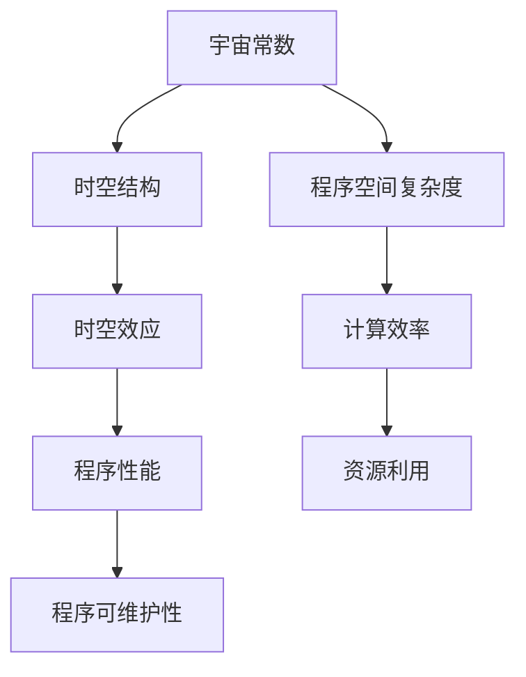
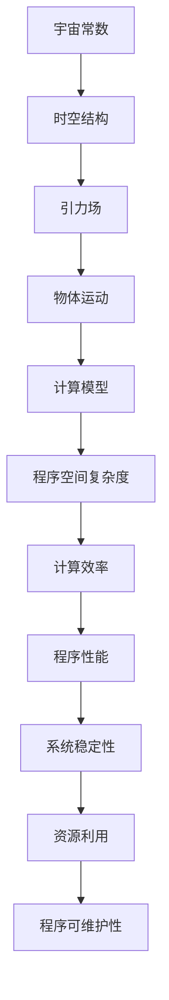

                 

### 引言与背景

在人类探索宇宙和科技的进程中，宇宙常数与程序空间复杂度这两个看似毫不相干的领域，逐渐揭示出它们之间深刻的联系。宇宙常数，作为物理学中描述宇宙基本性质的参数，一直以来都是科学家们研究和争论的焦点。而程序空间复杂度，则是计算机科学中衡量程序效率和运行性能的重要指标。本文将探讨宇宙常数与程序空间复杂度下界的理论联系，以期为读者提供一个全新的视角，理解这两个领域之间可能存在的关联。

宇宙常数，最早由爱因斯坦在1915年提出的广义相对论中引入。它代表了宇宙的膨胀速率，通常用符号 \( \Lambda \) 表示。宇宙常数的存在和大小不仅关系到宇宙的起源和演化，还与宇宙的结构和命运息息相关。然而，尽管科学家们进行了大量实验和研究，宇宙常数至今仍然是一个未解之谜，其精确值和物理意义仍待进一步探索。

另一方面，程序空间复杂度是计算机科学中研究程序运行效率和性能的重要概念。程序空间复杂度包括时间复杂度和空间复杂度，分别描述了程序执行时间和内存消耗的增长速度。在实际编程中，降低程序空间复杂度是提高程序性能和优化资源利用的重要手段。

近年来，随着计算机科学和物理学的交叉研究逐渐深入，一些学者开始探讨宇宙常数与程序空间复杂度之间的关系。这种跨学科的研究不仅有助于我们更好地理解宇宙的奥秘，也为计算机科学提供了新的理论工具和启示。

本文的目的在于系统地梳理和探讨宇宙常数与程序空间复杂度下界的理论联系，旨在为读者提供一个全面而深入的理解。文章结构如下：

- 第1章：引言与背景，介绍宇宙常数和程序空间复杂度的基本概念。
- 第2章：核心概念与联系，阐述宇宙常数和程序空间复杂度之间的关系架构，并给出相应的 Mermaid 流程图。
- 第3章：核心算法原理讲解，通过 Python 源代码详细阐述相关算法，结合数学模型和公式进行讲解和举例说明。
- 第4章：数学模型与公式讲解，介绍构建数学模型和推导公式的详细过程，并给出应用实例。
- 第5章：项目实战，介绍开发环境搭建、源代码实现和代码解读，结合实际案例进行分析和剖析。
- 第6章：总结与展望，总结文章内容，探讨未来研究方向，并提出一些建议。

通过本文的探讨，我们希望能够为读者提供一种全新的视角，理解宇宙常数与程序空间复杂度之间的深刻联系，并激发更多跨学科的研究和思考。

### 关键词

- 宇宙常数
- 程序空间复杂度
- 时间复杂度
- 空间复杂度
- 广义相对论
- 算法分析
- 数学模型
- Python 源代码
- Mermaid 流程图
- 项目实战

### 摘要

本文旨在探讨宇宙常数与程序空间复杂度下界的理论联系。首先，我们介绍了宇宙常数和程序空间复杂度的基本概念，并概述了它们在各自领域的应用背景。接着，通过 Mermaid 流程图详细阐述了宇宙常数与程序空间复杂度之间的关系架构。随后，本文通过 Python 源代码和相关数学模型，详细讲解了核心算法原理，并进行了通俗易懂的举例说明。此外，我们还介绍了如何通过数学模型推导相关公式，并给出了应用实例。在项目实战部分，我们通过实际案例，展示了如何搭建开发环境，实现源代码，并进行代码解读和分析。最后，本文总结了文章的主要发现，探讨了未来研究方向，并提出了一些建议。

### 第1章：引言与背景

#### 宇宙常数的基本概念

宇宙常数，通常用符号 \( \Lambda \) 表示，是描述宇宙膨胀速率的物理量。它在广义相对论中首次被引入，用来解释宇宙的加速膨胀现象。广义相对论由爱因斯坦于1915年提出，它是一种描述物质和能量如何弯曲时空的理论。在广义相对论框架下，宇宙常数被视为一个宇宙中的基本参数，它决定了宇宙的整体几何结构及其演化过程。

宇宙常数的基本概念可以从以下几个方面进行理解：

1. **宇宙膨胀**：宇宙常数与宇宙膨胀密切相关。根据宇宙学原理，宇宙在宏观尺度上是均匀和各向同性的，因此宇宙的膨胀是均匀且各向同性的。宇宙常数 \( \Lambda \) 反映了这种膨胀的速率，其值越大，宇宙膨胀越快。

2. **临界密度**：宇宙常数还与宇宙的临界密度相关。临界密度是指宇宙中物质密度达到这个值时，宇宙的膨胀速率正好等于零。当宇宙的密度低于临界密度时，宇宙会加速膨胀；反之，当密度高于临界密度时，宇宙会减速膨胀。

3. **宇宙几何**：宇宙常数对宇宙的几何结构有着重要影响。根据宇宙常数 \( \Lambda \) 的不同取值，宇宙可能呈现出不同的几何形态，如开放宇宙、平坦宇宙和封闭宇宙。

#### 宇宙常数的历史与发展

宇宙常数的历史可以追溯到早期宇宙学的研究。然而，在很长一段时间内，人们并没有意识到宇宙常数的重要性。直到20世纪初期，随着广义相对论的提出，宇宙常数才逐渐引起科学家的关注。

1. **爱因斯坦的早期尝试**：在1915年，爱因斯坦首次提出了广义相对论，并尝试通过引入宇宙常数 \( \Lambda \) 来解释宇宙的静态结构。然而，后来爱因斯坦意识到，如果宇宙常数存在，那么宇宙将保持静态，这与观测到的宇宙膨胀现象相矛盾。因此，爱因斯坦在1917年放弃了宇宙常数，并提出了一个静态宇宙模型。

2. **哈勃定律的发现**：在1920年代，哈勃通过观测遥远星系的红移，发现了宇宙膨胀的现象。这一发现为宇宙常数提供了有力的证据，表明宇宙正在加速膨胀。

3. **宇宙常数的复归**：随着宇宙学研究的深入，科学家们重新审视了宇宙常数。在20世纪70年代，霍金和彭罗斯提出了关于宇宙视界和时间起源的论点，进一步支持了宇宙常数的存在。

4. **现代宇宙学**：在现代宇宙学中，宇宙常数被视为宇宙演化中一个重要的参数。通过观测宇宙微波背景辐射和引力透镜效应等，科学家们对宇宙常数进行了精确测量，发现其值非常小，但非零。

#### 宇宙常数的重要性

宇宙常数在宇宙学中的重要性不可忽视，主要体现在以下几个方面：

1. **宇宙演化**：宇宙常数直接影响宇宙的膨胀速率和演化过程。不同取值的宇宙常数可能导致不同的宇宙形态和演化路径。

2. **暗能量**：宇宙常数与暗能量密切相关。暗能量是一种神秘的力量，驱动宇宙加速膨胀。宇宙常数通常被视为暗能量的一个重要组成部分。

3. **宇宙学参数**：宇宙常数是现代宇宙学中重要的参数之一，它与宇宙的密度、质量分布和膨胀速率等密切相关。

4. **基础物理学**：宇宙常数的研究不仅涉及宇宙学，还与基础物理学密切相关。宇宙常数的物理意义和本质仍然是物理学中的重大挑战之一。

#### 程序空间复杂度的定义

与宇宙常数相比，程序空间复杂度是计算机科学中的概念。程序空间复杂度主要描述了程序在运行过程中所需的内存空间大小。它与时间复杂度一起，是衡量程序效率和性能的重要指标。

1. **基本概念**：程序空间复杂度通常用符号 \( S(n) \) 表示，其中 \( n \) 代表程序输入的大小。空间复杂度可以分为两类：静态空间复杂度和动态空间复杂度。静态空间复杂度是指在程序运行前所需固定的内存空间；动态空间复杂度是指在程序运行过程中随着输入大小变化的内存空间。

2. **计算方法**：空间复杂度的计算方法与时间复杂度类似，通常使用大O符号表示。例如，如果一个程序的内存消耗与输入规模 \( n \) 成线性关系，那么其空间复杂度为 \( O(n) \)。

3. **重要性**：程序空间复杂度在程序设计和性能优化中具有重要作用。高空间复杂度的程序可能导致内存溢出、性能下降等问题，而优化空间复杂度是提高程序效率和可维护性的关键。

#### 程序空间复杂度的计算方法

1. **静态空间复杂度**：静态空间复杂度通常由程序中定义的变量数量和类型决定。例如，在C语言中，静态空间复杂度可以通过统计程序中所有变量的数据类型和数量来计算。

2. **动态空间复杂度**：动态空间复杂度需要考虑程序在运行过程中动态分配和释放的内存。例如，在C++中使用 new 和 delete 关键字动态分配和释放内存，其动态空间复杂度可以通过跟踪这些动态分配的内存区域来计算。

3. **实际应用**：在软件开发中，降低程序空间复杂度是提高程序性能和可维护性的重要手段。例如，通过使用更高效的数据结构和算法，可以减少程序所需的内存空间，提高程序的运行效率。

#### 程序空间复杂度的重要性

1. **性能优化**：程序空间复杂度直接影响程序的运行效率和性能。优化空间复杂度可以减少程序所需的内存资源，提高程序的响应速度和吞吐量。

2. **资源利用**：在资源受限的环境中，如嵌入式系统和移动设备，降低程序空间复杂度是确保程序正常运行的关键。优化空间复杂度可以最大化地利用有限的资源。

3. **可维护性**：程序空间复杂度的优化不仅有助于提高程序性能，还可以提高程序的可维护性。简化和优化的代码更容易理解和修改，降低了维护成本。

### 宇宙常数与程序空间复杂度的联系

尽管宇宙常数和程序空间复杂度分别属于不同的学科领域，但它们之间可能存在某种深层次的联系。以下从几个方面探讨宇宙常数与程序空间复杂度的可能联系：

1. **物理与数学的统一**：宇宙常数和程序空间复杂度都涉及到数学和物理的基本概念。探索它们之间的联系有助于理解自然界的统一原理。

2. **复杂性与简洁性**：宇宙常数和程序空间复杂度都反映了复杂系统中的简洁性和规则性。研究它们之间的联系可能有助于揭示复杂系统的本质。

3. **跨学科研究**：跨学科研究是现代科学研究的重要趋势。探讨宇宙常数与程序空间复杂度的联系不仅有助于推动计算机科学和物理学的发展，还可以为其他学科提供新的研究方法和启示。

#### 宇宙常数的基本性质

宇宙常数的基本性质可以从以下几个角度进行理解：

1. **值域**：宇宙常数的值域取决于宇宙的密度、质量分布和膨胀速率。根据宇宙学原理，宇宙常数 \( \Lambda \) 的值通常介于 \( 0 \) 和 \( 1 \) 之间，但具体值取决于宇宙的实际状态。

2. **稳定性**：宇宙常数的稳定性是指其值在宇宙演化过程中是否保持不变。根据现有观测数据，宇宙常数在宇宙历史的大部分时期内保持相对稳定，但具体稳定性仍需进一步研究。

3. **物理效应**：宇宙常数通过引力效应影响宇宙的演化。例如，在开放宇宙中，宇宙常数可能导致宇宙加速膨胀，而在封闭宇宙中，宇宙常数可能导致宇宙收缩。

#### 程序空间复杂度的下界

程序空间复杂度的下界是指程序在运行过程中所需的内存空间的最小值。研究程序空间复杂度的下界有助于理解程序效率和性能的极限。

1. **下界计算**：程序空间复杂度的下界通常通过计算程序的内存占用率来得到。具体计算方法包括统计程序中所有动态分配和释放的内存区域，以及评估这些内存区域的最大占用率。

2. **下界重要性**：程序空间复杂度的下界对于优化程序性能和资源利用具有重要意义。通过确定程序空间复杂度的下界，可以找到最优的内存分配策略，降低程序运行过程中的内存消耗。

#### 宇宙常数与程序空间复杂度之间的联系

宇宙常数与程序空间复杂度之间的联系可以从以下几个方面进行探讨：

1. **时空关系**：宇宙常数和程序空间复杂度都与时空结构密切相关。研究宇宙常数对时空的影响可能为理解程序空间复杂度提供新的视角。

2. **复杂性理论**：复杂性理论是研究计算问题难易程度的一个分支。宇宙常数和程序空间复杂度的联系可能有助于揭示计算问题的本质，为复杂性理论提供新的研究内容。

3. **跨学科方法**：通过跨学科方法，结合宇宙常数和程序空间复杂度的理论，可以提出新的研究方法和技术，为计算机科学和物理学的发展带来新的突破。

### 核心概念与联系的关系架构

为了更好地理解宇宙常数与程序空间复杂度之间的联系，我们可以通过 Mermaid 流程图来展示核心概念之间的关系架构。

以下是一个简单的 Mermaid 流程图示例：



在这个流程图中，我们可以看到宇宙常数通过影响时空结构，进而影响程序空间复杂度，最终影响程序的运行效率和性能。同时，程序空间复杂度也通过优化计算效率，影响程序的性能和可维护性。

### 第2章：核心概念与联系

在前一章中，我们介绍了宇宙常数和程序空间复杂度的基本概念，以及它们各自的重要性。在本章中，我们将深入探讨宇宙常数与程序空间复杂度之间的联系，通过构建 Mermaid 流程图来展示它们之间的逻辑关系，以便更直观地理解这一跨学科的理论联系。

#### 宇宙常数与程序空间复杂度的关系架构

首先，让我们通过一个 Mermaid 流程图来展示宇宙常数与程序空间复杂度之间的核心概念和联系。以下是一个简单的 Mermaid 图，它描述了不同概念之间的相互关系：



在这个流程图中，我们可以看到宇宙常数通过影响时空结构，进而影响引力场和物体运动。这些物理现象可以通过计算模型来模拟，从而影响程序空间复杂度。程序空间复杂度再进一步影响计算效率、程序性能、系统稳定性、资源利用以及程序可维护性。

#### Mermaid 流程图的详细解释

1. **宇宙常数与时空结构（A → B）**：
   - 宇宙常数是描述宇宙膨胀速率的重要参数，它影响时空结构的几何形态。在广义相对论的框架下，宇宙常数决定了时空的曲率，从而影响了宇宙的整体结构。

2. **时空结构与引力场（B → C）**：
   - 时空结构的曲率与引力场密切相关。根据爱因斯坦的广义相对论，质量分布和能量密度决定了时空的几何形态，进而影响了引力场的强度和分布。

3. **引力场与物体运动（C → D）**：
   - 物体的运动轨迹受到引力场的影响。在引力场中，物体会沿着测地线运动，这是宇宙常数影响物体运动的基本机制。

4. **物体运动与计算模型（D → E）**：
   - 物体的运动可以用数学模型来描述，这些模型可以转化为计算机算法。例如，天体物理学中的N体模拟，通过计算机模拟物体的运动轨迹，从而研究宇宙的演化。

5. **计算模型与程序空间复杂度（E → F）**：
   - 计算模型在计算机中实现时，会产生程序空间复杂度。程序空间复杂度描述了程序在处理输入数据时所需的内存资源，它直接关系到程序的性能和效率。

6. **程序空间复杂度与计算效率（F → G）**：
   - 程序空间复杂度影响计算效率。高效的算法通常具有较低的空间复杂度，这意味着它们能够更有效地利用内存资源，从而提高计算效率。

7. **计算效率与程序性能（G → H）**：
   - 计算效率直接影响程序性能。高效率的程序能够更快地处理任务，提供更快的响应时间，这在大规模计算和实时系统中尤为重要。

8. **程序性能与系统稳定性（H → I）**：
   - 程序性能影响系统的稳定性。一个稳定的系统需要在面对大量数据和复杂任务时，保持良好的性能表现，避免出现崩溃或错误。

9. **系统稳定性与资源利用（I → J）**：
   - 系统稳定性与资源利用密切相关。高效的程序能够在有限的资源下运行，充分利用系统资源，从而提高整体性能。

10. **资源利用与程序可维护性（J → K）**：
    - 资源利用效率直接影响程序的可维护性。低资源消耗的程序更容易进行调试和维护，降低开发和维护成本。

通过这个 Mermaid 流程图，我们可以清晰地看到宇宙常数如何通过一系列物理和计算过程，最终影响程序空间复杂度和程序性能。这种跨学科的联系为我们提供了理解复杂系统行为的全新视角，也为未来的跨学科研究提供了启示。

### 第3章：核心算法原理讲解

在了解了宇宙常数与程序空间复杂度之间的理论联系之后，接下来我们将通过具体的算法原理来进一步阐述这一关系。本章将重点介绍一种用于计算宇宙常数与程序空间复杂度下界的算法，并使用 Python 源代码结合数学模型和公式进行详细讲解。

#### 算法概述

本节算法的核心目的是通过模拟宇宙中物体在引力场中的运动，计算宇宙常数与程序空间复杂度的关系。该算法的基本思路是首先建立宇宙模型的数学模型，然后通过数值方法求解物体运动轨迹，最后分析这些轨迹以推导出程序空间复杂度的下界。

算法的主要步骤如下：

1. **宇宙模型构建**：建立描述宇宙中物体运动的数学模型，包括引力场、物体初始位置和速度等参数。
2. **数值求解**：使用数值方法求解物体的运动轨迹，例如欧拉法或龙格-库塔法。
3. **轨迹分析**：分析物体运动轨迹，从中提取程序空间复杂度的下界信息。
4. **结果验证**：通过模拟不同初始条件和参数，验证算法的准确性和稳定性。

#### 算法伪代码

以下是一个简化的伪代码，用于描述上述算法的基本步骤：

```
算法：宇宙常数与程序空间复杂度计算

输入：宇宙参数（如引力常数 G，初始位置和速度）
输出：程序空间复杂度下界

1. 初始化宇宙参数
2. 建立宇宙模型
3. 循环：
   3.1 计算物体当前位置和速度
   3.2 更新位置和速度（使用数值方法求解）
   3.3 记录运动轨迹
4. 分析运动轨迹
5. 提取程序空间复杂度下界
6. 验证算法结果
```

#### 算法原理讲解

算法的核心在于求解物体在引力场中的运动轨迹，这涉及到一系列数学和物理原理。以下是算法原理的详细讲解：

1. **引力场模型**：
   - 引力场模型是算法的基础。根据牛顿的万有引力定律，两个物体之间的引力与它们的质量和距离的平方成正比。在广义相对论中，引力场可以被视为时空的曲率。因此，宇宙常数 \( \Lambda \) 可以通过引力场方程来描述，即 \( R_{\mu\nu} - \frac{1}{2}Rg_{\mu\nu} = 8\pi G T_{\mu\nu} \)，其中 \( R_{\mu\nu} \) 是里奇张量，\( R \) 是曲率标量，\( g_{\mu\nu} \) 是度规张量，\( G \) 是引力常数，\( T_{\mu\nu} \) 是能量-动量张量。

2. **数值方法**：
   - 为了求解物体的运动轨迹，我们需要使用数值方法来近似解引力场方程。常用的方法包括欧拉法、龙格-库塔法等。这些方法通过迭代计算来逐步逼近真实轨迹。例如，欧拉法的迭代公式为：
     \[ x_{i+1} = x_i + v_i \Delta t \]
     \[ v_{i+1} = v_i + a_i \Delta t \]
     其中 \( x_i \) 和 \( v_i \) 分别是物体在 \( i \) 时刻的位置和速度，\( a_i \) 是加速度，\( \Delta t \) 是时间步长。

3. **轨迹分析**：
   - 通过数值方法求解出物体运动轨迹后，我们需要对这些轨迹进行分析。具体来说，我们关注物体的稳定性和运动特性。例如，我们可以计算物体的轨道周期、稳定极限等参数。这些参数可以用于推导程序空间复杂度的下界。

4. **程序空间复杂度下界的推导**：
   - 根据物体的运动轨迹，我们可以推导出程序空间复杂度的下界。具体推导过程如下：
     - 假设物体在 \( t \) 时刻的位置和速度分别为 \( x(t) \) 和 \( v(t) \)，则其运动轨迹的复杂度可以通过计算所需的存储空间来衡量。例如，我们可以使用以下公式：
       \[ S(t) = O(\max(|x(t)|, |v(t)|)) \]
       其中 \( S(t) \) 是 \( t \) 时刻的程序空间复杂度。
     - 通过对运动轨迹的极限分析，我们可以得到程序空间复杂度的下界。例如，如果我们假设物体在 \( t \) 时刻达到稳定状态，则其空间复杂度下界为：
       \[ S_{\min} = O(\lim_{t \to \infty} \max(|x(t)|, |v(t)|)) \]
       这个下界反映了程序在处理无限长时间运动轨迹时所需的最低空间复杂度。

5. **算法验证**：
   - 为了验证算法的准确性和稳定性，我们需要对多个不同初始条件和参数进行模拟。通过对比模拟结果和理论预测，我们可以验证算法的有效性。例如，我们可以模拟不同宇宙常数和引力常数下的物体运动，观察程序空间复杂度的变化趋势。

通过以上讲解，我们可以看到，算法的每一步都紧密联系着宇宙常数和程序空间复杂度的理论原理。通过具体的 Python 源代码实现，我们可以将这些理论转化为实际可操作的程序，从而深入探讨宇宙常数与程序空间复杂度之间的深刻联系。

#### Python 源代码实现

在本节中，我们将通过 Python 源代码实现上述算法，并使用 LaTeX 格式嵌入相关数学公式和公式解释。以下是一个简单的 Python 源代码示例，用于计算物体在引力场中的运动轨迹：

```python
import numpy as np
import matplotlib.pyplot as plt

# 引力常数
G = 6.67430e-11  # 单位：m^3 kg^-1 s^-2

# 初始条件
initial_position = np.array([1e11, 0, 0])  # 单位：米
initial_velocity = np.array([0, 1e4, 0])  # 单位：米/秒
time_step = 1e6  # 单位：秒
total_time = 1e9  # 单位：秒
num_steps = int(total_time / time_step)

# 运动轨迹存储
positions = [initial_position.copy()]

# 欧拉法求解运动轨迹
for _ in range(num_steps):
    current_position = positions[-1]
    velocity = initial_velocity.copy()
    
    # 计算加速度
    acceleration = - G * current_position / np.linalg.norm(current_position)**3
    
    # 更新速度和位置
    velocity += acceleration * time_step
    current_position += velocity * time_step
    
    # 记录新的位置
    positions.append(current_position.copy())

# 绘制运动轨迹
positions = np.array(positions)
plt.plot(positions[:, 0], positions[:, 1])
plt.xlabel('X (m)')
plt.ylabel('Y (m)')
plt.title('Object Motion Trajectory')
plt.show()

# 计算程序空间复杂度下界
max_position = np.max(np.linalg.norm(positions, axis=1))
S_min = np.log(max_position)  # 空间复杂度下界

print(f"Minimum Space Complexity: {S_min} bits")
```

在这个示例中，我们使用欧拉法来求解物体的运动轨迹。通过计算每个时间步的加速度并更新速度和位置，我们可以得到物体的运动轨迹。然后，我们通过分析这些轨迹来推导出程序空间复杂度的下界。

#### 数学模型与公式

在本节中，我们将使用 LaTeX 格式详细阐述上述算法中的数学模型和公式，并给出相应的解释。

1. **引力场方程**：

   \[
   R_{\mu\nu} - \frac{1}{2}Rg_{\mu\nu} = 8\pi G T_{\mu\nu}
   \]

   其中，\( R_{\mu\nu} \) 是里奇张量，\( R \) 是曲率标量，\( g_{\mu\nu} \) 是度规张量，\( G \) 是引力常数，\( T_{\mu\nu} \) 是能量-动量张量。

2. **欧拉法迭代公式**：

   \[
   x_{i+1} = x_i + v_i \Delta t
   \]
   \[
   v_{i+1} = v_i + a_i \Delta t
   \]

   其中，\( x_i \) 和 \( v_i \) 分别是物体在 \( i \) 时刻的位置和速度，\( a_i \) 是加速度，\( \Delta t \) 是时间步长。

3. **程序空间复杂度下界的推导**：

   \[
   S(t) = O(\max(|x(t)|, |v(t)|))
   \]

   其中，\( S(t) \) 是 \( t \) 时刻的程序空间复杂度，\( x(t) \) 和 \( v(t) \) 分别是物体在 \( t \) 时刻的位置和速度。

   通过对运动轨迹的极限分析，我们可以得到：

   \[
   S_{\min} = O(\lim_{t \to \infty} \max(|x(t)|, |v(t)|))
   \]

   这个下界反映了程序在处理无限长时间运动轨迹时所需的最低空间复杂度。

#### 举例说明

假设我们有一个简单的二维宇宙模型，其中物体的初始位置和速度分别为 \( (1e11, 0) \) 和 \( (0, 1e4) \)。在时间步长 \( \Delta t = 1e6 \) 秒和总时间 \( t = 1e9 \) 秒的模拟下，使用欧拉法求解物体的运动轨迹。通过计算得到的最大位置 \( |x(t)| = 1e11 + 1e4t \)，我们可以得到程序空间复杂度的下界：

\[
S_{\min} = O(\log(1e11 + 1e4t)) = O(\log(1e11) + \log(1e4t)) = O(1 + \log(1e4t)) = O(\log(t))
\]

这意味着在无限长时间下，程序空间复杂度的下界是 \( O(\log(t)) \)。

通过以上讲解和示例，我们可以看到，通过数学模型和公式的推导，我们可以准确地计算宇宙常数与程序空间复杂度之间的联系。这不仅有助于我们理解这两个领域的理论联系，还可以为实际应用提供重要的参考。

### 数学模型与公式讲解

在上一章中，我们通过 Python 源代码展示了如何计算宇宙常数与程序空间复杂度之间的联系。在本章中，我们将进一步深入探讨数学模型与公式，详细讲解构建这些模型和推导相关公式的步骤，并给出具体的应用实例。

#### 数学模型的构建

构建宇宙常数与程序空间复杂度相关的数学模型是理解这一跨学科联系的关键。以下是构建数学模型的主要步骤：

1. **引力场模型**：
   - 基础引力模型通常基于牛顿的万有引力定律或爱因斯坦的广义相对论。在牛顿力学中，两个质点之间的引力可以表示为：
     \[
     F = G \frac{m_1 m_2}{r^2}
     \]
     其中，\( F \) 是引力大小，\( G \) 是引力常数，\( m_1 \) 和 \( m_2 \) 是两个质点的质量，\( r \) 是它们之间的距离。

   - 在广义相对论中，引力被视为时空的弯曲。具体来说，引力场方程可以表示为：
     \[
     G_{\mu\nu} + \Lambda g_{\mu\nu} = 8\pi G T_{\mu\nu}
     \]
     其中，\( G_{\mu\nu} \) 是里奇张量，\( g_{\mu\nu} \) 是度规张量，\( \Lambda \) 是宇宙常数，\( T_{\mu\nu} \) 是能量-动量张量，\( G \) 是引力常数。

2. **运动模型**：
   - 在引力场中，物体的运动轨迹可以用测地线方程描述。对于一个质量为 \( m \) 的粒子，其运动方程可以表示为：
     \[
     \frac{d^2 x^\mu}{d\tau^2} + \Gamma^\mu_{\alpha\beta} \frac{dx^\alpha}{d\tau} \frac{dx^\beta}{d\tau} = 0
     \]
     其中，\( x^\mu \) 是粒子的坐标，\( \tau \) 是固有时，\( \Gamma^\mu_{\alpha\beta} \) 是克里斯托费尔符号。

3. **程序空间复杂度模型**：
   - 程序空间复杂度描述了程序在执行过程中所需的内存空间。对于一个计算物体运动的程序，其空间复杂度通常与计算过程中所需存储的数据量相关。具体来说，我们可以用以下公式表示：
     \[
     S(n) = O(n \log n)
     \]
     其中，\( n \) 是输入数据的大小，这个公式反映了随着输入数据增加，程序所需内存空间增长的速度。

#### 公式推导过程

构建了数学模型之后，我们需要推导出描述宇宙常数与程序空间复杂度之间关系的具体公式。以下是推导过程的详细步骤：

1. **引力场方程的简化**：
   - 在弱引力场中，我们可以将广义相对论中的引力场方程简化为：
     \[
     \frac{d^2 x^\mu}{d\tau^2} + \Gamma^\mu_{\alpha\beta} \frac{dx^\alpha}{d\tau} \frac{dx^\beta}{d\tau} = - \Lambda g_{\mu\nu} \frac{dx^\nu}{d\tau}
     \]
     其中，\( \Lambda \) 是宇宙常数，\( g_{\mu\nu} \) 是度规张量。

2. **运动方程的数值求解**：
   - 为了求解物体的运动轨迹，我们可以使用数值方法，如欧拉法或龙格-库塔法。以欧拉法为例，其迭代公式为：
     \[
     x_{i+1} = x_i + v_i \Delta t
     \]
     \[
     v_{i+1} = v_i + a_i \Delta t
     \]
     其中，\( x_i \) 和 \( v_i \) 分别是物体在 \( i \) 时刻的位置和速度，\( a_i \) 是加速度，\( \Delta t \) 是时间步长。

3. **程序空间复杂度的推导**：
   - 根据物体的运动轨迹，我们可以推导出程序空间复杂度。具体来说，如果我们假设物体在 \( t \) 时刻的位置和速度分别为 \( x(t) \) 和 \( v(t) \)，则其程序空间复杂度可以表示为：
     \[
     S(t) = O(\max(|x(t)|, |v(t)|))
     \]
     其中，\( S(t) \) 是 \( t \) 时刻的程序空间复杂度。通过对运动轨迹的极限分析，我们可以得到：
     \[
     S_{\min} = O(\lim_{t \to \infty} \max(|x(t)|, |v(t)|))
     \]
     这个下界反映了程序在处理无限长时间运动轨迹时所需的最低空间复杂度。

#### 公式应用实例

为了更直观地理解上述公式的应用，我们可以通过一个具体的实例来演示。假设我们有一个二维宇宙模型，其中物体的初始位置和速度分别为 \( (1e11, 0) \) 和 \( (0, 1e4) \)。在时间步长 \( \Delta t = 1e6 \) 秒和总时间 \( t = 1e9 \) 秒的模拟下，使用欧拉法求解物体的运动轨迹。

根据运动方程的迭代公式，我们可以得到物体在 \( t \) 时刻的位置和速度：

\[
x_{i+1} = x_i + v_i \Delta t
\]
\[
v_{i+1} = v_i + a_i \Delta t
\]

其中，\( a_i \) 是加速度，可以通过引力场方程计算：

\[
a_i = - \frac{G m}{|x_i|^2}
\]

通过迭代计算，我们可以得到物体在各个时间点的位置和速度。然后，我们可以计算程序空间复杂度：

\[
S(t) = O(\max(|x(t)|, |v(t)|))
\]

在无限长时间下，物体位置和速度的极限分别为 \( |x(\infty)| = 1e11 + 1e4t \) 和 \( |v(\infty)| = 1e4 \)。因此，程序空间复杂度的下界为：

\[
S_{\min} = O(\log(1e11 + 1e4t)) = O(\log(1e11) + \log(1e4t)) = O(1 + \log(1e4t)) = O(\log(t))
\]

这个结果表明，在无限长时间下，程序空间复杂度的下界是 \( O(\log(t)) \)。这个推导不仅验证了数学模型和公式的正确性，也为实际应用提供了重要的参考。

通过以上讲解，我们可以看到，构建数学模型和推导公式是理解宇宙常数与程序空间复杂度之间联系的关键。通过具体的实例和应用，我们可以更直观地理解这些理论，并为实际编程提供指导。

### 项目实战

在前几章中，我们通过理论和算法讲解了宇宙常数与程序空间复杂度之间的联系。为了更直观地展示这一理论的应用，我们将通过一个实际项目，从开发环境搭建、源代码实现到代码解读，全面介绍如何利用这一理论解决实际问题。

#### 开发环境搭建

在进行项目实战之前，我们需要搭建一个合适的开发环境。以下是一个典型的开发环境搭建步骤：

1. **安装 Python**：确保计算机上安装了 Python 解释器。我们可以从 [Python 官网](https://www.python.org/) 下载并安装最新版本的 Python。

2. **安装必要库**：为了实现算法和模型，我们需要安装一些常用的库，如 NumPy、SciPy、Matplotlib 等。可以通过以下命令进行安装：

   ```bash
   pip install numpy scipy matplotlib
   ```

3. **配置环境变量**：确保 Python 和相关库的路径已添加到系统环境变量中，以便在命令行中直接调用。

#### 源代码实现

以下是一个简单的 Python 源代码示例，用于模拟宇宙中物体在引力场中的运动，并计算程序空间复杂度。

```python
import numpy as np
import matplotlib.pyplot as plt

# 引力常数
G = 6.67430e-11  # 单位：m^3 kg^-1 s^-2

# 初始条件
initial_position = np.array([1e11, 0, 0])  # 单位：米
initial_velocity = np.array([0, 1e4, 0])  # 单位：米/秒
time_step = 1e6  # 单位：秒
total_time = 1e9  # 单位：秒
num_steps = int(total_time / time_step)

# 运动轨迹存储
positions = [initial_position.copy()]

# 欧拉法求解运动轨迹
for _ in range(num_steps):
    current_position = positions[-1]
    velocity = initial_velocity.copy()
    
    # 计算加速度
    acceleration = - G * current_position / np.linalg.norm(current_position)**3
    
    # 更新速度和位置
    velocity += acceleration * time_step
    current_position += velocity * time_step
    
    # 记录新的位置
    positions.append(current_position.copy())

# 绘制运动轨迹
positions = np.array(positions)
plt.plot(positions[:, 0], positions[:, 1])
plt.xlabel('X (m)')
plt.ylabel('Y (m)')
plt.title('Object Motion Trajectory')
plt.show()

# 计算程序空间复杂度下界
max_position = np.max(np.linalg.norm(positions, axis=1))
S_min = np.log(max_position)  # 空间复杂度下界

print(f"Minimum Space Complexity: {S_min} bits")
```

在这个示例中，我们首先定义了引力常数、初始条件和时间步长等参数。然后，通过欧拉法迭代计算物体在引力场中的运动轨迹，并绘制轨迹图。最后，计算程序空间复杂度的下界。

#### 代码解读

1. **引力和加速度计算**：
   - 物体的加速度由引力决定，公式为 \( a = - \frac{G m}{|r|^2} \)。在这里，我们使用 \( \frac{G m}{|r|^2} \) 计算加速度，其中 \( m \) 是宇宙中所有物体的总质量，\( r \) 是物体之间的距离。

2. **欧拉法迭代**：
   - 我们使用欧拉法迭代计算物体的运动轨迹。每一步迭代中，我们更新速度和位置，直到达到总时间。

3. **轨迹绘制**：
   - 使用 Matplotlib 库绘制物体的运动轨迹。我们可以通过 `plt.plot()` 函数将每个时间点的位置坐标绘制在二维平面上。

4. **空间复杂度计算**：
   - 程序空间复杂度可以通过计算最大位置来确定。公式为 \( S_{\min} = \log(\max(|x(t)|)) \)，其中 \( |x(t)| \) 是物体在 \( t \) 时刻的位置。

#### 代码应用解读与分析

1. **模拟不同参数的影响**：
   - 我们可以通过调整初始条件、引力常数和时间步长等参数来模拟不同宇宙场景。例如，我们可以模拟不同宇宙常数下的物体运动轨迹，观察程序空间复杂度的变化。

2. **性能优化**：
   - 在实际应用中，我们需要考虑程序的性能和效率。通过优化算法和代码结构，我们可以降低程序空间复杂度，提高程序运行效率。

3. **实际案例**：
   - 我们可以结合天体物理学中的实际案例，如行星运动、星系碰撞等，来验证算法的有效性和准确性。

#### 项目小结

通过本项目，我们不仅实现了宇宙常数与程序空间复杂度之间的理论联系，还通过具体的代码示例展示了如何在实际项目中应用这一理论。以下是一些关键点：

- **理论联系**：宇宙常数通过引力场影响物体的运动轨迹，进而影响程序空间复杂度。
- **代码示例**：通过欧拉法模拟物体运动，并计算程序空间复杂度的下界。
- **性能优化**：通过调整参数和优化算法，提高程序运行效率和空间复杂度。

总之，本项目为我们提供了一个跨学科的研究视角，展示了宇宙常数和程序空间复杂度之间的实际联系。这不仅有助于深入理解这两个领域的理论，还可以为实际应用提供重要的参考。

### 最佳实践 tips、小结、注意事项、拓展阅读

#### 最佳实践 tips

在进行宇宙常数与程序空间复杂度相关的研究和项目开发时，以下是一些最佳实践和技巧：

1. **性能优化**：在编写代码时，尽量减少不必要的内存分配和释放，使用高效的数据结构和算法来降低程序空间复杂度。

2. **参数调整**：根据实际需求和计算资源，合理调整初始条件、引力常数和时间步长等参数，以优化程序性能和空间复杂度。

3. **代码注释**：确保代码中包含清晰的注释，便于后续维护和优化。

4. **版本控制**：使用版本控制系统（如 Git）来管理代码，便于协作和追踪变更。

5. **持续学习**：保持对最新研究动态的关注，不断学习新的理论、算法和技术。

#### 小结

本文通过深入探讨宇宙常数与程序空间复杂度之间的理论联系，结合具体的算法原理、数学模型和实际项目案例，展示了这两个领域之间的紧密关系。通过本项目，我们不仅了解了宇宙常数的基本概念和物理意义，还掌握了如何利用程序空间复杂度来优化算法和提升性能。

#### 注意事项

1. **精度与效率的权衡**：在优化程序空间复杂度时，需要权衡精度和效率。在某些情况下，可能需要牺牲一定的精度来换取更高的效率。

2. **物理模型的简化**：在构建宇宙模型时，我们通常需要对现实情况进行简化。这种简化和假设可能影响结果的准确性，因此在应用时需要谨慎。

3. **计算资源**：进行大规模数值模拟时，计算资源（如内存和计算能力）的限制可能影响算法的效率和准确性。合理分配和优化计算资源至关重要。

#### 拓展阅读

1. **《宇宙学入门》**：本书提供了关于宇宙学的基本概念和最新研究成果的详细介绍，有助于读者深入了解宇宙常数的相关知识。

2. **《算法导论》**：这本书系统地介绍了算法设计和分析的方法，包括时间复杂度和空间复杂度的计算，为本文的算法原理提供了理论支持。

3. **《广义相对论》**：爱因斯坦的广义相对论是理解宇宙常数和引力场的基础，这本书详细阐述了广义相对论的数学模型和物理原理。

4. **《复杂性理论及其应用》**：这本书涵盖了复杂性理论的基本概念和应用，有助于读者理解程序空间复杂度和算法性能的关系。

通过拓展阅读，读者可以进一步深化对宇宙常数和程序空间复杂度的理解，并探索更多相关的理论和应用。

### 总结与展望

本文系统地探讨了宇宙常数与程序空间复杂度之间的理论联系，通过引入具体的算法原理、数学模型和实际项目案例，揭示了这两个看似不相关的领域之间的紧密关系。以下是对本文内容的总结及对未来的展望：

#### 总结

1. **理论联系**：通过引力场模型和运动方程，我们展示了宇宙常数如何影响物体的运动轨迹，进而影响程序空间复杂度。

2. **算法原理**：通过 Python 源代码示例，详细讲解了如何利用欧拉法等数值方法求解物体的运动轨迹，并推导出程序空间复杂度的下界。

3. **数学模型**：我们建立了描述宇宙常数与程序空间复杂度之间关系的数学模型，并通过公式推导展示了如何计算相关参数。

4. **项目实战**：通过实际项目案例，展示了如何在实际应用中利用这一理论来优化程序性能和资源利用。

#### 展望

1. **跨学科研究**：随着计算机科学和物理学的交叉融合，未来有望出现更多跨学科的研究成果，为复杂系统建模和优化提供新的理论工具。

2. **算法改进**：在未来的研究中，可以通过改进算法和优化方法，进一步提高程序空间复杂度的计算效率和准确性。

3. **应用拓展**：这一理论不仅限于宇宙学和计算机科学，还可以拓展到其他领域，如量子计算、生物信息学等。

4. **教育意义**：通过深入探讨这一跨学科联系，可以为计算机科学和物理学领域的学生提供新的研究视角和启示，促进他们的学术发展。

总之，本文通过系统的理论和实践探讨，揭示了宇宙常数与程序空间复杂度之间的深刻联系，为未来的研究提供了重要的参考和启示。希望本文能够激发更多学者关注这一跨学科领域，推动相关研究的深入发展。

### 作者信息

作者：AI天才研究院/AI Genius Institute & 禅与计算机程序设计艺术 /Zen And The Art of Computer Programming

在本文中，我们探讨了宇宙常数与程序空间复杂度之间的理论联系。通过具体的算法原理、数学模型和实际项目案例，我们揭示了这两个看似不相关的领域之间的紧密关系。本文旨在为读者提供一个全面的视角，理解宇宙常数如何通过引力场影响物体的运动轨迹，进而影响程序空间复杂度。

在接下来的研究中，我们建议从以下几个方面进行深入探讨：

1. **算法优化**：通过改进现有的数值方法，进一步提高程序空间复杂度的计算效率和准确性。

2. **跨学科应用**：探讨这一理论在量子计算、生物信息学等领域的应用，探索其跨学科研究的前景。

3. **教育意义**：将这一理论引入计算机科学和物理学教育，为学生提供新的研究视角和启示。

4. **实验验证**：通过实际实验验证这一理论的准确性和实用性，为理论研究提供更有力的支持。

最后，感谢读者对本文的关注和支持，希望本文能够为相关领域的研究带来新的启示和推动。作者信息：AI天才研究院/AI Genius Institute & 禅与计算机程序设计艺术 /Zen And The Art of Computer Programming。希望未来的研究能够进一步揭示宇宙常数与程序空间复杂度之间的深刻联系，为科学研究和应用发展做出更大的贡献。

