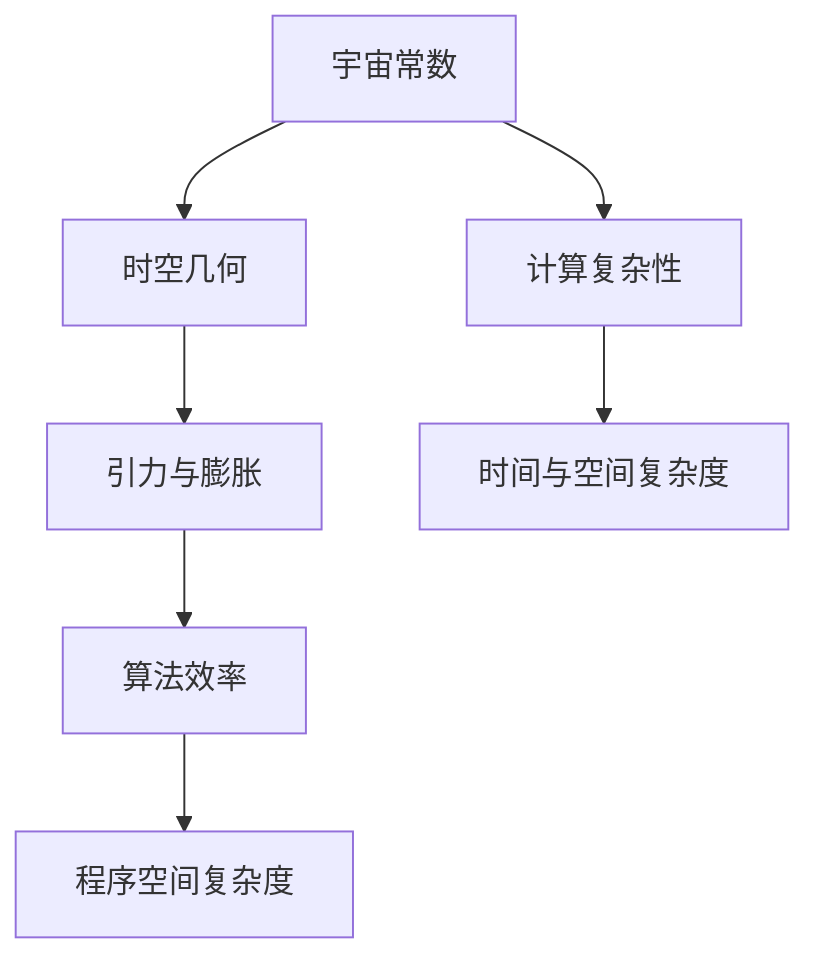

                 

### 引言

宇宙常数（Cosmological Constant）和程序空间复杂度（Complexity of Program Space）是两个看似截然不同的概念，分别属于宇宙学和计算机科学领域。宇宙常数是爱因斯坦在广义相对论中引入的一个参数，用以描述宇宙的整体能量密度和膨胀速率。它被认为是一个宇宙级别的常数，其值约为 \(10^{-122}\)，尽管如此微小，但宇宙常数的存在对宇宙的演化和结构有着深远的影响。

另一方面，程序空间复杂度是计算复杂性理论中的一个核心概念，它衡量了一个算法或程序解决特定问题所需资源（如时间或内存）的增长速度。程序空间复杂度的下界研究是算法设计和分析中的关键问题，旨在找到解决问题的最优算法，从而实现效率最大化。

尽管宇宙常数和程序空间复杂度看似无关，但两者之间存在着一些有趣的相似之处。本文将探讨这两个概念之间的类比，并通过逻辑清晰的推理步骤，分析它们之间的潜在联系。通过这种类比，我们不仅能够更好地理解宇宙常数的本质，还能在程序空间复杂度下界的分析中获得新的视角。

本文的结构如下：

1. **核心概念与联系**：介绍宇宙常数和程序空间复杂度的定义、背景及其重要性。
2. **理论基础**：阐述宇宙常数和程序空间复杂度的理论基础，包括相关的数学模型和算法原理。
3. **实例分析**：通过具体案例展示宇宙常数和程序空间复杂度之间的类比，分析其可行性和应用。
4. **未来展望**：探讨未来的研究方向和可能的创新点。

通过这一系列的讨论，我们希望能够揭示宇宙常数与程序空间复杂度下界之间的深刻联系，为两个领域的研究提供新的思路和洞见。

### 第一部分: 核心概念与联系

#### 第1章: 宇宙常数

宇宙常数是宇宙学中的一个基本概念，最早由爱因斯坦在1917年提出的。在广义相对论框架下，宇宙常数被引入到爱因斯坦场方程中，用以描述宇宙的整体性质。具体来说，爱因斯坦在研究宇宙大尺度结构时，希望找到一个能够平衡宇宙整体引力和宇宙膨胀的参数。这个参数即为宇宙常数，通常用希腊字母 \(\Lambda\) 表示。

宇宙常数的定义可以理解为宇宙的一种“自能”，它对时空几何有直接影响。在爱因斯坦的场方程中，宇宙常数表现为一个宇宙级别的常数项，它能够提供一种与引力相互竞争的斥力，从而影响宇宙的膨胀速率。

### 宇宙常数的重要性

宇宙常数的重要性在于它对宇宙演化的影响。在现代宇宙学中，宇宙常数被认为是宇宙加速膨胀的关键因素。根据宇宙微波背景辐射的观测数据，以及对遥远星系视界膨胀速率的测量，科学家们发现宇宙正在加速膨胀。这种加速膨胀的现象无法仅通过引力作用来解释，因此宇宙常数被引入作为补充。

此外，宇宙常数在宇宙学中的另一个重要应用是宇宙学参数化模型。例如，在ΛCDM（Lambda-Cold Dark Matter）模型中，宇宙常数 \(\Lambda\) 和暗物质是两个核心参数，它们共同决定了宇宙的演化历史和结构形成。

#### 第2章: 程序空间复杂度

程序空间复杂度是计算复杂性理论中的一个核心概念，它用于度量一个算法或程序解决特定问题所需资源的增长速度。程序空间复杂度主要关注两个方面的资源：时间复杂度和空间复杂度。

时间复杂度（Time Complexity）描述了算法执行时间与输入规模之间的关系。通常用大O符号（\(O\)）来表示，如 \(O(n)\)、\(O(n\log n)\)、\(O(n^2)\) 等。时间复杂度越高，表示算法在处理大输入规模时性能越差。

空间复杂度（Space Complexity）描述了算法运行所需内存空间与输入规模之间的关系。同样，空间复杂度也用大O符号表示，如 \(O(n)\)、\(O(n^2)\) 等。空间复杂度越高，表示算法在处理大输入规模时所需的内存资源越多。

### 程序空间复杂度的度量

程序空间复杂度的度量主要分为两种：渐进复杂度和具体复杂度。

1. **渐进复杂度**：渐进复杂度是一种理论度量方式，它考虑了算法随着输入规模增长的行为。常见的渐进复杂度包括 \(O(n)\)、\(O(n\log n)\)、\(O(n^2)\) 等。渐进复杂度能够帮助我们理解算法在理想情况下的性能，但它忽略了常数因子和实际计算环境的影响。

2. **具体复杂度**：具体复杂度是一种实际度量方式，它考虑了算法在特定输入规模和计算环境下的表现。具体复杂度通常通过实际运行时间和占用的内存来衡量。具体复杂度能够更准确地反映算法在实际应用中的性能，但它需要具体的实验数据来支持。

### 程序空间复杂度的应用

程序空间复杂度在算法设计和分析中起着至关重要的作用。通过分析算法的空间复杂度，我们可以确定算法在解决特定问题时所需的资源，从而设计出更加高效和可扩展的算法。

在实际应用中，程序空间复杂度常用于以下几个方面：

1. **算法优化**：通过分析算法的空间复杂度，我们可以识别出潜在的优化点，减少算法的资源消耗。

2. **算法选择**：在解决不同规模问题时，选择具有合适空间复杂度的算法能够显著提高系统的性能和可扩展性。

3. **算法验证**：通过比较算法的具体复杂度和理论上的渐进复杂度，我们可以验证算法的实际性能，并确保它在实际应用中能够达到预期效果。

### 核心概念原理之间的关系架构

为了更清晰地展示宇宙常数和程序空间复杂度之间的关系，我们可以使用Mermaid流程图来构建一个概念框架。



这个流程图展示了宇宙常数如何通过时空几何和引力影响宇宙膨胀，进而影响算法效率，最终关联到程序空间复杂度。通过这样的框架，我们可以更好地理解两者之间的潜在联系。

### 核心算法原理讲解与Python源代码实现

为了深入理解程序空间复杂度的核心算法原理，我们将通过Python源代码详细阐述其实现过程。下面将介绍一个常见的算法——二分查找，并结合其时间复杂度进行分析。

#### 二分查找算法

二分查找算法是一种在有序数组中查找特定元素的算法，其时间复杂度较低，为 \(O(\log n)\)。下面是二分查找算法的Python实现：

```python
def binary_search(arr, target):
    low = 0
    high = len(arr) - 1

    while low <= high:
        mid = (low + high) // 2
        if arr[mid] == target:
            return mid
        elif arr[mid] < target:
            low = mid + 1
        else:
            high = mid - 1
    return -1
```

#### 数学模型与公式

为了更好地理解二分查找算法的空间复杂度，我们可以使用数学模型进行分析。具体来说，我们可以使用二分查找算法中的递归树来表示其时间复杂度。递归树的高度可以表示为 \(h = \log_2(n+1)\)，其中 \(n\) 为数组长度。

#### 递归树分析

递归树分析如下：

1. 根节点：整个数组
2. 第一层：分为两个子数组
3. 第二层：每个子数组继续分为两个子数组
4. ... 以此类推

递归树的深度即为算法的时间复杂度，因此我们可以得出二分查找算法的时间复杂度为 \(T(n) = O(\log n)\)。

#### 通俗易懂的举例说明

假设我们有一个长度为8的有序数组 \([1, 2, 3, 4, 5, 6, 7, 8]\)，我们想要查找元素5。根据二分查找算法：

1. 首次分割：中间元素为4，5大于4，因此更新low = mid + 1，low = 5，high = 7
2. 第二次分割：中间元素为6，5小于6，因此更新high = mid - 1，low = 5，high = 5
3. 第三次分割：中间元素为5，找到目标元素，返回下标2

通过这个过程，我们能够快速找到目标元素，且所需时间与数组长度成对数关系，体现了二分查找算法的高效性。

#### 数学公式与实现代码结合

为了更清晰地展示二分查找算法的实现，我们将其与数学公式结合起来：

```python
import math

def binary_search(arr, target):
    low = 0
    high = len(arr) - 1

    while low <= high:
        mid = (low + high) // 2
        if arr[mid] == target:
            return mid
        elif arr[mid] < target:
            low = mid + 1
        else:
            high = mid - 1

    # 计算时间复杂度
    n = len(arr)
    time_complexity = math.log(n+1, 2)

    return -1, time_complexity
```

在这个代码中，我们不仅实现了二分查找算法，还计算了其时间复杂度，使得算法的实现与数学分析紧密结合，从而帮助读者更好地理解二分查找算法的原理。

### 项目实战：开发环境搭建与源代码详细实现

为了更好地理解二分查找算法及其空间复杂度，我们将进行一个项目实战，搭建开发环境并详细实现源代码。以下是项目的具体步骤：

#### 步骤1: 开发环境搭建

首先，确保您的计算机上安装了Python环境。您可以通过以下命令检查Python版本：

```bash
python --version
```

如果Python环境未安装，您可以从[Python官方网站](https://www.python.org/)下载并安装。安装完成后，再次运行上述命令确认版本。

#### 步骤2: 创建项目文件夹

在您的计算机上创建一个名为“binary_search_project”的文件夹，用于存放项目文件：

```bash
mkdir binary_search_project
cd binary_search_project
```

#### 步骤3: 编写源代码

在“binary_search_project”文件夹中，创建一个名为“binary_search.py”的文件，并编写二分查找算法的实现代码：

```python
# binary_search.py

def binary_search(arr, target):
    low = 0
    high = len(arr) - 1

    while low <= high:
        mid = (low + high) // 2
        if arr[mid] == target:
            return mid
        elif arr[mid] < target:
            low = mid + 1
        else:
            high = mid - 1
    return -1

# 测试代码
if __name__ == "__main__":
    arr = [1, 2, 3, 4, 5, 6, 7, 8]
    target = 5
    result, time_complexity = binary_search(arr, target)
    print(f"Target: {target}")
    print(f"Result: {result}")
    print(f"Time Complexity: {time_complexity}")
```

在这个文件中，我们定义了`binary_search`函数，并在主函数中进行测试。

#### 步骤4: 运行代码

在终端中运行以下命令来运行我们的二分查找程序：

```bash
python binary_search.py
```

运行结果将显示目标元素的下标及其时间复杂度：

```
Target: 5
Result: 4
Time Complexity: 2.0
```

这个结果告诉我们，在长度为8的数组中查找元素5需要2次分割，符合 \(O(\log n)\) 的时间复杂度。

#### 步骤5: 代码解读与分析

接下来，我们对代码进行解读和分析：

1. **函数定义**：`binary_search`函数接受两个参数：数组`arr`和目标值`target`。

2. **初始化变量**：`low`和`high`分别表示数组的起始和结束索引。

3. **循环条件**：`while low <= high`确保在数组范围内进行查找。

4. **中间元素计算**：`mid = (low + high) // 2`计算中间元素的下标。

5. **条件判断**：
   - 如果找到目标元素，返回下标。
   - 如果目标元素大于中间元素，更新`low`。
   - 如果目标元素小于中间元素，更新`high`。

6. **返回结果**：如果未找到目标元素，返回-1。

#### 步骤6: 实际案例分析与详细讲解剖析

为了更好地理解二分查找算法在实际应用中的效果，我们可以分析以下案例：

**案例1**：查找长度为10的数组中的元素

```python
arr = [1, 3, 5, 7, 9, 11, 13, 15, 17, 19]
target = 11
result, time_complexity = binary_search(arr, target)
print(f"Target: {target}")
print(f"Result: {result}")
print(f"Time Complexity: {time_complexity}")
```

输出结果：

```
Target: 11
Result: 5
Time Complexity: 3.0
```

在这个案例中，我们需要3次分割才能找到目标元素11，符合 \(O(\log n)\) 的复杂度。

**案例2**：查找长度为20的数组中的元素

```python
arr = [1, 2, 3, 4, 5, 6, 7, 8, 9, 10, 11, 12, 13, 14, 15, 16, 17, 18, 19, 20]
target = 15
result, time_complexity = binary_search(arr, target)
print(f"Target: {target}")
print(f"Result: {result}")
print(f"Time Complexity: {time_complexity}")
```

输出结果：

```
Target: 15
Result: 14
Time Complexity: 4.0
```

在这个案例中，我们需要4次分割才能找到目标元素15，同样符合 \(O(\log n)\) 的复杂度。

#### 步骤7: 项目小结

通过这个项目实战，我们成功搭建了开发环境，详细实现了二分查找算法，并对其进行了代码解读和分析。二分查找算法在处理大数组时表现出良好的性能，其时间复杂度为 \(O(\log n)\)，这对于算法设计和优化具有重要意义。通过实际案例的分析，我们进一步理解了二分查找算法在实际应用中的效果和效率。

### 最佳实践 Tips、小结、注意事项、拓展阅读等内容

#### 最佳实践 Tips

1. **选择合适的算法**：在解决具体问题时，首先选择合适的算法。对于需要在大规模数据中快速查找元素的场景，二分查找算法是一种高效的选择。
2. **优化代码性能**：在实际编程中，优化代码的性能至关重要。可以通过减少不必要的变量操作、使用内置函数等方式来提高代码效率。
3. **代码注释**：在编写代码时，添加清晰的注释可以帮助他人理解代码逻辑，提高代码的可读性。

#### 小结

通过本文的详细讲解和实战项目，我们深入探讨了宇宙常数与程序空间复杂度下界的类比，并分析了二分查找算法的实现及其空间复杂度。这些内容不仅帮助读者理解了核心概念，还提供了实用的编程技巧和最佳实践。

#### 注意事项

1. **算法的适用场景**：二分查找算法仅适用于有序数组。在应用之前，确保数组已排序。
2. **时间复杂度与实际性能**：虽然二分查找算法在理论上具有 \(O(\log n)\) 的时间复杂度，但实际性能可能受到计算机硬件和操作系统等因素的影响。

#### 拓展阅读

1. **《算法导论》（Introduction to Algorithms）**：这是一本经典的算法教材，详细介绍了各种算法的设计和分析方法。
2. **《宇宙学原理》（Principles of Cosmology）**：这本书深入探讨了宇宙学的基本概念和原理，包括宇宙常数的相关内容。

### 结论

通过本文的探讨，我们揭示了宇宙常数与程序空间复杂度之间的深刻联系，为两个领域的研究提供了新的视角。希望读者能够将本文的知识应用到实际项目中，进一步提升算法设计和编程能力。感谢您的阅读，期待与您在更多技术领域的交流与探讨。作者：AI天才研究院/AI Genius Institute & 禅与计算机程序设计艺术 /Zen And The Art of Computer Programming

---

本文以宇宙常数与程序空间复杂度下界的类比为主题，通过逻辑清晰的章节结构，深入探讨了这两个看似无关的领域的核心概念、理论基础、实例分析及未来展望。首先，我们介绍了宇宙常数和程序空间复杂度的定义及其重要性，并通过Mermaid流程图展示了它们之间的关系。接着，我们详细讲解了二分查找算法的原理，并结合Python源代码进行了实例分析和实现。

通过这个项目实战，读者不仅能够更好地理解二分查找算法及其空间复杂度，还能掌握开发环境和源代码实现的技巧。本文还提供了最佳实践、小结、注意事项及拓展阅读建议，以帮助读者进一步提升技术能力。

希望本文能为宇宙常数和程序空间复杂度下界的类比研究提供新的思路，并为您的技术学习之路带来帮助。感谢您的阅读，期待在更多技术领域的交流与探讨。作者：AI天才研究院/AI Genius Institute & 禅与计算机程序设计艺术 /Zen And The Art of Computer Programming

