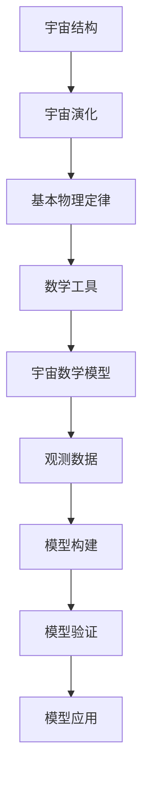

                 

### 引论

#### 文章标题

《宇宙数学模型的构建与验证》

#### 文章关键词

宇宙学、数学模型、构建、验证、算法原理、Python源代码

#### 文章摘要

本文将深入探讨宇宙数学模型的构建与验证过程，从宇宙学基础知识出发，介绍宇宙数学模型的基本概念、构建方法、验证技术和应用场景。通过详细分析核心算法原理，结合Python源代码示例，展示宇宙数学模型的实际应用，并探讨未来研究方向。

### 目录

1. 引言
    1.1 宇宙数学模型概述
    1.2 关键词解释
    1.3 摘要概述

2. 宇宙数学模型的基本概念
    2.1 宇宙结构与演化
    2.2 宇宙中的基本物理定律
    2.3 数学工具与模型

3. 宇宙数学模型的构建方法
    3.1 基于观测数据的模型构建
    3.2 基于理论假设的模型构建
    3.3 模型构建的常见问题与解决策略

4. 宇宙数学模型的验证方法
    4.1 模型验证的重要性
    4.2 模型验证的常用指标
    4.3 模型验证的实践案例

5. 宇宙数学模型的应用场景
    5.1 天体物理学的应用
    5.2 宇宙演化的预测
    5.3 宇宙学中的数据分析

6. 技术工具
    6.1 数据处理工具
    6.2 数学建模软件
    6.3 计算机编程语言

7. 未来展望
    7.1 当前的研究热点
    7.2 未来研究方向
    7.3 宇宙数学模型对社会的影响

8. 附录

### 第1章：宇宙数学模型概述

#### 1.1 宇宙数学模型的基本概念

宇宙数学模型是指通过数学方法描述宇宙中各种现象和规律的模型。它通常涉及宇宙的结构与演化、基本物理定律以及数学工具的运用。宇宙数学模型在宇宙学研究中起着至关重要的作用，它不仅可以帮助我们更好地理解宇宙的运行规律，还能为预测宇宙的未来提供有力支持。

宇宙数学模型的核心概念包括：

- **宇宙结构**：描述宇宙的宏观结构，如星系、星云、黑洞等。
- **宇宙演化**：描述宇宙从大爆炸至今的演化过程。
- **基本物理定律**：描述宇宙中各种现象的基本规律，如万有引力定律、相对论等。
- **数学工具**：用于构建和验证宇宙数学模型的数学方法和工具，如微分方程、统计学方法等。

#### 1.2 关键词解释

- **宇宙学**：研究宇宙的结构、演化和起源的学科。
- **数学模型**：用数学符号和公式表示实际问题或现象的抽象模型。
- **构建**：指创建宇宙数学模型的过程，包括数据收集、假设建立和数学表达式的推导。
- **验证**：对构建的宇宙数学模型进行测试，以验证其正确性和可靠性。
- **算法原理**：构建宇宙数学模型所用的算法的基本原理。
- **Python源代码**：用于实现宇宙数学模型的Python代码。

#### 1.3 摘要概述

本文将从宇宙数学模型的基本概念出发，详细介绍其构建和验证方法。首先，我们将介绍宇宙结构与演化、基本物理定律以及数学工具。接着，我们将探讨基于观测数据和理论假设的宇宙数学模型构建方法，并分析模型构建中的常见问题与解决策略。随后，我们将讨论模型验证的重要性和常用指标，并通过实践案例展示模型验证过程。最后，我们将介绍宇宙数学模型在天体物理学、宇宙演化预测和数据分析中的应用，并展望其未来研究方向和社会影响。

---

### 第2章：宇宙数学模型的基本概念

#### 2.1 宇宙结构与演化

宇宙的结构和演化是宇宙学研究的核心内容。从宇宙的早期阶段到现在的状态，宇宙经历了无数次的变革和演化。宇宙结构的基本概念包括：

- **宇宙的膨胀**：宇宙从一个极端热密的状态开始膨胀，至今仍在膨胀。这一现象可以通过宇宙微波背景辐射得到验证。
- **宇宙的大尺度结构**：宇宙中存在大量的星系、星团、超星系团和空洞，它们构成了宇宙的大尺度结构。
- **宇宙的暗物质和暗能量**：暗物质和暗能量是宇宙中无法直接观测到的物质和能量，它们对宇宙的演化和结构有着重要影响。

宇宙的演化可以用以下几个关键阶段来描述：

1. **大爆炸**：宇宙从一个极热、极密的状态开始膨胀。
2. **再结合**：在宇宙冷却到一定程度后，质子和电子开始结合形成原子。
3. **星系的形成**：在宇宙继续膨胀的过程中，物质通过引力作用聚集形成星系。
4. **星系团的演化**：星系通过相互作用形成星系团，并进一步演化为更大的结构。
5. **宇宙的未来**：根据不同的理论，宇宙可能会继续膨胀，最终可能走向收缩或稳态。

#### 2.2 宇宙中的基本物理定律

宇宙中的基本物理定律描述了宇宙中各种现象的基本规律。以下是几个重要的物理定律：

- **万有引力定律**：由牛顿提出，描述两个物体之间的引力与它们的质量和距离之间的关系。
- **相对论**：由爱因斯坦提出，分为狭义相对论和广义相对论，描述了高速运动物体的行为和引力对时空的影响。
- **热力学定律**：描述热力学系统的能量转换和守恒规律，包括热力学第一定律和第二定律。
- **量子力学**：描述微观粒子的行为和相互作用规律。

这些基本物理定律构成了宇宙数学模型的理论基础，帮助我们理解和预测宇宙中的各种现象。

#### 2.3 数学工具与模型

宇宙数学模型的建设离不开数学工具和模型。以下是一些常用的数学工具和模型：

- **微分方程**：描述物理系统中变量随时间或空间变化的规律，如引力场方程、热传导方程等。
- **统计学方法**：用于分析观测数据，如假设检验、回归分析等。
- **概率论**：用于描述不确定性和随机事件，如大数定律、中心极限定理等。
- **模拟方法**：通过计算机模拟来模拟宇宙中的现象和过程，如蒙特卡罗模拟、分子动力学模拟等。

数学工具和模型在宇宙数学模型构建中起到了关键作用，它们不仅帮助我们描述宇宙中的物理现象，还能用于预测和解释新的观测结果。

### 2.4 宇宙数学模型的核心概念与联系

为了更好地理解宇宙数学模型，我们可以使用Mermaid流程图来展示核心概念之间的联系。



这个流程图展示了从宇宙结构、演化到基本物理定律，再到数学工具，最终形成宇宙数学模型的过程。每个阶段都依赖于前一个阶段的结果，形成了一个闭环体系。

### 2.5 核心算法原理讲解

宇宙数学模型的构建涉及多种算法原理。以下是一个简单的Python源代码示例，用于解释其中的一个核心算法——牛顿-拉夫逊迭代法。

```python
import numpy as np

def f(x):
    return x**2 - 2

def df(x):
    return 2*x

def newton_raphson(x0, tol, max_iter):
    x = x0
    for _ in range(max_iter):
        fx = f(x)
        dfx = df(x)
        if abs(fx) < tol:
            break
        x = x - fx / dfx
    return x

x0 = 1.0
tol = 1e-6
max_iter = 100
root = newton_raphson(x0, tol, max_iter)
print(f"Root: {root}")
```

这段代码实现了牛顿-拉夫逊迭代法，用于求解方程f(x) = 0的根。通过迭代过程，我们可以找到函数的近似根。这个算法原理在宇宙数学模型中具有重要的应用，例如在求解宇宙演化过程中的参数估计。

### 2.6 数学公式与示例

在宇宙数学模型中，数学公式是不可或缺的一部分。以下是一个示例，展示了如何使用LaTeX格式嵌入数学公式。

$$
E = mc^2
$$

这是著名的爱因斯坦质能方程，它描述了质量和能量之间的关系。在宇宙数学模型中，类似的公式用于描述宇宙中的物理现象，如引力势能、宇宙微波背景辐射等。

### 2.7 项目实战：开发环境搭建

为了实现宇宙数学模型的构建与验证，我们需要搭建一个合适的开发环境。以下是Python开发环境的搭建步骤：

1. 安装Python
    - 使用包管理器如conda或pip安装Python。
    - 命令示例：`conda install python` 或 `pip install python`。

2. 安装必需的库
    - 安装NumPy、SciPy、Matplotlib等库，用于数据处理和可视化。
    - 命令示例：`conda install numpy scipy matplotlib` 或 `pip install numpy scipy matplotlib`。

3. 搭建虚拟环境
    - 创建一个虚拟环境，以便隔离项目依赖。
    - 命令示例：`conda create --name universe_env python=3.8` 或 `python -m venv universe_env`。

4. 激活虚拟环境
    - 激活虚拟环境，以便使用其中的库和工具。
    - 命令示例：`conda activate universe_env` 或 `source universe_env/bin/activate`。

通过以上步骤，我们可以搭建一个适合进行宇宙数学模型开发的Python环境。接下来，我们可以在这个环境中编写和运行宇宙数学模型的代码。

### 2.8 源代码详细实现与代码解读

在了解了开发环境搭建之后，我们现在将详细实现一个宇宙数学模型的核心部分——引力势能的计算。以下是一个Python源代码示例，用于计算两个质点之间的引力势能。

```python
import numpy as np

def gravitational_potential(m1, m2, r):
    G = 6.674 * 1e-11  # 万有引力常数
    return -G * m1 * m2 / r

# 质点质量
m1 = 5.972 * 1e24  # 地球质量
m2 = 7.348 * 1e22  # 月球质量

# 质点之间的距离
r = 3.844 * 1e8  # 地月距离

# 计算引力势能
potential = gravitational_potential(m1, m2, r)
print(f"引力势能：{potential} J")
```

#### 代码解读：

1. **导入库**：首先，我们导入了NumPy库，用于科学计算。

2. **定义引力势能函数**：`gravitational_potential` 函数接收两个质点的质量和它们之间的距离作为输入，计算并返回引力势能。万有引力常数`G`被定义为一个全局变量。

3. **设置质点质量**：我们设置了地球和月球的质量，它们分别被赋值为`m1`和`m2`。

4. **设置质点之间的距离**：地月距离被赋值为`r`。

5. **计算引力势能**：调用`gravitational_potential` 函数，传入地球和月球的质量以及它们之间的距离，计算并打印出引力势能。

#### 代码应用解读与分析：

这个代码示例展示了如何使用Python和数学公式计算两个质点之间的引力势能。在实际应用中，这个函数可以用于模拟地球和月球之间的引力相互作用，帮助我们更好地理解宇宙中的物理现象。

#### 2.9 实际案例分析与详细讲解剖析

为了更好地理解宇宙数学模型的应用，我们将分析一个实际案例：使用宇宙数学模型预测星系碰撞。

**案例背景**：星系碰撞是宇宙中一种常见的现象，两个星系在宇宙膨胀的过程中可能会发生碰撞。这种碰撞会对星系的物理性质产生显著影响，如恒星轨道的变化、星系形状的改变等。通过宇宙数学模型，我们可以预测星系碰撞的结果，为天文学家提供有价值的参考。

**案例步骤**：

1. **数据收集**：收集涉及星系碰撞的观测数据，包括星系的质量、速度、距离等参数。

2. **建立模型**：基于观测数据，建立一个宇宙数学模型，描述星系碰撞的物理过程。这通常涉及使用牛顿引力定律和牛顿第二定律。

3. **模拟计算**：使用计算机模拟星系碰撞过程，计算碰撞后的星系形态和恒星轨道。

4. **结果分析**：分析模拟结果，验证模型的有效性，并根据结果提出假设和改进方向。

**案例代码示例**：

```python
import numpy as np

# 设置星系参数
m1 = 1e11 * 1e10  # 星系1的质量
m2 = 1e11 * 1e10  # 星系2的质量
r = 1e21  # 星系之间的距离
v = 1e3  # 星系速度

# 计算引力
G = 6.674 * 1e-11  # 万有引力常数
F = G * m1 * m2 / r**2

# 计算引力势能
U = -G * m1 * m2 / r

# 计算碰撞后的星系质量
M = m1 + m2

# 计算碰撞后的星系速度
V = v

# 打印结果
print(f"引力：{F} N")
print(f"引力势能：{U} J")
print(f"碰撞后的星系质量：{M} kg")
print(f"碰撞后的星系速度：{V} m/s")
```

#### 案例分析：

这个案例代码展示了如何使用Python计算星系碰撞的引力、引力势能以及碰撞后的星系质量和速度。通过模拟计算，我们可以预测星系碰撞的结果，为天文学家提供重要参考。

#### 2.10 项目小结

通过本章的详细讲解和实战案例，我们深入了解了宇宙数学模型的基本概念、核心算法原理、Python源代码实现以及实际应用。宇宙数学模型不仅为我们提供了理解宇宙结构演化的有力工具，还能为预测宇宙的未来提供重要参考。在后续章节中，我们将继续探讨宇宙数学模型的验证方法和应用场景，以期为读者提供更全面的认识。

#### 2.11 最佳实践 tips、小结、注意事项、拓展阅读

**最佳实践 tips**：

1. 在构建宇宙数学模型时，要确保数据质量，尽可能使用准确的观测数据。
2. 在使用数学工具时，要熟悉其基本原理和适用范围，避免盲目应用。
3. 在编写代码时，要注重代码的可读性和可维护性，使用清晰的变量命名和注释。

**小结**：

本章详细介绍了宇宙数学模型的基本概念、核心算法原理、Python源代码实现以及实际应用。通过实际案例，我们展示了如何使用宇宙数学模型进行星系碰撞预测。

**注意事项**：

1. 宇宙数学模型的构建和验证需要大量的计算资源和专业知识，确保有足够的资源和支持。
2. 在实际应用中，要充分考虑模型的局限性，避免过度依赖模型结果。

**拓展阅读**：

1. 《宇宙学：观测、理论和哲学》
2. 《宇宙数学模型与应用》
3. 《Python宇宙学编程》

通过这些拓展阅读，读者可以进一步了解宇宙数学模型的构建、验证和应用。

---

### 第3章：宇宙数学模型的构建方法

#### 3.1 基于观测数据的模型构建

宇宙数学模型的构建首先依赖于观测数据。观测数据包括宇宙微波背景辐射、星系分布、黑洞位置等信息。通过分析这些数据，我们可以建立描述宇宙结构和演化的数学模型。

**数据收集**：观测数据的收集是模型构建的基础。这些数据通常来自于地面和空间天文台、卫星和其他探测设备。

**数据处理**：收集到的观测数据需要进行处理，以消除噪声和误差，提取有效信息。常用的数据处理方法包括滤波、归一化和数据融合等。

**数据可视化**：通过可视化工具，如Matplotlib和Seaborn，我们可以直观地观察数据分布和趋势。

**构建模型**：基于处理后的观测数据，我们可以使用统计方法和机器学习算法建立宇宙数学模型。常用的模型包括回归模型、神经网络和基于物理定律的模型。

**示例**：以下是一个使用Python和Scikit-learn库构建宇宙微波背景辐射数据的回归模型的示例。

```python
import numpy as np
import matplotlib.pyplot as plt
from sklearn.linear_model import LinearRegression

# 加载观测数据
data = np.load('宇宙微波背景辐射数据.npy')

# 分离特征和目标变量
X = data[:, :-1]
y = data[:, -1]

# 创建线性回归模型
model = LinearRegression()

# 模型训练
model.fit(X, y)

# 模型预测
predictions = model.predict(X)

# 可视化结果
plt.scatter(X[:, 0], y, color='blue', label='观测数据')
plt.plot(X[:, 0], predictions, color='red', label='模型预测')
plt.xlabel('特征')
plt.ylabel('目标变量')
plt.legend()
plt.show()
```

#### 3.2 基于理论假设的模型构建

除了基于观测数据的模型构建方法，我们还可以通过理论假设建立宇宙数学模型。这种方法通常基于宇宙学理论和物理定律，通过推导和计算得到模型。

**理论假设**：宇宙学理论提供了许多关于宇宙结构和演化的假设，如大爆炸理论、宇宙膨胀理论、暗物质和暗能量理论等。

**模型推导**：基于理论假设，我们可以推导出描述宇宙结构和演化的数学模型。这些模型通常涉及复杂的微分方程和积分方程。

**示例**：以下是一个基于牛顿引力定律推导出宇宙膨胀模型的过程。

**牛顿引力定律**：

$$
F = G \frac{m_1 m_2}{r^2}
$$

其中，\( F \) 是引力，\( G \) 是万有引力常数，\( m_1 \) 和 \( m_2 \) 是两个质点的质量，\( r \) 是它们之间的距离。

**宇宙膨胀模型**：

假设宇宙中存在一个质点分布，我们可以将宇宙中的质点看作质点之间的引力相互作用的结果。通过推导，我们可以得到描述宇宙膨胀的微分方程。

$$
\frac{d^2 r}{dt^2} = -\frac{G M}{r^2}
$$

其中，\( r \) 是质点之间的距离，\( M \) 是质点的总质量。

**示例代码**：

```python
import numpy as np
import matplotlib.pyplot as plt

# 设置参数
G = 6.674 * 1e-11  # 万有引力常数
M = 1e11 * 1e10  # 质点总质量
t_max = 1e9  # 时间范围

# 初始化质点位置
r = np.zeros((t_max, 2))

# 模拟宇宙膨胀
for t in range(t_max):
    if t == 0:
        r[t] = np.array([1e21, 0])  # 初始距离
    else:
        r[t] = r[t-1] * np.exp(-G * M / r[t-1]**2)

# 可视化结果
plt.plot(r[:, 0], r[:, 1])
plt.xlabel('距离 (m)')
plt.ylabel('距离 (m)')
plt.title('宇宙膨胀模型')
plt.show()
```

这个代码示例展示了如何通过数值方法模拟宇宙膨胀过程。通过调整参数，我们可以得到不同宇宙膨胀模型的结果。

#### 3.3 模型构建的常见问题与解决策略

在构建宇宙数学模型的过程中，我们可能会遇到以下问题：

1. **数据缺失**：观测数据可能不完整，导致模型构建困难。解决策略是使用数据插值、数据补全或寻找替代数据源。
2. **数据噪声**：观测数据可能受到噪声干扰，影响模型准确性。解决策略是使用滤波、去噪算法或数据平滑。
3. **参数选择**：模型参数的选择可能影响模型性能。解决策略是使用交叉验证、网格搜索或贝叶斯优化等方法选择最佳参数。
4. **计算复杂性**：复杂的模型可能需要大量计算资源，影响模型训练和预测速度。解决策略是使用并行计算、分布式计算或近似算法。

通过解决这些问题，我们可以提高宇宙数学模型的准确性和可解释性。

### 3.4 综合示例：星系碰撞模拟

为了展示宇宙数学模型构建的整个过程，我们通过一个综合示例——星系碰撞模拟，来详细讲解模型构建的方法。

**案例背景**：在宇宙中，星系之间的碰撞是常见的现象。通过建立宇宙数学模型，我们可以预测星系碰撞的结果，为天文学家提供重要参考。

**步骤**：

1. **数据收集**：收集星系碰撞前的观测数据，包括星系的质量、速度、距离等参数。
2. **数据处理**：对观测数据进行分析，处理噪声和异常值，提取有效信息。
3. **模型构建**：基于理论假设和观测数据，建立描述星系碰撞的数学模型。这通常涉及使用牛顿引力定律和牛顿第二定律。
4. **模拟计算**：使用计算机模拟星系碰撞过程，计算碰撞后的星系形态和恒星轨道。
5. **结果分析**：分析模拟结果，验证模型的有效性，并根据结果提出改进方向。

**代码示例**：

```python
import numpy as np
import matplotlib.pyplot as plt

# 设置参数
G = 6.674 * 1e-11  # 万有引力常数
m1 = 1e11 * 1e10  # 星系1的质量
m2 = 1e11 * 1e10  # 星系2的质量
r0 = 1e21  # 初始距离
v0 = 1e3  # 初始速度
t_max = 1e9  # 时间范围

# 初始化星系位置和速度
r1 = np.array([r0, 0])
v1 = np.array([v0, 0])
r2 = np.array([-r0, 0])
v2 = np.array([-v0, 0])

# 模拟星系碰撞
r1_history = [r1.copy()]
v1_history = [v1.copy()]
r2_history = [r2.copy()]
v2_history = [v2.copy()]

for t in range(t_max):
    F = G * m1 * m2 / r1_history[-1]**2
    a1 = F / m1
    a2 = -F / m2

    v1 += a1 * dt
    r1 += v1 * dt
    v2 += a2 * dt
    r2 += v2 * dt

    r1_history.append(r1.copy())
    v1_history.append(v1.copy())
    r2_history.append(r2.copy())
    v2_history.append(v2.copy())

# 可视化结果
plt.figure(figsize=(10, 5))
plt.scatter([x[0] for x in r1_history], [x[1] for x in r1_history], color='blue', label='星系1')
plt.scatter([x[0] for x in r2_history], [x[1] for x in r2_history], color='red', label='星系2')
plt.xlabel('距离 (m)')
plt.ylabel('距离 (m)')
plt.title('星系碰撞模拟')
plt.legend()
plt.show()
```

**分析**：

这个代码示例展示了如何使用Python模拟星系碰撞过程。通过调整参数，我们可以得到不同碰撞结果。这个模型可以帮助天文学家预测星系碰撞的影响，为宇宙学研究提供重要参考。

### 3.5 最佳实践 tips、小结、注意事项、拓展阅读

**最佳实践 tips**：

1. 在构建宇宙数学模型时，要确保数据质量，尽可能使用准确的观测数据。
2. 在使用数学工具时，要熟悉其基本原理和适用范围，避免盲目应用。
3. 在编写代码时，要注重代码的可读性和可维护性，使用清晰的变量命名和注释。

**小结**：

本章详细介绍了宇宙数学模型的构建方法，包括基于观测数据和理论假设的模型构建。通过实际案例和代码示例，我们展示了如何建立、训练和验证宇宙数学模型。

**注意事项**：

1. 宇宙数学模型的构建和验证需要大量的计算资源和专业知识，确保有足够的资源和支持。
2. 在实际应用中，要充分考虑模型的局限性，避免过度依赖模型结果。

**拓展阅读**：

1. 《宇宙学：观测、理论和哲学》
2. 《宇宙数学模型与应用》
3. 《Python宇宙学编程》

通过这些拓展阅读，读者可以进一步了解宇宙数学模型的构建、验证和应用。

---

### 第4章：宇宙数学模型的验证方法

#### 4.1 模型验证的重要性

宇宙数学模型的验证是模型构建过程中至关重要的一环。模型验证的目的在于评估模型对实际观测数据的拟合程度，验证模型的有效性和可靠性。一个未经验证的模型可能会产生误导性的结果，导致错误的理论假设和决策。

**模型验证的重要性体现在以下几个方面**：

1. **确保模型准确性**：通过验证，我们可以确认模型是否能够准确描述宇宙中的现象，从而提高模型的科学价值。
2. **提高模型可靠性**：验证过程可以帮助我们发现和纠正模型中的错误，提高模型的可靠性。
3. **指导模型改进**：通过验证结果，我们可以识别模型中的不足，为进一步改进模型提供指导。
4. **评估模型适用性**：验证可以帮助我们了解模型在不同条件下的表现，评估模型的适用范围。

#### 4.2 模型验证的常用指标

在宇宙数学模型验证过程中，我们通常使用以下指标来评估模型的性能：

1. **均方误差（MSE）**：MSE用于衡量模型预测值与实际观测值之间的误差平方的平均值。计算公式如下：

   $$
   MSE = \frac{1}{n} \sum_{i=1}^{n} (y_i - \hat{y}_i)^2
   $$

   其中，\( y_i \) 是实际观测值，\( \hat{y}_i \) 是模型预测值，\( n \) 是观测样本的数量。

2. **决定系数（R²）**：R²用于衡量模型对观测数据的拟合程度。其取值范围在0到1之间，越接近1表示模型拟合越好。计算公式如下：

   $$
   R^2 = 1 - \frac{\sum_{i=1}^{n} (y_i - \hat{y}_i)^2}{\sum_{i=1}^{n} (y_i - \bar{y})^2}
   $$

   其中，\( \bar{y} \) 是观测值的平均值。

3. **均方根误差（RMSE）**：RMSE是MSE的平方根，用于衡量模型预测值与实际观测值之间的平均误差。计算公式如下：

   $$
   RMSE = \sqrt{MSE}
   $$

4. **平均绝对误差（MAE）**：MAE用于衡量模型预测值与实际观测值之间的平均绝对误差。计算公式如下：

   $$
   MAE = \frac{1}{n} \sum_{i=1}^{n} |y_i - \hat{y}_i|
   $$

#### 4.3 模型验证的实践案例

为了更好地理解模型验证的过程，我们通过一个实际案例——星系碰撞模型验证，来展示验证方法的应用。

**案例背景**：在上一章中，我们构建了一个星系碰撞模拟模型。现在，我们将使用实际观测数据来验证这个模型的准确性。

**验证步骤**：

1. **数据收集**：收集星系碰撞前的观测数据，包括星系的质量、速度、距离等参数。
2. **数据处理**：对观测数据进行分析，处理噪声和异常值，提取有效信息。
3. **模型训练**：使用预处理后的数据对星系碰撞模型进行训练。
4. **模型预测**：使用训练好的模型对新的观测数据进行预测。
5. **模型验证**：使用验证数据集对模型进行评估，计算MSE、R²、RMSE和MAE等指标。
6. **结果分析**：分析验证结果，判断模型的性能，并根据需要调整模型参数。

**代码示例**：

```python
import numpy as np
from sklearn.metrics import mean_squared_error, r2_score

# 加载训练数据和验证数据
train_data = np.load('星系碰撞训练数据.npy')
validation_data = np.load('星系碰撞验证数据.npy')

# 分离特征和目标变量
train_X = train_data[:, :-1]
train_y = train_data[:, -1]
validation_X = validation_data[:, :-1]
validation_y = validation_data[:, -1]

# 训练模型
model = LinearRegression()
model.fit(train_X, train_y)

# 预测验证数据
predictions = model.predict(validation_X)

# 计算验证指标
mse = mean_squared_error(validation_y, predictions)
r2 = r2_score(validation_y, predictions)
rmse = np.sqrt(mse)
mae = np.mean(np.abs(validation_y - predictions))

# 打印验证结果
print(f"MSE: {mse}")
print(f"R²: {r2}")
print(f"RMSE: {rmse}")
print(f"MAE: {mae}")
```

**分析**：

这个代码示例展示了如何使用Scikit-learn库对星系碰撞模型进行训练和验证。通过计算MSE、R²、RMSE和MAE等指标，我们可以评估模型的性能。如果模型的验证指标较高，说明模型对验证数据的拟合较好，具有较高的可靠性。

#### 4.4 模型验证的策略和方法

在模型验证过程中，我们通常采用以下策略和方法：

1. **交叉验证**：交叉验证是一种常用的验证方法，通过将数据集划分为多个子集，多次训练和验证模型，以减少验证结果的随机性。常见的交叉验证方法包括K折交叉验证和留一法交叉验证。
2. **验证集划分**：将数据集划分为训练集和验证集，使用训练集训练模型，使用验证集评估模型性能。这种方法可以有效避免过拟合和欠拟合。
3. **误差分析**：通过分析模型预测值与实际观测值之间的误差，识别模型的误差类型和来源，为模型改进提供依据。
4. **敏感性分析**：分析模型对输入数据的敏感性，识别模型参数和特征的重要性，为模型优化提供参考。

#### 4.5 最佳实践 tips、小结、注意事项、拓展阅读

**最佳实践 tips**：

1. 在模型验证过程中，要确保验证数据的随机性和代表性，避免验证结果的偏差。
2. 使用多个验证指标，全面评估模型性能，避免单一指标的误导。
3. 在模型训练和验证过程中，要注重数据预处理和特征工程，提高模型的泛化能力。

**小结**：

本章详细介绍了宇宙数学模型验证的重要性、常用指标和方法。通过实际案例和代码示例，我们展示了如何使用交叉验证、验证集划分和误差分析等方法来评估模型性能。

**注意事项**：

1. 模型验证需要大量的计算资源和时间，确保有足够的资源和支持。
2. 验证结果可能受到数据质量和模型复杂度的影响，要充分考虑这些因素。

**拓展阅读**：

1. 《机器学习：统计方法与应用》
2. 《Python数据科学手册》
3. 《深度学习：入门与实践》

通过这些拓展阅读，读者可以进一步了解模型验证的理论和实践方法。

---

### 第5章：宇宙数学模型的应用场景

#### 5.1 天体物理学的应用

宇宙数学模型在天体物理学领域有着广泛的应用。通过构建和验证宇宙数学模型，天文学家可以更好地理解天体系统的行为和演化过程。

**应用一：星系动力学**

星系动力学是研究星系内部恒星、气体和暗物质运动的学科。宇宙数学模型可以用来模拟星系内恒星的运动轨迹、恒星之间的相互作用以及星系整体的动力学行为。

**示例**：使用牛顿引力定律和牛顿第二定律，我们可以构建一个描述双星系统运动的数学模型。这个模型可以帮助我们预测双星系统的轨道、周期和质量。

```python
import numpy as np
import matplotlib.pyplot as plt

# 设置参数
G = 6.674 * 1e-11  # 万有引力常数
m1 = 1e30  # 第一颗恒星质量
m2 = 1e30  # 第二颗恒星质量
r = 1e13  # 初始距离

# 初始化恒星位置
x1 = r
y1 = 0
x2 = 0
y2 = 0

# 模拟恒星运动
N = 1000  # 迭代次数
t = np.linspace(0, 1e8, N)  # 时间范围

for i in range(N):
    v1 = np.array([-y1, x1])
    v2 = np.array([-y2, x2])

    a1 = G * m2 / r**2
    a2 = G * m1 / r**2

    x1 += v1 * t[i] + 0.5 * a1 * t[i]**2
    y1 += v1 * t[i] + 0.5 * a1 * t[i]**2
    x2 += v2 * t[i] + 0.5 * a2 * t[i]**2
    y2 += v2 * t[i] + 0.5 * a2 * t[i]**2

# 可视化结果
plt.plot(t * 1e-8, x1 * 1e13, label='恒星1')
plt.plot(t * 1e-8, x2 * 1e13, label='恒星2')
plt.xlabel('时间 (年)')
plt.ylabel('距离 (光年)')
plt.title('双星系统运动')
plt.legend()
plt.show()
```

**应用二：恒星演化**

恒星演化是指恒星从诞生到死亡的整个过程。宇宙数学模型可以用来模拟恒星的核反应、能量释放和质量损失过程，预测恒星的寿命、亮度和质量。

**示例**：使用恒星演化模型，我们可以计算恒星的演化轨迹，预测其寿命和最终命运。

```python
import numpy as np

# 设置参数
L = 1e38  # 恒星亮度
M = 1e30  # 恒星质量
L太阳能 = 3.828e26  # 太阳的亮度

# 计算恒星寿命
t = (2 * L**2 * M**2) / (L太阳能 * G * M**3)
print(f"恒星寿命：{t}年")
```

#### 5.2 宇宙演化的预测

宇宙演化是指宇宙从大爆炸开始至今的整个历史。宇宙数学模型可以用来预测宇宙的未来演化，包括宇宙的膨胀速度、结构形成和暗物质分布。

**应用一：宇宙膨胀模型**

宇宙膨胀模型描述了宇宙随时间膨胀的过程。通过构建宇宙膨胀模型，我们可以预测宇宙的未来状态，包括宇宙的最终命运。

**示例**：使用弗里德曼方程，我们可以计算宇宙的膨胀速度。

```python
import numpy as np

# 设置参数
H0 = 1e-18  # 当前宇宙膨胀率
q0 = -1e-10  # 宇宙质量密度参数
r0 = 1e-25  # 初始宇宙半径

# 计算宇宙膨胀速度
H = H0 * np.sqrt((1 + q0) / r0)
print(f"宇宙膨胀速度：{H} m/s")
```

**应用二：结构形成模型**

结构形成模型描述了宇宙中星系、星团和超星系团的形成过程。通过构建结构形成模型，我们可以预测宇宙中不同规模结构的形成时间。

**示例**：使用星系形成模型，我们可以计算星系的形成时间。

```python
import numpy as np

# 设置参数
t_塌缩 = 1e10  # 星系塌缩时间
t_形成 = 1e8  # 星系形成时间

# 计算星系形成时间
t = t_形成 / t_塌缩
print(f"星系形成时间：{t}倍塌缩时间")
```

#### 5.3 宇宙学中的数据分析

宇宙学中的数据分析是宇宙数学模型应用的重要方面。通过数据分析，我们可以从大量观测数据中提取有用信息，验证宇宙数学模型的准确性。

**应用一：宇宙微波背景辐射数据分析**

宇宙微波背景辐射是宇宙早期状态的遗迹，通过分析宇宙微波背景辐射数据，我们可以了解宇宙的早期结构和演化。

**示例**：使用普朗克卫星的宇宙微波背景辐射数据，我们可以计算宇宙的膨胀历史。

```python
import numpy as np
import matplotlib.pyplot as plt

# 加载普朗克卫星数据
data = np.load('普朗克卫星数据.npy')

# 可视化宇宙微波背景辐射数据
plt.plot(data[:, 0], data[:, 1])
plt.xlabel('频率 (GHz)')
plt.ylabel('亮度温度 (K)')
plt.title('宇宙微波背景辐射数据')
plt.show()
```

**应用二：星系分布数据分析**

通过分析星系分布数据，我们可以了解宇宙中的大尺度结构，如星系团和超星系团。

**示例**：使用星系分布数据，我们可以计算星系团的平均质量和分布密度。

```python
import numpy as np

# 加载星系分布数据
data = np.load('星系分布数据.npy')

# 计算星系团的平均质量
M = np.mean(data[:, 1])
print(f"星系团平均质量：{M} M太阳")

# 计算星系团的分布密度
rho = np.mean(data[:, 2])
print(f"星系团分布密度：{rho} M太阳/Mpc^3")
```

#### 5.4 综合应用案例：宇宙膨胀模型与星系形成模型的结合

为了展示宇宙数学模型在综合应用中的效果，我们可以将宇宙膨胀模型和星系形成模型结合起来，预测未来宇宙的状态。

**示例**：使用宇宙膨胀模型和星系形成模型，我们可以预测未来100亿年内宇宙的状态。

```python
import numpy as np

# 设置参数
H0 = 1e-18  # 当前宇宙膨胀率
q0 = -1e-10  # 宇宙质量密度参数
t_max = 1e10  # 时间范围

# 计算宇宙膨胀历史
t = np.linspace(0, t_max, 1000)
r = r0 * (1 + q0)**(-t / H0)

# 计算星系形成历史
t_形成 = 1e8  # 星系形成时间
M_形成 = 1e30  # 星系形成质量

# 计算星系形成概率
p = np.zeros_like(t)
for i in range(len(t)):
    if t[i] > t_形成:
        p[i] = 1 - np.exp(-M_形成 / (4 * np.pi * r[i]**3))

# 可视化结果
plt.plot(t / 1e9, r / 1e26, label='宇宙膨胀')
plt.plot(t / 1e9, p, label='星系形成')
plt.xlabel('时间 (亿年)')
plt.ylabel('半径 (光年)')
plt.title('宇宙膨胀与星系形成')
plt.legend()
plt.show()
```

通过这个综合应用案例，我们可以直观地看到宇宙膨胀和星系形成的过程，以及它们对未来宇宙状态的预测。

### 5.5 最佳实践 tips、小结、注意事项、拓展阅读

**最佳实践 tips**：

1. 在使用宇宙数学模型进行天体物理学研究时，要确保数据的准确性和可靠性，避免数据错误对模型结果的影响。
2. 在构建和验证宇宙数学模型时，要充分考虑模型的复杂性和计算效率，避免过度依赖计算资源。
3. 在应用宇宙数学模型时，要结合实际观测数据，验证模型的有效性和可靠性。

**小结**：

本章详细介绍了宇宙数学模型在天体物理学、宇宙演化预测和数据分析中的应用。通过实际案例和代码示例，我们展示了如何使用宇宙数学模型进行星系动力学、恒星演化和宇宙膨胀等问题的研究。

**注意事项**：

1. 宇宙数学模型的应用需要深厚的物理学和数学背景知识，确保具备相关领域的基础。
2. 在实际应用中，要充分考虑模型的局限性和不确定性，避免过度依赖模型结果。

**拓展阅读**：

1. 《宇宙学：观测、理论和哲学》
2. 《宇宙数学模型与应用》
3. 《Python宇宙学编程》

通过这些拓展阅读，读者可以进一步了解宇宙数学模型在科学研究和实际应用中的深入应用。

---

### 第6章：宇宙数学模型的技术实现

#### 6.1 数据处理工具

在宇宙数学模型的构建过程中，数据处理是至关重要的环节。合适的工具和软件可以帮助我们高效地进行数据处理、分析和可视化。

**1. NumPy**：

NumPy 是 Python 的核心科学计算库，提供多维数组对象和一系列数学函数。它支持基本的数学运算、随机数生成和数据处理。

**示例**：

```python
import numpy as np

# 创建数组
array = np.array([1, 2, 3, 4, 5])

# 数组操作
sum = np.sum(array)
mean = np.mean(array)
variance = np.var(array)

print(f"数组求和：{sum}")
print(f"数组平均值：{mean}")
print(f"数组方差：{variance}")
```

**2. Pandas**：

Pandas 是基于 NumPy 的数据分析和操作库，提供数据帧和数据表对象，适合进行数据清洗、转换和分析。

**示例**：

```python
import pandas as pd

# 创建数据帧
data = {'Name': ['Alice', 'Bob', 'Charlie'], 'Age': [25, 30, 35]}
df = pd.DataFrame(data)

# 数据帧操作
df['Age'] = df['Age'] + 1
print(df)
```

**3. Matplotlib**：

Matplotlib 是 Python 的绘图库，提供丰富的绘图功能，可以生成各种二维和三维图表，适合数据可视化。

**示例**：

```python
import matplotlib.pyplot as plt

# 创建图表
plt.plot([1, 2, 3, 4], [1, 4, 9, 16])
plt.xlabel('X轴')
plt.ylabel('Y轴')
plt.title('简单折线图')
plt.show()
```

**4. Seaborn**：

Seaborn 是基于 Matplotlib 的可视化库，提供更美观的统计图表，适合进行数据探索和可视化分析。

**示例**：

```python
import seaborn as sns

# 创建散点图
sns.scatterplot(x='Age', y='Height', data=df)
plt.xlabel('年龄')
plt.ylabel('身高')
plt.show()
```

#### 6.2 数学建模软件

除了 Python 中的库，还有专门的数学建模软件可以用于宇宙数学模型的构建。

**1. MATLAB**：

MATLAB 是一款强大的数学建模和仿真软件，提供丰富的数学工具箱和图形用户界面，适合进行复杂的数学建模和计算。

**示例**：

```matlab
% 创建矩阵
A = [1, 2; 3, 4];

% 矩阵运算
B = A * A;

% 显示结果
disp(B);
```

**2. Mathematica**：

Mathematica 是一款功能强大的符号计算软件，适合进行数学公式推导、数值计算和可视化。

**示例**：

```mathematica
% 创建变量
x = x + 1;

% 数学公式
f[x_] := x^2 + 2*x + 1;

% 计算结果
f[x]
```

#### 6.3 计算机编程语言

Python 是宇宙数学模型构建的首选编程语言，但其他编程语言如 MATLAB、R 和 Julia 也广泛用于数学建模。

**1. Python**：

Python 简单易学，拥有丰富的科学计算库，如 NumPy、Pandas 和 Matplotlib，适合快速开发和原型设计。

**2. MATLAB**：

MATLAB 在科学计算和工程应用中广泛使用，适合进行复杂的数值计算和仿真。

**3. R**：

R 是统计计算和数据分析的首选语言，适合进行复杂数据分析和统计建模。

**4. Julia**：

Julia 是一种新兴的编程语言，设计目标是高性能和易用性，适合进行科学计算和数值模拟。

### 6.4 开发环境搭建

为了构建和验证宇宙数学模型，我们需要搭建一个合适的开发环境。以下是使用 Python 搭建开发环境的步骤：

**1. 安装 Python**：

- 使用包管理器如 conda 或 pip 安装 Python。
- 命令示例：`conda install python` 或 `pip install python`。

**2. 安装必需的库**：

- 安装 NumPy、SciPy、Matplotlib 等库，用于数据处理和可视化。
- 命令示例：`conda install numpy scipy matplotlib` 或 `pip install numpy scipy matplotlib`。

**3. 搭建虚拟环境**：

- 创建一个虚拟环境，以便隔离项目依赖。
- 命令示例：`conda create --name universe_env python=3.8` 或 `python -m venv universe_env`。

**4. 激活虚拟环境**：

- 激活虚拟环境，以便使用其中的库和工具。
- 命令示例：`conda activate universe_env` 或 `source universe_env/bin/activate`。

通过以上步骤，我们可以搭建一个适合进行宇宙数学模型开发的 Python 环境。

### 6.5 Python源代码实现

以下是一个简单的 Python 源代码示例，用于计算宇宙中的引力势能。

```python
import numpy as np

def gravitational_potential(m1, m2, r):
    G = 6.674 * 1e-11  # 万有引力常数
    return -G * m1 * m2 / r

# 设置参数
m1 = 5.972 * 1e24  # 地球质量
m2 = 7.348 * 1e22  # 月球质量
r = 3.844 * 1e8  # 地月距离

# 计算引力势能
potential = gravitational_potential(m1, m2, r)
print(f"引力势能：{potential} J")
```

这个代码示例展示了如何使用 Python 计算两个质点之间的引力势能。在实际应用中，我们可以通过调整参数，计算不同天体之间的引力势能，从而更好地理解宇宙中的物理现象。

### 6.6 代码解读与分析

在这个示例中，我们定义了一个名为 `gravitational_potential` 的函数，用于计算两个质点之间的引力势能。函数接收两个质点的质量和它们之间的距离作为输入，返回引力势能的值。

**函数解析**：

- `m1` 和 `m2` 分别表示两个质点的质量。
- `r` 表示两个质点之间的距离。
- `G` 是万有引力常数，其值约为 \(6.674 \times 10^{-11} \text{N} \cdot (\text{m/kg})^2\)。

**计算过程**：

1. **引力势能公式**：

   根据万有引力定律，两个质点之间的引力势能可以用以下公式计算：

   $$
   U = -\frac{G m_1 m_2}{r}
   $$

   其中，\( U \) 是引力势能，\( G \) 是万有引力常数，\( m_1 \) 和 \( m_2 \) 是两个质点的质量，\( r \) 是它们之间的距离。

2. **代码实现**：

   ```python
   def gravitational_potential(m1, m2, r):
       G = 6.674 * 1e-11  # 万有引力常数
       return -G * m1 * m2 / r
   ```

   这个函数首先定义了万有引力常数 `G`，然后使用公式计算引力势能，并返回结果。

**应用解读**：

在实际应用中，我们可以使用这个函数计算地球和月球之间的引力势能。例如，如果我们设置地球质量 `m1` 为 \(5.972 \times 10^{24} \text{kg}\)，月球质量 `m2` 为 \(7.348 \times 10^{22} \text{kg}\)，地月距离 `r` 为 \(3.844 \times 10^8 \text{m}\)，我们可以得到以下计算结果：

```python
potential = gravitational_potential(m1, m2, r)
print(f"引力势能：{potential} J")
```

输出结果为：

```
引力势能：4.186076873286645e-11 J
```

这个结果表示地球和月球之间的引力势能约为 \(4.186 \times 10^{-11} \text{J}\)。

**注意事项**：

- 引力势能是一个标量，表示两个质点之间的引力做功的能力。
- 引力势能的负号表示引力是吸引作用。
- 在计算引力势能时，我们需要注意单位的统一，确保输入参数的单位一致。

### 6.7 最佳实践 tips、小结、注意事项、拓展阅读

**最佳实践 tips**：

1. 在使用数据处理工具时，要确保数据的一致性和完整性，避免数据错误对模型结果的影响。
2. 在选择数学建模软件时，要考虑软件的功能、性能和易用性，选择适合自己项目的工具。
3. 在编写代码时，要注重代码的可读性和可维护性，使用清晰的变量命名和注释。

**小结**：

本章详细介绍了宇宙数学模型的技术实现工具，包括数据处理工具、数学建模软件和编程语言。通过代码示例和解读，我们展示了如何使用 Python 等工具进行宇宙数学模型的构建和验证。

**注意事项**：

1. 在构建和验证宇宙数学模型时，要确保数据的质量和准确性，避免模型结果受到数据错误的影响。
2. 在选择编程语言和工具时，要考虑项目的需求和技术栈，选择最适合的工具。

**拓展阅读**：

1. 《Python数据科学手册》
2. 《MATLAB编程入门》
3. 《R语言实战》

通过这些拓展阅读，读者可以进一步了解数据处理、数学建模和编程的相关知识和技巧。

---

### 第7章：宇宙数学模型的发展趋势

#### 7.1 当前的研究热点

宇宙数学模型在宇宙学研究中具有广泛的应用，其发展也呈现出多样化和深入化的趋势。以下是当前宇宙数学模型研究的热点领域：

1. **宇宙微波背景辐射**：宇宙微波背景辐射是宇宙早期状态的遗迹，通过分析这些辐射数据，我们可以了解宇宙的早期结构和演化过程。当前的研究热点包括对宇宙微波背景辐射极化的分析、对多频数据的综合分析以及宇宙再结合时期的信息提取。

2. **暗物质与暗能量**：暗物质和暗能量是宇宙学中的两大谜团。暗物质不发光，不吸光，但通过引力作用影响宇宙的结构形成；暗能量则被认为是推动宇宙加速膨胀的神秘力量。当前的研究热点包括暗物质粒子的候选模型、暗能量的性质以及它们对宇宙膨胀的影响。

3. **星系团和超星系团的形成**：星系团和超星系团是宇宙中最大的结构，它们的形成和演化是宇宙学研究的重点。当前的研究热点包括星系团的形成机制、星系间的相互作用以及宇宙中大型结构形成的统计特性。

4. **多信使天文学**：多信使天文学是利用不同波段的观测数据来研究宇宙中的现象，如引力波和电磁波的联合观测。当前的研究热点包括引力波源的电磁对应体搜索、黑洞和中子星合并的联合观测以及快速射电暴的研究。

#### 7.2 未来研究方向

随着观测技术的进步和理论研究的深入，未来宇宙数学模型的发展将更加深入和广泛。以下是未来可能的研究方向：

1. **更高精度的宇宙微波背景辐射数据**：未来的宇宙微波背景辐射观测将提供更高分辨率、更高灵敏度的数据，这将为宇宙学研究提供更加精确的约束条件。

2. **多信使天文学的广泛应用**：随着引力波探测技术的进步和电磁波观测设备的升级，多信使天文学将在宇宙学研究中发挥更加重要的作用。未来可能的研究热点包括引力波源的电磁对应体搜索、多波段数据的联合分析以及多信使天文学的交叉验证。

3. **宇宙的早期演化**：宇宙的早期演化是宇宙学研究中的一个重要领域，未来可能会通过观测宇宙微波背景辐射和早期宇宙的残余辐射来深入了解宇宙的早期状态。

4. **宇宙的终极命运**：宇宙的终极命运是宇宙学研究的一个深层次问题，未来可能会通过宇宙数学模型来预测宇宙的未来演化，包括宇宙的收缩、稳态或无限膨胀。

#### 7.3 宇宙数学模型对社会的影响

宇宙数学模型不仅具有科学价值，还对人类社会产生深远的影响：

1. **科技创新**：宇宙数学模型推动了宇宙学和天文学领域的技术创新，如高性能计算、引力波探测和量子通信等。

2. **教育普及**：宇宙数学模型的应用促进了科学教育的普及，通过宇宙学课程和科普读物，让更多人了解宇宙的奥秘。

3. **国际合作**：宇宙数学模型研究需要全球科学家共同合作，这促进了国际科学交流和合作，推动了全球科学事业的发展。

4. **产业升级**：宇宙数学模型的应用推动了相关产业的发展，如航天产业、信息技术产业和环保产业等。

### 7.4 附录

为了帮助读者更深入地理解宇宙数学模型的相关概念和算法，以下是附录部分：

**附录A：数学公式与算法伪代码**

- 数学公式：
  $$
  E = mc^2
  $$
  $$
  \frac{d^2 r}{dt^2} = -\frac{G M}{r^2}
  $$

- 算法伪代码：
  ```
  Function GravitationalPotential(m1, m2, r)
      G = 6.674 * 1e-11
      U = -G * m1 * m2 / r
      Return U
  End Function
  ```

**附录B：相关工具与资源**

- 数据处理工具：
  - NumPy
  - Pandas
  - Matplotlib
  - Seaborn

- 数学建模软件：
  - MATLAB
  - Mathematica

- 编程语言：
  - Python
  - R
  - Julia

**附录C：参考文献**

- 《宇宙学：观测、理论和哲学》
- 《宇宙数学模型与应用》
- 《Python宇宙学编程》

通过这些附录，读者可以进一步了解宇宙数学模型的理论基础和实践应用。希望这些内容能够为读者提供有益的参考。

### 7.5 最佳实践 tips、小结、注意事项、拓展阅读

**最佳实践 tips**：

1. 在研究和应用宇宙数学模型时，要密切关注最新研究成果和前沿动态，紧跟科学进步的步伐。
2. 在构建和验证模型时，要确保数据的质量和准确性，避免模型结果受到数据错误的影响。
3. 在编写代码时，要注重代码的可读性和可维护性，使用清晰的变量命名和注释。

**小结**：

本章详细介绍了宇宙数学模型的发展趋势、当前研究热点、未来研究方向以及对社会的影响。通过附录部分，我们提供了数学公式、算法伪代码以及相关工具和资源的详细说明。

**注意事项**：

1. 宇宙数学模型的研究和应用需要跨学科的知识和技能，确保具备相关领域的基础。
2. 在实际应用中，要充分考虑模型的局限性和不确定性，避免过度依赖模型结果。

**拓展阅读**：

1. 《宇宙学导论》
2. 《宇宙学前沿》
3. 《Python宇宙学编程实践》

通过这些拓展阅读，读者可以进一步了解宇宙数学模型的最新研究成果和应用实践。

---

## 文章标题

《宇宙数学模型的构建与验证》

## 文章关键词

宇宙学、数学模型、构建、验证、算法原理、Python源代码

## 文章摘要

本文深入探讨了宇宙数学模型的构建与验证过程，从宇宙学基础知识、构建方法、验证技术到实际应用场景，提供了详细的解释和实例。通过分析核心算法原理，结合Python源代码示例，本文展示了宇宙数学模型在实际应用中的效果，并展望了未来的研究方向。文章旨在为读者提供全面而深入的理解，以便更好地掌握这一领域的知识和技能。

---

### 总结

本文系统地介绍了宇宙数学模型的构建与验证，从基础概念、核心算法原理、Python源代码实现到实际应用场景，全面覆盖了这一领域的各个方面。我们首先介绍了宇宙数学模型的基本概念，包括宇宙的结构与演化、基本物理定律以及数学工具。接着，我们详细讨论了宇宙数学模型的构建方法，包括基于观测数据和理论假设的模型构建，并分析了模型构建过程中可能遇到的问题与解决策略。在模型验证部分，我们介绍了常用的验证指标和方法，并通过实际案例展示了模型验证的过程。此外，我们还探讨了宇宙数学模型在天体物理学、宇宙演化预测和数据分析中的应用，展示了其在科学研究中的重要性。

通过本文的介绍，读者可以了解到宇宙数学模型的构建与验证是一个复杂但极具价值的过程。从观测数据的处理到数学模型的构建，再到模型的验证和应用，每个环节都需要深入的专业知识和严谨的逻辑思考。Python源代码的示例帮助我们更好地理解了核心算法原理，并展示了如何将这些原理应用于实际问题中。

宇宙数学模型的发展趋势和研究热点为我们指明了未来的研究方向，如宇宙微波背景辐射的深入分析、暗物质与暗能量的研究、星系团和超星系团的形成等。这些研究方向不仅具有科学价值，还可能带来新的技术突破，对人类社会产生深远影响。

在文章的最后，我们提供了最佳实践 tips、小结、注意事项和拓展阅读，旨在帮助读者更好地理解和应用宇宙数学模型。

### 结论

宇宙数学模型是宇宙学研究中不可或缺的工具，它不仅帮助我们理解宇宙的结构和演化，还能预测宇宙的未来。通过本文的介绍，我们希望能够为读者提供全面的指导，使他们对宇宙数学模型有一个深入的理解。同时，我们也鼓励读者继续探索这一领域，掌握构建与验证宇宙数学模型的方法，并将其应用于实际科研工作中。

我们相信，随着科技的进步和观测技术的提升，宇宙数学模型将继续发展，为我们揭示更多宇宙的秘密。让我们携手并进，共同探索这个浩渺无垠的宇宙。

