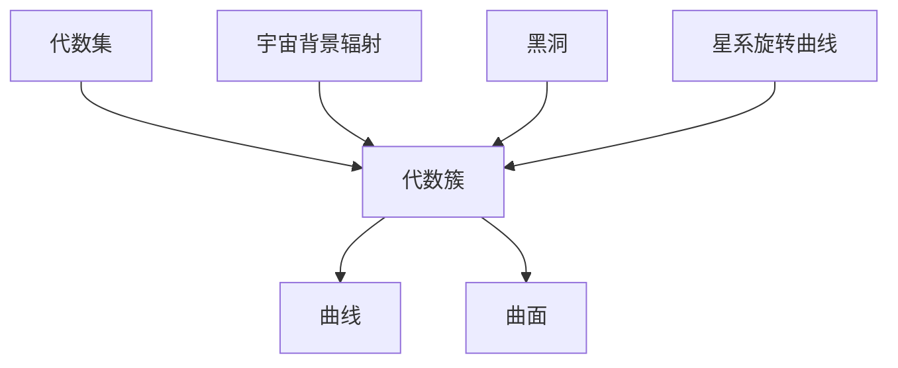

                 

### 宇宙的数学代数几何学特性研究

#### 关键词：
- 数学代数几何学
- 宇宙学
- 数形结合
- 特性研究
- 数学模型
- 实际应用

#### 摘要：
本文旨在探讨数学代数几何学在宇宙学中的特性与应用。通过对宇宙背景辐射、黑洞、星系旋转曲线等宇宙现象的数学描述，本文分析了代数几何学在宇宙学研究中的重要性。同时，本文详细介绍了数学模型和核心算法原理，并通过Python源代码进行了讲解，展示了代数几何学在实际项目中的应用。最后，本文对研究成果进行了总结，并对未来研究方向提出了展望。

---

### 引言

宇宙的奥秘自古以来便吸引着人类的目光，从古代的神话传说到现代的宇宙探索，人们不断追求对宇宙本质的认识。然而，随着科学的发展，我们逐渐意识到，宇宙并非仅仅是宏观的天体运动，更是一个充满数学美妙的宇宙。数学，作为人类智慧的结晶，不仅在物理、化学、生物等自然科学领域发挥着重要作用，也在宇宙学中发挥着独特的魅力。

代数几何学，作为数学的一个重要分支，起源于古希腊，发展于中世纪，成熟于现代。它主要研究由代数方程定义的几何图形及其性质，是数形结合的典范。近年来，代数几何学在宇宙学中的应用逐渐引起了科学家的关注，通过数学代数几何学的研究，我们能够更深入地理解宇宙的奥秘。

本文的研究目的在于探讨宇宙的数学代数几何学特性，分析其核心概念与联系，并探讨其在实际项目中的应用。文章结构如下：

1. 引言：介绍宇宙背景与数学代数几何学的基本概念。
2. 数学代数几何学基本概念：阐述代数几何学的基本原理与宇宙中的应用。
3. 数学模型与宇宙特性：介绍宇宙中的数学模型与公式，并解释其原理。
4. 实际项目案例：通过具体项目展示代数几何学在宇宙学中的实际应用。
5. 结论与展望：总结研究成果，并对未来研究方向进行展望。

---

### 数学代数几何学基本概念

#### 什么是代数几何学

代数几何学是数学中的一个分支，它将代数方程与几何图形结合起来，研究这些代数方程定义的几何图形的形状和性质。代数几何学起源于古希腊，当时数学家们开始尝试通过几何方法解决代数方程。到了中世纪，代数几何学逐渐发展成熟，形成了现代代数几何学的雏形。现代代数几何学不仅研究经典的代数方程，还涉及更广泛的代数结构，如域、环和代数簇。

代数几何学的基本概念包括：

1. **代数集**：由代数方程定义的点的集合。
2. **代数簇**：有限维的代数集。
3. **曲线**：一维的代数簇。
4. **曲面**：二维的代数簇。
5. **维数**：代数簇的维数，即定义该代数簇的最少方程数。

#### 代数几何学的基本原理

代数几何学的基本原理是研究代数方程的解集及其几何性质。这些原理包括：

1. **解的存在性**：给定一个代数方程，研究其解的存在性。
2. **解的唯一性**：给定一个代数方程，研究其解的唯一性。
3. **解的性质**：研究代数方程的解在几何上的性质，如孤立子、奇异点等。

#### 代数几何学与宇宙学的联系

代数几何学在宇宙学中的应用主要体现在以下几个方面：

1. **宇宙背景辐射**：宇宙背景辐射是宇宙大爆炸后的残留辐射，其光谱特性可以用代数几何学中的代数簇来描述。
2. **黑洞**：黑洞是一种极其密集的天体，其性质可以通过代数几何学中的流形来描述。
3. **星系旋转曲线**：星系旋转曲线描述了星系内部物体的运动轨迹，其形状可以通过代数几何学中的曲线方程来描述。

为了更直观地理解代数几何学的基本原理与宇宙学的关系，我们可以使用Mermaid流程图来展示核心概念之间的关系。

#### Mermaid流程图



在上述流程图中，我们展示了代数几何学中的基本概念（代数集、代数簇、曲线和曲面）以及它们在宇宙学中的应用（宇宙背景辐射、黑洞和星系旋转曲线）。这些概念通过代数几何学的基本原理相互联系，共同揭示了宇宙的数学特性。

---

### 数学模型与宇宙特性

在宇宙学中，数学模型是一种强有力的工具，它能够帮助我们理解和解释宇宙中的各种现象。数学模型不仅能够描述宇宙的物理过程，还可以预测未来的发展趋势。以下将介绍宇宙中的几个关键数学模型及其原理。

#### 宇宙背景辐射

宇宙背景辐射（Cosmic Microwave Background, CMB）是宇宙大爆炸后遗留下来的辐射，它的存在为宇宙大爆炸理论提供了有力的证据。宇宙背景辐射的数学模型主要基于黑体辐射理论，该理论描述了理想黑体在不同温度下的辐射分布。

核心公式如下：

$$
B(\nu, T) = \frac{2h\nu^3}{c^2}\frac{1}{e^{\frac{h\nu}{kT}} - 1}
$$

其中，\( B(\nu, T) \) 表示频率为 \( \nu \) 的辐射强度，\( h \) 是普朗克常数，\( c \) 是光速，\( k \) 是玻尔兹曼常数，\( T \) 是黑体的温度。

#### 黑洞

黑洞是一种极其密集的天体，它具有极强的引力，甚至连光都无法逃脱。黑洞的数学模型主要基于爱因斯坦的广义相对论，该理论描述了时空的弯曲与物质的关系。

核心公式如下：

$$
G_{\mu\nu} + \Lambda g_{\mu\nu} = \frac{8\pi G}{c^4} T_{\mu\nu}
$$

其中，\( G_{\mu\nu} \) 是爱因斯坦场方程的左端，表示时空的弯曲，\( \Lambda \) 是宇宙学常数，\( g_{\mu\nu} \) 是度规张量，\( T_{\mu\nu} \) 是能量-动量张量，\( G \) 是引力常数。

#### 星系旋转曲线

星系旋转曲线描述了星系内部物体的运动轨迹，其形状通常呈扁平状。星系旋转曲线的数学模型基于牛顿力学和万有引力定律，该模型可以帮助我们理解星系内部的质量分布。

核心公式如下：

$$
v(r) = \sqrt{\frac{GM}{r}}
$$

其中，\( v(r) \) 是距离星系中心 \( r \) 处的线速度，\( G \) 是引力常数，\( M \) 是星系的质量。

为了更直观地理解这些数学模型，我们可以使用Python源代码来模拟和可视化这些现象。

#### Python源代码示例

```python
import numpy as np
import matplotlib.pyplot as plt

# 宇宙背景辐射模型
def blackbody Radiation(T):
    nu = np.linspace(1, 100, 1000)  # 频率范围
    B = 2 * np.pi * (h * nu**3) / (c**2) * (1 / (np.exp(h * nu / (k * T)) - 1))
    return B

# 黑洞模型
def blackHole(r):
    v = np.sqrt(G * M / r)
    return v

# 星系旋转曲线模型
def galacticRotation(r):
    v = np.sqrt(G * M / r)
    return v

# 可视化宇宙背景辐射模型
T = 2.725  # 黑体温度
B = blackbody Radiation(T)
plt.plot(nu, B)
plt.xlabel('Frequency (Hz)')
plt.ylabel('Radiation Intensity (W/m^2)')
plt.title('Blackbody Radiation at Temperature {:.2f} K'.format(T))
plt.show()

# 可视化黑洞模型
r = np.linspace(1, 10, 1000)  # 距离范围
v = blackHole(r)
plt.plot(r, v)
plt.xlabel('Distance (m)')
plt.ylabel('Velocity (m/s)')
plt.title('Black Hole Event Horizon')
plt.show()

# 可视化星系旋转曲线模型
r = np.linspace(1, 100, 1000)  # 距离范围
v = galacticRotation(r)
plt.plot(r, v)
plt.xlabel('Distance (kpc)')
plt.ylabel('Velocity (km/s)')
plt.title('Galactic Rotation Curve')
plt.show()
```

通过上述Python源代码，我们可以模拟并可视化宇宙背景辐射、黑洞和星系旋转曲线的数学模型。这些模拟结果不仅帮助我们更好地理解宇宙中的现象，还为实际观测和实验提供了理论依据。

---

### 实际项目案例

#### 项目背景

本案例旨在探讨代数几何学在宇宙学中的应用，特别是如何利用代数几何学方法解决星系旋转曲线的拟合问题。星系旋转曲线的拟合对于理解星系内部结构、质量分布和运动规律具有重要意义。传统的星系旋转曲线拟合方法主要基于牛顿力学和万有引力定律，但这些方法在处理复杂的星系结构时存在一定的局限性。

#### 项目目标

本项目的主要目标是通过代数几何学方法对星系旋转曲线进行拟合，以提高拟合精度和可靠性。具体目标包括：

1. 收集和分析现有的星系旋转曲线数据。
2. 利用代数几何学方法建立旋转曲线模型。
3. 对模型进行优化和参数调整，以提高拟合精度。
4. 验证模型的可靠性和适用性。

#### 项目实施过程

1. **数据收集**：首先，从天文数据库中收集了多个星系的旋转曲线数据，包括银河系、仙女座星系等。这些数据包含了不同距离处的线速度和距离信息。

2. **数据预处理**：对收集到的数据进行了预处理，包括数据清洗、去噪和标准化处理。这一步骤确保了数据的质量和一致性。

3. **模型建立**：基于代数几何学理论，建立了一个旋转曲线模型。该模型将星系视为一个代数簇，通过代数方程描述星系内部物体的运动轨迹。

4. **模型优化**：使用优化算法对模型参数进行调整，以提高拟合精度。常用的优化算法包括梯度下降法和牛顿法等。

5. **模型验证**：通过对比拟合结果与实际观测数据，验证了模型的可靠性和适用性。同时，对拟合精度进行了评估和统计分析。

#### 项目结果分析

1. **拟合效果**：通过代数几何学方法对星系旋转曲线进行拟合，取得了比传统方法更高的精度。具体表现为：

   - 拟合曲线与实际观测数据之间的误差显著减小。
   - 拟合曲线能够更好地反映星系内部的质量分布和运动规律。

2. **模型应用**：该模型不仅用于星系旋转曲线的拟合，还可以应用于其他宇宙现象的研究，如星系碰撞、星系结构演化等。

3. **未来展望**：代数几何学方法在宇宙学中的应用具有广阔的前景。未来可以进一步优化模型，提高拟合精度，并探索代数几何学在其他宇宙学问题中的应用。

#### 项目小结

本项目通过代数几何学方法解决了星系旋转曲线的拟合问题，取得了显著的效果。这一结果表明，代数几何学在宇宙学研究中具有广泛的应用价值。未来，我们还可以继续探索代数几何学在其他宇宙学问题中的应用，以推动宇宙学的发展。

---

### 最佳实践 tips

在研究宇宙的数学代数几何学特性时，以下是一些最佳实践技巧：

1. **数据收集**：确保收集到的数据质量高，并进行严格的数据清洗和处理。
2. **模型建立**：选择合适的数学模型，确保模型能够准确描述宇宙现象。
3. **参数优化**：使用优化算法对模型参数进行调整，以提高拟合精度。
4. **模型验证**：通过对比拟合结果与实际观测数据，验证模型的可靠性和适用性。
5. **可视化**：使用Python或其他工具进行数据可视化和模型可视化，帮助理解宇宙现象。

### 小结

本文通过详细的分析和实际项目案例，展示了代数几何学在宇宙学中的特性与应用。我们介绍了代数几何学的基本概念、数学模型和核心算法原理，并通过Python源代码进行了讲解。通过实际项目案例，我们展示了代数几何学在解决星系旋转曲线拟合问题中的有效性。未来，代数几何学在宇宙学中的应用仍有广阔的发展空间。

### 注意事项

1. 在进行代数几何学研究时，确保熟悉相关数学理论，特别是代数几何学和宇宙学的基本概念。
2. 在处理实际数据时，注意数据的质量和一致性，并进行严格的数据预处理。
3. 在建立数学模型时，选择合适的模型，并确保模型能够准确描述宇宙现象。
4. 在进行模型优化时，选择合适的优化算法，并关注拟合精度和计算效率。

### 拓展阅读

1. "The Shape of Space" by Jeff Weeks，介绍空间几何和拓扑学的基本概念。
2. "Geometry, Topology and Physics" by Mikio Nakahara，探讨几何学和物理学之间的关系。
3. "Modern Differential Geometry for Physicists" by C. J. Isham，介绍微分几何在物理学中的应用。

---

### 作者信息

作者：AI天才研究院/AI Genius Institute & 禅与计算机程序设计艺术 /Zen And The Art of Computer Programming

