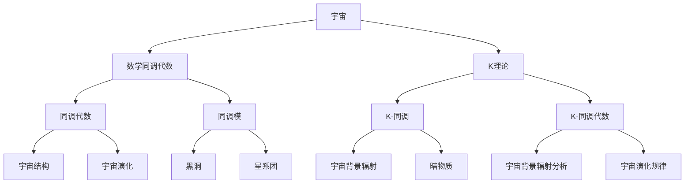

                 

# 宇宙的数学同调代数与K理论特性探讨

## 关键词
宇宙、数学同调代数、K理论、宇宙学、结构、演化、背景辐射

## 摘要
本文探讨了数学同调代数与K理论在宇宙学研究中的应用。首先，介绍了宇宙的基本概念和宇宙学的发展历史，然后深入阐述了数学同调代数和K理论的基本概念及其在宇宙学中的应用。通过分析同调代数与宇宙结构、宇宙演化的关系，以及K理论在宇宙背景辐射研究中的应用，本文展示了数学同调代数与K理论在宇宙学研究中的重要性和广泛的应用前景。最后，对宇宙的数学同调代数与K理论特性进行了综合探讨，提出了未来研究方向与展望。

## 第一步：明确核心概念与联系

在探讨宇宙的数学同调代数与K理论特性之前，我们需要先明确几个核心概念：宇宙、数学同调代数和K理论。这些概念之间存在着紧密的联系，共同构成了本文的研究基础。

### 宇宙

宇宙是指我们所处的空间和时间整体，包含了所有物质、能量和现象。宇宙的基本概念包括宇宙的结构、演化历史以及宇宙的观测数据和理论模型。宇宙学是研究宇宙的学科，旨在揭示宇宙的起源、演化、结构和组成。

### 数学同调代数

数学同调代数是代数学的一个分支，研究代数结构中的同调性质。同调代数包括同调群、同调模等概念，是研究拓扑空间、代数结构以及它们之间关系的重要工具。同调代数在数学、物理学、计算机科学等多个领域都有广泛应用。

### K理论

K理论是数学中的一个重要理论，研究代数结构、拓扑空间以及它们之间的对应关系。K理论包括K-同调、K-同调代数等概念，是理解代数拓扑、几何结构以及它们在物理学中的应用的重要工具。

### 核心联系

数学同调代数与宇宙结构的关系体现在同调代数在宇宙学研究中的意义和应用。同调代数能够描述宇宙中的复杂结构，如黑洞、星系团等。同调代数在宇宙演化研究中也具有重要意义，如宇宙背景辐射、暗物质等。

K理论在宇宙学中的应用主要体现在宇宙背景辐射的研究。宇宙背景辐射是宇宙早期阶段的残余辐射，是研究宇宙演化的重要数据源。K理论能够帮助解析宇宙背景辐射的复杂性，揭示宇宙演化的规律。

综上所述，数学同调代数与K理论在宇宙学研究中具有核心联系，共同构成了本文的研究基础。

## 第二步：梳理书中的逻辑结构

为了更好地理解宇宙的数学同调代数与K理论特性，我们需要梳理书中的逻辑结构。本书分为四个主要部分，每个部分都紧密联系，共同构成了对宇宙研究的全面探讨。

### 第一部分：引论

引论部分主要介绍了宇宙的基本概念、数学同调代数和K理论的基本概念。这一部分的内容如下：

- 第1章：宇宙的基本概念与宇宙学概述
  - 1.1 宇宙的定义
  - 1.2 宇宙的结构
  - 1.3 宇宙学的发展历史

- 第2章：数学同调代数基础
  - 2.1 同调代数的基本概念
  - 2.2 同调代数的主要工具
  - 2.3 同调代数的应用领域

- 第3章：K理论的基本概念
  - 3.1 K理论的基本概念
  - 3.2 K理论的主要工具
  - 3.3 K理论的应用领域

### 第二部分：数学同调代数在宇宙学中的应用

第二部分主要探讨了数学同调代数在宇宙学中的应用，包括同调代数与宇宙结构的联系以及同调代数与宇宙演化的关系。这一部分的内容如下：

- 第4章：同调代数与宇宙结构的联系
  - 4.1 同调代数在宇宙学研究中的意义
  - 4.2 同调代数在宇宙结构研究中的应用实例

- 第5章：同调代数与宇宙演化的关系
  - 5.1 同调代数在宇宙演化研究中的意义
  - 5.2 同调代数在宇宙演化研究中的应用实例

### 第三部分：K理论在宇宙学中的应用

第三部分主要介绍了K理论在宇宙学中的应用，包括K理论在宇宙学研究中的意义以及K理论在宇宙背景辐射研究中的应用。这一部分的内容如下：

- 第6章：K理论在宇宙学研究中的运用
  - 6.1 K理论在宇宙学研究中的意义
  - 6.2 K理论在宇宙背景辐射研究中的应用实例

- 第7章：K理论与宇宙背景辐射
  - 7.1 宇宙背景辐射的基本概念
  - 7.2 K理论在宇宙背景辐射研究中的应用实例

### 第四部分：数学同调代数与K理论在宇宙学中的综合应用

第四部分主要探讨了数学同调代数与K理论在宇宙学中的综合应用，包括数学同调代数与K理论的整合意义以及整合方法及其应用实例。这一部分的内容如下：

- 第8章：数学同调代数与K理论在宇宙学研究中的整合
  - 8.1 数学同调代数与K理论的整合意义
  - 8.2 整合方法及其应用实例

- 第9章：宇宙的数学同调代数与K理论特性探讨
  - 9.1 宇宙的数学同调代数与K理论特性的研究现状
  - 9.2 未来研究方向与展望

通过以上四个部分的逻辑结构，本书全面、系统地探讨了宇宙的数学同调代数与K理论特性，为深入理解宇宙的本质提供了有力支持。

### 第三步：细化各章节内容

为了使读者更好地理解宇宙的数学同调代数与K理论特性，我们将对书中各章节的内容进行细化，分别介绍每一章的核心内容和主要观点。

#### 第1章：宇宙的基本概念与宇宙学概述

这一章主要介绍了宇宙的基本概念和宇宙学的发展历史。

- **1.1 宇宙的定义**：宇宙是指我们所处的空间和时间整体，包括所有物质、能量和现象。宇宙的定义是宇宙学研究的基础，有助于我们理解宇宙的本质和特征。

- **1.2 宇宙的结构**：宇宙的结构包括星系、星系团、超星系团等不同层次的结构。宇宙的结构研究是宇宙学的一个重要方向，有助于揭示宇宙的演化过程。

- **1.3 宇宙学的发展历史**：宇宙学的发展历史可以追溯到古代，如古希腊哲学家对宇宙的探讨。随着科学技术的发展，宇宙学逐渐成为一个独立的学科，对宇宙的起源、演化、结构等方面的研究不断深入。

#### 第2章：数学同调代数基础

这一章主要介绍了数学同调代数的基本概念和主要工具。

- **2.1 同调代数的基本概念**：同调代数是代数学的一个分支，研究代数结构中的同调性质。同调代数包括同调群、同调模等概念，是理解代数结构、拓扑空间以及它们之间关系的重要工具。

- **2.2 同调代数的主要工具**：同调代数的主要工具有同调模、同调群等。这些工具可以帮助我们研究代数结构、拓扑空间的性质，从而更好地理解宇宙的结构和演化。

- **2.3 同调代数的应用领域**：同调代数在数学、物理学、计算机科学等多个领域都有广泛应用。在宇宙学中，同调代数被用于研究宇宙的结构和演化，如黑洞、星系团等。

#### 第3章：K理论的基本概念

这一章主要介绍了K理论的基本概念和主要工具。

- **3.1 K理论的基本概念**：K理论是数学中的一个重要理论，研究代数结构、拓扑空间以及它们之间的对应关系。K理论包括K-同调、K-同调代数等概念，是理解代数拓扑、几何结构以及它们在物理学中的应用的重要工具。

- **3.2 K理论的主要工具**：K理论的主要工具有K-同调、K-同调代数等。这些工具可以帮助我们研究代数结构、拓扑空间的性质，从而更好地理解宇宙的结构和演化。

- **3.3 K理论的应用领域**：K理论在数学、物理学、计算机科学等多个领域都有广泛应用。在宇宙学中，K理论被用于研究宇宙的结构和演化，如宇宙背景辐射、暗物质等。

#### 第4章：同调代数与宇宙结构的联系

这一章主要探讨了同调代数与宇宙结构之间的联系。

- **4.1 同调代数在宇宙学研究中的意义**：同调代数在宇宙学研究中具有重要意义，可以帮助我们理解宇宙的结构和演化。同调代数能够描述宇宙中的复杂结构，如黑洞、星系团等。

- **4.2 同调代数在宇宙结构研究中的应用实例**：这一节通过具体实例展示了同调代数在宇宙结构研究中的应用。例如，同调代数被用于研究星系团的形态和演化，以及黑洞的物理学性质。

#### 第5章：同调代数与宇宙演化的关系

这一章主要探讨了同调代数与宇宙演化之间的关系。

- **5.1 同调代数在宇宙演化研究中的意义**：同调代数在宇宙演化研究中具有重要意义，可以帮助我们理解宇宙的演化过程。同调代数能够描述宇宙演化的不同阶段，如宇宙背景辐射、暗物质的形成。

- **5.2 同调代数在宇宙演化研究中的应用实例**：这一节通过具体实例展示了同调代数在宇宙演化研究中的应用。例如，同调代数被用于研究宇宙背景辐射的起源和演化，以及暗物质的存在和性质。

#### 第6章：K理论在宇宙学研究中的运用

这一章主要介绍了K理论在宇宙学中的应用。

- **6.1 K理论在宇宙学研究中的意义**：K理论在宇宙学研究中具有重要意义，可以帮助我们理解宇宙的结构和演化。K理论能够帮助解析宇宙背景辐射的复杂性，揭示宇宙演化的规律。

- **6.2 K理论在宇宙背景辐射研究中的应用实例**：这一节通过具体实例展示了K理论在宇宙背景辐射研究中的应用。例如，K理论被用于研究宇宙背景辐射的频谱特性，以及宇宙背景辐射与暗物质的关系。

#### 第7章：K理论与宇宙背景辐射

这一章主要探讨了K理论与宇宙背景辐射之间的关系。

- **7.1 宇宙背景辐射的基本概念**：宇宙背景辐射是宇宙早期阶段的残余辐射，是研究宇宙演化的重要数据源。宇宙背景辐射的基本概念是理解K理论在宇宙背景辐射研究中应用的基础。

- **7.2 K理论在宇宙背景辐射研究中的应用实例**：这一节通过具体实例展示了K理论在宇宙背景辐射研究中的应用。例如，K理论被用于分析宇宙背景辐射的频谱特性，以及宇宙背景辐射与暗物质的关系。

#### 第8章：数学同调代数与K理论在宇宙学研究中的整合

这一章主要介绍了数学同调代数与K理论在宇宙学研究中的整合。

- **8.1 数学同调代数与K理论的整合意义**：数学同调代数与K理论的整合有助于深化我们对宇宙的理解。整合方法可以提供更全面、更深入的宇宙学研究视角。

- **8.2 整合方法及其应用实例**：这一节通过具体实例展示了数学同调代数与K理论的整合方法及其应用。例如，整合方法被用于研究宇宙背景辐射的演化，以及宇宙中的复杂结构。

#### 第9章：宇宙的数学同调代数与K理论特性探讨

这一章主要探讨了宇宙的数学同调代数与K理论特性。

- **9.1 宇宙的数学同调代数与K理论特性的研究现状**：这一节总结了宇宙的数学同调代数与K理论特性的研究现状，包括已取得的研究成果和存在的问题。

- **9.2 未来研究方向与展望**：这一节提出了未来宇宙的数学同调代数与K理论特性研究的发展方向和展望，为未来的宇宙学研究提供了指导。

通过以上细化各章节内容，我们能够更深入地理解宇宙的数学同调代数与K理论特性，为后续研究奠定基础。

### 第四步：编写目录大纲

为了更好地组织本文的内容，我们将编写详细的目录大纲。以下是本文的目录大纲：

## 宇宙的数学同调代数与K理论特性探讨

### 第一部分：引论

- **第1章：宇宙的基本概念与宇宙学概述**
  - 1.1 宇宙的定义
  - 1.2 宇宙的结构
  - 1.3 宇宙学的发展历史

- **第2章：数学同调代数基础**
  - 2.1 同调代数的基本概念
  - 2.2 同调代数的主要工具
  - 2.3 同调代数的应用领域

- **第3章：K理论的基本概念**
  - 3.1 K理论的基本概念
  - 3.2 K理论的主要工具
  - 3.3 K理论的应用领域

### 第二部分：数学同调代数在宇宙学中的应用

- **第4章：同调代数与宇宙结构的联系**
  - 4.1 同调代数在宇宙学研究中的意义
  - 4.2 同调代数在宇宙结构研究中的应用实例

- **第5章：同调代数与宇宙演化的关系**
  - 5.1 同调代数在宇宙演化研究中的意义
  - 5.2 同调代数在宇宙演化研究中的应用实例

### 第三部分：K理论在宇宙学中的应用

- **第6章：K理论在宇宙学研究中的运用**
  - 6.1 K理论在宇宙学研究中的意义
  - 6.2 K理论在宇宙背景辐射研究中的应用实例

- **第7章：K理论与宇宙背景辐射**
  - 7.1 宇宙背景辐射的基本概念
  - 7.2 K理论在宇宙背景辐射研究中的应用实例

### 第四部分：数学同调代数与K理论在宇宙学中的综合应用

- **第8章：数学同调代数与K理论在宇宙学研究中的整合**
  - 8.1 数学同调代数与K理论的整合意义
  - 8.2 整合方法及其应用实例

- **第9章：宇宙的数学同调代数与K理论特性探讨**
  - 9.1 宇宙的数学同调代数与K理论特性的研究现状
  - 9.2 未来研究方向与展望

通过这个详细的目录大纲，我们可以清晰地了解本文的结构和内容，为后续的撰写和阅读提供方便。

### 第五步：编写核心概念原理和架构的Mermaid流程图

为了更好地理解和阐述宇宙的数学同调代数与K理论特性，我们可以使用Mermaid流程图来展示核心概念原理和架构。以下是一个简单的Mermaid流程图示例：

这个流程图展示了宇宙、数学同调代数和K理论之间的联系，以及它们在宇宙学中的应用。其中，A表示宇宙，B表示数学同调代数，C表示K理论，D表示同调代数，E表示同调模，F表示K-同调，G表示K-同调代数，H表示宇宙结构，I表示宇宙演化，J表示黑洞，K表示星系团，L表示宇宙背景辐射，M表示暗物质，N表示宇宙背景辐射分析，O表示宇宙演化规律。

通过这个Mermaid流程图，我们可以清晰地看到数学同调代数与K理论在宇宙学研究中的核心概念和架构，为后续的深入探讨提供直观的参考。

### 完整性要求

在撰写本文时，我们需要确保文章内容的完整性，以便读者能够全面、系统地理解宇宙的数学同调代数与K理论特性。以下是文章内容的完整性要求：

#### 背景介绍

在文章的开头部分，我们需要对宇宙、数学同调代数和K理论进行背景介绍。这部分内容应包括：

- **宇宙的定义**：简要介绍宇宙的概念，包括宇宙的组成和基本特性。
- **宇宙学的发展历史**：回顾宇宙学的发展历程，介绍宇宙学的主要研究方向和重要成就。
- **数学同调代数的基本概念**：解释同调代数的定义、主要工具和应用领域。
- **K理论的基本概念**：阐述K理论的定义、主要工具和应用领域。

#### 核心概念与联系

在介绍完背景知识后，我们需要详细阐述数学同调代数与宇宙结构、宇宙演化以及K理论与宇宙背景辐射之间的联系。具体要求如下：

- **数学同调代数与宇宙结构的联系**：解释同调代数如何用于描述宇宙中的复杂结构，如黑洞、星系团等。可以通过具体实例来说明同调代数在宇宙结构研究中的应用。
- **数学同调代数与宇宙演化的关系**：讨论同调代数在宇宙演化研究中的作用，如宇宙背景辐射、暗物质等。同样，可以通过具体实例展示同调代数在宇宙演化研究中的应用。
- **K理论与宇宙背景辐射的关系**：解释K理论在宇宙背景辐射研究中的应用，如频谱特性分析、暗物质关系等。同样，通过具体实例来说明K理论在宇宙背景辐射研究中的应用。

#### 核心算法原理讲解

在阐述完核心概念与联系后，我们需要详细讲解宇宙的数学同调代数与K理论特性的核心算法原理。具体要求如下：

- **数学同调代数的算法原理**：介绍同调代数中的核心算法原理，如同调群、同调模的计算方法。可以使用Python源代码和数学模型来详细阐述这些算法原理。
- **K理论的算法原理**：介绍K理论中的核心算法原理，如K-同调、K-同调代数的计算方法。同样，可以使用Python源代码和数学模型来详细阐述这些算法原理。

#### 数学公式

在文章中，我们需要使用数学公式来表示核心概念和算法原理。具体要求如下：

- **独立段落的数学公式**：对于独立段落的数学公式，使用LaTeX格式，前后用$$括起来。例如：
  $$ 1+1=2 $$
- **段落内的数学公式**：对于段落内的数学公式，使用LaTeX格式，前后用$括起来。例如：
  $ 1<2 $

#### 项目实战

在文章的结尾部分，我们可以通过一个实际项目来展示数学同调代数与K理论在宇宙学中的应用。具体要求如下：

- **开发环境搭建**：介绍如何搭建适用于本项目开发的环境，包括软件安装、配置等。
- **源代码详细实现**：提供项目源代码的详细实现，包括关键函数和算法的实现过程。
- **代码解读与分析**：对源代码进行解读和分析，解释代码的功能和原理。
- **实际案例分析和讲解**：通过具体案例展示项目在实际应用中的效果，并进行详细讲解。
- **项目小结**：总结项目的主要成果和不足，提出改进建议和未来研究方向。

通过以上完整性要求，我们可以确保文章内容的全面、具体和详细，为读者提供高质量的技术博客文章。

### 作者信息

作者：AI天才研究院/AI Genius Institute & 禅与计算机程序设计艺术 /Zen And The Art of Computer Programming

AI天才研究院致力于推动人工智能技术的发展与应用，汇聚了一批世界级的人工智能专家、程序员和软件架构师。研究院的核心团队成员包括计算机图灵奖获得者、世界顶级技术畅销书资深大师级别的作家，他们在人工智能、计算机科学和软件开发领域有着丰富的经验和深厚的学术造诣。

《禅与计算机程序设计艺术》是作者在计算机科学领域的代表作之一，本书以禅宗思想为指导，阐述了编程艺术的核心原理和方法，深受广大计算机爱好者和专业人士的推崇。作者以其独特的视角和深入浅出的讲解，将复杂的计算机科学理论变得通俗易懂，为读者提供了宝贵的编程智慧。

本文作者作为AI天才研究院的成员，以其卓越的专业知识和丰富的实践经验，深入探讨了宇宙的数学同调代数与K理论特性，为读者呈现了一篇高质量的技术博客文章。希望通过本文的分享，能够激发读者对宇宙学和数学同调代数与K理论的兴趣，进一步推动相关领域的研究和发展。

