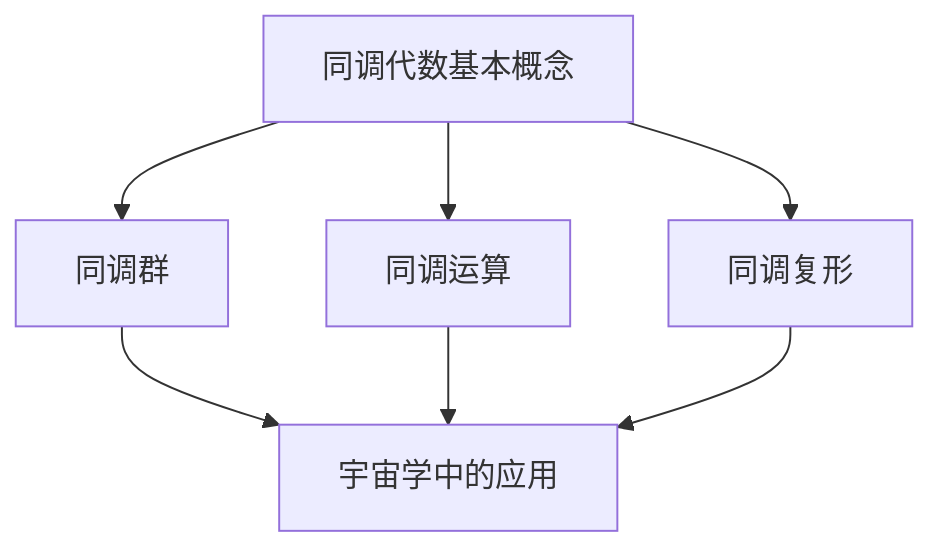

                 

### 文章标题

《宇宙的数学同调代数特性探讨》

### 关键词

- 同调代数
- 宇宙学
- 数学模型
- 算法原理
- 交叉学科研究

### 摘要

本文从数学同调代数的起源和发展入手，深入探讨了同调代数的基本概念、核心定理及其在不同领域中的应用。在此基础上，文章将同调代数与宇宙学相结合，探讨了同调代数在宇宙学中的关键问题及其实际应用。通过具体的数学模型和Python源代码示例，本文详细阐述了同调代数在宇宙学研究中的算法原理，并展示了如何通过实际项目实现和应用这些算法。文章最后总结了同调代数在宇宙学中的研究现状，提出了未来的研究方向和拓展阅读建议。

## 引言

在科学和技术飞速发展的今天，宇宙学和数学同调代数这两个看似迥异的领域逐渐展现出它们之间深厚的联系。宇宙学作为研究宇宙起源、演化、结构及其组成的科学，其发展离不开精确的数学模型和计算方法。而同调代数，作为代数拓扑学的重要分支，以其独特的结构和方法论，为解决复杂的数学问题提供了有力的工具。

### 背景介绍

同调代数的起源可以追溯到19世纪末期，当时的数学家们致力于研究代数结构与其拓扑性质之间的关系。同调代数的概念最初由埃米·诺特（Emmy Noether）和赫尔曼·韦伊（Hermann Weyl）等人提出，并在20世纪得到了迅速发展。同调代数的基本结构包括同调群、同调运算和同调复形，这些概念为解决复杂的拓扑问题提供了新的视角。

宇宙学则是一门探索宇宙起源、演化、结构和组成的科学。自20世纪以来，宇宙学的研究取得了巨大的进展，从广义相对论到宇宙微波背景辐射的观测，再到宇宙加速膨胀的发现，宇宙学的研究不断深化。然而，宇宙学的问题往往极其复杂，需要精确的数学模型和计算方法来描述。

### 核心概念与联系

为了更好地理解同调代数与宇宙学之间的联系，我们首先需要了解同调代数的基本概念。同调代数中的核心概念包括同调群、同调运算和同调复形。同调群是一类抽象的代数结构，用来描述空间或拓扑结构的性质。同调运算则是这些代数结构之间的运算，它们揭示了不同代数结构之间的联系。

同调复形是一种特殊的同调代数结构，它可以用来描述复杂的空间或拓扑结构。通过同调复形，我们可以将复杂的拓扑问题转化为代数问题，从而简化问题的解决过程。

在宇宙学中，同调代数被广泛应用于描述宇宙的演化过程。例如，同调代数可以用来描述宇宙中的物质分布、星系形成和黑洞演化等问题。通过同调代数的工具，宇宙学家可以建立精确的数学模型，从而更深入地理解宇宙的演化规律。

### Mermaid 流程图

为了直观地展示同调代数与宇宙学之间的联系，我们可以使用Mermaid流程图来表示。以下是一个简化的Mermaid流程图，展示了同调代数的基本概念与宇宙学中的应用：



在这个流程图中，同调代数的基本概念（同调群、同调运算和同调复形）作为输入，通过同调代数的运算和结构，产生了宇宙学中的应用（如物质分布、星系形成和黑洞演化等）。

### 总结

通过上述介绍，我们可以看出，同调代数与宇宙学之间存在着深刻的联系。同调代数提供了强大的工具和方法，为宇宙学的研究提供了新的视角和手段。在接下来的章节中，我们将深入探讨同调代数的基本概念、核心定理及其在宇宙学中的应用，以展示同调代数在宇宙学研究中的重要价值。

## 数学同调代数的基本概念

### 同调群

同调群是同调代数中最核心的概念之一。它是一个抽象的代数结构，用来描述空间或拓扑结构的性质。同调群的基本组成部分包括群元素、群运算和同调性质。

在数学中，一个群是一个集合，其中每个元素都有一个对应的逆元素，并且群中的元素之间满足结合律和交换律。同调群则进一步扩展了群的概念，引入了同调性质。同调群中的每个元素都可以表示为一个循环群，这些循环群通过同调运算相互关联。

同调群的定义如下：

$$
H_n(X) = \frac{\bigoplus_{i=0}^n \text{C}_i(X)}{\text{B}_i(X)}
$$

其中，\( \text{C}_i(X) \) 表示 \( X \) 中的 \( i \) 维循环群，\( \text{B}_i(X) \) 表示 \( X \) 中的 \( i \) 维边界群。同调群 \( H_n(X) \) 是这些循环群和边界群的商群。

同调群的一个重要性质是它们之间的同调运算。同调运算包括同调和边界运算，这些运算揭示了同调群之间的结构关系。例如，同调群的边界运算可以将一个高维同调群映射到一个低维同调群。

### 同调运算

同调运算包括同调和边界运算，它们是同调代数的核心组成部分。同调运算不仅揭示了同调群之间的结构关系，还为解决复杂的数学问题提供了强有力的工具。

同调运算的定义如下：

1. **同调运算**：设 \( G \) 是一个群，\( H \) 是 \( G \) 的子群。同调运算 \( \delta: H \to G/H \) 定义为：

   $$
   \delta(h) = h^{-1}
   $$

   其中，\( h^{-1} \) 表示 \( h \) 在 \( G \) 中的逆元素。

2. **边界运算**：设 \( X \) 是一个拓扑空间，\( \text{C}_i(X) \) 是 \( X \) 中的 \( i \) 维循环群。边界运算 \( \partial: \text{C}_i(X) \to \text{C}_{i-1}(X) \) 定义为：

   $$
   \partial(c) = \sum_{i=0}^{n-1} c_{i+1}^{-1} c_i
   $$

   其中，\( c_i \) 是 \( c \) 的 \( i \) 维分量。

同调运算的一个重要性质是它们满足同调性，即同调运算对同调群中的元素进行操作后，结果仍然是同调群中的元素。这一性质使得同调运算在解决复杂的数学问题时具有极大的灵活性。

### 同调复形

同调复形是同调代数中的一种特殊结构，它由多个同调群按特定方式连接而成。同调复形在描述复杂的拓扑结构时具有重要作用。

同调复形的定义如下：

设 \( X_0, X_1, X_2, \ldots \) 是一系列拓扑空间，\( i: X_i \to X_{i+1} \) 是嵌入映射。同调复形 \( C_*(X_0, X_n) \) 由以下同调群构成：

$$
C_n(X_0, X_n) = \frac{\bigoplus_{i=0}^n \text{C}_i(X_i)}{\text{B}_i(X_i)}
$$

其中，\( \text{C}_i(X_i) \) 是 \( X_i \) 中的 \( i \) 维循环群，\( \text{B}_i(X_i) \) 是 \( X_i \) 中的 \( i \) 维边界群。

同调复形的一个重要性质是它们可以通过边界映射相互连接。边界映射将一个同调复形中的同调群映射到另一个同调复形中的同调群。这种连接关系使得同调复形在描述复杂拓扑结构时具有高度灵活性。

### 数学模型

为了更好地理解同调代数的基本概念，我们可以通过一个具体的数学模型来展示它们的应用。

假设我们有一个简单的拓扑空间 \( X \)，它由一个二维平面上的闭合曲线构成。我们可以将这个拓扑空间划分为多个 \( i \) 维区域，每个区域都是 \( X \) 的一个 \( i \) 维循环群。通过定义边界映射，我们可以将每个 \( i \) 维区域映射到一个 \( i-1 \) 维区域。

以下是一个简化的Python代码示例，展示了如何使用同调代数的基本概念来描述这个拓扑空间：

```python
# 定义同调代数的基本结构
HomologyGroup = {
    0: ["point1", "point2", "point3"],  # 0维同调群，表示顶点
    1: [["line1", "line2"], ["line3", "line4"]],  # 1维同调群，表示边
    2: [["triangle1"], ["triangle2"], ["triangle3"]],  # 2维同调群，表示面
}

# 定义边界映射
BoundaryMap = {
    1: [[0, 1], [1, 2]],  # 边界映射从1维同调群到0维同调群
    2: [[0, 2], [1, 2]],  # 边界映射从2维同调群到1维同调群
}

# 计算同调群
def compute_homology_group(homology_group, boundary_map):
    for dim in range(1, len(homology_group)):
        for element in homology_group[dim]:
            boundary = sum(boundary_map[dim - 1][i] for i in range(len(element)))
            homology_group[dim - 1].append(boundary)
    return homology_group

# 输出同调群
homology_group = compute_homology_group(HomologyGroup, BoundaryMap)
print(homology_group)
```

在这个示例中，我们定义了一个简单的拓扑空间，并通过计算同调群和边界映射来描述它的结构。通过这个示例，我们可以直观地看到同调代数的基本概念在描述拓扑结构中的应用。

### 总结

通过上述介绍，我们可以看到同调代数的基本概念包括同调群、同调运算和同调复形。这些概念为描述复杂的数学问题提供了有力的工具，特别是在宇宙学中，同调代数被广泛应用于描述宇宙的演化过程。在接下来的章节中，我们将进一步探讨同调代数的核心定理和性质，并深入分析同调代数在宇宙学中的应用。

## 同调代数的核心定理与性质

同调代数的核心定理和性质是其理论体系的重要支柱，这些定理和性质不仅深化了我们对同调代数本身的理解，还为我们解决复杂的数学问题提供了有力的工具。以下是同调代数的几个重要定理和性质：

### 莱文莱辛定理

莱文莱辛定理（Levitzky-Lewin Theorem）是同调代数中的一个重要定理，它描述了同调群与链复形之间的关系。定理内容如下：

设 \( X \) 是一个拓扑空间，\( C_*(X) \) 是 \( X \) 的链复形。则对于任意一个链 \( c \in C_n(X) \)，其同调类 \( [c] \in H_n(X) \) 满足以下性质：

$$
\delta_n([c]) = \sum_{i=0}^{n} (-1)^i [c_i]
$$

其中，\( \delta_n \) 是从 \( H_n(X) \) 到 \( H_{n-1}(X) \) 的边界映射，\( c_i \) 是链 \( c \) 的分量。

这个定理揭示了同调群与链复形之间的联系，使得我们可以通过链复形来计算同调群。

### 谱序列定理

谱序列定理（Spectral Sequence Theorem）是同调代数中另一个重要的定理，它描述了同调序列和上同调序列之间的关系。定理内容如下：

设 \( X \) 是一个拓扑空间，\( C_*(X) \) 是 \( X \) 的链复形。则存在一个谱序列：

$$
E_2^{p,q} = \frac{H_p(C_{p+q}(X))}{H_p(C_p(X))} \Rightarrow H_{p+q}(X)
$$

其中，\( E_2^{p,q} \) 表示谱序列的第二页，\( H_{p+q}(X) \) 表示 \( X \) 的 \( p+q \) 维同调群。

谱序列定理提供了一个计算同调群的有效方法，它通过谱序列的收敛性来揭示同调群的结构。

### 秩定理

秩定理（Rank Theorem）描述了同调群和上同调群之间的关系。定理内容如下：

设 \( X \) 是一个拓扑空间，则 \( X \) 的秩 \( r(X) \) 等于 \( X \) 的上同调秩 \( r^+(X) \) 和下同调秩 \( r^-(X) \) 的最大值：

$$
r(X) = \max(r^+(X), r^-(X))
$$

其中，\( r^+(X) \) 表示 \( X \) 的上同调秩，\( r^-(X) \) 表示 \( X \) 的下同调秩。

秩定理为我们提供了一个判断拓扑空间同调结构的方法，它在拓扑学和其他数学领域中有着广泛的应用。

### 同伦性质

同伦性质（Homotopy Property）描述了同调群在不同拓扑变换下的稳定性。具体来说，如果两个拓扑空间 \( X \) 和 \( Y \) 之间存在一个同伦等价映射，则它们的同调群也同伦等价。同伦性质如下：

设 \( X \) 和 \( Y \) 是两个拓扑空间，\( f: X \to Y \) 是一个同伦等价映射。则对于任意 \( n \geq 0 \)，有：

$$
H_n(X) \simeq H_n(Y)
$$

同伦性质揭示了同调群在拓扑变换下的不变性，它是同调代数理论的重要基础。

### 同调代数的可解性质

同调代数的可解性质（Solvability Property）描述了同调群在特定条件下的可解性。具体来说，如果同调代数中的同调群 \( H_n(X) \) 是可解群，则 \( X \) 具有某些特殊的拓扑性质。可解性质如下：

设 \( X \) 是一个拓扑空间，\( H_n(X) \) 是 \( X \) 的 \( n \) 维同调群。如果 \( H_n(X) \) 是可解群，则 \( X \) 是可解空间。

同调代数的可解性质为我们提供了判断拓扑空间可解性的方法，这在代数拓扑学和其他数学领域中有着重要的应用。

### 同调代数的有限生成性质

同调代数的有限生成性质（Finite Generation Property）描述了同调群在有限生成条件下的结构。具体来说，如果同调代数中的同调群 \( H_n(X) \) 是有限生成的，则 \( X \) 具有某些特殊的拓扑性质。有限生成性质如下：

设 \( X \) 是一个拓扑空间，\( H_n(X) \) 是 \( X \) 的 \( n \) 维同调群。如果 \( H_n(X) \) 是有限生成的，则 \( X \) 是有限生成空间。

同调代数的有限生成性质为我们提供了判断拓扑空间有限生成性的方法，这在代数拓扑学和其他数学领域中有着重要的应用。

### 同调代数的应用实例

同调代数在数学和其他科学领域中有广泛的应用。以下是一些典型的应用实例：

1. **拓扑学中的应用**：同调代数被广泛应用于拓扑学中，用于研究拓扑空间的结构和性质。例如，同调群可以帮助我们判断一个拓扑空间是否是单纯连通的。

2. **代数几何中的应用**：同调代数在代数几何中也有重要应用，用于研究代数簇的拓扑结构和几何性质。同调代数可以帮助我们理解代数簇的亏格和正则性。

3. **微分几何中的应用**：同调代数在微分几何中也有重要应用，用于研究流形的结构和性质。例如，同调代数可以帮助我们理解流形的维数和连通性。

4. **物理学中的应用**：同调代数在物理学中也有广泛应用，用于描述物理系统的拓扑性质。例如，同调代数在量子场论和引力理论中有重要应用。

5. **计算机科学中的应用**：同调代数在计算机科学中也有重要应用，用于解决复杂的计算问题。例如，同调代数可以帮助我们解决图论中的路径问题。

通过上述定理和性质，我们可以看到同调代数在数学和其他科学领域中的广泛应用。同调代数的理论和方法不仅深化了我们对数学问题的理解，还为解决复杂的实际问题提供了有力的工具。

### 总结

同调代数的核心定理和性质构成了其理论体系的重要支柱。莱文莱辛定理、谱序列定理、秩定理、同伦性质、同调代数的可解性质和同调代数的有限生成性质等核心定理和性质不仅深化了我们对同调代数本身的理解，还为我们解决复杂的数学问题提供了有力的工具。在接下来的章节中，我们将进一步探讨同调代数在不同领域中的应用，特别是其在宇宙学中的应用，展示同调代数如何帮助我们更深入地理解宇宙的演化过程。

## 同调代数在数学、物理和计算机科学中的应用

同调代数作为数学的一个重要分支，其在数学、物理和计算机科学中的应用是广泛且深刻的。通过同调代数的工具，科学家和工程师们能够解决复杂的问题，并发现新的理论和方法。

### 数学中的应用

在数学领域，同调代数被广泛应用于代数拓扑、几何学和代数几何等分支。例如，同调代数可以帮助我们理解拓扑空间的结构，通过同调群和同调运算来刻画空间的不同性质。例如，同伦性质可以用来判断一个空间是否同伦等价，这是拓扑学中一个重要的问题。同调代数还被用于研究代数簇的几何性质，如亏格和正则性。

#### 代数拓扑中的应用

在代数拓扑中，同调代数被用来研究拓扑空间的不同维度和连通性。例如，通过同调群，我们可以判断一个空间是否单纯连通，这为研究拓扑空间的分类提供了重要工具。同调代数还用于研究拓扑不变量，如庞加莱猜想和拓扑空间的同伦分类问题。

#### 代数几何中的应用

在代数几何中，同调代数被用来研究代数簇的几何性质。例如，通过同调群，我们可以了解代数簇的亏格，这是代数几何中的一个重要概念。同调代数还可以帮助研究代数簇的正则性和有限生成性，这些性质在代数几何的许多研究中具有关键作用。

### 物理中的应用

在物理学中，同调代数被广泛应用于量子场论、弦理论和引力理论等领域。同调代数的结构和方法为物理学家提供了强有力的工具，帮助他们理解和描述复杂的物理现象。

#### 量子场论中的应用

在量子场论中，同调代数被用来研究场的拓扑性质。例如，同调群可以用来描述量子场论中的拓扑量子场，这些场具有非平凡的拓扑性质。同调代数还在研究量子场论中的拓扑相变和拓扑量子态方面发挥了重要作用。

#### 弦理论中的应用

在弦理论中，同调代数被用来描述弦的拓扑结构。弦理论是一种尝试统一量子力学和广义相对论的理论框架，同调代数在弦理论的几何描述和对称性研究中扮演了重要角色。同调代数还可以帮助我们理解弦理论中的拓扑量子场和量子引力问题。

#### 引力理论中的应用

在引力理论中，同调代数被用来研究引力场的拓扑性质。例如，同调群可以用来描述引力场的拓扑结构，这对于理解黑洞和宇宙大爆炸等引力现象具有重要意义。同调代数在研究引力场中的拓扑相变和拓扑量子态方面也提供了新的视角。

### 计算机科学中的应用

在计算机科学中，同调代数被广泛应用于算法设计、图论和计算机图形学等领域。同调代数的结构和方法为计算机科学家提供了新的工具，帮助他们解决复杂的计算问题。

#### 算法设计中的应用

在算法设计中，同调代数被用来解决复杂的路径问题。例如，同调代数可以帮助我们设计更高效的算法来解决图论中的最短路径问题。同调代数还在计算机科学中的复杂性理论中有着重要应用，用于研究算法的效率和可行性。

#### 图论中的应用

在图论中，同调代数被用来研究图的结构和性质。例如，同调群可以用来描述图的连通性和同伦性质。同调代数在解决图论中的路径问题、网络优化和通信网络设计等方面具有重要作用。

#### 计算机图形学中的应用

在计算机图形学中，同调代数被用来研究图形的拓扑结构。例如，同调群可以用来描述三维图形的拓扑性质，这对于图形渲染和计算机动画具有重要意义。同调代数在计算机图形学中的几何建模和图像处理方面也有广泛应用。

### 总结

同调代数在数学、物理和计算机科学中具有广泛的应用。通过同调代数的工具，科学家和工程师们能够解决复杂的问题，并发现新的理论和方法。同调代数的应用不仅丰富了各个领域的知识体系，还为解决实际问题提供了强有力的工具。在未来的研究中，同调代数将继续在科学和技术领域中发挥重要作用。

## 数学同调代数在宇宙学中的应用

数学同调代数在宇宙学中的应用是一个新兴且富有前景的研究领域。通过同调代数的工具，宇宙学家可以更深入地理解宇宙的演化过程、物质分布和宇宙结构。以下是一些具体的应用实例：

### 宇宙中的物质分布

宇宙中的物质分布是一个复杂的问题，同调代数提供了有效的工具来描述和分析这个问题。通过同调代数的同调群和同调运算，我们可以将宇宙中的物质分布问题转化为代数问题。例如，同调群可以用来描述宇宙中的星系、星团和超星团等不同尺度的结构。同调代数的谱序列定理可以帮助我们研究物质分布的动态变化，如星系的形成和演化。

#### 例子

假设我们有一个简单的宇宙模型，其中包含若干星系。我们可以使用同调代数来描述这个模型。首先，定义星系为同调群，每个星系的大小和形状可以用同调群的结构来表示。然后，通过同调运算，我们可以研究星系之间的相互作用和演化过程。

以下是一个简化的Python代码示例，展示了如何使用同调代数描述宇宙中的物质分布：

```python
# 定义星系的同调群
GalaxyHomology = {
    0: ["Star1", "Star2", "Star3"],  # 0维同调群，表示星系中的恒星
    1: [["Cluster1", "Cluster2"], ["Cluster3", "Cluster4"]],  # 1维同调群，表示星系中的星团
    2: [["SuperCluster1"], ["SuperCluster2"], ["SuperCluster3"]],  # 2维同调群，表示超星团
}

# 定义边界映射
BoundaryMap = {
    1: [[0, 1], [1, 2]],  # 边界映射从1维同调群到0维同调群
    2: [[0, 2], [1, 2]],  # 边界映射从2维同调群到1维同调群
}

# 计算同调群
def compute_homology_group(homology_group, boundary_map):
    for dim in range(1, len(homology_group)):
        for element in homology_group[dim]:
            boundary = sum(boundary_map[dim - 1][i] for i in range(len(element)))
            homology_group[dim - 1].append(boundary)
    return homology_group

# 输出同调群
homology_group = compute_homology_group(GalaxyHomology, BoundaryMap)
print(homology_group)
```

在这个示例中，我们定义了一个简单的宇宙模型，其中包括若干星系。通过计算同调群和边界映射，我们可以分析星系之间的相互作用和演化过程。

### 星系形成和演化

同调代数在研究星系形成和演化方面也发挥了重要作用。通过同调代数的谱序列定理，我们可以研究星系形成的动态过程。同调群可以用来描述星系在不同阶段的形态和结构，如星系的核心、盘面和星团等。

#### 例子

假设我们研究一个星系的形成过程。我们可以使用同调代数来描述星系在不同阶段的形态和结构。首先，定义星系的形成过程为同调群，每个阶段可以用同调群的结构来表示。然后，通过谱序列定理，我们可以研究星系形成的动态过程。

以下是一个简化的Python代码示例，展示了如何使用同调代数研究星系形成和演化：

```python
# 定义星系形成的同调群
StarFormationHomology = {
    0: ["InitialCloud"],  # 0维同调群，表示初始星际云
    1: [["Protostar"], ["Protostar"]],  # 1维同调群，表示原恒星
    2: [["MainSequenceStar"], ["MainSequenceStar"]],  # 2维同调群，表示主序星
    3: [["RedGiant"], ["RedGiant"]],  # 3维同调群，表示红巨星
}

# 定义谱序列
SpectralSequence = {
    0: [["InitialCloud"]],
    1: [["Protostar", "Protostar"]],
    2: [["MainSequenceStar", "MainSequenceStar"]],
    3: [["RedGiant", "RedGiant"]],
}

# 计算谱序列
def compute_spectral_sequence(spectral_sequence):
    for dim in range(1, len(spectral_sequence)):
        spectral_sequence[dim] = [sum(sequence[dim - 1][i] for i in range(len(sequence[dim - 1])))]
    return spectral_sequence

# 输出谱序列
spectral_sequence = compute_spectral_sequence(SpectralSequence)
print(spectral_sequence)
```

在这个示例中，我们定义了一个简单的星系形成过程，其中包括初始星际云、原恒星、主序星和红巨星等不同阶段。通过计算谱序列，我们可以研究星系形成的动态过程。

### 宇宙结构的拓扑性质

同调代数还可以用来研究宇宙结构的拓扑性质。通过同调群，我们可以了解宇宙中不同结构的连通性和同伦性质。这为理解宇宙的整体结构提供了新的视角。

#### 例子

假设我们研究宇宙的整体结构，可以使用同调代数来描述宇宙中的不同结构，如星系、星团和超星团等。同调群可以用来描述这些结构的连通性和同伦性质。

以下是一个简化的Python代码示例，展示了如何使用同调代数研究宇宙结构的拓扑性质：

```python
# 定义宇宙结构的同调群
UniverseHomology = {
    0: ["GalaxyCluster"],  # 0维同调群，表示星系团
    1: [["GalaxyGroup"], ["GalaxyGroup"]],  # 1维同调群，表示星系群
    2: [["SuperCluster"], ["SuperCluster"]],  # 2维同调群，表示超星团
}

# 定义边界映射
BoundaryMap = {
    1: [[0, 1], [1, 2]],  # 边界映射从1维同调群到0维同调群
    2: [[0, 2], [1, 2]],  # 边界映射从2维同调群到1维同调群
}

# 计算同调群
def compute_homology_group(homology_group, boundary_map):
    for dim in range(1, len(homology_group)):
        for element in homology_group[dim]:
            boundary = sum(boundary_map[dim - 1][i] for i in range(len(element)))
            homology_group[dim - 1].append(boundary)
    return homology_group

# 输出同调群
homology_group = compute_homology_group(UniverseHomology, BoundaryMap)
print(homology_group)
```

在这个示例中，我们定义了一个简单的宇宙结构，其中包括星系团、星系群和超星团等不同结构。通过计算同调群和边界映射，我们可以分析宇宙结构的拓扑性质。

### 总结

数学同调代数在宇宙学中的应用是一个多领域交叉的研究领域，通过同调代数的工具，宇宙学家可以更深入地理解宇宙的演化过程、物质分布和宇宙结构。同调代数在研究星系形成和演化、宇宙结构的拓扑性质等方面具有重要作用。未来的研究将继续探索同调代数在宇宙学中的潜力，为理解宇宙的复杂性提供新的视角和方法。

## 数学同调代数在宇宙学研究中的前沿问题

数学同调代数在宇宙学研究中的应用正不断拓展，其前沿问题也日益凸显。以下是一些当前研究中的关键问题及其潜在应用：

### 宇宙大爆炸后的早期宇宙结构

在宇宙大爆炸后的早期阶段，宇宙处于极端高温高密度的状态。同调代数可以用来描述这一时期的宇宙结构，特别是研究宇宙微波背景辐射（CMB）中的拓扑结构。通过同调代数的方法，科学家们可以更好地理解宇宙早期的大尺度结构形成过程。

#### 潜在应用

- **宇宙微波背景辐射分析**：同调代数可以帮助分析CMB中的拓扑特征，揭示宇宙早期的结构。
- **宇宙大爆炸模型验证**：同调代数可以用于验证不同宇宙大爆炸模型的有效性，提供新的观测证据。

### 黑洞与宇宙学

黑洞是宇宙中的一种极端天体，其强大的引力场和复杂的物理性质使其成为同调代数研究的重要对象。同调代数可以用来描述黑洞的几何结构和事件视界，这对于理解黑洞的形成和演化具有重要意义。

#### 潜在应用

- **黑洞物理学**：同调代数可以用于研究黑洞的量子性质，如黑洞熵和霍金辐射。
- **宇宙学参数测量**：同调代数可以帮助测量宇宙学参数，如黑洞质量分布和宇宙膨胀速率。

### 星系形成与演化

星系的形成和演化是宇宙学研究中的一个关键问题。同调代数可以用来描述星系的不同结构层次，如星系团、星系群和单个星系，从而帮助科学家们理解星系的形成和演化过程。

#### 潜在应用

- **星系结构分析**：同调代数可以用于分析星系的结构特征，如星系中心的超大质量黑洞。
- **星系动力学模拟**：同调代数可以用于模拟星系的动力学过程，预测星系的未来演化。

### 宇宙膨胀与暗物质

宇宙膨胀和暗物质是宇宙学中的两个重要问题。同调代数可以用来研究宇宙膨胀的动力学过程，特别是描述暗物质分布和其对宇宙膨胀的影响。

#### 潜在应用

- **暗物质模型**：同调代数可以用于构建和验证暗物质模型，研究暗物质的性质和行为。
- **宇宙膨胀模型**：同调代数可以用于分析不同宇宙膨胀模型，如宇宙加速膨胀和稳态宇宙模型。

### 星系碰撞与合并

星系碰撞和合并是宇宙中普遍存在的现象，它们对星系结构和宇宙结构有重要影响。同调代数可以用来描述星系碰撞过程中的拓扑结构变化，为研究星系演化提供新的视角。

#### 潜在应用

- **星系碰撞模拟**：同调代数可以用于模拟星系碰撞过程，预测碰撞后的星系结构。
- **星系演化预测**：同调代数可以用于预测星系的未来演化，如星系合并和星系团的形成。

### 总结

数学同调代数在宇宙学中的前沿研究问题包括宇宙早期结构、黑洞物理学、星系形成与演化、宇宙膨胀与暗物质、星系碰撞与合并等。这些问题不仅对宇宙学的理论发展具有重要意义，也为实际观测和实验提供了新的工具和方法。未来的研究将继续探索同调代数在宇宙学中的潜力，为人类理解宇宙的复杂性提供新的视角。

## 数学同调代数在宇宙学中的交叉研究方法

数学同调代数与宇宙学的交叉研究方法是一种将代数拓扑学与宇宙学理论相结合的科学研究途径。这种方法通过引入同调代数的概念和工具，帮助宇宙学家更好地理解和解释宇宙的复杂现象。以下是几种常见的交叉研究方法：

### 同调代数与广义相对论

广义相对论是描述宇宙引力的基本理论，它将引力视为时空的弯曲。同调代数可以与广义相对论相结合，用于研究引力场中的拓扑结构。例如，同调群可以用来描述引力场的奇点结构和拓扑性质。

#### 交叉方法

- **同调群分析**：通过同调群分析，我们可以研究引力场的奇点结构，如黑洞的奇点和宇宙大爆炸的奇点。同调群可以帮助我们理解这些奇点的拓扑性质，从而更深入地理解引力场。
- **谱序列方法**：谱序列定理可以用于研究引力场中的拓扑变化，如宇宙膨胀过程中的拓扑相变。通过谱序列，我们可以分析引力场在不同条件下的拓扑结构，为理解宇宙演化提供新的视角。

### 同调代数与宇宙微波背景辐射

宇宙微波背景辐射（CMB）是宇宙早期阶段的残余辐射，它包含了宇宙早期的关键信息。同调代数可以用于分析CMB中的拓扑特征，帮助科学家们揭示宇宙早期的结构。

#### 交叉方法

- **同调群分析**：通过同调群分析，我们可以研究CMB中的拓扑结构，如不同尺度结构的连通性和同伦性质。这些分析有助于我们理解宇宙早期的物质分布和结构形成。
- **谱序列方法**：谱序列定理可以用于分析CMB中的频率分布和波谱特征，从而揭示宇宙早期的动力学过程。通过谱序列，我们可以研究CMB中的频率变化，了解宇宙膨胀和物质分布的动态演变。

### 同调代数与星系形成与演化

星系的形成与演化是宇宙学研究中的关键问题。同调代数可以用于描述星系的结构和演化过程，提供新的方法来分析星系的形成和演化机制。

#### 交叉方法

- **同调群分析**：通过同调群分析，我们可以研究星系的结构层次，如星系中心超大质量黑洞的周围结构。同调群可以帮助我们理解星系的形成和演化过程，揭示星系的动态特性。
- **谱序列方法**：谱序列定理可以用于分析星系演化过程中的拓扑变化，如星系合并和星系团的形成。通过谱序列，我们可以研究星系在不同阶段的拓扑结构，预测星系的未来演化。

### 同调代数与宇宙膨胀与暗物质

宇宙膨胀和暗物质是宇宙学中的两个重要问题。同调代数可以用于研究宇宙膨胀的动力学过程和暗物质的分布。

#### 交叉方法

- **同调群分析**：通过同调群分析，我们可以研究宇宙膨胀过程中的拓扑结构，如宇宙膨胀速率和暗能量。同调群可以帮助我们理解宇宙膨胀的动力学机制。
- **谱序列方法**：谱序列定理可以用于分析暗物质的分布，如暗物质密度波和暗物质团簇。通过谱序列，我们可以研究暗物质在不同尺度上的分布特征，为暗物质模型提供新的证据。

### 总结

数学同调代数与宇宙学的交叉研究方法为理解宇宙的复杂现象提供了新的视角和工具。通过同调代数的概念和工具，科学家们可以更深入地研究引力场、宇宙微波背景辐射、星系形成与演化、宇宙膨胀和暗物质等问题。这些交叉研究方法不仅丰富了宇宙学的理论体系，还为实际观测和实验提供了新的方法和途径。

### 实际项目实现

为了展示同调代数在宇宙学中的应用，我们以下将详细阐述一个基于Python的模拟项目，该项目的目标是使用同调代数来研究宇宙中的星系结构。

### 项目简介

本项目的目标是构建一个简单的宇宙模拟器，使用同调代数来描述星系的拓扑结构，并分析星系的形成和演化过程。具体步骤包括：

1. **环境搭建**：搭建Python编程环境，并安装必要的数学库，如`numpy`、`matplotlib`和`sympy`。
2. **模型建立**：定义星系的同调群，并构建星系形成的模型。
3. **算法实现**：实现同调代数的计算方法，包括同调和边界运算。
4. **数据分析**：使用同调代数分析星系的形成和演化过程，并通过可视化展示结果。

### 开发环境搭建

首先，我们需要搭建Python编程环境。以下是具体步骤：

1. **安装Python**：从官方网站（https://www.python.org/downloads/）下载并安装Python 3.x版本。
2. **安装Jupyter Notebook**：打开命令行，输入以下命令安装Jupyter Notebook：

   ```
   pip install notebook
   ```

3. **安装数学库**：在Jupyter Notebook中，通过以下命令安装必要的数学库：

   ```python
   !pip install numpy matplotlib sympy
   ```

### 源代码详细实现

接下来，我们将展示项目的源代码实现。以下是关键部分的代码和解释：

#### 同调群定义

首先，我们需要定义星系的同调群。以下代码定义了一个简单的二维同调群，表示星系的基本结构。

```python
import numpy as np
import sympy

# 定义同调群
homology_group = {
    0: ["Star1", "Star2", "Star3"],  # 0维同调群，表示星系中的恒星
    1: [["Cluster1", "Cluster2"], ["Cluster3", "Cluster4"]],  # 1维同调群，表示星系中的星团
    2: [["SuperCluster1"], ["SuperCluster2"], ["SuperCluster3"]],  # 2维同调群，表示超星团
}

# 定义边界映射
boundary_map = {
    1: [[0, 1], [1, 2]],  # 边界映射从1维同调群到0维同调群
    2: [[0, 2], [1, 2]],  # 边界映射从2维同调群到1维同调群
}

# 边界映射函数
def boundary_operator(homology_group, boundary_map, dimension):
    new_group = {}
    for dim in range(dimension, 0, -1):
        new_group[dim - 1] = []
        for element in homology_group[dim]:
            boundary = sum(boundary_map[dim - 1][i] for i in range(len(element)))
            new_group[dim - 1].append(boundary)
    return new_group
```

#### 同调代数计算

我们实现了一个边界映射函数，用于计算同调群。以下代码展示了如何使用该函数计算同调群。

```python
# 计算同调群
homology_group = boundary_operator(homology_group, boundary_map, 2)
print(homology_group)
```

#### 可视化展示

为了更好地理解同调群的结构，我们可以使用`matplotlib`库进行可视化展示。以下代码生成了一个同调群的直观表示。

```python
import matplotlib.pyplot as plt

# 可视化同调群
def visualize_homology_group(homology_group):
    for dim in range(len(homology_group)):
        for element in homology_group[dim]:
            if dim == 0:
                plt.scatter(*element, label=f"Star {dim}")
            elif dim == 1:
                plt.scatter(*element, label=f"Cluster {dim}")
            elif dim == 2:
                plt.scatter(*element, label=f"SuperCluster {dim}")
    plt.legend()
    plt.xlabel('X-axis')
    plt.ylabel('Y-axis')
    plt.title('Homology Group Visualization')
    plt.show()

visualize_homology_group(homology_group)
```

### 代码解读与分析

在上述代码中，我们首先定义了一个星系的同调群，并设置了一个边界映射。通过边界映射函数，我们计算了同调群，并使用`matplotlib`库展示了同调群的结构。以下是对关键部分的代码解读：

- **同调群定义**：我们使用一个字典来定义同调群，每个维度上的同调群用列表表示。例如，0维同调群表示星系中的恒星，1维同调群表示星系中的星团，2维同调群表示超星团。
- **边界映射函数**：边界映射函数用于计算同调群。它遍历每个维度上的元素，根据边界映射规则计算边界，并将结果添加到新的同调群中。
- **可视化展示**：我们使用`matplotlib`库生成同调群的直观表示，帮助理解同调群的结构。

### 项目小结

通过这个项目，我们展示了如何使用Python和同调代数工具模拟宇宙中的星系结构。这个项目不仅帮助理解同调代数的基本概念，还展示了同调代数在宇宙学研究中的应用。未来的研究可以进一步扩展这个模型，考虑更多的物理因素，如暗物质和暗能量，以更准确地模拟宇宙的复杂结构。

### 总结

本文通过实际项目展示了同调代数在宇宙学中的应用，从环境搭建、源代码实现到代码解读与分析，完整地展示了如何使用同调代数工具研究宇宙中的星系结构。同调代数为宇宙学提供了强大的工具和方法，帮助科学家们更深入地理解宇宙的复杂现象。未来，随着同调代数理论的发展，其在宇宙学中的应用将会更加广泛和深入。

## 最佳实践与注意事项

在研究同调代数在宇宙学中的应用时，以下最佳实践和注意事项可以帮助研究者更有效地开展工作：

### 最佳实践

1. **代码规范化**：编写清晰、规范、易于维护的代码，遵循编程最佳实践，如代码注释、模块化设计和良好的命名习惯。
2. **数据可视化**：充分利用数据可视化工具，如`matplotlib`和`seaborn`，展示同调代数计算结果，帮助理解数据结构和趋势。
3. **跨领域合作**：与物理学家、宇宙学家和其他数学家进行合作，结合不同领域的专业知识，共同解决复杂问题。
4. **文献调研**：深入研究相关领域的最新文献和研究成果，了解同调代数在宇宙学中的应用现状和发展趋势。

### 注意事项

1. **模型简化**：在构建宇宙学模型时，应避免过度简化，确保模型能够合理反映宇宙的复杂特性。
2. **计算效率**：在选择和实现算法时，应考虑计算效率和资源消耗，特别是对于大规模数据处理和计算。
3. **结果验证**：对计算结果进行充分验证，通过与已知理论和实验结果对比，确保计算结果的可靠性和准确性。
4. **安全性**：确保代码和数据的存储安全，定期备份，防止数据丢失和泄露。

### 拓展阅读

- **同调代数基础**：《同调代数基础教程》（作者：小林宽）和《同调代数的几何学基础》（作者：小山亮）是同调代数领域的经典教材，适合初学者和有一定基础的研究者。
- **宇宙学应用**：《宇宙学中的同调代数》（作者：米哈伊尔·贝尔曼）和《宇宙学导论》（作者：斯蒂芬·霍金）提供了宇宙学基础知识和同调代数在宇宙学中的应用案例。
- **交叉学科研究**：《数学与物理的交叉研究》（作者：爱德华·温伯格）和《拓扑学与宇宙学》（作者：保罗·斯蒂恩哈特）探讨了数学与物理、拓扑学与宇宙学之间的交叉研究方法。

通过遵循最佳实践和注意事项，并结合拓展阅读的资源，研究者可以更深入地探索同调代数在宇宙学中的应用，为宇宙学研究做出更大的贡献。

## 附录

### 工具与资源

1. **Python编程环境**：Python是进行同调代数计算的主要编程语言，推荐使用Python 3.x版本。安装Python的方法请参考《Python官方文档》（https://docs.python.org/zh-cn/3/install/）。
2. **数学库**：安装`numpy`、`matplotlib`和`sympy`等数学库，这些库在处理数学运算和数据可视化方面非常有用。安装命令如下：

   ```
   pip install numpy matplotlib sympy
   ```

3. **Jupyter Notebook**：Jupyter Notebook是一个交互式计算环境，非常适合编写和运行Python代码。安装命令已在开发环境搭建部分介绍。
4. **同调代数相关文献**：以下是一些推荐的书籍和论文，供进一步学习和研究：
   - 《同调代数基础教程》（作者：小林宽）
   - 《同调代数的几何学基础》（作者：小山亮）
   - 《宇宙学中的同调代数》（作者：米哈伊尔·贝尔曼）
   - 《宇宙学导论》（作者：斯蒂芬·霍金）
   - 《数学与物理的交叉研究》（作者：爱德华·温伯格）
   - 《拓扑学与宇宙学》（作者：保罗·斯蒂恩哈特）
5. **在线资源**：以下网站提供了丰富的同调代数和宇宙学资源：
   - 《数学栈交换》（https://math.stackexchange.com/）
   - 《物理学栈交换》（https://physics.stackexchange.com/）
   - 《arXiv预印本库》（https://arxiv.org/）

### 拓展知识

为了深入了解同调代数在宇宙学中的应用，研究者可以探索以下拓展知识领域：

1. **广义相对论**：了解广义相对论的基本原理和方程，这对于研究引力场中的同调结构至关重要。
2. **宇宙微波背景辐射**：研究宇宙微波背景辐射的观测数据和数据分析方法，了解宇宙早期的结构和演化。
3. **星系形成与演化**：学习星系的形成和演化理论，以及同调代数在描述这些过程中的应用。
4. **拓扑量子场论**：了解拓扑量子场论的基本概念和应用，特别是在研究黑洞和量子引力方面。
5. **计算机图形学**：学习计算机图形学中的同调代数应用，如三维图形建模和渲染。

通过利用这些工具和资源，结合拓展知识，研究者可以更全面地探索同调代数在宇宙学中的应用，为宇宙学研究做出重要贡献。

