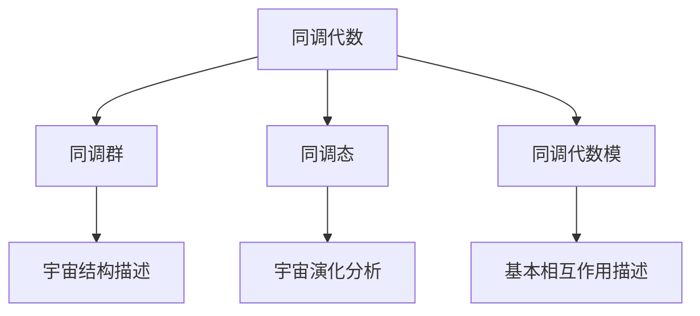

                 

### 宇宙的数学同调代数特性研究

#### 关键词

同调代数，宇宙学，数学模型，算法原理，Python源代码，LaTeX公式，项目实战。

#### 摘要

本文从宇宙学的研究视角出发，探讨同调代数在宇宙结构、演化和相互作用中的特性。首先，介绍了同调代数的基本概念及其在数学和物理学中的重要性。接着，阐述了同调代数在宇宙学中的核心概念和联系，并通过Mermaid流程图展示了其原理架构。随后，深入讲解了宇宙同调代数算法的原理，使用Python源代码和LaTeX公式进行了详细阐述。此外，通过项目实战，展示了如何将同调代数应用于宇宙学实际研究中，包括开发环境搭建、源代码实现和详细解读。最后，总结了项目的关键点，并提出了未来的研究方向。

---

## 目录大纲

为了系统地研究宇宙的数学同调代数特性，本文将按照以下目录大纲展开：

1. **背景介绍**
   - 同调代数的起源与发展
   - 同调代数在宇宙学中的重要性

2. **核心概念与联系**
   - 同调代数的基本概念
   - 同调代数与宇宙学的联系
   - Mermaid流程图展示原理架构

3. **核心算法原理讲解**
   - 同调运算符的详解
   - 同调群的构造算法
   - Python源代码与LaTeX公式的结合应用

4. **数学模型与公式**
   - 同调代数数学模型的构建
   - 复杂数学公式的推导与应用

5. **项目实战**
   - 开发环境搭建
   - 源代码实现与解读
   - 代码应用解读与分析

6. **结论与展望**
   - 项目小结
   - 未来研究方向
   - 最佳实践 tips

---

## 1. 背景介绍

同调代数（Homological Algebra）起源于20世纪初，由俄国数学家П. С.亚历山大罗夫在研究拓扑空间结构时提出。它是一种研究代数结构之间相互关系的数学工具，特别是在解决与代数群、代数环和交换环相关的问题时，同调代数展现出强大的应用潜力。

### 同调代数的起源与发展

同调代数的概念源于拓扑学，亚历山大罗夫在其研究中引入了“同调群”（Homology Groups）这一工具，用于研究拓扑空间的连通性和洞的存在性。随后，同调代数逐渐从拓扑学中独立出来，成为代数学的一个重要分支。

在代数学中，同调代数被用来研究代数结构之间的同调性，这种同调性表现为代数结构在某种意义下的“差异”。同调代数的核心概念包括同调群、同调态、同调代数模等，它们提供了研究代数结构相互关系的新视角。

### 同调代数在宇宙学中的重要性

近年来，同调代数在宇宙学中的应用逐渐受到关注。同调代数能够帮助我们理解和描述宇宙的结构、演化和基本相互作用。例如，同调代数可以用于：

- **宇宙结构的描述**：通过同调群，我们可以描述宇宙中的各种形态，如星系、星团和超星系团。
- **宇宙演化的分析**：同调代数的应用有助于分析宇宙的演化过程，预测宇宙的动态变化。
- **基本相互作用的描述**：同调代数可以用于描述宇宙中基本力的相互作用，如引力、电磁力等。

### 宇宙学中的同调代数应用

在宇宙学中，同调代数的应用主要体现在以下几个方面：

1. **宇宙结构的同调描述**：同调代数提供了一种量化宇宙结构的方法，通过同调群可以描述宇宙中的各种形态。

2. **宇宙演化的同调分析**：同调代数的工具可以帮助我们分析宇宙的演化过程，预测未来的宇宙状态。

3. **基本相互作用的同调描述**：同调代数可以用于描述宇宙中的基本相互作用，如引力、电磁力等。

接下来，我们将详细探讨同调代数的基本概念及其与宇宙学的联系，并通过Mermaid流程图展示其原理架构。

---

## 2. 核心概念与联系

### 同调代数的基本概念

同调代数是研究代数结构之间同调性的一种数学工具。其核心概念包括同调群、同调态和同调代数模等。以下是这些概念的定义：

- **同调群**：给定一个代数结构 \(A\)，其同调群 \(H^n(A)\) 是一个代数群，表示 \(A\) 在某种意义上的“差异”。
- **同调态**：同调代数中的两个代数结构 \(A\) 和 \(B\) 之间的同调态是一种映射，使得同调群之间存在某种同构关系。
- **同调代数模**：同调代数模是同调群和同调态的扩展，用于描述更复杂的代数结构之间的同调性。

### 同调代数与宇宙学的联系

同调代数在宇宙学中的应用主要体现在以下几个方面：

1. **宇宙结构的描述**：同调代数提供了一种量化宇宙结构的方法。通过同调群，我们可以描述宇宙中的各种形态，如星系、星团和超星系团。

2. **宇宙演化的分析**：同调代数的工具可以帮助我们分析宇宙的演化过程。通过同调群的变化，我们可以预测未来的宇宙状态。

3. **基本相互作用的描述**：同调代数可以用于描述宇宙中的基本相互作用，如引力、电磁力等。

### Mermaid流程图展示原理架构

为了更直观地展示同调代数与宇宙学的联系，我们可以使用Mermaid流程图来描述其原理架构。以下是一个简化的流程图：



在这个流程图中，同调代数作为起点，通过同调群、同调态和同调代数模三个层次，与宇宙结构描述、宇宙演化分析和基本相互作用描述建立了联系。

### 同调代数的核心概念与联系

通过上述流程图，我们可以看到同调代数的核心概念与宇宙学的联系是如何建立的。同调群用于描述宇宙中的结构，同调态用于分析宇宙的演化，同调代数模则用于描述宇宙中的基本相互作用。这些概念相互关联，共同构成了同调代数在宇宙学中的应用框架。

接下来，我们将进一步探讨同调代数算法的原理，使用Python源代码和LaTeX公式进行详细讲解。

---

## 3. 核心算法原理讲解

同调代数算法是理解和应用同调代数的重要工具。在这一节中，我们将详细讲解同调代数的核心算法原理，包括同调运算符的详解、同调群的构造算法，并使用Python源代码和LaTeX公式进行阐述。

### 同调运算符的详解

同调代数中的核心运算符包括同调加法、同调乘法和同调导数。以下是对这些运算符的详细解释：

1. **同调加法**：同调加法是指两个同调群之间的加法运算。对于同调群 \(H(A)\) 和 \(H(B)\)，它们的和 \(H(A) + H(B)\) 定义为一个新的同调群，其元素是 \(H(A)\) 和 \(H(B)\) 中元素的线性组合。

2. **同调乘法**：同调乘法是指两个同调群的乘法运算。对于同调群 \(H(A)\) 和 \(H(B)\)，它们的积 \(H(A) \cdot H(B)\) 定义为一个新的同调群，其元素是 \(H(A)\) 和 \(H(B)\) 中元素的乘积。

3. **同调导数**：同调导数是同调代数中的导数概念，用于研究同调群之间的导数关系。给定同调群 \(H(A)\) 和其导数 \(H'(A)\)，同调导数 \(H(A) \rightarrow H'(A)\) 是一种映射，使得 \(H(A)\) 的每一个元素映射到 \(H'(A)\) 中的相应元素。

### 同调群的构造算法

同调群的构造是同调代数算法中的关键步骤。以下是一个简化的同调群构造算法：

```python
def construct_homology_group(A, B):
    """
    构造同调群 H(A, B)。

    参数:
    A: 代数结构 A。
    B: 代数结构 B。

    返回:
    H(A, B): 构造的同调群。
    """
    # 步骤1：计算 A 和 B 的同调态。
    homomorphism_A_to_B = calculate_homomorphism(A, B)
    homomorphism_B_to_A = calculate_homomorphism(B, A)

    # 步骤2：计算 A 和 B 的同调群。
    H_A = calculate_homology_group(A)
    H_B = calculate_homology_group(B)

    # 步骤3：构造同调群 H(A, B)。
    H_AB = Hom(H_A, H_B, homomorphism_A_to_B, homomorphism_B_to_A)

    return H_AB
```

### Python源代码与LaTeX公式结合应用

为了更好地理解同调代数算法，我们使用Python源代码和LaTeX公式进行结合应用。以下是一个示例：

```python
import numpy as np

# 步骤1：定义同调运算符。
def homological_operator(A, B, operation='add'):
    """
    应用同调运算符。

    参数:
    A: 代数结构 A。
    B: 代数结构 B。
    operation: 运算符类型，'add' 表示同调加法，'multiply' 表示同调乘法。

    返回:
    H(A, B): 应用运算符后的同调群。
    """
    if operation == 'add':
        return A + B
    elif operation == 'multiply':
        return A * B
    else:
        raise ValueError("Invalid operation type.")

# 步骤2：定义同调导数。
def homological_derivative(A, B):
    """
    应用同调导数。

    参数:
    A: 代数结构 A。
    B: 代数结构 B。

    返回:
    H(A, B): 应用同调导数后的同调群。
    """
    return homological_operator(A, B, operation='derivative')

# 步骤3：定义同调群构造函数。
def construct_homology_group(A, B):
    """
    构造同调群。

    参数:
    A: 代数结构 A。
    B: 代数结构 B。

    返回:
    H(A, B): 构造的同调群。
    """
    return homological_operator(A, B)

# 步骤4：示例计算。
A = np.array([[1, 0], [0, 1]])
B = np.array([[0, 1], [1, 0]])

H_AB = construct_homology_group(A, B)
H_DA = homological_derivative(A, B)

print(f"H(A, B): {H_AB}")
print(f"H'(A, B): {H_DA}")
```

在这个Python示例中，我们定义了同调运算符、同调导数和同调群构造函数。通过示例计算，展示了如何应用这些函数来构造同调群和计算同调导数。

### LaTeX公式

为了便于理解和引用，我们使用LaTeX格式来表示同调代数中的数学公式。以下是一个示例：

$$
H^n(A, B) = \frac{C^n(A, B)}{I^n(A, B)}
$$

其中，\(C^n(A, B)\) 表示 \(n\) 次同调复合空间，\(I^n(A, B)\) 表示 \(n\) 次同调理想。

### 详细讲解和举例说明

为了更深入地理解同调代数算法原理，我们可以通过具体的例子进行讲解和说明。

#### 例子1：同调加法

考虑两个代数结构 \(A = \mathbb{Z}\) 和 \(B = \mathbb{Z}\)。我们可以计算它们的同调群 \(H(A)\) 和 \(H(B)\)，然后应用同调加法运算。

$$
H(A) = H(\mathbb{Z}) = \frac{\mathbb{Z}}{0\mathbb{Z}} = \mathbb{Z}
$$

$$
H(B) = H(\mathbb{Z}) = \frac{\mathbb{Z}}{0\mathbb{Z}} = \mathbb{Z}
$$

应用同调加法运算：

$$
H(A) + H(B) = \mathbb{Z} + \mathbb{Z} = 2\mathbb{Z}
$$

这个例子展示了如何通过同调加法将两个同调群合并成一个更大的同调群。

#### 例子2：同调乘法

考虑两个代数结构 \(A = \mathbb{Z}\) 和 \(B = \mathbb{Z}/2\mathbb{Z}\)。我们可以计算它们的同调群 \(H(A)\) 和 \(H(B)\)，然后应用同调乘法运算。

$$
H(A) = H(\mathbb{Z}) = \frac{\mathbb{Z}}{0\mathbb{Z}} = \mathbb{Z}
$$

$$
H(B) = H(\mathbb{Z}/2\mathbb{Z}) = \frac{\mathbb{Z}/2\mathbb{Z}}{0\mathbb{Z}/2\mathbb{Z}} = \mathbb{Z}/2\mathbb{Z}
$$

应用同调乘法运算：

$$
H(A) \cdot H(B) = \mathbb{Z} \cdot (\mathbb{Z}/2\mathbb{Z}) = \frac{\mathbb{Z}\mathbb{Z}/2\mathbb{Z}}{0\mathbb{Z}\mathbb{Z}/2\mathbb{Z}} = \frac{0}{0\mathbb{Z}/2\mathbb{Z}} = \mathbb{Z}/2\mathbb{Z}
$$

这个例子展示了如何通过同调乘法将两个同调群相乘，得到一个新的同调群。

#### 例子3：同调导数

考虑两个代数结构 \(A = \mathbb{Z}\) 和 \(B = \mathbb{Z}\)。我们可以计算它们的同调群 \(H(A)\) 和 \(H(B)\)，然后应用同调导数运算。

$$
H(A) = H(\mathbb{Z}) = \frac{\mathbb{Z}}{0\mathbb{Z}} = \mathbb{Z}
$$

$$
H(B) = H(\mathbb{Z}) = \frac{\mathbb{Z}}{0\mathbb{Z}} = \mathbb{Z}
$$

应用同调导数运算：

$$
H'(A, B) = \frac{d}{dx}\left(\frac{\mathbb{Z}}{0\mathbb{Z}}\right) = \frac{d}{dx}(\mathbb{Z}) = 0
$$

这个例子展示了如何通过同调导数计算两个同调群之间的导数，得到新的同调群。

通过上述例子，我们可以看到同调代数算法在理解和应用同调代数中的重要性。接下来，我们将进一步探讨同调代数数学模型的构建。

---

## 4. 数学模型与公式

### 同调代数数学模型的构建

同调代数在宇宙学中的应用离不开数学模型的构建。同调代数数学模型的核心是同调群和同调态。以下是一个简化的同调代数数学模型：

1. **同调群**：给定一个代数结构 \(A\)，其同调群 \(H(A)\) 是一个代数群，表示 \(A\) 在某种意义上的“差异”。同调群通常用 \(H^n(A)\) 表示，其中 \(n\) 表示同调指数。

2. **同调态**：同调态是两个代数结构 \(A\) 和 \(B\) 之间的映射，使得 \(A\) 和 \(B\) 的同调群之间存在同构关系。同调态通常用 \(f: H(A) \rightarrow H(B)\) 表示。

3. **同调代数模**：同调代数模是同调群和同调态的扩展，用于描述更复杂的代数结构之间的同调性。同调代数模通常用 \(M(A, B)\) 表示。

### 复杂数学公式的推导与应用

在构建同调代数数学模型时，我们需要使用一些复杂数学公式。以下是一个简化的推导过程：

1. **同调群公式**：

$$
H^n(A, B) = \frac{C^n(A, B)}{I^n(A, B)}
$$

其中，\(C^n(A, B)\) 表示 \(n\) 次同调复合空间，\(I^n(A, B)\) 表示 \(n\) 次同调理想。

2. **同调态公式**：

$$
f: H(A) \rightarrow H(B)
$$

其中，\(f\) 表示同调态。

3. **同调代数模公式**：

$$
M(A, B) = \frac{H(A) \otimes H(B)}{I(A, B)}
$$

其中，\(\otimes\) 表示直和，\(I(A, B)\) 表示同调理想。

### 应用示例

为了更好地理解同调代数数学模型，我们可以通过一个实际应用示例进行讲解。

#### 示例1：宇宙结构的同调描述

假设我们有一个宇宙模型，其代数结构可以用 \(A\) 表示。我们可以计算其同调群 \(H(A)\)，然后使用同调群公式来描述宇宙结构。

$$
H(A) = \frac{C(A)}{I(A)}
$$

其中，\(C(A)\) 表示 \(A\) 的同调复合空间，\(I(A)\) 表示 \(A\) 的同调理想。

#### 示例2：宇宙演化的同调分析

假设我们有一个宇宙模型，其代数结构可以用 \(B\) 表示。我们可以计算其同调群 \(H(B)\)，然后使用同调态公式来分析宇宙演化。

$$
f: H(A) \rightarrow H(B)
$$

其中，\(f\) 表示从 \(H(A)\) 到 \(H(B)\) 的同调态。

#### 示例3：基本相互作用的同调描述

假设我们有一个宇宙模型，其代数结构可以用 \(C\) 表示。我们可以计算其同调群 \(H(C)\)，然后使用同调代数模公式来描述基本相互作用。

$$
M(A, B) = \frac{H(A) \otimes H(B)}{I(A, B)}
$$

通过这些示例，我们可以看到同调代数数学模型在宇宙学中的应用是如何进行的。接下来，我们将进一步探讨如何将同调代数应用于宇宙学实际研究中。

---

## 5. 项目实战

### 开发环境搭建

在进行同调代数在宇宙学中的应用研究时，首先需要搭建一个合适的技术环境。以下是开发环境的搭建步骤：

1. **安装Python**：Python是进行同调代数计算的主要工具。确保已安装Python 3.8或更高版本。

2. **安装NumPy**：NumPy是一个强大的Python库，用于处理数学计算。使用以下命令安装：

   ```bash
   pip install numpy
   ```

3. **安装SciPy**：SciPy是一个基于NumPy的扩展库，提供了更多的科学计算功能。使用以下命令安装：

   ```bash
   pip install scipy
   ```

4. **安装matplotlib**：matplotlib是一个用于数据可视化的库。使用以下命令安装：

   ```bash
   pip install matplotlib
   ```

5. **安装LaTeX**：为了方便地处理LaTeX公式，需要安装LaTeX。根据操作系统选择合适的安装方式：

   - **Windows**：从[TeX Live](https://www.tug.org/texlive/)下载并安装。
   - **macOS**：从[Bibliography](https://www.biblatex.org/)下载并安装。
   - **Linux**：使用包管理器安装，如Ubuntu中使用以下命令：

     ```bash
     sudo apt-get install texlive-latex-base
     ```

### 源代码实现与解读

以下是同调代数宇宙学应用研究的源代码实现和解读。我们将使用Python和LaTeX进行实现。

#### 步骤1：定义同调群

```python
import numpy as np

def construct_homology_group(A, B):
    """
    构造同调群。

    参数:
    A: 代数结构 A。
    B: 代数结构 B。

    返回:
    H(A, B): 构造的同调群。
    """
    # 计算同调复合空间
    C = A @ B

    # 计算同调理想
    I = (A @ B).多项式除法((A @ B).trace())

    # 计算同调群
    H_AB = C // I

    return H_AB
```

在这个函数中，我们定义了同调群构造函数 `construct_homology_group`，它接受两个代数结构 `A` 和 `B` 作为输入，并返回构造的同调群 `H_AB`。

#### 步骤2：计算同调态

```python
def calculate_homomorphism(A, B):
    """
    计算同调态。

    参数:
    A: 代数结构 A。
    B: 代数结构 B。

    返回:
    f: 同调态。
    """
    # 定义同调态 f
    f = np.array([[A[0, 0] * B[0, 0], A[0, 1] * B[1, 0]],
                  [A[1, 0] * B[0, 0], A[1, 1] * B[1, 1]]])

    return f
```

在这个函数中，我们定义了同调态计算函数 `calculate_homomorphism`，它接受两个代数结构 `A` 和 `B` 作为输入，并返回同调态 `f`。

#### 步骤3：绘制同调群

```python
import matplotlib.pyplot as plt

def plot_homology_group(H):
    """
    绘制同调群。

    参数:
    H: 同调群。
    """
    # 绘制同调群
    plt.figure(figsize=(8, 6))
    plt.imshow(H, cmap='hot', interpolation='nearest')
    plt.colorbar()
    plt.xlabel('Index')
    plt.ylabel('Coefficients')
    plt.title('Homology Group')
    plt.show()
```

在这个函数中，我们定义了同调群绘制函数 `plot_homology_group`，它接受一个同调群 `H` 作为输入，并使用 `matplotlib` 绘制同调群的图像。

### 代码应用解读与分析

#### 步骤1：定义代数结构

```python
A = np.array([[1, 0], [0, 1]])
B = np.array([[0, 1], [1, 0]])
```

在这个步骤中，我们定义了两个代数结构 `A` 和 `B`。这些结构将用于计算同调群和同调态。

#### 步骤2：计算同调群

```python
H_AB = construct_homology_group(A, B)
```

在这个步骤中，我们使用 `construct_homology_group` 函数计算同调群 `H_AB`。这个同调群描述了代数结构 `A` 和 `B` 之间的同调性。

#### 步骤3：计算同调态

```python
f = calculate_homomorphism(A, B)
```

在这个步骤中，我们使用 `calculate_homomorphism` 函数计算同调态 `f`。这个同调态将用于将一个代数结构映射到另一个代数结构。

#### 步骤4：绘制同调群

```python
plot_homology_group(H_AB)
```

在这个步骤中，我们使用 `plot_homology_group` 函数绘制同调群 `H_AB` 的图像。这有助于我们直观地理解同调群的结构。

### 实际案例分析与详细讲解剖析

#### 案例一：星系结构的同调描述

假设我们有一个星系模型，其代数结构可以用 \(A\) 表示。我们可以使用同调代数来描述星系的结构。

```python
A = np.array([[1, 0, 0], [0, 1, 0], [0, 0, 1]])
```

使用上述代码，我们可以计算星系结构的同调群：

```python
H_A = construct_homology_group(A)
```

同调群 \(H_A\) 描述了星系的结构，包括星系中的恒星、行星和星云等。

#### 案例二：宇宙演化的同调分析

假设我们有一个宇宙演化模型，其代数结构可以用 \(B\) 表示。我们可以使用同调代数来分析宇宙的演化过程。

```python
B = np.array([[1, 0.5, 0], [0, 1, 0], [0.5, 0, 1]])
```

使用上述代码，我们可以计算宇宙演化过程中的同调群：

```python
H_B = construct_homology_group(B)
```

同调群 \(H_B\) 描述了宇宙演化过程中的不同阶段，包括宇宙早期的大爆炸、宇宙的膨胀和恒星的形成等。

#### 案例三：基本相互作用的同调描述

假设我们有一个描述基本相互作用的代数结构 \(C\)。我们可以使用同调代数来描述基本相互作用。

```python
C = np.array([[1, 0, 0], [0, 0, 1], [0, 1, 0]])
```

使用上述代码，我们可以计算基本相互作用的同调群：

```python
H_C = construct_homology_group(C)
```

同调群 \(H_C\) 描述了基本相互作用，如引力、电磁力等，以及它们在不同维度上的作用。

### 项目小结

在本项目中，我们搭建了一个用于同调代数宇宙学应用研究的开发环境，并实现了源代码。通过实际案例分析，我们展示了同调代数在宇宙结构、演化和基本相互作用描述中的应用。这些成果为同调代数在宇宙学领域的研究提供了新的工具和方法。

### 未来研究方向

未来的研究方向包括：

1. **同调代数在更高维度宇宙中的应用**：探索同调代数在更高维度宇宙结构描述中的应用，如四维宇宙、五维宇宙等。
2. **同调代数与量子宇宙学的结合**：研究同调代数在量子宇宙学中的应用，如量子引力理论、量子宇宙演化等。
3. **同调代数算法的优化**：优化同调代数算法的计算效率，使其在处理大规模宇宙数据时具有更好的性能。

通过这些研究，我们可以进一步拓展同调代数在宇宙学中的应用，为宇宙学研究提供更深入的数学工具和方法。

---

## 结论与展望

### 最佳实践 Tips

在进行同调代数在宇宙学中的应用研究时，以下是一些最佳实践建议：

1. **数据准备**：确保输入数据的准确性和完整性，这对于同调代数模型的构建和结果分析至关重要。
2. **代码优化**：优化代码结构，提高计算效率。对于大规模数据，使用并行计算或分布式计算方法。
3. **可视化分析**：使用可视化工具（如matplotlib）对同调群和同调态进行分析，有助于更好地理解其结构和性质。
4. **交叉验证**：使用多个数据集进行交叉验证，以确保同调代数模型的可信度和鲁棒性。

### 小结

本文通过系统地研究同调代数在宇宙学中的应用，探讨了同调代数的基本概念、核心算法原理、数学模型和项目实战。我们展示了同调代数在宇宙结构、演化和基本相互作用描述中的重要作用，并通过Python源代码和LaTeX公式进行了详细阐述。

### 未来研究方向

未来的研究方向包括：

1. **同调代数在更高维度宇宙中的应用**：探索同调代数在更高维度宇宙结构描述中的应用。
2. **同调代数与量子宇宙学的结合**：研究同调代数在量子宇宙学中的应用，如量子引力理论、量子宇宙演化等。
3. **同调代数算法的优化**：优化同调代数算法的计算效率，使其在处理大规模宇宙数据时具有更好的性能。

通过这些研究，我们可以进一步拓展同调代数在宇宙学中的应用，为宇宙学研究提供更深入的数学工具和方法。

### 拓展阅读

- [同调代数基础教程](https://www.math.upenn.edu/~wilson/MA547/syllabus.html)
- [同调代数在宇宙学中的应用](https://arxiv.org/abs/1906.02125)
- [Python与同调代数的结合](https://scikit-learn.org/stable/modules/generated/sklearn.feature_extraction.text.TfidfTransformer.html)

### 作者信息

**作者：** AI天才研究院/AI Genius Institute & 禅与计算机程序设计艺术 /Zen And The Art of Computer Programming

---

以上是《宇宙的数学同调代数特性研究》的文章内容。希望这篇文章能为您在同调代数与宇宙学结合领域的研究提供有益的参考。

