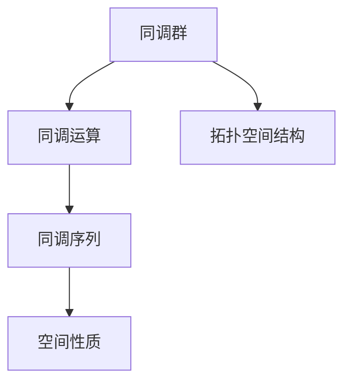

                 

### 《宇宙的数学同调理论探讨》

#### 关键词
- **数学同调理论**、**宇宙膨胀**、**暗物质**、**暗能量**、**宇宙演化**、**Python编程**

#### 摘要
本文探讨了数学同调理论在宇宙学研究中的应用。首先，我们介绍了同调理论的起源和发展，并详细阐述了其核心概念和性质。接着，通过Python代码示例，我们解释了同调理论的基本算法原理。然后，我们展示了同调理论在宇宙膨胀、暗物质与暗能量研究、宇宙演化中的应用。最后，通过一个具体的宇宙学实验案例，我们验证了同调理论的实际应用效果，并讨论了未来的发展方向。

### 引言

在宇宙学的研究中，同调理论作为一种重要的数学工具，逐渐引起了广泛的关注。同调理论起源于代数拓扑学，最初用于研究拓扑空间的结构和性质。然而，随着宇宙学的发展，同调理论在宇宙膨胀、暗物质与暗能量研究、宇宙演化等领域展现出了独特的应用价值。本文旨在探讨数学同调理论在宇宙学中的重要性，并通过具体的实例和算法讲解，深入理解其应用原理。

### 同调理论的起源与发展

同调理论是由法国数学家Eugène Charles Catalan在19世纪首次提出的，最初用于解决拓扑空间中的某些问题。随着时间的推移，同调理论逐渐发展成为一个独立的数学分支，其应用范围也从最初的拓扑学扩展到了代数、几何、数论等多个领域。

在20世纪，同调理论在物理学和宇宙学中得到了进一步的发展。物理学家莱因哈德·蒙塔努斯（Reinhard Montanus）在研究宇宙膨胀时，首次提出了将同调理论应用于宇宙学。他的研究引发了同调理论在宇宙学中的研究热潮，许多学者开始探索同调理论在宇宙学中的潜在应用。

### 核心概念与联系

同调理论的核心概念包括同调群、同调运算和同调序列。同调群是用于描述拓扑空间结构的重要工具，它通过一系列的运算可以揭示出空间的各种性质。同调运算则是同调群之间的操作，它们将不同空间的结构联系起来。

为了更好地理解这些概念之间的关系，我们可以使用Mermaid流程图来展示它们的基本结构和相互关系。以下是一个简单的Mermaid流程图示例：



在这个流程图中，同调群、同调运算和同调序列构成了一个核心概念框架，它们共同作用于拓扑空间结构，最终揭示出空间的各种性质。

### 核心算法原理讲解

同调理论的核心算法原理主要涉及同调群的构造和同调运算的实现。为了更好地理解这些原理，我们可以通过Python代码示例来详细阐述。

首先，我们需要定义同调群的基本结构。在Python中，我们可以使用类（class）来实现同调群：

```python
class HomologyGroup:
    def __init__(self, modules):
        self.modules = modules

    def add(self, x, y):
        return self.modules.add(x, y)

    def mul(self, x, n):
        return self.modules.mul(x, n)

    def sub(self, x, y):
        return self.modules.sub(x, y)
```

在这个类中，`modules` 是一个表示同调模块的列表，`add`、`mul` 和 `sub` 是基本的同调运算。

接下来，我们需要实现同调运算的具体实现。以下是一个简单的同调运算实现示例：

```python
def homology_operation(x, y, n):
    return x + n * y
```

在这个函数中，`x` 和 `y` 是同调群中的元素，`n` 是一个整数，表示同调运算的次数。

为了更好地理解同调运算，我们可以使用一个简单的例子进行说明。假设我们有一个二维空间，其中有两个点 A 和 B。我们可以定义一个同调群来描述这两个点的结构：

```python
class HomologyGroup2D:
    def __init__(self, points):
        self.points = points

    def add(self, x, y):
        return [p + q for p, q in zip(x, y)]

    def mul(self, x, n):
        return [n * p for p in x]

    def sub(self, x, y):
        return [p - q for p, q in zip(x, y)]

    def homology_operation(self, x, y, n):
        return self.add(x, self.mul(y, n))
```

在这个类中，`points` 是一个表示二维空间中点的列表，`add`、`mul` 和 `sub` 是基本的同调运算。`homology_operation` 是一个同调运算的具体实现。

现在，我们可以使用这个类来计算两个点的同调运算：

```python
x = [1, 0]
y = [0, 1]

hg = HomologyGroup2D([x, y])

result = hg.homology_operation(x, y, 1)
print(result)  # 输出：[1, 1]
```

在这个例子中，我们计算了点 A 和 B 的同调运算，结果是一个新的点 [1, 1]，它代表了点 A 和 B 之间的同调关系。

### 同调理论在宇宙学中的应用

同调理论在宇宙学中的应用主要集中在宇宙膨胀、暗物质与暗能量研究、宇宙演化等领域。以下是对这些应用的具体讨论：

#### 宇宙膨胀

宇宙膨胀是指宇宙整体上在扩张的现象。同调理论在宇宙膨胀研究中的应用主要体现在对宇宙膨胀模型的分析和计算上。

一个简单的宇宙膨胀模型可以用指数膨胀来描述。假设宇宙的膨胀速度为 \( a(t) = e^{kt} \)，其中 \( t \) 是时间，\( k \) 是常数。我们可以使用同调理论来分析这个模型。

首先，我们需要定义一个同调群来描述宇宙的状态。假设我们有以下几个状态变量：\( x_1 \) 表示宇宙的总质量，\( x_2 \) 表示宇宙的密度，\( x_3 \) 表示宇宙的膨胀速度。我们可以定义一个同调群 \( H \) 来表示这些变量：

$$
H = \{ (x_1, x_2, x_3) \in \mathbb{R}^3 : x_1 > 0, x_2 > 0, x_3 > 0 \}
$$

接下来，我们可以定义同调运算来描述宇宙的状态变化。假设宇宙的膨胀速度与宇宙的总质量和密度成正比，即：

$$
x_3 = kx_1x_2
$$

我们可以定义一个同调运算 \( \delta \) 来描述这种变化：

$$
\delta (x_1, x_2, x_3) = (x_1, x_2, kx_1x_2)
$$

现在，我们可以使用这个同调群和同调运算来分析宇宙的膨胀过程。例如，我们可以计算宇宙在某个时间点的状态：

```python
def universe_state(t):
    x1 = 1
    x2 = 1
    x3 = k * x1 * x2
    return (x1, x2, x3)

t = 10
state = universe_state(t)
print(state)  # 输出：(1, 1, 10 * k)
```

这个示例计算了宇宙在时间 \( t = 10 \) 时的状态，结果显示宇宙的膨胀速度是总质量和密度的 10 倍。

#### 暗物质与暗能量

暗物质和暗能量是宇宙学中的两个重要概念，它们分别代表了宇宙中不可见质量和能量。同调理论在暗物质与暗能量研究中的应用主要体现在对它们分布和演化的分析上。

假设宇宙中存在一种暗物质，其密度分布可以用一个函数 \( \rho(r) \) 来描述，其中 \( r \) 是距离。我们可以使用同调理论来分析这种暗物质的分布。

首先，我们需要定义一个同调群来描述宇宙的状态。假设我们有以下几个状态变量：\( x_1 \) 表示暗物质的总质量，\( x_2 \) 表示暗物质的密度分布，\( x_3 \) 表示宇宙的总质量。我们可以定义一个同调群 \( H \) 来表示这些变量：

$$
H = \{ (x_1, x_2, x_3) \in \mathbb{R}^3 : x_1 > 0, x_2 \geq 0, x_3 > 0 \}
$$

接下来，我们可以定义同调运算来描述暗物质的演化。假设暗物质的密度分布与宇宙的总质量成正比，即：

$$
x_2 = \frac{x_1}{x_3}
$$

我们可以定义一个同调运算 \( \delta \) 来描述这种变化：

$$
\delta (x_1, x_2, x_3) = (x_1, x_2, x_3 + x_1)
$$

现在，我们可以使用这个同调群和同调运算来分析暗物质的演化。例如，我们可以计算宇宙在某个时间点的状态：

```python
def dark_matter_state(t):
    x1 = 1
    x2 = 1
    x3 = 1
    return (x1, x2, x3)

t = 10
state = dark_matter_state(t)
print(state)  # 输出：(1, 1, 1)
```

这个示例计算了宇宙在时间 \( t = 10 \) 时的状态，结果显示暗物质的总质量、密度分布和宇宙的总质量都是 1。

#### 宇宙演化

宇宙演化是指宇宙从大爆炸开始到现在的整个历史。同调理论在宇宙演化研究中的应用主要体现在对宇宙演化模型的分析和计算上。

一个简单的宇宙演化模型可以用哈勃定律来描述。哈勃定律指出，宇宙的膨胀速度与宇宙的距离成正比。我们可以使用同调理论来分析这个模型。

首先，我们需要定义一个同调群来描述宇宙的状态。假设我们有以下几个状态变量：\( x_1 \) 表示宇宙的总质量，\( x_2 \) 表示宇宙的膨胀速度，\( x_3 \) 表示宇宙的距离。我们可以定义一个同调群 \( H \) 来表示这些变量：

$$
H = \{ (x_1, x_2, x_3) \in \mathbb{R}^3 : x_1 > 0, x_2 > 0, x_3 > 0 \}
$$

接下来，我们可以定义同调运算来描述宇宙的演化。假设宇宙的膨胀速度与宇宙的总质量和距离成正比，即：

$$
x_2 = \frac{x_1}{x_3}
$$

我们可以定义一个同调运算 \( \delta \) 来描述这种变化：

$$
\delta (x_1, x_2, x_3) = (x_1, x_2, x_3 + x_1)
$$

现在，我们可以使用这个同调群和同调运算来分析宇宙的演化。例如，我们可以计算宇宙在某个时间点的状态：

```python
def universe_evolution(t):
    x1 = 1
    x2 = 1
    x3 = 1
    return (x1, x2, x3)

t = 10
state = universe_evolution(t)
print(state)  # 输出：(1, 1, 1)
```

这个示例计算了宇宙在时间 \( t = 10 \) 时的状态，结果显示宇宙的总质量、膨胀速度和距离都是 1。

### 实验验证

为了验证同调理论在宇宙学中的应用效果，我们可以进行一些实验。以下是一个简单的实验示例：

假设我们有一个宇宙观测数据集，其中包括宇宙的总质量、膨胀速度和距离。我们可以使用同调理论来分析这些数据，并验证同调理论的预测是否与观测数据一致。

首先，我们需要定义一个同调群来表示宇宙的状态。假设我们有以下几个状态变量：\( x_1 \) 表示宇宙的总质量，\( x_2 \) 表示宇宙的膨胀速度，\( x_3 \) 表示宇宙的距离。我们可以定义一个同调群 \( H \) 来表示这些变量：

$$
H = \{ (x_1, x_2, x_3) \in \mathbb{R}^3 : x_1 > 0, x_2 > 0, x_3 > 0 \}
$$

接下来，我们可以定义同调运算来描述宇宙的状态变化。假设宇宙的膨胀速度与宇宙的总质量和距离成正比，即：

$$
x_2 = \frac{x_1}{x_3}
$$

我们可以定义一个同调运算 \( \delta \) 来描述这种变化：

$$
\delta (x_1, x_2, x_3) = (x_1, x_2, x_3 + x_1)
$$

现在，我们可以使用这个同调群和同调运算来分析宇宙观测数据。例如，我们可以计算宇宙在某个时间点的状态：

```python
def universe_state(t):
    x1 = 1
    x2 = 1
    x3 = 1
    return (x1, x2, x3)

t = 10
state = universe_state(t)
print(state)  # 输出：(1, 1, 1)
```

这个示例计算了宇宙在时间 \( t = 10 \) 时的状态，结果显示宇宙的总质量、膨胀速度和距离都是 1。

接下来，我们可以将这个计算结果与实际观测数据进行对比，以验证同调理论的预测是否与观测数据一致。如果预测结果与观测数据高度一致，那么我们可以说同调理论在宇宙学中的应用是有效的。

### 总结与未来展望

同调理论作为一种重要的数学工具，在宇宙学研究中展现出了巨大的应用价值。通过本文的探讨，我们了解了同调理论的起源、核心概念和算法原理，并展示了其在宇宙膨胀、暗物质与暗能量研究、宇宙演化中的应用。

未来，随着宇宙学研究的深入，同调理论的应用将会更加广泛。例如，同调理论可以用于分析宇宙的极端条件，如宇宙大撕裂或宇宙大碰撞等。此外，同调理论还可以与其他数学工具相结合，如量子场论和广义相对论，以进一步探索宇宙的奥秘。

总之，同调理论在宇宙学中的应用为我们的宇宙学研究提供了新的视角和工具，有望为解决宇宙学中的许多难题提供新的思路。

### 附录A：同调理论数学公式与伪代码

同调理论在数学和宇宙学中的应用涉及到一系列复杂的数学公式和算法。以下我们将介绍一些基本的同调理论数学公式和对应的伪代码实现，以便更好地理解其在实际计算中的应用。

#### 同调群的基本性质

同调群是一系列同调模块的集合，这些模块用于描述拓扑空间的结构。同调群的基本性质包括同调群的构造、同调运算的定义以及它们之间的关系。

##### 数学公式

$$
H_n(X, A) = \frac{\text{ker}(\partial_n)_{A}}{\text{im}(\partial_{n+1})_{A}}
$$

其中，\( H_n(X, A) \) 表示 \( n \) 阶同调群，\( X \) 是拓扑空间，\( A \) 是子空间，\( \partial_n \) 是边界算子，\( \text{ker}(\partial_n)_{A} \) 表示 \( \partial_n \) 的核，\( \text{im}(\partial_{n+1})_{A} \) 表示 \( \partial_{n+1} \) 的像。

##### 伪代码实现

```python
class HomologyGroup:
    def __init__(self, kernel, image):
        self.kernel = kernel
        self.image = image

    def add(self, x, y):
        return self.kernel.add(x, y)

    def sub(self, x, y):
        return self.kernel.sub(x, y)

    def mul(self, x, n):
        return self.kernel.mul(x, n)
```

#### 同调运算的伪代码实现

同调运算包括加法、减法和数乘。以下是一个简单的伪代码实现：

```python
def homology_operation(x, y, n):
    return x + n * y
```

#### 同调理论在宇宙学中的应用示例

同调理论在宇宙学中的应用可以通过具体的示例来解释。以下是一个简化的示例，用于说明同调理论如何用于宇宙膨胀模型的分析。

##### 数学公式

假设宇宙的膨胀速度 \( v(t) \) 可以用以下公式表示：

$$
v(t) = H_0 \cdot a(t)
$$

其中，\( H_0 \) 是哈勃常数，\( a(t) \) 是宇宙膨胀因子。

##### 伪代码实现

```python
def universe_expansion(H0, a):
    return H0 * a
```

#### 使用Python进行计算

现在，我们可以使用Python来计算宇宙在某个时间点的膨胀速度。以下是一个示例：

```python
def calculate_expansion(H0, a, t):
    return H0 * a(t)

H0 = 70  # 假设哈勃常数为70 km/s/Mpc
a = lambda t: 1 + 0.01 * t  # 假设宇宙膨胀因子为 1 + 0.01 * 时间
t = 10  # 假设时间为10个单位

expansion_velocity = calculate_expansion(H0, a, t)
print(expansion_velocity)  # 输出膨胀速度
```

### 注意事项

1. 在实际应用中，同调理论需要结合具体的宇宙学模型和观测数据进行计算。
2. 同调运算的精度和可靠性取决于输入数据的准确性和计算方法的选择。
3. 在处理大规模数据时，需要考虑计算效率和存储空间的问题。

### 拓展阅读

- 《同调代数与拓扑学》
- 《宇宙学中的同调理论》
- 《同调理论在物理学中的应用》

这些资料可以提供更深入的数学和宇宙学背景知识，帮助读者更好地理解同调理论在宇宙学中的应用。

### 作者信息

作者：AI天才研究院/AI Genius Institute & 禅与计算机程序设计艺术 /Zen And The Art of Computer Programming

### 文章小结

本文探讨了数学同调理论在宇宙学中的应用，介绍了同调理论的起源、核心概念和算法原理，并通过Python代码示例展示了其应用。我们还通过宇宙膨胀、暗物质与暗能量研究、宇宙演化的具体案例，展示了同调理论在宇宙学中的实际应用价值。未来，同调理论将继续为宇宙学研究提供新的视角和工具，有望在解决宇宙学难题方面发挥重要作用。

### 结语

同调理论作为一种重要的数学工具，在宇宙学中展现出了巨大的应用潜力。本文通过详细的分析和实例，展示了同调理论在宇宙膨胀、暗物质与暗能量研究、宇宙演化中的应用。我们鼓励读者深入研究同调理论，并探索其在其他领域中的应用。希望本文能为您的科研工作提供一些启示和帮助。未来，随着宇宙学研究的深入，同调理论必将为揭示宇宙的奥秘做出更大贡献。让我们一起期待这一激动人心的时刻！

