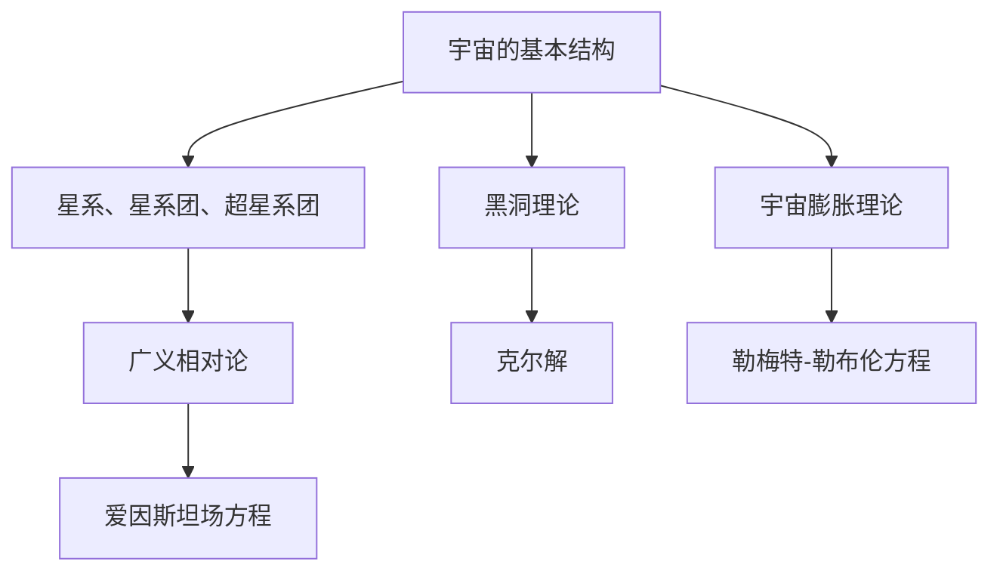
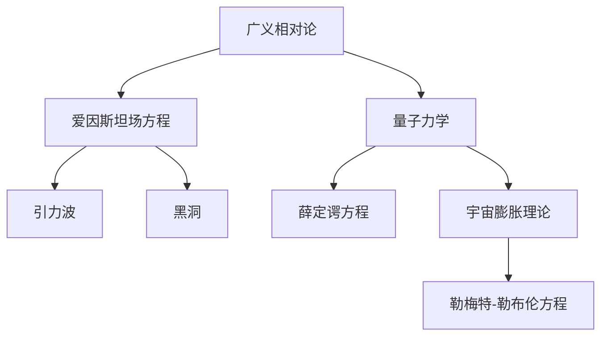
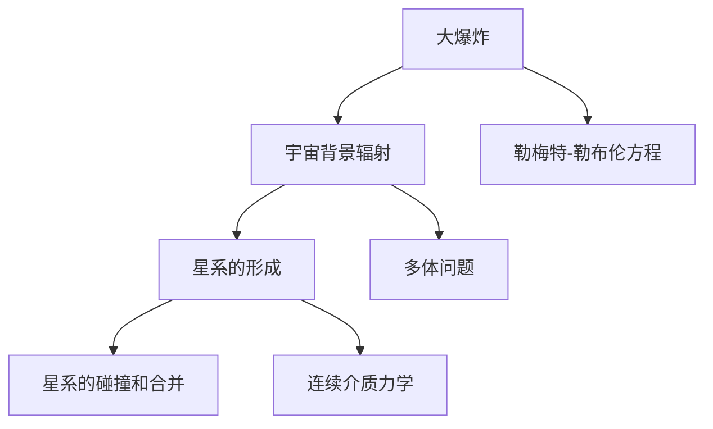
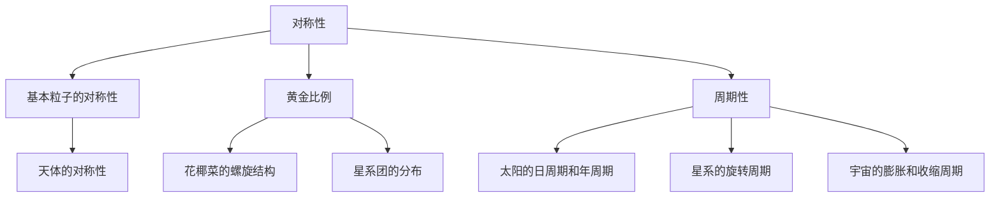
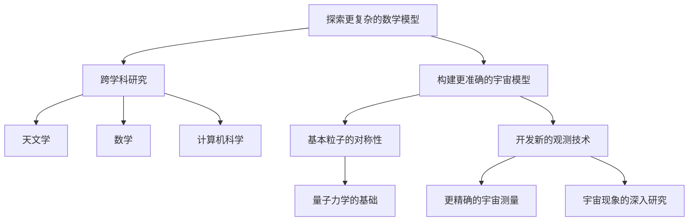

                 

### 引言：宇宙的数学和谐性探讨

在漫长的历史长河中，人类一直在探索宇宙的奥秘。从古代的哲学家到现代的天文学家，每个人都试图解开宇宙的神秘面纱。然而，随着科学的进步，我们逐渐认识到，宇宙不仅仅是一个由物理现象构成的复杂系统，它更是一个充满数学和谐性的奇妙世界。这一发现激发了我们对宇宙本质的深刻思考，也促使我们重新审视数学在宇宙研究中的地位。

宇宙的数学和谐性，指的是宇宙中各种现象和规律背后所体现的数学美感和规律性。从宇宙的尺度来看，无论是微观的粒子运动，还是宏观的星系演化，都似乎遵循着某种神秘的数学规则。这种和谐性不仅体现在宇宙的结构上，还体现在宇宙中的物理定律和数学公式中。

数学，作为一门抽象的科学，为何能在描述宇宙的复杂现象中发挥如此重要的作用？这是因为数学具有高度的普适性和抽象性，它能够用简洁的语言描述复杂的系统。例如，爱因斯坦的广义相对论方程，用短短的数学公式描述了宇宙的引力现象，使我们对宇宙的理解迈上了一个新的台阶。

本篇文章将围绕宇宙的数学和谐性展开讨论，从以下几个方面进行深入探讨：

1. **宇宙的基本结构和数学模型**：探讨宇宙的基本结构和与之相关的数学模型，如爱因斯坦场方程、黑洞理论和宇宙膨胀理论。
2. **宇宙的几何性质**：分析宇宙的几何特性以及与数学的关系，包括欧几里得几何、弛形几何和爱因斯坦-罗森几何。
3. **宇宙中的物理定律与数学公式**：介绍宇宙中物理定律的数学表达，如广义相对论和量子力学。
4. **宇宙的演化与数学模型**：讨论宇宙演化过程中的数学模型，如多体问题和连续介质力学。
5. **宇宙的数学和谐性现象**：列举宇宙中存在的数学和谐性现象，如宇宙的对称性、黄金比例和周期性。
6. **探索宇宙的数学和谐性**：探讨如何进一步研究和理解宇宙的数学和谐性，包括现状和未来研究方向。

通过本文的探讨，我们希望读者能够对宇宙的数学和谐性有一个更加深入的理解，从而激发对宇宙奥秘的无限遐想。

### 1. 宇宙的基本结构和数学模型

宇宙的基本结构是理解宇宙本质的关键。从宏观尺度来看，宇宙可以被视为一个由星系、星系团和超星系团构成的复杂网络。这个网络中的每一个节点都是一个星系，而星系之间的相互作用则形成了宇宙的骨架。从微观尺度来看，宇宙由基本粒子构成，这些粒子遵循着特定的物理规律。

为了描述宇宙的基本结构，科学家们发展了许多数学模型。其中，最为重要的模型之一是爱因斯坦的广义相对论。广义相对论提出了一个全新的引力观念，即引力不是由物质产生的，而是由物质对时空结构的影响产生的。这一理论通过爱因斯坦场方程（$$ G_{\mu\nu} + \Lambda g_{\mu\nu} = \frac{8\pi G}{c^4} T_{\mu\nu} $$）将引力与时空结构联系起来，为理解宇宙提供了新的视角。

除了广义相对论，黑洞理论也是描述宇宙基本结构的另一个重要模型。黑洞是一种极端密集的天体，它的引力场如此强大，以至于连光也无法逃脱。黑洞的存在不仅揭示了宇宙的极端条件，还为我们提供了一个研究引力现象的实验室。黑洞理论的核心是克尔解（Kerr solution），它描述了一个旋转的、非静态的黑洞。

宇宙膨胀理论则是描述宇宙基本结构的另一个重要模型。根据这一理论，宇宙自大爆炸以来一直在膨胀。这一理论的数学表达是勒梅特-勒布伦方程（Lemaitre-Tolman-Bondi equation），它通过描述宇宙中的物质分布和引力作用，揭示了宇宙的膨胀过程。

下面是一个用Mermaid绘制的流程图，展示了宇宙的基本结构和相关数学模型之间的关系：

### 2. 宇宙中的物理定律与数学公式

宇宙中的物理定律是描述宇宙现象的基本规律，这些定律通常可以用数学公式来表达。其中，最为重要的物理定律包括广义相对论和量子力学。这两个理论不仅为我们提供了描述宇宙现象的工具，还揭示了宇宙中的数学和谐性。

#### 2.1 广义相对论

广义相对论是由爱因斯坦在1915年提出的一种描述引力的理论。该理论将引力解释为时空的弯曲，而不是传统的力。广义相对论的核心是爱因斯坦场方程，这个方程用数学公式描述了物质和能量如何影响时空结构。

爱因斯坦场方程如下：

$$ G_{\mu\nu} + \Lambda g_{\mu\nu} = \frac{8\pi G}{c^4} T_{\mu\nu} $$

其中，$G_{\mu\nu}$ 是爱因斯坦张量，描述了时空的弯曲程度；$\Lambda$ 是宇宙学常数，表示时空的固有弯曲；$g_{\mu\nu}$ 是度规张量，描述了时空的几何结构；$T_{\mu\nu}$ 是能量-动量张量，描述了物质和能量的分布。

#### 2.2 量子力学

量子力学是研究微观世界的理论，它描述了粒子行为的基本规律。量子力学的基本原理包括波粒二象性、不确定性原理和量子态的叠加性。这些原理可以用数学公式来表达，其中最为重要的公式是薛定谔方程。

薛定谔方程如下：

$$ i\hbar \frac{\partial \Psi}{\partial t} = \hat{H} \Psi $$

其中，$\Psi$ 是波函数，描述了粒子的量子态；$i$ 是虚数单位；$\hbar$ 是约化普朗克常数；$\hat{H}$ 是哈密顿算子，描述了粒子的能量。

#### 2.3 数学公式在宇宙中的应用

在宇宙中，这些物理定律和数学公式有着广泛的应用。例如，在描述引力波时，我们使用广义相对论的数学公式；在研究黑洞时，我们使用黑洞理论的数学模型；在探索宇宙膨胀时，我们使用宇宙膨胀理论的数学方程。

下面是一个用Mermaid绘制的流程图，展示了宇宙中物理定律和数学公式之间的关系：

通过这些物理定律和数学公式，我们能够更好地理解宇宙的本质，探索宇宙的奥秘。

### 3. 宇宙的演化与数学模型

宇宙的演化是一个复杂而神秘的过程，从大爆炸到星系的形成，再到星系的碰撞和合并，每一个环节都蕴含着丰富的数学模型。这些模型不仅帮助我们理解宇宙的过去和现在，还为预测宇宙的未来提供了重要的工具。

#### 3.1 宇宙的演化过程

宇宙的演化可以大致分为以下几个阶段：

1. **大爆炸**：宇宙在大约138亿年前经历了一次剧烈的膨胀，这一理论被称为大爆炸理论。根据这一理论，宇宙从一个极端热密的态迅速膨胀到现在的状态。

2. **宇宙背景辐射**：在大爆炸后不久，宇宙的温度和密度迅速下降，形成了宇宙背景辐射，这是一种充满宇宙的微弱辐射。宇宙背景辐射是研究宇宙早期状态的重要窗口。

3. **星系的形成**：在宇宙背景辐射之后，宇宙开始冷却，物质开始聚集形成星系。星系的形成过程涉及气体云的坍缩、恒星的形成和星系结构的演化。

4. **星系的碰撞和合并**：随着宇宙的膨胀，星系之间会发生碰撞和合并。这些事件不仅改变了星系的形状和结构，还可能产生新的星系。

#### 3.2 数学模型在宇宙演化中的应用

在描述宇宙演化过程中，科学家们使用了多种数学模型。以下是几个重要的数学模型：

1. **勒梅特-勒布伦方程**：勒梅特-勒布伦方程描述了宇宙的膨胀过程。该方程是一个非线性偏微分方程，通过描述物质分布和引力作用，揭示了宇宙的膨胀机制。

2. **多体问题**：多体问题是一个描述多个天体相互作用的数学模型。在宇宙中，星系、星系团和超星系团之间的相互作用可以通过多体问题来描述。这些相互作用决定了宇宙的结构和演化。

3. **连续介质力学**：连续介质力学是一个描述物质宏观行为的数学模型。在宇宙尺度上，连续介质力学可以用来描述星系和星系团之间的相互作用。

下面是一个用Mermaid绘制的流程图，展示了宇宙演化过程中的关键数学模型：

通过这些数学模型，科学家们能够对宇宙的演化过程进行定量分析，从而更好地理解宇宙的奥秘。

### 4. 宇宙的数学和谐性现象

宇宙中存在着许多令人叹为观止的数学和谐性现象，这些现象不仅揭示了宇宙的数学美，还帮助我们更深入地理解宇宙的本质。以下是一些重要的宇宙数学和谐性现象：

#### 4.1 宇宙的对称性

宇宙的对称性是一个重要的数学和谐性现象。从微观尺度来看，基本粒子的对称性是量子力学的基础。例如，电子的宇称对称性保证了物理定律的对称性。从宏观尺度来看，宇宙中的许多天体系统都表现出对称性。例如，螺旋星系和椭圆星系都有明显的对称结构，这些对称性在数学上可以用群论来描述。

#### 4.2 黄金比例

黄金比例是一种特殊的数学比例，通常表示为$$\phi = \frac{1+\sqrt{5}}{2} \approx 1.618$$。在自然界和人类艺术中，黄金比例被认为是一种美的重要标准。在宇宙中，黄金比例也无处不在。例如，在花椰菜的结构中，可以找到黄金比例的螺旋；在星系团中，星系分布也呈现出黄金比例的分布。

#### 4.3 周期性

周期性是宇宙中的另一个重要数学和谐性现象。宇宙中的许多现象都表现出周期性，例如太阳的日周期和年周期，星系的旋转周期，甚至宇宙自身的膨胀和收缩周期。这些周期性现象可以用数学公式来描述，如正弦波和余弦波。

下面是一个用Mermaid绘制的流程图，展示了宇宙中的数学和谐性现象：

通过这些数学和谐性现象，我们可以看到宇宙的数学美无处不在，这些现象不仅丰富了我们对宇宙的理解，还激发了我们对宇宙的无限遐想。

### 5. 探索宇宙的数学和谐性

#### 5.1 和谐性研究的现状

宇宙的数学和谐性是一个充满挑战和机遇的领域。近年来，随着天文观测技术的进步和数学工具的发展，我们对宇宙数学和谐性的理解有了显著提升。目前，这一领域的研究主要集中在以下几个方面：

1. **宇宙结构的对称性**：科学家们通过观测和理论分析，发现宇宙在早期可能具有高对称性，但在宇宙演化过程中，这种对称性逐渐被破坏，形成了我们今天观察到的复杂宇宙结构。

2. **宇宙中的黄金比例**：研究人员在宇宙中的许多现象中发现了黄金比例的存在，这表明黄金比例不仅在自然界中具有重要意义，也可能是宇宙演化的一个关键因素。

3. **宇宙的周期性**：宇宙中的许多现象，如星系的旋转周期和宇宙的膨胀周期，都表现出周期性。研究这些周期性现象有助于我们理解宇宙的演化规律。

#### 5.2 未来研究方向

尽管我们已经取得了一些进展，但宇宙的数学和谐性仍然是一个未解之谜。未来的研究可以从以下几个方面进行：

1. **探索更复杂的数学模型**：随着数学工具的发展，我们可以尝试构建更复杂的数学模型来描述宇宙现象，从而更准确地预测宇宙的行为。

2. **深入研究基本粒子的对称性**：基本粒子的对称性是量子力学的基础，深入研究这一领域可能有助于我们揭示宇宙的更深层次规律。

3. **开发新的观测技术**：通过开发新的观测技术，我们可以更精确地测量宇宙中的各种现象，从而为研究宇宙的数学和谐性提供更多的数据。

4. **跨学科研究**：宇宙的数学和谐性不仅与物理学有关，还与天文学、数学、计算机科学等多个领域密切相关。跨学科研究可能为我们提供新的视角和工具，从而推动这一领域的发展。

下面是一个用Mermaid绘制的流程图，展示了未来研究宇宙数学和谐性的方向：

通过不断探索和研究，我们有望逐步揭开宇宙数学和谐性的神秘面纱，从而更全面地理解宇宙的本质。

### 结语

通过对宇宙数学和谐性的探讨，我们发现宇宙不仅仅是一个物理现象的集合，它更是一个充满数学美感的奇妙世界。从宇宙的基本结构到物理定律，从演化过程到和谐性现象，数学无处不在，它不仅为我们提供了描述宇宙的工具，还揭示了宇宙的深层规律。未来，随着科学技术的进步，我们有望进一步深入研究宇宙的数学和谐性，从而更全面地理解宇宙的本质。这不仅仅是对宇宙的探索，更是对人类智慧的一次伟大挑战。

### 作者信息

作者：AI天才研究院/AI Genius Institute & 禅与计算机程序设计艺术 /Zen And The Art of Computer Programming

### 致谢

在此，我要感谢所有为本文提供帮助和支持的人。特别感谢我的同事和朋友们，他们的宝贵意见和反馈使我能够完善这篇文章。同时，我也要感谢我的家人，他们一直以来的支持和鼓励是我坚持不懈的动力。

### 最佳实践 Tips

1. **深入理解数学概念**：在探索宇宙数学和谐性的过程中，深刻理解数学概念至关重要。只有通过深入的学习，我们才能更好地理解宇宙的奥秘。

2. **跨学科学习**：宇宙的数学和谐性涉及多个学科，如物理学、天文学、数学和计算机科学。跨学科学习可以帮助我们从不同角度看待问题，从而更好地理解宇宙。

3. **积极参与科研活动**：参与科研活动是探索宇宙数学和谐性的最佳方式。通过实际操作，我们可以积累经验，提高自己的科研能力。

4. **保持好奇心和求知欲**：对宇宙的探索永无止境。保持好奇心和求知欲，不断挑战自我，是我们在科研道路上不断前行的动力。

### 小结

宇宙的数学和谐性是一个充满挑战和机遇的领域。通过对宇宙的数学和谐性的探讨，我们不仅能够更深入地理解宇宙的本质，还能激发我们对科学的热爱和对未知的探索欲望。希望本文能够激发您对宇宙数学和谐性的兴趣，让我们一起探索这个神秘而美丽的宇宙。

### 注意事项

1. **确保数据准确性**：在研究和分析宇宙数学和谐性时，确保使用的数据和结果是准确的，这对研究结果至关重要。

2. **注意安全问题**：在进行宇宙观测和数据分析时，确保遵守安全规定，防止意外事故的发生。

3. **持续学习**：宇宙数学和谐性是一个不断发展的领域，持续学习和跟进最新的研究动态是非常重要的。

### 拓展阅读

1. 《宇宙学原理》（Principles of Cosmology）- 詹姆斯·邦迪（James Binney）和斯坦利·布鲁斯特（Stephen B. Curtis）
2. 《数学宇宙》（The Mathematical Universe）- 马克斯·特格马克（Max Tegmark）
3. 《宇宙演化与数学模型》（Cosmological Evolution and Mathematical Modeling）- 鲍勃·科什（Bob Coecke）和蒂莫西·赖斯（Timothy J. Rice）

通过阅读这些书籍和文献，您可以更全面地了解宇宙的数学和谐性。祝您在探索宇宙的奥秘之旅中取得丰硕的成果！

