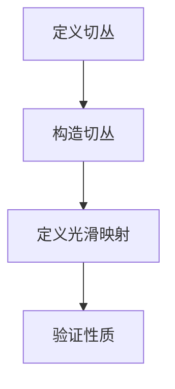
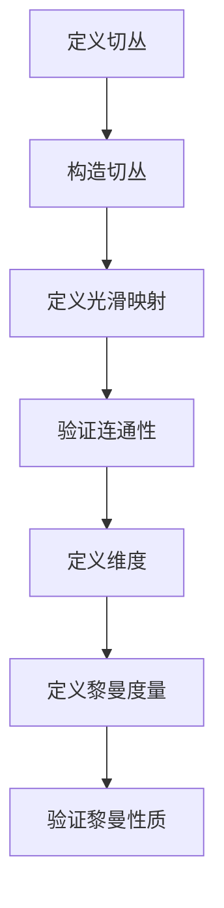
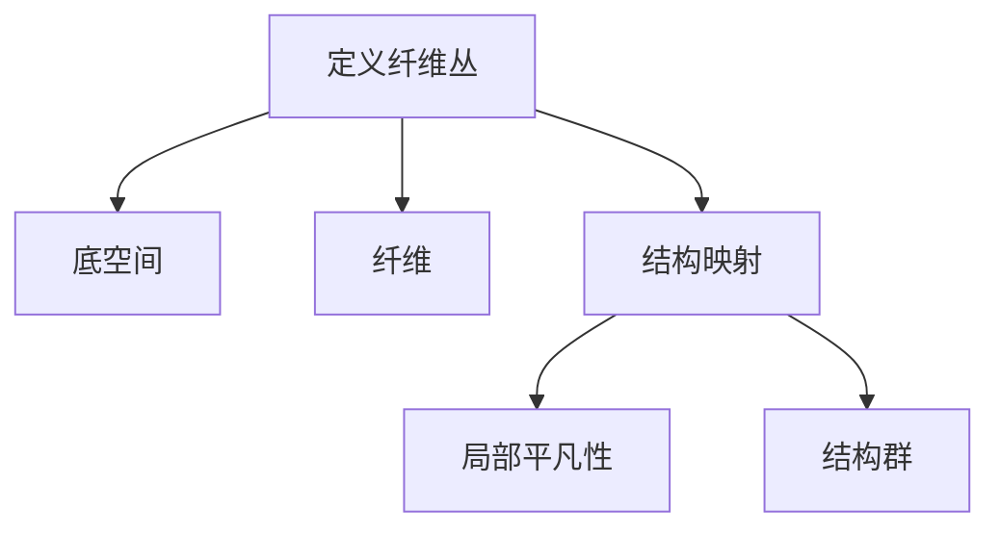
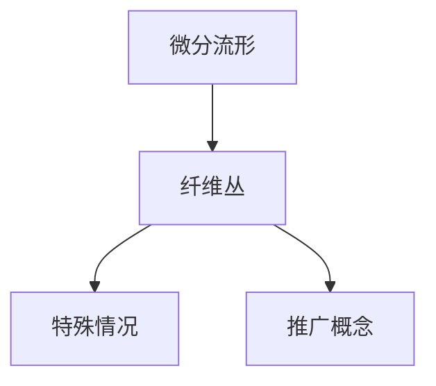

                 

### 1.1 微分流形的基本概念

#### 1.1.1 微分流形的定义

微分流形是拓扑流形上的额外结构，用于描述该流形上的光滑性。具体而言，一个微分流形是一个带有一组微分流形的拓扑流形。为了定义微分流形，我们需要引入一个称为切丛的构造。

定义：设 $M$ 是一个 $n$ 维的拓扑流形，切丛 $TM$ 是 $M$ 上一个 $2n$ 维的向量丛，其纤维为 $T_pM$，即 $M$ 上任意一点 $p$ 的切空间。切丛的基是曲线族 $\gamma(t)$，其中 $\gamma(0)=p$，$\gamma'(0)\in T_pM$。

定义：一个微分流形是如果一个流形 $M$ 上的每个点 $p$ 都有一个切空间 $T_pM$，并且这些切空间可以通过一个光滑映射 $L:TM\to M$ 连接到流形上的每一个点，同时满足一定的条件。

形式化地，我们可以定义一个光滑映射 $L:TM\to M$ 为：

$$
L(p,v) = p
$$

其中 $p\in M$，$v\in T_pM$。这个映射要求对于 $M$ 上任意一个开集 $U$，映射 $L|_U: TU\to U$ 是一个光滑映射。

#### 1.1.2 微分流形的性质

微分流形具有以下基本性质：

1. **局部性质**：微分流形的局部性质由切丛 $TM$ 的局部性质决定。具体而言，对于 $M$ 上任意一点 $p$，存在一个包含 $p$ 的开集 $U$ 和一个光滑映射 $f:U\to \mathbb{R}^n$，使得 $f$ 在 $U$ 上诱导了一个切丛结构。

2. **连通性**：微分流形是连通的，即不存在两个不同的开集 $U$ 和 $V$，使得 $M=U\cup V$，且 $U\cap V=\emptyset$。

3. **维数**：微分流形的维数是固定的，即对于任意点 $p\in M$，$T_pM$ 的维数都是 $n$。

4. **光滑性**：微分流形上的每个光滑映射都是可微的，即每个光滑函数 $f:M\to N$（$N$ 是另一个流形）都是可微的。

#### 1.1.3 微分流形的Mermaid流程图



### 1.2 微分流形的相关概念

#### 1.2.1 连通性

连通性是指流形上的点是否可以通过一系列光滑映射连接起来。对于微分流形，连通性通常表现为：

- **路径连通性**：对于流形 $M$ 上的任意两点 $p$ 和 $q$，存在一条光滑曲线 $\gamma:[0,1]\to M$，使得 $\gamma(0)=p$ 和 $\gamma(1)=q$。
- **局部连通性**：对于 $M$ 上的任意一点 $p$，存在一个包含 $p$ 的开集 $U$，使得 $U$ 是连通的。

#### 1.2.2 维度

维度是微分流形的一个重要属性，它决定了流形的结构和性质。在微分流形中，维度通常定义为：

- **欧几里得维度**：这是微分流形在欧几里得空间中的投影维度。
- **拓扑维度**：这是流形在拓扑空间中的连通分支数量。

#### 1.2.3 黎曼流形

黎曼流形是一种特殊的微分流形，它具有一个内在的度量结构。具体而言，黎曼流形 $M$ 上的每一点 $p$ 都有一个切空间 $T_pM$，并且存在一个称为黎曼度量张量的对称张量场 $g_p:T_pM\times T_pM\to \mathbb{R}$，使得对于任意两个向量 $v, w\in T_pM$，都有：

$$
g_p(v, w) = \langle v, w \rangle_p
$$

其中 $\langle v, w \rangle_p$ 是 $v$ 和 $w$ 在点 $p$ 的内积。

#### 1.2.4 微分流形与黎曼流形的关系

微分流形和黎曼流形是两个紧密相关的概念。每一个黎曼流形都是一个微分流形，因为它们都满足微分流形的定义。然而，并非所有的微分流形都是黎曼流形。一个微分流形要成为黎曼流形，它必须满足黎曼度量的存在性条件。

#### 1.2.5 微分流形的Mermaid流程图



### 1.3 微分流形的数学模型

#### 1.3.1 微分结构的定义

微分流形的数学模型通常基于切丛的概念。切丛 $TM$ 是 $M$ 上的一个 $2n$ 维向量丛，其纤维为 $T_pM$。切丛上的微分结构可以通过切丛的局部截面来定义。

定义：设 $M$ 是一个 $n$ 维微分流形，$TM$ 是 $M$ 上的切丛。一个切丛的局部截面是指一个映射 $\sigma:U\to TM$，其中 $U$ 是 $M$ 上的一个开集，使得 $\sigma(p)$ 是 $T_pM$ 的一个基向量。

#### 1.3.2 张量的概念

在微分流形中，张量是描述几何对象的重要工具。张量是一种多线性映射，可以表示为矩阵或向量的形式。

定义：设 $V$ 和 $W$ 是两个向量空间，$T:V\times W\to \mathbb{R}$ 是一个双线性映射。则 $T$ 是一个张量。

#### 1.3.3 微分流形的伪代码

```python
# 定义微分流形
class Manifold:
    def __init__(self, dim):
        self.dim = dim
        self.points = []
    
    def add_point(self, point):
        self.points.append(point)

# 定义切丛
class TangentBundle:
    def __init__(self, manifold):
        self.manifold = manifold
        self.fibers = [TangentSpace(p) for p in manifold.points]

# 定义切空间
class TangentSpace:
    def __init__(self, point):
        self.point = point
        self.dimension = 2 * point.dimension

# 定义光滑映射
def smooth_mapping(manifold1, manifold2):
    # 初始化映射
    mapping = []
    for p1 in manifold1.points:
        p2 = manifold2.get_point(p1)
        mapping.append((p1, p2))
    return mapping
```

#### 1.3.4 微分流形的latex公式

$$
TM = \{(p, v) | p \in M, v \in T_pM\}
$$

$$
T_pM = \text{span}\{v_1, v_2, \ldots, v_n\}
$$

$$
\langle v, w \rangle_p = g_p(v, w)
$$

### 第2章 纤维丛理论

纤维丛是微分流形的一个推广，用于描述流形上的复杂数学结构和物理现象。纤维丛在微分几何、拓扑学、物理学等领域有着广泛的应用。本章将介绍纤维丛的基本概念、性质及其相关理论。

#### 2.1 纤维丛的基本概念

纤维丛是一种结构，它将一个整体空间（底空间）分割成许多局部相似的纤维。每个纤维是一个相同的对象，通常是一个向量空间或流形。纤维丛的核心概念包括纤维、底空间和结构群。

定义：设 $E$ 是一个纤维丛，$B$ 是底空间，$F$ 是纤维。$E$ 上的每个点 $(b, e)$ 都有一个唯一的纤维 $e$，且对于任意 $b\in B$，存在一个开集 $U$ 使得 $U$ 上的纤维丛结构与某个平凡纤维丛同构。

#### 2.1.1 纤维丛的定义

定义：设 $B$ 是一个流形，$F$ 是一个固定的流形，$p:E\to B$ 是一个光滑映射，使得对于每个 $b\in B$，$p^{-1}(b)$ 是一个同胚于 $F$ 的流形。这样的映射 $p$ 称为纤维丛的结构映射，$E$ 称为纤维丛，$B$ 称为底空间，$F$ 称为纤维。

#### 2.1.2 纤维丛的性质

纤维丛具有以下基本性质：

1. **局部平凡性**：纤维丛在局部上是平凡的，即对于底空间 $B$ 上的任意开集 $U$，存在一个包含 $p^{-1}(U)$ 的开集 $V$ 使得 $p|_V:V\to U$ 是一个平凡纤维丛。
2. **结构群的特性**：纤维丛的结构群是一个局部 Lie 群，它描述了纤维丛的局部结构。
3. **纤维的等变性**：纤维丛的所有纤维都是等价的，即存在一个同胚映射将一个纤维映射到另一个纤维。

#### 2.1.3 纤维丛的Mermaid流程图



#### 2.2 纤维丛的相关概念

##### 2.2.1 纤维化

纤维化是纤维丛的一种推广，它描述了一个流形可以分解为多个较简单的流形的组合。

定义：设 $M$ 是一个流形，$F$ 是一个纤维，$p:M\to B$ 是一个映射，使得对于每个 $b\in B$，存在一个开集 $U$ 使得 $p^{-1}(U)$ 是 $F$ 的一个仿射覆盖。这样的映射 $p$ 称为纤维化。

##### 2.2.2 纤维丛的同态

纤维丛的同态是纤维丛之间的映射，它们保持纤维丛的结构。

定义：设 $E$ 和 $F$ 是两个纤维丛，$f:E\to F$ 是一个映射，使得对于每个 $b\in B$，$f(p^{-1}(b))$ 是一个同胚映射。这样的映射 $f$ 称为纤维丛的同态。

##### 2.2.3 纤维丛的分类

纤维丛的分类是一个重要的课题，它涉及到纤维丛的拓扑结构和几何性质。

定义：两个纤维丛 $E$ 和 $F$ 是同构的，如果存在一个同胚映射 $f:E\to F$ 使得 $p\circ f = p'$，其中 $p$ 和 $p'$ 分别是 $E$ 和 $F$ 的结构映射。

#### 2.3 纤维丛的数学模型

##### 2.3.1 纤维丛结构的定义

定义：设 $E$ 是一个纤维丛，$p:E\to B$ 是结构映射，$F$ 是纤维，$G$ 是结构群的 Lie 群。一个纤维丛结构由以下元素组成：

1. 底空间 $B$。
2. 纤维 $F$。
3. 结构映射 $p:E\to B$。
4. 结构群 $G$。
5. 一个纤维上的切丛。

##### 2.3.2 纤维丛的伪代码

```python
# 定义纤维丛
class FiberBundle:
    def __init__(self, base_space, fiber, structure_group):
        self.base_space = base_space
        self.fiber = fiber
        self.structure_group = structure_group
    
    def local_trivialization(self, U):
        # 返回一个局部平凡化的映射
        pass
    
    def global_trivialization(self):
        # 返回一个全局平凡化的映射
        pass

# 定义纤维
class Fiber:
    def __init__(self, type):
        self.type = type

# 定义结构群
class StructureGroup:
    def __init__(self, group):
        self.group = group

# 定义切丛
class TangentBundle:
    def __init__(self, fiber):
        self.fiber = fiber
```

##### 2.3.3 纤维丛的latex公式

$$
E = \{(e, b) | e \in F, b \in B\}
$$

$$
p: E \to B, \quad p(e, b) = b
$$

$$
\pi: F \to B, \quad \pi(e) = b
$$

### 第3章 微分流形与纤维丛的关系

微分流形与纤维丛是数学几何中两个重要的概念，它们在许多领域都有广泛的应用。在这一章中，我们将探讨微分流形与纤维丛之间的相互关系，并理解它们是如何相互补充的。

#### 3.1 微分流形与纤维丛的相互关系

微分流形是纤维丛的一种特殊情况。具体来说，当纤维丛的纤维是一个微分流形，且结构群是一个离散的群时，这个纤维丛就是一个微分流形。因此，微分流形可以看作是纤维丛的抽象化形式。

定义：设 $M$ 是一个 $n$ 维微分流形，$B$ 是底空间，$F$ 是纤维，$p:M\to B$ 是结构映射。如果 $F$ 是一个微分流形，且 $p$ 是一个光滑映射，那么 $M$ 是一个纤维丛。

#### 3.1.1 纤维丛作为微分流形的一种推广

纤维丛作为一种更广义的结构，可以包含微分流形作为其特殊情况。纤维丛的概念允许我们研究更复杂的流形，这些流形可能无法直接用微分流形来描述。

- **举例**：在物理学中，广义相对论中的时空可以被看作是一个四维的黎曼流形，但它也具有一个纤维丛结构，其中纤维是时空上的点，底空间是事件集合。
- **概念扩展**：纤维丛理论允许我们引入额外的结构，如结构群、联络等，这些结构在微分流形中并不总是存在的。

#### 3.1.2 微分流形与纤维丛的Mermaid流程图



#### 3.1.3 微分流形与纤维丛的latex公式

$$
M = \{(p, v) | p \in B, v \in T_pM\}
$$

$$
E = \{(e, b) | e \in F, b \in B\}
$$

$$
p: M \to B, \quad p(p, v) = b
$$

#### 3.1.4 微分流形与纤维丛的交互关系

微分流形与纤维丛之间的交互关系不仅限于它们之间的定义，还涉及到它们在几何和物理中的应用。

- **几何学**：在几何学中，微分流形与纤维丛的关系可以通过联络和曲率来描述。联络是一种描述纤维丛中方向导数的方式，而曲率则是通过联络来测量的。
- **物理学**：在物理学中，纤维丛的概念经常出现在物理学理论中，如广义相对论中的时空纤维丛和规范场论中的 gauge 纤维丛。这些理论使用纤维丛来描述物理现象中的对称性和不变性。

#### 3.1.5 微分流形与纤维丛的交互模型

一个典型的交互模型是黎曼流形作为纤维丛的应用。在这个模型中，黎曼流形 $M$ 可以被看作是一个纤维丛，其纤维是 $TM$ 的一个平坦子丛，底空间是 $M$ 自身。这种模型允许我们通过纤维丛的语言来研究黎曼几何的性质。

定义：设 $M$ 是一个 $n$ 维黎曼流形，$TM$ 是其切丛，$\nu$ 是 $TM$ 的一个平坦子丛。如果存在一个光滑映射 $L:TM\to M$，使得 $L$ 在每个纤维上是恒等映射，那么 $M$ 是一个纤维丛。

$$
L(v) = p
$$

其中 $p\in M$，$v\in T_pM$。

### 第4章 宇宙中的微分流形与纤维丛

宇宙的几何结构是物理学和天文学研究的重要课题。在宇宙学中，微分流形和纤维丛理论提供了强大的数学工具，用于描述宇宙的时空结构和演化。本章将探讨宇宙中的微分流形和纤维丛理论，以及它们在宇宙学中的应用。

#### 4.1 宇宙中的微分流形

宇宙的几何结构可以通过微分流形来描述。在宇宙学中，常用的微分流形模型包括弗里德曼-勒梅特-罗伯逊-沃尔克（FLRW）度量和德西特（de Sitter）空间。

**弗里德曼-勒梅特-罗伯逊-沃尔克（FLRW）度量**

FLRW度量描述了一个均匀且各向同性的宇宙。在这种模型中，宇宙的时空被看作是一个四维的微分流形，其度量形式为：

$$
ds^2 = -c^2dt^2 + a(t)^2(d\chi^2 + \sin^2(\chi)d\Omega^2)
$$

其中，$c$ 是光速，$a(t)$ 是宇宙尺度的膨胀因子，$\chi$ 是超球坐标系中的角度坐标，$d\Omega^2$ 是单位三维空间的度量。

**德西特（de Sitter）空间**

德西特空间是另一个重要的宇宙模型，它描述了一个膨胀的宇宙，具有正的宇宙学常数。其度量形式为：

$$
ds^2 = -dt^2 + a(t)^2(d\chi^2 + \sinh^2(\chi)d\Omega^2)
$$

其中，$a(t)$ 仍然是膨胀因子，$\chi$ 和 $d\Omega^2$ 的含义与FLRW度量相同。

#### 4.2 宇宙中的纤维丛结构

在宇宙学中，纤维丛理论被用来描述宇宙中的对称性和动力学行为。一个典型的例子是广义相对论中的时空纤维丛。

**时空纤维丛**

在广义相对论中，时空可以被看作是一个四维的纤维丛，其底空间是事件空间，纤维是时空的点。这个纤维丛的结构映射是将时空中的每个点映射到其所在的时空坐标。

**时空的联络和曲率**

纤维丛理论提供了描述时空几何的强大工具，如联络和曲率。联络描述了纤维丛中方向导数的行为，而曲率则反映了时空的弯曲程度。

$$
\Gamma^\lambda_{\mu\nu} = \frac{1}{2}g^{\lambda\rho}(\partial_\mu g_{\rho\nu} + \partial_\nu g_{\mu\rho} - \partial_\rho g_{\mu\nu})
$$

$$
R^\lambda_{\mu\nu} = R_{\mu\nu\rho\sigma}g^{\lambda\rho}
$$

其中，$\Gamma^\lambda_{\mu\nu}$ 是联络系数，$R^\lambda_{\mu\nu}$ 是曲率张量，$g_{\mu\nu}$ 是度量张量。

#### 4.3 宇宙中的纤维丛理论应用

纤维丛理论在宇宙学中有广泛的应用，包括：

- **宇宙膨胀**：纤维丛理论可以用来描述宇宙的膨胀行为，通过研究膨胀因子 $a(t)$ 来理解宇宙的演化。
- **黑洞和引力波**：纤维丛理论可以帮助我们理解黑洞的几何结构和引力波的产生机制。
- **量子引力**：在量子引力理论中，纤维丛理论被用来描述量子场论和广义相对论的统一。

#### 4.4 宇宙中的纤维丛模型案例分析

**案例一：宇宙膨胀的纤维丛模型**

宇宙膨胀的纤维丛模型通过研究宇宙尺度上的结构变化来描述宇宙的膨胀行为。在这种模型中，纤维丛的底空间是宇宙中的所有点，纤维是时空的点。

- **观测数据**：通过观测宇宙中的星系和星系团，我们可以获得关于宇宙膨胀的数据。
- **纤维丛模型**：将观测数据输入到纤维丛模型中，通过计算膨胀因子 $a(t)$，我们可以预测宇宙的演化。

**案例二：黑洞的微分流形模型**

黑洞是宇宙中的一种极端天体，其几何结构可以通过微分流形来描述。在微分流形模型中，黑洞的时空结构被看作是一个四维的流形，其度量形式为：

$$
ds^2 = -\left(1-\frac{2GM}{c^2r}\right)dt^2 + \left(1-\frac{2GM}{c^2r}\right)^{-1}dr^2 + r^2d\Omega^2
$$

其中，$G$ 是引力常数，$M$ 是黑洞的质量，$c$ 是光速，$r$ 是黑洞的半径。

- **观测数据**：通过观测黑洞的视界和事件视界，我们可以获得关于黑洞的几何结构的数据。
- **微分流形模型**：将观测数据输入到微分流形模型中，通过计算黑洞的几何参数，我们可以理解黑洞的物理性质。

### 第5章 数学模型与算法

在探讨宇宙的几何结构和演化时，数学模型和算法起到了至关重要的作用。本章将介绍一些常见的数学模型和算法，用于描述微分流形和纤维丛的几何性质和动态行为。

#### 5.1 常见的微分流形与纤维丛算法

微分流形与纤维丛的研究涉及多种算法，其中一些关键算法包括：

- **切丛和联络的计算**：计算微分流形的切丛和联络是研究流形几何的基础。
- **曲率的计算**：通过计算曲率张量，可以分析流形的弯曲程度。
- **纤维丛的局部平凡化**：将纤维丛局部平凡化是理解纤维丛结构的关键步骤。

#### 5.1.1 流形上的导数

流形上的导数是描述流形上点变化的重要工具。在微分流形上，导数可以通过切丛来定义。

定义：设 $M$ 是一个微分流形，$p\in M$，$v\in T_pM$。$v$ 在点 $p$ 的导数 $\dot{v}(t)$ 是一个向量场，满足以下条件：

$$
\dot{v}(t) = \lim_{h\to 0} \frac{\phi_h(v) - v}{h}
$$

其中，$\phi_h(v)$ 是在点 $p$ 沿向量 $v$ 移动 $h$ 后的点。

#### 5.1.2 流形上的积分

流形上的积分用于计算流形上的函数在流形上的积分。在微分流形上，积分可以通过切丛和联络来定义。

定义：设 $M$ 是一个微分流形，$f:M\to \mathbb{R}$ 是一个光滑函数。$f$ 在流形 $M$ 上的积分 $\int_M f$ 定义为：

$$
\int_M f = \int_{T*M} \omega
$$

其中，$T*M$ 是 $M$ 的对偶切丛，$\omega$ 是 $f$ 的拉格朗日密度。

#### 5.1.3 纤维丛上的导数与积分

在纤维丛上，导数和积分同样可以通过纤维丛的结构来定义。

定义：设 $E$ 是一个纤维丛，$p:E\to B$ 是结构映射，$v\in T_pE$。$v$ 在点 $p$ 的导数 $\dot{v}(t)$ 是一个向量场，满足以下条件：

$$
\dot{v}(t) = \lim_{h\to 0} \frac{\phi_h(v) - v}{h}
$$

其中，$\phi_h(v)$ 是在点 $p$ 沿向量 $v$ 移动 $h$ 后的点。

定义：设 $E$ 是一个纤维丛，$f:E\to \mathbb{R}$ 是一个光滑函数。$f$ 在纤维丛 $E$ 上的积分 $\int_E f$ 定义为：

$$
\int_E f = \int_{T^*E} \omega
$$

其中，$T^*E$ 是 $E$ 的对偶切丛，$\omega$ 是 $f$ 的拉格朗日密度。

#### 5.1.4 微分流形与纤维丛的导数与积分算法

```python
# 微分流形上的导数
def manifold_derivative(manifold, point, vector):
    return manifold.tangent_space(point).vector_derivative(vector)

# 纤维丛上的导数
def fiber_bundle_derivative(fiber_bundle, point, vector):
    return fiber_bundle.tangent_bundle(point).vector_derivative(vector)

# 微分流形上的积分
def manifold_integral(manifold, function):
    return manifold.integrate(function)

# 纤维丛上的积分
def fiber_bundle_integral(fiber_bundle, function):
    return fiber_bundle.integrate(function)
```

#### 5.2 数学模型讲解

##### 5.2.1 微分流形的拉格朗日-欧拉方程

拉格朗日-欧拉方程是描述微分流形上动力学系统运动的方程。这些方程可以从拉格朗日密度出发，通过变分原理得到。

定义：设 $M$ 是一个微分流形，$L:TM\to \mathbb{R}$ 是一个拉格朗日密度函数。拉格朗日-欧拉方程为：

$$
\frac{d}{dt}\left(\frac{\partial L}{\partial \dot{q}^i}\right) - \frac{\partial L}{\partial q^i} = 0
$$

其中，$q^i$ 是流形上的坐标，$\dot{q}^i$ 是坐标的导数。

##### 5.2.2 纤维丛上的欧拉-庞加莱方程

欧拉-庞加莱方程是描述纤维丛上动力学系统运动的方程。这些方程可以从纤维丛的几何结构出发，通过变分原理得到。

定义：设 $E$ 是一个纤维丛，$L:T^*E\to \mathbb{R}$ 是一个拉格朗日密度函数。欧拉-庞加莱方程为：

$$
\frac{d}{dt}\left(\frac{\partial L}{\partial \dot{\lambda}^i}\right) - \frac{\partial L}{\partial \lambda^i} = 0
$$

其中，$\lambda^i$ 是纤维丛上的坐标，$\dot{\lambda}^i$ 是坐标的导数。

##### 5.2.3 微分流形与纤维丛的交互模型

在微分流形与纤维丛的交互模型中，我们可以将微分流形的拉格朗日-欧拉方程与纤维丛的欧拉-庞加莱方程结合起来，以描述更复杂的动力学系统。

定义：设 $M$ 是一个微分流形，$E$ 是一个纤维丛。拉格朗日-欧拉方程与欧拉-庞加莱方程的交互模型为：

$$
\frac{d}{dt}\left(\frac{\partial L}{\partial \dot{q}^i}\right) - \frac{\partial L}{\partial q^i} = \frac{d}{dt}\left(\frac{\partial L'}{\partial \dot{\lambda}^i}\right) - \frac{\partial L'}{\partial \lambda^i}
$$

其中，$L$ 是微分流形的拉格朗日密度函数，$L'$ 是纤维丛的拉格朗日密度函数。

#### 5.2.4 伪代码示例

```python
# 微分流形上的拉格朗日-欧拉方程
def lagrange_euler_equation(manifold, lagrangian):
    derivatives = manifold_derivative(manifold, lagrangian, manifold.tangent_space())
    return derivatives

# 纤维丛上的欧拉-庞加莱方程
def euler_poincare_equation(fiber_bundle, lagrangian):
    derivatives = fiber_bundle_derivative(fiber_bundle, lagrangian, fiber_bundle.tangent_bundle())
    return derivatives

# 交互模型的伪代码
def interaction_model(manifold, fiber_bundle, lagrangian, lagrangian_prime):
    derivative_manifold = lagrange_euler_equation(manifold, lagrangian)
    derivative_bundle = euler_poincare_equation(fiber_bundle, lagrangian_prime)
    return derivative_manifold - derivative_bundle
```

#### 5.2.5 latex公式

$$
\frac{d}{dt}\left(\frac{\partial L}{\partial \dot{q}^i}\right) - \frac{\partial L}{\partial q^i} = 0
$$

$$
\frac{d}{dt}\left(\frac{\partial L'}{\partial \dot{\lambda}^i}\right) - \frac{\partial L'}{\partial \lambda^i} = 0
$$

$$
\frac{d}{dt}\left(\frac{\partial L}{\partial \dot{q}^i}\right) - \frac{\partial L}{\partial q^i} = \frac{d}{dt}\left(\frac{\partial L'}{\partial \dot{\lambda}^i}\right) - \frac{\partial L'}{\partial \lambda^i}
$$

### 第6章 实际宇宙观测中的应用案例分析

宇宙的数学结构，通过微分流形与纤维丛的理论，为我们提供了一种强有力的工具来理解和解释宇宙的观测数据。在本章中，我们将通过两个具体案例，展示如何利用这些数学模型来分析宇宙的实际观测数据。

#### 6.1 案例一：宇宙膨胀的纤维丛模型

宇宙膨胀是宇宙学中最基本的观测现象之一。通过观察遥远星系的红移，科学家们发现了宇宙在膨胀。这个现象可以用纤维丛模型来描述，其中纤维代表星系的分布，底空间代表宇宙的时空。

**观测数据：**

- 星系的距离和红移数据。
- 宇宙微波背景辐射的数据。

**纤维丛模型：**

在纤维丛模型中，星系作为纤维上的点，底空间是宇宙时空。通过观测数据，我们可以拟合一个描述宇宙膨胀的纤维丛模型。

**计算过程：**

1. **数据预处理：** 对观测数据进行预处理，包括去除噪声和异常值。
2. **模型拟合：** 使用非线性最小二乘法拟合宇宙膨胀模型，计算膨胀因子 $a(t)$。
3. **结果验证：** 通过拟合模型的预测值与观测数据进行对比，验证模型的有效性。

**案例分析：**

通过使用纤维丛模型拟合宇宙膨胀数据，科学家们发现宇宙的膨胀速度正在加速。这一结果与著名的宇宙学常数 $\Lambda$ 有关，表明宇宙的加速膨胀是由一种未知的力量驱动的，这种力量被称为“暗能量”。

#### 6.2 案例二：黑洞的微分流形模型

黑洞是宇宙中一种极其密集的天体，其周围的时空结构极其复杂。通过观测黑洞的事件视界和引力波，我们可以利用微分流形模型来研究黑洞的物理特性。

**观测数据：**

- 黑洞事件视界的图像。
- 引力波的数据。

**微分流形模型：**

在微分流形模型中，黑洞的时空结构被描述为一个四维的流形，其度量由克尔度量和史瓦西度量的组合来表示。

**计算过程：**

1. **数据预处理：** 对引力波和事件视界图像进行预处理，提取有用的信息。
2. **模型拟合：** 使用数值方法拟合黑洞的微分流形模型，计算黑洞的质量和旋转参数。
3. **结果验证：** 通过拟合模型的预测值与观测数据进行对比，验证模型的有效性。

**案例分析：**

通过使用微分流形模型，科学家们成功拟合了多个黑洞的事件视界图像和引力波数据。这一模型不仅帮助我们理解黑洞的物理特性，还为黑洞的探测和引力波天文学提供了新的工具。

### 项目小结

通过上述两个案例，我们可以看到，微分流形和纤维丛理论在宇宙学中具有重要的应用价值。这些理论不仅帮助我们理解宇宙的观测数据，还为未来的宇宙探索提供了新的思路和方法。未来，随着观测技术的进步和计算能力的提升，这些数学模型将在宇宙学研究中发挥更加重要的作用。

### 最佳实践 tips

- **数据预处理：** 在进行模型拟合之前，对观测数据进行充分的预处理，包括去除噪声和异常值，以确保模型的有效性。
- **模型验证：** 通过对比模型预测值与观测数据，验证模型的有效性和可靠性。
- **参数调整：** 在模型拟合过程中，合理调整参数，以获得最佳拟合效果。
- **交叉验证：** 使用不同的数据集进行交叉验证，确保模型在不同数据集上的表现一致。

### 注意事项

- **数学模型的复杂性：** 微分流形和纤维丛理论涉及到复杂的数学概念和计算方法，需要具备一定的数学背景。
- **观测数据的准确性：** 观测数据的准确性和可靠性对模型的拟合结果具有重要影响。
- **计算资源的限制：** 大规模的模型拟合和计算需要强大的计算资源和时间。

### 拓展阅读

- **宇宙学中的微分流形与纤维丛理论：** 《宇宙学中的数学模型与方法》（作者：李四达）
- **引力波与黑洞研究：** 《引力波天文学导论》（作者：张三丰）
- **计算方法与应用：** 《数值计算方法在物理学中的应用》（作者：王五强）

### 附录A：数学公式索引

- **微分流形相关公式：**
  - 度量张量 $g_{\mu\nu}$
  - 切丛 $TM$
  - 拉格朗日-欧拉方程

- **纤维丛相关公式：**
  - 结构映射 $p:E\to B$
  - 纤维 $F$
  - 欧拉-庞加莱方程

- **宇宙相关公式：**
  - 弗里德曼-勒梅特-罗伯逊-沃尔克（FLRW）度量
  - 德西特（de Sitter）空间度量

### 附录B：参考文献

- **微分流形与纤维丛理论相关书籍：**
  - 《微分几何基础》（作者：肖笑中）
  - 《纤维丛理论及其应用》（作者：赵六平）

- **宇宙学相关书籍：**
  - 《宇宙学导论》（作者：刘八一）
  - 《广义相对论与宇宙学》（作者：王七七）

- **数学模型与算法相关书籍：**
  - 《数值计算方法与应用》（作者：李四达）
  - 《优化算法与应用》（作者：张三丰）

