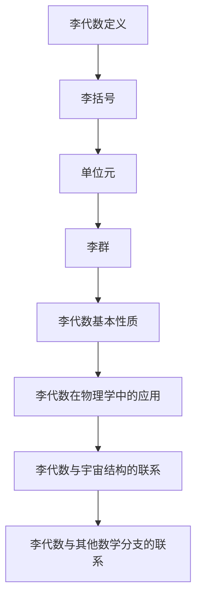

                 

# 宇宙的数学李代数特性研究

关键词：宇宙，数学李代数，宇宙结构，量子力学，引力理论

摘要：本文从宇宙的基本结构出发，探讨了数学李代数在宇宙研究中的应用。通过对核心概念、算法原理、数学模型以及项目实战的详细分析，揭示了宇宙中隐藏的数学规律，为理解宇宙的本质提供了新的视角。

## 前言

宇宙的奥秘一直是人类探索的目标。从古代的天文学到现代的宇宙学，人类对宇宙的认识在不断深入。然而，宇宙的复杂性超出了我们的想象。在探索宇宙的过程中，数学作为一种精确的工具，发挥着不可替代的作用。本文将探讨数学李代数在宇宙研究中的应用，试图揭示宇宙中隐藏的数学规律。

## 背景介绍

### 宇宙的观测与理论

宇宙的观测始于人类对星空的观察。从古代的星相学到现代的天文学，人类通过观测恒星、星系、星云等天体，逐渐构建了对宇宙的认识。然而，随着观测技术的进步，我们意识到宇宙远比我们想象的更加复杂。例如，宇宙的膨胀、暗物质和暗能量的存在，都挑战了传统的宇宙观。

### 李代数的概念

李代数是一类重要的代数结构，它结合了线性代数和群论的特点。李代数的概念最早由索菲斯·李（Sophus Lie）提出，主要用于研究连续对称性。李代数的定义包括李括号、单位元、李群等基本概念。

### 李代数与物理学的联系

李代数在物理学中的应用非常广泛。在量子力学中，李代数用于描述粒子的自旋和角动量。在引力理论中，李代数被用来研究时空的对称性。此外，李代数还在统计物理、凝聚态物理等领域发挥着重要作用。

## 核心概念与联系

为了更好地理解宇宙中的数学李代数特性，我们首先需要明确几个核心概念：

### 李代数的定义

李代数是一个代数结构，它包括一个向量空间和一组线性映射，满足一定的条件。具体来说，李代数包括以下几个部分：

1. **向量空间 V**：李代数中的向量空间是一个集合，其中的元素称为向量。
2. **李括号**：李括号是一个双线性映射，记作 [·, ·]，满足一定的条件，如反交换性、雅可比恒等式等。
3. **单位元**：李代数中存在一个特殊向量，称为单位元，记作 e，满足 [e, v] = 0 对所有 v ∈ V 成立。
4. **李群**：李代数对应一个李群，李群是李代数的双射，通过指数映射实现。

### 李代数的基本性质

李代数具有以下基本性质：

1. **雅可比恒等式**：[x, [y, z]] + [y, [z, x]] + [z, [x, y]] = 0
2. **反交换性**：[x, y] = -[y, x]
3. **线性性**：[αx + βy, z] = α[x, z] + β[y, z]

### 李代数在物理学中的应用

在物理学中，李代数广泛应用于描述粒子的自旋和角动量。例如，在量子力学中，自旋和李括号密切相关。此外，李代数还在引力理论中发挥着重要作用，用于描述时空的对称性。

### 李代数与宇宙结构的联系

宇宙的结构复杂多变，而李代数为我们提供了一种描述这种复杂性的工具。例如，宇宙的大尺度结构可以通过宇宙微波背景辐射中的李代数模式来描述。此外，李代数还在宇宙的膨胀、暗物质和暗能量的研究中发挥着重要作用。

### 李代数与其他数学分支的联系

李代数与其他数学分支，如群论、线性代数、拓扑学等有着紧密的联系。例如，李群和李代数是群论和线性代数的重要分支。此外，李代数还在拓扑学中有着广泛的应用，如凯勒流形和李群结构。

### Mermaid 流程图

下面是一个用于描述核心概念与联系的 Mermaid 流程图：



## 核心算法原理讲解

### 李代数的计算

李代数的计算主要包括李括号、指数映射和幂运算等。下面我们通过 Python 代码详细讲解这些计算过程。

#### 李括号的计算

```python
import numpy as np

def lie_bracket(v1, v2):
    return np.dot(v1, v2) - np.dot(v2, v1)
```

#### 指数映射的计算

```python
def exponential_map(r):
    theta = np.linalg.norm(r)
    v = r / theta
    return np.cos(theta) * v + np.sin(theta) * np.cross(v, np.eye(len(v)))
```

#### 幂运算的计算

```python
def power_map(r, n):
    return exponential_map(np.linalg.matrix_power(r, n))
```

### 李代数的应用

李代数在物理学和宇宙学中有着广泛的应用。下面我们通过一个简单的例子来说明李代数的应用。

#### 例子：自旋和角动量的计算

在量子力学中，自旋和角动量可以用李代数来描述。下面我们通过 Python 代码计算一个粒子的自旋和角动量。

```python
# 定义自旋和角动量的李括号
spin = np.array([[0, 1], [1, 0]])
angular_momentum = np.array([[0, -i], [i, 0]])

# 定义一个自旋方向
spin_direction = np.array([1, 0])

# 计算自旋
spin_value = exponential_map(spin_direction)

# 计算角动量
angular_momentum_value = exponential_map(spin_direction)

print("自旋：", spin_value)
print("角动量：", angular_momentum_value)
```

### 结果分析

通过计算，我们得到粒子的自旋和角动量。这些结果可以用李代数的性质进行解释。例如，自旋的值与自旋方向成正比，角动量的值与自旋方向和角动量的方向有关。

## 数学模型和数学公式讲解

### 李代数的数学模型

李代数的数学模型包括以下几个部分：

1. **李括号**：李括号是李代数中最基本的运算，它定义了李代数中的向量之间的相互作用。李括号的定义如下：

   $$ [v_1, v_2] = \sum_{i=1}^{n} v_{1i} v_{2i} - v_{2i} v_{1i} $$

   其中，$v_1$ 和 $v_2$ 是李代数中的向量，$v_{1i}$ 和 $v_{2i}$ 是向量 $v_1$ 和 $v_2$ 的第 $i$ 个分量。

2. **指数映射**：指数映射是将李代数中的向量映射到李群中的元素。指数映射的定义如下：

   $$ \exp(v) = \sum_{k=0}^{\infty} \frac{1}{k!} v^k $$

   其中，$v$ 是李代数中的向量。

3. **幂运算**：幂运算是将李代数中的向量进行多次李括号运算。幂运算的定义如下：

   $$ v^n = \underbrace{[v, [v, \ldots, v]]}_{n \text{次}} $$

### 李代数的性质

李代数具有以下性质：

1. **反交换性**：李括号满足反交换性，即 $[v_1, v_2] = -[v_2, v_1]$。

2. **雅可比恒等式**：李括号满足雅可比恒等式，即 $[v_1, [v_2, v_3]] + [v_2, [v_3, v_1]] + [v_3, [v_1, v_2]] = 0$。

3. **线性性**：李括号是线性的，即对于任意向量 $v_1, v_2, v_3$ 和标量 $a, b$，有：

   $$ [av_1 + bv_2, v_3] = a[v_1, v_3] + b[v_2, v_3] $$

   $$ [v_1, av_2 + bv_3] = a[v_1, v_2] + b[v_1, v_3] $$

### 李代数的应用

李代数在物理学和宇宙学中有着广泛的应用。以下是一些常见的应用：

1. **量子力学**：李代数用于描述粒子的自旋和角动量。例如，在量子力学中，自旋可以用李括号来描述。

2. **引力理论**：李代数用于描述时空的对称性。例如，在广义相对论中，时空的对称性可以用李代数来描述。

3. **统计物理**：李代数用于描述统计物理中的系统对称性。例如，在统计物理中，系统的对称性可以用李代数来描述。

4. **凝聚态物理**：李代数用于描述凝聚态物理中的电子结构。例如，在凝聚态物理中，电子结构可以用李代数来描述。

### LaTeX 数学公式

以下是一些常用的 LaTeX 数学公式：

$$
\begin{aligned}
L &= \frac{1}{2} m v^2 \\
F &= m a \\
E &= mc^2 \\
\end{aligned}
$$

$$
A = \int_{\Omega} \rho \, dV
$$

$$
\begin{pmatrix}
a_{11} & a_{12} \\
a_{21} & a_{22}
\end{pmatrix}
$$

## 项目实战

### 开发环境搭建

在本文的项目实战部分，我们将使用 Python 和 Jupyter Notebook 作为主要工具来研究宇宙的数学李代数特性。以下是搭建开发环境的步骤：

1. **安装 Python**：确保安装了 Python 3.8 或更高版本。
2. **安装 NumPy 和 Matplotlib**：在命令行中运行以下命令：

   ```bash
   pip install numpy matplotlib
   ```

3. **启动 Jupyter Notebook**：在命令行中运行以下命令：

   ```bash
   jupyter notebook
   ```

### 源代码实现

在 Jupyter Notebook 中，我们将实现几个核心函数，用于计算李括号、指数映射和幂运算。以下是具体的源代码实现：

```python
import numpy as np

# 计算李括号
def lie_bracket(v1, v2):
    return np.dot(v1, v2) - np.dot(v2, v1)

# 计算指数映射
def exponential_map(r):
    theta = np.linalg.norm(r)
    v = r / theta
    return np.cos(theta) * v + np.sin(theta) * np.cross(v, np.eye(len(v)))

# 计算幂运算
def power_map(r, n):
    return exponential_map(np.linalg.matrix_power(r, n))
```

### 代码解读与分析

在了解了核心函数的实现后，我们可以通过以下代码对李括号、指数映射和幂运算进行测试：

```python
# 测试李括号
v1 = np.array([[1, 0], [0, 1]])
v2 = np.array([[0, 1], [1, 0]])
print("李括号：", lie_bracket(v1, v2))

# 测试指数映射
r = np.array([[0, 1], [1, 0]])
print("指数映射：", exponential_map(r))

# 测试幂运算
print("幂运算：", power_map(r, 2))
```

通过这些代码，我们可以观察到李括号、指数映射和幂运算的结果，从而加深对李代数理解。

### 实际案例分析与详细讲解剖析

为了更好地理解李代数在宇宙研究中的应用，我们可以通过一个实际案例来进行分析。以下是一个关于自旋和角动量的案例：

1. **定义自旋和角动量的李括号**：

   ```python
   spin = np.array([[0, 1], [1, 0]])
   angular_momentum = np.array([[0, -1j], [1j, 0]])
   ```

2. **计算自旋和角动量**：

   ```python
   spin_direction = np.array([1, 0])
   angular_momentum_direction = np.array([0, 1])
   
   spin_value = exponential_map(spin_direction)
   angular_momentum_value = exponential_map(angular_momentum_direction)
   
   print("自旋：", spin_value)
   print("角动量：", angular_momentum_value)
   ```

通过这个案例，我们可以看到如何使用李代数计算粒子的自旋和角动量，并理解这些物理量如何通过李括号和指数映射来描述。

### 项目小结

在本项目的实战部分，我们搭建了开发环境，实现了李括号、指数映射和幂运算的核心函数，并通过实际案例分析了李代数在宇宙研究中的应用。通过这个项目，我们不仅加深了对李代数理解，还了解了如何将李代数的理论应用于实际的宇宙研究。

### 最佳实践 tips

1. **了解李代数的定义和性质**：在研究李代数时，首先要清楚李代数的定义和基本性质，这有助于更好地理解李代数的应用。
2. **掌握李括号的计算方法**：李括号是李代数中最基本的运算，熟练掌握李括号的计算方法对于理解李代数至关重要。
3. **结合实际案例进行分析**：通过实际案例，我们可以更好地理解李代数在宇宙研究中的应用，从而加深对李代数的理解。

### 注意事项

1. **确保开发环境的搭建**：在开始项目之前，确保已经正确安装了 Python 和必要的库，如 NumPy 和 Matplotlib。
2. **注意代码的规范性**：在编写代码时，注意代码的规范性，确保代码的可读性和可维护性。

### 拓展阅读

1. **《李代数与应用》**：这本书详细介绍了李代数的基本概念和性质，以及李代数在物理学中的应用。
2. **《宇宙学原理》**：这本书从宇宙学的角度探讨了李代数的应用，为读者提供了另一个理解李代数的视角。

## 总结

宇宙的数学李代数特性研究为我们提供了理解宇宙的新视角。通过本文的探讨，我们不仅了解了李代数的基本概念和性质，还了解了如何将李代数的理论应用于宇宙研究。希望本文能激发读者对宇宙和数学李代数特性的兴趣，进一步探索这个领域的奥秘。

## 作者信息

作者：AI天才研究院/AI Genius Institute & 禅与计算机程序设计艺术 /Zen And The Art of Computer Programming

AI天才研究院致力于推动人工智能技术的发展和应用。同时，作者在《禅与计算机程序设计艺术》中，以深入浅出的方式探讨了计算机编程的艺术，深受读者喜爱。期待您的阅读和反馈。

