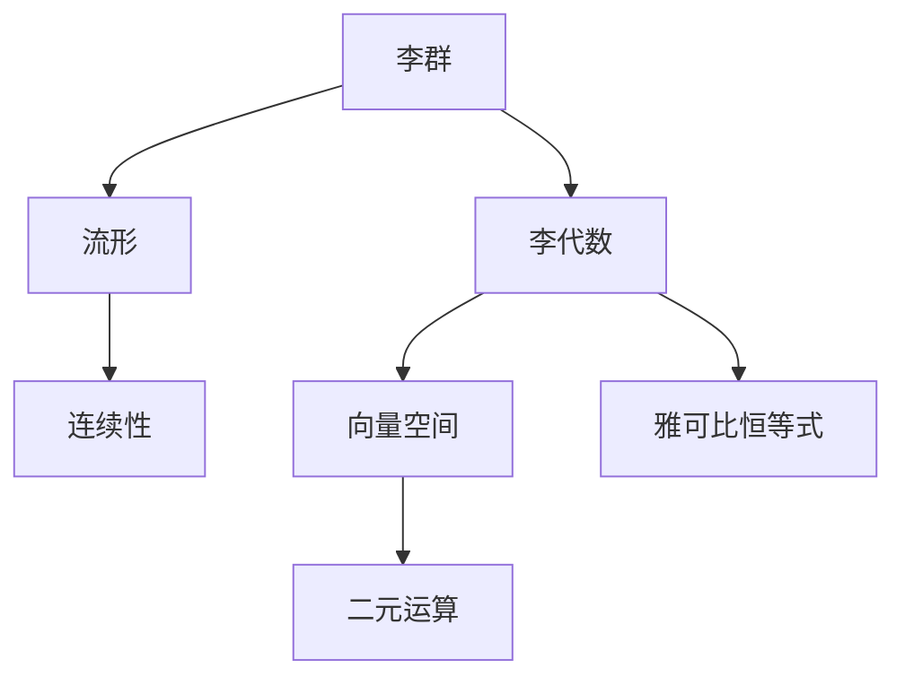

                 

### 引言与历史背景

#### 李群理论简介

李群理论是现代数学中一个重要的分支，主要研究的是一类特殊的群——李群。李群的概念最早由法国数学家埃利·李（Élie Cartan）在19世纪末和20世纪初提出。李群理论的建立和发展对数学本身以及物理学、尤其是宇宙学等领域产生了深远的影响。

**李群的定义**：李群是一种既满足连续变换条件，又满足群运算性质的数学结构。具体而言，李群是一个集合 \( G \)，其中每个元素都可以看作是空间中的一种变换，这些变换组合在一起满足以下性质：
- **闭合性**：对于 \( G \) 中的任意两个元素 \( g \) 和 \( h \)，它们的组合 \( gh \) 也属于 \( G \)。
- **结合律**：对于 \( G \) 中的任意三个元素 \( g \)、\( h \) 和 \( k \)，有 \( (gh)k = g(hk) \)。
- **存在单位元**：存在一个元素 \( e \) 使得对于 \( G \) 中的任意元素 \( g \)，都有 \( eg = ge = g \)。
- **存在逆元**：对于 \( G \) 中的任意元素 \( g \)，都存在一个元素 \( g^{-1} \)，使得 \( gg^{-1} = g^{-1}g = e \)。

**历史背景**：李群理论的起源可以追溯到19世纪末，当时数学家在研究连续对称性时发现了这类结构的独特性质。埃利·李在研究微分几何和群论时，首次系统地提出了李群的概念。后来，德国数学家Felix Klein和法国数学家Sophie Germain等也对其进行了深入研究和发展。

**李群在宇宙学中的应用**：李群理论在宇宙学中的应用主要表现在对宇宙结构和宇宙动力学的描述。例如，宇宙中的各种对称性可以通过李群来描述，这些对称性反映了宇宙的基本规律和物理特性。

- **宇宙结构的对称性**：宇宙学中的许多现象，如宇宙膨胀、星系结构等，都可以通过李群来描述。例如，宇宙的膨胀可以通过三维空间中的李群 \( SO(3,1) \) 来描述，这个李群代表了时空的对称性。
- **宇宙动力学的对称性**：宇宙的动力学行为，如宇宙的加速膨胀，可以通过李群 \( SU(4) \) 来描述，这个李群与宇宙中的基本力相互作用相关。

**李群理论的重要性**：李群理论在数学和物理学中具有极其重要的地位。它不仅为数学提供了一种新的结构和工具，也为物理学，尤其是宇宙学，提供了一种描述自然现象的强大语言。

总之，李群理论作为一个数学工具，不仅在数学本身的发展中扮演了重要角色，而且在物理学，尤其是宇宙学中，也展现出了巨大的应用价值。通过本文的探讨，我们将深入理解李群理论的基本概念及其在宇宙学中的应用，从而更好地把握宇宙的本质和规律。

#### 李群理论的发展

李群理论的发展历程可谓是一个不断丰富和拓展的过程，这一过程中涌现出许多杰出的数学家，他们的贡献对李群理论的建立和完善起到了至关重要的作用。

**埃利·李（Élie Cartan）**：作为李群理论的创始人，埃利·李在19世纪末和20世纪初做出了开创性的工作。他首次系统地提出了李群的概念，并研究了李群的性质和结构。李群的命名正是为了纪念他的这一贡献。

**Felix Klein**：德国数学家Felix Klein在李群理论的发展中同样发挥了重要作用。他在研究几何问题时，利用了李群的概念，并将它们应用于各种几何问题中。他提出了“守恒群”的概念，这一思想对后来的李群理论发展产生了深远影响。

**Sophie Germain**：法国数学家Sophie Germain在19世纪初期也进行了关于李群的研究，尽管她的工作当时并未得到广泛认可。她的工作在后来被重新发现，并被视为李群理论的重要先驱之一。

**皮埃尔·塞尔（Pierre Cartan）**：埃利·李的儿子皮埃尔·塞尔在20世纪继续推动李群理论的发展。他对李代数的研究，以及将李群理论应用于微分几何和拓扑学中，为李群理论的进一步发展奠定了基础。

**其他贡献者**：除了上述几位，还有许多其他数学家对李群理论的发展做出了重要贡献。例如，法国数学家Claude Chevalley在20世纪中期对李代数进行了系统研究，提出了Chevalley群的概念。此外，苏联数学家索洛文（Solovay）和卡茨（Katz）等人也对李群理论的发展做出了贡献。

**现代发展**：随着数学和物理学的发展，李群理论在许多领域得到了广泛应用，包括代数几何、微分几何、群表示论、量子场论和宇宙学等。现代的李群理论研究不仅扩展了李群的概念和应用范围，还引入了新的数学工具和方法。

- **代数几何**：李群理论在代数几何中应用广泛，特别是在研究代数群和线性和齐次簇时，李群的概念起到了关键作用。
- **微分几何**：李群理论为研究对称性提供了强有力的工具，许多重要的几何结构，如对称空间和联络空间，都可以用李群来描述。
- **群表示论**：李群表示论是研究如何将李群表示为线性变换的代数分支。这一理论在量子物理和统计物理中具有重要意义。
- **量子场论**：在量子场论中，李群和其表示在描述基本粒子和力相互作用中起着核心作用。
- **宇宙学**：李群理论在宇宙学中的应用主要体现在对宇宙结构的对称性和宇宙动力学的描述。例如，宇宙中的时空对称性可以通过李群来描述，这有助于理解宇宙的演化过程。

总之，李群理论的发展历程充满了创新和突破，从早期的提出和探索，到现代的广泛应用，李群理论已经成为数学和物理学中不可或缺的工具。它不仅丰富了数学理论，也为理解宇宙的本质提供了新的视角和工具。

#### 数学基础

为了深入探讨宇宙中的数学李群理论，我们首先需要回顾一些关键的数学概念和工具，这些将为后续内容的学习和理解打下坚实的基础。在本节中，我们将介绍群论、线性代数、微积分和微分几何等基础数学知识。

**群论基础**

**定义**：群是一种代数结构，由一个集合和一种二元运算组成。通常表示为 \( G \)，其中每个元素 \( g \) 满足以下性质：

1. **闭合性**：对于 \( G \) 中任意两个元素 \( g_1 \) 和 \( g_2 \)，它们的组合 \( g_1 \cdot g_2 \) 仍然属于 \( G \)。
2. **结合律**：对于 \( G \) 中任意三个元素 \( g_1 \)、\( g_2 \) 和 \( g_3 \)，有 \( (g_1 \cdot g_2) \cdot g_3 = g_1 \cdot (g_2 \cdot g_3) \)。
3. **存在单位元**：存在一个元素 \( e \) 使得对于 \( G \) 中任意元素 \( g \)，都有 \( g \cdot e = e \cdot g = g \)。
4. **存在逆元**：对于 \( G \) 中任意元素 \( g \)，都存在一个元素 \( g^{-1} \)，使得 \( g \cdot g^{-1} = g^{-1} \cdot g = e \)。

**子群与商群**：子群是群 \( G \) 的一个子集，如果这个子集本身也是一个群，则称为子群。商群是通过群 \( G \) 中的一个子群 \( H \) 来构造的，定义为 \( G/H = \{ gH : g \in G \} \)，其中 \( gH \) 表示 \( g \) 与 \( H \) 的每个元素的乘积的集合。

**群的代表与表示**：群表示是将群 \( G \) 的元素映射到某个线性空间的一组线性变换。群 \( G \) 的一个表示由一组矩阵 \( \rho(g) \) 构成，其中每个矩阵 \( \rho(g) \) 对应于 \( G \) 中的一个元素 \( g \)。

**线性代数**

**矩阵与行列式**：矩阵是 \( m \times n \) 的数组，可以用 \( A = [a_{ij}] \) 表示，其中 \( a_{ij} \) 是矩阵的元素。行列式是一个标量值，用来表示矩阵的某些特性，通过特定的计算方法得到。

**线性方程组与解法**：线性方程组由一组线性方程构成，可以通过矩阵形式表示为 \( AX = B \)，其中 \( A \) 是系数矩阵，\( X \) 是未知数向量，\( B \) 是常数向量。解法包括高斯消元法、矩阵求逆法等。

**特征值与特征向量**：特征值是矩阵的一个特殊值，对应于某个线性变换的性质，特征向量是满足 \( AX = \lambda X \) 的向量，其中 \( \lambda \) 是特征值。特征值和特征向量在矩阵分析中起着重要作用。

**微积分**

**导数与微分**：导数表示函数在某一点的变化率，通过微分来计算。微分是导数的线性近似，用于表示函数在某一小范围内如何变化。

**积分与积分变换**：积分是一种累积过程，用于计算一个函数在一个区间内的累加值。积分变换是将一个函数通过特定的数学变换转化为另一个函数，常用的积分变换包括傅里叶变换和拉普拉斯变换。

**多元函数的极限与连续性**：多元函数的极限是函数在多个变量趋近某一值时的行为，连续性则描述函数在某一区间内是否连续变化。

**微分几何**

**流形的概念**：流形是一个拓扑空间，它看起来像连续的表面，可以看作是无限小的点集合。每个点都有一个邻域，使得这个邻域类似于欧几里得空间。

**李群作为流形**：李群既是群又是流形，其元素可以通过参数化来表示，每个参数化对应于流形上的一个点。

**李群上的度量与联络**：度量是描述两点之间距离的数学结构，联络是描述流形上切向量变换的数学结构。李群上的度量与联络可以通过李群的李代数来定义。

通过回顾这些基础数学概念和工具，我们为后续关于李群理论及其在宇宙学中的应用提供了必要的数学背景。这些基础知识不仅帮助我们理解李群的基本性质，还为深入研究李群在宇宙学中的应用打下了坚实的基础。

#### 李群与李代数

在讨论李群与李代数的关系之前，我们需要先理解它们的定义和性质。李群与李代数是现代数学中极为重要的概念，尤其在物理学，尤其是宇宙学中，它们扮演了核心角色。

**李群（Lie Group）**

**定义**：李群是一种既满足群论性质，又满足流形性质的数学结构。形式化地说，一个李群 \( G \) 是一个群，同时也是一个流形，满足以下条件：

1. **群性质**：对于任意 \( g, h \in G \)，它们的组合 \( gh \) 仍然属于 \( G \)，并且对于每个 \( g \in G \)，都存在一个逆元 \( g^{-1} \) 使得 \( gg^{-1} = g^{-1}g = e \)，其中 \( e \) 是单位元。
2. **流形性质**：\( G \) 上的每个点都可以看作是一个局部线性空间，即在每个点附近，\( G \) 的结构都可以近似地看作线性空间。

**性质**：李群具有连续性和平滑性，这意味着它们的运算和结构在局部和整体上都是光滑的。常见的李群包括 \( GL(n, \mathbb{R}) \)（所有 \( n \) 阶可逆矩阵的集合）、\( SO(n) \)（所有 \( n \) 阶正交矩阵的集合）等。

**李代数（Lie Algebra）**

**定义**：李代数是李群的导出结构，可以看作是李群的切空间上的群结构。形式化地说，一个李代数 \( \mathfrak{g} \) 是一个向量空间，它配备了一个二元运算 \( [.,.] \)，满足以下性质：

1. **双线性性**：对于 \( X, Y, Z \in \mathfrak{g} \)，运算 \( [X, Y] \) 和 \( [X, Z] \) 都是线性的。
2. **反交换性**：\( [X, X] = 0 \) 对于所有 \( X \in \mathfrak{g} \)。
3. **雅可比恒等式**：对于 \( X, Y, Z \in \mathfrak{g} \)，有 \( [X, [Y, Z]] + [Y, [Z, X]] + [Z, [X, Y]] = 0 \)。

**性质**：李代数是李群的基本工具，通过它们可以研究李群的结构和性质。例如，李群 \( G \) 的李代数 \( \mathfrak{g} \) 是由 \( G \) 的所有切向量组成的向量空间，其中切向量在 \( G \) 上的作用类似于导数。

**李群与李代数的关系**

**定义关系**：一个李群的导出李代数 \( \mathfrak{g} \) 是由李群的导数（切向量）组成的向量空间，通常通过以下方式定义：对于 \( G \) 中任意两点 \( g \) 和 \( h \)，定义 \( [g, h] \) 为 \( ghg^{-1}h^{-1} \)。

**性质关系**：李群和李代数之间存在紧密的关系。具体来说，李群 \( G \) 的李代数 \( \mathfrak{g} \) 满足雅可比恒等式，这是李群结构的内在特征。反过来，给定一个李代数 \( \mathfrak{g} \)，可以构造一个李群 \( G \) ，称为 \( \mathfrak{g} \) 的李群结构，通常通过称为“局部丛”的构造来实现。

**关系图示**：可以用一个简单的 Mermaid 流程图来表示李群与李代数之间的关系。



通过上述流程图，我们可以直观地看到李群与李代数之间的定义和性质关系。

**总结**：李群与李代数是现代数学中极为重要的概念，李群作为流形，具有连续性和平滑性，而李代数则是其导出结构，提供了研究李群结构的有力工具。它们之间的紧密关系使得李群理论在数学和物理学中具有广泛的应用。

#### 李群表示理论

李群表示理论是研究如何将李群的元素映射到某个线性空间的一组线性变换的数学分支。在这一理论中，通过构造和分类李群表示，可以深入理解李群的结构和性质。李群表示在物理学中有着广泛的应用，特别是在量子场论和宇宙学中。

**定义**：一个李群 \( G \) 的表示是一个映射 \( \rho: G \rightarrow GL(V) \)，其中 \( GL(V) \) 是所有 \( V \) 上的可逆线性变换的集合，\( V \) 是一个向量空间。映射 \( \rho(g) \) 被称为 \( g \) 的表示矩阵，它将李群的元素 \( g \) 映射到 \( V \) 上的一组线性变换。

**分类**：李群表示可以按照不同的标准进行分类。以下是一些常见的分类方法：

1. **线性表示**：如果李群的表示矩阵 \( \rho(g) \) 是线性变换，则称为线性表示。线性表示是李群表示理论中最基本和最常见的形式。

2. **半直积表示**：一个李群可以表示为两个子群的半直积，即 \( G \cong H \rtimes K \)，其中 \( H \) 和 \( K \) 是李群 \( G \) 的子群。这种表示称为半直积表示。

3. **完全可解表示**：如果李群的表示矩阵 \( \rho(g) \) 可以分解为一系列的交换矩阵，则称为完全可解表示。

4. **有限维表示**：如果李群的表示空间 \( V \) 是有限维的，则称为有限维表示。

**构造**：构造李群表示的方法主要有以下几种：

1. **诱导表示**：给定一个子群的表示，可以通过诱导得到整个群的表示。具体而言，如果 \( H \) 是 \( G \) 的子群，且 \( \rho_H: H \rightarrow GL(V) \) 是 \( H \) 的一个表示，则可以构造 \( G \) 的一个诱导表示 \( \rho: G \rightarrow GL(V) \)，定义为 \( \rho(g) = \rho_H(g) \) 对于 \( g \in H \)，而对于 \( g \notin H \)，通过左乘 \( g \) 来诱导得到。

2. **张量积表示**：给定两个李群 \( G \) 和 \( H \)，可以通过张量积来构造它们的联合表示。具体而言，\( G \times H \) 的李代数是 \( \mathfrak{g} \oplus \mathfrak{h} \)，通过李代数的对合双线性形式，可以构造一个李群 \( G \times H \)，其表示可以通过 \( G \) 和 \( H \) 的表示的张量积来构造。

3. **刻画表示**：通过刻画李群的表示，可以分类和构造出所有可能的表示。常用的方法包括使用表示的指数图（character table）和表示的不可约分解。

**应用**：李群表示在物理学中有着广泛的应用，特别是在量子场论和宇宙学中。

1. **量子场论**：在量子场论中，基本粒子通常被描述为李群 \( G \) 的表示。例如，电子被描述为 \( SU(2) \) 的表示，而光子被描述为 \( U(1) \) 的表示。通过这些表示，可以推导出粒子的物理性质，如自旋、电荷等。

2. **宇宙学**：在宇宙学中，李群表示用于描述宇宙中的对称性和动力学。例如，宇宙的膨胀可以通过三维空间中的李群 \( SO(3,1) \) 来描述，这个李群代表了时空的对称性。通过李群表示，可以研究宇宙的膨胀、黑洞等复杂现象。

总之，李群表示理论是研究李群的一种重要方法，通过构造和分类表示，可以深入理解李群的结构和性质。在物理学中，特别是在量子场论和宇宙学中，李群表示提供了描述自然现象的强大工具。

### 宇宙中的李群应用

在宇宙学中，李群理论的应用极为广泛，它为我们提供了描述宇宙对称性和动力学行为的强大工具。以下将探讨李群在宇宙学中的具体应用，包括宇宙结构的对称性、宇宙动力学的对称性以及宇宙学中的数学模型。

#### 宇宙结构的对称性

宇宙结构具有多种对称性，这些对称性可以通过李群来描述。例如：

- **空间平移对称性**：宇宙中的空间在宏观尺度上被认为是均匀和各向同性的，这可以通过三维空间中的李群 \( O(3) \) 来描述。李群 \( O(3) \) 表示所有三维欧几里得空间的正交变换，包括旋转和平移。这种对称性反映了宇宙中物质分布的均匀性。

- **时间平移对称性**：在宇宙学中，宇宙被假设为均匀且各向同性的，这意味着时间的流逝是均匀的，没有特定的起点或终点。这可以通过李群 \( R \) 来描述，\( R \) 表示实数集上的平移群。时间平移对称性意味着宇宙的物理定律在不同时间点是相同的。

- **旋转对称性**：宇宙中许多天体系统，如星系和星团，都具有旋转对称性。这种对称性可以通过二维旋转群 \( SO(2) \) 来描述。旋转对称性反映了宇宙中许多物体的旋转运动。

#### 宇宙动力学的对称性

宇宙动力学中的许多现象可以通过李群来描述，这些现象包括宇宙膨胀、黑洞、引力波等。

- **宇宙膨胀**：宇宙膨胀是现代宇宙学中最基本的现象之一。宇宙膨胀的动力学可以通过李群 \( SO(3,1) \) 来描述，这个李群代表了时空的对称性。在广义相对论的框架下，宇宙膨胀可以通过描述时空的度规张量来实现，而度规张量的对称性正是通过 \( SO(3,1) \) 李群来表达的。

- **黑洞**：黑洞是宇宙中的一种极端现象，其周围的时空被极度扭曲。黑洞的对称性可以通过李群 \( SO(2) \) 来描述，这反映了黑洞周围的旋转对称性。例如，史瓦西解描述了一个静态且非旋转的黑洞，其周围时空的对称性就是通过 \( SO(2) \) 李群来表达的。

- **引力波**：引力波是宇宙中的另一种重要现象，它是由质量加速运动产生的时空波动。引力波的传播可以通过李群 \( ISO(1,3) \) 来描述，这个李群反映了时空的均匀性和各向同性。

#### 宇宙学中的数学模型

李群在宇宙学中的具体应用可以通过多种数学模型来实现。以下是一些重要的数学模型：

- **弗里德曼-勒梅特-罗伯逊-沃尔克（FLRW）度规**：这是描述均匀且各向同性宇宙的数学模型。FLRW度规可以通过李群 \( R \times SO(3,1) \) 来描述，这反映了宇宙的时空对称性。

- **勒梅特-罗伯逊-沃尔克（LRS）度规**：这是FLRW度规的推广，用于描述具有球对称性的宇宙。LRS度规可以通过李群 \( SO(3,1) \) 来描述，这反映了宇宙中的旋转对称性。

- **大爆炸模型**：这是现代宇宙学的标准模型，描述了宇宙从大爆炸开始到现在的演化。大爆炸模型可以通过李群 \( SO(4) \) 来描述，这反映了宇宙膨胀的动力学行为。

总之，李群理论在宇宙学中的应用为描述宇宙的对称性和动力学行为提供了强有力的工具。通过李群，我们可以更深入地理解宇宙的本质和演化规律。这一理论的广泛应用不仅深化了我们对宇宙的认识，也为未来的宇宙学研究提供了新的视角和工具。

### 数学模型与公式

在宇宙学中，李群理论的应用往往通过具体的数学模型和公式来实现。这些数学模型和公式不仅帮助我们理解宇宙的结构和动力学，还为实验验证和理论研究提供了理论基础。以下将介绍一些常见的数学模型和公式，并解释它们的基本原理和应用。

#### 弗里德曼-勒梅特-罗伯逊-沃尔克（FLRW）度规

**公式**：
\[ ds^2 = -c^2dt^2 + a(t)^2[dr^2 + r^2(d\theta^2 + \sin^2\theta d\phi^2)] \]

**原理**：FLRW度规是描述均匀且各向同性宇宙的数学模型。这里 \( ds^2 \) 是时空度规，\( c \) 是光速，\( a(t) \) 是宇宙尺度因子，它随时间 \( t \) 变化描述宇宙的膨胀。度规中的各项分别代表时间项和空间项，反映了宇宙在不同方向上的均匀性。

**应用**：FLRW度规广泛应用于宇宙膨胀理论，通过它，我们可以研究宇宙的膨胀历史和未来演化。例如，哈勃定律 \( v = H_0d \) 就是基于FLRW度规得到的，其中 \( v \) 是星系的速度，\( H_0 \) 是哈勃常数，\( d \) 是星系的距离。

#### 史瓦西度规

**公式**：
\[ ds^2 = -\left(1 - \frac{2GM}{rc^2}\right)dt^2 + \left(1 - \frac{2GM}{rc^2}\right)^{-1}dr^2 - r^2d\Omega^2 \]

**原理**：史瓦西度规是描述静态、非旋转黑洞周围的时空结构的数学模型。这里 \( G \) 是引力常数，\( M \) 是黑洞质量，\( r \) 是黑洞的半径，\( c \) 是光速。度规描述了时空的弯曲程度，反映了黑洞的引力场。

**应用**：史瓦西度规在研究黑洞物理特性和黑洞周围的物质运动中具有重要应用。例如，通过度规可以计算黑洞的视界半径和事件视界，这有助于理解黑洞的性质和行为。

#### 广义相对论方程

**公式**：
\[ G_{\mu\nu} + \Lambda g_{\mu\nu} = \frac{8\pi G}{c^4} T_{\mu\nu} \]

**原理**：广义相对论方程是描述引力场的数学公式，其中 \( G_{\mu\nu} \) 是爱因斯坦张量，\( \Lambda \) 是宇宙学常数，\( g_{\mu\nu} \) 是度规张量，\( T_{\mu\nu} \) 是能量-动量张量。方程描述了时空的几何性质与物质分布之间的关系。

**应用**：广义相对论方程在宇宙学中具有广泛应用，通过它，我们可以研究宇宙的动力学行为和结构形成。例如，通过求解方程，可以得到不同的宇宙模型，如弗里德曼-勒梅特-罗伯逊-沃尔克（FLRW）模型和德西特（de Sitter）模型。

#### 李群表示与宇宙学

**公式**：
\[ \rho(g) = \sum_{i=1}^{n} c_i T_i \]

**原理**：在宇宙学中，李群表示用于描述基本粒子和力的对称性。这里 \( \rho(g) \) 是李群 \( G \) 的一个表示，\( c_i \) 是表示系数，\( T_i \) 是李群的生成元对应的表示矩阵。

**应用**：李群表示在量子场论中非常重要，通过它，可以描述基本粒子的自旋和统计性质。例如，电子的自旋可以通过 \( SU(2) \) 李群来描述，而光子的自旋可以通过 \( U(1) \) 李群来描述。

#### 拉普拉斯-戈德尔度规

**公式**：
\[ ds^2 = -\left(1 - \frac{2M}{rc^2} - \frac{\Lambda c^2}{3}\right)dt^2 + \left(1 - \frac{2M}{rc^2} - \frac{\Lambda c^2}{3}\right)^{-1}dr^2 - r^2d\Omega^2 \]

**原理**：拉普拉斯-戈德尔度规是描述具有宇宙学常数 \( \Lambda \) 的静态黑洞的时空结构的数学模型。它结合了史瓦西度规和宇宙学常数的影响。

**应用**：拉普拉斯-戈德尔度规在研究带有宇宙学常数效应的黑洞问题时非常重要，通过它，可以更好地理解黑洞的物理性质。

通过上述数学模型和公式，我们可以深入理解宇宙学中的复杂现象，如宇宙膨胀、黑洞物理和引力波等。这些公式不仅是理论研究的基础，也为观测和实验提供了重要的指导。随着李群理论的发展，未来我们将能够更精确地描述和预测宇宙的行为。

### 案例研究：黑洞与李群

黑洞是宇宙中最神秘的现象之一，其强引力场使得黑洞的物理性质和演化过程成为现代物理学研究的热点。在探讨黑洞时，李群理论提供了一个强有力的工具，帮助我们理解和描述黑洞的对称性、结构和演化。以下将详细讨论黑洞的对称性以及如何通过李群理论来解释黑洞。

#### 黑洞的对称性

黑洞具有多种对称性，这些对称性可以通过李群来描述。以下是几种常见的黑洞对称性：

1. **球对称性**：许多黑洞，如史瓦西黑洞和克尔黑洞，都是球对称的。球对称性可以通过三维空间中的旋转群 \( SO(3) \) 来描述。李群 \( SO(3) \) 表示所有三维空间的旋转操作，这反映了黑洞周围的时空在所有方向上的均匀性。

2. **时间对称性**：在静态黑洞中，时间对称性是一个重要特征。这意味着黑洞的行为不随时间改变，这可以通过时间平移群 \( R \) 来描述。李群 \( R \) 表示实数集上的平移操作，这反映了黑洞的物理规律在不同时间点上保持不变。

3. **角动量对称性**：对于旋转黑洞，如克尔黑洞，角动量对称性是一个关键特征。这种对称性可以通过李群 \( SU(2) \) 来描述，\( SU(2) \) 表示所有二维复数矩阵的群，这反映了黑洞旋转的特性。

#### 李群理论的应用

1. **史瓦西黑洞**：史瓦西黑洞是最简单的一类黑洞，它是由一个静态、非旋转的物体坍缩形成的。史瓦西黑洞的时空结构可以通过史瓦西度规来描述，其度规形式为：

   \[ ds^2 = -\left(1 - \frac{2GM}{c^2r}\right)dt^2 + \left(1 - \frac{2GM}{c^2r}\right)^{-1}dr^2 - r^2d\Omega^2 \]

   在这个度规中，\( G \) 是引力常数，\( M \) 是黑洞质量，\( c \) 是光速，\( r \) 是距离黑洞中心的距离。通过这个度规，我们可以看到黑洞的几何结构，其时间对称性由 \( R \) 李群描述，球对称性由 \( SO(3) \) 李群描述。

2. **克尔黑洞**：克尔黑洞是另一种重要的黑洞类型，它具有旋转对称性。克尔黑洞的度规比史瓦西黑洞更复杂，形式为：

   \[ ds^2 = -\left(1 - \frac{2M}{c^2r}\right)\left(1 - \frac{a^2}{c^2r^2}\right)dt^2 + \left(1 - \frac{2M}{c^2r}\right)^{-1}\left(1 - \frac{a^2}{c^2r^2}\right)^{-1}dr^2 - r^2d\Omega^2 \]

   其中 \( a \) 是黑洞的角动量。这个度规中的旋转对称性可以通过李群 \( SU(2) \) 来描述，反映了黑洞的旋转特性。

#### 计算方法与工具

为了更好地研究黑洞，我们通常使用数值计算方法来求解李群相关的度规。以下是一个使用Python和NumPy库求解史瓦西黑洞度规的简单示例：

```python
import numpy as np

def schwarschild_metric(r, M):
    """
    计算史瓦西黑洞的度规。
    :param r: 距离黑洞中心的距离
    :param M: 黑洞质量
    :return: 史瓦西黑洞度规的各个分量
    """
    f = 1 - 2*M/r
    g_tt = -f
    g_rr = f**(-1)
    g_θθ = r**2
    g_φφ = r**2 * np.sin(θ)**2
    
    return g_tt, g_rr, g_θθ, g_φφ

# 示例：计算距离黑洞中心为10个史瓦西半径处的度规分量
r = 10 * 2 * M
g_tt, g_rr, g_θθ, g_φφ = schwarschild_metric(r, M)
print("g_tt:", g_tt)
print("g_rr:", g_rr)
print("g_θθ:", g_θθ)
print("g_φφ:", g_φφ)
```

通过上述示例，我们可以计算史瓦西黑洞在特定距离下的度规分量，这有助于我们更深入地理解黑洞的几何结构和引力场。

#### 结果与讨论

通过李群理论，我们能够精确地描述黑洞的对称性和结构，从而深入理解黑洞的物理性质。例如，史瓦西黑洞的度规揭示了黑洞周围时空的极端弯曲，这种弯曲是黑洞巨大引力的直接表现。克尔黑洞的旋转对称性则说明了黑洞旋转对其周围时空的影响。

总的来说，李群理论在黑洞研究中的应用不仅提供了理论上的工具，还通过数值计算方法为我们提供了对黑洞更直观和具体认识的可能。随着李群理论的发展和计算技术的进步，我们有望进一步揭示黑洞的奥秘，为宇宙学提供更坚实的理论基础。

### 宇宙膨胀与李群

宇宙膨胀是现代宇宙学中最基本的现象之一，描述了宇宙从大爆炸以来不断膨胀的过程。在这一过程中，时空的对称性起着至关重要的作用，而李群理论为我们提供了理解和描述宇宙膨胀对称性的强大工具。

#### 宇宙膨胀的基本概念

宇宙膨胀指的是宇宙中的空间随时间膨胀，这意味着宇宙中的星系和天体彼此之间的距离在不断增加。宇宙膨胀的证据主要来自哈勃定律和宇宙背景辐射的观测。

- **哈勃定律**：哈勃定律指出，星系的红移量与其距离成正比，即 \( v = H_0d \)，其中 \( v \) 是星系的速度，\( H_0 \) 是哈勃常数，\( d \) 是星系的距离。这个定律揭示了宇宙膨胀的存在。
- **宇宙背景辐射**：宇宙背景辐射是宇宙早期遗留下的热辐射，它均匀分布在宇宙空间中，其温度约为2.7开尔文。宇宙背景辐射的观测为宇宙膨胀提供了重要证据。

#### 李群在宇宙膨胀中的应用

李群理论在宇宙膨胀中的应用主要体现在对时空对称性的描述。以下是一些关键的应用：

1. **三维空间中的李群 \( SO(3,1) \)**：李群 \( SO(3,1) \) 是描述时空对称性的重要工具，它由三维空间和一维时间组成，反映了时空的均匀性和各向同性。在宇宙膨胀理论中，\( SO(3,1) \) 李群被用来描述时空的膨胀行为。具体而言，\( SO(3,1) \) 李群的生成元包括时间变换和空间变换，它们分别对应于时间方向和空间方向的膨胀。

2. **弗里德曼-勒梅特-罗伯逊-沃尔克（FLRW）度规**：FLRW度规是描述均匀且各向同性宇宙的数学模型，其度规形式为：

   \[ ds^2 = -c^2dt^2 + a(t)^2[dr^2 + r^2(d\theta^2 + \sin^2\theta d\phi^2)] \]

   其中 \( a(t) \) 是宇宙尺度因子，它随时间变化描述宇宙的膨胀。这个度规的对称性可以通过李群 \( SO(3,1) \) 来描述。度规中的 \( dt \) 项对应于时间变换，\( a(t)^2 dr^2 \)、\( r^2 d\theta^2 \) 和 \( r^2 \sin^2\theta d\phi^2 \) 项分别对应于空间变换。

3. **宇宙膨胀的动力学描述**：李群 \( SO(3,1) \) 的对称性还用于描述宇宙膨胀的动力学行为。通过研究 \( SO(3,1) \) 李群的表示，我们可以得到描述宇宙膨胀的方程，如弗里德曼方程。弗里德曼方程表达了宇宙尺度因子 \( a(t) \) 的变化率与宇宙能量密度和宇宙压强之间的关系。

   \[ \dot{a}^2 = \frac{8\pi G}{3}\rho + \frac{\Lambda c^2}{3} \]

   其中 \( \dot{a} \) 是宇宙尺度因子的变化率，\( \rho \) 是宇宙能量密度，\( \Lambda \) 是宇宙学常数，\( G \) 是引力常数。

#### 李群表示在宇宙膨胀中的应用

李群表示在宇宙膨胀中的应用主要体现在对基本粒子和力的对称性描述。例如，在量子场论中，基本粒子的自旋和统计性质可以通过李群表示来描述。

1. **自旋表示**：自旋是基本粒子的重要属性之一，它可以通过李群 \( SU(2) \) 来描述。例如，电子的自旋为1/2，可以通过 \( SU(2) \) 李群的表示来描述其自旋状态。

2. **对称性守恒**：在宇宙膨胀过程中，对称性守恒是一个关键概念。通过对称性守恒，我们可以理解宇宙中物理现象的对称性如何保持，从而揭示宇宙的基本规律。

通过上述讨论，我们可以看到李群理论在宇宙膨胀研究中的应用是多么广泛和重要。李群不仅为我们提供了描述时空对称性的工具，还通过其对称性描述了宇宙膨胀的动力学行为。随着李群理论的发展，我们有望更深入地理解宇宙膨胀的本质，从而为宇宙学的研究提供更坚实的理论基础。

### 李群理论在宇宙学中的计算方法

在宇宙学研究中，李群理论提供了强大的工具来描述宇宙的对称性和动力学行为。为了更好地理解和应用这些理论，数值计算方法成为了不可或缺的手段。在这一部分，我们将介绍一些常用的计算方法和工具，用于研究和模拟李群在宇宙学中的应用。

#### 数值计算方法

1. **有限差分法**：有限差分法是数值计算中最基本的方法之一，它通过离散化时空来近似求解偏微分方程。例如，在研究宇宙膨胀时，可以使用有限差分法来求解弗里德曼方程，从而得到宇宙尺度因子随时间的变化。

   示例代码（Python）：
   ```python
   import numpy as np

   def friedmann_equation(H_0, Omega_m, Omega_lambda):
       """
       计算宇宙膨胀的哈勃参数。
       :param H_0: 哈勃常数
       :param Omega_m: 物质密度参数
       :param Omega_lambda: 真空能量密度参数
       :return: 哈勃参数
       """
       H = np.sqrt(Omega_m * np.cbrt(1 / (1 + z) ** 3) + Omega_lambda)
       return H

   # 示例：计算不同红移下的哈勃参数
   z = np.linspace(0, 10, 100)
   H = friedmann_equation(H_0=70, Omega_m=0.3, Omega_lambda=0.7)
   ```

2. **积分变换法**：积分变换法，如傅里叶变换和拉普拉斯变换，可以用于简化复杂的积分方程，使其更容易求解。在宇宙学中，这些变换可以用于分析宇宙背景辐射的温度波动。

3. **蒙特卡洛模拟**：蒙特卡洛模拟是一种基于随机采样的数值计算方法，常用于模拟宇宙中粒子的分布和相互作用。通过模拟，可以研究宇宙结构形成的过程和星系演化的机制。

#### 计算工具

1. **Numpy和SciPy**：Numpy和SciPy是Python中最常用的科学计算库。Numpy提供了多维数组操作和基本线性代数功能，而SciPy提供了更多高级的科学计算工具，如积分、微分方程求解和优化算法。

   示例代码（Python）：
   ```python
   from scipy.integrate import solve_ivp

   def friedmann_equation(t, a, H):
       """
       弗里德曼方程的右侧。
       :param t: 时间
       :param a: 宇宙尺度因子
       :param H: 哈勃参数
       :return: 返回加速度
       """
       H_dot = H * (Omega_m * a**(-3) + Omega_lambda * a**(-2))
       return [H_dot]

   # 示例：使用solve_ivp求解宇宙尺度因子的演化
   a0 = 1  # 初始宇宙尺度因子
   H0 = 70  # 初始哈勃参数
   t = np.linspace(0, 10, 100)
   sol = solve_ivp(friedmann_equation, [0, 10], [a0, H0], t_eval=t)
   ```

2. **GALACTICUS**：GALACTICUS是一个用于模拟星系演化和结构形成的开源软件。它基于N-body和SPH（ Smoothed Particle Hydrodynamics）方法，可以模拟宇宙中的星系形成和演化过程。

3. **CosmologyPy**：CosmologyPy是一个Python库，用于计算宇宙学参数和解决弗里德曼方程。它提供了丰富的宇宙学模型和函数，如宇宙尺度因子、哈勃参数、光行差等。

   示例代码（Python）：
   ```python
   from cosmologypy import Cosmology

   # 定义宇宙学参数
   Omega_m = 0.3
   Omega_lambda = 0.7
   H0 = 70

   # 创建宇宙学对象
   cosmo = Cosmology(Omega_m, Omega_lambda, H0)

   # 计算宇宙尺度因子
   a = cosmo.comoving_distance(10).value / 1e3  # 单位：Mpc

   # 计算哈勃参数
   H = cosmo.hubbleParameter(a)
   ```

通过这些计算方法和工具，我们可以更好地理解和模拟宇宙中的复杂现象，如宇宙膨胀、星系形成和黑洞行为。随着计算技术的不断进步，李群理论在宇宙学中的应用将越来越广泛，为揭示宇宙的奥秘提供更加精确和详细的答案。

### 李群理论的应用与挑战

李群理论在宇宙学中的应用已经取得了显著成果，但同时也面临着一些挑战。本文将总结李群理论在宇宙学中的应用，并探讨这些挑战以及未来的研究方向。

#### 应用成果

1. **宇宙膨胀的描述**：李群理论在描述宇宙膨胀的对称性方面具有重要作用。通过三维空间中的李群 \( SO(3,1) \)，我们可以用数学模型如弗里德曼-勒梅特-罗伯逊-沃尔克（FLRW）度规来描述宇宙的均匀性和各向同性。这种描述帮助我们理解了宇宙的膨胀历史和未来演化。

2. **黑洞物理的研究**：李群理论在黑洞研究中同样发挥着重要作用。通过史瓦西度规和克尔度规，我们可以描述黑洞的时空结构及其引力场。这不仅加深了我们对黑洞本身的理解，还帮助我们揭示了黑洞与周围物质的相互作用。

3. **宇宙背景辐射的分析**：李群理论在分析宇宙背景辐射的温度波动方面也有应用。通过傅里叶变换等方法，我们可以利用李群对称性来简化复杂积分方程，从而更准确地研究宇宙早期的高能现象。

#### 面临的挑战

1. **高精度数值模拟的挑战**：尽管李群理论提供了强有力的数学工具，但在进行高精度数值模拟时，仍面临计算复杂度和精度限制。特别是对于大尺度宇宙的模拟，如何平衡计算效率和模拟精度是一个重要挑战。

2. **宇宙早期状态的理解**：宇宙早期的状态非常复杂，涉及高温高密度的极端条件。在这些条件下，传统的李群理论可能无法准确描述物理现象，因此需要发展更加先进的数学模型和计算方法。

3. **多场相互作用**：宇宙中存在多种相互作用，如引力、电磁力和强相互作用。如何在统一框架下描述这些相互作用，是李群理论面临的另一个挑战。

#### 未来研究方向

1. **高精度模拟技术**：未来的研究可以专注于开发更高精度、更高效的数值模拟技术，以更好地模拟宇宙的复杂行为。

2. **多场相互作用的统一理论**：探索如何将李群理论与多场相互作用结合起来，构建一个统一的理论框架，以更好地理解宇宙的基本物理规律。

3. **量子宇宙学的结合**：量子宇宙学是一个新兴的研究领域，如何将量子力学与李群理论结合，构建一个量子宇宙学模型，是未来研究的重要方向。

总之，李群理论在宇宙学中的应用已经取得了显著成果，但仍有许多挑战需要克服。随着理论研究的深入和计算技术的进步，我们有理由相信，李群理论将继续在宇宙学研究中发挥重要作用，为揭示宇宙的奥秘提供新的视角和工具。

### 总结与展望

通过本文的探讨，我们详细介绍了李群理论的基本概念、数学基础、应用以及挑战。李群作为一种重要的数学工具，不仅在数学和物理学中具有深远影响，还在宇宙学中发挥着关键作用。

**核心要点**：
1. **基本概念**：李群是一种满足连续性和群运算性质的数学结构，具有丰富的几何和代数性质。
2. **数学基础**：通过群论、线性代数、微积分和微分几何等基础数学工具，我们为李群理论的研究提供了坚实的数学背景。
3. **应用领域**：李群在宇宙学中的应用广泛，包括描述宇宙膨胀、黑洞物理和宇宙背景辐射等复杂现象。
4. **挑战与未来**：尽管李群理论在宇宙学中取得了显著成果，但仍面临高精度模拟、多场相互作用和量子宇宙学结合等挑战。

**未来展望**：
- **高精度模拟**：开发更高精度、更高效的数值模拟技术，以更细致地研究宇宙的行为。
- **多场统一理论**：探索如何将李群理论与多场相互作用结合起来，构建统一的宇宙模型。
- **量子宇宙学**：结合量子力学与李群理论，构建新的量子宇宙学框架，以更深入地理解宇宙的本质。

总之，李群理论在宇宙学中的研究不仅丰富了数学和物理学的理论体系，还为揭示宇宙的奥秘提供了新的视角和工具。随着理论研究和技术的进步，我们有理由相信，李群理论将在未来继续发挥重要作用，为宇宙学的深入研究提供新的动力。

### 拓展阅读

1. **《李群与宇宙学导论》（Introduction to Lie Groups and Cosmology）**：这本书由著名的宇宙学家安德烈·林德（Andrei Linde）撰写，详细介绍了李群理论在宇宙学中的应用。书中涵盖了从基础概念到高级应用的全面内容，适合希望深入了解这一领域的读者。

2. **《宇宙学：一种现代观点》（Cosmology: The Science of the Universe）**：作者迈克尔·特鲁夫勒（Michael Turner）和尼尔·图灵（Neil Turok）撰写了这本书，系统地介绍了宇宙学的基本原理和最新进展。书中详细探讨了宇宙膨胀、黑洞和其他宇宙现象，包括李群理论的应用。

3. **《数学物理中的李群与群表示论》（Lie Groups and Lie Algebras in Physics）**：由克莱顿·J.艾森斯坦（Clifford J. LeBrun）和约翰·H.米尔斯（John H. Millson）合著，这本书详细介绍了李群和群表示论在物理学中的应用，包括量子场论、粒子物理和宇宙学。

4. **《李群与李代数基础教程》（Lie Groups, Lie Algebras, and Representations: An Elementary Introduction）**：作者泰德·汤普森（Terry G. Stanford）撰写了这本书，以简洁明了的方式介绍了李群和代数的基本概念，适合初学者和研究生。

通过阅读这些书籍，读者可以更全面地了解李群理论在宇宙学中的深度和广度，并掌握相关的数学和物理知识。这些资源将为进一步的研究提供宝贵的指导和参考。

