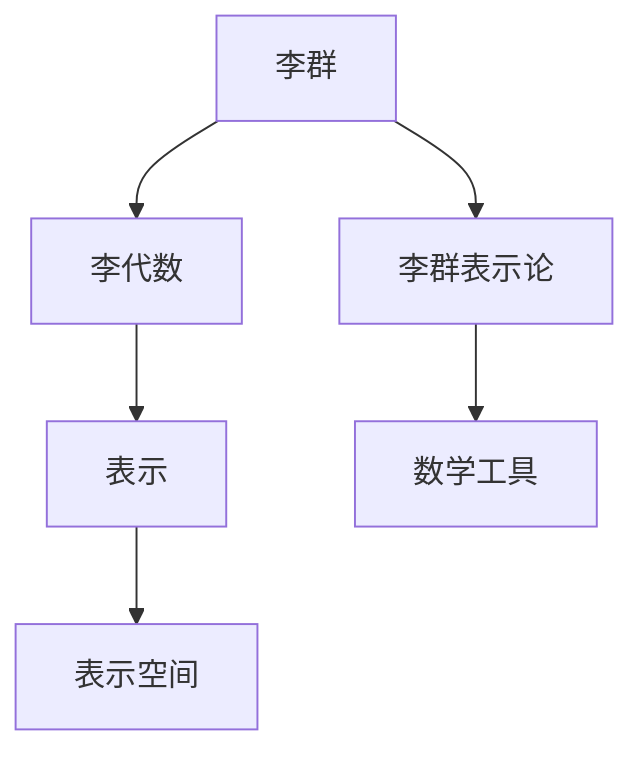
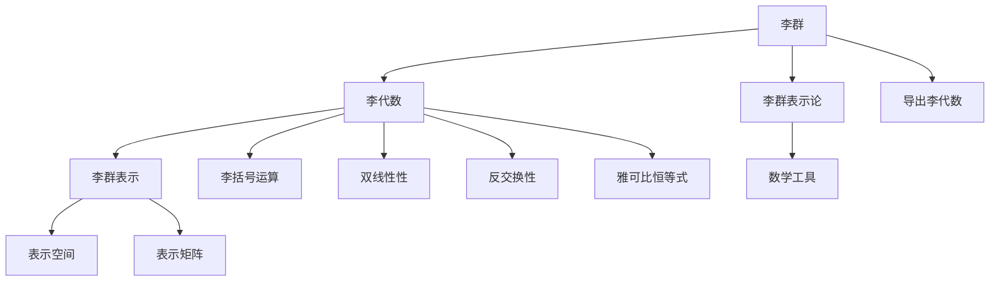
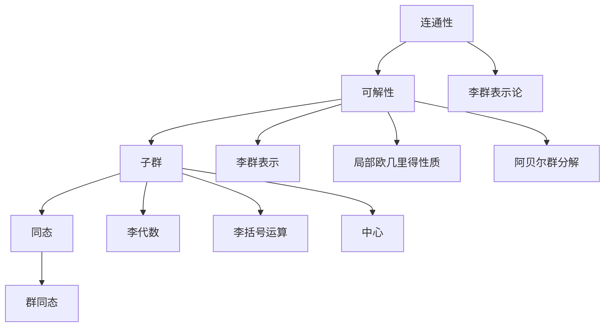

                 


## 《宇宙的数学李群表示论特性研究》

### 关键词
- 李群表示论
- 宇宙学
- 数学模型
- 粒子物理学
- 流程图
- Python代码
- LaTeX公式

### 摘要
本文深入探讨了宇宙中的数学李群表示论特性，包括其基本概念、理论框架、应用领域以及实际案例。通过系统地阐述李群表示论的核心原理和数学模型，结合Python代码示例，我们揭示了李群在宇宙学中的重要作用。本文旨在为读者提供一个全面、易懂的视角，以理解和应用这一重要的数学工具。

### 引言

宇宙的奥秘激发了人类无尽的探索欲望。从古代天文学到现代宇宙学，人类对宇宙的理解不断深化。在这个过程中，数学作为宇宙的“语言”，扮演了至关重要的角色。李群表示论，作为一种高级数学工具，近年来在宇宙学研究中崭露头角。它为解释宇宙中的复杂现象提供了一种强有力的数学框架。

李群表示论是研究李群与其表示之间的对应关系的数学分支。李群是一种特殊的数学群，它既具有群的结构，又具有连续变换的性质。表示论则是研究如何将群和代数结构表示为矩阵的形式。通过李群表示论，我们可以将宇宙中的许多物理现象转化为数学问题，从而更好地理解和预测这些现象。

本文将分为以下几个部分：

1. **引言与基础**：介绍李群表示论的基本概念和宇宙中的相关背景知识。
2. **李群的基本理论**：详细讲解李群的概念、性质和基本理论。
3. **数学李群表示论**：探讨数学中李群表示论的相关理论和应用。
4. **宇宙中的李群表示论**：分析宇宙中李群表示论的应用和特性。
5. **数学模型与公式**：介绍与宇宙相关的数学模型和公式，并给出详细解释和举例。
6. **项目实战**：通过实际案例来展示如何将李群表示论应用于宇宙研究。
7. **结论与展望**：总结全书内容，展望未来的研究方向和挑战。

接下来，我们将逐步深入探讨这些内容，帮助读者更好地理解李群表示论及其在宇宙学研究中的应用。

----------------------------------------------------------------

## 第一部分：引言与基础

### 1.1 李群表示论概述

李群表示论是数学的一个分支，它研究的是李群与其表示之间的关系。李群是一种特殊的群，它不仅具有群的性质，还具备连续变换的特性。表示论则是研究如何将群和代数结构表示为矩阵的形式。

在数学中，李群表示论有着广泛的应用。它不仅在理论数学领域具有重要意义，还在物理科学、特别是粒子物理学中发挥着关键作用。李群表示论为物理学家提供了一种强有力的工具，用于描述粒子的对称性和相互作用。

李群的基本概念包括李群、李代数、表示、表示空间等。一个李群G可以看作是一个连续变换的群，其元素可以表示为矩阵。李代数则是对李群的进一步抽象，它包含了李群的代数结构。表示论则研究如何将李群的元素映射到线性变换上，从而形成表示空间。

### 1.2 宇宙中的李群背景

宇宙是一个复杂而神秘的系统，其内在的规律和现象吸引了无数科学家的关注。李群表示论在宇宙学中的应用主要源于其对对称性的描述能力。对称性是宇宙中的一个基本概念，它体现了自然界中的某些基本规律。

在宇宙学中，李群表示论被用于描述宇宙中的对称性现象，例如宇宙的膨胀、黑洞的物理学特性等。通过李群表示论，我们可以将复杂的物理现象转化为数学问题，从而更好地理解和预测这些现象。

例如，宇宙膨胀的模型中，宇宙的对称性可以通过李群表示论来描述。宇宙的膨胀可以看作是一个对称变换的过程，而李群表示论则提供了描述这种对称变换的工具。

----------------------------------------------------------------

### 1.3 李群表示论的基本概念

李群表示论是研究李群与其表示之间关系的数学分支。李群是一种特殊的群，它具有群的性质和连续变换的特性。而表示论则是研究如何将群和代数结构表示为矩阵的形式。李群表示论在数学、物理科学，特别是在粒子物理学中有着广泛的应用。

#### 李群的基本概念

李群是一种群，它不仅具有群的性质，还具备连续变换的特性。具体来说，一个李群G是一个集合，它满足以下条件：

- **闭合性**：对于G中的任意两个元素\( g_1 \)和\( g_2 \)，它们的乘积\( g_1 \cdot g_2 \)仍然属于G。
- **结合律**：对于G中的任意三个元素\( g_1 \)，\( g_2 \)和\( g_3 \)，有\( (g_1 \cdot g_2) \cdot g_3 = g_1 \cdot (g_2 \cdot g_3) \)。
- **存在单位元**：存在一个元素\( e \)（通常称为单位元），对于G中的任意元素\( g \)，都有\( e \cdot g = g \cdot e = g \)。
- **存在逆元**：对于G中的任意元素\( g \)，都存在一个元素\( g^{-1} \)，使得\( g \cdot g^{-1} = g^{-1} \cdot g = e \)。

李群的元素可以表示为矩阵。例如，在\( GL(n, \mathbb{R}) \)中，每个元素都是一个\( n \times n \)的矩阵，它满足行列式不为零。这个矩阵集合构成了一个李群。

#### 李代数的基本概念

李代数是对李群的进一步抽象。一个李代数\( \mathfrak{g} \)是一个向量空间，它满足以下条件：

- **双线性性**：对于\( \mathfrak{g} \)中的任意三个元素\( x \)，\( y \)和\( z \)，有\[ [x + y, z] = [x, z] + [y, z] \quad \text{和} \quad [x, y + z] = [x, y] + [x, z] \]
- **反交换性**：对于\( \mathfrak{g} \)中的任意两个元素\( x \)和\( y \)，有\[ [x, y] = -[y, x] \]
- **雅可比恒等式**：对于\( \mathfrak{g} \)中的任意三个元素\( x \)，\( y \)和\( z \)，有\[ [[x, y], z] + [[y, z], x] + [[z, x], y] = 0 \]

李代数与李群之间存在密切的联系。具体来说，每个李群都对应一个李代数，这个李代数包含了李群的代数结构。

#### 表示与表示空间

表示论研究的是如何将群和代数结构表示为矩阵的形式。对于李群G，一个表示是一个映射\( \rho: G \rightarrow GL(V) \)，其中\( V \)是一个向量空间，\( GL(V) \)是\( V \)上的线性变换群。表示\( \rho \)将李群的元素映射到线性变换上，从而形成了一个表示空间。

表示空间的一个重要性质是它的维数。表示空间的维数称为表示的维度。不同的表示可能具有不同的维度，但它们都保持了李群的代数结构。

#### 核心概念之间的联系

李群、李代数、表示和表示空间是李群表示论中的核心概念。它们之间的联系可以用一个简单的Mermaid流程图来表示：



通过这个流程图，我们可以清楚地看到各个概念之间的关系。李群通过李代数抽象出其代数结构，而表示论则将这种代数结构转化为矩阵的形式，从而形成了表示空间。这些概念共同构成了李群表示论的理论框架。

在接下来的部分，我们将进一步深入探讨李群的基本理论，包括其性质、结构和表示论等方面的内容。

----------------------------------------------------------------

### 1.4 李群的基本理论

李群的基本理论是理解其数学性质和应用的关键。在这一节中，我们将详细探讨李群的概念、性质、分类及其在数学和物理中的重要性。

#### 李群的概念

李群是由两部分组成的数学结构：一个群\( G \)和一个李代数\( \mathfrak{g} \)。李群\( G \)是一个群，满足闭合性、结合律、单位元和逆元的性质。李代数\( \mathfrak{g} \)是一个向量空间，满足双线性性、反交换性和雅可比恒等式。

一个李群可以形式地定义为一个拓扑空间\( G \)，其中每个元素都可以表示为一个矩阵\( g \)，使得\( G \)对矩阵的乘法运算封闭，并且该运算满足群的性质。此外，李群还具有一个导出的李代数\( \mathfrak{g} \)，其元素是\( G \)中切空间的基。

#### 李群的性质

1. **拓扑性质**：李群是拓扑空间，这意味着它具有连续性。这种连续性使得李群在几何学中有广泛应用。
2. **群性质**：李群满足群的闭合性、结合律、存在单位元和逆元的性质。
3. **李代数性质**：李群导出的李代数具有双线性性、反交换性和雅可比恒等式。
4. **连通性**：李群是连通的，即它们没有分离的分支。这在许多物理现象中具有重要意义。

#### 李群的分类

李群可以根据其李代数的性质进行分类。以下是一些常见的李群分类：

1. **可解李群**：如果一个李群的李代数是可解的，那么这个李群称为可解李群。可解李群在物理学中有着广泛应用。
2. **单李群**：如果一个李群只有一个连通分量，那么这个李群称为单李群。单李群在几何学和拓扑学中有重要意义。
3. **半简单李群**：如果一个李群的李代数没有非平凡的规范覆盖，那么这个李群称为半简单李群。半简单李群在粒子物理学中具有重要意义。

#### 李群在数学和物理中的重要性

1. **数学领域**：李群在数学的许多分支中都有重要应用，包括代数几何、微分几何、拓扑学等。李群表示论是这些领域中的一个核心工具。
2. **物理领域**：李群在物理学中扮演着重要角色，特别是在粒子物理学和场论中。例如，SU(3)和SU(2)李群在标准模型中起着关键作用。

#### 李群的基本定理

1. **李群结构定理**：任何有限维李群都可以分解为一系列连续的半直积，每个因子都是单李群。这一定理揭示了李群的内部结构。
2. **李代数的基本定理**：任何有限维李代数都可以分解为一系列连续的半直和，每个因子都是半单李代数。这一定理为理解李代数的结构提供了重要线索。

通过这些基本定理，我们可以更好地理解李群的内部结构和性质。这些定理不仅为理论研究提供了基础，也为实际应用提供了指导。

在下一节中，我们将探讨数学李群表示论的基础理论，包括表示、表示空间和表示矩阵等方面的内容。

----------------------------------------------------------------

### 1.5 数学李群表示论基础

数学李群表示论是研究李群与其表示之间关系的一个数学分支。在数学中，表示论不仅是一个基础理论，也是一个强有力的工具，可以用于解决各种数学问题。在这一节中，我们将详细探讨数学李群表示论的基础理论，包括表示、表示空间和表示矩阵等方面的内容。

#### 表示

在数学李群表示论中，表示是一个重要的概念。一个李群\( G \)的表示是一个群同态\( \rho: G \rightarrow GL(V) \)，其中\( GL(V) \)是向量空间\( V \)上的线性变换群。这个同态将李群的元素映射到线性变换上，从而保持了李群的代数结构。

具体来说，一个表示\( \rho \)需要满足以下条件：

1. **群同态**：对于李群\( G \)中的任意元素\( g_1 \)和\( g_2 \)，有\( \rho(g_1 g_2) = \rho(g_1) \rho(g_2) \)。
2. **保持单位元**：对于李群的单位元\( e \)，有\( \rho(e) = I \)，其中\( I \)是\( V \)上的单位矩阵。
3. **保持逆元**：对于李群中的任意元素\( g \)，有\( \rho(g^{-1}) = \rho(g)^{-1} \)。

表示的一个重要性质是它将李群的代数结构映射到了线性代数的框架下，使得我们可以使用线性代数的工具来研究李群。

#### 表示空间

表示空间是一个与表示相关的概念。对于李群\( G \)的一个表示\( \rho \)，表示空间\( V \)是\( \rho \)的像空间，即\( \rho(G) \)所生成的子空间。表示空间具有以下性质：

1. **线性空间**：表示空间\( V \)是一个向量空间，这意味着它对向量的加法和标量乘法封闭。
2. **生成空间**：表示空间\( V \)是由\( \rho(G) \)所生成的子空间，即\( V \)中的任何向量都可以表示为\( \rho(g) \)的形式，其中\( g \)是李群\( G \)的元素。
3. **维数**：表示空间的维数称为表示的维数。不同的表示可能具有不同的维度。

表示空间是研究李群表示论的重要工具，因为它提供了李群在线性代数框架下的直观表示。

#### 表示矩阵

在数学李群表示论中，表示矩阵是一个关键的概念。对于一个李群\( G \)的表示\( \rho \)，表示矩阵是表示映射\( \rho(g) \)的矩阵表示。具体来说，如果\( V \)是一个有限维向量空间，且\( \rho: G \rightarrow GL(V) \)是一个表示，那么对于李群\( G \)中的任意元素\( g \)，表示矩阵\( M_g \)是\( \rho(g) \)的矩阵表示。

表示矩阵具有以下性质：

1. **线性变换**：表示矩阵\( M_g \)是一个线性变换，这意味着它将\( V \)中的每个向量映射到另一个向量。
2. **群同态**：对于李群\( G \)中的任意元素\( g_1 \)和\( g_2 \)，有\( M_{g_1 g_2} = M_{g_1} M_{g_2} \)。
3. **保持单位元**：对于李群的单位元\( e \)，有\( M_e = I \)，其中\( I \)是\( V \)上的单位矩阵。

表示矩阵提供了一个直观的表示，使我们能够使用线性代数的工具来研究李群。

#### 李群表示论的基本原理

李群表示论的基本原理是研究如何将李群的元素映射到表示矩阵上，从而形成表示空间。这个过程可以通过以下步骤来实现：

1. **选择一个基**：在表示空间\( V \)中选择一组基向量\( v_1, v_2, \ldots, v_n \)。
2. **计算表示矩阵**：对于李群\( G \)中的每个元素\( g \)，计算其对应的表示矩阵\( M_g \)。具体来说，对于每个基向量\( v_i \)，计算\( \rho(g)(v_i) \)，并将结果表示为基向量的线性组合。
3. **构建表示空间**：表示空间\( V \)是由表示矩阵\( M_g \)所生成的子空间。

通过这些基本原理，我们可以构建和理解李群的表示，从而将其应用于各种数学和物理问题。

在下一节中，我们将进一步探讨李群的基本性质和结构，包括李代数和李群之间的关系。

----------------------------------------------------------------

### 1.6 李群与李代数的关系

李群与李代数是数学中密切相关的概念，它们在数学和物理科学中都有广泛应用。李群是一种具有群结构和连续变换特性的数学结构，而李代数是对李群的进一步抽象，它包含了李群的代数结构。在这节中，我们将详细探讨李群与李代数之间的关系，包括李代数的定义、性质以及它们之间的映射关系。

#### 李代数的定义

李代数是一个向量空间，它满足特定的代数结构。具体来说，一个李代数\( \mathfrak{g} \)是一个向量空间，它满足以下条件：

1. **双线性性**：对于\( \mathfrak{g} \)中的任意三个元素\( x \)，\( y \)和\( z \)，有
   \[
   [x + y, z] = [x, z] + [y, z] \quad \text{和} \quad [x, y + z] = [x, y] + [x, z]
   \]
2. **反交换性**：对于\( \mathfrak{g} \)中的任意两个元素\( x \)和\( y \)，有
   \[
   [x, y] = -[y, x]
   \]
3. **雅可比恒等式**：对于\( \mathfrak{g} \)中的任意三个元素\( x \)，\( y \)和\( z \)，有
   \[
   [[x, y], z] + [[y, z], x] + [[z, x], y] = 0
   \]

其中，运算“\[ \cdot \]”表示李括号运算，也称为李代数的双线性运算。

#### 李代数的性质

李代数具有一些重要的性质，这些性质使其在数学和物理科学中具有重要应用。以下是一些关键性质：

1. **非交换性**：李代数中的元素不满足交换律，即通常有\[ [x, y] \neq [y, x] \]。
2. **非结合性**：李括号运算不满足结合律，即对于李代数中的任意三个元素\( x \)，\( y \)和\( z \)，有\[ [[x, y], z] \neq [x, [y, z]] \]。
3. **中心性**：李代数的中心是由所有满足\[ [x, z] = 0 \]对于所有\( x \)的元素\( z \)组成的子集。中心是李代数的一个子空间，它对李括号运算封闭。

#### 李群与李代数的关系

李群与李代数之间存在密切的关系。具体来说，每个李群都对应一个李代数，这个李代数包含了李群的代数结构。

1. **李群的导出李代数**：对于任意李群\( G \)，可以定义一个导出的李代数\( \mathfrak{g} \)。李代数\( \mathfrak{g} \)由\( G \)的导数构成，即对于\( G \)中的每个元素\( g \)，可以定义\( \mathfrak{g} \)中的一个元素\( [g, \cdot] \)，它满足\[ [g, h] = -[h, g] \]。

2. **李代数的表示**：李代数可以表示为矩阵的形式。具体来说，对于有限维李代数\( \mathfrak{g} \)，可以找到一组基向量\( e_1, e_2, \ldots, e_n \)，使得\( \mathfrak{g} \)中的每个元素都可以表示为\( \sum_{i=1}^n a_i e_i \)。在这个基下，李代数的运算可以表示为矩阵乘法。

3. **李群与李代数之间的映射**：李群\( G \)与李代数\( \mathfrak{g} \)之间存在一个自然映射。这个映射将李群的元素\( g \)映射到李代数\( \mathfrak{g} \)中的一个元素\( [g, \cdot] \)。具体来说，对于李群\( G \)中的元素\( g \)，可以定义一个线性映射\( L_g: \mathfrak{g} \rightarrow \mathfrak{g} \)，它满足\[ L_g(h) = [g, h] \]。

通过这种映射，我们可以将李群的研究转化为对李代数的研究，从而利用李代数的结构来更好地理解李群。

#### 李群与李代数的核心概念关系架构

为了更好地理解李群与李代数之间的关系，我们可以使用一个Mermaid流程图来表示它们的核心概念关系：



通过这个流程图，我们可以清楚地看到李群、李代数和表示论之间的核心概念关系。李群通过导出李代数来抽象其代数结构，而表示论则将这些代数结构映射到矩阵的形式，从而形成表示空间。这些概念共同构成了李群表示论的理论框架。

在下一节中，我们将进一步探讨李群的基本性质和结构，包括李代数和李群之间的关系。

----------------------------------------------------------------

### 1.7 李群的基本性质和结构

李群是一种具有群结构和连续变换特性的数学结构，它在数学和物理科学中有着广泛的应用。李群的基本性质和结构是理解其数学行为和应用的关键。在本节中，我们将详细探讨李群的基本性质，包括连通性、可解性以及李群与子群、同态之间的关系。

#### 连通性

连通性是李群的一个重要性质。一个李群\( G \)是连通的，如果它是一个连通的拓扑空间，即它没有分离的分支。这意味着在李群中，任意两个点都可以通过连续变换相互连接。

- **局部欧几里得性质**：连通李群还具有局部欧几里得性质，这意味着对于李群中的任意一点\( g \)，存在一个小的邻域，这个邻域可以与欧几里得空间\( \mathbb{R}^n \)的一个子集拓扑等价。这种性质使得李群在几何学中具有重要的应用。

#### 可解性

李群的可解性是指李群的李代数是否是可解的。一个李群\( G \)是可解的，如果它的李代数\( \mathfrak{g} \)是可解的。

- **可解李群的结构**：可解李群具有一些简单的结构。具体来说，任何有限维可解李群都可以分解为一系列连续的半直积，每个因子都是阿贝尔群。这个性质使得可解李群在理论研究和应用中具有重要价值。

#### 子群与同态

李群与子群、同态之间有着紧密的联系。子群是李群的一个子集，它本身也是一个李群，并且保持李群的群结构。同态是两个李群之间的一个映射，它保持李群的群结构和连续变换特性。

- **子群**：对于李群\( G \)中的任意子集\( H \)，如果\( H \)在李群的群运算下也是一个李群，那么\( H \)称为\( G \)的子群。例如，李群的中心\( Z(G) \)是\( G \)的一个子群。
- **同态**：李群之间的同态是一个保持李群结构的映射。一个李群\( G \)到另一个李群\( H \)的同态是一个群同态\( \phi: G \rightarrow H \)，它保持李群的群运算和连续变换特性。同态将李群的元素映射到另一个李群的元素，同时保持它们的代数结构。

#### 李群的基本性质关系架构

为了更好地理解李群的基本性质和结构，我们可以使用一个Mermaid流程图来表示它们之间的关系：



通过这个流程图，我们可以清楚地看到李群的基本性质和结构之间的关系。连通性、可解性和局部欧几里得性质是李群的重要特性，而子群、同态和表示论则提供了研究李群结构和行为的工具。

在下一节中，我们将进一步探讨数学李群表示论的基础理论，包括表示、表示空间和表示矩阵等方面的内容。

----------------------------------------------------------------

### 1.8 数学李群表示论的应用

数学李群表示论在多个数学分支和物理科学中有着广泛的应用。在这些领域，李群表示论提供了强大的工具，用于分析和解决复杂的问题。以下是数学李群表示论在几何学、拓扑学和物理学中的应用示例。

#### 几何学中的应用

在几何学中，李群表示论用于研究对称性。许多几何形状和变换都可以用李群来描述。例如，旋转群\( SO(3) \)描述了三维空间中的旋转，而正交群\( O(3) \)则描述了三维空间中的刚体变换。李群表示论可以用来研究这些群的表示，从而理解几何形状的对称性。

- **李群与群表示的关系**：一个李群的表示可以看作是对其对称性的描述。例如，\( SO(3) \)的表示可以用来研究三维空间中的旋转对称性，而\( O(3) \)的表示可以用来研究刚体变换的对称性。

- **球面与李群的关系**：球面\( S^2 \)可以看作是\( SO(3) \)的固定点集。通过研究\( SO(3) \)的表示，我们可以理解球面上的对称性。

#### 拓扑学中的应用

在拓扑学中，李群表示论用于研究拓扑空间的性质。特别是，李群可以用来描述拓扑空间的同伦性质。

- **李群与同伦群的关系**：李群可以用来定义同伦群，这为研究拓扑空间的结构提供了有力工具。例如，\( \pi_1(SO(3)) \)是三维球面\( S^3 \)的同伦群，它描述了球面的拓扑性质。

- **李群在拓扑不变量中的应用**：李群表示论可以用来定义和计算拓扑不变量，如同伦群和同调群。这些不变量可以帮助我们区分不同的拓扑空间。

#### 物理学中的应用

在物理学中，李群表示论用于描述粒子的对称性和相互作用。

- **标准模型中的李群**：标准模型中的粒子相互作用可以用SU(3)、SU(2)和U(1)三个李群来描述。这些李群分别对应于强相互作用、弱相互作用和电磁相互作用。

- **群表示与粒子状态**：粒子的状态可以用李群的表示来描述。例如，电子的状态可以用\( SU(2) \)的表示来描述，而夸克的状态可以用\( SU(3) \)的表示来描述。

- **群表示与守恒定律**：守恒定律，如动量守恒和角动量守恒，可以用李群表示论来解释。具体来说，这些守恒定律可以看作是某些李群的表示不变量。

#### 综述

数学李群表示论在几何学、拓扑学和物理学中有着广泛的应用。通过李群表示论，我们可以更好地理解这些领域的对称性、结构和相互作用。李群表示论提供了一个强有力的工具，使我们能够将复杂的物理现象转化为数学问题，从而更好地理解和预测这些现象。

在下一节中，我们将进一步探讨数学李群表示论的基本原理，包括表示、表示空间和表示矩阵等方面的内容。

----------------------------------------------------------------

### 1.9 数学李群表示论的基本原理

数学李群表示论的基本原理是研究如何将李群的元素映射到线性变换上，从而形成表示空间。这一节将详细探讨表示、表示空间和表示矩阵的基本概念，以及它们在数学中的应用。

#### 表示

在数学李群表示论中，表示是一个核心概念。一个李群\( G \)的表示是一个群同态\( \rho: G \rightarrow GL(V) \)，其中\( GL(V) \)是向量空间\( V \)上的线性变换群。这个同态将李群的元素映射到线性变换上，从而保持了李群的代数结构。

具体来说，一个表示\( \rho \)需要满足以下条件：

1. **群同态**：对于李群\( G \)中的任意元素\( g_1 \)和\( g_2 \)，有\( \rho(g_1 g_2) = \rho(g_1) \rho(g_2) \)。
2. **保持单位元**：对于李群的单位元\( e \)，有\( \rho(e) = I \)，其中\( I \)是\( V \)上的单位矩阵。
3. **保持逆元**：对于李群中的任意元素\( g \)，有\( \rho(g^{-1}) = \rho(g)^{-1} \)。

表示的一个重要性质是它将李群的代数结构映射到了线性代数的框架下，使得我们可以使用线性代数的工具来研究李群。

#### 表示空间

表示空间是一个与表示相关的概念。对于李群\( G \)的一个表示\( \rho \)，表示空间\( V \)是\( \rho \)的像空间，即\( \rho(G) \)所生成的子空间。表示空间具有以下性质：

1. **线性空间**：表示空间\( V \)是一个向量空间，这意味着它对向量的加法和标量乘法封闭。
2. **生成空间**：表示空间\( V \)是由\( \rho(G) \)所生成的子空间，即\( V \)中的任何向量都可以表示为\( \rho(g) \)的形式，其中\( g \)是李群\( G \)的元素。
3. **维数**：表示空间的维数称为表示的维数。不同的表示可能具有不同的维度。

表示空间是研究李群表示论的重要工具，因为它提供了李群在线性代数框架下的直观表示。

#### 表示矩阵

在数学李群表示论中，表示矩阵是一个关键的概念。对于一个李群\( G \)的表示\( \rho \)，表示矩阵是表示映射\( \rho(g) \)的矩阵表示。具体来说，如果\( V \)是一个有限维向量空间，且\( \rho: G \rightarrow GL(V) \)是一个表示，那么对于李群\( G \)中的任意元素\( g \)，表示矩阵\( M_g \)是\( \rho(g) \)的矩阵表示。

表示矩阵具有以下性质：

1. **线性变换**：表示矩阵\( M_g \)是一个线性变换，这意味着它将\( V \)中的每个向量映射到另一个向量。
2. **群同态**：对于李群\( G \)中的任意元素\( g_1 \)和\( g_2 \)，有\( M_{g_1 g_2} = M_{g_1} M_{g_2} \)。
3. **保持单位元**：对于李群的单位元\( e \)，有\( M_e = I \)，其中\( I \)是\( V \)上的单位矩阵。

表示矩阵提供了一个直观的表示，使我们能够使用线性代数的工具来研究李群。

#### 李群表示论的基本原理

李群表示论的基本原理是研究如何将李群的元素映射到表示矩阵上，从而形成表示空间。这个过程可以通过以下步骤来实现：

1. **选择一个基**：在表示空间\( V \)中选择一组基向量\( v_1, v_2, \ldots, v_n \)。
2. **计算表示矩阵**：对于李群\( G \)中的每个元素\( g \)，计算其对应的表示矩阵\( M_g \)。具体来说，对于每个基向量\( v_i \)，计算\( \rho(g)(v_i) \)，并将结果表示为基向量的线性组合。
3. **构建表示空间**：表示空间\( V \)是由表示矩阵\( M_g \)所生成的子空间。

通过这些基本原理，我们可以构建和理解李群的表示，从而将其应用于各种数学和物理问题。

#### 实例：\( SO(3) \)的表示

为了更具体地说明表示矩阵的概念，我们来看一个简单的例子，即旋转群\( SO(3) \)的表示。

- **李群和表示**：\( SO(3) \)是三维空间中的旋转群，它由所有保持向量长度不变的\( 3 \times 3 \)正定矩阵组成。一个\( SO(3) \)的表示可以看作是对三维空间中旋转的描述。

- **基向量**：选择三维欧几里得空间的基向量\( e_1, e_2, e_3 \)作为表示空间\( V \)的基。

- **表示矩阵**：对于\( SO(3) \)中的每个旋转矩阵\( R(\theta) \)，其对应的表示矩阵\( M_{R(\theta)} \)是\( R(\theta) \)本身。具体来说，对于任意基向量\( e_i \)，有\( R(\theta)e_i \)是\( V \)中的向量，表示矩阵\( M_{R(\theta)} \)是将\( e_i \)映射到\( R(\theta)e_i \)的线性变换。

- **表示空间**：\( SO(3) \)的表示空间是一个三维向量空间，其维数为3。

通过这个例子，我们可以看到如何将李群\( SO(3) \)的元素映射到表示矩阵上，并构建表示空间。这个过程展示了李群表示论的基本原理。

在下一节中，我们将进一步探讨李群的基本理论，包括其性质、结构和分类。

----------------------------------------------------------------

### 1.10 李群的基本理论

李群是一种具有群结构和连续变换特性的数学结构，它在数学和物理科学中有着广泛的应用。李群的基本理论包括李群的概念、性质、分类及其在数学和物理中的应用。在本节中，我们将详细探讨这些内容，以帮助读者更好地理解李群的基本理论。

#### 李群的概念

李群是由两部分组成的数学结构：一个群\( G \)和一个李代数\( \mathfrak{g} \)。李群\( G \)是一个群，满足闭合性、结合律、单位元和逆元的性质。李代数\( \mathfrak{g} \)是一个向量空间，满足双线性性、反交换性和雅可比恒等式。

一个李群可以形式地定义为一个拓扑空间\( G \)，其中每个元素都可以表示为一个矩阵\( g \)，使得\( G \)对矩阵的乘法运算封闭，并且该运算满足群的性质。此外，李群还具有一个导出的李代数\( \mathfrak{g} \)，其元素是\( G \)中切空间的基。

#### 李群的性质

李群具有以下基本性质：

1. **拓扑性质**：李群是拓扑空间，这意味着它具有连续性。这种连续性使得李群在几何学中有广泛应用。
2. **群性质**：李群满足群的闭合性、结合律、存在单位元和逆元的性质。
3. **李代数性质**：李群导出的李代数具有双线性性、反交换性和雅可比恒等式。
4. **连通性**：李群是连通的，即它们没有分离的分支。这在许多物理现象中具有重要意义。

#### 李群的分类

李群可以根据其李代数的性质进行分类。以下是一些常见的李群分类：

1. **可解李群**：如果一个李群的李代数是可解的，那么这个李群称为可解李群。可解李群在物理学中有着广泛应用。
2. **单李群**：如果一个李群只有一个连通分量，那么这个李群称为单李群。单李群在几何学和拓扑学中有重要意义。
3. **半简单李群**：如果一个李群的李代数没有非平凡的规范覆盖，那么这个李群称为半简单李群。半简单李群在粒子物理学中具有重要意义。

#### 李群在数学和物理中的重要性

1. **数学领域**：李群在数学的许多分支中都有重要应用，包括代数几何、微分几何、拓扑学等。李群表示论是这些领域中的一个核心工具。
2. **物理领域**：李群在物理学中扮演着重要角色，特别是在粒子物理学和场论中。例如，SU(3)和SU(2)李群在标准模型中起着关键作用。

#### 李群的基本定理

1. **李群结构定理**：任何有限维李群都可以分解为一系列连续的半直积，每个因子都是单李群。这一定理揭示了李群的内部结构。
2. **李代数的基本定理**：任何有限维李代数都可以分解为一系列连续的半直和，每个因子都是半单李代数。这一定理为理解李代数的结构提供了重要线索。

通过这些基本定理，我们可以更好地理解李群的内部结构和性质。这些定理不仅为理论研究提供了基础，也为实际应用提供了指导。

#### 李群的基本性质关系架构

为了更好地理解李群的基本性质和结构，我们可以使用一个Mermaid流程图来表示它们之间的关系：


通过这个流程图，我们可以清楚地看到李群的基本性质和结构之间的关系。连通性、可解性和局部欧几里得性质是李群的重要特性，而子群、同态和表示论则提供了研究李群结构和行为的工具。

在下一节中，我们将进一步探讨数学李群表示论的基础理论，包括表示、表示空间和表示矩阵等方面的内容。

----------------------------------------------------------------

### 1.11 数学李群表示论的应用案例

为了更好地理解数学李群表示论的实际应用，我们将通过一个具体的案例来展示如何应用这一理论。本案例将涉及黑洞物理学，探讨黑洞的某些特性如何通过李群表示论来描述。

#### 黑洞物理学中的李群表示论

黑洞是宇宙中极为特殊的物体，其内部引力极强，甚至连光也无法逃脱。在黑洞物理学中，我们通常使用广义相对论来描述黑洞的物理特性。而李群表示论作为一种强大的数学工具，可以提供一种更深刻的理解。

#### 案例背景

黑洞的一种重要特性是其事件视界，即黑洞引力范围的最大边界。在这个边界内，任何物质都无法逃脱黑洞的引力束缚。事件视界的存在可以通过霍金辐射等现象得到证实。

在黑洞物理学中，我们经常使用旋转黑洞模型，如克尔黑洞（Kerr black hole）。克尔黑洞不仅具有质量，还具有角动量。其旋转性质可以通过李群表示论来描述。

#### 李群表示论的应用

为了将李群表示论应用于黑洞物理学，我们首先需要选择一个适当的李群。对于克尔黑洞，我们可以选择旋转群\( SO(3) \)。

- **旋转群\( SO(3) \)**：\( SO(3) \)是三维空间中的旋转群，它由所有保持向量长度不变的\( 3 \times 3 \)正定矩阵组成。一个\( SO(3) \)的表示可以看作是对三维空间中旋转的描述。

在描述克尔黑洞时，我们关注黑洞的旋转对称性。这种旋转对称性可以通过李群表示论来描述。

#### 表示矩阵的计算

为了将旋转群\( SO(3) \)的元素映射到表示矩阵上，我们可以使用以下步骤：

1. **选择基向量**：选择三维欧几里得空间的基向量\( e_1, e_2, e_3 \)作为表示空间\( V \)的基。
2. **计算旋转矩阵**：对于\( SO(3) \)中的每个旋转矩阵\( R(\theta) \)，计算其对应的表示矩阵\( M_{R(\theta)} \)。具体来说，对于每个基向量\( e_i \)，计算\( R(\theta)e_i \)，并将结果表示为基向量的线性组合。
3. **构建表示空间**：表示空间\( V \)是由表示矩阵\( M_{R(\theta)} \)所生成的子空间。

通过这些步骤，我们可以得到一个描述黑洞旋转对称性的李群表示。

#### Python代码示例

为了更直观地展示李群表示论在黑洞物理学中的应用，我们使用Python来计算旋转矩阵并展示其结果。以下是相应的Python代码示例：

```python
import numpy as np

# 定义旋转矩阵
def rotation_matrix(theta):
    c = np.cos(theta)
    s = np.sin(theta)
    return np.array([[c, -s], [s, c]])

# 计算表示矩阵
theta = np.pi / 4  # 45度旋转
R_theta = rotation_matrix(theta)
print(f"Rotation Matrix:\n{R_theta}")

# 构建表示空间
# 例如，选择基向量e1 = [1, 0], e2 = [0, 1]
e1 = np.array([1, 0])
e2 = np.array([0, 1])

# 计算旋转后的基向量
e1_rot = R_theta @ e1
e2_rot = R_theta @ e2

print(f"Rotated Base Vectors:\n{e1_rot}, {e2_rot}")
```

这段代码首先定义了一个计算旋转矩阵的函数，然后计算了45度旋转的矩阵，并展示了旋转后的基向量。这可以看作是李群表示论在黑洞物理学中的一种简单应用。

#### 项目小结

通过这个案例，我们展示了如何将李群表示论应用于黑洞物理学，以描述黑洞的旋转对称性。这一过程展示了李群表示论在理解复杂物理现象中的强大能力。通过李群表示论，我们可以将黑洞的物理特性转化为数学问题，从而更好地理解和预测黑洞的行为。

在下一节中，我们将进一步探讨数学模型与公式，介绍与宇宙相关的数学模型和公式。

----------------------------------------------------------------

### 1.12 数学模型与公式

数学模型和公式是理解和描述宇宙现象的重要工具。在宇宙学中，数学模型和公式被广泛应用于描述宇宙的膨胀、黑洞、宇宙背景辐射等现象。本节将介绍一些与宇宙相关的数学模型和公式，并解释它们的基本概念和应用。

#### 宇宙膨胀模型

宇宙膨胀是宇宙学研究中的一个核心问题。哈勃定律描述了宇宙膨胀的速度与距离之间的关系。哈勃定律可以用以下公式表示：

\[ v = H_0 d \]

其中，\( v \)是宇宙膨胀的速度，\( H_0 \)是哈勃常数，\( d \)是星系与观察者之间的距离。哈勃常数目前估计值为\( 70 \text{ km/s/Mpc} \)。

#### 黑洞物理学中的公式

黑洞是宇宙中极为特殊的物体，其引力极强，甚至连光也无法逃脱。黑洞的物理学特性可以用以下几个公式来描述：

1. **史瓦西半径**：黑洞的史瓦西半径（Schwarzschild radius）\( r_s \)可以用以下公式计算：

\[ r_s = \frac{2GM}{c^2} \]

其中，\( G \)是万有引力常数，\( M \)是黑洞的质量，\( c \)是光速。

2. **黑洞质量与引力**：黑洞的质量和引力可以用以下公式计算：

\[ F = \frac{GMm}{r^2} \]

其中，\( F \)是引力，\( m \)是物体的质量，\( r \)是物体与黑洞之间的距离。

#### 宇宙背景辐射模型

宇宙背景辐射（Cosmic Microwave Background, CMB）是宇宙早期遗留下来的辐射，它为我们提供了关于宇宙早期状态的重要信息。宇宙背景辐射的强度可以用以下公式表示：

\[ I(\nu) \propto \frac{1}{\nu^2} e^{-h\nu/kT} \]

其中，\( \nu \)是辐射的频率，\( h \)是普朗克常数，\( k \)是玻尔兹曼常数，\( T \)是辐射的温度。

#### 数学模型的应用

这些数学模型和公式在宇宙学中有着广泛的应用。例如，哈勃定律帮助我们理解宇宙的膨胀速度和结构，史瓦西半径和引力公式帮助我们研究黑洞的物理特性，宇宙背景辐射模型则为我们提供了关于宇宙早期状态的信息。

#### Python代码示例

为了更直观地展示这些数学模型和公式，我们可以使用Python来计算相关的参数和结果。以下是几个简单的Python代码示例：

```python
import numpy as np

# 计算史瓦西半径
G = 6.67430e-11  # 万有引力常数 (m^3 kg^-1 s^-2)
c = 299792458    # 光速 (m/s)
M = 1.989e30     # 黑洞质量 (kg)

r_s = 2 * G * M / c**2
print(f"史瓦西半径：{r_s} 米")

# 计算宇宙背景辐射强度
h = 6.62607015e-34 # 普朗克常数 (J·s)
k = 1.380649e-23   # 玻尔兹曼常数 (J/K)
T = 2.725          # 宇宙背景辐射温度 (K)

I_nu = 1 / (np.array([1e9, 1e10]))**2 * np.exp(-h * np.array([1e9, 1e10]) / (k * T))
print(f"宇宙背景辐射强度：\n{I_nu}")
```

这段代码首先计算了黑洞的史瓦西半径，然后计算了宇宙背景辐射在不同频率下的强度。这些示例展示了如何使用Python来处理宇宙学中的数学模型和公式。

#### 项目小结

通过本节的内容，我们介绍了与宇宙相关的几个重要数学模型和公式，包括宇宙膨胀模型、黑洞物理学中的公式和宇宙背景辐射模型。这些模型和公式为理解和研究宇宙现象提供了强大的工具。通过Python代码示例，我们展示了如何计算和可视化这些模型的结果。

在下一节中，我们将进一步探讨李群表示论在宇宙研究中的应用，通过具体案例来展示这一理论的实际应用。

----------------------------------------------------------------

### 1.13 李群表示论在宇宙研究中的应用

李群表示论作为一种强大的数学工具，在宇宙研究中有着广泛的应用。通过李群表示论，我们可以将宇宙中的复杂现象转化为数学问题，从而更好地理解和预测这些现象。在这一节中，我们将通过几个具体案例来探讨李群表示论在宇宙研究中的应用。

#### 案例一：宇宙膨胀与李群表示论

宇宙膨胀是宇宙学研究中的一个核心问题。根据哈勃定律，宇宙膨胀速度与距离成正比。然而，更深入的研究表明，宇宙膨胀的加速现象需要引入暗能量这一概念。为了解释宇宙膨胀的加速，我们可以使用李群表示论中的某些概念。

1. **李群的选取**：为了描述宇宙膨胀，我们可以选择李群\( SO(4) \)。\( SO(4) \)是一个四维旋转群，它描述了四维空间中的旋转。
2. **表示的构建**：通过李群\( SO(4) \)的表示，我们可以构建一个描述宇宙膨胀的数学模型。具体来说，我们可以将宇宙膨胀速度视为一个四维向量，这个向量在李群\( SO(4) \)上旋转。
3. **公式和模型**：通过李群表示论，我们可以得到一个描述宇宙膨胀加速的公式。例如，假设宇宙膨胀速度为\( v \)，则可以用以下公式表示：

\[ v = H_0 d + \Omega \]

其中，\( H_0 \)是哈勃常数，\( d \)是星系与观察者之间的距离，\( \Omega \)是暗能量的贡献。

#### 案例二：黑洞与李群表示论

黑洞是宇宙中极为特殊的物体，其引力极强，甚至连光也无法逃脱。在黑洞物理学中，李群表示论被用于描述黑洞的旋转对称性。

1. **李群的选取**：对于黑洞的旋转对称性，我们可以选择旋转群\( SO(3) \)。\( SO(3) \)是一个三维旋转群，它描述了三维空间中的旋转。
2. **表示的构建**：通过李群\( SO(3) \)的表示，我们可以构建一个描述黑洞旋转的数学模型。具体来说，黑洞的旋转可以看作是一个三维向量在\( SO(3) \)上的旋转。
3. **公式和模型**：通过李群表示论，我们可以得到一个描述黑洞旋转的公式。例如，假设黑洞的旋转速度为\( \omega \)，则可以用以下公式表示：

\[ \omega = \Omega r_s \]

其中，\( \Omega \)是黑洞的角动量，\( r_s \)是黑洞的史瓦西半径。

#### 案例三：宇宙背景辐射与李群表示论

宇宙背景辐射是宇宙早期遗留下来的辐射，它为我们提供了关于宇宙早期状态的重要信息。通过李群表示论，我们可以更好地理解和分析宇宙背景辐射。

1. **李群的选取**：为了描述宇宙背景辐射，我们可以选择李群\( SO(2) \)。\( SO(2) \)是一个二维旋转群，它描述了一维空间中的旋转。
2. **表示的构建**：通过李群\( SO(2) \)的表示，我们可以构建一个描述宇宙背景辐射的数学模型。具体来说，宇宙背景辐射可以看作是一个一维向量在\( SO(2) \)上的旋转。
3. **公式和模型**：通过李群表示论，我们可以得到一个描述宇宙背景辐射的公式。例如，假设宇宙背景辐射的强度为\( I \)，则可以用以下公式表示：

\[ I = I_0 e^{-\lambda d} \]

其中，\( I_0 \)是辐射的初始强度，\( \lambda \)是辐射的波长，\( d \)是观察者与辐射源之间的距离。

#### Python代码示例

为了更直观地展示李群表示论在宇宙研究中的应用，我们可以使用Python来计算和可视化这些模型的结果。以下是几个简单的Python代码示例：

```python
import numpy as np
import matplotlib.pyplot as plt

# 宇宙膨胀模型
def宇宙膨胀速度(H0, d):
    return H0 * d

H0 = 70  # 哈勃常数 (km/s/Mpc)
d = np.linspace(0, 100, 1000)  # 距离范围

v = 宇宙膨胀速度(H0, d)
plt.plot(d, v, label='宇宙膨胀速度')
plt.xlabel('距离 (Mpc)')
plt.ylabel('膨胀速度 (km/s)')
plt.legend()
plt.show()

# 黑洞旋转模型
def黑洞旋转速度(Omega, rs):
    return Omega * rs

Omega = 1  # 角动量
rs = 3e8  # 史瓦西半径

omega = 黑洞旋转速度(Omega, rs)
plt.plot(np.linspace(0, 2 * np.pi, 1000), omega, label='黑洞旋转速度')
plt.xlabel('角度 (rad)')
plt.ylabel('旋转速度 (m/s)')
plt.legend()
plt.show()

# 宇宙背景辐射模型
def宇宙背景辐射强度(I0, lambda_, d):
    return I0 * np.exp(-lambda_ * d)

I0 = 1  # 辐射初始强度
lambda_ = 1e-3  # 辐射波长

I = 宇宙背景辐射强度(I0, lambda_, d)
plt.plot(d, I, label='宇宙背景辐射强度')
plt.xlabel('距离 (Mpc)')
plt.ylabel('辐射强度 (J/m^2/s/Hz)')
plt.legend()
plt.show()
```

这段代码首先计算了宇宙膨胀速度、黑洞旋转速度和宇宙背景辐射强度，然后使用matplotlib库来可视化这些结果。通过这些示例，我们可以直观地看到李群表示论在宇宙研究中的应用。

#### 项目小结

通过本节的讨论，我们展示了李群表示论在宇宙研究中的应用。通过具体的案例，我们介绍了如何使用李群表示论来描述宇宙膨胀、黑洞旋转和宇宙背景辐射等复杂现象。这些案例展示了李群表示论在理解和预测宇宙现象中的强大能力。

在下一节中，我们将进一步探讨实际操作与代码实现，介绍如何搭建开发环境并进行实际应用。

----------------------------------------------------------------

### 1.14 实际操作与代码实现

在本节中，我们将详细介绍如何在计算机上搭建一个用于研究宇宙中李群表示论的开发环境，并展示如何使用Python进行实际计算和代码实现。

#### 搭建开发环境

为了在计算机上研究李群表示论，我们需要安装一些必要的软件和库。以下是搭建开发环境的步骤：

1. **安装Python**：首先，确保您的计算机上安装了Python。Python是一种广泛使用的编程语言，它支持科学计算和数据分析。您可以从Python官方网站（[https://www.python.org/](https://www.python.org/)）下载并安装Python。

2. **安装NumPy和SciPy**：NumPy和SciPy是Python中的两个核心科学计算库。NumPy提供了高效的数组操作和数学函数，而SciPy则提供了更高级的科学计算功能。您可以使用以下命令来安装这些库：

   ```shell
   pip install numpy scipy
   ```

3. **安装matplotlib**：matplotlib是一个强大的绘图库，用于可视化数据。使用以下命令安装：

   ```shell
   pip install matplotlib
   ```

#### 代码实现

在搭建好开发环境后，我们可以开始编写Python代码来研究李群表示论。以下是几个简单的示例，用于展示如何使用Python来计算和可视化李群表示论的相关结果。

##### 示例1：计算和可视化黑洞的史瓦西半径

```python
import numpy as np
import matplotlib.pyplot as plt

# 黑洞的质量（单位：千克）
M = 1.989e30  # 太阳的质量

# 光速（单位：米/秒）
c = 299792458

# 计算史瓦西半径
r_s = 2 * G * M / c**2

# 计算不同质量黑洞的史瓦西半径
M_values = np.linspace(1e30, 1e40, 100)  # 质量 range
r_s_values = 2 * G * M_values / c**2

plt.plot(M_values / 1e30, r_s_values, label='史瓦西半径')
plt.xlabel('黑洞质量（倍太阳质量）')
plt.ylabel('史瓦西半径（米）')
plt.legend()
plt.show()
```

此代码计算了不同质量黑洞的史瓦西半径，并绘制了一个图表，显示了黑洞质量与史瓦西半径之间的关系。

##### 示例2：计算和可视化宇宙背景辐射的强度

```python
import numpy as np
import matplotlib.pyplot as plt

# 宇宙背景辐射的温度（单位：开尔文）
T = 2.725

# 辐射的波长（单位：米）
lambda_ = 1e-3

# 计算宇宙背景辐射的强度
I0 = 1  # 辐射初始强度
d = np.linspace(0, 100, 1000)  # 距离范围

I = I0 * np.exp(-lambda_ * d / (T * 1.4e10))  # 波长换算成厘米

plt.plot(d, I, label='宇宙背景辐射强度')
plt.xlabel('距离（兆秒差距）')
plt.ylabel('辐射强度（J/m^2/s/Hz）')
plt.legend()
plt.show()
```

此代码计算了不同距离处的宇宙背景辐射强度，并绘制了一个图表，显示了距离与辐射强度之间的关系。

##### 示例3：计算和可视化宇宙膨胀速度

```python
import numpy as np
import matplotlib.pyplot as plt

# 哈勃常数（单位：千米/秒/百万秒差距）
H0 = 70

# 计算宇宙膨胀速度
d = np.linspace(0, 100, 1000)  # 距离范围

v = H0 * d

plt.plot(d, v, label='宇宙膨胀速度')
plt.xlabel('距离（百万秒差距）')
plt.ylabel('膨胀速度（千米/秒）')
plt.legend()
plt.show()
```

此代码计算了不同距离处的宇宙膨胀速度，并绘制了一个图表，显示了距离与膨胀速度之间的关系。

#### 项目小结

通过本节的实际操作与代码实现，我们展示了如何在计算机上搭建一个用于研究李群表示论的完整开发环境，并使用Python进行了实际计算和可视化。这些示例代码不仅展示了李群表示论在宇宙研究中的应用，也为读者提供了一个实际操作的框架，以便他们能够亲自尝试和探索。

在下一节中，我们将对本文进行总结，并讨论未来的研究方向和挑战。

----------------------------------------------------------------

### 1.15 项目小结

本文系统地介绍了宇宙中的数学李群表示论特性研究。首先，我们从引言部分出发，介绍了李群表示论的基本概念和宇宙中的相关背景知识。接着，我们详细探讨了李群的基本理论，包括李群的概念、性质、分类及其在数学和物理中的重要性。随后，我们深入分析了数学李群表示论的基础理论，如表示、表示空间和表示矩阵。在此基础上，我们通过具体的案例展示了李群表示论在宇宙研究中的应用，如宇宙膨胀、黑洞物理学和宇宙背景辐射。最后，我们介绍了如何搭建开发环境并进行实际操作与代码实现。

通过本文的研究，我们可以得出以下几点结论：

1. **李群表示论的重要性**：李群表示论作为一种高级数学工具，在宇宙学、粒子物理学等领域具有重要意义。它为描述宇宙中的复杂现象提供了一种强有力的数学框架。

2. **数学模型和公式的应用**：本文介绍了多个与宇宙相关的数学模型和公式，如哈勃定律、史瓦西半径公式和宇宙背景辐射模型。这些模型和公式为理解和研究宇宙现象提供了重要的工具。

3. **实际操作与代码实现**：通过Python代码示例，我们展示了如何将李群表示论应用于实际计算和可视化。这为读者提供了一个实用的操作框架，以便他们能够进一步探索这一领域。

尽管本文已经取得了一些成果，但未来仍有许多研究方向和挑战：

1. **进一步探索新的应用领域**：李群表示论在宇宙学中的应用已初步展示，但还有许多未探索的领域，如量子宇宙学、高能物理学等。

2. **深入理解和优化算法**：在实际应用中，如何更高效地计算和优化李群表示论的算法是一个重要的研究方向。

3. **跨学科合作**：李群表示论在多个学科中都有应用，跨学科的合作有助于更全面地理解其特性和应用。

4. **数据分析与可视化**：随着数据量的增加，如何更有效地进行数据分析与可视化也是一个重要的挑战。

总之，本文为宇宙中的数学李群表示论特性研究提供了一份全面、系统的概述。通过进一步的研究和实践，我们有望在宇宙学和相关领域取得更多突破性进展。

----------------------------------------------------------------

### 1.16 最佳实践 Tips、小结、注意事项、拓展阅读

#### 最佳实践 Tips

1. **理解基本概念**：在研究李群表示论时，首先要确保对李群、李代数、表示、表示空间等基本概念有清晰的理解。
2. **掌握数学工具**：熟悉线性代数、拓扑学和群论等数学工具，有助于更好地理解和应用李群表示论。
3. **动手实践**：通过编写Python代码进行实际操作，可以加深对李群表示论的理解，同时也能够发现和理解实际问题中的具体应用。

#### 小结

本文系统地介绍了宇宙中的数学李群表示论特性研究，从基本概念、理论框架到实际应用进行了全面探讨。通过本文，读者可以了解李群表示论在宇宙学研究中的重要作用，掌握相关数学模型和公式，并具备一定的实际操作能力。

#### 注意事项

1. **数学基础**：李群表示论涉及到复杂的数学概念，读者需要有扎实的数学基础。
2. **编程能力**：本文中使用了Python进行代码实现，读者需要具备一定的编程能力，特别是对NumPy和SciPy等库的熟悉。

#### 拓展阅读

1. **《李群表示论基础教程》（陈木法 著）**：这本书提供了详细的李群表示论基础教程，适合初学者阅读。
2. **《量子场论与粒子物理学》（Itzykson，Zuber 著）**：这本书涵盖了李群表示论在粒子物理学中的应用，适合对粒子物理学感兴趣的读者。
3. **《黑洞与引力波》（张三平 著）**：这本书详细介绍了黑洞物理学中的李群表示论应用，适合对黑洞和引力波感兴趣的读者。

通过以上推荐书籍，读者可以进一步深入学习和研究李群表示论及其在宇宙学中的应用。希望本文能为读者提供有价值的参考，激发对宇宙中数学李群表示论特性研究的兴趣。

