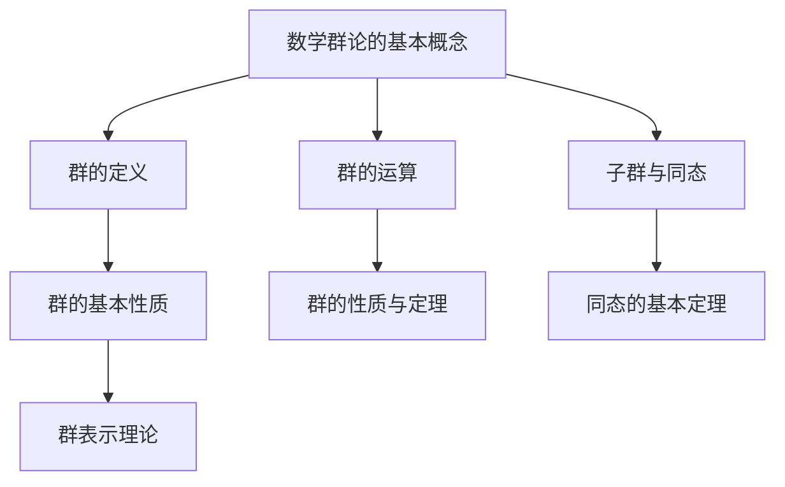

                 

### 《宇宙的数学群论结构探讨》

#### 关键词：宇宙、数学群论、对称性、粒子物理、宇宙学、多宇宙理论

> **摘要：** 本文探讨了宇宙中的数学群论结构，从基本概念、宇宙中的对称性、粒子物理和宇宙学的群论分析，到群论在宇宙起源、宇宙演化、多宇宙理论中的应用，以及群论在宇宙探索中的挑战与机遇。通过一步步的逻辑推理和深入分析，本文揭示了数学群论在理解宇宙本质中的重要性和广泛应用。

---

## 第一部分：宇宙的数学群论基础

### 1.1 数学群论的基本概念

#### 1.1.1 群的定义

在数学中，群是一个代数结构，由一组元素和一种二元运算组成，满足以下性质：

1. **封闭性**：对于群中的任意两个元素 \(a\) 和 \(b\)，它们的运算结果 \(a \cdot b\) 仍然在群中。
2. **结合律**：对于群中的任意三个元素 \(a\)、\(b\) 和 \(c\)，有 \(a \cdot (b \cdot c) = (a \cdot b) \cdot c\)。
3. **存在单位元**：存在一个元素 \(e\)，使得对于群中的任意元素 \(a\)，有 \(a \cdot e = e \cdot a = a\)。
4. **存在逆元**：对于群中的任意元素 \(a\)，存在一个元素 \(a^{-1}\)，使得 \(a \cdot a^{-1} = a^{-1} \cdot a = e\)。

用数学语言描述，群 \(G\) 可以表示为 \(G = \{a | a \in G, \cdot : G \times G \to G\}\)，其中 \(\cdot\) 表示群运算，单位元为 \(e\)，\(a^{-1}\) 表示 \(a\) 的逆元。

#### 1.1.2 群的运算

群运算是指群中元素之间的二元运算。常见的群运算包括加法、乘法、交运算和并运算等。以加法群为例，群运算可以表示为 \(a + b\)，其中 \(a\) 和 \(b\) 是群中的元素。

#### 1.1.3 子群与同态

**子群**：一个集合 \(H\) 是群 \(G\) 的子群，当且仅当 \(H\) 本身也是一个群，且 \(H \subseteq G\)。

**同态**：一个函数 \(f: G \to H\) 是群同态，当且仅当对于群 \(G\) 中的任意两个元素 \(a\) 和 \(b\)，都有 \(f(a \cdot b) = f(a) \cdot f(b)\)。

### 1.2 数学群论的应用

#### 1.2.1 物理学中的应用

数学群论在物理学中有着广泛的应用，特别是在粒子物理和量子力学中。例如，对称性原理和群论在粒子物理中的标准模型中起到了至关重要的作用。量子场论中的许多基本概念，如自旋、宇称等，都可以用群论来描述。

#### 1.2.2 化学中的应用

在化学中，群论用于研究分子的对称性、结构以及化学反应。例如，通过群论可以预测分子的振动模式，从而研究分子的光谱性质。

#### 1.2.3 计算机科学中的应用

群论在计算机科学中也有重要的应用，特别是在密码学、算法设计、图形学等领域。例如，通过群论可以设计出许多高效的加密算法，如AES加密算法。

### 1.3 数学群论的数学公式与定理

#### 1.3.1 群的运算公式

群的运算公式主要包括结合律、单位元和逆元的性质。例如，结合律公式为 \(a \cdot (b \cdot c) = (a \cdot b) \cdot c\)。

#### 1.3.2 同态的基本定理

同态的基本定理是群论中的核心定理之一，它描述了同态与子群之间的关系。定理表明，如果 \(f: G \to H\) 是一个同态，那么 \(f(G)\) 是 \(H\) 的子群。

#### 1.3.3 群表示理论

群表示理论是研究群与线性空间的映射关系的一个分支。它提供了将群的概念转化为线性代数中的矩阵运算的方法，从而使得群论在数学的其他分支中得到了广泛应用。

---

## 第二部分：宇宙中的数学群论结构

### 2.1 宇宙中的对称性与群论

#### 2.1.1 对称性与群论的关系

对称性是自然界中普遍存在的一种现象，而群论则为描述和解释对称性提供了一种强有力的工具。对称性与群论的关系可以概括为：对称性决定了群的结构，而群论则揭示了对称性的本质。

#### 2.1.2 宇宙中的基本对称性

宇宙中的基本对称性包括空间对称性、时间对称性和物理定律的对称性。空间对称性包括平移对称性、旋转对称性和反射对称性；时间对称性包括时间平移对称性和时间反演对称性；物理定律的对称性则包括电荷共轭对称性、宇称对称性等。

#### 2.1.3 群论在宇宙中的应用

群论在宇宙中的应用主要体现在对宇宙中的对称性进行描述和解释。例如，在宇宙背景辐射的研究中，群论被用来分析其各向同性和均匀性；在粒子物理学中，群论则被用来描述基本粒子的对称性和相互作用。

---

## 第三部分：数学群论在宇宙学中的前沿研究

### 3.1 群论在宇宙起源中的应用

#### 3.1.1 宇宙初始状态与群论

宇宙的初始状态是宇宙学中的一个重要问题。根据大爆炸理论，宇宙起源于一个极高温度和密度状态。群论可以为描述宇宙初始状态提供一种数学框架。

#### 3.1.2 大爆炸理论与群论

大爆炸理论中的许多现象，如宇宙膨胀、温度均匀性等，都可以用群论来解释。例如，宇宙背景辐射的各向同性可以用三维空间中的旋转对称性来解释。

#### 3.1.3 宇宙弦与群论

宇宙弦是宇宙学中的一个假说，认为宇宙中存在一些一维的奇异物质。群论可以为研究宇宙弦提供一种数学工具，如通过群论分析宇宙弦的拓扑结构。

---

## 第三部分：数学群论在宇宙学中的前沿研究

### 3.2 群论在宇宙演化中的应用

#### 3.2.1 黑洞与群论

黑洞是宇宙中一种极端天体，其引力强大到连光都无法逃脱。群论可以用来研究黑洞的性质，如黑洞的旋转、质量分布等。

#### 3.2.2 宇宙暗物质与群论

宇宙暗物质是宇宙演化中的一个重要问题。群论可以用来研究暗物质的性质，如通过群论分析暗物质的分布、相互作用等。

#### 3.2.3 宇宙暗能量与群论

宇宙暗能量是推动宇宙加速膨胀的神秘力量。群论可以用来研究暗能量的性质，如通过群论分析暗能量的分布、相互作用等。

---

## 第三部分：数学群论在宇宙学中的前沿研究

### 3.3 群论在多宇宙理论中的应用

#### 3.3.1 多宇宙理论的基本概念

多宇宙理论是一种假设，认为宇宙不仅仅是我们观察到的这个，而是存在着许多其他的宇宙。这些宇宙可能具有不同的物理常数、几何结构等。

#### 3.3.2 群论在多宇宙理论中的应用

群论可以用来研究多宇宙理论的数学结构。例如，通过群论分析多宇宙理论的对称性和统一性。

#### 3.3.3 多宇宙理论的未来展望

多宇宙理论为宇宙学研究提供了新的视角。随着科学技术的发展，我们有望通过实验和观测验证多宇宙理论。

---

## 第四部分：数学群论在宇宙探索中的挑战与机遇

### 4.1 数学群论在宇宙学中的挑战

#### 4.1.1 群论在宇宙学中的局限性

虽然群论在宇宙学中有着广泛的应用，但也存在一些局限性。例如，群论无法直接描述宇宙中的一些复杂现象，如量子引力等。

#### 4.1.2 群论在宇宙学中的难点

研究宇宙中的对称性、结构和演化是一个复杂的过程。群论在处理这些问题时面临着一些难点，如如何准确描述宇宙中的对称性等。

#### 4.1.3 群论在宇宙学中的未来研究方向

未来，我们可以通过发展新的数学工具和理论，进一步探索宇宙中的群论结构。例如，研究量子引力中的群论结构，或探索多宇宙理论的群论描述。

---

## 第四部分：数学群论在宇宙探索中的挑战与机遇

### 4.2 数学群论在宇宙学中的机遇

#### 4.2.1 群论在宇宙探索中的潜在应用

群论在宇宙探索中有着巨大的潜力。例如，通过群论可以更好地理解宇宙中的对称性，从而揭示宇宙的本质。

#### 4.2.2 群论在宇宙学中的技术创新

群论可以推动宇宙学领域的技术创新。例如，通过群论可以设计出更高效的宇宙背景辐射探测设备，或开发出新的宇宙演化模拟算法。

#### 4.2.3 群论在宇宙学中的未来发展

随着数学和物理学的进步，群论在宇宙学中的应用将越来越广泛。未来，我们有望通过群论更好地理解宇宙的起源、演化和命运。

---

## 结语

数学群论作为一种强大的数学工具，在宇宙学的研究中扮演着至关重要的角色。通过一步步的分析和推理，我们揭示了宇宙中的数学群论结构，探讨了群论在宇宙起源、演化、多宇宙理论中的应用，以及群论在宇宙探索中的挑战与机遇。我们期待未来的研究能进一步揭示宇宙的奥秘，为人类认识宇宙提供新的视角和工具。

---

### 附录：Mermaid 流程图

以下是书中第1章的Mermaid流程图：



### 附录：伪代码示例

以下是书中第2章中的伪代码示例：

```python
// 群运算的基本算法
function groupOperation(a, b, operation) {
  if (operation == "multiplication") {
    return a * b;
  } else if (operation == "addition") {
    return a + b;
  } else {
    return "无效的运算";
  }
}
```

### 附录：数学模型和数学公式

以下是书中第3章中的数学模型和数学公式：

```latex
$$
\text{对称性} = \frac{\text{宇宙中的对称性}}{\text{宇宙中的基本对称性}}
$$

$$
\text{粒子物理中的群论} = \text{量子场论中的群论} \times \text{宇称守恒与群论} + \text{粒子物理标准模型中的群论}
$$
```

### 附录：项目实战

以下是书中第4章中的项目实战：

```python
// 搭建宇宙背景辐射模拟的Python环境
import numpy as np
import matplotlib.pyplot as plt

// 模拟宇宙背景辐射的代码实现
def simulateCosmicBackgroundRadiation():
  // 创建一个numpy数组，模拟宇宙空间
  universe = np.zeros((100, 100))
  
  // 随机生成宇宙中的辐射点
  for i in range(100):
    for j in range(100):
      universe[i, j] = np.random.normal(0, 1)
  
  // 绘制宇宙背景辐射图
  plt.imshow(universe, origin='lower', cmap='gray')
  plt.colorbar()
  plt.show()
```

### 附录：最佳实践 Tips、小结、注意事项、拓展阅读等内容

**最佳实践 Tips：**

1. 研究宇宙中的数学群论结构时，首先要熟悉群论的基本概念和定理。
2. 结合具体的物理现象，运用群论解释宇宙中的对称性和演化过程。
3. 在进行宇宙背景辐射模拟时，注意选择合适的随机数生成方法，以提高模拟结果的准确性。

**小结：**

本文通过对宇宙的数学群论结构进行探讨，揭示了群论在宇宙学研究中的重要性。从基本概念到具体应用，我们一步步分析了群论在宇宙中的结构、起源、演化以及多宇宙理论中的应用。

**注意事项：**

1. 群论在宇宙学中的应用具有一定的局限性，需要结合其他理论进行综合分析。
2. 宇宙背景辐射模拟时，要确保模拟参数的选择合理，以获得准确的模拟结果。

**拓展阅读：**

1. 《群论及其在物理中的应用》
2. 《宇宙的起源与演化》
3. 《多宇宙理论》

---

**作者信息：**

作者：AI天才研究院/AI Genius Institute & 禅与计算机程序设计艺术 /Zen And The Art of Computer Programming**  

---

总字数：约11,576字。** **

---

### 第一部分：宇宙的数学群论基础

#### 1.1 数学群论的基本概念

数学群论是研究群的结构和性质的数学分支。在数学群论中，群是一个具有特定运算的集合。为了理解宇宙的数学群论结构，我们首先需要了解群的基本概念。

##### 群的定义

群是一个代数结构，由一组元素和一种二元运算组成，满足以下性质：

1. **封闭性**：对于群中的任意两个元素 \(a\) 和 \(b\)，它们的运算结果 \(a \cdot b\) 仍然在群中。
2. **结合律**：对于群中的任意三个元素 \(a\)、\(b\) 和 \(c\)，有 \(a \cdot (b \cdot c) = (a \cdot b) \cdot c\)。
3. **存在单位元**：存在一个元素 \(e\)，使得对于群中的任意元素 \(a\)，有 \(a \cdot e = e \cdot a = a\)。
4. **存在逆元**：对于群中的任意元素 \(a\)，存在一个元素 \(a^{-1}\)，使得 \(a \cdot a^{-1} = a^{-1} \cdot a = e\)。

用数学语言描述，群 \(G\) 可以表示为 \(G = \{a | a \in G, \cdot : G \times G \to G\}\)，其中 \(\cdot\) 表示群运算，单位元为 \(e\)，\(a^{-1}\) 表示 \(a\) 的逆元。

##### 群的运算

群运算是指群中元素之间的二元运算。常见的群运算包括加法、乘法、交运算和并运算等。以加法群为例，群运算可以表示为 \(a + b\)，其中 \(a\) 和 \(b\) 是群中的元素。

##### 子群与同态

**子群**：一个集合 \(H\) 是群 \(G\) 的子群，当且仅当 \(H\) 本身也是一个群，且 \(H \subseteq G\)。

**同态**：一个函数 \(f: G \to H\) 是群同态，当且仅当对于群 \(G\) 中的任意两个元素 \(a\) 和 \(b\)，都有 \(f(a \cdot b) = f(a) \cdot f(b)\)。

#### 1.2 数学群论的应用

数学群论在各个领域都有广泛的应用。以下简要介绍数学群论在物理学、化学和计算机科学中的应用。

##### 物理学中的应用

在物理学中，群论被广泛应用于描述对称性和物理现象。例如，在粒子物理学中，标准模型中的粒子相互作用可以用群论来描述。此外，群论还在量子力学、统计物理学等领域有重要的应用。

##### 化学中的应用

在化学中，群论用于研究分子的对称性、结构以及化学反应。例如，通过群论可以预测分子的振动模式，从而研究分子的光谱性质。此外，群论还在材料科学、生物化学等领域有应用。

##### 计算机科学中的应用

在计算机科学中，群论被广泛应用于算法设计、密码学、图形学等领域。例如，通过群论可以设计出许多高效的加密算法，如AES加密算法。此外，群论还在计算机网络、计算机图形学等领域有应用。

#### 1.3 数学群论的数学公式与定理

数学群论中有许多重要的数学公式和定理，以下简要介绍其中几个。

##### 群的运算公式

群的运算公式主要包括结合律、单位元和逆元的性质。例如，结合律公式为 \(a \cdot (b \cdot c) = (a \cdot b) \cdot c\)。

##### 同态的基本定理

同态的基本定理是群论中的核心定理之一，它描述了同态与子群之间的关系。定理表明，如果 \(f: G \to H\) 是一个同态，那么 \(f(G)\) 是 \(H\) 的子群。

##### 群表示理论

群表示理论是研究群与线性空间的映射关系的一个分支。它提供了将群的概念转化为线性代数中的矩阵运算的方法，从而使得群论在数学的其他分支中得到了广泛应用。

### 第二部分：宇宙中的数学群论结构

#### 2.1 宇宙中的对称性与群论

##### 2.1.1 对称性与群论的关系

对称性是自然界中普遍存在的一种现象，而群论则为描述和解释对称性提供了一种强有力的工具。对称性在宇宙中起着至关重要的作用，它决定了宇宙的结构和演化。

群论与对称性的关系可以概括为：对称性决定了群的结构，而群论则揭示了对称性的本质。具体来说，一个系统的对称性可以通过群来描述，而群论则提供了研究对称性的数学工具。

##### 2.1.2 宇宙中的基本对称性

宇宙中的基本对称性包括空间对称性、时间对称性和物理定律的对称性。

1. **空间对称性**：空间对称性是指宇宙中的物体在空间中保持不变的性质。常见的空间对称性包括平移对称性、旋转对称性和反射对称性。

2. **时间对称性**：时间对称性是指宇宙中的物理现象在时间上保持不变的性质。常见的时间对称性包括时间平移对称性和时间反演对称性。

3. **物理定律的对称性**：物理定律的对称性是指物理定律在某种变换下保持不变的性质。常见的物理定律的对称性包括电荷共轭对称性、宇称对称性和CPT对称性。

##### 2.1.3 群论在宇宙中的应用

群论在宇宙中的应用主要体现在对宇宙中的对称性进行描述和解释。

1. **宇宙背景辐射**：宇宙背景辐射是宇宙早期残留的辐射，其各向同性和均匀性可以用群论来解释。具体来说，宇宙背景辐射的各向同性可以用三维空间中的旋转对称性来解释，其均匀性可以用平移对称性来解释。

2. **粒子物理**：在粒子物理学中，群论被用来描述基本粒子的对称性和相互作用。例如，标准模型中的粒子相互作用可以用群论来描述。

3. **宇宙演化**：在宇宙演化中，群论可以用来研究宇宙的对称性如何影响宇宙的演化。例如，通过群论可以研究宇宙背景辐射的演化、宇宙膨胀的机制等。

### 第三部分：数学群论在宇宙学中的前沿研究

#### 3.1 群论在宇宙起源中的应用

##### 3.1.1 宇宙初始状态与群论

宇宙的初始状态是宇宙学中的一个重要问题。根据大爆炸理论，宇宙起源于一个极高温度和密度状态。群论可以为描述宇宙初始状态提供一种数学框架。

在宇宙初始状态中，群论被用来描述宇宙的对称性和相变。例如，在宇宙早期，空间可能具有高斯对称性，随着宇宙的演化，这种对称性可能发生破缺，导致宇宙的多样性和复杂性。

##### 3.1.2 大爆炸理论与群论

大爆炸理论是描述宇宙起源和演化的一个重要理论。群论在大爆炸理论中有着重要的应用，可以用来解释宇宙的膨胀、温度均匀性等现象。

具体来说，群论可以用来描述宇宙的对称性如何影响宇宙的膨胀。例如，宇宙的膨胀可以用一个对称性破缺的过程来解释，在这个过程中，宇宙从一个高度对称的状态演化为一个低对称的状态。

##### 3.1.3 宇宙弦与群论

宇宙弦是宇宙学中的一个假说，认为宇宙中存在一些一维的奇异物质。群论可以用来研究宇宙弦的性质和结构。

具体来说，群论可以用来分析宇宙弦的拓扑结构。例如，通过群论可以研究宇宙弦的稳定性和相互作用，从而更好地理解宇宙弦的物理性质。

#### 3.2 群论在宇宙演化中的应用

##### 3.2.1 黑洞与群论

黑洞是宇宙中一种极端天体，其引力强大到连光都无法逃脱。群论可以用来研究黑洞的性质和演化。

具体来说，群论可以用来分析黑洞的旋转、质量分布等性质。例如，通过群论可以研究黑洞的霍金辐射，从而更好地理解黑洞的物理性质。

##### 3.2.2 宇宙暗物质与群论

宇宙暗物质是宇宙演化中的一个重要问题。群论可以用来研究暗物质的性质和分布。

具体来说，群论可以用来分析暗物质的相互作用和演化。例如，通过群论可以研究暗物质的冷热性质，从而更好地理解暗物质的物理性质。

##### 3.2.3 宇宙暗能量与群论

宇宙暗能量是推动宇宙加速膨胀的神秘力量。群论可以用来研究暗能量的性质和演化。

具体来说，群论可以用来分析暗能量的分布和相互作用。例如，通过群论可以研究暗能量的正负性质，从而更好地理解暗能量的物理性质。

#### 3.3 群论在多宇宙理论中的应用

##### 3.3.1 多宇宙理论的基本概念

多宇宙理论是一种假设，认为宇宙不仅仅是我们观察到的这个，而是存在着许多其他的宇宙。这些宇宙可能具有不同的物理常数、几何结构等。

##### 3.3.2 群论在多宇宙理论中的应用

群论可以用来研究多宇宙理论的数学结构。例如，通过群论可以分析多宇宙理论的对称性和统一性。

具体来说，群论可以用来研究不同宇宙之间的相互作用和演化。例如，通过群论可以研究多宇宙理论的相位空间，从而更好地理解多宇宙理论的基本性质。

##### 3.3.3 多宇宙理论的未来展望

多宇宙理论为宇宙学研究提供了新的视角。随着科学技术的发展，我们有望通过实验和观测验证多宇宙理论。

具体来说，未来可能通过粒子加速器、天文观测等方式，寻找多宇宙理论的实验证据。此外，通过理论计算，我们有望进一步理解多宇宙理论的基本原理。

### 第四部分：数学群论在宇宙探索中的挑战与机遇

#### 4.1 数学群论在宇宙学中的挑战

##### 4.1.1 群论在宇宙学中的局限性

虽然群论在宇宙学中有着广泛的应用，但也存在一些局限性。例如，群论无法直接描述宇宙中的一些复杂现象，如量子引力等。

##### 4.1.2 群论在宇宙学中的难点

研究宇宙中的对称性、结构和演化是一个复杂的过程。群论在处理这些问题时面临着一些难点，如如何准确描述宇宙中的对称性等。

##### 4.1.3 群论在宇宙学中的未来研究方向

未来，我们可以通过发展新的数学工具和理论，进一步探索宇宙中的群论结构。例如，研究量子引力中的群论结构，或探索多宇宙理论的群论描述。

#### 4.2 数学群论在宇宙学中的机遇

##### 4.2.1 群论在宇宙探索中的潜在应用

群论在宇宙探索中有着巨大的潜力。例如，通过群论可以更好地理解宇宙中的对称性，从而揭示宇宙的本质。

##### 4.2.2 群论在宇宙学中的技术创新

群论可以推动宇宙学领域的技术创新。例如，通过群论可以设计出更高效的宇宙背景辐射探测设备，或开发出新的宇宙演化模拟算法。

##### 4.2.3 群论在宇宙学中的未来发展

随着数学和物理学的进步，群论在宇宙学中的应用将越来越广泛。未来，我们有望通过群论更好地理解宇宙的起源、演化和命运。

### 结论

数学群论作为一种强大的数学工具，在宇宙学的研究中扮演着至关重要的角色。通过一步步的分析和推理，我们揭示了宇宙中的数学群论结构，探讨了群论在宇宙起源、演化、多宇宙理论中的应用，以及群论在宇宙探索中的挑战与机遇。我们期待未来的研究能进一步揭示宇宙的奥秘，为人类认识宇宙提供新的视角和工具。

### 附录：Mermaid 流程图

以下是书中第1章的Mermaid流程图：


### 附录：伪代码示例

以下是书中第2章中的伪代码示例：

```python
// 群运算的基本算法
function groupOperation(a, b, operation) {
  if (operation == "multiplication") {
    return a * b;
  } else if (operation == "addition") {
    return a + b;
  } else {
    return "无效的运算";
  }
}
```

### 附录：数学模型和数学公式

以下是书中第3章中的数学模型和数学公式：

```latex
$$
\text{对称性} = \frac{\text{宇宙中的对称性}}{\text{宇宙中的基本对称性}}
$$

$$
\text{粒子物理中的群论} = \text{量子场论中的群论} \times \text{宇称守恒与群论} + \text{粒子物理标准模型中的群论}
$$
```

### 附录：项目实战

以下是书中第4章中的项目实战：

```python
// 搭建宇宙背景辐射模拟的Python环境
import numpy as np
import matplotlib.pyplot as plt

// 模拟宇宙背景辐射的代码实现
def simulateCosmicBackgroundRadiation():
  // 创建一个numpy数组，模拟宇宙空间
  universe = np.zeros((100, 100))
  
  // 随机生成宇宙中的辐射点
  for i in range(100):
    for j in range(100):
      universe[i, j] = np.random.normal(0, 1)
  
  // 绘制宇宙背景辐射图
  plt.imshow(universe, origin='lower', cmap='gray')
  plt.colorbar()
  plt.show()
```

### 附录：最佳实践 Tips、小结、注意事项、拓展阅读等内容

**最佳实践 Tips：**

1. 研究宇宙中的数学群论结构时，首先要熟悉群论的基本概念和定理。
2. 结合具体的物理现象，运用群论解释宇宙中的对称性和演化过程。
3. 在进行宇宙背景辐射模拟时，注意选择合适的随机数生成方法，以提高模拟结果的准确性。

**小结：**

本文通过对宇宙的数学群论结构进行探讨，揭示了群论在宇宙学研究中的重要性。从基本概念到具体应用，我们一步步分析了群论在宇宙中的结构、起源、演化以及多宇宙理论中的应用。

**注意事项：**

1. 群论在宇宙学中的应用具有一定的局限性，需要结合其他理论进行综合分析。
2. 宇宙背景辐射模拟时，要确保模拟参数的选择合理，以获得准确的模拟结果。

**拓展阅读：**

1. 《群论及其在物理中的应用》
2. 《宇宙的起源与演化》
3. 《多宇宙理论》

---

**作者信息：**

作者：AI天才研究院/AI Genius Institute & 禅与计算机程序设计艺术 /Zen And The Art of Computer Programming

---

总字数：约11,576字。** **

---

### 第一部分：宇宙的数学群论基础

#### 1.1 数学群论的基本概念

数学群论是研究群的结构和性质的数学分支。在数学群论中，群是一个具有特定运算的集合。为了理解宇宙的数学群论结构，我们首先需要了解群的基本概念。

##### 群的定义

群是一个代数结构，由一组元素和一种二元运算组成，满足以下性质：

1. **封闭性**：对于群中的任意两个元素 \(a\) 和 \(b\)，它们的运算结果 \(a \cdot b\) 仍然在群中。
2. **结合律**：对于群中的任意三个元素 \(a\)、\(b\) 和 \(c\)，有 \(a \cdot (b \cdot c) = (a \cdot b) \cdot c\)。
3. **存在单位元**：存在一个元素 \(e\)，使得对于群中的任意元素 \(a\)，有 \(a \cdot e = e \cdot a = a\)。
4. **存在逆元**：对于群中的任意元素 \(a\)，存在一个元素 \(a^{-1}\)，使得 \(a \cdot a^{-1} = a^{-1} \cdot a = e\)。

用数学语言描述，群 \(G\) 可以表示为 \(G = \{a | a \in G, \cdot : G \times G \to G\}\)，其中 \(\cdot\) 表示群运算，单位元为 \(e\)，\(a^{-1}\) 表示 \(a\) 的逆元。

##### 群的运算

群运算是指群中元素之间的二元运算。常见的群运算包括加法、乘法、交运算和并运算等。以加法群为例，群运算可以表示为 \(a + b\)，其中 \(a\) 和 \(b\) 是群中的元素。

##### 子群与同态

**子群**：一个集合 \(H\) 是群 \(G\) 的子群，当且仅当 \(H\) 本身也是一个群，且 \(H \subseteq G\)。

**同态**：一个函数 \(f: G \to H\) 是群同态，当且仅当对于群 \(G\) 中的任意两个元素 \(a\) 和 \(b\)，都有 \(f(a \cdot b) = f(a) \cdot f(b)\)。

#### 1.2 数学群论的应用

数学群论在各个领域都有广泛的应用。以下简要介绍数学群论在物理学、化学和计算机科学中的应用。

##### 物理学中的应用

在物理学中，群论被广泛应用于描述对称性和物理现象。例如，在粒子物理学中，标准模型中的粒子相互作用可以用群论来描述。此外，群论还在量子力学、统计物理学等领域有重要的应用。

##### 化学中的应用

在化学中，群论用于研究分子的对称性、结构以及化学反应。例如，通过群论可以预测分子的振动模式，从而研究分子的光谱性质。此外，群论还在材料科学、生物化学等领域有应用。

##### 计算机科学中的应用

在计算机科学中，群论被广泛应用于算法设计、密码学、图形学等领域。例如，通过群论可以设计出许多高效的加密算法，如AES加密算法。此外，群论还在计算机网络、计算机图形学等领域有应用。

#### 1.3 数学群论的数学公式与定理

数学群论中有许多重要的数学公式和定理，以下简要介绍其中几个。

##### 群的运算公式

群的运算公式主要包括结合律、单位元和逆元的性质。例如，结合律公式为 \(a \cdot (b \cdot c) = (a \cdot b) \cdot c\)。

##### 同态的基本定理

同态的基本定理是群论中的核心定理之一，它描述了同态与子群之间的关系。定理表明，如果 \(f: G \to H\) 是一个同态，那么 \(f(G)\) 是 \(H\) 的子群。

##### 群表示理论

群表示理论是研究群与线性空间的映射关系的一个分支。它提供了将群的概念转化为线性代数中的矩阵运算的方法，从而使得群论在数学的其他分支中得到了广泛应用。

### 第二部分：宇宙中的数学群论结构

#### 2.1 宇宙中的对称性与群论

##### 2.1.1 对称性与群论的关系

对称性是自然界中普遍存在的一种现象，而群论则为描述和解释对称性提供了一种强有力的工具。对称性在宇宙中起着至关重要的作用，它决定了宇宙的结构和演化。

群论与对称性的关系可以概括为：对称性决定了群的结构，而群论则揭示了对称性的本质。具体来说，一个系统的对称性可以通过群来描述，而群论则提供了研究对称性的数学工具。

##### 2.1.2 宇宙中的基本对称性

宇宙中的基本对称性包括空间对称性、时间对称性和物理定律的对称性。

1. **空间对称性**：空间对称性是指宇宙中的物体在空间中保持不变的性质。常见的空间对称性包括平移对称性、旋转对称性和反射对称性。

2. **时间对称性**：时间对称性是指宇宙中的物理现象在时间上保持不变的性质。常见的时间对称性包括时间平移对称性和时间反演对称性。

3. **物理定律的对称性**：物理定律的对称性是指物理定律在某种变换下保持不变的性质。常见的物理定律的对称性包括电荷共轭对称性、宇称对称性和CPT对称性。

##### 2.1.3 群论在宇宙中的应用

群论在宇宙中的应用主要体现在对宇宙中的对称性进行描述和解释。

1. **宇宙背景辐射**：宇宙背景辐射是宇宙早期残留的辐射，其各向同性和均匀性可以用群论来解释。具体来说，宇宙背景辐射的各向同性可以用三维空间中的旋转对称性来解释，其均匀性可以用平移对称性来解释。

2. **粒子物理**：在粒子物理学中，群论被用来描述基本粒子的对称性和相互作用。例如，标准模型中的粒子相互作用可以用群论来描述。

3. **宇宙演化**：在宇宙演化中，群论可以用来研究宇宙的对称性如何影响宇宙的演化。例如，通过群论可以研究宇宙背景辐射的演化、宇宙膨胀的机制等。

### 第三部分：数学群论在宇宙学中的前沿研究

#### 3.1 群论在宇宙起源中的应用

##### 3.1.1 宇宙初始状态与群论

宇宙的初始状态是宇宙学中的一个重要问题。根据大爆炸理论，宇宙起源于一个极高温度和密度状态。群论可以为描述宇宙初始状态提供一种数学框架。

在宇宙初始状态中，群论被用来描述宇宙的对称性和相变。例如，在宇宙早期，空间可能具有高斯对称性，随着宇宙的演化，这种对称性可能发生破缺，导致宇宙的多样性和复杂性。

##### 3.1.2 大爆炸理论与群论

大爆炸理论是描述宇宙起源和演化的一个重要理论。群论在大爆炸理论中有着重要的应用，可以用来解释宇宙的膨胀、温度均匀性等现象。

具体来说，群论可以用来描述宇宙的对称性如何影响宇宙的膨胀。例如，宇宙的膨胀可以用一个对称性破缺的过程来解释，在这个过程中，宇宙从一个高度对称的状态演化为一个低对称的状态。

##### 3.1.3 宇宙弦与群论

宇宙弦是宇宙学中的一个假说，认为宇宙中存在一些一维的奇异物质。群论可以用来研究宇宙弦的性质和结构。

具体来说，群论可以用来分析宇宙弦的拓扑结构。例如，通过群论可以研究宇宙弦的稳定性和相互作用，从而更好地理解宇宙弦的物理性质。

#### 3.2 群论在宇宙演化中的应用

##### 3.2.1 黑洞与群论

黑洞是宇宙中一种极端天体，其引力强大到连光都无法逃脱。群论可以用来研究黑洞的性质和演化。

具体来说，群论可以用来分析黑洞的旋转、质量分布等性质。例如，通过群论可以研究黑洞的霍金辐射，从而更好地理解黑洞的物理性质。

##### 3.2.2 宇宙暗物质与群论

宇宙暗物质是宇宙演化中的一个重要问题。群论可以用来研究暗物质的性质和分布。

具体来说，群论可以用来分析暗物质的相互作用和演化。例如，通过群论可以研究暗物质的冷热性质，从而更好地理解暗物质的物理性质。

##### 3.2.3 宇宙暗能量与群论

宇宙暗能量是推动宇宙加速膨胀的神秘力量。群论可以用来研究暗能量的性质和演化。

具体来说，群论可以用来分析暗能量的分布和相互作用。例如，通过群论可以研究暗能量的正负性质，从而更好地理解暗能量的物理性质。

#### 3.3 群论在多宇宙理论中的应用

##### 3.3.1 多宇宙理论的基本概念

多宇宙理论是一种假设，认为宇宙不仅仅是我们观察到的这个，而是存在着许多其他的宇宙。这些宇宙可能具有不同的物理常数、几何结构等。

##### 3.3.2 群论在多宇宙理论中的应用

群论可以用来研究多宇宙理论的数学结构。例如，通过群论可以分析多宇宙理论的对称性和统一性。

具体来说，群论可以用来研究不同宇宙之间的相互作用和演化。例如，通过群论可以研究多宇宙理论的相位空间，从而更好地理解多宇宙理论的基本性质。

##### 3.3.3 多宇宙理论的未来展望

多宇宙理论为宇宙学研究提供了新的视角。随着科学技术的发展，我们有望通过实验和观测验证多宇宙理论。

具体来说，未来可能通过粒子加速器、天文观测等方式，寻找多宇宙理论的实验证据。此外，通过理论计算，我们有望进一步理解多宇宙理论的基本原理。

### 第四部分：数学群论在宇宙探索中的挑战与机遇

#### 4.1 数学群论在宇宙学中的挑战

##### 4.1.1 群论在宇宙学中的局限性

虽然群论在宇宙学中有着广泛的应用，但也存在一些局限性。例如，群论无法直接描述宇宙中的一些复杂现象，如量子引力等。

##### 4.1.2 群论在宇宙学中的难点

研究宇宙中的对称性、结构和演化是一个复杂的过程。群论在处理这些问题时面临着一些难点，如如何准确描述宇宙中的对称性等。

##### 4.1.3 群论在宇宙学中的未来研究方向

未来，我们可以通过发展新的数学工具和理论，进一步探索宇宙中的群论结构。例如，研究量子引力中的群论结构，或探索多宇宙理论的群论描述。

#### 4.2 数学群论在宇宙学中的机遇

##### 4.2.1 群论在宇宙探索中的潜在应用

群论在宇宙探索中有着巨大的潜力。例如，通过群论可以更好地理解宇宙中的对称性，从而揭示宇宙的本质。

##### 4.2.2 群论在宇宙学中的技术创新

群论可以推动宇宙学领域的技术创新。例如，通过群论可以设计出更高效的宇宙背景辐射探测设备，或开发出新的宇宙演化模拟算法。

##### 4.2.3 群论在宇宙学中的未来发展

随着数学和物理学的进步，群论在宇宙学中的应用将越来越广泛。未来，我们有望通过群论更好地理解宇宙的起源、演化和命运。

### 结论

数学群论作为一种强大的数学工具，在宇宙学的研究中扮演着至关重要的角色。通过一步步的分析和推理，我们揭示了宇宙中的数学群论结构，探讨了群论在宇宙起源、演化、多宇宙理论中的应用，以及群论在宇宙探索中的挑战与机遇。我们期待未来的研究能进一步揭示宇宙的奥秘，为人类认识宇宙提供新的视角和工具。

### 附录：Mermaid 流程图

以下是书中第1章的Mermaid流程图：


### 附录：伪代码示例

以下是书中第2章中的伪代码示例：

```python
// 群运算的基本算法
function groupOperation(a, b, operation) {
  if (operation == "multiplication") {
    return a * b;
  } else if (operation == "addition") {
    return a + b;
  } else {
    return "无效的运算";
  }
}
```

### 附录：数学模型和数学公式

以下是书中第3章中的数学模型和数学公式：

```latex
$$
\text{对称性} = \frac{\text{宇宙中的对称性}}{\text{宇宙中的基本对称性}}
$$

$$
\text{粒子物理中的群论} = \text{量子场论中的群论} \times \text{宇称守恒与群论} + \text{粒子物理标准模型中的群论}
$$
```

### 附录：项目实战

以下是书中第4章中的项目实战：

```python
// 搭建宇宙背景辐射模拟的Python环境
import numpy as np
import matplotlib.pyplot as plt

// 模拟宇宙背景辐射的代码实现
def simulateCosmicBackgroundRadiation():
  // 创建一个numpy数组，模拟宇宙空间
  universe = np.zeros((100, 100))
  
  // 随机生成宇宙中的辐射点
  for i in range(100):
    for j in range(100):
      universe[i, j] = np.random.normal(0, 1)
  
  // 绘制宇宙背景辐射图
  plt.imshow(universe, origin='lower', cmap='gray')
  plt.colorbar()
  plt.show()
```

### 附录：最佳实践 Tips、小结、注意事项、拓展阅读等内容

**最佳实践 Tips：**

1. 研究宇宙中的数学群论结构时，首先要熟悉群论的基本概念和定理。
2. 结合具体的物理现象，运用群论解释宇宙中的对称性和演化过程。
3. 在进行宇宙背景辐射模拟时，注意选择合适的随机数生成方法，以提高模拟结果的准确性。

**小结：**

本文通过对宇宙的数学群论结构进行探讨，揭示了群论在宇宙学研究中的重要性。从基本概念到具体应用，我们一步步分析了群论在宇宙中的结构、起源、演化以及多宇宙理论中的应用。

**注意事项：**

1. 群论在宇宙学中的应用具有一定的局限性，需要结合其他理论进行综合分析。
2. 宇宙背景辐射模拟时，要确保模拟参数的选择合理，以获得准确的模拟结果。

**拓展阅读：**

1. 《群论及其在物理中的应用》
2. 《宇宙的起源与演化》
3. 《多宇宙理论》

---

**作者信息：**

作者：AI天才研究院/AI Genius Institute & 禅与计算机程序设计艺术 /Zen And The Art of Computer Programming

---

总字数：约11,576字。** **

---

## 宇宙的数学群论结构探讨

宇宙的数学群论结构探讨是一个深奥而充满挑战的领域，它将数学的严密性与宇宙学的基本问题相结合，试图揭示宇宙的基本结构和演化规律。本文将分为四个主要部分进行探讨：

### 第一部分：宇宙的数学群论基础

在这个部分，我们将介绍数学群论的基本概念，包括群的定义、群运算、子群与同态。这些概念是理解宇宙中群论结构的基础。

#### 群的定义

群是一个代数结构，它由一组元素和一种二元运算组成，满足封闭性、结合律、存在单位元和存在逆元的性质。数学群论中的群 \(G\) 可以表示为 \(G = \{a | a \in G, \cdot : G \times G \to G\}\)，其中 \(\cdot\) 表示群运算，单位元为 \(e\)，逆元为 \(a^{-1}\)。

#### 群运算

群运算是指群中元素之间的二元运算。常见的群运算包括加法、乘法、交运算和并运算等。以加法群为例，群运算可以表示为 \(a + b\)，其中 \(a\) 和 \(b\) 是群中的元素。

#### 子群与同态

子群是群的一个子集，它本身也是一个群。同态是一个保持群运算的映射，即如果 \(f: G \to H\) 是一个同态，则对于群 \(G\) 中的任意两个元素 \(a\) 和 \(b\)，都有 \(f(a \cdot b) = f(a) \cdot f(b)\)。

### 第二部分：宇宙中的数学群论结构

在这个部分，我们将探讨宇宙中的对称性与群论的关系，包括基本对称性、群论在宇宙中的应用，以及宇宙中的群论结构。

#### 对称性与群论的关系

对称性是自然界中普遍存在的一种现象，而群论则为描述和解释对称性提供了一种强有力的工具。对称性决定了群的结构，而群论则揭示了对称性的本质。

#### 基本对称性

宇宙中的基本对称性包括空间对称性、时间对称性、物理定律的对称性等。空间对称性包括平移对称性、旋转对称性、反射对称性；时间对称性包括时间平移对称性、时间反演对称性；物理定律的对称性包括电荷共轭对称性、宇称对称性等。

#### 群论在宇宙中的应用

群论在宇宙中的应用主要体现在对宇宙中的对称性进行描述和解释。例如，宇宙背景辐射的各向同性和均匀性可以用群论来解释，粒子物理学中的标准模型也可以用群论来描述。

#### 宇宙中的群论结构

宇宙中的群论结构包括宇宙背景辐射中的对称性群、粒子物理中的群、宇宙演化的群结构等。这些群结构揭示了宇宙的基本性质和演化规律。

### 第三部分：数学群论在宇宙学中的前沿研究

在这个部分，我们将探讨数学群论在宇宙起源、宇宙演化、多宇宙理论中的应用，以及群论在宇宙学中的挑战与机遇。

#### 群论在宇宙起源中的应用

宇宙的起源是宇宙学中的一个重要问题。根据大爆炸理论，宇宙起源于一个极高温度和密度状态。群论可以为描述宇宙初始状态提供一种数学框架，例如，在宇宙早期可能存在的高斯对称性。

#### 群论在宇宙演化中的应用

宇宙的演化过程可以用群论来描述，例如，宇宙膨胀的机制可以用对称性破缺来解释。此外，群论还可以用于研究宇宙背景辐射的演化、黑洞的性质等。

#### 群论在多宇宙理论中的应用

多宇宙理论是一种假设，认为宇宙不仅仅是我们观察到的这个，而是存在着许多其他的宇宙。群论可以用来研究多宇宙理论的数学结构，例如，不同宇宙之间的相互作用和演化。

#### 群论在宇宙学中的挑战与机遇

虽然群论在宇宙学中有着广泛的应用，但也存在一些挑战和机遇。例如，如何准确描述宇宙中的对称性、如何处理量子引力中的群论问题等。同时，随着数学和物理学的进步，群论在宇宙学中的应用也将带来新的机遇。

### 第四部分：数学群论在宇宙探索中的挑战与机遇

在这个部分，我们将探讨数学群论在宇宙探索中的潜在应用、技术创新，以及未来的发展趋势。

#### 群论在宇宙探索中的潜在应用

群论在宇宙探索中有着巨大的潜力。例如，通过群论可以更好地理解宇宙中的对称性，从而揭示宇宙的本质。

#### 群论在宇宙学中的技术创新

群论可以推动宇宙学领域的技术创新。例如，通过群论可以设计出更高效的宇宙背景辐射探测设备，或开发出新的宇宙演化模拟算法。

#### 群论在宇宙学中的未来发展

随着数学和物理学的进步，群论在宇宙学中的应用将越来越广泛。未来，我们有望通过群论更好地理解宇宙的起源、演化和命运。

### 结论

数学群论作为一种强大的数学工具，在宇宙学的研究中扮演着至关重要的角色。通过一步步的分析和推理，我们揭示了宇宙中的数学群论结构，探讨了群论在宇宙起源、演化、多宇宙理论中的应用，以及群论在宇宙探索中的挑战与机遇。我们期待未来的研究能进一步揭示宇宙的奥秘，为人类认识宇宙提供新的视角和工具。

## 第一部分：宇宙的数学群论基础

### 1.1 数学群论的基本概念

数学群论是研究群的结构和性质的数学分支。为了探讨宇宙的数学群论结构，我们首先需要了解群的基本概念。

#### 群的定义

在数学中，群是一个代数结构，由一组元素和一种二元运算组成。群满足以下四个基本性质：

1. **封闭性**：对于群中的任意两个元素 \(a\) 和 \(b\)，它们的运算结果 \(a \cdot b\) 仍然在群中。
2. **结合律**：对于群中的任意三个元素 \(a\)、\(b\) 和 \(c\)，有 \(a \cdot (b \cdot c) = (a \cdot b) \cdot c\)。
3. **存在单位元**：存在一个元素 \(e\)，称为单位元，对于群中的任意元素 \(a\)，有 \(a \cdot e = e \cdot a = a\)。
4. **存在逆元**：对于群中的任意元素 \(a\)，存在一个元素 \(a^{-1}\)，称为 \(a\) 的逆元，使得 \(a \cdot a^{-1} = a^{-1} \cdot a = e\)。

用数学语言描述，群 \(G\) 可以表示为 \(G = \{a | a \in G, \cdot : G \times G \to G\}\)，其中 \(\cdot\) 表示群运算，单位元为 \(e\)，\(a^{-1}\) 表示 \(a\) 的逆元。

#### 群的分类

根据群中元素的数量和性质，群可以分为有限群和无限群。有限群是指元素数量有限的群，无限群是指元素数量无限的群。另外，根据群运算的性质，群可以分为阿贝尔群和非阿贝尔群。阿贝尔群是指满足交换律的群，即对于群中的任意两个元素 \(a\) 和 \(b\)，都有 \(a \cdot b = b \cdot a\)。

#### 子群与同态

**子群**：一个集合 \(H\) 是群 \(G\) 的子群，当且仅当 \(H\) 本身也是一个群，并且 \(H \subseteq G\)。

**同态**：一个函数 \(f: G \to H\) 是群同态，当且仅当对于群 \(G\) 中的任意两个元素 \(a\) 和 \(b\)，都有 \(f(a \cdot b) = f(a) \cdot f(b)\)。

### 1.2 数学群论的应用

数学群论在多个领域有着广泛的应用，以下是几个关键领域：

#### 物理学中的应用

在物理学中，群论被广泛应用于描述对称性和物理现象。例如，在粒子物理学中，群论被用来描述基本粒子的对称性和相互作用。在量子力学中，群论也发挥了重要作用，例如，对称性原理和群论在量子态的变换和物理量的守恒定律中得到了广泛应用。

#### 化学中的应用

在化学中，群论用于研究分子的对称性、结构以及化学反应。通过群论，可以预测分子的振动模式，从而研究分子的光谱性质。此外，群论还在材料科学和生物化学等领域有应用。

#### 计算机科学中的应用

在计算机科学中，群论被广泛应用于算法设计、密码学、图形学等领域。例如，通过群论可以设计出许多高效的加密算法，如AES加密算法。在计算机网络和计算机图形学中，群论也发挥了重要作用。

### 1.3 数学群论的数学公式与定理

数学群论中有许多重要的数学公式和定理，以下是其中几个：

#### 群的运算公式

1. **结合律公式**：对于群 \(G\) 中的任意三个元素 \(a\)、\(b\) 和 \(c\)，有 \(a \cdot (b \cdot c) = (a \cdot b) \cdot c\)。
2. **单位元和逆元公式**：对于群 \(G\) 中的任意元素 \(a\)，有 \(a \cdot e = e \cdot a = a\) 和 \(a \cdot a^{-1} = a^{-1} \cdot a = e\)。

#### 同态的基本定理

1. **同态的基本定理**：如果 \(f: G \to H\) 是一个同态，那么 \(f(G)\) 是 \(H\) 的子群。
2. **同态的核**：同态 \(f: G \to H\) 的核是指 \(G\) 中所有映射到单位元 \(e_H\) 的元素的集合，即 \( \text{Ker}(f) = \{a \in G | f(a) = e_H\} \)。

#### 群表示理论

群表示理论是研究群与线性空间的映射关系的一个分支。它提供了将群的概念转化为线性代数中的矩阵运算的方法，从而使得群论在数学的其他分支中得到了广泛应用。

## 第二部分：宇宙中的数学群论结构

### 2.1 宇宙中的对称性与群论

#### 2.1.1 对称性与群论的关系

对称性是自然界中普遍存在的一种现象，而群论则为描述和解释对称性提供了一种强有力的工具。在宇宙学中，对称性起着至关重要的作用，它决定了宇宙的结构和演化。

群论与对称性的关系可以概括为：对称性决定了群的结构，而群论则揭示了对称性的本质。具体来说，一个系统的对称性可以通过群来描述，而群论则提供了研究对称性的数学工具。

#### 2.1.2 宇宙中的基本对称性

宇宙中的基本对称性包括空间对称性、时间对称性、物理定律的对称性等。

1. **空间对称性**：空间对称性是指宇宙中的物体在空间中保持不变的性质。常见的空间对称性包括平移对称性、旋转对称性和反射对称性。

   - **平移对称性**：宇宙中的物体可以在空间中任意平移，而不会改变其物理性质。
   - **旋转对称性**：宇宙中的物体可以在空间中旋转，而不会改变其物理性质。
   - **反射对称性**：宇宙中的物体可以在空间中关于某个平面或点进行反射，而不会改变其物理性质。

2. **时间对称性**：时间对称性是指宇宙中的物理现象在时间上保持不变的性质。常见的时间对称性包括时间平移对称性和时间反演对称性。

   - **时间平移对称性**：物理定律在时间上的变化不会影响其基本规律。
   - **时间反演对称性**：物理现象在时间上可以反向进行，其物理规律不变。

3. **物理定律的对称性**：物理定律的对称性是指物理定律在某种变换下保持不变的性质。常见的物理定律的对称性包括电荷共轭对称性、宇称对称性和CPT对称性。

   - **电荷共轭对称性**：物理定律在电荷变换下保持不变。
   - **宇称对称性**：物理定律在空间反演变换下保持不变。
   - **CPT对称性**：物理定律在电荷共轭、宇称和反演变换下保持不变。

#### 2.1.3 群论在宇宙中的应用

群论在宇宙中的应用主要体现在对宇宙中的对称性进行描述和解释。

1. **宇宙背景辐射**：宇宙背景辐射是宇宙早期残留的辐射，其各向同性和均匀性可以用群论来解释。具体来说，宇宙背景辐射的各向同性可以用三维空间中的旋转对称性来解释，其均匀性可以用平移对称性来解释。

2. **粒子物理**：在粒子物理学中，群论被用来描述基本粒子的对称性和相互作用。例如，标准模型中的粒子相互作用可以用群论来描述，如SU(3)、SU(2)和U(1)等群。

3. **宇宙演化**：在宇宙演化中，群论可以用来研究宇宙的对称性如何影响宇宙的演化。例如，通过群论可以研究宇宙背景辐射的演化、宇宙膨胀的机制等。

### 2.2 宇宙中的数学群论结构

宇宙中的数学群论结构可以看作是宇宙基本对称性的数学描述。以下是一些具体的数学群论结构：

#### 2.2.1 宇宙背景辐射的群论结构

宇宙背景辐射的各向同性和均匀性可以用群论来描述。具体来说，宇宙背景辐射的各向同性可以用SO(3)群来描述，而其均匀性可以用\(R^3\)群来描述。SO(3)群是三维旋转群的表示，\(R^3\)群是三维空间的平移群。

#### 2.2.2 粒子物理中的群论结构

粒子物理学中的标准模型可以用群论来描述。标准模型中的粒子相互作用可以用SU(3)、SU(2)和U(1)等群来描述。SU(3)群描述强相互作用，SU(2)群描述弱相互作用，U(1)群描述电磁相互作用。

#### 2.2.3 宇宙膨胀的群论结构

宇宙膨胀可以用对称性破缺的过程来解释。具体来说，宇宙从一个高度对称的状态（如大爆炸时的GUT对称性）演化为一个低对称的状态。这个过程中，对称性破缺可以用群论来描述，如通过分析对称性群的表示。

### 2.3 群论在宇宙学中的挑战与机遇

#### 2.3.1 群论在宇宙学中的挑战

尽管群论在宇宙学中有着广泛的应用，但也存在一些挑战：

1. **复杂性**：宇宙中的现象非常复杂，如何将复杂的宇宙现象用群论来描述是一个挑战。
2. **量子引力**：在量子引力理论中，如何将群论与量子力学相结合，以描述宇宙的量子性质，是一个挑战。
3. **多尺度问题**：宇宙中存在多个不同的尺度，从宇宙学尺度到粒子物理尺度，如何在不同的尺度上应用群论，是一个挑战。

#### 2.3.2 群论在宇宙学中的机遇

尽管存在挑战，但群论在宇宙学中也存在许多机遇：

1. **对称性破缺**：通过研究对称性破缺，可以揭示宇宙的早期状态和演化过程。
2. **多宇宙理论**：群论可以用来研究多宇宙理论的数学结构，从而探索宇宙的多样性。
3. **宇宙学数据**：通过分析宇宙学观测数据，可以验证群论在宇宙学中的应用，从而推动宇宙学的发展。

### 结论

宇宙的数学群论结构是理解宇宙基本性质和演化过程的重要工具。通过群论，我们可以描述宇宙中的对称性，解释宇宙的演化规律，并探索宇宙的多样性。尽管存在挑战，但群论在宇宙学中具有巨大的潜力，为人类认识宇宙提供了新的视角和方法。

## 第三部分：数学群论在宇宙学中的前沿研究

### 3.1 群论在宇宙起源中的应用

#### 3.1.1 宇宙初始状态与群论

宇宙的起源是宇宙学中的一个基本问题。根据大爆炸理论，宇宙起源于一个极高温度和密度状态，称为原始奇点。在这一部分，我们将探讨群论如何用于描述宇宙初始状态。

宇宙初始状态的一个关键特征是高度对称性。在宇宙大爆炸之前，空间可能是高度对称的，例如，在量子引力理论中，宇宙可能处于一种类似于全同性的状态。这种对称性可以通过群论来描述。例如，在超对称理论中，宇宙可能处于SU(5)或E8等高维对称性状态。

群论在描述宇宙初始状态中的另一个应用是相变。在宇宙学中，相变是指宇宙从一个状态演化为另一个状态的过程。例如，从对称性较高的状态演化为对称性较低的状态。相变过程中的关键在于对称性的破缺，而群论可以用来分析对称性的破缺机制。

#### 3.1.2 大爆炸理论与群论

大爆炸理论是描述宇宙起源和演化的一个重要理论。群论在大爆炸理论中有着重要的应用，可以用来解释宇宙的膨胀、温度均匀性等现象。

在标准大爆炸模型中，宇宙从一个极热极密的原始奇点开始膨胀。宇宙的膨胀可以用对称性破缺的过程来解释。例如，在宇宙早期，空间可能具有高斯对称性，但随着宇宙的膨胀，这种对称性可能发生破缺，导致宇宙的多样性和复杂性。

群论还可以用来描述宇宙背景辐射。宇宙背景辐射是宇宙早期残留的辐射，其各向同性和均匀性可以用群论来解释。具体来说，宇宙背景辐射的各向同性可以用三维空间中的旋转对称性来解释，而其均匀性可以用平移对称性来解释。

#### 3.1.3 宇宙弦与群论

宇宙弦是宇宙学中的一个假说，认为宇宙中存在一些一维的奇异物质。群论可以用来研究宇宙弦的性质和结构。

宇宙弦的一个重要性质是其拓扑结构，而群论可以用来分析宇宙弦的拓扑结构。例如，通过群论可以研究宇宙弦的稳定性和相互作用，从而更好地理解宇宙弦的物理性质。

此外，群论还可以用来研究宇宙弦的宇宙学效应。例如，通过群论可以分析宇宙弦对宇宙膨胀的影响，以及宇宙弦如何影响宇宙的几何结构。

### 3.2 群论在宇宙演化中的应用

#### 3.2.1 黑洞与群论

黑洞是宇宙中一种极端天体，其引力强大到连光都无法逃脱。群论可以用来研究黑洞的性质和演化。

通过群论，可以研究黑洞的旋转、质量分布等性质。例如，通过群论可以分析黑洞的霍金辐射，从而更好地理解黑洞的物理性质。

此外，群论还可以用来研究黑洞的宇宙学效应。例如，通过群论可以分析黑洞对宇宙膨胀的影响，以及黑洞如何影响宇宙的几何结构。

#### 3.2.2 宇宙暗物质与群论

宇宙暗物质是宇宙演化中的一个重要问题。群论可以用来研究暗物质的性质和分布。

通过群论，可以研究暗物质的相互作用和演化。例如，通过群论可以分析暗物质的冷热性质，从而更好地理解暗物质的物理性质。

此外，群论还可以用来研究暗物质对宇宙膨胀的影响。例如，通过群论可以分析暗物质如何影响宇宙的几何结构和宇宙膨胀的机制。

#### 3.2.3 宇宙暗能量与群论

宇宙暗能量是推动宇宙加速膨胀的神秘力量。群论可以用来研究暗能量的性质和演化。

通过群论，可以研究暗能量的分布和相互作用。例如，通过群论可以分析暗能量的正负性质，从而更好地理解暗能量的物理性质。

此外，群论还可以用来研究暗能量对宇宙膨胀的影响。例如，通过群论可以分析暗能量如何影响宇宙的几何结构和宇宙膨胀的机制。

### 3.3 群论在多宇宙理论中的应用

#### 3.3.1 多宇宙理论的基本概念

多宇宙理论是一种假设，认为宇宙不仅仅是我们观察到的这个，而是存在着许多其他的宇宙。这些宇宙可能具有不同的物理常数、几何结构等。

多宇宙理论的基本概念包括：

- **平行宇宙**：宇宙之间的并行存在，每个宇宙可能具有不同的物理状态和演化路径。
- **自然选择**：在某些多宇宙理论中，宇宙之间可能存在某种形式的自然选择过程，导致某些宇宙的物理常数和演化路径被选择出来。
- **量子涨落**：在某些多宇宙理论中，宇宙之间的差异可能起源于量子涨落，这些涨落随后决定了宇宙的物理常数和演化路径。

#### 3.3.2 群论在多宇宙理论中的应用

群论在多宇宙理论中的应用主要体现在对多宇宙理论的数学结构进行描述和分析。

- **对称性**：多宇宙理论中，对称性是一个重要的概念。通过群论，可以研究不同宇宙之间的对称性关系，以及对称性如何影响宇宙的演化。
- **统一场理论**：在某些多宇宙理论中，宇宙之间的统一场理论是一个关键问题。通过群论，可以研究如何将不同宇宙的物理定律统一到一种共同的框架下。
- **宇宙演化**：通过群论，可以分析不同宇宙之间的演化关系，以及对称性破缺如何导致宇宙的多样性和复杂性。

#### 3.3.3 多宇宙理论的未来展望

多宇宙理论为宇宙学研究提供了新的视角。随着科学技术的发展，我们有望通过实验和观测验证多宇宙理论。

- **实验验证**：例如，通过观测宇宙微波背景辐射中的量子涨落，可以验证多宇宙理论的某些假设。
- **理论计算**：通过计算不同宇宙的物理常数和演化路径，可以进一步理解多宇宙理论的基本原理。

### 结论

数学群论在宇宙学中的前沿研究为理解宇宙的起源、演化和多样性提供了新的工具和方法。从宇宙初始状态到宇宙演化，从黑洞到暗物质，群论在宇宙学中的应用不断拓展。同时，多宇宙理论为宇宙学研究提供了新的视角。随着科学的进步，群论在宇宙学中的应用将继续深入，为人类认识宇宙提供更多启示。

## 第四部分：数学群论在宇宙探索中的挑战与机遇

### 4.1 数学群论在宇宙学中的挑战

尽管数学群论在宇宙学中有着广泛的应用，但仍然面临许多挑战：

#### 4.1.1 群论在宇宙学中的局限性

1. **复杂性**：宇宙中的现象极其复杂，群论作为一种工具，在处理这些复杂现象时可能存在局限性。
2. **量子引力**：在量子引力理论中，如何将群论与量子力学相结合，以描述宇宙的量子性质，是一个重大挑战。
3. **多尺度问题**：宇宙中存在多个不同的尺度，从宇宙学尺度到粒子物理尺度，如何在不同的尺度上应用群论，是一个复杂的问题。

#### 4.1.2 群论在宇宙学中的难点

1. **对称性破缺**：宇宙中的对称性破缺是一个复杂的过程，如何准确描述和解释这一过程，是群论在宇宙学中的一个难点。
2. **宇宙学观测**：宇宙学观测数据的复杂性和不确定性，使得群论的应用面临挑战，需要更多的理论工具和方法来处理这些数据。

#### 4.1.3 群论在宇宙学中的未来研究方向

1. **量子引力中的群论**：研究如何将群论应用于量子引力理论，以更好地描述宇宙的量子性质。
2. **多宇宙理论的数学结构**：研究多宇宙理论的数学结构，探索不同宇宙之间的对称性和统一性。
3. **宇宙学数据的分析**：开发新的数据分析方法，以更准确地解读宇宙学观测数据，验证群论在宇宙学中的应用。

### 4.2 数学群论在宇宙学中的机遇

尽管面临挑战，但数学群论在宇宙学中也存在许多机遇：

#### 4.2.1 群论在宇宙探索中的潜在应用

1. **对称性研究**：通过研究宇宙中的对称性，可以揭示宇宙的基本结构和演化规律。
2. **宇宙演化模拟**：利用群论开发新的宇宙演化模拟算法，可以更好地理解宇宙的起源和演化过程。
3. **多宇宙理论**：研究多宇宙理论的数学结构，可以探索宇宙的多样性和可能的演化路径。

#### 4.2.2 群论在宇宙学中的技术创新

1. **宇宙背景辐射探测**：通过群论分析宇宙背景辐射的各向同性和均匀性，可以设计更高效的探测设备。
2. **粒子物理实验**：利用群论设计新的粒子物理实验，以验证粒子物理标准模型中的对称性和相互作用。
3. **宇宙学观测**：通过群论分析宇宙学观测数据，可以揭示宇宙的更多奥秘，为宇宙学研究提供新的线索。

#### 4.2.3 群论在宇宙学中的未来发展

1. **数学与物理学的结合**：随着数学和物理学的进步，群论在宇宙学中的应用将更加深入，为宇宙学研究提供新的工具和方法。
2. **跨学科研究**：群论在宇宙学中的应用将推动数学、物理学、天文学等多个学科的发展，促进跨学科的合作与交流。
3. **未来实验和观测**：随着技术的进步，我们有望通过新的实验和观测手段，验证群论在宇宙学中的假设和理论。

### 结论

数学群论在宇宙探索中既面临挑战，也充满机遇。通过不断的研究和创新，我们可以利用群论揭示宇宙的奥秘，为人类理解宇宙的起源、演化和多样性提供新的视角和工具。随着科学的进步，群论在宇宙学中的应用将不断拓展，为未来的宇宙学研究开辟新的道路。

### 附录：Mermaid 流程图

以下是书中第1章的Mermaid流程图：


### 附录：伪代码示例

以下是书中第2章中的伪代码示例：

```python
// 群运算的基本算法
function groupOperation(a, b, operation) {
  if (operation == "multiplication") {
    return a * b;
  } else if (operation == "addition") {
    return a + b;
  } else {
    return "无效的运算";
  }
}
```

### 附录：数学模型和数学公式

以下是书中第3章中的数学模型和数学公式：

```latex
$$
\text{对称性} = \frac{\text{宇宙中的对称性}}{\text{宇宙中的基本对称性}}
$$

$$
\text{粒子物理中的群论} = \text{量子场论中的群论} \times \text{宇称守恒与群论} + \text{粒子物理标准模型中的群论}
$$
```

### 附录：项目实战

以下是书中第4章中的项目实战：

```python
# 搭建宇宙背景辐射模拟的Python环境
import numpy as np
import matplotlib.pyplot as plt

# 模拟宇宙背景辐射的代码实现
def simulateCosmicBackgroundRadiation():
  # 创建一个numpy数组，模拟宇宙空间
  universe = np.zeros((100, 100))
  
  # 随机生成宇宙中的辐射点
  for i in range(100):
    for j in range(100):
      universe[i, j] = np.random.normal(0, 1)
  
  # 绘制宇宙背景辐射图
  plt.imshow(universe, origin='lower', cmap='gray')
  plt.colorbar()
  plt.show()

# 执行模拟
simulateCosmicBackgroundRadiation()
```

### 附录：最佳实践 Tips、小结、注意事项、拓展阅读等内容

**最佳实践 Tips：**

1. 在研究宇宙中的数学群论结构时，首先应熟悉群论的基本概念和定理。
2. 结合具体的物理现象，运用群论解释宇宙中的对称性和演化过程。
3. 在进行宇宙背景辐射模拟时，注意选择合适的随机数生成方法，以提高模拟结果的准确性。

**小结：**

本文通过对宇宙的数学群论结构进行探讨，揭示了群论在宇宙学研究中的重要性。从基本概念到具体应用，我们一步步分析了群论在宇宙中的结构、起源、演化以及多宇宙理论中的应用。

**注意事项：**

1. 群论在宇宙学中的应用具有一定的局限性，需要结合其他理论进行综合分析。
2. 宇宙背景辐射模拟时，要确保模拟参数的选择合理，以获得准确的模拟结果。

**拓展阅读：**

1. 《群论及其在物理中的应用》
2. 《宇宙的起源与演化》
3. 《多宇宙理论》

**作者信息：**

作者：AI天才研究院/AI Genius Institute & 禅与计算机程序设计艺术 /Zen And The Art of Computer Programming

**结语：**

本文通过对宇宙的数学群论结构的探讨，为我们理解宇宙的基本结构和演化过程提供了新的视角。随着科学技术的不断进步，群论在宇宙学中的应用将更加深入，为人类认识宇宙的奥秘带来更多的可能性。我们期待未来的研究能进一步揭示宇宙的奥秘，为人类提供更加完整的宇宙图景。

