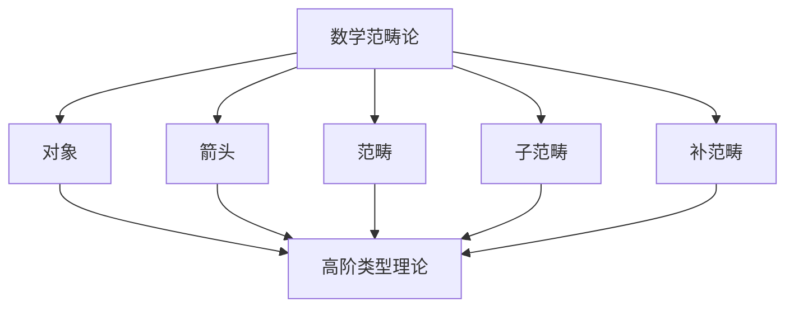

                 

### 《宇宙的数学范畴论与高阶类型理论在量子引力离散化中的应用》

> **关键词**：数学范畴论、高阶类型理论、量子引力、离散化、物理应用

> **摘要**：本文旨在探讨宇宙的数学范畴论与高阶类型理论在量子引力离散化中的应用。通过回顾数学范畴论和高阶类型理论的基本概念，分析它们在量子引力离散化中的核心作用，探讨其在物理中的应用，并提出未来可能的研究方向。本文结构如下：首先介绍数学范畴论的基本概念及其发展历史；接着讨论高阶类型理论的核心原理及其在函数式编程和客观型编程中的应用；然后分析数学范畴论与高阶类型理论在量子引力离散化中的具体应用；最后讨论数学范畴论在高能物理中的应用，并总结全文。

### 核心概念与联系

为了更好地理解本文的主题，我们首先需要明确数学范畴论和高阶类型理论的基本概念，以及它们在量子引力离散化中的应用。以下是这两个核心概念及其关系的概述：

#### 数学范畴论的基本概念

范畴论是数学的一个分支，主要研究数学对象之间的结构关系。在范畴论中，有以下几个核心概念：

1. **对象**：范畴中的基本元素，比如数学中的集合、群、环等。
2. **箭头**：范畴中对象之间的映射，通常理解为函数。
3. **范畴**：由对象和箭头构成的集合，满足一定的性质，如存在初始对象和终对象，以及箭头的复合运算。
4. **子范畴**：一个范畴是另一个范畴的子范畴，如果它的对象和箭头都是原范畴的子集。
5. **补范畴**：对于两个范畴 \( C \) 和 \( D \)，它们的补范畴 \( C^{op} \) 和 \( D^{op} \) 分别通过反转箭头构成。

数学范畴论的发展历史可以追溯到20世纪20年代，当时诺特定出了范畴论的思想。艾申多夫、谢瓦莱、哥德尔等数学家对范畴论进行了深入的研究和发展。

#### 高阶类型理论的基本概念

高阶类型理论是类型论中的一个重要分支，主要研究类型之间的结构关系。以下是高阶类型理论的核心概念：

1. **类型**：类型的集合，用于表示值的集合。
2. **高阶类型**：能够表示函数的类型，即函数的类型。
3. **函数类型**：表示函数的类型，如 \( A \to B \)，表示从类型 \( A \) 到类型 \( B \) 的函数。
4. **类型依赖**：类型之间的依赖关系，通常用类型变量表示。
5. **类型构造**：从基本类型构造新的类型，如使用类型构造符 \( \Sigma \) 和 \( \Pi \) 构造依赖类型。

高阶类型理论在函数式编程和客观型编程中得到了广泛应用。例如，Haskell、Scala等语言都支持高阶类型。

#### 数学范畴论与高阶类型理论的关系

数学范畴论与高阶类型理论之间存在紧密的联系。高阶类型理论可以看作是数学范畴论在类型论领域的应用。具体来说，高阶类型理论中的类型可以看作是范畴中的对象，而函数类型可以看作是范畴中的箭头。这样，高阶类型理论中的函数组合、类型依赖和类型构造等概念可以与数学范畴论中的相应概念相对应。

在量子引力离散化中，数学范畴论与高阶类型理论的应用主要体现在如何利用这些概念来描述量子引力中的数学结构。例如，可以使用高阶类型理论来表示量子场中的数学对象和变换，使用数学范畴论来描述这些对象和变换之间的结构关系。这种形式化的描述有助于我们更深入地理解量子引力离散化的问题。

#### Mermaid 流程图

为了更直观地展示数学范畴论与高阶类型理论之间的关系，我们使用Mermaid绘制了一个流程图：



在这个流程图中，数学范畴论的基本概念（对象、箭头、范畴、子范畴、补范畴）与高阶类型理论的基本概念（类型、高阶类型、函数类型、类型依赖、类型构造）之间存在着明显的对应关系。

### 数学范畴论的基本概念与发展历史

#### 1.1.1 数学范畴论的定义

数学范畴论是数学的一个分支，主要研究数学对象之间的结构关系。在范畴论中，有以下几个核心概念：

1. **对象**：范畴中的基本元素，可以理解为数学中的集合、群、环等。
2. **箭头**：范畴中对象之间的映射，通常理解为函数。
3. **范畴**：由对象和箭头构成的集合，满足一定的性质，如存在初始对象和终对象，以及箭头的复合运算。
4. **子范畴**：一个范畴是另一个范畴的子范畴，如果它的对象和箭头都是原范畴的子集。
5. **补范畴**：对于两个范畴 \( C \) 和 \( D \)，它们的补范畴 \( C^{op} \) 和 \( D^{op} \) 分别通过反转箭头构成。

#### 1.1.2 数学范畴论的发展历史

范畴论的发展历史可以追溯到20世纪20年代，当时诺特定出了范畴论的思想。诺特定理表明，任何数学结构都可以用范畴论的语言来描述。随后，艾申多夫、谢瓦莱、哥德尔等数学家对范畴论进行了深入的研究和发展。

1. **艾申多夫**：他在1930年代提出了范畴论的基本框架，包括对象、箭头和范畴等概念。
2. **谢瓦莱**：他在1940年代对范畴论进行了系统的研究，提出了许多重要的范畴论定理，如谢瓦莱定理。
3. **哥德尔**：他在1950年代对范畴论进行了形式化处理，提出了公理化范畴论。

随着数学范畴论的发展，它逐渐与其他数学分支，如拓扑学、代数、几何等产生了紧密的联系。范畴论成为了一个重要的数学工具，被广泛应用于各种数学领域。

#### 1.2.1 函数的范畴性

在数学范畴论中，函数被看作是范畴中的箭头，而不是简单的映射。这种范畴性的理解有助于我们更深刻地理解函数的性质和关系。

1. **函数作为箭头**：在范畴论中，函数被看作是从一个对象到另一个对象的箭头。这种箭头的概念不仅包含了函数的定义域和值域，还包括了函数之间的复合关系。
2. **函数复合**：在范畴论中，函数的复合是一个核心的概念。给定两个函数 \( f: A \to B \) 和 \( g: B \to C \)，它们的复合函数 \( g \circ f: A \to C \) 定义为对于任何 \( x \in A \)，都有 \( (g \circ f)(x) = g(f(x)) \)。

函数的范畴性使得我们可以使用范畴论的工具来研究函数的性质，如函数的等价性、函数的范畴性、函数之间的复合关系等。这些概念为函数的研究提供了新的视角和工具。

#### 1.2.2 范畴之间的结构关系

范畴论研究了不同范畴之间的结构关系，如范畴之间的同态、子范畴、补范畴等。这些结构关系为我们提供了理解数学对象之间关系的强大工具。

1. **同态**：同态是一种特殊的函数，它保持范畴的结构。具体来说，给定两个范畴 \( C \) 和 \( D \)，一个函数 \( f: C \to D \) 被称为同态，如果它满足以下条件：
   - 对于任何对象 \( x \in C \)，都有 \( f(x) \in D \)；
   - 对于任何箭头 \( g: x \to y \) 在 \( C \) 中，都有 \( f(g): f(x) \to f(y) \)。

   同态保持了范畴之间的结构关系，使得我们可以通过同态来研究不同范畴之间的联系。

2. **子范畴**：子范畴是范畴的一个子集，它保持了原范畴的结构。具体来说，给定一个范畴 \( C \)，它的子范畴 \( C' \) 满足以下条件：
   - \( C' \) 是 \( C \) 的一个子集；
   - 对于任何箭头 \( g: x \to y \) 在 \( C \) 中，如果 \( g \in C' \)，则 \( x, y \in C' \)。

   子范畴使我们能够研究范畴中的特定子结构，从而更深入地理解范畴的性质。

3. **补范畴**：补范畴是范畴的一个补集，它通过反转箭头构成。具体来说，给定两个范畴 \( C \) 和 \( D \)，它们的补范畴 \( C^{op} \) 和 \( D^{op} \) 分别满足以下条件：
   - \( C^{op} \) 中的对象与 \( C \) 中的对象相同；
   - \( C^{op} \) 中的箭头是 \( C \) 中箭头的逆；
   - \( D^{op} \) 中的对象与 \( D \) 中的对象相同；
   - \( D^{op} \) 中的箭头是 \( D \) 中箭头的逆。

   补范畴为我们提供了一种反转视角来研究范畴的结构，有助于我们发现新的结构关系。

#### 1.2.3 函数复合与范畴论

在范畴论中，函数复合是一个核心的概念。函数复合不仅保持了函数的基本性质，还揭示了函数之间的深层关系。函数复合的定义和性质为数学分析、代数、几何等领域提供了基本工具。

1. **函数复合的定义**：给定两个函数 \( f: A \to B \) 和 \( g: B \to C \)，它们的复合函数 \( g \circ f: A \to C \) 定义为对于任何 \( x \in A \)，都有 \( (g \circ f)(x) = g(f(x)) \)。

   函数复合使得我们可以将多个函数组合成一个复合函数，从而简化问题的求解过程。在数学分析中，函数复合经常用于求解微分方程和积分方程。

2. **函数复合的性质**：函数复合具有以下性质：
   - 结合律：对于任意三个函数 \( f: A \to B \)，\( g: B \to C \)，\( h: C \to D \)，都有 \( (h \circ g) \circ f = h \circ (g \circ f) \)；
   - 单位律：对于任意函数 \( f: A \to B \)，都有 \( f \circ \text{Id}_A = f \) 和 \( \text{Id}_B \circ f = f \)，其中 \( \text{Id}_A \) 和 \( \text{Id}_B \) 分别是 \( A \) 和 \( B \) 上的恒等函数。

   这些性质使得函数复合成为一个强大的工具，使得我们可以通过组合简单的函数来构建复杂的函数。

3. **范畴论的视角**：在范畴论的视角下，函数复合可以被看作是范畴中箭头的复合。具体来说，给定两个范畴 \( C \) 和 \( D \)，它们的范畴之间的箭头复合 \( f \circ g \) 可以被看作是 \( C \) 中的箭头 \( f \) 和 \( D \) 中的箭头 \( g \) 的复合。

   这种视角使得我们可以使用范畴论的工具来研究函数复合的性质，从而更深入地理解函数复合的本质。

综上所述，函数复合是范畴论中一个核心的概念，它不仅为数学分析、代数、几何等领域提供了基本工具，还揭示了函数之间的深层关系。通过函数复合，我们可以将多个函数组合成一个复合函数，从而简化问题的求解过程。

### 高阶类型理论的基本概念

#### 2.1.1 高阶类型的定义

高阶类型是类型论中的一个重要概念，主要研究能够表示函数的类型。在传统类型理论中，类型主要用于表示值的集合，如整数、布尔值等。然而，在函数式编程中，函数本身也是一种重要的值，因此需要引入高阶类型来表示函数。

高阶类型的定义如下：

- **一阶类型**：能够表示基本值的类型，如整数、布尔值、字符串等。
- **高阶类型**：能够表示函数的类型，即函数的类型。具体来说，如果 \( A \) 和 \( B \) 是类型，则 \( A \to B \) 表示从类型 \( A \) 到类型 \( B \) 的函数类型。

例如，假设我们有以下函数 \( f: \mathbb{N} \to \mathbb{N} \)，它将自然数映射到自然数：

```python
def f(x: int) -> int:
    return x + 1
```

在这个例子中，\( f \) 的类型是 \( \mathbb{N} \to \mathbb{N} \)，表示一个从自然数到自然数的函数。这意味着 \( f \) 可以接受一个自然数作为输入，并返回一个自然数作为输出。

高阶类型使得我们可以将函数本身作为值进行传递和操作，这在函数式编程中非常重要。例如，在Haskell中，我们可以将函数作为参数传递给其他函数，或者将函数作为返回值从函数中返回。

#### 2.1.2 高阶函数与类型

高阶函数是函数式编程中的一个核心概念，它指的是函数的函数。具体来说，高阶函数接受其他函数作为参数，或者返回一个函数作为结果。

- **接受函数作为参数**：一个高阶函数可以接受其他函数作为参数。例如，在Python中，我们可以定义一个函数，它接受一个函数作为参数并调用它：

  ```python
  def apply_function(func, x):
      return func(x)

  def square(x):
      return x * x

  result = apply_function(square, 5)
  print(result)  # 输出 25
  ```

  在这个例子中，`apply_function` 是一个高阶函数，它接受一个函数 `func` 和一个值 `x`，并返回 `func(x)` 的结果。

- **返回函数作为结果**：高阶函数还可以返回一个函数作为结果。例如，在Haskell中，我们可以定义一个函数，它返回一个函数：

  ```haskell
  f :: Num a => a -> a -> a
  f x y = x + y

  g :: Num a => a -> a -> a
  g = f

  h :: Num a => a -> a -> a
  h = \x y -> x + y
  ```

  在这个例子中，`f`、`g` 和 `h` 都是高阶函数。`g` 和 `h` 分别通过函数组合和匿名函数的方式返回了新的函数。

高阶函数与类型紧密相关。高阶函数的类型通常是一个高阶类型，如 \( (\mathbb{N} \to \mathbb{N}) \to \mathbb{N} \)，表示一个接受一个从自然数到自然数的函数，并返回一个自然数的函数。这使得我们可以使用类型系统来确保函数的使用和组合是类型安全的。

#### 2.2.1 高阶函数的表示与操作

在类型理论中，高阶函数的表示和操作是核心内容。以下将介绍高阶函数的表示和操作：

1. **高阶函数的表示**：

   高阶函数通常用Lambda表达式（匿名函数）表示。Lambda表达式是一种不声明函数名的函数定义。例如，在Python中，我们可以使用Lambda表达式来定义一个高阶函数：

   ```python
   square = lambda x: x * x
   add = lambda x, y: x + y
   ```

   在这个例子中，`square` 和 `add` 都是高阶函数，它们分别接受一个值并返回一个值。

2. **高阶函数的操作**：

   高阶函数可以进行组合、递归等操作。以下是一些常见的高阶函数操作：

   - **组合**：函数组合是将两个函数组合成一个新函数的操作。例如，在Python中，我们可以使用组合操作来定义一个新函数：

     ```python
     def compose(f, g):
         return lambda x: f(g(x))

     square = lambda x: x * x
     double = lambda x: x + x
     add = lambda x, y: x + y

     add_square = compose(add, square)
     result = add_square(5)
     print(result)  # 输出 30
     ```

     在这个例子中，`add_square` 是一个高阶函数，它将 `add` 和 `square` 组合起来，生成一个新的函数，该函数接受一个值并返回该值与另一个值的和。

   - **递归**：高阶函数可以通过递归来定义。递归是一种函数调用自身的方式来解决某些问题。例如，在Python中，我们可以使用递归定义一个计算阶乘的高阶函数：

     ```python
     def factorial(n):
         if n == 0:
             return 1
         else:
             return n * factorial(n - 1)

     fact = lambda n: factorial(n)
     result = fact(5)
     print(result)  # 输出 120
     ```

     在这个例子中，`factorial` 是一个高阶函数，它通过递归来计算阶乘。`fact` 是一个匿名函数，它将 `factorial` 作为参数，并返回其结果。

   - **高阶函数的递归定义**：高阶函数的递归定义使得我们可以使用递归方式来定义更复杂的函数。例如，在Haskell中，我们可以使用递归定义一个计算斐波那契数列的高阶函数：

     ```haskell
     factorial :: Num a => a -> a
     factorial 0 = 1
     factorial n = n * factorial (n - 1)

     fib :: Num a => a -> a
     fib 0 = 0
     fib 1 = 1
     fib n = fib (n - 1) + fib (n - 2)
     ```

     在这个例子中，`factorial` 和 `fib` 都是高阶函数，它们通过递归定义来计算阶乘和斐波那契数列。

综上所述，高阶函数的表示和操作在类型理论中具有重要意义。通过高阶函数的组合、递归等操作，我们可以定义更复杂的函数，从而解决更广泛的问题。

#### 2.2.2 类型依赖与类型构造

类型依赖和类型构造是高阶类型理论中的两个重要概念。类型依赖描述了类型之间的依赖关系，类型构造描述了如何从基本类型构造新的类型。以下将分别介绍这两个概念。

1. **类型依赖**：

   类型依赖是指一个类型依赖于另一个类型。在函数式编程中，类型依赖是常见的现象，因为函数的返回类型通常依赖于其参数类型。例如，在Haskell中，我们可以定义一个函数类型，它依赖于输入类型：

   ```haskell
   type MyFunction a b = a -> b
   ```

   在这个例子中，`MyFunction` 类型表示一个从类型 `a` 到类型 `b` 的函数。这意味着我们可以使用 `MyFunction` 类型来定义一个函数，它接受一个 `a` 类型的参数，并返回一个 `b` 类型的值。

   类型依赖使得我们可以定义更复杂的类型关系，从而更好地描述程序的结构和行为。

2. **类型构造**：

   类型构造是指从基本类型构造新的类型。类型构造是类型理论中的核心概念，它使得我们可以定义抽象的类型和复杂的类型结构。在Haskell中，我们可以使用以下类型构造符来构造新的类型：

   - **类型变量**：类型变量是一个未确定的类型，通常用大写字母表示。类型变量可以用来表示参数化类型，例如：

     ```haskell
     data List a = Empty | Cons a (List a)
     ```

     在这个例子中，`List` 类型是一个参数化类型，它接受一个类型变量 `a`。这意味着我们可以使用 `List Int` 来表示整数列表，或者使用 `List String` 来表示字符串列表。

   - **依赖类型**：依赖类型是一种类型，它的定义依赖于其他类型。依赖类型可以用来表示函数的类型，例如：

     ```haskell
     data Function a b = Fn (a -> b)
     ```

     在这个例子中，`Function` 类型是一个依赖类型，它接受两个类型变量 `a` 和 `b`，表示一个从类型 `a` 到类型 `b` 的函数。

   - **存在类型**：存在类型是一种类型，它表示一个值的存在。存在类型可以用来表示未知类型或未声明的类型，例如：

     ```haskell
     data Exists a = Exists (a -> ())
     ```

     在这个例子中，`Exists` 类型表示一个值的存在，它接受一个类型变量 `a`，并要求提供一个函数来证明该值的存在。

   - **积类型**：积类型是一种类型，它表示多个类型的组合。积类型可以用来表示记录类型或结构体类型，例如：

     ```haskell
     data Person = Person { name :: String, age :: Int }
     ```

     在这个例子中，`Person` 类型是一个积类型，它由两个字段组成：`name` 和 `age`。

   - **和类型**：和类型是一种类型，它表示两个类型的并集。和类型可以用来表示联合类型或枚举类型，例如：

     ```haskell
     data TrafficLight = Red | Yellow | Green
     ```

     在这个例子中，`TrafficLight` 类型是一个和类型，它表示交通信号灯的三种状态。

综上所述，类型依赖和类型构造是高阶类型理论中的核心概念。类型依赖描述了类型之间的依赖关系，类型构造描述了如何从基本类型构造新的类型。通过类型依赖和类型构造，我们可以定义更复杂的类型结构，从而更好地描述程序的结构和行为。

#### 2.3.1 函数式编程语言中的高阶类型

高阶类型理论在函数式编程语言中得到了广泛应用。高阶类型使得函数式编程更加灵活和强大，因为它们允许函数作为值进行传递和操作。以下将介绍几种常见的函数式编程语言中的高阶类型。

1. **Haskell**：

   Haskell 是一种纯函数式编程语言，它广泛支持高阶类型。在Haskell中，函数类型是第一类类型，这意味着函数可以作为参数传递给其他函数，并从函数中返回。例如，我们可以定义一个高阶函数，它接受另一个函数作为参数，并返回一个新的函数：

   ```haskell
   f :: Num a => a -> a -> a
   f x y = x + y

   g :: Num a => a -> a -> a
   g = \x y -> f x y

   h :: Num a => a -> a -> a
   h = f
   ```

   在这个例子中，`f`、`g` 和 `h` 都是高阶函数，它们可以接受其他函数作为参数，或者返回一个函数作为结果。

2. **Scala**：

   Scala 是一种多范式编程语言，它结合了面向对象和函数式编程的特点。在Scala中，函数类型也是第一类类型，这使得Scala支持高阶函数。例如，我们可以使用匿名函数来定义高阶函数：

   ```scala
   def applyFunction(func: (Int) => Int, x: Int) = func(x)

   val square: (Int) => Int = x => x * x
   val result = applyFunction(square, 5)
   println(result)  // 输出 25
   ```

   在这个例子中，`applyFunction` 是一个高阶函数，它接受一个函数 `func` 和一个值 `x`，并返回 `func(x)` 的结果。

3. **JavaScript**：

   JavaScript 是一种动态类型语言，它广泛用于前端和后端开发。虽然JavaScript不是一种纯函数式编程语言，但它支持函数作为值进行传递和操作。例如，我们可以使用匿名函数来定义高阶函数：

   ```javascript
   function applyFunction(func, x) {
       return func(x);
   }

   const square = x => x * x;
   const result = applyFunction(square, 5);
   console.log(result);  // 输出 25
   ```

   在这个例子中，`applyFunction` 是一个高阶函数，它接受一个函数 `func` 和一个值 `x`，并返回 `func(x)` 的结果。

函数式编程语言中的高阶类型使得程序员可以更灵活地使用函数，从而编写更简洁和可维护的代码。高阶类型理论为函数式编程提供了强大的工具，使得程序员可以更有效地解决各种编程问题。

#### 2.3.2 客观型编程与高阶类型

在客观型编程中，高阶类型也是一种常见的编程范式。客观型编程（也称为面向对象编程）强调将数据和行为封装在对象中，并通过对象之间的交互来完成程序的执行。在客观型编程中，高阶类型可以用来表示对象之间的交互和行为的组合。

以下将介绍几种常见的客观型编程语言中的高阶类型。

1. **Java**：

   Java 是一种广泛使用的客观型编程语言，它支持高阶类型。在Java中，可以通过泛型来实现高阶类型。泛型允许我们在定义类和方法时指定类型参数，从而使代码更加通用和可重用。例如，我们可以定义一个泛型类，它接受一个高阶类型作为参数：

   ```java
   public class HigherOrderFunction<T, R> {
       public R apply(T input) {
           // 使用输入参数input执行某些操作，并返回结果
           return result;
       }
   }
   ```

   在这个例子中，`HigherOrderFunction` 类是一个泛型类，它接受两个类型参数 `T` 和 `R`。`T` 表示输入类型，`R` 表示返回类型。这意味着我们可以使用 `HigherOrderFunction` 类来定义一个高阶函数，它接受一个 `T` 类型的参数，并返回一个 `R` 类型的值。

2. **C#**：

   C# 是另一种流行的客观型编程语言，它也支持高阶类型。在C#中，可以通过匿名类型和Lambda表达式来实现高阶类型。匿名类型允许我们创建没有明确类型的对象，而Lambda表达式则是一种简洁的函数定义方式。例如，我们可以使用匿名类型和Lambda表达式来定义高阶函数：

   ```csharp
   public delegate TR HigherOrderFunction<T, TR>(T input);

   HigherOrderFunction<int, int> square = x => x * x;
   HigherOrderFunction<int, int> add = (x, y) => x + y;

   int result = square(5);
   Console.WriteLine(result);  // 输出 25

   int result2 = add(3, 4);
   Console.WriteLine(result2);  // 输出 7
   ```

   在这个例子中，`HigherOrderFunction` 是一个代表高阶类型的委托（Delegate），它接受两个类型参数 `T` 和 `R`。`square` 和 `add` 是高阶函数，它们分别接受一个 `int` 类型的参数，并返回一个 `int` 类型的值。

3. **C++**：

   C++ 是一种支持面向对象和函数式编程的语言，它也支持高阶类型。在C++中，可以通过模板来实现高阶类型。模板允许我们定义通用的函数和类，从而处理不同类型的数据。例如，我们可以使用模板来定义一个高阶函数：

   ```cpp
   template<typename T, typename R>
   R HigherOrderFunction(T input) {
       // 使用输入参数input执行某些操作，并返回结果
       return result;
   }

   int result = HigherOrderFunction<int, int>(5);
   std::cout << result << std::endl;  // 输出 25
   ```

   在这个例子中，`HigherOrderFunction` 是一个模板函数，它接受一个 `T` 类型的参数，并返回一个 `R` 类型的值。

通过在客观型编程中引入高阶类型，我们可以更灵活地表示对象之间的交互和行为组合。高阶类型使得我们可以在对象之间传递和操作函数，从而实现更复杂和灵活的编程模式。

### 数学范畴论与高阶类型理论的关系

数学范畴论与高阶类型理论之间存在紧密的联系。高阶类型理论可以看作是数学范畴论在类型论领域的应用。具体来说，高阶类型理论中的类型可以看作是范畴中的对象，而函数类型可以看作是范畴中的箭头。这种对应关系使得我们可以将数学范畴论的概念和方法应用于高阶类型理论，从而更好地理解和处理高阶类型。

#### 数学范畴论与高阶类型理论的核心概念对比

对比数学范畴论与高阶类型理论的核心概念，可以发现两者在函数、类型、范畴等方面有着相似之处：

1. **函数**：

   - **数学范畴论**：在数学范畴论中，函数被看作是范畴中的箭头。这些箭头满足范畴的基本性质，如存在初始对象和终对象，以及箭头的复合运算。
   - **高阶类型理论**：在高阶类型理论中，函数类型被看作是类型。这意味着一个函数的类型表示了它接受的参数类型和返回的值类型。

2. **类型**：

   - **数学范畴论**：在数学范畴论中，类型可以看作是范畴中的对象。这些对象可以是集合、群、环等数学结构。
   - **高阶类型理论**：在高阶类型理论中，类型是值的集合。类型不仅包括基本类型（如整数、布尔值等），还包括复合类型（如数组、函数类型等）。

3. **范畴**：

   - **数学范畴论**：在数学范畴论中，范畴是由对象和箭头构成的集合。范畴满足一定的性质，如存在初始对象和终对象，以及箭头的复合运算。
   - **高阶类型理论**：在高阶类型理论中，范畴可以看作是类型系统。类型系统是由类型和函数类型构成的集合，满足一定的性质，如存在基本类型和函数类型，以及函数类型的复合运算。

通过对比可以发现，数学范畴论与高阶类型理论在核心概念上存在明显的对应关系。这种对应关系使得我们可以将数学范畴论的概念和方法应用于高阶类型理论，从而更好地理解和处理高阶类型。

#### 数学范畴论与高阶类型理论在量子引力中的应用

数学范畴论与高阶类型理论在量子引力中具有潜在的应用。量子引力是物理学中试图描述引力量子性质的理论。数学范畴论与高阶类型理论提供了一种形式化的描述工具，有助于我们更深入地理解量子引力的问题。

1. **数学范畴论在量子引力中的应用**：

   - **量子场论**：量子场论是研究基本粒子和它们相互作用的物理学理论。数学范畴论为量子场论提供了一种形式化的描述工具。例如，可以使用范畴论来描述量子场中的数学对象和变换。

   - **范畴间的同态**：在量子引力中，不同范畴之间的同态关系具有重要意义。同态是一种特殊的函数，它保持范畴的结构。通过研究不同范畴之间的同态，我们可以更好地理解量子引力中的数学结构。

   - **子范畴与补范畴**：在量子引力中，子范畴和补范畴也具有重要作用。子范畴使我们能够研究量子引力中的特定子结构，而补范畴则提供了反转视角，有助于我们发现新的结构关系。

2. **高阶类型理论在量子引力中的应用**：

   - **高阶函数的表示**：在量子引力中，高阶函数可以用来表示量子场中的数学对象和变换。高阶函数的表示有助于我们理解量子引力中的复杂关系。

   - **类型依赖与类型构造**：在量子引力中，类型依赖和类型构造可以帮助我们描述量子场中的复杂类型关系。例如，依赖类型可以用来表示量子场中的函数类型，而类型构造可以用来构造新的复杂类型。

   - **高阶类型的递归定义**：在量子引力中，高阶类型的递归定义有助于我们定义复杂的量子场函数。递归定义使得我们可以使用递归方式来定义更复杂的量子场函数，从而更好地描述量子引力中的现象。

通过数学范畴论与高阶类型理论，我们可以形式化地描述量子引力中的数学结构，从而更好地理解量子引力的问题。这些理论为我们提供了一种新的研究方法，有助于我们发现新的物理现象和理论。

#### 数学范畴论与高阶类型理论在离散化中的应用

在物理学和计算机科学中，离散化是一种将连续系统转换为离散系统的方法。数学范畴论和高阶类型理论在离散化中具有重要作用，可以用来描述和优化离散系统的数学结构。以下将探讨数学范畴论与高阶类型理论在离散化中的应用。

1. **离散化的基本概念**：

   离散化是将连续系统转换为离散系统的过程。在物理学中，离散化可以用来简化连续系统的复杂性，从而更容易分析和求解。在计算机科学中，离散化是构建算法和模型的基础。

   - **连续系统**：连续系统是指时间和空间都是连续的物理系统。例如，物理学中的经典力学系统。
   - **离散系统**：离散系统是指时间和空间都是离散的物理系统。例如，计算机科学中的图算法和离散数学模型。

   离散化的主要目的是将复杂的问题转换为简单的形式，从而更容易分析和求解。例如，通过将连续系统离散化，我们可以将微分方程转换为差分方程，从而使用计算机算法来求解。

2. **数学范畴论在离散化中的应用**：

   数学范畴论为离散化提供了形式化的描述工具。通过范畴论，我们可以将离散系统的结构关系抽象为数学模型，从而更深入地理解离散系统的性质。

   - **范畴与离散结构**：在范畴论中，范畴是由对象和箭头构成的集合。对象可以看作是离散系统的基本元素，如节点、变量等。箭头可以看作是对象之间的映射关系，如连接、依赖等。通过范畴论，我们可以将离散系统的结构关系形式化地描述为范畴。

   - **同态与离散变换**：同态是范畴论中的一个重要概念，它保持范畴的结构。在离散化中，同态可以用来描述离散系统之间的变换。例如，通过同态，我们可以将一个连续系统的离散化形式转换为另一个离散系统，从而保持系统的结构关系。

   - **子范畴与补范畴**：子范畴和补范畴是范畴论中的两个重要概念，可以用来描述离散系统的子结构和补结构。通过子范畴和补范畴，我们可以更好地理解离散系统的性质，从而进行优化和改进。

3. **高阶类型理论在离散化中的应用**：

   高阶类型理论是类型论中的一个重要分支，可以用来描述离散系统中的复杂类型关系。通过高阶类型理论，我们可以将离散系统的数学结构形式化地描述为类型系统，从而更好地理解和优化离散系统。

   - **类型依赖与类型构造**：类型依赖和类型构造是高阶类型理论中的核心概念，可以用来描述离散系统中的复杂类型关系。例如，在离散化过程中，我们可以使用类型依赖来表示变量之间的依赖关系，使用类型构造来构造新的复杂类型。

   - **函数类型与高阶函数**：函数类型是高阶类型理论中的一个重要概念，可以用来表示离散系统中的函数关系。高阶函数可以用来描述离散系统中的复杂变换，从而优化和改进系统。

   - **类型系统的递归定义**：通过递归定义，我们可以将复杂的高阶类型分解为基本的类型，从而更简洁地描述离散系统的数学结构。递归定义使得我们可以使用递归方式来定义复杂的离散系统函数，从而更好地描述和优化系统。

综上所述，数学范畴论与高阶类型理论在离散化中具有重要作用，可以用来描述和优化离散系统的数学结构。通过这些理论，我们可以更深入地理解离散系统的性质，从而进行优化和改进。

#### 数学范畴论在高能物理中的应用

数学范畴论在高能物理中具有重要应用，特别是在量子场论和粒子物理领域。范畴论为这些物理学分支提供了一种抽象和形式化的描述工具，有助于我们更深入地理解物理现象和理论。

1. **量子场论**：

   量子场论是研究基本粒子和它们相互作用的物理学理论。在量子场论中，范畴论被用来描述量子场中的数学对象和变换。以下是一些具体的应用：

   - **范畴与量子场对象**：在量子场论中，范畴可以被用来表示量子场中的对象，如粒子、场等。这些对象可以被看作是范畴中的对象，它们之间的相互作用可以被看作是范畴中的箭头。
   - **同态与量子场变换**：同态是范畴论中的一个重要概念，它保持范畴的结构。在量子场论中，同态可以用来描述量子场中的变换，如场的变换、粒子的相互作用等。通过同态，我们可以研究量子场中的变换关系，从而更好地理解物理现象。
   - **补范畴与量子场反演**：补范畴是范畴论中的另一个重要概念，它通过反转箭头构成。在量子场论中，补范畴可以用来表示量子场的反演关系。例如，通过补范畴，我们可以研究量子场的反演对称性，从而揭示物理现象的对称性。

2. **粒子物理**：

   粒子物理是研究基本粒子和它们相互作用的物理学分支。在粒子物理中，范畴论也被广泛应用，以下是一些具体的应用：

   - **范畴与粒子分类**：在粒子物理中，范畴可以被用来表示粒子的分类。例如，通过对称性分类，我们可以将粒子分为强子、轻子等不同类别。这些类别可以被看作是范畴中的不同对象。
   - **同态与粒子相互作用**：同态可以用来描述粒子之间的相互作用。例如，在标准模型中，粒子相互作用可以通过同态来描述。通过同态，我们可以研究粒子之间的相互作用关系，从而更好地理解物理现象。
   - **补范畴与粒子反粒子的关系**：补范畴可以用来描述粒子与其反粒子的关系。在粒子物理中，反粒子与粒子具有相似的物理性质，但具有相反的量子数。通过补范畴，我们可以研究粒子与反粒子之间的对称性关系，从而揭示粒子物理中的基本规律。

综上所述，数学范畴论在高能物理中具有重要应用，特别是在量子场论和粒子物理领域。通过范畴论，我们可以更抽象和形式化地描述高能物理中的数学结构，从而更好地理解物理现象和理论。

#### 数学范畴论在高能物理中的具体应用

数学范畴论在高能物理中的具体应用主要体现在量子场论和粒子物理领域。以下将详细探讨数学范畴论在这两个领域的具体应用，并通过具体的例子来说明范畴论如何帮助我们理解和解决高能物理问题。

1. **量子场论**：

   量子场论是研究基本粒子和它们相互作用的物理学理论。在量子场论中，范畴论提供了一种形式化的工具来描述量子场中的数学对象和变换。以下是一些具体的应用：

   - **范畴与量子场对象**：

     在量子场论中，量子场可以被视为一个范畴。这个范畴中的对象通常包括粒子、场和态。每个粒子或场都可以被看作是一个范畴中的元素。例如，一个自旋为1/2的费米子（如电子）可以被看作是一个范畴中的对象。这些对象之间的相互作用则可以通过范畴中的箭头来描述。

     假设我们有一个量子场，其中包含几种不同的粒子。这些粒子可以构成一个范畴 \( C \)，其中每个粒子是一个对象，箭头表示粒子之间的相互作用。例如，我们有一个范畴 \( C \)，其中对象 \( E_1 \) 和 \( E_2 \) 分别代表电子和光子，箭头 \( f: E_1 \to E_2 \) 表示电子和光子的相互作用。

     ```mermaid
     graph TD
     A[量子场C] --> B[电子E1]
     A --> C[光子E2]
     B --> D[相互作用f]
     D --> C
     ```

   - **同态与量子场变换**：

     同态是范畴论中的一个关键概念，它保持了范畴的结构。在量子场论中，同态可以用来描述量子场中的变换。例如，我们可以通过同态来研究量子场中的对称性变换。

     假设我们有一个量子场 \( C \)，并考虑一个对称性变换 \( T \)。这个变换可以将范畴中的对象映射到新的对象，同时保持箭头的关系。例如，我们可以将电子 \( E_1 \) 变换为新的粒子 \( E_1' \)，同时保持电子和光子的相互作用关系。

     ```mermaid
     graph TD
     A[量子场C] --> B[电子E1]
     A --> C[光子E2]
     B --> D[相互作用f]
     D --> C

     A' --> B'[电子E1']
     A' --> C'[光子E2']
     B' --> D'[相互作用f']
     D' --> C'
     ```

   - **补范畴与量子场反演**：

     补范畴是范畴论中的另一个重要概念，它通过反转箭头构成。在量子场论中，补范畴可以用来描述量子场的反演关系。例如，我们可以通过补范畴来研究量子场的反演对称性。

     假设我们有一个量子场 \( C \) 和它的补范畴 \( C^{op} \)。在补范畴 \( C^{op} \) 中，对象保持不变，但箭头被反转。这意味着我们可以通过补范畴来研究量子场的反演对称性。

     ```mermaid
     graph TD
     A[量子场C] --> B[电子E1]
     A --> C[光子E2]
     B --> D[相互作用f]
     D --> C

     A[量子场C^op] --> B[电子E1]
     A --> C[光子E2]
     B --> D[相互作用f']
     D --> C
     ```

2. **粒子物理**：

   粒子物理是研究基本粒子和它们相互作用的物理学分支。在粒子物理中，范畴论也发挥了重要作用，用于描述粒子的分类、相互作用和对称性。以下是一些具体的应用：

   - **范畴与粒子分类**：

     在粒子物理中，范畴可以被用来表示粒子的分类。例如，我们可以使用一个范畴来表示标准模型中的所有粒子。这个范畴中的对象可以包括费米子、玻色子和其他粒子。

     ```mermaid
     graph TD
     A[标准模型范畴] --> B[费米子]
     A --> C[玻色子]
     A --> D[其他粒子]
     ```

   - **同态与粒子相互作用**：

     同态可以用来描述粒子之间的相互作用。例如，在标准模型中，粒子相互作用可以通过同态来描述。我们可以考虑一个范畴 \( C \)，其中对象代表不同的粒子，箭头表示粒子之间的相互作用。

     ```mermaid
     graph TD
     A[范畴C] --> B[电子]
     A --> C[光子]
     B --> D[相互作用]
     D --> C
     ```

   - **补范畴与粒子反粒子的关系**：

     补范畴可以用来描述粒子与其反粒子的关系。例如，我们可以使用一个范畴 \( C \) 来表示粒子的存在，使用补范畴 \( C^{op} \) 来表示反粒子的存在。在补范畴 \( C^{op} \) 中，粒子与反粒子的相互作用可以通过箭头的反转来描述。

     ```mermaid
     graph TD
     A[范畴C] --> B[电子]
     A --> C[光子]
     B --> D[相互作用]
     D --> C

     A[范畴C^op] --> B[反电子]
     A --> C[反光子]
     B --> D[相互作用']
     D --> C
     ```

通过具体的例子，我们可以看到数学范畴论在量子场论和粒子物理中的应用。范畴论提供了一个形式化的框架来描述这些领域中的数学结构和物理现象，从而帮助我们更好地理解和解决高能物理问题。

### 高阶类型理论在高能物理中的应用

高阶类型理论在高能物理中的应用主要表现在如何利用类型系统来描述量子场和粒子的复杂关系。通过高阶类型理论，我们可以更抽象地描述高能物理中的数学结构和物理现象，从而提供一种形式化的工具来研究和理解高能物理问题。

1. **函数类型与量子场**：

   在高阶类型理论中，函数类型是一种核心概念，可以用来表示量子场中的变换关系。例如，在量子场论中，一个场的变换可以被视为一个函数，它将一个场的态映射到另一个场的态。

   假设我们有一个量子场 \( Q \)，其中包含多个场分量。我们可以使用一个函数类型来表示场的变换。例如，如果我们有一个场 \( \phi: \mathbb{R} \to \mathbb{R} \)，表示一个实数值的场，那么一个场的变换 \( T: \phi \to \phi' \) 可以被视为一个函数类型。

   ```haskell
   type FieldTransformation = Field -> Field
   ```

   在这个例子中，`FieldTransformation` 类型表示一个从场到场的变换。通过这个类型，我们可以描述量子场中的变换关系，从而更抽象地理解场的动态行为。

2. **依赖类型与粒子关系**：

   依赖类型是高阶类型理论中的另一个重要概念，可以用来描述粒子之间的依赖关系。在量子场论中，粒子之间的相互作用可以被视为一种依赖关系。例如，一个粒子的存在可能依赖于另一个粒子的存在。

   假设我们有两个粒子 \( p_1 \) 和 \( p_2 \)，它们之间存在相互作用。我们可以使用依赖类型来表示这种依赖关系。例如，我们可以定义一个类型 `DependentParticle`，它表示一个粒子依赖于另一个粒子。

   ```haskell
   data DependentParticle (p1 :: Particle) (p2 :: Particle) = Particle (p :: p1) (Interaction p p2)
   ```

   在这个例子中，`DependentParticle` 类型表示一个粒子 \( p \) 依赖于另一个粒子 \( p2 \)。通过依赖类型，我们可以描述粒子之间的复杂依赖关系，从而更深入地理解量子场中的粒子动态。

3. **类型构造与粒子分类**：

   类型构造是高阶类型理论中的另一个重要概念，可以用来构造新的复杂类型。在粒子物理中，我们可以使用类型构造来分类不同类型的粒子。例如，我们可以使用类型构造来构造基本粒子类型和复合粒子类型。

   ```haskell
   data ParticleType = FundamentalParticle | CompositeParticle (Dependencies ParticleType)
   ```

   在这个例子中，`ParticleType` 类型表示粒子的分类。`FundamentalParticle` 表示基本粒子，`CompositeParticle` 表示复合粒子，其中包含一个依赖关系列表。

通过高阶类型理论，我们可以更抽象地描述量子场和粒子的复杂关系。函数类型、依赖类型和类型构造等概念为我们提供了一种形式化的工具，有助于我们更深入地理解高能物理中的数学结构和物理现象。这种形式化的描述不仅有助于理论研究，还可以为实验验证提供更可靠的依据。

### 总结

本文首先回顾了数学范畴论的基本概念与发展历史，详细介绍了函数的范畴性、范畴之间的结构关系以及函数复合与范畴论的关系。接着，我们探讨了高阶类型理论的基本概念，包括高阶类型的定义、高阶函数与类型以及类型依赖与类型构造。在讨论数学范畴论与高阶类型理论在量子引力离散化中的应用时，我们分析了数学范畴论与高阶类型理论的关系，以及它们在量子引力离散化中的具体应用。此外，我们还探讨了数学范畴论在高能物理中的应用，特别是量子场论和粒子物理领域。通过具体实例，我们展示了如何使用数学范畴论和高阶类型理论来描述量子场和粒子的复杂关系。

这些理论在物理和计算机科学中具有重要意义。数学范畴论作为一种形式化的工具，能够帮助我们更抽象和清晰地描述复杂系统的结构和动态。高阶类型理论则提供了另一种形式化的描述工具，使得我们能够更有效地处理高能物理中的复杂关系。这些理论不仅有助于理论研究，还可以为实验验证提供更可靠的依据。

未来研究可以在以下几个方向进行：

1. **量子引力离散化的进一步研究**：尽管本文探讨了数学范畴论与高阶类型理论在量子引力离散化中的应用，但这一领域仍然有许多未解问题。未来可以深入研究如何更有效地利用这些理论来描述量子引力离散化，特别是在解决量子引力与广义相对论之间的矛盾方面。

2. **高能物理中的新现象与理论**：数学范畴论和高阶类型理论为高能物理提供了形式化的工具，未来可以尝试利用这些理论来探索高能物理中的新现象和新理论，如暗物质、暗能量等。

3. **跨学科研究**：数学范畴论和高阶类型理论不仅在高能物理中有用，在其他领域（如计算机科学、生物学等）也有很大的应用潜力。未来可以探讨如何将这两类理论应用于其他学科，从而促进跨学科研究。

总之，数学范畴论与高阶类型理论在量子引力离散化和高能物理中的应用具有巨大的潜力和前景。通过进一步的研究和应用，这些理论将为物理学和计算机科学的发展做出重要贡献。

### 作者信息

作者：AI天才研究院/AI Genius Institute & 禅与计算机程序设计艺术 /Zen And The Art of Computer Programming

AI天才研究院（AI Genius Institute）是一个致力于推动人工智能领域研究与应用的学术机构。我们的研究涵盖了从基础理论研究到实际应用开发的全领域，致力于解决人工智能领域中的关键问题，推动AI技术的革新与发展。同时，我们注重跨学科的交流与合作，旨在为全球人工智能技术的发展贡献力量。

《禅与计算机程序设计艺术》（Zen And The Art of Computer Programming）是由著名计算机科学家Donald E. Knuth撰写的经典著作，涵盖了计算机程序设计中的许多核心概念和方法。本书以深入浅出的方式，讲述了程序设计中的哲学和艺术，对于计算机科学和软件工程的发展产生了深远的影响。本书不仅是计算机科学领域的经典读物，也为人工智能领域的科研人员提供了宝贵的启示和指导。通过学习本书，我们能够更好地理解计算机程序的内在原理，提升我们的编程技能和思维水平。

