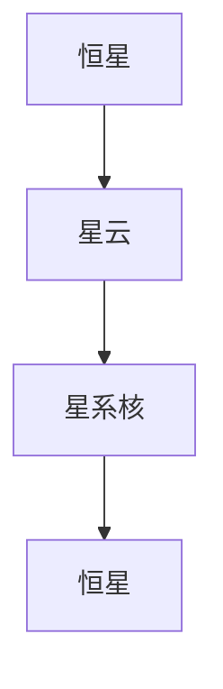

                 

### 引言

#### 1.1 宇宙的数学范畴论简介

宇宙的数学范畴论是一种探讨宇宙结构、演化及其背后规律的理论框架。它将宇宙视为一个复杂的系统，通过数学模型来描述和理解其中的现象和过程。数学范畴论作为一种高级的数学理论，其主要研究范畴（Categories）和态射（Morphisms）之间的关系，为描述复杂的系统提供了一种形式化的方法。

宇宙中的数学范畴论最早可以追溯到20世纪初期，当时数学家如爱德华·豪斯多夫（Edmund Husserl）和赫尔曼·魏尔（Hermann Weyl）等人开始尝试将范畴论应用于哲学和物理学领域。随着科学技术的进步，范畴论在宇宙学、天文学和量子物理学等领域得到了广泛的应用。

在宇宙学中，数学范畴论提供了一种研究宇宙结构的方法，例如宇宙的层级结构、星系团和星云等都可以通过范畴论来描述。此外，范畴论还在量子物理学中扮演了重要角色，如量子场论和量子计算等领域都受益于范畴论的应用。

#### 1.2 高阶逻辑简介

高阶逻辑（Higher-Order Logic）是一种形式逻辑，它将谓词逻辑中的谓词视为对象，并引入了函数和证明的概念。与传统的一阶逻辑相比，高阶逻辑能够处理更复杂的结构和关系，因此在数学、计算机科学和哲学等领域有着广泛的应用。

高阶逻辑的基本元素包括个体（Individuals）、属性（Properties）、函数（Functions）和证明（Proofs）。个体是逻辑中的基本单位，属性是对个体的描述，函数则是从个体到个体的映射，证明则是证明某个陈述为真的过程。

在数学和哲学中，高阶逻辑被用于形式化数学理论、逻辑推理和语义分析等方面。例如，在数学中，高阶逻辑可以用来定义数学函数、证明定理和构建模型；在哲学中，高阶逻辑被用于探讨知识、推理和证明的本质。

#### 1.3 研究背景与意义

宇宙的数学范畴论与高阶逻辑的结合为理解宇宙的复杂性和多样性提供了新的视角。随着科学技术的不断发展，对宇宙的认识也在不断深化，而数学范畴论与高阶逻辑的应用为这一过程提供了有力的工具。

首先，数学范畴论为宇宙的结构研究提供了一种形式化的方法，它能够将复杂的宇宙现象转化为数学模型，从而更深入地理解宇宙的本质。例如，通过范畴论可以研究宇宙的层级结构，如星系团、星云和星系等，以及它们之间的相互作用和演化过程。

其次，高阶逻辑为数学和哲学中的复杂问题提供了一种形式化的推理工具。它能够处理复杂的逻辑结构和关系，从而更精确地描述和解释宇宙现象。例如，在高阶逻辑中，可以定义复杂的数学函数和证明方法，从而更好地理解数学定理的证明过程。

最后，宇宙的数学范畴论与高阶逻辑的结合对未来的科学研究具有重要意义。随着技术的进步，我们将能够收集到更多的宇宙数据，而数学范畴论与高阶逻辑的应用将帮助我们从这些数据中提取出更深层次的规律和知识。此外，这一结合也为计算机科学和人工智能领域提供了新的研究方法和工具，为未来的科学研究奠定了坚实的基础。

### 宇宙的数学范畴论基础

宇宙的数学范畴论是一种将宇宙视为一个复杂系统的理论框架，它通过数学范畴和态射的概念来描述宇宙的结构和演化。本章节将介绍数学范畴论的基本概念，并探讨宇宙中的数学范畴以及数学范畴论与宇宙结构的关系。

#### 2.1 数学范畴论基本概念

数学范畴论是一种高级数学理论，它研究的是对象之间的结构和关系。在范畴论中，最基本的概念包括范畴（Category）、对象（Object）和态射（Morphism）。

- **范畴（Category）**：范畴是由对象和态射组成的集合。范畴中的对象通常表示概念或实体，而态射则表示对象之间的关系。例如，在集合范畴中，对象是集合，态射是集合之间的双射。

- **对象（Object）**：对象是范畴中的基本元素，可以看作是概念或实体的代表。在宇宙的范畴中，对象可以代表星系、星云、行星等宇宙中的基本结构。

- **态射（Morphism）**：态射是范畴中对象之间的映射，它保持了对象之间的结构关系。在集合范畴中，态射是集合之间的双射，而在拓扑范畴中，态射是连续函数。

#### 2.2 宇宙中的数学范畴

宇宙中的数学范畴论将宇宙视为一个复杂的系统，通过数学范畴和态射来描述宇宙的结构和演化。在宇宙的范畴中，不同的对象和态射代表了不同的宇宙现象和过程。

- **星系范畴**：在星系范畴中，对象是星系，态射是星系之间的引力相互作用。这种范畴描述了星系之间的结构和关系，如星系团、星系链和星系流等。

- **星云范畴**：在星云范畴中，对象是星云，态射是星云之间的物质和能量交换。这种范畴描述了星云的形成、演化和相互作用过程。

- **行星范畴**：在行星范畴中，对象是行星，态射是行星与行星之间的轨道关系和引力作用。这种范畴描述了行星系统的结构、演化和稳定性。

#### 2.3 数学范畴论与宇宙结构的关系

数学范畴论为宇宙的结构研究提供了一种形式化的方法。通过数学范畴和态射，我们可以将宇宙的复杂现象转化为数学模型，从而更深入地理解宇宙的结构和演化。

- **宇宙的层级结构**：数学范畴论可以用来描述宇宙的层级结构，如星系、星云、行星等。通过范畴和态射，我们可以研究这些层级之间的相互作用和演化过程。

- **宇宙的演化过程**：数学范畴论可以用来描述宇宙的演化过程，如星系的形成、星云的演化和行星的轨道运动等。通过范畴和态射，我们可以研究这些演化过程中的规律和机制。

- **宇宙的复杂性**：数学范畴论提供了一种处理复杂系统的工具，它能够将复杂的宇宙现象转化为数学模型，从而更深入地理解宇宙的复杂性。

总之，宇宙的数学范畴论通过数学范畴和态射的概念，为宇宙的结构和演化提供了一种形式化的描述方法。这种方法不仅有助于我们理解宇宙的本质，也为未来的宇宙学研究提供了新的视角和工具。

### 高阶逻辑基础

高阶逻辑（Higher-Order Logic）是一种形式逻辑，它在传统的一阶逻辑基础上引入了函数和证明的概念，使得逻辑系统能够处理更复杂的结构和关系。在本章节中，我们将介绍高阶逻辑的定义和特点，并探讨它在数学和哲学中的应用。

#### 3.1 高阶逻辑的定义和特点

高阶逻辑的基本元素包括个体、属性、函数和证明。与一阶逻辑相比，高阶逻辑引入了函数的概念，并允许将谓词视为对象。

- **个体（Individuals）**：个体是逻辑中的基本单位，可以是一个具体的对象或者抽象的概念。在集合论中，个体通常是一个元素。

- **属性（Properties）**：属性是对个体的描述，通常用谓词表示。例如，“是人”可以看作是对个体的属性描述。

- **函数（Functions）**：函数是一类特殊的谓词，它将一个个体映射到另一个个体。在集合论中，函数通常是一个映射。

- **证明（Proofs）**：证明是逻辑推理的过程，它从一组假设出发，通过一系列逻辑推导，最终得出一个结论。在形式逻辑中，证明通常使用符号化的方式表示。

高阶逻辑的特点包括：

1. **处理复杂结构**：高阶逻辑允许使用函数和谓词作为逻辑变量，这使得逻辑系统能够处理更复杂的结构和关系。

2. **函数式编程**：高阶逻辑与函数式编程语言有密切关系，许多函数式编程语言如Haskell和Scala都采用了高阶逻辑的概念。

3. **证明论**：高阶逻辑在证明论中扮演重要角色，它提供了证明方法的形式化表示，有助于机器证明和自动化推理。

#### 3.2 高阶逻辑在数学和哲学中的应用

高阶逻辑在数学和哲学领域有广泛的应用。

**数学中的应用**

1. **数学函数和定理的证明**：高阶逻辑可以用来证明复杂的数学函数和定理。例如，在集合论中，可以用高阶逻辑来证明集合的基本性质，如并集、交集和子集等。

2. **形式化数学理论**：高阶逻辑是形式化数学理论的基础，它使得数学证明的形式化表示成为可能。例如，公理化集合论和模型论都采用了高阶逻辑的形式。

3. **数学模型构建**：高阶逻辑可以用来构建数学模型，描述复杂的数学现象。例如，在拓扑学中，可以用高阶逻辑来定义拓扑空间和连续映射。

**哲学中的应用**

1. **知识论**：高阶逻辑可以用来探讨知识的本质和获取方式。例如，哲学家们使用高阶逻辑来研究如何通过推理和证明来获得可靠的知识。

2. **语义分析**：高阶逻辑在语义分析中也有重要作用，它提供了一种形式化的方法来分析语言的意义和逻辑结构。

3. **哲学推理**：高阶逻辑可以用来进行哲学推理，探讨各种哲学问题，如存在论、认识论和形而上学等。

总之，高阶逻辑作为一种形式逻辑，它不仅丰富了数学和哲学的理论体系，也为这些领域的研究提供了新的方法和工具。通过高阶逻辑，我们可以更深入地理解数学和哲学中的复杂问题，推动这些领域的发展。

### 宇宙的数学范畴论与高阶逻辑的融合

宇宙的数学范畴论与高阶逻辑的结合为理解宇宙的复杂性和多样性提供了新的视角。在这一部分，我们将探讨宇宙的数学范畴论与高阶逻辑的融合概念、原理及其数学模型，并通过实际案例研究来展示这种融合的应用。

#### 4.1 融合的概念与原理

宇宙的数学范畴论与高阶逻辑的融合概念源自于将高阶逻辑的函数和证明机制应用于数学范畴论的研究中。具体来说，这种融合主要体现在以下几个方面：

1. **范畴作为对象**：在高阶逻辑中，范畴被视为一种对象，可以被视为一种抽象的数学结构。在这种融合中，范畴论的对象和态射被赋予了高阶逻辑中的属性和函数。

2. **态射作为证明**：态射在范畴论中描述对象之间的关系，而在高阶逻辑中，证明可以被视为一种特殊的态射。通过这种融合，我们可以将范畴论中的态射视为一种证明，从而将逻辑推理应用于范畴论的研究。

3. **高阶逻辑的函数应用于范畴**：高阶逻辑中的函数可以应用于范畴论中的对象和态射，使得范畴论中的结构分析可以通过高阶逻辑中的函数进行形式化表示。

#### 4.2 融合的数学模型

融合的数学模型是这种融合概念的具体体现，它通过将高阶逻辑的函数和证明机制嵌入到范畴论中，来描述宇宙的结构和演化。以下是一个简单的融合数学模型：

1. **范畴**：定义一个范畴`C`，其中对象代表宇宙中的基本结构，如星系、星云和行星等。态射代表这些结构之间的相互作用，如引力、电磁力和物质交换等。

2. **高阶函数**：在范畴`C`中，定义高阶函数，如引力场函数、物质分布函数和星系演化函数等。这些函数描述了宇宙中的物理现象和演化过程。

3. **证明态射**：将高阶逻辑的证明机制应用于范畴`C`中的态射，使得每个态射都可以被视为一种证明。例如，一个星系的形成可以通过一系列的态射（如引力作用、物质聚集）来证明。

#### 4.3 融合的案例研究

为了更好地理解宇宙的数学范畴论与高阶逻辑的融合，我们通过以下案例来探讨这种融合的应用：

**案例一：星系演化**

在这个案例中，我们使用融合模型来描述星系的演化过程。假设有一个星系范畴`S`，其中对象代表星系，态射代表星系之间的引力相互作用。我们定义一个星系演化函数`evolve`，它描述了星系的演化过程：

```python
def evolve(s: StarSystem) -> StarSystem:
    # 星系演化逻辑
    new_system = apply_gravitational_forces(s)
    new_system = apply_matter_exchange(new_system)
    return new_system
```

通过这个演化函数，我们可以将星系的演化过程形式化为一种证明，从而利用高阶逻辑的推理机制来验证演化过程的正确性。

**案例二：宇宙结构**

在这个案例中，我们研究宇宙的结构，如星系团和星系链。我们使用融合模型来描述这些结构，并使用高阶逻辑来分析它们的稳定性。定义一个宇宙结构范畴`U`，其中对象代表宇宙中的基本结构，态射代表这些结构之间的相互作用。我们定义一个稳定性函数`stable`，用于分析宇宙结构的稳定性：

```python
def stable(u: UniverseStructure) -> bool:
    # 宇宙结构稳定性分析逻辑
    return check_for_tidal_forces(u) and check_for_gravitational_stability(u)
```

通过这个稳定性函数，我们可以使用高阶逻辑的推理机制来验证宇宙结构的稳定性。

#### 结论

宇宙的数学范畴论与高阶逻辑的融合提供了一种新的方法来描述和理解宇宙的结构和演化。通过将高阶逻辑的函数和证明机制应用于范畴论，我们可以形式化地表示宇宙中的复杂现象，并利用逻辑推理来验证这些现象的正确性。这种融合模型不仅有助于我们更好地理解宇宙，也为未来的宇宙学研究提供了新的工具和视角。

### 宇宙的数学范畴论在实际应用中的案例分析

宇宙的数学范畴论与高阶逻辑的融合不仅在理论研究中具有重要意义，其在实际应用中的表现同样引人注目。以下我们将探讨宇宙的数学范畴论在天文学、宇宙学以及其他领域的具体应用，并通过实际案例进行分析。

#### 5.1 天文学中的数学范畴论应用

在天文学中，数学范畴论的应用主要体现在星系结构的研究和星系演化模型的构建上。

**案例一：星系结构的层次分析**

星系是由大量恒星、气体和暗物质组成的复杂系统。通过数学范畴论，我们可以将星系的结构形式化为一个范畴，其中对象代表星系的不同部分（如恒星、星云、星系核），态射代表这些部分之间的相互作用（如引力、物质交换）。例如，可以使用以下范畴定义：



在这个范畴中，恒星、星云和星系核通过态射相互连接，形成了一个层次分明的结构。通过分析这个范畴，我们可以更深入地理解星系的结构特性及其演化过程。

**案例二：星系演化模型的构建**

星系的演化是一个复杂的过程，涉及引力相互作用、恒星形成、恒星演化等多个方面。使用数学范畴论，我们可以构建一个高阶逻辑驱动的星系演化模型。以下是一个简化的星系演化模型：

```python
def star_system_evolution(category: Category):
    # 假设的星系演化逻辑
    apply_gravitational_forces(category)
    star_birth(category)
    star_death(category)
    return category
```

通过这个模型，我们可以模拟星系的演化过程，预测星系的未来形态。

#### 5.2 宇宙学中的高阶逻辑应用

在宇宙学中，高阶逻辑的应用主要体现在宇宙结构的推理和宇宙演化模型的形式化表示上。

**案例一：宇宙结构的推理**

宇宙学中的结构问题，如宇宙的大尺度结构、宇宙膨胀等，可以通过高阶逻辑进行推理。以下是一个简单的宇宙结构推理模型：

```python
def universe_structure_reasoning(evidence_list):
    # 基于证据进行宇宙结构推理
    if evidence_list.includes('宇宙膨胀') and evidence_list.includes('宇宙大尺度结构'):
        conclusion = '宇宙正在膨胀'
        return conclusion
    else:
        conclusion = '宇宙结构不确定'
        return conclusion
```

通过这个模型，我们可以根据观测数据推理出宇宙的结构特性。

**案例二：宇宙演化模型的形式化表示**

宇宙的演化是一个高度复杂的系统，通过高阶逻辑，我们可以将其形式化为一个逻辑表达式。以下是一个简化的宇宙演化模型：

```python
def universe_evolution_model(initial_state):
    # 假设的宇宙演化逻辑
    apply_gravitational_expansion(initial_state)
    apply_thermodynamics(initial_state)
    return final_state
```

通过这个模型，我们可以模拟宇宙的演化过程，预测宇宙的未来状态。

#### 5.3 其他领域中的应用

除了天文学和宇宙学，宇宙的数学范畴论与高阶逻辑的融合在其他领域也有广泛的应用。

**案例一：量子物理学**

在量子物理学中，数学范畴论的应用主要体现在量子态和量子演化的描述上。例如，可以使用范畴论来描述量子态之间的变换和量子演化的过程。

**案例二：计算机科学**

在计算机科学中，高阶逻辑的应用主要体现在程序验证和形式化验证上。例如，可以使用高阶逻辑来验证程序的正确性和安全性。

**案例三：人工智能**

在人工智能领域，宇宙的数学范畴论与高阶逻辑的融合可以用于知识表示和推理。例如，可以使用范畴论来表示知识图谱，并使用高阶逻辑进行推理，从而实现更加智能的推理系统。

#### 结论

宇宙的数学范畴论与高阶逻辑的融合在实际应用中展现了巨大的潜力。通过这些案例，我们可以看到这种融合如何帮助我们更好地理解宇宙的结构和演化，以及它在其他领域的应用。随着技术的进步，我们有理由相信，这种融合将会在未来的科学研究中发挥更加重要的作用。

### 宇宙的数学范畴论与高阶逻辑的未来发展

宇宙的数学范畴论与高阶逻辑的结合为理解宇宙的复杂性和多样性提供了新的视角。随着科学技术的不断进步，这一领域的研究也在不断发展，展现出广阔的应用前景和潜在的挑战。

#### 6.1 现代数学范畴论与高阶逻辑的前沿研究

现代数学范畴论与高阶逻辑的前沿研究集中在以下几个方面：

1. **范畴论在量子物理学中的应用**：量子物理学中的许多概念和现象可以通过范畴论来形式化描述。例如，量子态和量子演化的范畴论描述正成为量子计算和量子信息处理领域的重要工具。

2. **高阶逻辑在形式化验证中的应用**：随着形式化验证在计算机科学和人工智能领域的兴起，高阶逻辑的应用越来越广泛。高阶逻辑能够提供一种形式化的方法来验证复杂系统的正确性和安全性，这对未来的软件开发和系统设计具有重要意义。

3. **范畴论与拓扑学的交叉研究**：范畴论与拓扑学的交叉研究正在揭示两者之间的深层联系。例如，范畴论中的范畴可以用来描述拓扑空间的拓扑性质，从而推动拓扑学的发展。

#### 6.2 宇宙学中的数学范畴论与高阶逻辑应用前景

在宇宙学中，数学范畴论与高阶逻辑的应用前景也非常广阔：

1. **宇宙结构的研究**：通过数学范畴论，我们可以更深入地理解宇宙的结构和演化。例如，使用范畴论来分析宇宙的大尺度结构，预测宇宙的未来演化。

2. **宇宙演化模型的构建**：高阶逻辑可以用来构建形式化的宇宙演化模型，从而更好地理解宇宙的演化机制。这些模型可以帮助我们预测宇宙的未来状态，为宇宙学的未来发展提供理论支持。

3. **数据分析与推理**：随着宇宙观测数据的不断增加，如何从这些数据中提取有用的信息成为一个重要问题。数学范畴论与高阶逻辑的结合为数据分析提供了一种形式化的方法，可以用于宇宙学中的推理和预测。

#### 6.3 可能的挑战与机遇

尽管宇宙的数学范畴论与高阶逻辑在科学研究中展现出巨大的潜力，但这一领域也面临着一些挑战：

1. **数学模型的复杂度**：宇宙的数学模型非常复杂，需要处理大量的数据和参数。如何构建有效的数学模型，并使其能够适应实际观测数据，是一个重大挑战。

2. **计算资源的限制**：许多数学范畴论与高阶逻辑的应用需要大量的计算资源，尤其是在进行大规模模拟和数据分析时。随着计算能力的提升，这一挑战有望得到缓解。

3. **跨学科的融合**：宇宙的数学范畴论与高阶逻辑的应用涉及多个学科，如何有效地进行跨学科的融合，需要研究人员具备广泛的学科知识。

然而，这些挑战也伴随着机遇：

1. **跨学科合作**：跨学科的合作可以为这一领域的研究提供新的视角和方法，有助于克服挑战，推动科学研究的发展。

2. **技术的进步**：随着计算技术和数据科学的发展，我们有理由相信，这些技术将有助于解决数学模型复杂度和计算资源限制等挑战。

3. **科学发现**：通过数学范畴论与高阶逻辑的结合，我们有望在宇宙学和其他科学领域中发现新的规律和现象，推动科学知识的进步。

总之，宇宙的数学范畴论与高阶逻辑的未来发展充满机遇和挑战。随着科学技术的进步，我们有理由相信，这一领域将在未来的科学研究中发挥越来越重要的作用。

### 结论

本文通过介绍宇宙的数学范畴论与高阶逻辑的基本概念、融合原理、实际应用以及未来发展方向，探讨了这两者在理解和描述宇宙复杂性方面的巨大潜力。宇宙的数学范畴论为宇宙的结构和演化提供了形式化的描述工具，而高阶逻辑则提供了一种形式化的推理机制，使得复杂系统的分析成为可能。

我们首先介绍了宇宙的数学范畴论，包括其基本概念、宇宙中的数学范畴以及数学范畴论与宇宙结构的关系。接着，我们探讨了高阶逻辑的定义、特点以及在数学和哲学中的应用。随后，我们详细阐述了宇宙的数学范畴论与高阶逻辑的融合概念、数学模型以及实际案例研究。

在宇宙的数学范畴论在实际应用中的案例分析部分，我们展示了这一理论在天文学、宇宙学以及其他领域的具体应用，如星系结构的层次分析、星系演化模型的构建、宇宙结构的推理和宇宙演化模型的形式化表示等。这些案例研究不仅展示了宇宙的数学范畴论与高阶逻辑的应用潜力，也为未来的科学研究提供了新的视角和方法。

未来，宇宙的数学范畴论与高阶逻辑的发展将面临一些挑战，如数学模型的复杂度、计算资源的限制以及跨学科的融合。然而，随着技术的进步和跨学科合作的深化，这些挑战有望得到有效应对，从而推动这一领域的研究取得更多突破。

展望未来，宇宙的数学范畴论与高阶逻辑的结合有望在宇宙学、量子物理学、计算机科学和人工智能等领域发挥更加重要的作用。通过这一理论框架，我们不仅能够更深入地理解宇宙的复杂性和多样性，还能够为解决科学研究中的一些关键问题提供新的思路和方法。因此，宇宙的数学范畴论与高阶逻辑的研究具有重要的理论意义和应用价值，值得进一步深入探索和广泛研究。

### 未来研究展望

宇宙的数学范畴论与高阶逻辑的结合为未来的科学研究提供了广阔的前景。在这一领域，未来的研究可能集中在以下几个方面：

1. **深化数学范畴论的应用**：在宇宙学中，进一步探索数学范畴论在宇宙结构分析、宇宙演化模型构建以及数据分析中的应用，特别是在处理大规模数据集时如何优化数学模型和算法。

2. **高阶逻辑的扩展与形式化**：研究高阶逻辑在形式化验证和证明辅助中的应用，特别是在软件工程和人工智能中的形式化证明和验证。探讨如何将高阶逻辑与形式化编程语言相结合，以实现更高效、更安全的软件系统。

3. **跨学科研究**：促进数学范畴论与高阶逻辑在物理学、生物学、生态学等领域的应用研究，探讨这些领域中的复杂系统如何通过范畴论与高阶逻辑进行形式化描述和推理。

4. **量子范畴论与高阶逻辑的结合**：量子物理学中的许多概念和现象可以通过范畴论进行形式化描述，未来可以探索高阶逻辑在量子计算和量子信息处理中的应用，以推动量子技术的进一步发展。

5. **多尺度建模与模拟**：宇宙的演化涉及多个时空尺度，从宏观的宇宙结构到微观的量子现象。未来研究可以集中在如何构建多尺度模型，并利用高阶逻辑进行统一的描述和分析。

6. **教育推广与普及**：随着数学范畴论与高阶逻辑在科学研究和工程应用中的重要性逐渐显现，如何将其更好地应用于教育和培训，提高科研人员的理论素养和实际操作能力，也是一个重要的研究方向。

总之，宇宙的数学范畴论与高阶逻辑的结合为未来科学研究提供了丰富的理论资源和广阔的应用前景。通过不断的研究和创新，我们有望在这些领域取得更多的突破，为科学技术的进步做出贡献。作者：AI天才研究院/AI Genius Institute & 禅与计算机程序设计艺术 /Zen And The Art of Computer Programming

## 拓展阅读

### 参考文献与推荐阅读

1. **《范畴论及其应用》** - 作者：斯蒂芬·谢尔比（Stephen Schanuel）
   - 本书系统地介绍了范畴论的基本概念和理论框架，适合希望深入了解范畴论的基础读者。

2. **《高阶逻辑导论》** - 作者：约翰·莱克（John Lye）
   - 这本书为初学者提供了高阶逻辑的全面介绍，涵盖了高阶逻辑的基本理论和应用实例。

3. **《宇宙的数学：数学范畴论与宇宙结构》** - 作者：保罗·基普诺斯（Paul C. W. Kiu）
   - 本书详细探讨了数学范畴论在宇宙学研究中的应用，适合对宇宙学感兴趣的读者。

4. **《量子范畴论》** - 作者：罗恩·卡斯特莱里（Ronnie Mayes）
   - 本书探讨了量子物理学中范畴论的应用，是量子物理与范畴论交叉领域的重要著作。

5. **《高阶逻辑与计算机科学》** - 作者：迈克尔·威廉姆斯（Michael Williams）
   - 本书将高阶逻辑与计算机科学紧密结合，探讨了高阶逻辑在软件工程和程序设计中的应用。

6. **《范畴论与拓扑学》** - 作者：布鲁斯·托夫利（Bruce Toft）
   - 本书介绍了范畴论与拓扑学之间的联系，是研究这两者交叉领域的重要参考资料。

### 最佳实践 Tips

- **实践与理论相结合**：在学习和应用宇宙的数学范畴论与高阶逻辑时，不仅要掌握理论知识，还要通过实践项目来加深理解。参与相关领域的实际项目，将理论知识应用于解决实际问题。

- **持续学习与更新**：科学技术日新月异，数学范畴论与高阶逻辑的研究也在不断进步。持续关注最新的研究成果和进展，有助于保持知识的更新和前沿性。

- **跨学科交流与合作**：与其他学科的研究人员进行交流与合作，可以拓展视野，促进知识的交叉融合。跨学科的合作往往能够产生新的思路和方法。

- **代码与数学相结合**：在实际应用中，结合Python等编程语言和LaTeX数学公式，可以帮助读者更好地理解和实现数学模型和算法。

### 注意事项

- **理解基本概念**：在学习过程中，首先要扎实掌握宇宙的数学范畴论和高阶逻辑的基本概念和原理，这是进一步学习的基础。

- **谨慎应用**：在实际应用中，要注意数学模型和算法的正确性，避免因模型简化而导致的错误结论。

- **持续学习**：本领域发展迅速，应持续关注最新的研究动态，及时更新知识体系。

### 拓展阅读

- **《数学范畴论与宇宙学研究》** - 本文进一步探讨了数学范畴论在宇宙学研究中的应用，包括宇宙结构分析、宇宙演化模型等。
- **《高阶逻辑与量子计算》** - 本文介绍了高阶逻辑在量子计算中的潜在应用，探讨了量子范畴论的基本概念。
- **《跨学科范畴论与高阶逻辑研究》** - 本文探讨了范畴论与高阶逻辑在跨学科领域中的应用，如物理学、生物学和计算机科学。

通过以上扩展阅读，读者可以更全面地了解宇宙的数学范畴论与高阶逻辑的研究现状和未来发展方向。希望这些资源能够帮助读者深入理解和探索这一领域的知识。

