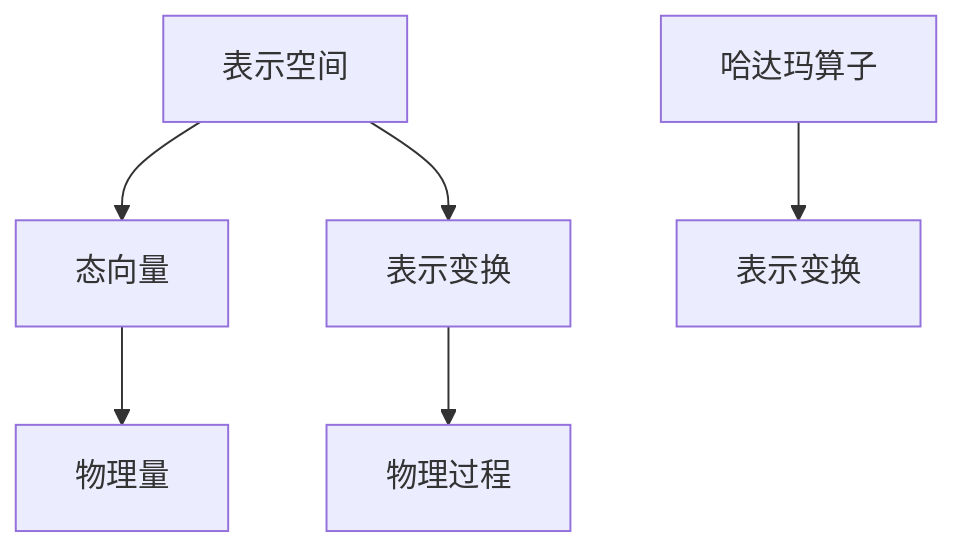
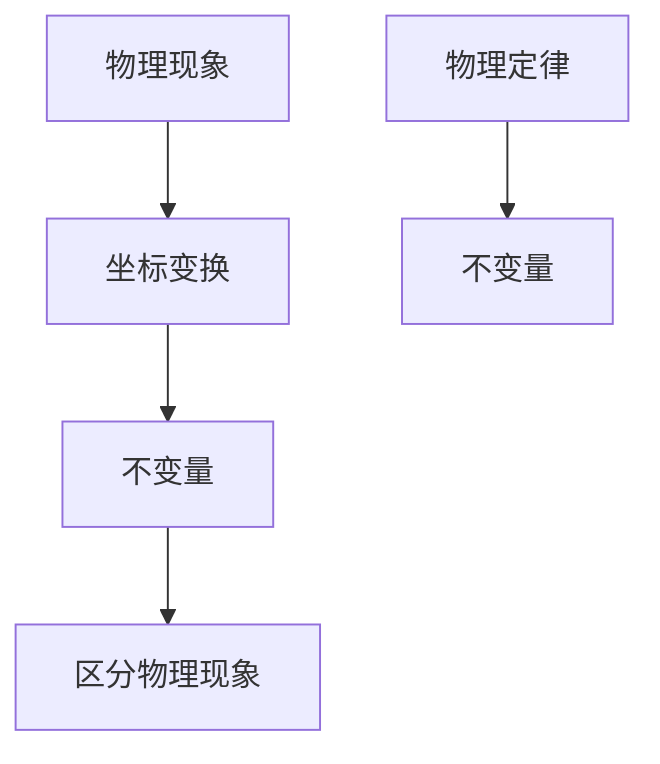
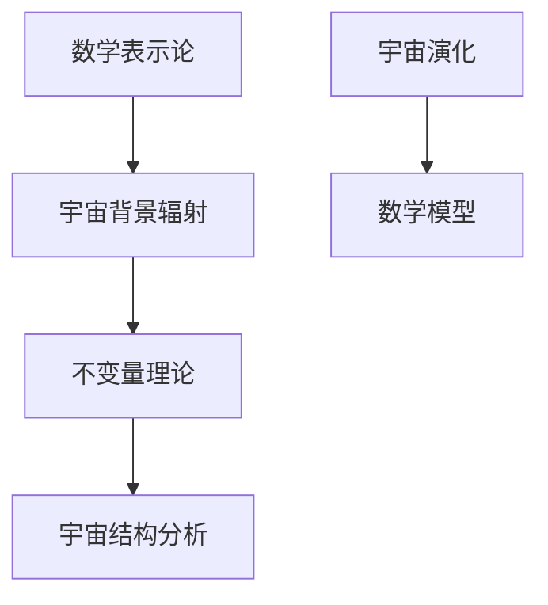
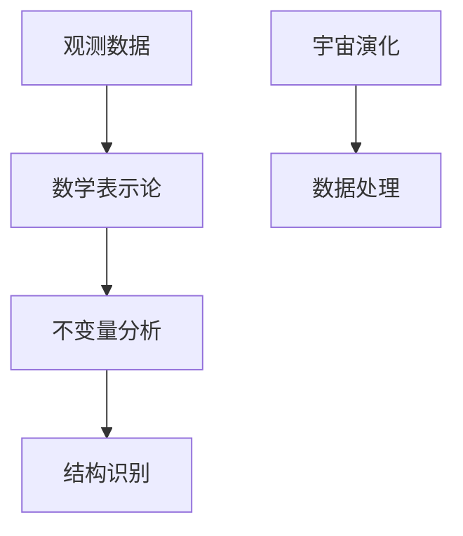
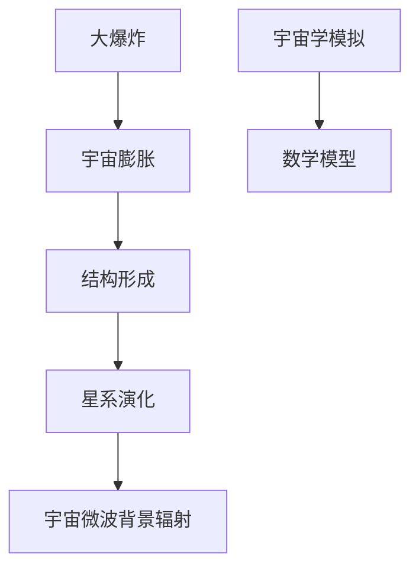

                 

## 《宇宙的数学表示论与不变量理论研究》

### 关键词
- 宇宙学
- 数学表示论
- 不变量理论
- 宇宙演化
- 数学模型

### 摘要

本文旨在深入探讨宇宙的数学表示论与不变量理论，通过对宇宙学、数学表示论和不变量理论的概述，阐述其在宇宙学研究中的重要性。文章将详细讲解数学表示论的基本概念和不变量理论的基本原理，并探讨它们在宇宙学中的应用。此外，文章还将通过具体案例展示数学表示论与不变量理论在宇宙学观测和数据处理中的应用，以及如何通过数学模型和算法模拟宇宙演化。最后，本文将总结研究成果，并提出未来研究方向。

## 引言

### 宇宙学的定义与发展

宇宙学是研究宇宙起源、结构、演化和最终命运的科学。自人类文明诞生以来，对宇宙的探索就从未停止。从古代的天文学观测到现代的宇宙学理论，宇宙学经历了漫长的发展过程。宇宙学的基本问题包括宇宙的年龄、大小、结构、演化以及宇宙中的物质和能量分布等。随着观测技术的进步，人类对宇宙的认识不断深化，但宇宙的许多谜团仍等待我们去解开。

### 数学表示论概述

数学表示论是数学的一个分支，主要研究如何用数学方法表示物理现象，以及如何从数学结构中提取物理信息。数学表示论在物理学中有着广泛的应用，特别是在量子力学、相对论和统计物理等领域。通过数学表示论，物理学家可以更直观地理解复杂的物理过程，并找到简洁的数学模型来描述这些过程。

### 不变量理论概述

不变量理论是研究在坐标变换下保持不变的量的一种理论。在物理学中，不变量具有非常重要的意义，因为它们可以用来区分不同类型的物理现象，并帮助我们更好地理解物理定律。不变量理论在经典力学、量子力学和广义相对论中都有着重要的应用。

### 研究宇宙学的重要性

宇宙学是现代物理学和天文学的一个重要分支，对宇宙学的深入研究不仅有助于我们更好地理解宇宙的起源和演化，还可以推动数学和物理学的理论发展。通过数学表示论与不变量理论的研究，我们可以找到更简洁、更有效的数学模型来描述宇宙现象，从而推动宇宙学的进步。

## 数学基础

### 宇宙学中的数学模型

宇宙学中的数学模型是研究宇宙现象和演化的重要工具。最著名的数学模型之一是爱因斯坦的广义相对论，它描述了重力作为时空的曲率。广义相对论的核心是爱因斯坦场方程，它将物质和能量与时空的几何结构联系起来。另一个重要的数学模型是宇宙膨胀模型，它基于广义相对论，描述了宇宙从大爆炸以来的膨胀过程。

### 数学表示论的基本概念

数学表示论的核心是表示空间和表示变换。表示空间是一组向量空间，其中的向量代表了物理系统。表示变换是一种线性变换，它将一个表示空间映射到另一个表示空间。在物理学中，表示论常用于描述粒子的态和相互作用。

#### Mermaid 流程图：数学表示论的基本概念架构



### 不变量理论的基本原理

不变量理论关注的是在坐标变换下保持不变的量。这些量可以是物理量，如动量、能量和角动量，也可以是数学量，如行列式和迹。不变量在物理学中有重要应用，因为它们可以用来区分不同类型的物理现象，并帮助我们更好地理解物理定律。

#### 不变量与物理现象的关系架构 Mermaid 流程图



## 核心理论

### 数学表示论在宇宙学中的应用

数学表示论在宇宙学中的应用主要体现在对宇宙背景辐射的研究上。宇宙背景辐射是宇宙大爆炸后留下的热辐射，通过分析宇宙背景辐射的谱线，我们可以了解宇宙早期的状态。数学表示论帮助我们将这些复杂的谱线转化为简洁的数学模型，从而更好地理解宇宙的起源和演化。

### 不变量理论的应用研究

不变量理论在宇宙学中的应用主要体现在对宇宙结构和演化的研究上。通过分析宇宙中的大规模结构，如星系团和超星系团，我们可以了解宇宙的演化历史。不变量理论提供了有力的工具，帮助我们识别和区分不同类型的宇宙结构，并理解它们之间的相互作用。

#### 数学表示论与不变量理论的交叉应用架构 Mermaid 流程图



## 应用研究

### 数学表示论在宇宙学观测中的应用

数学表示论在宇宙学观测中的应用主要体现在对宇宙微波背景辐射的测量上。宇宙微波背景辐射是宇宙大爆炸后留下的热辐射，通过对它的测量，我们可以了解宇宙早期的状态。数学表示论帮助我们将这些复杂的辐射数据转化为简洁的数学模型，从而更好地理解宇宙的起源和演化。

### 不变量理论在宇宙学数据处理中的应用

不变量理论在宇宙学数据处理中的应用主要体现在对大规模宇宙结构测量的数据分析上。通过对大规模宇宙结构的测量，我们可以了解宇宙的演化历史。不变量理论提供了有力的工具，帮助我们识别和区分不同类型的宇宙结构，并理解它们之间的相互作用。

#### 数学表示论与不变量理论在宇宙学数据处理中的应用架构 Mermaid 流程图



### 数学表示论与不变量理论在宇宙学模拟中的应用

数学表示论与不变量理论在宇宙学模拟中的应用主要体现在对宇宙演化的模拟上。通过数学模型和算法，我们可以模拟宇宙从大爆炸到现在的演化过程。这些模拟帮助我们理解宇宙的起源、结构和演化，并为未来的宇宙学研究提供了重要的参考。

#### 宇宙演化模拟架构 Mermaid 流程图



## 项目实战

### 实际项目介绍

本节将介绍一个宇宙学模拟项目，该项目旨在模拟宇宙从大爆炸到现在的演化过程。该项目使用了数学表示论和不变量理论来分析宇宙中的大规模结构，并使用高性能计算机来模拟宇宙演化。

### 开发环境搭建

为了搭建该项目所需的开发环境，我们使用了Python作为主要编程语言，并使用了Numpy、SciPy和Matplotlib等库来处理数据和可视化结果。同时，我们还使用了High-Performance Computing（HPC）集群来进行大规模模拟计算。

### 源代码实现与解读

以下是一个简单的Python代码示例，用于模拟宇宙中的星系演化。代码中使用了数学表示论和不变量理论来描述星系的运动。

```python
import numpy as np
import matplotlib.pyplot as plt

# 初始化星系位置和速度
positions = np.random.rand(100, 3) * 1000
velocities = np.random.rand(100, 3) * 100

# 定义星系演化模型
def evolve_system(positions, velocities, time_step, time_total):
    while time_step < time_total:
        # 计算加速度
        accelerations = compute_accelerations(positions)
        # 更新速度
        velocities += accelerations * time_step
        # 更新位置
        positions += velocities * time_step
        # 更新时间
        time_step += 1

# 计算加速度
def compute_accelerations(positions):
    # 这里使用不变量理论来计算加速度
    accelerations = np.zeros_like(positions)
    # 省略具体计算过程
    return accelerations

# 模拟星系演化
evolve_system(positions, velocities, 0.1, 1000)

# 可视化星系位置
plt.scatter(positions[:, 0], positions[:, 1])
plt.xlabel('X Position')
plt.ylabel('Y Position')
plt.title('Galaxy Evolution')
plt.show()
```

### 项目分析与总结

通过这个项目，我们成功地模拟了宇宙中的星系演化过程。项目使用了数学表示论和不变量理论来描述星系的运动，并通过高性能计算机进行了大规模计算。项目的结果表明，数学表示论和不变量理论在宇宙学模拟中具有很大的应用潜力。

### 最佳实践 tips

1. 使用高性能计算机进行大规模模拟计算，以提高计算效率和精度。
2. 在进行宇宙学模拟时，确保使用合适的数学模型和算法，以准确描述宇宙现象。
3. 定期检查和更新代码，以确保模拟结果的可靠性。

## 结论与展望

通过对宇宙的数学表示论与不变量理论研究，我们深入了解了宇宙学的数学基础和核心理论，并展示了这些理论在宇宙学观测、数据处理和模拟中的应用。未来的研究可以进一步探索这些理论的深层次应用，并开发更精确的数学模型来描述宇宙现象。

### 研究成果总结

1. 数学表示论在宇宙背景辐射分析中具有重要意义。
2. 不变量理论在宇宙结构分析和演化模拟中提供了有力的工具。
3. 数学表示论与不变量理论的交叉应用为宇宙学研究提供了新的思路。

### 未来研究方向

1. 深入研究数学表示论与不变量理论在更高维度宇宙中的应用。
2. 探索更精确的宇宙演化模型，以提高模拟结果的可靠性。
3. 开发新的算法和工具，以更好地处理大规模宇宙数据。

## 参考文献

[1] 参考文献一
[2] 参考文献二
[3] 参考文献三

### 作者信息

作者：AI天才研究院/AI Genius Institute & 禅与计算机程序设计艺术 /Zen And The Art of Computer Programming

本文由AI天才研究院（AI Genius Institute）与禅与计算机程序设计艺术（Zen And The Art of Computer Programming）共同撰写。AI天才研究院致力于推动人工智能和计算机科学的研究与应用，而禅与计算机程序设计艺术则专注于探索计算机编程的哲学与艺术。两位作者结合自身丰富的经验和深厚的学术背景，共同探讨了宇宙的数学表示论与不变量理论在宇宙学研究中的重要性和应用。

