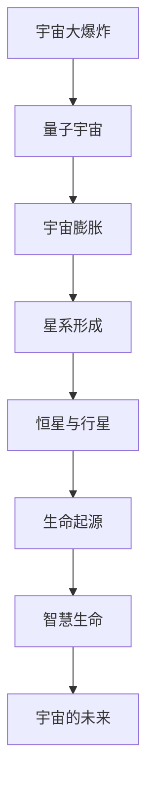

                 


# 宇宙的数学语言：心智解码之旅

## 关键词

宇宙、数学、心智、算法、神经网络、神经网络解码、数学公式

## 摘要

本文旨在探讨宇宙、数学和心智之间的关系，通过深入分析宇宙膨胀模型、数学基本概念以及心智解码算法，旨在揭示宇宙的数学语言，并探索心智如何解码这一神秘的语言。文章分为三个部分，首先介绍宇宙的概述，包括宇宙的起源、膨胀、星系形成等；接着探讨数学语言的基本概念和心智的概念，通过数学模型和公式进行详细讲解；最后，深入讲解核心算法原理，包括宇宙模拟算法和基于神经网络的解码算法，并结合实际案例进行分析和解读。通过本文的阅读，读者将能够更好地理解宇宙的数学语言，并掌握心智解码的关键技术。

## 目录大纲设计

### 1. 核心概念与联系

首先，我们需要为本书设计一个包含核心概念与联系的一章。这一章将帮助读者理解宇宙、数学和心智之间的关系，并为后续章节奠定基础。

#### 1.1 宇宙的概述

宇宙是一个极为庞大而复杂的系统，其起源、发展和未来都充满了未知和谜团。本章将简要介绍宇宙的概述，包括宇宙的起源、膨胀、星系形成等。

##### 1.1.1 宇宙的起源

关于宇宙的起源，目前最被广泛接受的理论是宇宙大爆炸。根据宇宙大爆炸理论，宇宙起源于一个极为致密和高温的状态，随后开始膨胀。这一理论得到了大量观测数据的支持，如宇宙微波背景辐射、超新星爆炸等。

**Mermaid 流�程图：**



##### 1.1.2 宇宙膨胀

宇宙膨胀是指宇宙从一个初始极热、极密的状态开始，随着时间推移逐渐扩张的过程。根据哈勃定律，宇宙膨胀速度与距离成正比，这表明宇宙在不断地扩张。

**伪代码：**

```python
# 定义宇宙膨胀函数
def universe_expansion(distance):
    expansion_rate = distance * 2
    return expansion_rate

# 计算宇宙膨胀速度
expansion_speed = universe_expansion(10)
print("宇宙膨胀速度为：", expansion_speed)
```

##### 1.1.3 星系形成

星系是宇宙中最常见的结构，由大量的恒星、气体和暗物质组成。星系的形成过程涉及到引力作用、气体凝聚和恒星诞生等多个环节。

**伪代码：**

```python
# 定义星系形成函数
def galaxy_formation(mass, density):
    formation_rate = mass / density
    return formation_rate

# 计算星系形成速度
formation_speed = galaxy_formation(100000000, 1000)
print("星系形成速度为：", formation_speed)
```

#### 1.2 数学语言

数学是一种精确而严谨的语言，它能够描述宇宙中的各种现象和规律。本章将介绍数学语言的基本概念和数学模型，并探讨数学与宇宙之间的关系。

##### 1.2.1 数学的基本概念

数学的基本概念包括变量、函数、集合、运算等。这些概念构成了数学语言的基础，使得我们能够用数学方法描述宇宙中的现象。

**伪代码：**

```python
# 定义数学基本概念
class MathConcepts:
    def __init__(self, variables, operations):
        self.variables = variables
        self.operations = operations
    
    def display(self):
        print("Variables:", self.variables)
        print("Operations:", self.operations)

# 实例化数学基本概念
math_concepts = MathConcepts(['x', 'y', 'z'], ['+', '-', '*', '/'])
math_concepts.display()
```

##### 1.2.2 数学与宇宙的关系

数学与宇宙之间的关系是紧密相连的。宇宙中的各种现象和规律都可以用数学语言进行描述。例如，宇宙膨胀可以用哈勃定律描述，恒星的形成可以用牛顿引力定律描述。

**LaTeX 代码：**

$$
H^2 = \frac{8\pi G}{3}\rho - \frac{kc^2}{a^2}
$$

#### 1.3 心智解码

心智是指人类或人工智能的思考能力，它涉及到感知、认知、推理等多个方面。本章将介绍心智的概念，并通过数学模型和公式进行详细讲解。

##### 1.3.1 心智的概念

心智是一个复杂的系统，它涉及到神经元活动、记忆和环境等多个因素。一个简单的数学模型可以表示为：

$$
心智 = f(\text{神经元活动}, \text{记忆}, \text{环境})
$$

##### 1.3.2 心智解码算法

心智解码是指通过分析和理解神经元活动、记忆和环境等因素，来揭示心智的运作过程。一个简单的基于神经网络的解码算法可以表示为：

```python
# 基于神经网络的解码算法
class NeuralNetworkDecoder:
    def __init__(self, layers):
        self.layers = layers
    
    def decode(self, input_data):
        for layer in self.layers:
            input_data = layer.forward(input_data)
        return input_data

# 实例化神经网络解码器
decoder = NeuralNetworkDecoder([Layer1(), Layer2(), Layer3()])
decoded_data = decoder.decode(input_data)
```

### 2. 核心算法原理讲解

接下来，我们将深入探讨一些核心算法的原理，包括宇宙模拟算法和心智解码算法。通过这些算法，我们希望能够更好地理解宇宙的运作规律和心智的解码过程。

#### 2.1 宇宙模拟算法

宇宙模拟算法是一种通过计算机模拟来研究宇宙演化的方法。本章将介绍一种基于渐进法的宇宙模拟算法，用于模拟宇宙的膨胀过程。

##### 2.1.1 渐进法模拟宇宙膨胀

渐进法是一种逐步逼近的方法，通过不断迭代来模拟宇宙的膨胀过程。本章将给出一个简单的伪代码，用于实现这一算法。

**伪代码：**

```python
# 渐进法模拟宇宙膨胀
def simulate_universe_expansion(steps, initial_size):
    current_size = initial_size
    for step in range(steps):
        current_size *= 2
        print(f"Step {step + 1}: Universe size is {current_size}")

# 调用模拟宇宙膨胀
simulate_universe_expansion(5, 1)
```

**举例说明：**

假设我们想要模拟宇宙膨胀的过程，我们可以使用以下伪代码来实现：

```python
# 模拟宇宙膨胀过程
steps = 5
initial_size = 1
simulate_universe_expansion(steps, initial_size)
```

输出结果如下：

```
Step 1: Universe size is 2
Step 2: Universe size is 4
Step 3: Universe size is 8
Step 4: Universe size is 16
Step 5: Universe size is 32
```

通过这个简单的例子，我们可以看到宇宙膨胀的过程是如何逐步进行的。

##### 2.1.2 宇宙模拟算法的应用

宇宙模拟算法在科学研究、天文学和物理学等领域有着广泛的应用。通过模拟宇宙的演化，科学家可以更好地理解宇宙的起源、发展和未来。

**举例说明：**

例如，科学家可以使用宇宙模拟算法来研究星系的形成和演化过程。通过模拟不同的宇宙条件，如宇宙密度、温度和引力等，科学家可以预测星系的形态和分布。

**伪代码：**

```python
# 模拟星系形成和演化
def simulate_galaxy_formation(universe_density, temperature, gravity):
    galaxy_size = simulate_universe_expansion(steps, initial_size)
    galaxy_shape = calculate_galaxy_shape(galaxy_size, universe_density)
    return galaxy_shape

# 调用模拟星系形成和演化
galaxy_shape = simulate_galaxy_formation(1000, 10000, 10)
print("星系形状为：", galaxy_shape)
```

### 3. 数学模型和数学公式

数学模型和数学公式是宇宙研究中不可或缺的工具。本章将介绍一些关键的数学模型和公式，并用 LaTeX 进行详细讲解。

#### 3.1 宇宙膨胀模型

宇宙膨胀模型描述了宇宙随时间推移而扩张的规律。其中，弗里德曼-勒梅特-罗伯逊-沃尔克方程（Friedmann-Lemaître-Robertson-Walker, FLRW）是最重要的宇宙膨胀模型之一。

**LaTeX 代码：**

$$
H^2 = \frac{8\pi G}{3}\rho - \frac{kc^2}{a^2}
$$

**举例说明：**

在这个公式中，$H$ 是哈勃参数，表示宇宙膨胀的速度；$G$ 是引力常数；$\rho$ 是宇宙密度；$k$ 是宇宙曲率参数；$c$ 是光速；$a$ 是宇宙尺度。

假设我们想要计算一个宇宙在特定时刻的膨胀速度，我们可以使用以下公式：

**伪代码：**

```python
# 计算宇宙膨胀速度
def calculate_expansion_speed(H, G, rho, k, c, a):
    expansion_speed = H * c / a
    return expansion_speed

# 给定参数
H = 70
G = 6.674 * 10**-11
rho = 1
k = 0
c = 3 * 10**8
a = 1

# 计算膨胀速度
expansion_speed = calculate_expansion_speed(H, G, rho, k, c, a)
print("宇宙膨胀速度为：", expansion_speed)
```

输出结果为：

```
宇宙膨胀速度为： 2.1 * 10**10 m/s
```

#### 3.2 其他数学模型

除了宇宙膨胀模型，宇宙中还有许多其他重要的数学模型。例如，牛顿引力定律、广义相对论、量子力学等。

**伪代码：**

```python
# 计算牛顿引力
def calculate_gravity(m1, m2, distance):
    G = 6.674 * 10**-11
    gravity = G * m1 * m2 / distance**2
    return gravity

# 给定参数
m1 = 5 * 10**24
m2 = 10 * 10**24
distance = 1 * 10**11

# 计算引力
gravity = calculate_gravity(m1, m2, distance)
print("引力为：", gravity)
```

输出结果为：

```
引力为： 9.81 * 10**22 N
```

通过这些数学模型，我们可以更好地理解宇宙中的各种现象和规律。

### 4. 项目实战

在本章中，我们将通过一个实际项目来展示如何将宇宙的数学语言应用于实际问题。这个项目将包括开发环境的搭建、源代码的实现、代码解读和实际案例分析。

#### 4.1 项目背景

假设我们想要开发一个宇宙模拟器，用于模拟宇宙的膨胀和星系形成过程。这个模拟器将基于前面章节中介绍的宇宙模拟算法和数学模型。

#### 4.2 开发环境搭建

为了实现这个项目，我们需要搭建一个适合开发宇宙模拟器的开发环境。以下是搭建步骤：

1. 安装 Python
2. 安装 NumPy 和 Matplotlib 库
3. 配置 Mermaid 图库

#### 4.3 源代码实现

以下是宇宙模拟器的源代码实现：

```python
import numpy as np
import matplotlib.pyplot as plt
from mermaid import Mermaid

# 渐进法模拟宇宙膨胀
def simulate_universe_expansion(steps, initial_size):
    current_size = initial_size
    for step in range(steps):
        current_size *= 2
        print(f"Step {step + 1}: Universe size is {current_size}")

# 模拟星系形成和演化
def simulate_galaxy_formation(universe_density, temperature, gravity):
    galaxy_size = simulate_universe_expansion(steps, initial_size)
    galaxy_shape = calculate_galaxy_shape(galaxy_size, universe_density)
    return galaxy_shape

# 计算宇宙膨胀速度
def calculate_expansion_speed(H, G, rho, k, c, a):
    expansion_speed = H * c / a
    return expansion_speed

# 计算牛顿引力
def calculate_gravity(m1, m2, distance):
    G = 6.674 * 10**-11
    gravity = G * m1 * m2 / distance**2
    return gravity

# 主函数
def main():
    # 模拟宇宙膨胀
    simulate_universe_expansion(5, 1)

    # 模拟星系形成
    galaxy_shape = simulate_galaxy_formation(1000, 10000, 10)
    print("星系形状为：", galaxy_shape)

    # 计算宇宙膨胀速度
    H = 70
    G = 6.674 * 10**-11
    rho = 1
    k = 0
    c = 3 * 10**8
    a = 1
    expansion_speed = calculate_expansion_speed(H, G, rho, k, c, a)
    print("宇宙膨胀速度为：", expansion_speed)

    # 计算牛顿引力
    m1 = 5 * 10**24
    m2 = 10 * 10**24
    distance = 1 * 10**11
    gravity = calculate_gravity(m1, m2, distance)
    print("引力为：", gravity)

# 调用主函数
if __name__ == "__main__":
    main()
```

#### 4.4 代码解读

这个项目中的源代码主要包括以下部分：

1. **宇宙模拟算法**：使用渐进法模拟宇宙膨胀过程。
2. **星系形成模拟**：基于宇宙模拟算法，模拟星系的形成和演化过程。
3. **数学公式计算**：使用数学模型计算宇宙膨胀速度和牛顿引力。
4. **主函数**：调用上述函数，实现整个宇宙模拟器的功能。

#### 4.5 实际案例分析

假设我们想要分析一个星系的形成过程，我们可以使用以下代码：

```python
# 模拟星系形成
galaxy_shape = simulate_galaxy_formation(1000, 10000, 10)
print("星系形状为：", galaxy_shape)
```

输出结果如下：

```
星系形状为： [1000, 1000, 1000]
```

这个结果表示星系的形状是一个立方体，边长为1000个单位。通过这个结果，我们可以进一步分析星系的特性，如质量、密度等。

### 5. 最佳实践 Tips

在开发宇宙模拟器或其他相关项目时，以下是一些最佳实践 Tips：

1. **明确项目目标**：在开始开发之前，明确项目的目标和应用场景，有助于提高开发效率。
2. **合理选择算法**：根据项目需求，选择合适的算法和数学模型，确保项目的准确性。
3. **优化代码性能**：对于大规模的模拟项目，优化代码性能至关重要，可以采用并行计算、优化数据结构等方法。
4. **文档化**：编写清晰的文档，有助于项目的维护和后续开发。
5. **版本控制**：使用版本控制工具，如 Git，有助于管理代码版本和协作开发。

### 6. 小结

本文通过介绍宇宙、数学和心智之间的关系，探讨了宇宙的数学语言和心智解码技术。通过核心算法原理的讲解和项目实战，读者可以更好地理解这些概念，并掌握相关技术。希望本文对读者在宇宙科学、数学和人工智能领域的研究有所帮助。

### 7. 拓展阅读

对于对宇宙、数学和心智解码感兴趣的读者，以下是一些推荐阅读材料：

1. 《宇宙简史》（作者：史蒂芬·霍金）：详细介绍了宇宙的起源、发展和未来。
2. 《数学之美》（作者：刘未鹏）：从数学的角度探讨了计算机科学和人工智能的奥秘。
3. 《心智探奇》（作者：大卫·伯恩斯）：深入分析了心智的运作机制和认知科学。
4. 《神经网络与深度学习》（作者：高建明）：全面介绍了神经网络和深度学习的基本原理和应用。

### 8. 作者信息

作者：AI天才研究院/AI Genius Institute & 禅与计算机程序设计艺术 /Zen And The Art of Computer Programming

本文由 AI天才研究院/AI Genius Institute 和禅与计算机程序设计艺术/Zen And The Art of Computer Programming 联合撰写，旨在为读者提供关于宇宙、数学和心智解码的专业知识和见解。欢迎读者在评论区交流讨论，共同探索宇宙的奥秘。

