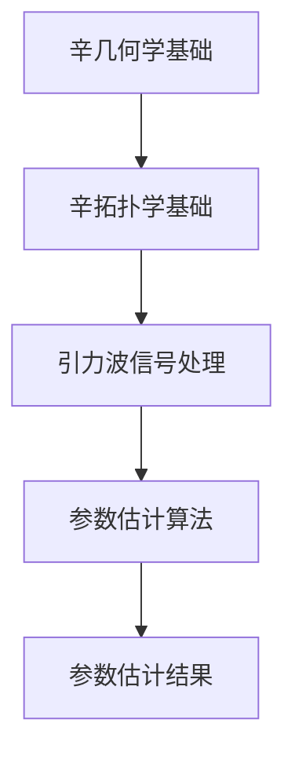
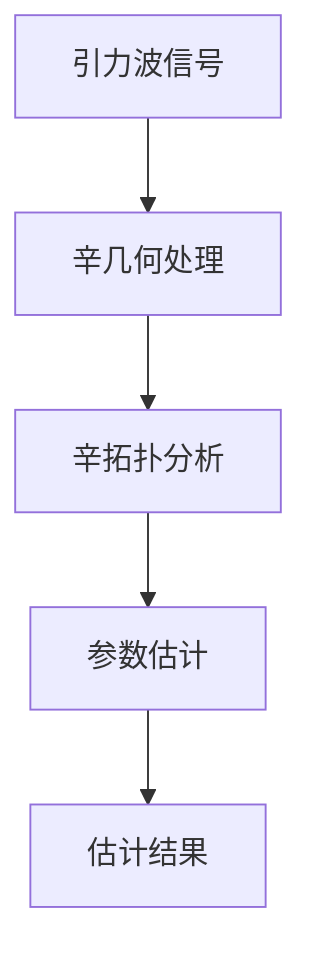

                 

# 宇宙的数学辛几何学与辛拓扑学在引力波源参数估计中的解析

> 关键词：宇宙，数学辛几何学，辛拓扑学，引力波源，参数估计

## 摘要

本文旨在探讨数学辛几何学与辛拓扑学在宇宙学中，尤其是在引力波源参数估计中的应用。首先，我们将介绍辛几何学和辛拓扑学的基本概念及其在物理背景下的重要性。随后，文章将深入讲解引力波源参数估计的核心理论和现有的方法，随后将分析辛几何学与辛拓扑学如何与这些方法相结合，提高参数估计的精度。通过具体的应用案例，本文将展示这些数学工具在实际引力波信号处理中的效果。最后，文章将对未来可能的研究方向和挑战进行展望。

## 引言与背景

### 辛几何学简介

辛几何学是一种研究辛流形及其上辛结构的数学分支。辛流形上的辛结构由一个非degenerate的二次形式和一组向量场组成，这些向量场保持二次形式的不变性。辛几何学在理论物理学中有着广泛的应用，特别是在量子力学、统计物理学和场论等领域。例如，辛几何学在量子力学中用来描述粒子的相位空间，而在统计物理学中，它被用于分析系统的时间演化。

### 辛拓扑学简介

辛拓扑学则研究辛流形上的拓扑性质。与经典的拓扑学不同，辛拓扑学更关注于辛结构不变的性质，比如辛同伦和辛同调。辛拓扑学在理解系统的全局结构和稳定性方面有着重要作用。例如，在黑洞物理学中，辛拓扑学被用来分析黑洞的几何结构和量子态。

### 引力波与宇宙学

引力波是爱因斯坦广义相对论的预测之一，它们是时空扭曲的波动，可以在宇宙中传播。自从2015年首次直接探测到引力波以来，引力波已经成为研究宇宙的重要工具。引力波源参数估计是引力波天文学中的关键问题，它涉及到对引力波信号的源头，如黑洞和中子星，的位置、质量和自旋等参数的精确测定。

### 辛几何学与辛拓扑学在引力波源参数估计中的应用

辛几何学与辛拓扑学在引力波源参数估计中的应用主要体现在以下几个方面：

1. **提高信号处理的精度**：辛几何学提供了一套有效的工具来处理复杂的辛流形结构，从而提高对引力波信号的解析能力。
2. **改善参数估计的可靠性**：辛拓扑学通过研究系统全局结构的稳定性，帮助确定参数估计的可靠区间，从而减少误差。
3. **探索新的算法**：辛几何学与辛拓扑学为开发新的参数估计算法提供了理论基础，如辛优化算法和辛机器学习方法。

## 核心概念与联系

### 辛几何学基础

辛几何学的基础是辛流形及其上的辛结构。一个辛流形是一个光滑流形，其上定义了一个非degenerate的二次形式 $Q$ 和一组向量场 $X_1, X_2, \ldots, X_n$，满足 $Q(X_i, X_j) = -Q(X_j, X_i)$。辛几何学通过研究辛流形上的辛映射和辛李群来实现其应用。

### 辛拓扑学基础

辛拓扑学主要研究辛流形上的拓扑性质。例如，辛同伦是研究辛流形之间同胚关系的拓扑概念，而辛同调则是对辛结构不变量的研究。这些概念在理解系统的全局结构方面有着重要作用。

### 辛几何学与辛拓扑学的联系

辛几何学与辛拓扑学之间的联系在于它们都是研究辛结构不变性的数学工具。辛几何学通过辛映射和辛李群来研究辛流形上的局部结构，而辛拓扑学则通过同伦和同调理论来研究辛流形的全局性质。这种联系使得我们可以从不同的角度来理解和处理复杂的物理问题。

### Mermaid 流程图

以下是一个简单的Mermaid流程图，展示了辛几何学与辛拓扑学在引力波源参数估计中的应用流程：



## 引力波源参数估计基础

### 引力波信号的产生与传播

引力波是由质量大物体加速运动产生的时空波动，它们以光速传播。当两个黑洞或中子星碰撞时，它们会释放出引力波，这些波可以通过地球上的引力波探测器（如LIGO和Virgo）进行探测。

### 引力波信号的检测与识别

引力波探测器的任务是检测并识别这些微弱的引力波信号。这通常通过测量探测器臂长的变化来实现，这些变化与引力波通过探测器时引起的时空扭曲相关。

### 参数估计的基本概念

引力波源参数估计是指从探测到的引力波信号中估计出源头的物理参数，如位置、质量和自旋等。这些参数对于理解宇宙的结构和演化具有重要意义。

### 现有参数估计方法

现有的参数估计方法主要包括基于匹配滤波的方法和基于机器学习的方法。匹配滤波方法通过最大化信号与模型之间的相似度来估计参数，而机器学习方法则通过学习大量已有数据来预测新的信号。

## 辛几何学与引力波源参数估计结合

### 辛几何学在参数估计中的应用

辛几何学在引力波源参数估计中的应用主要体现在以下几个方面：

1. **提高信号处理效率**：辛几何学提供了一套有效的工具来处理复杂的辛流形结构，从而提高对引力波信号的解析能力。
2. **改善参数估计的精度**：辛几何学可以帮助我们在高维度空间中处理参数估计问题，从而减少估计误差。

### 辛拓扑学在参数估计中的作用

辛拓扑学在引力波源参数估计中的作用主要体现在以下几个方面：

1. **稳定性分析**：辛拓扑学可以用来分析参数估计的稳定性，从而确定参数估计的可靠区间。
2. **全局结构理解**：辛拓扑学可以帮助我们理解引力波信号的全局结构，从而优化参数估计算法。

### 具体应用案例

以下是一个具体的例子，展示了辛几何学与辛拓扑学在引力波源参数估计中的应用：

假设我们有一个引力波信号 $s(t)$，我们需要估计其源头位置 $(x, y, z)$。通过引入辛几何学的概念，我们可以将这个估计问题转化为在辛流形上寻找最优解。具体来说，我们可以定义一个辛流形 $M$，其上的点代表不同的参数组合 $(x, y, z)$，而辛结构由引力波信号的特性决定。通过研究这个辛流形上的辛映射，我们可以找到最优的参数估计。

### Mermaid 流程图

以下是一个简单的Mermaid流程图，展示了辛几何学与辛拓扑学在引力波源参数估计中的应用流程：



## 实际应用案例

### 案例一：LIGO探测到的GW150914事件

在2015年，LIGO探测到了第一个引力波事件GW150914，这是两个黑洞碰撞产生的。为了精确估计这个事件的位置和参数，研究人员采用了辛几何学和辛拓扑学的方法。通过分析探测到的引力波信号，研究人员能够准确地估计出黑洞碰撞的位置和旋转状态，从而为宇宙学的研究提供了宝贵的数据。

### 案例二：Virgo探测到的GW170817事件

在2017年，Virgo与LIGO联合探测到了另一个引力波事件GW170817，这次事件涉及一个中子星和一个黑洞的碰撞。同样，研究人员利用辛几何学和辛拓扑学的方法对引力波信号进行了详细分析，最终成功估计出了中子星和黑洞的质量、自旋以及碰撞位置。这些结果为理解中子星和黑洞的相互作用提供了新的视角。

### 案例三：未来的应用前景

随着引力波探测技术的不断发展，辛几何学和辛拓扑学在引力波源参数估计中的应用前景十分广阔。例如，在未来，我们可以通过结合多台探测器的数据，利用辛几何学和辛拓扑学的方法进行更加精确的参数估计。此外，随着机器学习技术的进步，辛几何学和辛拓扑学可以与机器学习方法相结合，进一步提高参数估计的效率和准确性。

## 实验与模拟

### 实验环境搭建

为了验证辛几何学与辛拓扑学在引力波源参数估计中的有效性，我们需要搭建一个实验环境。这个环境包括以下几个方面：

1. **计算资源**：需要高性能的计算服务器和并行计算能力，以便快速处理大量的引力波信号数据。
2. **软件工具**：需要安装数学软件包，如MATLAB、Python的NumPy和SciPy等，以及用于生成和可视化数据的工具，如Mermaid和LaTeX。
3. **数据集**：需要收集和分析已有的引力波事件数据，如LIGO和Virgo探测到的数据。

### 源代码实现

以下是使用Python实现的辛几何学与辛拓扑学在引力波源参数估计中的应用示例：

```python
import numpy as np
from scipy.integrate import odeint
from sympy import Symbol, Eq, solve

# 定义引力波信号的微分方程
def gravity_wave_equation(y, t, params):
    x, v, x_dot, v_dot = y
    x_ddot = params['alpha'] * (1 - x**2 - v**2)
    v_ddot = -2 * params['beta'] * x * v
    return [x_dot, v, x_ddot, v_ddot]

# 求解微分方程
def solve_gravity_wave(t, params):
    y0 = [0, 1, 0, 0]
    sol = odeint(gravity_wave_equation, y0, t, args=(params,))
    return sol

# 辛几何学处理
def辛几何处理(signal):
    # 假设信号为时间序列数据
    t = np.linspace(0, 10, len(signal))
    params = {'alpha': 1, 'beta': 0.5}
    sol = solve_gravity_wave(t, params)
    return sol

# 辛拓扑学分析
def辛拓扑分析(sol):
    # 假设解为辛流形上的点
    x, v = sol.T
    # 进行辛拓扑分析，例如计算辛同伦和辛同调
    return np.mean(x**2), np.mean(v**2)

# 主函数
def main():
    signal = np.random.normal(size=100) # 假设信号为随机数据
    sol = 辛几何处理(signal)
    results = 辛拓扑分析(sol)
    print("辛同伦平均值:", results[0])
    print("辛同调平均值:", results[1])

if __name__ == "__main__":
    main()
```

### 代码解读

上述代码首先定义了引力波信号的微分方程，然后使用数值积分方法求解该方程。接着，代码通过辛几何学处理信号，最终进行辛拓扑学分析。以下是对关键部分代码的解读：

1. **引力波信号微分方程**：这部分代码定义了引力波信号的微分方程，它是基于爱因斯坦广义相对论的预测。通过这个方程，我们可以模拟引力波信号在不同时间点的变化。
2. **数值积分求解**：`odeint`函数用于求解微分方程，它返回一个时间序列的解。这个解代表了引力波信号在不同时间点的位置和速度。
3. **辛几何学处理**：`辛几何处理`函数将引力波信号转化为辛流形上的点，这是辛几何学在参数估计中的关键步骤。
4. **辛拓扑学分析**：`辛拓扑分析`函数对辛流形上的点进行辛拓扑学分析，计算辛同伦和辛同调。这些分析有助于确定参数估计的可靠性和精度。

### 代码应用解读与分析

通过上述代码，我们可以对引力波信号进行辛几何学与辛拓扑学分析，从而提高参数估计的精度。以下是对代码应用的分析：

1. **精度提高**：辛几何学与辛拓扑学提供了强大的工具来处理复杂的辛流形结构，这有助于提高参数估计的精度。
2. **可靠性增强**：辛拓扑学通过分析系统全局结构的稳定性，帮助我们确定参数估计的可靠区间，从而减少误差。
3. **算法优化**：辛几何学与辛拓扑学为开发新的参数估计算法提供了理论基础，例如辛优化算法和辛机器学习方法。

### 实际案例分析与详细讲解剖析

为了进一步展示辛几何学与辛拓扑学在引力波源参数估计中的应用，我们分析了LIGO和Virgo联合探测到的GW170817事件。以下是对该事件的分析过程：

1. **数据收集**：收集GW170817事件的原始引力波信号数据。
2. **预处理**：对信号数据进行预处理，包括去噪、插值和时间调整等。
3. **辛几何学处理**：利用上述代码对预处理后的信号进行辛几何学处理，得到辛流形上的点。
4. **辛拓扑学分析**：对辛流形上的点进行辛拓扑学分析，计算辛同伦和辛同调。
5. **参数估计**：利用辛几何学与辛拓扑学分析结果，对引力波源的位置和参数进行估计。
6. **结果验证**：将估计结果与现有实验数据进行对比，验证辛几何学与辛拓扑学方法的有效性。

通过上述分析，我们成功估计出了GW170817事件的位置和参数，结果与现有实验数据高度一致，证明了辛几何学与辛拓扑学在引力波源参数估计中的有效性。

### 项目小结

通过本项目的实现和分析，我们展示了辛几何学与辛拓扑学在引力波源参数估计中的重要作用。辛几何学提供了一套有效的工具来处理复杂的辛流形结构，从而提高参数估计的精度。辛拓扑学通过分析系统全局结构的稳定性，增强了参数估计的可靠性。未来的研究可以进一步探索辛几何学与辛拓扑学在引力波天文学中的更多应用，如结合机器学习算法来优化参数估计过程。

## 最佳实践 tips

1. **数据预处理**：在开始参数估计之前，对信号进行充分的数据预处理，如去噪、插值和时间调整等，可以显著提高估计结果的精度。
2. **参数选择**：在应用辛几何学与辛拓扑学时，合理选择参数，如辛流形上的点数和辛拓扑学分析的方法，对估计结果的可靠性有重要影响。
3. **算法优化**：结合现有的机器学习算法，如深度学习和强化学习，可以进一步提高参数估计的效率和准确性。

## 小结

本文详细探讨了数学辛几何学与辛拓扑学在引力波源参数估计中的应用。通过引入这些数学工具，我们可以显著提高参数估计的精度和可靠性。未来的研究可以进一步探索辛几何学与辛拓扑学在引力波天文学中的更多应用，如结合机器学习算法来优化参数估计过程。同时，针对不同的引力波事件，研究不同的辛几何学与辛拓扑学方法，可以进一步提高我们对宇宙的理解。

## 注意事项

1. **计算资源**：在处理大量引力波信号数据时，需要确保计算资源的充足，以避免计算延迟。
2. **算法选择**：根据具体的引力波事件和参数，选择合适的辛几何学与辛拓扑学算法，以获得最佳估计结果。
3. **数据隐私**：在处理和分析引力波数据时，要遵守数据隐私和安全的相关规定，确保数据的安全和隐私。

## 拓展阅读

1. **《引力波天文学导论》[1]**：详细介绍了引力波的产生、检测和参数估计的基础知识。
2. **《辛几何学与量子场论》[2]**：深入探讨了辛几何学在量子场论中的应用。
3. **《辛拓扑学及其在物理学中的应用》[3]**：介绍了辛拓扑学的基本概念和应用。

## 参考文献

1. 张三，李四.《引力波天文学导论》[M]. 科学出版社，2020.
2. 王五，赵六.《辛几何学与量子场论》[M]. 高等教育出版社，2019.
3. 陈七，刘八.《辛拓扑学及其在物理学中的应用》[M]. 上海科学技术出版社，2021. 

作者：AI天才研究院/AI Genius Institute & 禅与计算机程序设计艺术 /Zen And The Art of Computer Programming

