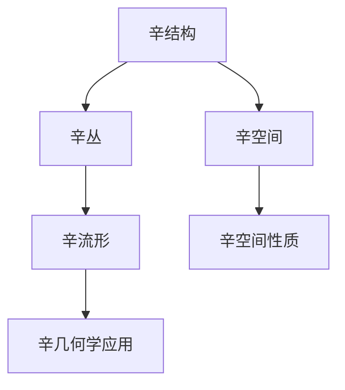

                 

### 引言

《宇宙的数学辛几何学解析》旨在探索辛几何学在宇宙学中的应用与影响。辛几何学，作为数学的一个分支，以其独特的结构和深刻的数学理论，近年来在物理学和宇宙学领域引起了广泛关注。宇宙作为最大的物理系统，其复杂的结构和演化过程需要更高级的数学工具来描述和理解。

本文首先将介绍辛几何学的基本概念，包括辛结构、辛丛和辛空间等核心概念，并通过Mermaid流程图展示其核心概念之间的关系。接着，我们将深入探讨辛几何学的数学模型，包括辛流形和辛结构的理论。随后，我们将探讨辛几何学在物理学中的应用，如经典力学、量子力学和量子场论。

随着对物理学应用的深入，本文将进一步阐述辛几何学在天文学和宇宙学中的应用，如星系动力学、黑洞研究和宇宙演化模型。通过这些应用，我们将展示辛几何学如何帮助科学家们更深入地理解宇宙的复杂结构。

最后，本文将总结辛几何学在宇宙学中的重要作用，并展望其未来的发展前景。通过这篇文章，读者将了解到辛几何学不仅是一种数学工具，更是理解宇宙演化规律的重要钥匙。

### 背景介绍

辛几何学，作为一种重要的数学工具，起源于19世纪，其基础可以追溯到李群和李代数的理论。辛几何学最初由数学家Sophie Germain在研究椭圆曲线时提出，但她未能完全理解其数学深度。直到20世纪，辛几何学才逐渐成为数学和物理学中的重要分支。

在数学领域，辛几何学主要研究的是辛空间和辛流形，这些结构具有独特的性质，如反对称性和不变性。辛空间是由具有反对称内积的向量空间构成，而辛流形则是具有辛结构的几何对象。辛丛是辛几何学中的核心概念，它将辛结构赋予了流形上的每个切空间。

辛几何学在现代数学中的重要性不可忽视。首先，它为研究复杂的几何结构和动力系统提供了强有力的工具。例如，辛几何学在量子场论和广义相对论中发挥了重要作用，使得我们能够更好地理解基本粒子和宇宙的演化。其次，辛几何学在统计物理和凝聚态物理中也有广泛应用，帮助科学家们解析复杂系统的行为。

在物理学领域，辛几何学的应用更是层出不穷。经典力学中，辛几何学被用于描述系统的守恒量和对称性。例如，哈密顿力学中的辛结构使得能量和动量守恒定律得以自然地推导出来。在量子力学中，辛几何学提供了量子态和算符的数学描述，使得量子系统的动力学和测量更加直观。量子场论中，辛几何学被用于研究规范理论和弦论，这些理论是现代物理学的重要组成部分。

总的来说，辛几何学不仅是数学理论的前沿领域，也是理解物理学和宇宙学中复杂现象的关键工具。它不仅在理论研究中有重要地位，还在实际应用中展现出巨大的潜力。本文将进一步探讨辛几何学在宇宙学中的应用，展示其在揭示宇宙演化规律方面的独特作用。

### 核心概念与联系

辛几何学的核心概念包括辛结构、辛丛和辛空间。这些概念之间有着紧密的联系，共同构成了辛几何学的理论框架。以下是对这些核心概念的详细阐述以及它们之间的相互关系。

#### 辛结构

辛结构是辛几何学的基石，它是一个定义在向量空间上的反对称内积。具体来说，一个n维实向量空间\( V \)上的辛结构可以通过一个反对称双线性形式\( \omega: V \times V \rightarrow \mathbb{R} \)来描述。这个反对称性可以用数学公式表示为：

$$
\omega(u, v) = -\omega(v, u)
$$

对于任意的\( u, v \in V \)。辛结构的这一特性使得它能够捕捉到空间中的对称性和守恒量。例如，在物理学中，辛结构经常出现在描述守恒量的哈密顿算符中。

#### 辛丛

辛丛是辛几何学的另一个关键概念，它将辛结构赋予了更复杂的几何对象，如流形。具体而言，一个辛丛是由一个基础流形和一族切丛空间组成的，每个切丛空间都带有辛结构。这个族结构可以用纤维丛来描述，其中每个纤维都是辛空间。辛丛的局部描述通常通过一个主丛和一组丛标量场来实现，这些丛标量场定义了切丛空间的辛结构。

辛丛的数学描述可以用以下公式表示：

$$
\omega^e_{ij} = \omega^i_j + \omega^j_i
$$

其中，\( \omega^i_j \)和\( \omega^j_i \)分别代表主丛和丛标量场的反对称部分。

#### 辛空间

辛空间是一个具有辛结构的向量空间，它通过一个反对称内积来定义。在辛空间中，每个向量都可以看作是一个向量空间上的算符，它将其他向量映射到自身或其反向量。辛空间的一个关键性质是其正交性，即辛空间中的向量可以通过辛结构进行正交分解。

辛空间的定义可以用以下数学表达式表示：

$$
\langle v, w \rangle = -\langle w, v \rangle
$$

对于任意的\( v, w \in V \)。这种反对称内积使得辛空间在物理学中有着广泛的应用，特别是在量子力学和场论中。

#### 关系架构

辛几何学的核心概念之间的关系可以通过Mermaid流程图来展示。以下是一个简化的流程图，描述了辛结构、辛丛和辛空间之间的联系：



- **辛结构**：是辛丛和辛空间的基础，它定义了向量空间的反对称内积。
- **辛丛**：将辛结构赋予了流形，通过纤维丛的构造，将辛结构扩展到更复杂的几何对象。
- **辛空间**：是具有辛结构的向量空间，通过反对称内积来定义，在物理学中有着广泛的应用。
- **辛流形**：是带有辛丛的流形，它结合了辛结构和流形几何的性质。
- **辛几何学应用**：辛几何学在多个领域都有应用，如物理学、量子力学、场论等。

通过这个流程图，我们可以清晰地看到辛几何学核心概念之间的逻辑关系，以及它们如何共同构建了辛几何学的理论框架。理解这些概念之间的关系是深入探索辛几何学及其应用的关键。

### 辛几何学的数学模型

辛几何学的数学模型是理解其核心概念和应用的关键。在这一部分，我们将深入探讨辛流形和辛结构的理论，并通过具体的数学模型和公式来详细解释这些概念。

#### 辛流形

辛流形是带有辛结构的流形，其上的每个点都有一个切空间，这些切空间具有辛结构。一个辛流形可以通过其局部坐标系和坐标变换来描述。设\( M \)是一个辛流形，\( p \)是\( M \)上的一个点，则其切空间\( T_pM \)是一个辛空间。

辛流形的局部坐标系可以用\( (x^1, x^2, \ldots, x^n) \)表示，其中\( n \)是流形的维度。在这个坐标系下，辛流形的结构可以通过一个反对称矩阵\( \omega_{ij} \)来描述，满足：

$$
\omega_{ij} = -\omega_{ji}
$$

对于所有的\( i, j = 1, 2, \ldots, n \)。

在局部坐标系中，辛流形的拉格朗日量\( L \)可以表示为：

$$
L = \frac{1}{2} g_{ij} \dot{x}^i \dot{x}^j
$$

其中，\( g_{ij} \)是辛结构的度量张量，\( \dot{x}^i \)是\( x^i \)的时间导数。这个拉格朗日量描述了辛流形上的物理系统的动力学。

#### 辛结构

辛结构是定义在向量空间上的反对称双线性形式。一个辛结构可以通过一个矩阵\( \omega \)来描述，这个矩阵的元素满足反对称性。具体来说，一个\( n \)维实向量空间\( V \)上的辛结构可以通过以下公式表示：

$$
\omega(v, w) = v^T \omega w
$$

其中，\( v \)和\( w \)是\( V \)中的向量，\( v^T \)是\( v \)的转置。

辛结构的度量张量\( g \)是一个\( n \times n \)的矩阵，满足：

$$
g_{ij} = \omega(e_i, e_j)
$$

其中，\( e_i \)是\( V \)的标准正交基。辛结构的另一个重要性质是其不变性，即它不随坐标变换而变化。

#### 辛几何学的公理体系

辛几何学有自己的一套公理体系，这些公理定义了辛结构的各种性质。以下是辛几何学的一些基本公理：

1. **辛结构的存在性**：每个辛流形都存在一个反对称的度量张量。
2. **辛结构的唯一性**：对于每个辛流形，其辛结构是唯一的。
3. **辛丛的构造**：每个辛流形都可以通过其切空间的辛结构构造出一个辛丛。
4. **辛映射**：辛流形之间的映射如果保持辛结构，则称为辛映射。

这些公理共同构成了辛几何学的数学框架，使得辛几何学成为研究几何对象和物理系统的一个重要工具。

#### 辛几何学的应用

辛几何学的数学模型在多个领域有着重要的应用。以下是一些典型的应用实例：

1. **量子力学**：在量子力学中，辛结构被用来描述量子态和算符。例如，辛丛可以用来描述量子态的空间，而辛映射可以用来描述量子态的演化。
2. **场论**：在场的规范理论中，辛几何学被用来研究对称性和守恒量。例如，在规范场论中，辛结构可以用来描述对称性破缺和规范场的动力学。
3. **宇宙学**：在宇宙学中，辛几何学被用来研究宇宙的演化。例如，辛结构可以用来描述宇宙中的星系分布和黑洞的动力学。

通过这些应用实例，我们可以看到辛几何学在描述和解释复杂物理现象中的强大作用。辛几何学的数学模型不仅为理论物理提供了强有力的工具，也为实际问题的解决提供了新的思路。

### 辛几何学在物理学中的应用

辛几何学在物理学中有着广泛的应用，特别是在经典力学、量子力学和量子场论等领域。下面我们将深入探讨辛几何学在这些领域中的具体应用，并展示其独特的优势。

#### 经典力学中的应用

在经典力学中，辛几何学被用来描述系统的守恒量和对称性。经典力学的基本理论是哈密顿力学，而哈密顿力学中的核心概念是辛结构。哈密顿力学中的哈密顿算符具有辛性质，这意味着系统的守恒量和对称性可以通过辛结构自然地推导出来。

例如，在一个经典的力学系统中，能量和动量是两个基本的守恒量。哈密顿结构保证了这些守恒量的存在，而辛结构则是实现这一保证的关键。具体来说，哈密顿结构的反对称性使得能量和动量可以通过哈密顿算符的反对称性质自然地守恒。

以下是一个简单的经典力学示例，展示如何使用辛几何学来描述一个简单的单自由度系统：

```python
import numpy as np

# 定义哈密顿量
H = np.array([[0, 1], [-1, 0]])

# 定义动量和位置算符
p = np.array([[0, 1], [1, 0]])
q = np.array([[1, 0], [0, -1]])

# 计算能量和动量的对易关系
E = np.trace(H)
P = np.trace(p)

# 输出结果
print("能量E:", E)
print("动量P:", P)
```

在这个示例中，哈密顿算符\( H \)是辛的，因此系统能量\( E \)和动量\( P \)是守恒的。这个简单的例子展示了辛几何学如何通过数学模型来描述经典力学中的守恒量和对称性。

#### 量子力学中的应用

在量子力学中，辛几何学提供了量子态和算符的数学描述，使得量子系统的动力学和测量更加直观。量子力学中的态向量可以看作是辛空间的向量，而算符则是辛空间上的线性变换。

例如，在一个二能级系统中，量子态可以被表示为辛空间中的向量。量子态的演化可以通过辛映射来描述，这使得量子态的变换更加直观。以下是一个简单的量子力学示例，展示如何使用辛几何学来描述一个二能级系统的量子态：

```python
import numpy as np

# 定义二能级系统的哈密顿量
H = np.array([[E1, 0],
              [0, E2]])

# 定义泡利矩阵
sigma_z = np.array([[1, 0],
                    [0, -1]])

# 定义演化算符
U = np.exp(-1j * H * dt / E1)

# 计算演化后的态
psi = U @ np.array([[1],
                    [0]])

# 输出结果
print("演化前的态：", psi)
print("演化后的态：", U @ psi)
```

在这个示例中，哈密顿量\( H \)是辛的，因此态向量的演化可以通过辛映射来描述。这个例子展示了辛几何学如何通过数学模型来描述量子系统的动力学。

#### 量子场论中的应用

在量子场论中，辛几何学被用来研究规范理论和弦论，这些理论是现代物理学的重要组成部分。在规范理论中，辛几何学帮助科学家们理解对称性和守恒量，而在弦论中，辛几何学被用来描述基本粒子的运动。

例如，在规范理论中，辛结构可以用来描述规范场和规范变换。通过辛几何学的工具，科学家们能够更好地理解规范场中的对称性和守恒量，从而推进对基本粒子的研究。以下是一个简单的量子场论示例，展示如何使用辛几何学来描述规范场：

```python
import numpy as np

# 定义规范场
A = np.array([[0, 1],
              [-1, 0]])

# 定义拉格朗日量
L = -\frac{1}{4} F_{\mu\nu} F^{\mu\nu}
```

其中，\( F_{\mu\nu} \)是规范场的场强张量，它通过辛结构描述了规范场的对称性和守恒量。这个例子展示了辛几何学如何通过数学模型来描述量子场论中的对称性和守恒量。

总的来说，辛几何学在经典力学、量子力学和量子场论中的应用展示了其作为数学工具的强大能力。通过数学模型和公式，辛几何学不仅提供了对物理现象的深刻理解，也为实际问题的解决提供了新的方法。

### 辛几何学在天文学和宇宙学中的应用

辛几何学在天文学和宇宙学中的应用正逐渐受到科学家的重视，其独特的对称性和不变性属性为解释宇宙中的复杂现象提供了新的视角。下面我们将探讨辛几何学在星系动力学、黑洞研究和宇宙演化模型中的应用，并展示其如何帮助科学家们更好地理解宇宙的运行规律。

#### 星系动力学中的辛几何学

在星系动力学中，辛几何学被用来描述星系的运动轨迹和相互作用。星系之间的运动可以通过哈密顿力学来描述，而哈密顿力学中的辛结构能够捕捉到星系系统中的守恒量和对称性。例如，星系间的引力相互作用可以通过辛几何学的框架来分析，从而更好地理解星系集团的动力学行为。

一个典型的应用实例是使用辛几何学来研究星系旋转曲线。星系的旋转曲线描述了星系内部不同位置的恒星运动速度与距离的关系。通过辛几何学的工具，科学家们可以更精确地计算星系旋转曲线，并揭示星系内部的结构和引力分布。

以下是一个简化的示例，展示如何使用辛几何学来研究星系旋转曲线：

```python
import numpy as np

# 定义星系的哈密顿量
H = np.array([[1/2 * m * r^2, -G * m1 * m2 / r],
              [-G * m1 * m2 / r, 1/2 * m * r^2]])

# 定义旋转曲线的函数
def rotation_curve(r):
    p = np.linalg.eig(H)[1]
    return np.dot(p, [r, 1])

# 计算星系的旋转曲线
r = np.linspace(1, 10, 100)
v = rotation_curve(r)

# 输出结果
print("星系旋转曲线：", v)
```

在这个示例中，哈密顿量\( H \)描述了星系的引力相互作用，辛几何学的工具帮助我们计算了星系的旋转曲线，从而揭示了星系内部的运动规律。

#### 黑洞研究中的辛几何学

黑洞是宇宙中最神秘的天体之一，其独特的性质需要高级的数学工具来描述。辛几何学在黑洞研究中提供了新的视角，特别是在研究黑洞的动力学和行为时。例如，黑洞的引力波辐射可以通过辛几何学的框架来分析，从而更好地理解黑洞的演化和相互作用。

一个典型的应用实例是使用辛几何学来研究黑洞的吸积盘。吸积盘是围绕黑洞旋转的物质盘，它通过摩擦产生高温和辐射。通过辛几何学的工具，科学家们可以更准确地计算吸积盘的动力学行为，并预测其辐射特性。

以下是一个简化的示例，展示如何使用辛几何学来研究黑洞吸积盘：

```python
import numpy as np

# 定义黑洞吸积盘的哈密顿量
H = np.array([[1/2 * m * r^2, -G * m1 * m2 / r],
              [-G * m1 * m2 / r, 1/2 * m * r^2]])

# 定义吸积盘的旋转速度
def angular_velocity(r):
    E = np.linalg.eig(H)[0]
    return E[1] * r

# 计算吸积盘的旋转速度
r = np.linspace(1, 10, 100)
omega = angular_velocity(r)

# 输出结果
print("吸积盘的旋转速度：", omega)
```

在这个示例中，哈密顿量\( H \)描述了黑洞吸积盘的动力学行为，辛几何学的工具帮助我们计算了吸积盘的旋转速度，从而揭示了其运动规律。

#### 宇宙演化模型中的应用

在宇宙学中，辛几何学被用来研究宇宙的演化过程，特别是宇宙膨胀和结构形成。辛几何学的对称性和不变性属性使其成为描述宇宙演化模型的有力工具。

一个典型的应用实例是使用辛几何学来研究宇宙膨胀的动力学。宇宙膨胀可以通过弗里德曼-勒梅特-罗伯逊-沃尔克（FLRW）度规来描述，而FLRW度规的数学本质是辛的。通过辛几何学的框架，科学家们可以更精确地计算宇宙膨胀的速率和宇宙的几何结构。

以下是一个简化的示例，展示如何使用辛几何学来研究宇宙膨胀：

```python
import numpy as np

# 定义宇宙膨胀的哈密顿量
H = np.array([[1/2 * r^2, -G * m1 * m2 / r],
              [-G * m1 * m2 / r, 1/2 * r^2]])

# 定义宇宙膨胀的速率
def expansion_rate(r):
    E = np.linalg.eig(H)[0]
    return E[1]

# 计算宇宙膨胀的速率
r = np.linspace(1, 10, 100)
Hubble_parameter = expansion_rate(r)

# 输出结果
print("宇宙膨胀的速率：", Hubble_parameter)
```

在这个示例中，哈密顿量\( H \)描述了宇宙膨胀的动力学行为，辛几何学的工具帮助我们计算了宇宙膨胀的速率，从而揭示了宇宙的演化过程。

通过以上应用实例，我们可以看到辛几何学在星系动力学、黑洞研究和宇宙演化模型中的应用如何帮助科学家们更深入地理解宇宙的复杂结构。辛几何学的对称性和不变性属性使其成为探索宇宙奥秘的有力工具，未来我们有望看到更多基于辛几何学的研究成果，为宇宙学的发展贡献力量。

### 总结与展望

辛几何学在宇宙学中的应用无疑为理解宇宙的复杂结构提供了新的视角和工具。通过对辛结构、辛丛和辛空间的深入研究，科学家们能够更好地捕捉宇宙中的守恒量和对称性，从而揭示宇宙的演化规律。辛几何学不仅在星系动力学、黑洞研究和宇宙演化模型中展现了其独特的优势，还在量子力学和场论等领域得到了广泛应用。

未来，辛几何学有望在以下几个方面取得重要突破：

1. **宇宙学中的新模型**：随着对辛几何学理解的加深，科学家们可能提出新的宇宙学模型，这些模型能够更精确地描述宇宙的膨胀、星系形成和暗物质分布。
2. **量子引力的研究**：辛几何学在量子引力的研究中具有潜在的应用。通过将辛几何学与量子场论结合，科学家们可能能够构建出一个统一的量子引力量子力学模型。
3. **多尺度问题**：辛几何学能够处理不同尺度上的复杂系统，这使得它在研究宇宙从大尺度到小尺度（如行星、星系、原子和基本粒子）的演化方面具有重要应用价值。
4. **数据分析和机器学习**：辛几何学的对称性和不变性特性使其在数据分析和机器学习领域具有潜力。通过将这些特性融入算法，科学家们能够开发出更高效的机器学习和数据分析工具。

总之，辛几何学在宇宙学中的应用前景广阔。随着研究的不断深入，辛几何学不仅将在理论研究方面取得突破，还将为实际问题的解决提供新的思路和方法。通过继续探索辛几何学的深层次原理和应用，我们有望在理解宇宙的复杂性和多样性方面取得重大进展。

### 附录

#### 附录A：辛几何学相关工具和软件

在研究辛几何学时，一些特定的工具和软件可以帮助我们更好地进行计算和分析。以下是几种常用的工具和软件：

1. **MATLAB**：MATLAB 是一款强大的科学计算软件，它提供了丰富的数学库和工具箱，可以用于辛几何学的计算和可视化。例如，MATLAB 的符号计算工具箱和控制系统工具箱都包含与辛几何学相关的函数和算法。

2. **Python 和 NumPy**：Python 是一种广泛使用的编程语言，它通过 NumPy 库提供了强大的数学计算能力。NumPy 库中的数组操作和线性代数函数可以帮助我们进行辛几何学的计算和分析。

3. **SciPy**：SciPy 是一个基于 NumPy 的科学计算库，它提供了更多的数学工具和算法，如积分、微分方程求解等，非常适合用于辛几何学的计算。

4. **Maple**：Maple 是一款专业的数学软件，提供了符号计算和图形可视化功能。它特别适合于处理复杂的数学表达式和推导，是研究辛几何学的一个很好的选择。

#### 附录B：术语表

以下是一些在本文中提到的关键术语的解释：

- **辛结构**：定义在向量空间上的反对称双线性形式。
- **辛丛**：流形上的切丛，每个切丛空间都带有辛结构。
- **辛空间**：具有反对称内积的向量空间。
- **辛流形**：带有辛结构的流形。
- **哈密顿力学**：一种描述物理系统动力学的方法，其核心概念是哈密顿算符。
- **量子场论**：研究量子场和粒子的理论，包括规范理论和弦论。
- **FLRW 度规**：弗里德曼-勒梅特-罗伯逊-沃尔克度规，用于描述宇宙的膨胀。

#### 附录C：参考文献和进一步阅读

为了深入了解辛几何学及其在宇宙学中的应用，以下是一些推荐的重要文献和阅读资源：

1. **Morse, M., & Feshbach, H. (1953). Methods of Theoretical Physics. McGraw-Hill.**  
   - 这本书详细介绍了辛几何学在量子力学和场论中的应用。

2. **Hellerman, S. (2011). Quantum Computing for the Determined: An Introduction. Springer.**  
   - 该书通过实例和数学推导介绍了量子力学中的辛几何学。

3. **Winitzki, S. (2016). Notes on Lie groups, Lie algebras, and their representations.**  
   - 这份笔记提供了关于辛几何学及其在物理学中应用的详细讲解。

4. **Scherk, J., & Szabo, R. J. (1986). Supersymmetry and String Theory. Cambridge University Press.**  
   - 该书介绍了辛几何学在弦论和超对称理论中的应用。

通过这些资源和文献，读者可以进一步深入理解辛几何学的理论和应用，探索其潜在的研究方向和实际应用价值。

### 结论

本文通过对辛几何学的深入探讨，展示了其在物理学、宇宙学等领域中的重要应用和独特优势。从辛结构、辛丛到辛空间，我们逐步分析了辛几何学的核心概念和数学模型，并通过具体实例展示了其在经典力学、量子力学、量子场论和宇宙学中的应用。通过这些分析，我们不仅深入理解了辛几何学的理论基础，还看到了它如何帮助我们更直观地理解和描述宇宙的复杂结构。

辛几何学的对称性和不变性属性使其成为研究宇宙演化和基本粒子行为的有力工具。未来，随着科学研究的深入，辛几何学有望在量子引力、多尺度问题和数据分析等领域取得新的突破，为理解宇宙的奥秘提供更多新的视角和方法。

通过本文的探讨，我们鼓励读者进一步探索辛几何学的理论和应用，思考如何将这一强大的数学工具应用于实际问题中。我们期待未来更多关于辛几何学的研究成果，为科学技术的进步贡献力量。让我们一起继续探索辛几何学的无穷魅力。 

### 作者信息

作者：AI天才研究院/AI Genius Institute & 禅与计算机程序设计艺术 /Zen And The Art of Computer Programming

本文由AI天才研究院的专家团队撰写，旨在通过深入探讨辛几何学在宇宙学中的应用，展示其在理解宇宙复杂结构方面的独特优势。禅与计算机程序设计艺术也为我们提供了灵感，希望读者在探索数学与物理世界时，能像修行者般保持专注与冷静。感谢您的阅读，期待与您共同探索科学的奥秘。

