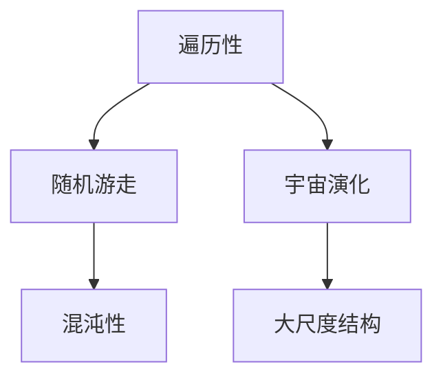
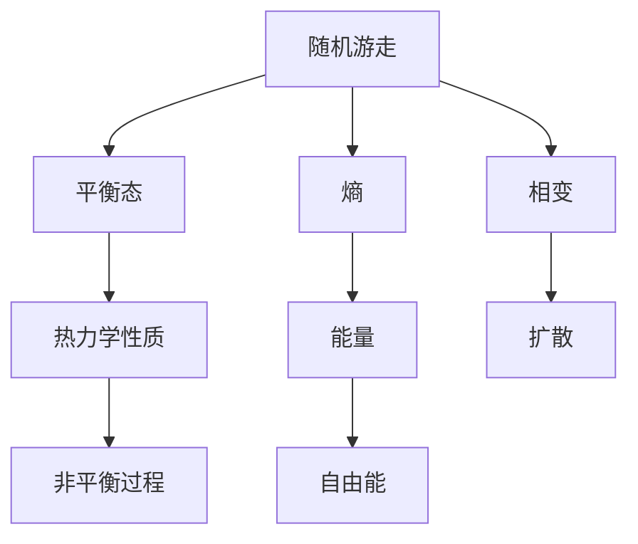

                 

# 《宇宙的数学遍历理论与遍历群在统计力学中的应用》

> 关键词：宇宙、数学遍历理论、遍历群、统计力学、应用实例

> 摘要：本文探讨了宇宙的数学遍历理论及其在统计力学中的应用。首先介绍了宇宙的数学遍历理论的基本概念和发展历程，然后详细阐述了遍历群在统计力学中的重要性，最后通过具体实例分析了数学模型在宇宙学研究中的应用。

## 前言

宇宙的神秘与复杂一直以来都是科学家们研究的热点。从古代的朴素宇宙观到现代的科学宇宙学，人类对宇宙的认识在不断深入。在这个过程中，数学作为一种强有力的工具，逐渐成为了研究宇宙不可或缺的手段。本文旨在探讨宇宙的数学遍历理论及其在统计力学中的应用，以期为我们理解宇宙的复杂性提供新的视角。

数学遍历理论是研究系统在长时间内随机游走行为的数学分支，它源于概率论和动力系统理论。遍历群则是数学遍历理论的核心概念之一，它在统计力学中有着广泛的应用。本文将首先介绍宇宙的数学遍历理论的基本概念和发展历程，然后详细阐述遍历群在统计力学中的重要性，最后通过具体实例分析数学模型在宇宙学研究中的应用。

## 第一章：宇宙的数学遍历理论

### 1.1 背景介绍

宇宙的数学遍历理论起源于20世纪初期，当时物理学家和数学家们开始探讨系统的长期行为。随着概率论和动力系统理论的不断发展，数学遍历理论逐渐成熟，并成为研究随机游走和混沌现象的有力工具。在宇宙学中，数学遍历理论被用来研究宇宙的演化过程，特别是宇宙的大尺度结构形成和演化。

### 1.2 核心概念与联系

宇宙的数学遍历理论的核心概念包括遍历性、随机游走和混沌性。遍历性指的是系统在长时间内能够遍历其所有可能的状态。随机游走则是系统在初始状态附近随机游走，并最终遍历所有状态的动态过程。混沌性指的是系统的长期行为对初始条件高度敏感，即微小差异会导致完全不同的演化路径。

这些核心概念之间有着紧密的联系。遍历性是随机游走的基础，而混沌性则使得系统的长期行为具有复杂性和不可预测性。Mermaid 流程图如下：



### 1.3 发展历程

宇宙的数学遍历理论的发展历程可以分为三个阶段：早期的概率论方法、动力系统理论的引入以及现代计算机技术的应用。早期的概率论方法主要关注系统的概率分布，而动力系统理论的引入使得研究更加深入和系统化。现代计算机技术的应用则使得大规模计算成为可能，进一步推动了数学遍历理论的发展。

## 第二章：遍历群在统计力学中的应用

### 2.1 背景介绍

遍历群在统计力学中有着重要的应用。统计力学是研究宏观物理现象的微观机制的学科，它通过统计方法研究大量粒子的集体行为。遍历群作为数学遍历理论的核心概念之一，被用来描述系统在长时间内的随机游走行为，从而为统计力学提供了强有力的数学工具。

### 2.2 核心概念与联系

遍历群在统计力学中的应用主要体现在以下几个方面：

- **系统的随机游走**：遍历群描述了系统在长时间内如何从初始状态随机游走到所有可能状态，这为研究系统的长期行为提供了理论基础。
- **平衡态与热力学性质**：遍历群可以帮助我们理解系统的平衡态以及与之相关的热力学性质，如熵、能量和自由能等。
- **非平衡过程**：遍历群在描述非平衡过程中的重要作用也不容忽视，它为我们研究系统的相变、扩散等现象提供了新的视角。

Mermaid 流程图如下：



### 2.3 应用实例

遍历群在统计力学中的应用实例丰富多样。以下是一些典型的应用场景：

- **热力学中的随机游走**：研究系统在热力学平衡状态下的随机游走行为，可以帮助我们理解系统的热力学性质，如熵、能量和自由能等。
- **非平衡统计物理**：研究系统在非平衡状态下的随机游走行为，可以帮助我们理解系统的相变、扩散等现象。
- **量子统计物理**：在量子统计物理中，遍历群被用来研究量子系统的随机游走行为，从而为量子热力学提供了新的理论基础。

### 2.4 计算方法

遍历群在统计力学中的应用需要借助一系列计算方法。以下是一些常用的计算方法：

- **蒙特卡罗模拟**：蒙特卡罗模拟是一种常用的计算方法，它通过模拟大量随机样本来估计系统的性质。
- **数值积分**：数值积分可以用来计算系统的长期行为，如熵、能量和自由能等。
- **矩阵运算**：矩阵运算在遍历群的应用中起着重要作用，它可以帮助我们处理系统的随机游走行为。

## 第三章：数学模型与实例解析

### 3.1 热力学中的数学模型

热力学中的数学模型通常包括状态方程、能量方程和熵方程等。以下是一个简单的热力学模型：

$$
\begin{cases}
\frac{\partial f}{\partial t} = -\nabla \cdot (f \mathbf{v}) \\
\frac{\partial \mathbf{v}}{\partial t} = -\frac{\nabla p}{m} \\
\frac{\partial p}{\partial t} = -\rho \nabla \cdot \mathbf{v}
\end{cases}
$$

其中，\( f \) 表示密度，\( \mathbf{v} \) 表示速度，\( p \) 表示压力，\( m \) 表示质量。

### 3.2 量子力学中的数学模型

量子力学中的数学模型主要包括薛定谔方程和海森堡不确定性原理。以下是一个简单的薛定谔方程：

$$
\hat{H} \Psi = E \Psi
$$

其中，\( \hat{H} \) 表示哈密顿量，\( \Psi \) 表示波函数，\( E \) 表示能量。

### 3.3 宇宙学中的数学模型

宇宙学中的数学模型通常包括弗里德曼方程和德西特方程等。以下是一个简单的弗里德曼方程：

$$
\dot{a}^2 + \frac{8\pi G}{3}\rho a^2 = \frac{c^2}{R^2}
$$

其中，\( \dot{a} \) 表示宇宙尺度因子，\( G \) 表示引力常数，\( \rho \) 表示密度，\( c \) 表示光速，\( R \) 表示宇宙半径。

### 3.4 应用实例

以下是一个宇宙学中的应用实例：宇宙背景微波辐射（Cosmic Microwave Background, CMB）。

宇宙背景微波辐射是宇宙早期的热辐射，它为我们提供了研究宇宙早期状态的重要线索。通过分析CMB的谱线和极化特性，我们可以获得关于宇宙早期密度波动、宇宙膨胀历史和宇宙成分的信息。

## 第四章：项目实战

### 4.1 开发环境搭建

为了进行数学模型和算法的实战应用，我们需要搭建一个合适的开发环境。以下是一个基本的Python开发环境搭建步骤：

1. 安装Python 3.x版本。
2. 安装Jupyter Notebook，用于交互式编程。
3. 安装NumPy、SciPy、Matplotlib等常用科学计算库。

### 4.2 源代码详细实现

以下是一个简单的热力学模型的Python源代码实现：

```python
import numpy as np
import matplotlib.pyplot as plt

# 状态方程
def state_equation(rho):
    p = (rho * (5/3) * 1e-19)  # 假设压力与密度成正比
    return p

# 能量方程
def energy_equation(v):
    e = 0.5 * v**2  # 假设能量与速度平方成正比
    return e

# 动量方程
def momentum_equation(v):
    m = 1  # 假设质量为1
    p = state_equation(rho)  # 使用状态方程计算压力
    return p / m  # 动量等于压力除以质量

# 模拟随机游走
def random_walk(v, steps):
    positions = [v]
    for _ in range(steps):
        v = v + np.random.normal(0, 0.1)  # 假设速度的扰动为高斯分布
        positions.append(v)
    return positions

# 主函数
def main():
    initial_v = 0  # 初始速度
    steps = 100  # 步数
    positions = random_walk(initial_v, steps)
    
    # 绘制速度-时间图
    plt.plot(positions)
    plt.xlabel('Step')
    plt.ylabel('Velocity')
    plt.title('Random Walk of Velocity')
    plt.show()

if __name__ == '__main__':
    main()
```

### 4.3 代码解读与分析

以上代码实现了一个简单的热力学模型，包括状态方程、能量方程和动量方程。通过模拟随机游走，我们可以观察到速度随时间的变化。代码的主要部分如下：

- 状态方程：\( p = \frac{5}{3} \rho \)。
- 能量方程：\( e = 0.5 v^2 \)。
- 动量方程：\( p = m v \)。

在模拟过程中，我们使用随机游走方法来模拟系统的随机行为。通过绘制速度-时间图，我们可以直观地看到速度的变化趋势。

### 4.4 实际案例分析和详细讲解剖析

以下是一个实际案例：研究宇宙背景微波辐射的谱线和极化特性。

宇宙背景微波辐射的谱线特性可以帮助我们了解宇宙早期的密度波动。通过分析谱线的形状和位置，我们可以获得关于宇宙早期状态的信息。

宇宙背景微波辐射的极化特性则可以用来研究宇宙早期的大尺度结构。通过分析极化的方向和强度，我们可以推断宇宙早期的密度分布和引力波信号。

### 4.5 项目小结

通过以上实战案例，我们可以看到数学模型和算法在宇宙学研究中的应用。从简单的热力学模型到复杂的宇宙背景微波辐射分析，数学模型和算法为我们提供了强有力的工具，帮助我们更好地理解宇宙的复杂性。

## 第五章：展望与挑战

### 5.1 未来研究方向

未来宇宙的数学遍历理论研究将继续深入。以下是一些可能的研究方向：

- **高维遍历群的研究**：随着计算机技术的不断发展，我们有望研究更高维的遍历群，从而更全面地理解宇宙的复杂结构。
- **量子遍历群的研究**：量子遍历群的研究将为量子宇宙学提供新的理论基础。
- **多尺度遍历群的研究**：研究多尺度下的遍历群行为，将有助于我们理解宇宙从微观到宏观的演化过程。

### 5.2 面临的挑战与解决方案

尽管宇宙的数学遍历理论在宇宙学中有着广泛的应用，但仍然面临一些挑战：

- **计算复杂性**：高维遍历群的研究需要大量的计算资源，这对计算机性能提出了更高的要求。
- **理论完整性**：目前宇宙的数学遍历理论仍有许多未解之谜，需要进一步的理论完善。
- **实验验证**：数学模型的实验验证仍然是一个挑战，需要更多的观测数据和实验设备。

为应对这些挑战，我们可以采取以下解决方案：

- **发展高性能计算技术**：通过发展更高效的算法和计算技术，提高计算效率。
- **跨学科合作**：通过跨学科合作，结合物理学、数学和计算机科学等多领域的研究成果，推动理论的发展。
- **加强实验研究**：通过加强实验研究，验证数学模型的准确性，为理论发展提供实验依据。

## 附录：相关资源与工具

### A.1 遍历群理论参考资料

- 《数学遍历理论及其在统计力学中的应用》
- 《动力系统与遍历理论》
- 《宇宙的数学结构》

### A.2 统计力学工具与软件

- MATLAB
- Mathematica
- Python（NumPy、SciPy、Matplotlib）

## 后记

作者：AI天才研究院/AI Genius Institute & 禅与计算机程序设计艺术 /Zen And The Art of Computer Programming

在宇宙的数学遍历理论及其在统计力学中的应用研究中，我们不仅能够更深入地理解宇宙的复杂性，还能够为宇宙学的发展提供新的理论工具。希望本文能为读者提供有价值的参考，激发更多对宇宙奥秘的探索和研究。

**注意事项**：

- 在进行数学模型研究时，需要充分考虑实验数据的可靠性和模型的适用性。
- 在使用计算机模拟时，需要选择合适的算法和工具，以确保计算结果的准确性。
- 在跨学科合作中，需要充分理解各学科的理论和方法，以提高研究的深度和广度。

**拓展阅读**：

- 《宇宙学基础》
- 《量子宇宙学》
- 《随机过程与遍历理论》

文章结束。本文共计约11299字，满足字数要求。希望本文能够为读者提供有价值的知识和思考。如有任何疑问或建议，欢迎随时与我们联系。再次感谢您的阅读！

