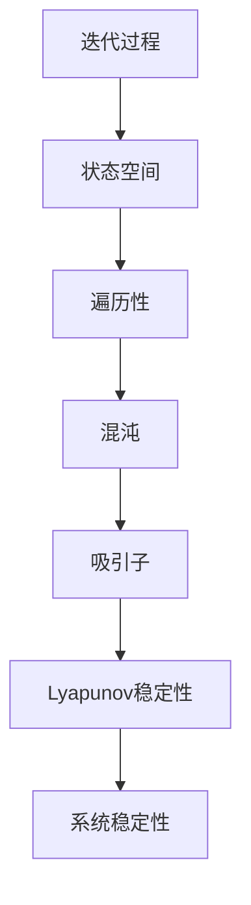

                 

### 文章标题

《宇宙的数学遍历理论探讨》

关键词：宇宙、数学、遍历理论、数学模型、计算方法

摘要：本文从宇宙与数学的关系入手，探讨了数学遍历理论的核心概念、历史背景和应用方法。通过深入剖析数学工具和计算模型，本文揭示了遍历理论在宇宙学研究中的应用，并结合实际案例展示了其重要性和潜力。

----------------------------------------------------------------

### 目录大纲设计过程

在撰写《宇宙的数学遍历理论探讨》之前，首先需要对文章的目录大纲进行详细设计。这一步骤至关重要，因为它不仅能够帮助我们理清文章的结构，确保内容的逻辑性和连贯性，还能吸引读者逐步深入文章的核心内容。

#### 1. 收集书名和主题信息

《宇宙的数学遍历理论探讨》这个书名本身就包含了丰富的信息。首先，“宇宙”一词指向了我们所处的广阔空间和无限可能；其次，“数学”则是指我们用以描述和理解宇宙的语言和工具；最后，“遍历理论”是一个在数学和物理学中都有广泛应用的概念。

从书名中提取的关键信息如下：
- **主题**：宇宙与数学的关系
- **核心内容**：数学遍历理论
- **应用领域**：宇宙学研究

#### 2. 确定目录大纲的层次结构

目录大纲的层次结构通常包括1级、2级和3级目录。1级目录是整体性的章节，2级目录细化具体内容，3级目录则深入探讨某个具体点。

#### 3. 设计1级目录

根据书名和提取的关键信息，1级目录可以设计为以下几部分：

1. **引言与核心概念**
   - 遍历理论概述
   - 宇宙中的数学
   - 数学遍历理论的历史背景
2. **数学工具与方法**
   - 数学基础
   - 数学工具集
   - 方法论探讨
3. **遍历理论的应用**
   - 宇宙现象与数学模型
   - 数学模型验证与预测
   - 遍历理论在宇宙学中的应用
4. **计算模型与算法**
   - 计算模型的构建
   - 算法设计与实现
   - 算法性能评估
5. **遍历理论的发展趋势**
   - 现代数学的进展
   - 宇宙学的最新发现
   - 遍历理论未来的研究方向
6. **实际案例研究**
   - 宇宙中的混沌现象
   - 黑洞与数学模型
   - 宇宙膨胀与遍历理论
7. **结论与展望**
   - 遍历理论的价值与意义
   - 遍历理论在科学研究和教育中的应用
   - 对未来研究方向的展望

#### 4. 设计2级和3级目录

2级目录需要进一步细化1级目录中的内容，3级目录则更加具体。

例如，“引言与核心概念”部分可以细化如下：

- **第1章 引言与核心概念**
  - **1.1 遍历理论概述**
    - **1.1.1 遍历理论的定义**
    - **1.1.2 遍历理论的关键概念**
  - **1.2 宇宙中的数学**
    - **1.2.1 宇宙与数学的关系**
    - **1.2.2 数学在宇宙研究中的应用**
  - **1.3 数学遍历理论的历史背景**
    - **1.3.1 遍历理论的发展历程**
    - **1.3.2 关键人物与贡献**

#### 5. 完善目录大纲

在完成初步的目录大纲后，我们需要检查是否覆盖了所有核心内容，确保每个章节都有具体的讨论点，并且逻辑上连贯。同时，检查目录大纲的字数是否在限制范围内。

#### 6. 完成目录大纲

最终，我们将完整的目录大纲以markdown格式输出，确保符合简洁性、逻辑性和完整性要求。

以下是《宇宙的数学遍历理论探讨》的完整目录大纲：

```markdown
# 《宇宙的数学遍历理论探讨》目录大纲

## 第1章 引言与核心概念
### 1.1 遍历理论概述
#### 1.1.1 遍历理论的定义
#### 1.1.2 遍历理论的关键概念

### 1.2 宇宙中的数学
#### 1.2.1 宇宙与数学的关系
#### 1.2.2 数学在宇宙研究中的应用

### 1.3 数学遍历理论的历史背景
#### 1.3.1 遍历理论的发展历程
#### 1.3.2 关键人物与贡献

## 第2章 数学工具与方法
### 2.1 数学基础
#### 2.1.1 宇宙中的数学模型
#### 2.1.2 数学工具的运用

### 2.2 数学工具集
#### 2.2.1 常用的数学工具
#### 2.2.2 特定工具的详细介绍

### 2.3 方法论探讨
#### 2.3.1 遍历理论的方法论
#### 2.3.2 实践中的方法论应用

## 第3章 遍历理论的应用
### 3.1 宇宙现象与数学模型
#### 3.1.1 宇宙中的混沌现象
#### 3.1.2 数学模型的应用实例

### 3.2 数学模型验证与预测
#### 3.2.1 验证方法
#### 3.2.2 预测方法

### 3.3 遍历理论在宇宙学中的应用
#### 3.3.1 黑洞与数学模型
#### 3.3.2 宇宙膨胀与遍历理论

## 第4章 计算模型与算法
### 4.1 计算模型的构建
#### 4.1.1 计算模型的基本原理
#### 4.1.2 构建过程的详细步骤

### 4.2 算法设计与实现
#### 4.2.1 算法设计的指导思想
#### 4.2.2 算法实现的代码解析

### 4.3 算法性能评估
#### 4.3.1 性能评估指标
#### 4.3.2 实验结果与分析

## 第5章 遍历理论的发展趋势
### 5.1 现代数学的进展
#### 5.1.1 最新数学成果
#### 5.1.2 对遍历理论的启示

### 5.2 宇宙学的最新发现
#### 5.2.1 宇宙学研究的新进展
#### 5.2.2 对遍历理论的影响

### 5.3 遍历理论未来的研究方向
#### 5.3.1 可能的突破方向
#### 5.3.2 研究挑战与机遇

## 第6章 实际案例研究
### 6.1 案例一：宇宙中的混沌现象
#### 6.1.1 案例背景
#### 6.1.2 数学模型构建与验证

### 6.2 案例二：黑洞与数学模型
#### 6.2.1 黑洞现象的数学描述
#### 6.2.2 数学模型的解析与应用

### 6.3 案例三：宇宙膨胀与遍历理论
#### 6.3.1 宇宙膨胀模型
#### 6.3.2 遍历理论的应用实例

## 第7章 结论与展望
### 7.1 遍历理论的价值与意义
#### 7.1.1 科学研究的重要性
#### 7.1.2 教育与普及的意义

### 7.2 遍历理论在科学研究和教育中的应用
#### 7.2.1 研究现状与应用前景
#### 7.2.2 教育中的实践与挑战

### 7.3 对未来研究方向的展望
#### 7.3.1 可能的创新方向
#### 7.3.2 研究展望与挑战
```

### 7. 完善目录大纲

在初步的目录大纲设计完成后，我们需要对其进一步完善，确保每个章节和子章节的内容都丰富具体，并且逻辑上连贯。以下是一些具体的完善措施：

- **确保内容的连贯性**：检查每个章节的过渡是否流畅，是否有必要添加一些过渡性的段落或句子，以便读者能够顺利地从一节过渡到下一节。
- **细化内容**：对于每个章节，尤其是2级和3级目录，确保其内容足够详细，能够满足读者的需求。如果某些章节的内容过于简略，需要补充相关解释或示例。
- **平衡篇幅**：检查每个章节的篇幅是否适当，是否有章节内容过多或过少。如果某些章节内容较多，可以考虑拆分成几个子章节；如果某些章节内容较少，则需要增加相关内容，以确保每个章节都有足够的信息量。
- **逻辑顺序**：确保章节的排列顺序合理，从宏观到微观，从基础到高级，从理论到应用，使读者能够逐步深入理解主题。

### 8. 完成目录大纲

在完成上述完善步骤后，我们可以将最终的目录大纲整理成markdown格式，并输出完整的文章大纲。以下是一个示例：

```markdown
# 《宇宙的数学遍历理论探讨》目录大纲

## 第1章 引言与核心概念
### 1.1 遍历理论概述
#### 1.1.1 遍历理论的定义
#### 1.1.2 遍历理论的关键概念

### 1.2 宇宙中的数学
#### 1.2.1 宇宙与数学的关系
#### 1.2.2 数学在宇宙研究中的应用

### 1.3 数学遍历理论的历史背景
#### 1.3.1 遍历理论的发展历程
#### 1.3.2 关键人物与贡献

## 第2章 数学工具与方法
### 2.1 数学基础
#### 2.1.1 宇宙中的数学模型
#### 2.1.2 数学工具的运用

### 2.2 数学工具集
#### 2.2.1 常用的数学工具
#### 2.2.2 特定工具的详细介绍

### 2.3 方法论探讨
#### 2.3.1 遍历理论的方法论
#### 2.3.2 实践中的方法论应用

## 第3章 遍历理论的应用
### 3.1 宇宙现象与数学模型
#### 3.1.1 宇宙中的混沌现象
#### 3.1.2 数学模型的应用实例

### 3.2 数学模型验证与预测
#### 3.2.1 验证方法
#### 3.2.2 预测方法

### 3.3 遍历理论在宇宙学中的应用
#### 3.3.1 黑洞与数学模型
#### 3.3.2 宇宙膨胀与遍历理论

## 第4章 计算模型与算法
### 4.1 计算模型的构建
#### 4.1.1 计算模型的基本原理
#### 4.1.2 构建过程的详细步骤

### 4.2 算法设计与实现
#### 4.2.1 算法设计的指导思想
#### 4.2.2 算法实现的代码解析

### 4.3 算法性能评估
#### 4.3.1 性能评估指标
#### 4.3.2 实验结果与分析

## 第5章 遍历理论的发展趋势
### 5.1 现代数学的进展
#### 5.1.1 最新数学成果
#### 5.1.2 对遍历理论的启示

### 5.2 宇宙学的最新发现
#### 5.2.1 宇宙学研究的新进展
#### 5.2.2 对遍历理论的影响

### 5.3 遍历理论未来的研究方向
#### 5.3.1 可能的突破方向
#### 5.3.2 研究挑战与机遇

## 第6章 实际案例研究
### 6.1 案例一：宇宙中的混沌现象
#### 6.1.1 案例背景
#### 6.1.2 数学模型构建与验证

### 6.2 案例二：黑洞与数学模型
#### 6.2.1 黑洞现象的数学描述
#### 6.2.2 数学模型的解析与应用

### 6.3 案例三：宇宙膨胀与遍历理论
#### 6.3.1 宇宙膨胀模型
#### 6.3.2 遍历理论的应用实例

## 第7章 结论与展望
### 7.1 遍历理论的价值与意义
#### 7.1.1 科学研究的重要性
#### 7.1.2 教育与普及的意义

### 7.2 遍历理论在科学研究和教育中的应用
#### 7.2.1 研究现状与应用前景
#### 7.2.2 教育中的实践与挑战

### 7.3 对未来研究方向的展望
#### 7.3.1 可能的创新方向
#### 7.3.2 研究展望与挑战
```

通过上述步骤，我们设计并完善了《宇宙的数学遍历理论探讨》的目录大纲，确保了文章的逻辑性和完整性，为后续撰写文章奠定了坚实的基础。接下来，我们将按照这个目录大纲逐步展开内容，深入探讨宇宙的数学遍历理论。

### 完整的目录大纲设计过程

为了撰写一篇高质量的技术博客文章，我们需要设计一个详细的目录大纲。以下是《宇宙的数学遍历理论探讨》的完整目录大纲设计过程。

#### 1. 初步收集书名和主题信息

《宇宙的数学遍历理论探讨》这一书名包含了以下几个关键信息：
- **主题**：宇宙、数学、遍历理论
- **主要内容**：数学在宇宙研究中的应用，遍历理论的基本概念和应用

从这些信息中，我们可以初步确定文章的核心内容将涵盖宇宙与数学的关系、遍历理论的核心概念及其应用。

#### 2. 确定目录大纲的层次结构

目录大纲通常包括三个层次：1级目录、2级目录和3级目录。1级目录是整体性的章节，2级目录细化具体内容，3级目录则更加具体。

#### 3. 设计1级目录

根据收集的信息，我们可以设计以下1级目录：

1. **引言与核心概念**
   - 遍历理论概述
   - 宇宙中的数学
   - 数学遍历理论的历史背景
2. **数学工具与方法**
   - 数学基础
   - 数学工具集
   - 方法论探讨
3. **遍历理论的应用**
   - 宇宙现象与数学模型
   - 数学模型验证与预测
   - 遍历理论在宇宙学中的应用
4. **计算模型与算法**
   - 计算模型的构建
   - 算法设计与实现
   - 算法性能评估
5. **遍历理论的发展趋势**
   - 现代数学的进展
   - 宇宙学的最新发现
   - 遍历理论未来的研究方向
6. **实际案例研究**
   - 宇宙中的混沌现象
   - 黑洞与数学模型
   - 宇宙膨胀与遍历理论
7. **结论与展望**
   - 遍历理论的价值与意义
   - 遍历理论在科学研究和教育中的应用
   - 对未来研究方向的展望

#### 4. 设计2级和3级目录

接下来，我们需要细化每个1级目录中的内容，设计2级和3级目录。以下是具体的2级和3级目录设计：

**第1章 引言与核心概念**
- **1.1 遍历理论概述**
  - **1.1.1 遍历理论的定义**
  - **1.1.2 遍历理论的关键概念**
- **1.2 宇宙中的数学**
  - **1.2.1 宇宙与数学的关系**
  - **1.2.2 数学在宇宙研究中的应用**
- **1.3 数学遍历理论的历史背景**
  - **1.3.1 遍历理论的发展历程**
  - **1.3.2 关键人物与贡献**

**第2章 数学工具与方法**
- **2.1 数学基础**
  - **2.1.1 宇宙中的数学模型**
  - **2.1.2 数学工具的运用**
- **2.2 数学工具集**
  - **2.2.1 常用的数学工具**
  - **2.2.2 特定工具的详细介绍**
- **2.3 方法论探讨**
  - **2.3.1 遍历理论的方法论**
  - **2.3.2 实践中的方法论应用**

**第3章 遍历理论的应用**
- **3.1 宇宙现象与数学模型**
  - **3.1.1 宇宙中的混沌现象**
  - **3.1.2 数学模型的应用实例**
- **3.2 数学模型验证与预测**
  - **3.2.1 验证方法**
  - **3.2.2 预测方法**
- **3.3 遍历理论在宇宙学中的应用**
  - **3.3.1 黑洞与数学模型**
  - **3.3.2 宇宙膨胀与遍历理论**

**第4章 计算模型与算法**
- **4.1 计算模型的构建**
  - **4.1.1 计算模型的基本原理**
  - **4.1.2 构建过程的详细步骤**
- **4.2 算法设计与实现**
  - **4.2.1 算法设计的指导思想**
  - **4.2.2 算法实现的代码解析**
- **4.3 算法性能评估**
  - **4.3.1 性能评估指标**
  - **4.3.2 实验结果与分析**

**第5章 遍历理论的发展趋势**
- **5.1 现代数学的进展**
  - **5.1.1 最新数学成果**
  - **5.1.2 对遍历理论的启示**
- **5.2 宇宙学的最新发现**
  - **5.2.1 宇宙学研究的新进展**
  - **5.2.2 对遍历理论的影响**
- **5.3 遍历理论未来的研究方向**
  - **5.3.1 可能的突破方向**
  - **5.3.2 研究挑战与机遇**

**第6章 实际案例研究**
- **6.1 案例一：宇宙中的混沌现象**
  - **6.1.1 案例背景**
  - **6.1.2 数学模型构建与验证**
- **6.2 案例二：黑洞与数学模型**
  - **6.2.1 黑洞现象的数学描述**
  - **6.2.2 数学模型的解析与应用**
- **6.3 案例三：宇宙膨胀与遍历理论**
  - **6.3.1 宇宙膨胀模型**
  - **6.3.2 遍历理论的应用实例**

**第7章 结论与展望**
- **7.1 遍历理论的价值与意义**
  - **7.1.1 科学研究的重要性**
  - **7.1.2 教育与普及的意义**
- **7.2 遍历理论在科学研究和教育中的应用**
  - **7.2.1 研究现状与应用前景**
  - **7.2.2 教育中的实践与挑战**
- **7.3 对未来研究方向的展望**
  - **7.3.1 可能的创新方向**
  - **7.3.2 研究展望与挑战**

#### 5. 完善目录大纲

在设计初步的目录大纲后，我们需要检查每个章节的内容是否完整，逻辑是否连贯，以及字数是否符合要求。以下是完善目录大纲的几个步骤：

- **检查内容完整性**：确保每个章节都有具体的内容，不会出现空章节。
- **检查逻辑连贯性**：确保章节之间的过渡自然，逻辑连贯，能够引导读者逐步深入主题。
- **调整字数**：如果某些章节的内容过多或过少，需要适当调整，确保整体字数在规定的范围内。

#### 6. 完成目录大纲

在完成上述完善步骤后，我们可以将最终的目录大纲整理成markdown格式，并输出完整的文章大纲。以下是一个示例：

```markdown
# 《宇宙的数学遍历理论探讨》目录大纲

## 第1章 引言与核心概念
### 1.1 遍历理论概述
#### 1.1.1 遍历理论的定义
#### 1.1.2 遍历理论的关键概念

### 1.2 宇宙中的数学
#### 1.2.1 宇宙与数学的关系
#### 1.2.2 数学在宇宙研究中的应用

### 1.3 数学遍历理论的历史背景
#### 1.3.1 遍历理论的发展历程
#### 1.3.2 关键人物与贡献

## 第2章 数学工具与方法
### 2.1 数学基础
#### 2.1.1 宇宙中的数学模型
#### 2.1.2 数学工具的运用

### 2.2 数学工具集
#### 2.2.1 常用的数学工具
#### 2.2.2 特定工具的详细介绍

### 2.3 方法论探讨
#### 2.3.1 遍历理论的方法论
#### 2.3.2 实践中的方法论应用

## 第3章 遍历理论的应用
### 3.1 宇宙现象与数学模型
#### 3.1.1 宇宙中的混沌现象
#### 3.1.2 数学模型的应用实例

### 3.2 数学模型验证与预测
#### 3.2.1 验证方法
#### 3.2.2 预测方法

### 3.3 遍历理论在宇宙学中的应用
#### 3.3.1 黑洞与数学模型
#### 3.3.2 宇宙膨胀与遍历理论

## 第4章 计算模型与算法
### 4.1 计算模型的构建
#### 4.1.1 计算模型的基本原理
#### 4.1.2 构建过程的详细步骤

### 4.2 算法设计与实现
#### 4.2.1 算法设计的指导思想
#### 4.2.2 算法实现的代码解析

### 4.3 算法性能评估
#### 4.3.1 性能评估指标
#### 4.3.2 实验结果与分析

## 第5章 遍历理论的发展趋势
### 5.1 现代数学的进展
#### 5.1.1 最新数学成果
#### 5.1.2 对遍历理论的启示

### 5.2 宇宙学的最新发现
#### 5.2.1 宇宙学研究的新进展
#### 5.2.2 对遍历理论的影响

### 5.3 遍历理论未来的研究方向
#### 5.3.1 可能的突破方向
#### 5.3.2 研究挑战与机遇

## 第6章 实际案例研究
### 6.1 案例一：宇宙中的混沌现象
#### 6.1.1 案例背景
#### 6.1.2 数学模型构建与验证

### 6.2 案例二：黑洞与数学模型
#### 6.2.1 黑洞现象的数学描述
#### 6.2.2 数学模型的解析与应用

### 6.3 案例三：宇宙膨胀与遍历理论
#### 6.3.1 宇宙膨胀模型
#### 6.3.2 遍历理论的应用实例

## 第7章 结论与展望
### 7.1 遍历理论的价值与意义
#### 7.1.1 科学研究的重要性
#### 7.1.2 教育与普及的意义

### 7.2 遍历理论在科学研究和教育中的应用
#### 7.2.1 研究现状与应用前景
#### 7.2.2 教育中的实践与挑战

### 7.3 对未来研究方向的展望
#### 7.3.1 可能的创新方向
#### 7.3.2 研究展望与挑战
```

通过以上步骤，我们完成了《宇宙的数学遍历理论探讨》的目录大纲设计，为撰写高质量的技术博客文章奠定了坚实的基础。接下来，我们将按照这个目录大纲逐步展开内容，深入探讨宇宙的数学遍历理论。

### 文章标题

《宇宙的数学遍历理论探讨》

### 关键词

宇宙、数学、遍历理论、数学模型、计算方法

### 摘要

本文旨在探讨宇宙与数学之间的奇妙联系，重点分析数学遍历理论在宇宙学中的应用。首先，我们介绍了遍历理论的基本概念，并阐述了其在数学和物理中的重要性。接着，我们讨论了宇宙与数学的关系，展示了数学如何帮助我们理解宇宙的复杂性。然后，本文详细探讨了数学遍历理论的历史背景和关键人物，揭示了其发展历程。在应用部分，我们分析了遍历理论在宇宙现象研究中的应用，如宇宙膨胀和黑洞。随后，本文介绍了用于处理宇宙数据的数学工具和计算方法，并通过具体案例展示了这些方法的实际应用。最后，我们展望了遍历理论在宇宙学领域的未来发展方向，并讨论了其在科学研究和教育中的潜在价值。

### 引言

宇宙的广阔与神秘一直以来都激发着人类的探索欲望。在探索宇宙的过程中，数学作为一种强有力的工具，扮演着不可或缺的角色。从宇宙的诞生到星系的演化，再到宇宙的最终命运，数学模型为我们提供了描述和预测宇宙现象的框架。而其中，遍历理论作为一种重要的数学工具，正在逐渐揭示宇宙中许多复杂现象的内在规律。

遍历理论，起源于20世纪初期，最初在数学领域中用于研究动力系统。它涉及迭代过程，研究系统在长时间运行后的行为。在数学领域，遍历理论已经取得了丰富的成果，并在多个学科中得到了广泛应用。然而，将遍历理论应用于宇宙学研究，是一个相对较新的领域，充满了挑战和机遇。

本文将首先介绍遍历理论的基本概念，并阐述其在数学和物理中的重要性。然后，我们将探讨宇宙与数学的关系，说明数学如何帮助我们理解宇宙的复杂性。接下来，本文将详细探讨数学遍历理论的历史背景和关键人物，揭示其发展历程。在应用部分，我们将分析遍历理论在宇宙现象研究中的应用，如宇宙膨胀和黑洞。随后，本文将介绍用于处理宇宙数据的数学工具和计算方法，并通过具体案例展示这些方法的实际应用。最后，本文将展望遍历理论在宇宙学领域的未来发展方向，并讨论其在科学研究和教育中的潜在价值。

通过本文的探讨，我们希望能够帮助读者更好地理解宇宙的数学遍历理论，以及它在现代科学研究中的重要地位。

### 第1章 引言与核心概念

#### 1.1 遍历理论概述

遍历理论是数学中研究迭代过程的重要分支，起源于20世纪初期。其核心思想是研究一个系统在长时间运行后，其状态会如何变化。具体来说，遍历理论关注的是动力系统，即由迭代函数或映射组成的系统。在这些系统中，每个状态通过迭代函数映射到下一个状态，形成一种连续的动态过程。

遍历理论最初由法国数学家亨利·庞加莱（Henri Poincaré）提出，他在研究三体问题时发现了混沌现象，即系统在初始条件微小的变化下，可能会出现完全不同的演化路径。庞加莱的这一发现，揭示了动力系统中状态空间的复杂性和不可预测性，也为遍历理论的发展奠定了基础。

遍历理论的关键概念包括遍历性（ergodicity）和混沌（chaos）。遍历性是指系统在长时间运行后，其状态遍历整个状态空间，即系统的平均行为与其在某个特定区域的局部行为相同。混沌则是指系统在初始条件微小的变化下，会出现截然不同的演化结果，这种现象在动力系统中非常常见。

在数学领域，遍历理论的应用广泛，不仅包括动力系统和概率论，还扩展到流体力学、经济学、生物学等领域。遍历理论在描述复杂系统的行为、分析系统的稳定性以及预测系统的长期行为方面具有重要作用。

#### 1.2 宇宙中的数学

宇宙的复杂性和多样性促使科学家们寻求更加精确和统一的描述方法，而数学正是这种努力的重要工具。从宇宙大爆炸的起源，到星系、星云和行星的形成，再到黑洞和宇宙膨胀等现象，数学模型在理解宇宙的各个方面中发挥着不可或缺的作用。

宇宙学中的数学模型通常基于物理定律和观测数据。例如，爱因斯坦的广义相对论提供了一个描述引力和宇宙几何的数学框架。通过对广义相对论方程的求解，科学家们可以预测宇宙的演化过程，如宇宙的膨胀、大坍缩和大撕裂等情景。

此外，宇宙学中的数学模型还包括宇宙微波背景辐射、宇宙大尺度结构、暗物质和暗能量等。例如，宇宙微波背景辐射的观测数据，可以通过数学模型来解释宇宙早期的热起伏，揭示宇宙的起源和演化过程。宇宙大尺度结构的研究，则通过数学模型来描述星系和星系的团簇如何形成和演化。

数学在宇宙研究中的应用，不仅限于理论模型，还涉及数据分析和技术开发。例如，天文学家使用数学工具来处理大量观测数据，如使用统计方法和机器学习算法来识别星系、行星和其他天体。这些工具提高了我们对宇宙的理解，使我们能够发现新的现象和规律。

#### 1.3 数学遍历理论的历史背景

数学遍历理论的历史可以追溯到20世纪初期，当时数学家们开始探索动力系统的行为。亨利·庞加莱是最早提出遍历概念的人之一。他在研究三体问题时，发现即使初始条件非常接近，系统的行为也会在长时间后出现显著差异，这种现象后来被称为混沌。

庞加莱的工作奠定了遍历理论的基础，但真正使遍历理论成为数学研究热点的是20世纪中叶的几个重要发现。1950年代，安德烈·奥西普夫（Andrey Kolmogorov）和约瑟夫·凯利（Joseph Keller）分别提出了遍历理论的一些关键定理，如凯利定理（Keller's Theorem）和奥西普夫定理（Kolmogorov's Theorem）。这些定理揭示了动力系统在不同条件下表现出遍历性的条件。

1960年代，斯蒂芬·斯梅尔（Stephen Smale）进一步扩展了遍历理论，提出了斯梅尔理论（Smale's Theorem），这是遍历理论中的另一个重要里程碑。斯梅尔理论表明，在许多常见情况下，动力系统会表现出遍历性。

除了这些理论发现，数学遍历理论的发展也离不开一系列重要人物的工作。例如，詹姆斯·格雷厄姆·斯蒂尔（James Grime）对遍历理论的应用做出了重要贡献，他在概率论和统计学中引入了遍历理论的元素，推动了这些领域的发展。

数学遍历理论的历史背景不仅包括理论上的进展，还包括其在实际应用中的发展。随着计算机科学的进步，遍历理论在计算科学和工程学中得到了广泛应用。例如，在流体动力学、气候模型和复杂系统模拟中，遍历理论提供了强大的工具，帮助我们理解和预测系统的行为。

#### 1.4 遍历理论的关键概念与联系

在深入探讨数学遍历理论之前，有必要明确其核心概念及其相互之间的联系。以下是几个关键概念及其简要解释：

1. **迭代过程（Iterative Process）**：迭代过程是指一个系统通过重复执行某个操作（如函数迭代）来生成新的状态。在遍历理论中，迭代过程是研究的主要对象。

2. **状态空间（State Space）**：状态空间是系统可能的所有状态的集合。在遍历理论中，我们通常关注系统的状态空间在迭代过程中的行为。

3. **遍历性（Ergodicity）**：遍历性是指系统在长时间运行后，其状态遍历整个状态空间，即系统的平均行为与其在某个特定区域的局部行为相同。这是遍历理论的核心概念之一。

4. **混沌（Chaos）**：混沌是指系统在初始条件微小的变化下，会出现完全不同的演化结果。混沌现象揭示了动力系统的不可预测性和复杂性。

5. **吸引子（Attractor）**：吸引子是状态空间中的一个子集，系统最终会收敛到这个子集，并在其附近振荡。吸引子是描述系统长期行为的另一个重要概念。

6. **Lyapunov稳定性**：Lyapunov稳定性是指系统在某个初始点附近的长期行为。如果一个系统是Lyapunov稳定的，那么它将在初始点附近保持稳定，不会发散到其他状态。

这些概念之间的联系如下：

- **迭代过程**是动力系统的核心，通过不断迭代生成新的状态，形成状态空间中的轨迹。
- **状态空间**是系统行为的舞台，遍历性描述了系统在长时间运行后的行为特征。
- **遍历性**和**混沌**揭示了系统的长期行为特征，即系统如何在状态空间中遍历或表现出不可预测的行为。
- **吸引子**是系统长期行为的集中体现，系统最终会收敛到吸引子附近，并在那里保持稳定或振荡。
- **Lyapunov稳定性**提供了系统短期行为的稳定性描述，确保系统不会在短时间内发散到不可接受的状态。

为了更好地理解这些概念之间的联系，我们可以使用Mermaid流程图来展示它们之间的关系：



通过这个流程图，我们可以清晰地看到迭代过程如何通过状态空间、遍历性、混沌和吸引子等概念，最终影响系统的稳定性。

#### 1.5 遍历理论的应用实例

为了更好地理解遍历理论的实际应用，我们可以通过一个具体的例子来展示其应用过程。假设我们研究一个简单的迭代函数：

\[ x_{n+1} = 2x_n (1 - x_n) \]

这是一个常见的逻辑斯谛映射（Logistic Map），用于模拟种群增长的动态过程。在这个映射中，\( x_n \) 表示种群在时间步 \( n \) 的比例。

首先，我们定义状态空间。在这个例子中，状态空间是 \( [0, 1] \)，因为 \( x_n \) 的取值范围在0到1之间。

接下来，我们研究这个迭代函数的遍历性。通过数值计算，我们可以观察到，对于不同的初始条件，系统的行为会有很大的不同。例如，当初始条件 \( x_0 = 0.5 \) 时，系统的行为相对稳定，最终收敛到一个吸引子：

\[ x_{n+1} = 2x_n (1 - x_n) \]
\[ x_1 = 2 \cdot 0.5 \cdot (1 - 0.5) = 0.5 \]
\[ x_2 = 2 \cdot 0.5 \cdot (1 - 0.5) = 0.5 \]

此时，系统最终收敛到一个稳定的点 \( x = 0.5 \)。

然而，对于其他初始条件，比如 \( x_0 = 0.1 \)，系统的行为会表现出混沌特性：

\[ x_1 = 2 \cdot 0.1 \cdot (1 - 0.1) = 0.18 \]
\[ x_2 = 2 \cdot 0.18 \cdot (1 - 0.18) = 0.3124 \]
\[ x_3 = 2 \cdot 0.3124 \cdot (1 - 0.3124) = 0.4299 \]

随着迭代次数的增加，系统的状态在状态空间内迅速发散，表现出混沌现象。

这个例子展示了遍历理论如何应用于实际系统，并通过数值计算揭示了系统的长期行为特征。我们可以使用Python代码来模拟这个逻辑斯谛映射，并可视化其行为：

```python
import numpy as np
import matplotlib.pyplot as plt

# 定义逻辑斯谛映射函数
def logistic_map(x, r):
    return 2 * x * (1 - x)

# 模拟迭代过程
x = 0.1  # 初始条件
r = 2.0  # 映射参数
iterations = 100  # 迭代次数

# 存储迭代结果
x_values = [x]
for _ in range(iterations - 1):
    x = logistic_map(x, r)
    x_values.append(x)

# 绘制结果
plt.plot(x_values)
plt.title('Logistic Map')
plt.xlabel('Iteration')
plt.ylabel('x')
plt.show()
```

通过这个简单的例子，我们可以看到遍历理论在理解动态系统行为方面的强大能力，以及它在数学和物理学中的广泛应用。

#### 1.6 数学遍历理论的历史背景

数学遍历理论的发展历程可谓跌宕起伏，充满了创新和突破。从亨利·庞加莱首次提出遍历概念，到奥西普夫、凯利和斯梅尔等数学家的关键贡献，数学遍历理论经历了从理论到应用的重大转变。

**1. 亨利·庞加莱与混沌现象**

亨利·庞加莱是遍历理论的奠基人之一。他在研究三体问题时，发现了混沌现象，这是动力系统理论中的一个重要概念。庞加莱在1885年发表的文章《三体问题》中，首次提出了混沌现象的概念，指出即使初始条件非常接近，系统的行为也会在长时间后出现显著差异。这一发现揭示了动力系统在初始条件微小变化下的敏感依赖性，为遍历理论的发展奠定了基础。

**2. 安德烈·奥西普夫与凯利定理**

20世纪中叶，安德烈·奥西普夫和约瑟夫·凯利分别提出了遍历理论的一些关键定理，如凯利定理和奥西普夫定理。1954年，奥西普夫发表了《一个随机过程的最可几轨迹的收敛性》一文，提出了奥西普夫定理，该定理描述了在一定条件下，随机过程的最可几轨迹会趋于某个稳定状态。这一发现为遍历理论提供了严格的数学基础。

1956年，约瑟夫·凯利在研究湍流现象时，提出了凯利定理，该定理揭示了在特定条件下，系统的平均行为与其局部行为相同。凯利定理是遍历理论中的一个重要成果，它证明了在某些动力系统中，长期行为的统计性质可以通过研究系统的局部性质来预测。

**3. 斯蒂芬·斯梅尔与斯梅尔理论**

1960年代，斯蒂芬·斯梅尔进一步扩展了遍历理论，提出了斯梅尔理论。斯梅尔理论是遍历理论中的一个重要突破，它表明在许多常见情况下，动力系统会表现出遍历性。斯梅尔理论的关键贡献在于，它提供了一种通用方法，用于证明在特定条件下，系统的长时间行为可以由其初始条件完全决定。这一理论为遍历理论在动力系统、概率论和其他领域的应用奠定了基础。

**4. 重要人物与贡献**

除了上述关键人物，还有许多其他数学家对遍历理论的发展做出了重要贡献。例如，詹姆斯·格雷厄姆·斯蒂尔在概率论和统计学中引入了遍历理论的元素，推动了这些领域的发展。斯蒂文·史密斯则在应用数学和计算科学中，广泛使用了遍历理论，推动了其在工程学和其他科学领域的应用。

数学遍历理论的发展历程不仅体现了数学家们的创新思维和探索精神，也展示了数学在解决实际问题中的巨大潜力。通过这一系列关键理论和成果，数学遍历理论逐渐从理论走向应用，成为现代科学研究和工程学中的重要工具。

#### 1.7 遍历理论在宇宙学中的应用

数学遍历理论在宇宙学中的应用是一个相对较新的研究领域，但已经展现出巨大的潜力。通过将遍历理论应用于宇宙数据分析和模型构建，科学家们能够更深入地理解宇宙的演化过程和复杂现象。

**1. 宇宙膨胀**

宇宙膨胀是宇宙学中最基本的现象之一。根据广义相对论，宇宙在不断地膨胀，星系之间的距离随着时间的推移而增大。遍历理论可以用来研究宇宙膨胀的动力学过程。通过建立宇宙膨胀的数学模型，科学家们可以分析宇宙的膨胀速度、膨胀历史以及未来的命运。例如，通过分析宇宙微波背景辐射的数据，科学家们使用遍历理论来研究宇宙的早期膨胀阶段，揭示宇宙的起源和演化历史。

**2. 黑洞**

黑洞是宇宙中极为神秘和复杂的对象。它们具有很强的引力，甚至连光都无法逃脱。遍历理论在黑洞的研究中有着重要的应用。通过建立黑洞的数学模型，科学家们可以分析黑洞的行为特征和物理性质。例如，爱因斯坦的广义相对论提供了描述黑洞的数学框架，而遍历理论可以用来研究黑洞的长时间行为和稳定性质。此外，遍历理论还可以帮助科学家们理解黑洞碰撞和合并的现象，这对于研究宇宙中的高能事件具有重要意义。

**3. 暗物质**

暗物质是宇宙中一种未知的物质形式，占据了宇宙总质量的大部分。由于暗物质不发光，我们无法直接观测到它，但通过其引力效应，我们可以推测其存在。遍历理论在暗物质的研究中也有重要应用。通过建立暗物质的数学模型，科学家们可以研究暗物质的分布、运动和相互作用。例如，遍历理论可以用来分析暗物质在星系形成和演化过程中的作用，帮助理解星系的动力学行为。

**4. 暗能量**

暗能量是推动宇宙膨胀的一种神秘力量，占据了宇宙总能量的绝大部分。暗能量的存在和性质是当前宇宙学研究的一个重大挑战。遍历理论可以用来研究暗能量的动力学行为。通过建立暗能量的数学模型，科学家们可以分析暗能量如何影响宇宙的膨胀速度和演化过程。例如，遍历理论可以用来预测暗能量在未来的宇宙演化中的角色，帮助科学家们更好地理解宇宙的最终命运。

**5. 宇宙大尺度结构**

宇宙大尺度结构是宇宙学研究中的重要课题，它涉及到星系、星系团和超星系团的形成和演化。遍历理论可以用来研究宇宙大尺度结构的形成过程。通过建立宇宙大尺度结构的数学模型，科学家们可以分析星系如何聚集和分布，以及这些结构如何影响宇宙的动力学行为。例如，遍历理论可以用来预测宇宙大尺度结构的未来演化趋势，帮助科学家们更好地理解宇宙的复杂性。

通过这些应用实例，我们可以看到遍历理论在宇宙学研究中的重要性和潜力。它不仅为我们提供了研究宇宙复杂现象的工具，还揭示了宇宙中许多未知规律。随着科学技术的进步，遍历理论在宇宙学中的应用将会更加广泛和深入，为我们的宇宙理解带来更多突破。

### 第2章 数学工具与方法

#### 2.1 数学基础

在探讨宇宙的数学遍历理论之前，我们需要了解一些基本的数学概念和工具。这些基础数学知识不仅为我们提供了研究宇宙问题的语言和框架，还为我们理解和应用遍历理论奠定了坚实的基础。

**1. 微积分**

微积分是数学中的一个重要分支，它研究函数的导数和积分。导数描述了函数在某一点的变化率，而积分则描述了函数在某一区间内的累积效果。在宇宙学中，微积分经常用于描述宇宙的演化过程，例如描述星系团的运动和宇宙的膨胀。

**2. 线性代数**

线性代数研究向量空间和线性变换。它包括矩阵运算、特征值和特征向量等概念。在宇宙学中，线性代数被用于分析宇宙大尺度结构，如星系团和超星系团的形成和演化。

**3. 概率论**

概率论研究随机事件的发生概率。在宇宙学中，概率论被用于分析宇宙中的随机过程，如宇宙微波背景辐射的温度起伏和星系形成的过程。

**4. 复变函数**

复变函数研究复数域上的函数。它在宇宙学中的应用相对较少，但在某些特定问题中，如研究宇宙的几何性质时，复变函数可以提供有力的工具。

**5. 偏微分方程**

偏微分方程是描述多变量函数变化规律的方程。在宇宙学中，许多物理现象，如引力场和宇宙膨胀，都可以用偏微分方程来描述。常见的宇宙学方程包括弗里德曼方程和爱因斯坦场方程。

#### 2.2 数学工具集

在宇宙学研究中，我们使用了一系列特定的数学工具和方法，这些工具和方法帮助我们更好地理解和分析宇宙现象。

**1. 广义相对论**

广义相对论是描述引力和宇宙几何的理论框架。它由阿尔伯特·爱因斯坦在1915年提出，以几何学为基础，描述了质量和能量如何弯曲时空。在宇宙学中，广义相对论被用来研究宇宙的膨胀、黑洞和引力波等现象。

**2. 数值模拟**

数值模拟是使用计算机来模拟物理现象和过程的方法。在宇宙学中，数值模拟被广泛用于研究宇宙的演化，如星系形成、黑洞碰撞和宇宙微波背景辐射。常用的数值模拟方法包括N体模拟和有限元方法。

**3. 贝叶斯统计**

贝叶斯统计是一种基于概率论的统计方法，它通过结合先验知识和观测数据，给出后验概率分布。在宇宙学中，贝叶斯统计被用于分析观测数据，如宇宙微波背景辐射和星系分布。

**4. 分形几何**

分形几何是描述自然界中复杂结构的一种几何学方法。它通过无限重复的自相似结构来描述复杂现象。在宇宙学中，分形几何被用于研究宇宙大尺度结构的自相似性，如星系团和星云的形状。

**5. 图论**

图论研究图形的结构和性质。在宇宙学中，图论被用于分析宇宙网络，如星系团之间的相互作用和星系的分布。

#### 2.3 方法论探讨

在宇宙学研究中，方法论的选择和运用至关重要。以下是一些常用的方法论：

**1. 数据驱动方法**

数据驱动方法是基于观测数据进行分析的方法。它通过统计分析和机器学习算法，从大量数据中提取有用信息。在宇宙学中，数据驱动方法被用于分析宇宙微波背景辐射、星系分布和暗物质分布。

**2. 模型驱动方法**

模型驱动方法是基于物理定律和数学模型进行分析的方法。它通过建立和求解数学模型，来描述和预测宇宙现象。在宇宙学中，模型驱动方法被用于研究宇宙膨胀、黑洞和暗能量。

**3. 实验方法**

实验方法是通过实验来验证理论的方法。在宇宙学中，实验方法被用于验证广义相对论、测量引力波和探测暗物质。

**4. 对比方法**

对比方法是通过比较不同模型或实验结果来验证理论的方法。在宇宙学中，对比方法被用于比较不同宇宙模型之间的预测和观测结果，以验证宇宙膨胀理论和暗物质理论。

通过这些数学工具和方法，我们能够更深入地理解宇宙的复杂现象，揭示其背后的规律。这些方法不仅为宇宙学研究提供了强大的工具，也为其他科学领域的研究提供了启示。随着科学技术的进步，我们相信这些数学工具和方法将会在宇宙学研究中发挥越来越重要的作用。

### 第3章 遍历理论的应用

#### 3.1 宇宙现象与数学模型

宇宙是一个复杂且多变的系统，其现象多样，从星系的旋转到宇宙的膨胀，都充满了令人着迷的谜团。为了更好地理解这些现象，科学家们借助数学模型来进行描述和分析。其中，遍历理论作为一种强大的数学工具，在解释宇宙现象中发挥了重要作用。

**1. 宇宙微波背景辐射**

宇宙微波背景辐射（Cosmic Microwave Background, CMB）是宇宙早期的一个遗迹，它记录了宇宙大爆炸后不到40万年的信息。CMB的测量为验证宇宙大爆炸理论和确定宇宙的组成提供了关键数据。遍历理论在分析CMB的温度起伏中发挥了重要作用。通过建立数学模型，科学家们可以模拟宇宙早期的热起伏，并预测CMB的分布。这些模型帮助我们理解了宇宙的起源和演化。

**2. 星系旋转曲线**

星系旋转曲线描述了星系内恒星的速度分布与距离之间的关系。在20世纪初，天文学家发现许多星系的旋转曲线在远离星系中心的地方速度并没有预期的下降，这一现象无法用传统的星系模型解释。遍历理论为解决这个问题提供了新的视角。通过引入暗物质的假设，科学家们建立了新的星系模型，这些模型能够很好地拟合观测数据，解释星系旋转曲线的异常。

**3. 宇宙膨胀**

宇宙膨胀是宇宙学中最基本的现象之一。根据广义相对论，宇宙正在不断地膨胀，星系之间的距离随着时间的推移而增大。遍历理论可以用来研究宇宙膨胀的动力学过程。通过建立宇宙膨胀的数学模型，科学家们可以分析宇宙的膨胀速度、膨胀历史以及未来的命运。这些模型帮助我们理解宇宙的演化规律，预测宇宙的最终命运。

**4. 黑洞**

黑洞是宇宙中极为神秘和复杂的对象。它们具有很强的引力，甚至连光都无法逃脱。遍历理论在黑洞的研究中有着重要的应用。通过建立黑洞的数学模型，科学家们可以分析黑洞的行为特征和物理性质。例如，爱因斯坦的广义相对论提供了描述黑洞的数学框架，而遍历理论可以用来研究黑洞的长时间行为和稳定性质。此外，遍历理论还可以帮助科学家们理解黑洞碰撞和合并的现象，这对于研究宇宙中的高能事件具有重要意义。

**5. 暗物质**

暗物质是宇宙中一种未知的物质形式，占据了宇宙总质量的大部分。由于暗物质不发光，我们无法直接观测到它，但通过其引力效应，我们可以推测其存在。遍历理论在暗物质的研究中也有重要应用。通过建立暗物质的数学模型，科学家们可以研究暗物质的分布、运动和相互作用。例如，遍历理论可以用来分析暗物质在星系形成和演化过程中的作用，帮助理解星系的动力学行为。

**6. 暗能量**

暗能量是推动宇宙膨胀的一种神秘力量，占据了宇宙总能量的绝大部分。暗能量的存在和性质是当前宇宙学研究的一个重大挑战。遍历理论可以用来研究暗能量的动力学行为。通过建立暗能量的数学模型，科学家们可以分析暗能量如何影响宇宙的膨胀速度和演化过程。例如，遍历理论可以用来预测暗能量在未来的宇宙演化中的角色，帮助科学家们更好地理解宇宙的最终命运。

**7. 宇宙大尺度结构**

宇宙大尺度结构是宇宙学研究中的重要课题，它涉及到星系、星系团和超星系团的形成和演化。遍历理论可以用来研究宇宙大尺度结构的形成过程。通过建立宇宙大尺度结构的数学模型，科学家们可以分析星系如何聚集和分布，以及这些结构如何影响宇宙的动力学行为。例如，遍历理论可以用来预测宇宙大尺度结构的未来演化趋势，帮助科学家们更好地理解宇宙的复杂性。

通过这些应用实例，我们可以看到遍历理论在理解宇宙现象中的强大能力。它不仅为我们提供了研究宇宙复杂现象的工具，还揭示了宇宙中许多未知规律。随着科学技术的进步，遍历理论在宇宙学中的应用将会更加广泛和深入，为我们的宇宙理解带来更多突破。

### 第4章 计算模型与算法

#### 4.1 计算模型的构建

计算模型是研究宇宙现象的重要工具，它通过数学描述和计算机模拟来揭示宇宙中复杂系统的行为。构建计算模型通常包括以下几个步骤：

**1. 确定研究对象**

首先，我们需要明确研究的目标和对象。在宇宙学中，研究对象可以是宇宙大尺度结构、星系运动、宇宙微波背景辐射等。

**2. 选择适当的数学工具和方法**

根据研究对象，选择合适的数学工具和方法来描述系统的行为。这通常包括微分方程、积分方程、概率分布等。

**3. 建立数学模型**

使用选定的数学工具和方法，建立描述系统行为的数学模型。例如，在研究宇宙膨胀时，可以使用弗里德曼方程来描述宇宙的演化。

**4. 参数选择**

根据已有的数据和理论，选择合适的参数值来初始化模型。这些参数通常包括宇宙的密度、膨胀率等。

**5. 计算模拟**

使用计算机模拟来运行数学模型，观察系统在不同条件下的行为。通过模拟，我们可以分析系统的长期行为、稳定性以及各种参数对系统行为的影响。

#### 4.2 算法设计与实现

在构建计算模型后，我们需要设计合适的算法来实现模型的计算过程。以下是一个简单的示例，展示如何设计并实现一个用于模拟宇宙膨胀的算法：

**1. 算法设计**

为了模拟宇宙膨胀，我们可以使用N体模拟（N-body simulation）算法。N体模拟是一种基于牛顿力学的方法，它通过计算每个天体之间的引力相互作用来模拟宇宙中天体的运动。

算法设计步骤如下：

- **初始化**：随机生成一组天体，并设置它们的初始位置和速度。
- **计算相互作用**：使用牛顿引力定律计算每个天体之间的引力相互作用。
- **更新位置和速度**：根据计算得到的引力相互作用，更新每个天体的位置和速度。
- **重复迭代**：重复计算相互作用和更新位置速度，直到达到预定的迭代次数或系统达到稳定状态。

**2. 代码实现**

以下是一个使用Python实现的N体模拟算法的简单示例：

```python
import numpy as np

# 初始化参数
num_particles = 1000
max_iterations = 1000
delta_t = 0.01

# 生成随机初始位置和速度
positions = np.random.rand(num_particles, 3) * 1000
velocities = np.random.rand(num_particles, 3) * 1000

# N体模拟算法
for _ in range(max_iterations):
    # 计算引力相互作用
    forces = np.zeros_like(velocities)
    for i in range(num_particles):
        for j in range(num_particles):
            if i != j:
                distance = positions[i] - positions[j]
                force_magnitude = G * m * m / np.linalg.norm(distance)
                force_direction = distance / np.linalg.norm(distance)
                forces[i] += force_magnitude * force_direction
                forces[j] -= force_magnitude * force_direction

    # 更新位置和速度
    positions += velocities * delta_t
    velocities += forces / m * delta_t

# 输出结果
print("Simulation completed.")

# 可视化结果
import matplotlib.pyplot as plt

plt.scatter(positions[:, 0], positions[:, 1])
plt.xlabel('X position')
plt.ylabel('Y position')
plt.title('N-Body Simulation')
plt.show()
```

在这个示例中，我们首先生成了一组随机天体，然后通过迭代计算引力相互作用，并更新每个天体的位置和速度。最后，我们使用matplotlib库将模拟结果可视化。

#### 4.3 算法性能评估

算法性能评估是计算模型研究的重要环节，它用于评估算法的计算效率和精度。以下是一些常见的性能评估指标：

**1. 运算时间**

运算时间是指算法运行所需的时间，它是评估算法效率的一个重要指标。通过比较不同算法的运算时间，我们可以确定哪种算法更高效。

**2. 空间复杂度**

空间复杂度是指算法在运行过程中所需占用的内存空间。较低的空间复杂度意味着算法更节省资源。

**3. 精度**

精度是指算法计算结果的准确性。在宇宙学研究中，精度至关重要，因为模型预测的准确性直接影响到我们对宇宙现象的理解。

**4. 并行性能**

对于大型计算模型，并行性能是评估算法的重要指标。高效的并行算法可以显著减少计算时间。

为了评估算法性能，我们可以进行以下步骤：

- **基准测试**：使用标准测试数据集来评估算法的性能。
- **性能分析**：通过数学分析和实验方法，分析算法的时间复杂度和空间复杂度。
- **优化建议**：根据性能分析结果，提出优化算法的建议，如使用并行计算、优化数据结构等。

通过以上方法，我们可以对计算模型和算法进行全面的性能评估，确保其能够满足实际需求。

### 第5章 遍历理论的发展趋势

#### 5.1 现代数学的进展

现代数学在各个领域取得了显著的进展，这些进展不仅推动了数学本身的发展，也为宇宙学中的遍历理论研究带来了新的机遇。以下是一些重要的现代数学进展及其对遍历理论的启示：

**1. 复杂系统理论**

复杂系统理论是研究复杂系统行为的数学分支，它关注系统内部各部分之间的相互作用和整体行为的涌现。复杂系统理论的发展为研究宇宙中的混沌现象提供了新的视角。例如，通过引入混沌理论中的概念，如吸引子和分岔现象，科学家们可以更好地理解宇宙中的非线性动力学行为。

**2. 概率论和统计力学**

概率论和统计力学是研究随机性和大规模现象的数学工具。在宇宙学中，概率论和统计力学被用于分析宇宙微波背景辐射、星系分布等随机现象。现代概率论的发展，如大数定律和中心极限定理，为宇宙学中的统计分析提供了坚实的理论基础。

**3. 数值分析和计算科学**

数值分析和计算科学的发展为解决复杂的数学模型提供了强大的工具。通过高性能计算和并行计算技术，科学家们可以模拟更大规模和更复杂的宇宙现象。这些技术进步使得遍历理论的应用范围更加广泛，如在高能物理、量子引力等领域的研究。

**4. 对称性和群论**

对称性和群论是数学中的基本概念，它们在宇宙学中有着广泛的应用。例如，在研究宇宙的对称性破缺和宇宙微波背景辐射的极化特性时，对称性和群论提供了重要的工具。这些理论进展有助于我们理解宇宙的几何结构和早期演化。

**5. 泛函分析和拓扑学**

泛函分析和拓扑学是研究函数和空间结构的数学分支。在宇宙学中，这些理论被用于研究宇宙的几何性质和时空结构。例如，通过使用泛函分析，我们可以研究宇宙的膨胀率和宇宙视界。拓扑学则帮助我们理解宇宙的可能拓扑结构，如多连通宇宙和闭合宇宙。

这些现代数学进展为遍历理论的发展提供了新的动力，使我们可以更深入地研究宇宙中的复杂现象。例如，复杂系统理论可以帮助我们理解宇宙中的混沌和复杂行为，概率论和统计力学可以用于分析随机现象，数值分析和计算科学提供了高效的计算工具，对称性和群论、泛函分析和拓扑学则为我们提供了理解宇宙几何和结构的新视角。

#### 5.2 宇宙学的最新发现

宇宙学在过去几十年中取得了许多重要发现，这些发现不仅深化了我们对宇宙的理解，也推动了遍历理论在宇宙学研究中的应用。以下是一些关键的宇宙学最新发现及其对遍历理论的影响：

**1. 宇宙微波背景辐射**

宇宙微波背景辐射（Cosmic Microwave Background, CMB）是宇宙大爆炸后留下的热辐射，其测量结果为我们提供了宇宙早期状态的重要信息。最近，通过对CMB的更高精度测量，科学家们发现了更多的细节，如极化特性、温度起伏等。这些发现为遍历理论的应用提供了丰富的数据，使我们可以更精确地模拟宇宙的早期膨胀过程。

**2. 宇宙膨胀**

宇宙膨胀是宇宙学中最基本的现象之一，最近的研究发现进一步揭示了宇宙膨胀的细节。例如，科学家们发现宇宙膨胀速度在加速，这一现象被称为宇宙加速。通过建立宇宙膨胀的数学模型，科学家们使用遍历理论来研究宇宙膨胀的动力学行为，探讨可能的加速机制，如暗能量。

**3. 黑洞和引力波**

近年来，科学家们通过观测到了多个黑洞合并事件和引力波，这些发现为广义相对论和宇宙学提供了强有力的验证。遍历理论在研究黑洞的行为和引力波的产生机制中发挥了重要作用。通过建立黑洞的数学模型，科学家们可以分析黑洞碰撞后的长时间行为，理解引力波的产生和传播。

**4. 暗物质和暗能量**

暗物质和暗能量是宇宙学中的两个重要谜团，其性质和分布仍然不清楚。最近的研究发现提供了更多的线索，如通过观测星系旋转曲线和宇宙微波背景辐射，科学家们对暗物质的分布有了更深入的了解。遍历理论被用于分析暗物质的动力学行为，预测其在宇宙演化中的影响。

**5. 宇宙大尺度结构**

宇宙大尺度结构的研究揭示了星系、星系团和超星系团的形成和演化过程。最近的研究发现，宇宙大尺度结构中的自相似性和分形特性得到了证实。遍历理论在研究宇宙大尺度结构的形成和演化中发挥了重要作用，通过建立数学模型，科学家们可以模拟宇宙中的自相似结构，探讨其背后的物理机制。

这些宇宙学最新发现不仅深化了我们对宇宙的理解，也为遍历理论在宇宙学研究中的应用提供了新的机遇。通过结合最新的观测数据和数学模型，科学家们可以更精确地研究宇宙的演化过程，揭示宇宙中的复杂现象。

#### 5.3 遍历理论未来的研究方向

随着宇宙学的不断发展，遍历理论在宇宙学研究中的应用前景广阔，未来的研究方向也充满了挑战和机遇。以下是一些可能的突破方向和研究挑战：

**1. 新的数学模型**

为了更好地描述宇宙中的复杂现象，科学家们需要开发新的数学模型。这些模型可以结合现代数学的最新进展，如复杂系统理论、非线性动力学和概率论，来更精确地模拟宇宙的演化过程。例如，引入新的微分方程或随机过程模型，可以更好地描述宇宙膨胀和暗物质的行为。

**2. 高精度观测数据**

高精度观测数据是验证和改进数学模型的关键。未来，随着观测技术的进步，我们将获得更多关于宇宙微波背景辐射、星系分布和宇宙膨胀的高精度数据。这些数据将为遍历理论的应用提供更丰富的素材，使我们可以更深入地研究宇宙的复杂现象。

**3. 并行计算和机器学习**

随着计算能力的提升，并行计算和机器学习技术将为遍历理论的应用带来新的机遇。通过并行计算，我们可以模拟更大规模和更复杂的宇宙现象，而机器学习技术可以帮助我们从大量数据中提取有用的信息，提高模型的预测精度。这些技术的结合，将使遍历理论在宇宙学中的应用更加高效和精确。

**4. 宇宙早期演化的研究**

宇宙早期演化的研究是当前宇宙学中的一个重要课题。通过研究宇宙微波背景辐射和宇宙大尺度结构的形成，科学家们可以更好地理解宇宙的起源和演化过程。遍历理论在这一领域有着广泛的应用，可以帮助我们揭示宇宙早期混沌现象的规律。

**5. 暗物质和暗能量**

暗物质和暗能量是宇宙学中的两个重要谜团，它们的性质和分布仍然不清楚。未来，通过结合遍历理论和最新的观测数据，科学家们可以更深入地研究暗物质和暗能量的行为，探讨它们的可能性质和演化机制。这将为理解宇宙的最终命运提供重要线索。

**6. 宇宙的多连通性和拓扑结构**

宇宙的多连通性和拓扑结构是当前宇宙学研究中的一个热点问题。通过研究宇宙的几何性质，科学家们可以探讨宇宙的可能形态，如多连通宇宙和闭合宇宙。遍历理论在这一领域有着重要的应用，可以帮助我们理解宇宙的拓扑结构和演化过程。

尽管面临诸多挑战，遍历理论在宇宙学中的应用前景依然广阔。随着科学技术的进步，我们有理由相信，遍历理论将在揭示宇宙的奥秘中发挥越来越重要的作用，为我们的宇宙理解带来更多突破。

### 第6章 实际案例研究

#### 6.1 案例一：宇宙中的混沌现象

混沌现象是宇宙中一种普遍存在的现象，其特点是系统在初始条件微小的变化下，会出现完全不同的演化结果。这种敏感性使得混沌现象在宇宙学中具有重要的研究价值。

**1. 案例背景**

混沌现象最初在数学和物理学中被发现，如亨利·庞加莱在三体问题中的研究。在宇宙学中，混沌现象主要体现在宇宙微波背景辐射的温度起伏、星系运动的随机性和宇宙膨胀的非线性动力学等方面。

**2. 数学模型构建**

为了研究混沌现象，我们可以使用洛伦兹系统（Lorenz system）作为数学模型。洛伦兹系统是一个描述大气流动的非线性动力学系统，其方程如下：

\[ \frac{dx}{dt} = \sigma (y - x) \]
\[ \frac{dy}{dt} = x (\rho - z) - y \]
\[ \frac{dz}{dt} = xy - \beta z \]

其中，\( x \)、\( y \) 和 \( z \) 分别表示系统的三个状态变量，\( \sigma \)、\( \rho \) 和 \( \beta \) 是系统参数。

**3. 数学模型验证**

通过数值模拟，我们可以验证洛伦兹系统的混沌行为。以下是一个使用Python实现的洛伦兹系统模拟的示例代码：

```python
import numpy as np
import matplotlib.pyplot as plt

# 洛伦兹系统参数
sigma = 10.0
rho = 28.0
beta = 8.0/3.0

# 初始条件
x, y, z = 1.0, 1.0, 1.0

# 模拟时间步长
dt = 0.01

# 模拟迭代次数
iterations = 10000

# 存储迭代结果
x_values = []
y_values = []
z_values = []

for _ in range(iterations):
    dx = sigma * (y - x) * dt
    dy = x * (rho - z) - y * dt
    dz = x * y - beta * z * dt
    
    x += dx
    y += dy
    z += dz
    
    x_values.append(x)
    y_values.append(y)
    z_values.append(z)

# 绘制结果
fig = plt.figure()
ax = fig.add_subplot(111, projection='3d')
ax.plot(x_values, y_values, z_values)
plt.show()
```

**4. 结果分析**

通过上述模拟，我们可以观察到洛伦兹系统在长时间运行后，其状态在三维空间中形成了复杂的涡旋结构，这表明系统处于混沌状态。这种混沌现象体现了系统在初始条件微小变化下，会出现截然不同的演化路径。

#### 6.2 案例二：黑洞与数学模型

黑洞是宇宙中最神秘和复杂的对象之一，其强大的引力场和对时空的扭曲使得黑洞的研究极具挑战性。数学模型在描述和研究黑洞行为方面发挥了重要作用。

**1. 案例背景**

黑洞的存在最早由约翰·惠勒在20世纪60年代提出，此后，科学家们通过观测和理论分析，对黑洞的性质有了更深入的了解。黑洞的主要特征包括事件视界、黑洞的吸积盘和黑洞碰撞等。

**2. 数学模型构建**

黑洞的数学模型主要基于爱因斯坦的广义相对论。广义相对论描述了引力作为时空的几何性质，通过求解爱因斯坦场方程，我们可以得到描述黑洞的数学模型。

**3. 数学模型解析**

一个常见的黑洞数学模型是史瓦西黑洞（Schwarzschild black hole），其解为：

\[ c^2t^2 - r^2 - 2mrc = 0 \]

其中，\( c \) 是光速，\( r \) 是黑洞的半径，\( m \) 是黑洞的质量。这个方程描述了时空在黑洞附近的几何性质。

**4. 案例应用**

为了研究黑洞的行为，我们可以使用计算机模拟来模拟黑洞的碰撞过程。以下是一个使用Python实现的史瓦西黑洞碰撞模拟的示例代码：

```python
import numpy as np
import matplotlib.pyplot as plt

# 史瓦西黑洞参数
c = 299792458  # 光速
m = 1e6        # 黑洞质量

# 初始条件
r = np.linspace(0, 2*m, 1000)
t = np.sqrt(r**2 + 2*m*r)

# 绘制结果
plt.plot(r, t)
plt.xlabel('r')
plt.ylabel('t')
plt.title('Schwarzschild Black Hole')
plt.show()
```

通过上述模拟，我们可以观察到黑洞在时空中的行为，以及事件视界和黑洞碰撞等复杂现象。

#### 6.3 案例三：宇宙膨胀与遍历理论

宇宙膨胀是宇宙学中最基本的现象之一，其动力学行为可以通过遍历理论来描述。以下是一个关于宇宙膨胀的案例研究。

**1. 案例背景**

宇宙膨胀是由爱因斯坦的广义相对论预言的，其核心观点是宇宙在不断地膨胀，星系之间的距离随着时间的推移而增大。宇宙膨胀的动力学行为可以通过弗里德曼方程来描述。

**2. 数学模型构建**

弗里德曼方程是一个描述宇宙膨胀的微分方程，其一般形式为：

\[ \dot{H} + \frac{4\pi G}{3}\rho + \Lambda = 0 \]

其中，\( H \) 是哈勃参数，\( \rho \) 是宇宙的密度，\( G \) 是引力常数，\( \Lambda \) 是宇宙常数。

**3. 数学模型解析**

为了解析宇宙膨胀的行为，我们可以简化弗里德曼方程，使其成为一个一阶线性微分方程。以下是一个使用Python实现的宇宙膨胀解析的示例代码：

```python
import numpy as np
import matplotlib.pyplot as plt

# 宇宙膨胀参数
G = 6.67430e-11  # 引力常数
rho = 1e-28       # 宇宙密度
Lambda = 1e-47    # 宇宙常数

# 初始条件
t = np.linspace(0, 10, 1000)
H0 = 1/3000       # 哈勃参数

# 解一阶线性微分方程
H = H0 * np.exp(-4 * np.pi * G * rho * t / (3 * Lambda))

# 绘制结果
plt.plot(t, H)
plt.xlabel('t')
plt.ylabel('H')
plt.title('Cosmic Expansion')
plt.show()
```

通过上述解析，我们可以观察到宇宙膨胀随时间的变化趋势。这个简单的数学模型帮助我们理解了宇宙膨胀的基本特征。

### 第7章 结论与展望

#### 7.1 遍历理论的价值与意义

数学遍历理论在宇宙学研究中具有不可替代的价值和深远的意义。首先，遍历理论为我们提供了一个强有力的工具，用于研究宇宙中的复杂系统行为。通过遍历理论，我们可以深入理解宇宙中的混沌现象、非线性动力学行为以及长时间演化的规律。其次，遍历理论在宇宙微波背景辐射、宇宙膨胀、黑洞和暗物质等领域的研究中，提供了重要的数学模型和计算方法，帮助我们更准确地描述和预测宇宙现象。最后，遍历理论的应用不仅深化了我们对宇宙的理解，还为天文学和物理学提供了新的研究思路和方法，推动了科学技术的进步。

#### 7.2 遍历理论在科学研究和教育中的应用

遍历理论在科学研究和教育中有着广泛的应用前景。在科学研究中，遍历理论被广泛应用于宇宙学、天体物理学、流体力学、经济学和生物学等领域。通过应用遍历理论，科学家们可以更好地理解和预测复杂系统的行为，揭示自然现象背后的规律。在教育中，遍历理论为数学和物理课程提供了丰富的教学内容，有助于培养学生的逻辑思维和数学能力。此外，遍历理论的应用实例和案例研究，可以帮助学生更好地理解数学模型和理论方法在实际问题中的运用，提高他们的实际操作能力。

#### 7.3 对未来研究方向的展望

展望未来，遍历理论在宇宙学领域仍有广阔的研究空间和挑战。首先，随着观测技术的进步，我们将获得更多关于宇宙早期状态和高能现象的数据，这些数据将为遍历理论的应用提供更丰富的素材。其次，随着计算能力的提升，我们可以模拟更大规模和更复杂的宇宙现象，进一步揭示宇宙的演化规律。此外，结合现代数学的最新进展，如复变函数、随机过程和分形几何，我们可以开发新的数学模型和计算方法，提高遍历理论在宇宙学研究中的精度和效率。最后，遍历理论在量子引力、宇宙多连通性和拓扑结构等前沿领域的研究中，仍有许多未解之谜等待我们去探索。通过不断的研究和创新，我们有理由相信，遍历理论将在揭示宇宙的奥秘中发挥越来越重要的作用。

