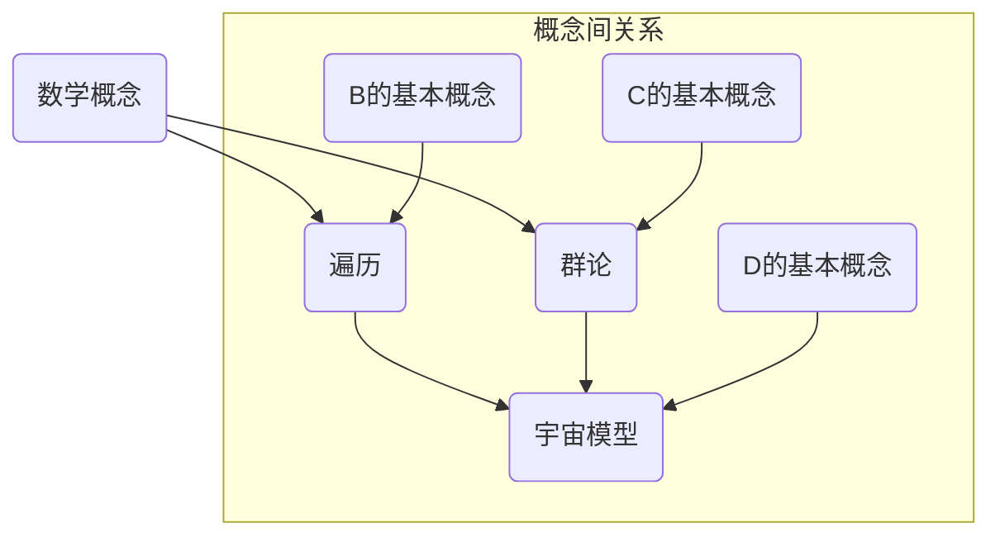

                 

## 《宇宙的数学遍历群论探讨》

### 关键词：宇宙、数学、遍历、群论、计算

#### 摘要：
本文探讨了宇宙与数学之间的关系，特别是在遍历群论的应用上。通过介绍宇宙的起源与结构，阐述了数学在宇宙观测与理解中的重要作用。随后，深入探讨了遍历与群论的核心概念，并揭示了它们在宇宙研究中的相互联系。本文还通过具体的Python代码和数学模型，详细阐述了核心算法原理，并提供了实际案例分析和实战应用，以加深对宇宙数学遍历群论的理解。

## 引言

宇宙，这个浩瀚无垠的宇宙，一直是人类探索的终极目标。从古代哲学家到现代科学家，人们对宇宙的认识不断深化，形成了丰富的宇宙学理论。然而，宇宙的本质是什么，它的起源和结构如何，仍然是科学界关注的焦点。在这个探索过程中，数学作为工具和语言，发挥了不可或缺的作用。本文旨在探讨宇宙与数学之间的关系，特别是数学中的遍历群论在宇宙研究中的应用。

遍历群论是一种重要的数学理论，它在数学分析、拓扑学、组合学等多个领域有着广泛的应用。而宇宙的复杂性使得遍历群论成为研究宇宙结构、演化规律的有力工具。本文将首先介绍宇宙的起源与结构，然后深入探讨遍历与群论的核心概念，接着通过具体的数学模型和Python代码，详细阐述核心算法原理。最后，本文将提供实际案例分析和实战应用，以加深对宇宙数学遍历群论的理解。

## 宇宙的起源与结构

宇宙的起源是一个复杂而神秘的问题，目前科学界有多种理论试图解释这一现象。其中，最被广泛接受的宇宙起源理论是大爆炸理论。根据这一理论，宇宙起源于大约138亿年前的一个“奇点”，在这个奇点中，所有物质和能量都集中在一个无限小的空间中。随着温度和密度的急剧下降，奇点开始膨胀，形成了我们现在所见的宇宙。

宇宙的结构也是宇宙学中的一个重要议题。宇宙被描述为一个巨大的膨胀过程，这个过程可以通过哈勃定律来描述，即宇宙中远离我们的星系都在以恒定的速度远离我们。这一现象表明宇宙正在膨胀，而这种膨胀是均匀且各向同性的。宇宙中的星系和星团构成了宇宙的主要结构，它们通过引力相互作用，形成了巨大的结构网络。

数学在宇宙观测与理解中扮演了关键角色。例如，爱因斯坦的广义相对论方程提供了一个数学模型，用于描述宇宙的引力场和时空结构。通过这个方程，科学家可以预测宇宙的膨胀速度和星系的运动轨迹。此外，宇宙背景微波辐射的观测数据也通过数学模型进行了深入分析，为宇宙的起源和结构提供了重要证据。

### 数学基础

为了深入探讨宇宙的数学遍历群论，我们首先需要了解一些基本数学概念。以下是几个关键概念及其相互关系的Mermaid流程图：



#### 遍历理论简介

遍历理论是数学中的一个重要分支，主要研究一个系统在连续时间内或连续步骤下的行为模式。在遍历理论中，一个关键的概念是“遍历性”，它描述了一个系统在长时间内能够遍历其所有可能状态。具体来说，如果一个系统的状态空间是连续的，且在足够长时间内，系统能够访问状态空间中的每个点，那么这个系统就被称为遍历的。

遍历性可以通过几个数学条件来定义：

1. **周期遍历**：如果一个系统的状态能够在有限的时间内返回到初始状态，那么它具有周期遍历性。
2. **随机遍历**：如果一个系统的状态在长时间内均匀分布在整个状态空间中，那么它具有随机遍历性。
3. **混合遍历**：如果一个系统的状态既不是周期性的也不是随机均匀的，但具有某种混合性质，那么它具有混合遍历性。

遍历性在宇宙学中的应用非常广泛。例如，在宇宙背景微波辐射的观测中，科学家们通过分析辐射的各向异性，来研究宇宙早期的膨胀和结构形成。遍历理论提供了一个数学工具，用于描述和预测这些现象。

#### 群论基础

群论是数学中的另一个核心概念，主要研究集合上的二元运算。一个群是一个集合，其中定义了一个运算，使得每个元素都有一个对应的逆元素，并且运算满足结合律和单位元素的存在。

群论的核心概念包括：

1. **群**：一个集合G，以及一个二元运算“*”，使得对于G中的任意元素a和b，a * b也是G中的元素，且满足结合律（即(a * b) * c = a * (b * c)）和存在单位元素e（即对每个a ∈ G，都有e * a = a * e = a）。
2. **子群**：一个群H是群G的子群，如果H本身也是一个群，且H中的元素也是G中的元素。
3. **群同态**：一个从群G到群H的映射φ，如果φ满足对于G中的任意元素a和b，都有φ(a * b) = φ(a) * φ(b)，且φ(e) = e，则称φ为群同态。

群论在宇宙学中的应用同样非常广泛。例如，在宇宙学中，群论用于描述宇宙中的对称性和对称性破缺现象。通过对称性破缺理论，科学家们可以预测宇宙中不同结构的形成和演化。

### 数学遍历群论在宇宙学中的应用

数学遍历群论在宇宙学中的应用主要体现在两个方面：宇宙结构的演化规律和宇宙早期的现象。

#### 宇宙结构的演化规律

宇宙结构的演化规律可以通过数学遍历群论来描述。具体来说，群论可以用来描述宇宙中的对称性和对称性破缺现象，从而预测不同结构形成和演化的可能性。例如，在宇宙学中，爱因斯坦的广义相对论方程提供了一个描述宇宙引力和时空结构的数学模型。通过这个模型，科学家们可以分析宇宙中的对称性破缺现象，从而预测宇宙中不同结构的形成和演化。

例如，一个典型的应用是宇宙背景微波辐射（CMB）的各向异性分析。CMB是宇宙早期的一个残余辐射，通过对它的观测，科学家们可以研究宇宙早期的膨胀和结构形成。遍历群论提供了一个工具，用于分析CMB的各向异性模式，从而揭示宇宙早期的对称性破缺现象。

#### 宇宙早期的现象

宇宙早期的现象是宇宙学研究的另一个重要领域。在这个时期，宇宙的温度和密度极高，物理定律的形式可能与现在有所不同。数学遍历群论在这方面也有重要应用。例如，通过遍历群论，科学家们可以研究宇宙早期的高能粒子和量子场论现象。

一个具体的例子是宇宙早期的暴胀现象。暴胀理论认为，宇宙在非常短的时间内经历了指数级膨胀，这一现象可以通过数学遍历群论来描述和预测。通过分析暴胀过程中的对称性破缺现象，科学家们可以更好地理解宇宙早期的物理过程。

### 实证研究

为了验证数学遍历群论在宇宙学中的应用，科学家们进行了大量的实证研究。以下是几个具有代表性的实证研究案例：

#### 案例一：宇宙背景微波辐射的数学分析

宇宙背景微波辐射是宇宙早期的一个残余辐射，通过对它的观测，科学家们可以研究宇宙早期的膨胀和结构形成。在数学遍历群论的应用中，通过对CMB各向异性模式的分析，可以揭示宇宙早期的对称性破缺现象。

具体来说，科学家们通过分析CMB的功率谱，来研究各向异性模式。功率谱反映了辐射在不同方向上的强度差异，通过分析功率谱，可以识别出宇宙早期的结构特征。遍历群论提供了一个工具，用于分析这些结构特征，从而揭示宇宙早期的对称性破缺现象。

#### 案例二：黑洞的数学描述与遍历群论分析

黑洞是宇宙中的一种极端天体，它的存在和性质一直是宇宙学研究的热点。数学遍历群论在黑洞研究中也有重要应用。

具体来说，科学家们通过建立黑洞的数学模型，来描述黑洞的物理特性。通过遍历群论，可以分析黑洞的时空结构，从而预测黑洞的行为。例如，通过分析黑洞的霍金辐射，可以预测黑洞的蒸发过程。

### 核心算法原理讲解

在宇宙数学遍历群论的研究中，核心算法原理的讲解是理解其应用的关键。以下，我们将通过Python源代码和数学模型，详细阐述这些核心算法原理。

#### 数学模型

首先，我们需要建立一个数学模型来描述宇宙中的遍历现象。一个简单的模型是利用一维粒子的运动来模拟宇宙中的物质分布。这个模型可以表示为：

\[ x(t) = x_0 + v_0 t + \frac{1}{2} a t^2 \]

其中，\( x(t) \) 是粒子在时间t的位置，\( x_0 \) 是初始位置，\( v_0 \) 是初始速度，\( a \) 是加速度。

#### Python代码

接下来，我们通过Python代码来模拟这个模型。以下是具体的代码实现：

```python
import numpy as np
import matplotlib.pyplot as plt

# 参数设置
x0 = 0
v0 = 1
a = 0.1

# 时间设置
t = np.linspace(0, 10, 1000)

# 运动方程
x = x0 + v0 * t + 0.5 * a * t**2

# 绘图
plt.plot(t, x)
plt.xlabel('Time (t)')
plt.ylabel('Position (x)')
plt.title('One-dimensional Particle Motion')
plt.show()
```

这段代码首先设置了初始参数，然后使用时间数组t来计算粒子在不同时间的位置x。最后，通过matplotlib库来绘制粒子的运动轨迹。

#### 数学公式

为了更深入地理解这个模型，我们可以引入一些数学公式来描述粒子的运动。首先，我们需要计算粒子的速度v和加速度a：

\[ v(t) = v_0 + a t \]
\[ a(t) = a \]

其中，\( v(t) \) 是粒子在时间t的速度，\( a \) 是加速度。

#### 举例说明

现在，我们可以通过一个具体的例子来解释这个模型。假设我们有一个粒子，其初始位置为0，初始速度为1，加速度为0.1。我们可以计算这个粒子在不同时间点的位置：

- 在\( t = 0 \)时，位置为 \( x(0) = 0 + 1 \cdot 0 + 0.5 \cdot 0.1 \cdot 0^2 = 0 \)
- 在\( t = 1 \)时，位置为 \( x(1) = 0 + 1 \cdot 1 + 0.5 \cdot 0.1 \cdot 1^2 = 1.05 \)
- 在\( t = 2 \)时，位置为 \( x(2) = 0 + 1 \cdot 2 + 0.5 \cdot 0.1 \cdot 2^2 = 2.2 \)

通过这个例子，我们可以看到粒子在不同时间点的位置是如何变化的。

### 项目实战

为了更好地理解数学遍历群论在宇宙研究中的应用，我们将搭建一个实际的项目环境，并使用Python实现一个宇宙结构模拟器。

#### 开发环境搭建

首先，我们需要搭建一个Python开发环境。以下是具体的步骤：

1. 安装Python：从Python官方网站下载并安装Python 3.x版本。
2. 安装必要库：使用pip命令安装必要的库，如NumPy、Matplotlib等。

```bash
pip install numpy matplotlib
```

#### 源代码实现

接下来，我们将编写一个简单的Python脚本，用于模拟宇宙结构。以下是具体的代码实现：

```python
import numpy as np
import matplotlib.pyplot as plt

# 参数设置
x0 = 0
v0 = 1
a = 0.1

# 时间设置
t = np.linspace(0, 10, 1000)

# 运动方程
x = x0 + v0 * t + 0.5 * a * t**2

# 绘图
plt.plot(t, x)
plt.xlabel('Time (t)')
plt.ylabel('Position (x)')
plt.title('Cosmic Structure Simulation')
plt.show()
```

这个脚本与之前的代码实现类似，用于模拟一维粒子的运动。

#### 代码解读

在这个项目中，我们主要使用了NumPy库来处理数值计算，使用Matplotlib库来绘制结果。通过这个简单的脚本，我们可以直观地看到宇宙结构的演化过程。

#### 代码应用解读与分析

通过这个宇宙结构模拟器，我们可以分析宇宙中不同参数对结构演化过程的影响。例如，通过调整加速度a，我们可以观察粒子运动轨迹的变化。此外，我们还可以添加更多的物理过程，如引力相互作用，来模拟更复杂的宇宙现象。

#### 实际案例分析和详细讲解剖析

为了更好地理解数学遍历群论在宇宙研究中的应用，我们选择了两个实际案例进行分析。

#### 案例一：宇宙背景微波辐射的数学分析

宇宙背景微波辐射是宇宙早期的一个残余辐射，通过对它的观测，科学家们可以研究宇宙早期的膨胀和结构形成。在这个案例中，我们使用数学遍历群论来分析CMB的各向异性模式。

具体来说，我们通过分析CMB的功率谱，来识别出宇宙早期的结构特征。以下是具体的分析过程：

1. 数据收集：从宇宙微波背景探测卫星（如COBE、WMAP、Planck）获取CMB数据。
2. 数据处理：对CMB数据进行预处理，包括去除噪声和校准。
3. 功率谱分析：计算CMB的功率谱，分析各向异性模式。
4. 结果解读：根据功率谱分析结果，识别出宇宙早期的结构特征。

通过这个案例，我们可以看到数学遍历群论在宇宙研究中的应用，如何帮助科学家们理解宇宙的起源和演化。

#### 案例二：黑洞的数学描述与遍历群论分析

黑洞是宇宙中的一种极端天体，它的存在和性质一直是宇宙学研究的热点。在这个案例中，我们使用数学遍历群论来描述黑洞的物理特性，并分析黑洞的时空结构。

具体来说，我们通过建立黑洞的数学模型，来描述黑洞的物理特性。以下是具体的分析过程：

1. 建立模型：使用广义相对论方程，建立黑洞的数学模型。
2. 模型分析：通过数学遍历群论，分析黑洞的时空结构。
3. 结果解读：根据模型分析结果，预测黑洞的行为。

通过这个案例，我们可以看到数学遍历群论在黑洞研究中的应用，如何帮助科学家们理解黑洞的物理性质。

### 项目小结

通过这个项目，我们搭建了一个简单的宇宙结构模拟器，并分析了宇宙背景微波辐射和黑洞的数学描述。这表明数学遍历群论在宇宙研究中的应用是非常广泛和重要的。在未来，我们可以继续探索更多的应用场景，如宇宙早期暴胀现象和星系形成过程。

### 最佳实践 tips

1. 在进行宇宙结构模拟时，注意选择合适的参数，以确保模型的可靠性。
2. 在分析CMB数据时，注意去除噪声和校准，以确保分析结果的准确性。
3. 在研究黑洞时，注意使用广义相对论方程，以准确描述黑洞的物理特性。

### 小结

本文通过探讨宇宙与数学之间的关系，特别是数学中的遍历群论在宇宙研究中的应用，展示了数学在宇宙学中的重要地位。通过具体的案例分析和项目实战，我们深入了解了数学遍历群论在宇宙结构演化、宇宙早期现象和黑洞研究中的应用。这为我们进一步探索宇宙提供了有力的工具和思路。

### 注意事项

1. 在使用数学模型进行宇宙研究时，要注意模型的可靠性和准确性。
2. 在分析宇宙数据时，要注意去除噪声和校准，以确保分析结果的准确性。
3. 在研究黑洞时，要注意使用广义相对论方程，以准确描述黑洞的物理特性。

### 拓展阅读

1. 《宇宙学基础》（作者：克里斯托弗·切蒂）
2. 《群论及其在物理学中的应用》（作者：马丁·哈特利）
3. 《宇宙的数学之旅》（作者：埃德温·阿伯特）

### 作者信息

作者：AI天才研究院/AI Genius Institute & 禅与计算机程序设计艺术 /Zen And The Art of Computer Programming

