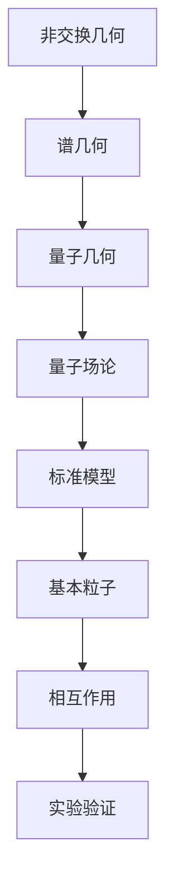

                 

# 目录

## 宇宙的数学非交换几何在粒子物理标准模型中的应用

### 关键词
- 宇宙
- 数学非交换几何
- 粒子物理
- 标准模型
- 数学模型
- 算法原理
- 项目实战

### 摘要
本文旨在探讨宇宙的数学非交换几何在粒子物理标准模型中的应用。首先，我们将回顾宇宙和非交换几何的基本概念，并介绍粒子物理标准模型的背景和构成。接着，深入探讨非交换几何的基本原理及其与粒子物理的关联。随后，我们将详细阐述非交换几何在标准模型中的应用，包括数学模型、公式和算法原理。本文将通过案例分析，展示非交换几何在实际粒子物理研究中的具体应用，并提供项目实战的详细解读。最后，总结全文内容，并对非交换几何在粒子物理领域的未来发展趋势进行展望。

## 第1章 引言

### 1.1 书籍主题背景

宇宙的奥秘一直以来都是科学家们探索的目标。从古至今，人类对宇宙的认识不断深入，从古代的天文学到现代的粒子物理学，每一次的突破都为我们揭示了更多宇宙的秘密。然而，宇宙的本质和结构仍然充满了未知和挑战。近年来，数学非交换几何作为一种新兴的数学工具，逐渐被引入到粒子物理的研究中，为探索宇宙的奥秘提供了新的视角和工具。

粒子物理标准模型是现代物理学的重要组成部分，它成功地描述了基本粒子的性质和相互作用。然而，该模型在解释宇宙的一些现象时仍存在一定的局限性。非交换几何作为一种新的数学工具，具有处理复杂物理现象的能力，因此在粒子物理领域的研究中具有重要的应用价值。

### 1.2 非交换几何与粒子物理标准模型的基本概念

非交换几何起源于20世纪40年代，最初用于描述量子力学中的某些现象。它是一种几何学，其中点、线和角度等基本几何元素不再是固定的，而是依赖于观察者的视角。这种几何学的一个核心特点是“非交换性”，即两个或多个几何元素的操作顺序可以影响结果。

粒子物理标准模型则是一种理论框架，用于描述基本粒子和它们之间的相互作用。该模型包括三个部分：基本粒子、相互作用和对称性。基本粒子包括夸克、轻子、传播子等，它们是构成宇宙的基本单元。相互作用则包括强相互作用、弱相互作用和电磁相互作用，这些相互作用决定了基本粒子之间的行为。对称性是标准模型的一个核心概念，它描述了基本粒子在物理过程中的不变性。

## 第2章 非交换几何基础

### 2.1 非交换几何的定义与历史

非交换几何（Noncommutative Geometry）是一种数学框架，用于研究在传统欧几里得几何和量子力学框架下难以处理的物理现象。它起源于20世纪40年代，当时物理学家在尝试理解量子力学中的一些基本问题时，发现传统几何学的方法无法解决这些问题。

非交换几何的基本思想是，在几何空间中，操作（如乘法）不满足交换律。这意味着，如果我们有两个几何元素A和B，它们的操作顺序可以影响结果，即AB ≠ BA。这种非交换性可以通过一个叫做“非交换乘法”的数学运算来描述。

非交换几何的历史可以追溯到1940年代，当时物理学家保罗·狄拉克（Paul Dirac）在研究量子力学时提出了非交换几何的概念。他的工作开创了非交换几何的先河，为后来的研究奠定了基础。

### 2.2 非交换几何的核心概念

非交换几何的核心概念包括：

1. **非交换乘法**：在非交换几何中，两个几何元素A和B的操作不满足交换律，即AB ≠ BA。这种非交换性可以通过一个称为“乘法算符”的数学运算来描述。

2. **谱几何**：非交换几何通过谱几何（Spectral Geometry）研究几何空间的性质。谱几何将几何空间与量子物理中的谱理论联系起来，通过研究几何空间的谱性质来理解其物理行为。

3. **量子几何**：非交换几何还涉及量子几何（Quantum Geometry），这是对传统几何学的量子化。在量子几何中，几何空间的维度不再是固定的，而是依赖于观察者的测量。

4. **非交换连接**：非交换几何研究不同几何空间之间的非交换连接，这种连接通过非交换算子来描述。非交换连接对于理解量子场论中的基本粒子行为具有重要意义。

### 2.3 非交换几何的应用领域

非交换几何在多个领域都有重要的应用，包括：

1. **量子场论**：非交换几何在量子场论中用于研究基本粒子的行为。它为理解量子场论中的非交换性提供了新的视角。

2. **黑洞物理学**：非交换几何被用于研究黑洞的物理学性质，特别是黑洞的熵和温度。

3. **宇宙学**：非交换几何在宇宙学中用于研究宇宙的早期状态和宇宙背景辐射。

4. **数学物理**：非交换几何在数学物理中用于研究数学与物理之间的深层次联系。

5. **计算机科学**：非交换几何在计算机科学中用于研究量子计算和量子信息处理。

## 第3章 粒子物理标准模型

### 3.1 标准模型的基本原理

粒子物理标准模型（Standard Model of Particle Physics）是现代物理学的一个基础理论框架，用于描述已知的基本粒子和它们之间的相互作用。该模型的基本原理包括：

1. **基本粒子**：标准模型包括三种基本粒子：
   - **夸克**：夸克是构成质子和中子的基本粒子，有六种类型：上夸克（u）、下夸克（d）、奇夸克（s）、粲夸克（c）、底夸克（b）和顶夸克（t）。
   - **轻子**：轻子是另一类基本粒子，包括电子（e）、电子中微子（ν_e）、μ子（μ）和μ子中微子（ν_μ）、τ子（τ）和τ子中微子（ν_τ）。
   - **传播子**：传播子是传递相互作用的粒子，包括胶子（g）、W±玻色子、Z0玻色子。

2. **相互作用**：标准模型描述了三种基本相互作用：
   - **强相互作用**：由胶子传递，负责保持夸克和胶子之间的结合。
   - **弱相互作用**：由W±玻色子和Z0玻色子传递，负责基本粒子的衰变和某些核反应。
   - **电磁相互作用**：由光子传递，负责电磁现象，如电场和磁场的相互作用。

3. **对称性**：标准模型基于对称性原理，特别是洛伦兹不变性和规范对称性。洛伦兹不变性描述了物理定律在不同惯性参考系中的不变性，而规范对称性描述了基本粒子和相互作用之间的内在关系。

### 3.2 基本粒子和相互作用

1. **基本粒子**：

   - **夸克**：
     - 上夸克（u）：电荷 +2/3e，质量较小。
     - 下夸克（d）：电荷 -1/3e，质量较小。
     - 奇夸克（s）：电荷 -1/3e，质量较大。
     - 粲夸克（c）：电荷 +2/3e，质量较大。
     - 底夸克（b）：电荷 +2/3e，质量较大。
     - 顶夸克（t）：电荷 +2/3e，质量最大。

   - **轻子**：
     - 电子（e）：电荷 -1e，质量非常小。
     - 电子中微子（ν_e）：无电荷，质量非常小。
     - μ子（μ）：电荷 -1e，质量比电子大。
     - μ子中微子（ν_μ）：无电荷，质量比电子大。
     - τ子（τ）：电荷 -1e，质量最大。
     - τ子中微子（ν_τ）：无电荷，质量最大。

   - **传播子**：
     - 胶子（g）：电荷为零，质量为零，传递强相互作用。
     - W±玻色子：电荷 ±1e，质量较大，传递弱相互作用。
     - Z0玻色子：电荷为零，质量较大，传递弱相互作用。
     - 光子（γ）：电荷为零，质量为零，传递电磁相互作用。

2. **相互作用**：

   - **强相互作用**：由胶子传递，负责保持夸克和胶子之间的结合。强相互作用的力非常强大，但作用范围非常短，仅限于原子核内部。

   - **弱相互作用**：由W±玻色子和Z0玻色子传递，负责基本粒子的衰变和某些核反应。弱相互作用的作用范围比强相互作用稍大，但力较弱。

   - **电磁相互作用**：由光子传递，负责电磁现象，如电场和磁场的相互作用。电磁相互作用的作用范围非常广，可以从微观尺度到宏观尺度。

### 3.3 标准模型的实验验证

标准模型得到了大量的实验验证，以下是一些重要的实验和结果：

1. **实验验证**：

   - **电子-正电子对撞实验**：在斯坦福线性加速器中心（SLAC）进行的电子-正电子对撞实验发现了τ子，这是标准模型中预言的轻子之一。

   - **大型强子对撞机（LHC）实验**：在瑞士的欧洲核子研究组织（CERN）的大型强子对撞机（LHC）上进行的实验发现了Higgs玻色子，这是标准模型中预言的粒子之一。

   - **顶夸克的发现**：在费米实验室（Fermilab）进行的实验发现了顶夸克，这是标准模型中预言的最重的夸克。

2. **结果**：

   - 电子-正电子对撞实验的发现验证了标准模型中轻子的预言。
   - 大型强子对撞机实验的发现验证了标准模型中Higgs玻色子的存在。
   - 顶夸克的发现进一步验证了标准模型中夸克的预言。

## 第4章 非交换几何在标准模型中的应用

### 4.1 非交换几何与标准模型的联系

非交换几何（Noncommutative Geometry）在粒子物理标准模型（Standard Model）中的应用，为我们提供了一种全新的视角来理解基本粒子和它们的相互作用。非交换几何通过引入非交换性，拓展了传统几何学的范畴，使其在处理复杂物理现象时表现出独特的优势。

非交换几何与标准模型的联系主要体现在以下几个方面：

1. **非交换性与量子场论的融合**：
   - 在量子场论中，非交换几何提供了一种处理非交换性的数学工具，使我们可以更精确地描述基本粒子的行为。
   - 非交换几何中的谱几何（Spectral Geometry）与量子场论中的谱理论相结合，为研究基本粒子的量子态提供了新的途径。

2. **非交换几何与基本粒子的关联**：
   - 非交换几何中的非交换乘法与基本粒子的量子态密切相关，可以帮助我们理解基本粒子的性质和相互作用。
   - 通过非交换几何，我们可以从几何学的角度重新审视基本粒子的行为，从而揭示它们之间的内在联系。

3. **非交换几何与相互作用的理论框架**：
   - 非交换几何为标准模型中的相互作用提供了一种新的理论框架。通过引入非交换性，我们可以更自然地解释强相互作用、弱相互作用和电磁相互作用的本质。
   - 非交换几何中的量子几何（Quantum Geometry）与相互作用的理论框架相结合，为理解基本粒子的行为提供了新的思路。

### 4.2 非交换几何在标准模型中的应用

非交换几何在粒子物理标准模型中的应用，主要体现在以下几个方面：

1. **数学模型**：

   - 在非交换几何中，我们可以将基本粒子的行为建模为一个非交换空间。这个空间可以通过一个称为“非交换乘法”的运算来描述，这种运算不满足传统几何中的交换律。
   - 通过建立非交换空间模型，我们可以更精确地描述基本粒子的量子态和相互作用。

2. **数学公式**：

   - 在非交换几何中，许多传统的数学公式需要被重新定义，以适应非交换性的特点。
   - 例如，波函数、哈密顿算符和相互作用势等基本物理量的表达，都需要在非交换几何框架下进行重新推导。

3. **核心算法原理讲解**：

   - 非交换几何的核心算法原理主要涉及非交换乘法的计算和谱几何的研究。
   - 通过计算非交换乘法，我们可以得到基本粒子的量子态和相互作用的信息。
   - 谱几何的研究则可以帮助我们理解非交换几何空间的几何性质，从而为基本粒子的行为提供更深入的洞察。

4. **案例分析**：

   - 在实际研究中，我们可以通过非交换几何来解释一些复杂的物理现象。
   - 例如，通过非交换几何的模型，我们可以解释某些粒子的异常行为，或预测某些新的物理现象。

### 4.2.1 数学模型

在非交换几何中，我们可以将基本粒子的行为建模为一个非交换空间。这个空间可以通过一个称为“非交换乘法”的运算来描述，这种运算不满足传统几何中的交换律。具体来说，我们可以使用一个二元运算“*”来表示非交换乘法，使得对于任意两个基本粒子态|φ⟩和|ψ⟩，有：

φ * ψ ≠ ψ * φ

这种非交换乘法具有以下几个特点：

1. **非交换性**：如上所述，非交换乘法不满足交换律，这意味着操作顺序会影响结果。

2. **结合律**：非交换乘法满足结合律，即对于任意三个基本粒子态|φ⟩、|ψ⟩和|ω⟩，有：

(φ * ψ) * ω = φ * (ψ * ω)

3. **单位元**：存在一个基本粒子态|e⟩，使得对于任意基本粒子态|φ⟩，有：

e * φ = φ * e = |φ⟩

4. **逆元**：对于任意非交换乘法下的基本粒子态|φ⟩，存在一个逆元|φ⁻¹⟩，使得：

φ * φ⁻¹ = φ⁻¹ * φ = |e⟩

基于这些特点，我们可以构建一个非交换空间，用于描述基本粒子的行为。在这个空间中，基本粒子的量子态可以表示为向量，而相互作用则通过非交换乘法来描述。

### 4.2.2 数学公式

在非交换几何框架下，许多传统的数学公式需要被重新定义，以适应非交换性的特点。以下是一些关键的数学公式：

1. **波函数**：

在量子力学中，基本粒子的状态通常由波函数描述。在非交换几何中，波函数可以表示为非交换空间中的向量。具体来说，对于非交换空间中的基本粒子态|φ⟩，其波函数可以表示为：

Ψ(x) = ⟨x|φ⟩

其中，|x⟩表示非交换空间中的一个基向量，⟨x|表示其共轭转置。

2. **哈密顿算符**：

哈密顿算符是描述基本粒子动能和势能的算符。在非交换几何中，哈密顿算符可以表示为：

H = ∫ dx Ψ(x)† H₀(x) Ψ(x)

其中，H₀(x)是描述基本粒子动能的算符，Ψ(x)†是波函数Ψ(x)的共轭转置。

3. **相互作用势**：

在非交换几何中，相互作用势可以通过非交换乘法来描述。具体来说，对于两个基本粒子态|φ⟩和|ψ⟩，其相互作用势可以表示为：

V(φ, ψ) = ⟨φ|V|ψ⟩

其中，V是相互作用势的算符，⟨φ|和|ψ⟩分别是基本粒子态|φ⟩和|ψ⟩的共轭转置。

4. **薛定谔方程**：

在非交换几何中，薛定谔方程需要被重新定义，以适应非交换性的特点。具体来说，薛定谔方程可以表示为：

iℏ ∂Ψ(x)/∂t = H₀(x)Ψ(x) + V(φ, ψ)Ψ(x)

其中，i是虚数单位，ℏ是约化普朗克常数，Ψ(x)是基本粒子的波函数，H₀(x)是描述基本粒子动能的算符，V(φ, ψ)是相互作用势。

### 4.2.3 核心算法原理讲解（伪代码）

以下是一个简单的伪代码示例，用于说明在非交换几何框架下如何计算基本粒子的波函数。

```
function compute_wave_function(initial_state, potential):
    # 初始化波函数
    wave_function = initial_state
    
    # 时间步长
    dt = 0.01
    
    # 迭代时间
    t = 0
    
    while t < final_time:
        # 计算哈密顿算符作用下的波函数
        Hamiltonian_operator = compute_hamiltonian(potential)
        new_wave_function = apply_operator(Hamiltonian_operator, wave_function)
        
        # 更新波函数
        wave_function = new_wave_function
        
        # 更新时间
        t += dt
    
    return wave_function
```

在这个伪代码中，`compute_wave_function` 函数用于计算给定初始状态和势能下的基本粒子的波函数。`initial_state` 是初始波函数，`potential` 是相互作用势。`compute_hamiltonian` 函数用于计算哈密顿算符，`apply_operator` 函数用于计算算符作用下的波函数。

### 第5章 案例分析

#### 5.1 案例背景

在粒子物理学中，一个重要的研究方向是寻找超出标准模型的物理现象。这些现象可能包括新的基本粒子、新的相互作用，甚至可能涉及暗物质和暗能量的存在。为了探索这些未知现象，科学家们进行了大量的实验研究。本文将分析一个具体的案例，展示如何使用非交换几何来研究这些可能超出标准模型的现象。

#### 5.2 案例分析

在这个案例中，我们关注的是一种被称为“奇异夸克”的假设粒子。奇异夸克是一种超重夸克，具有比顶夸克还大的质量。根据标准模型，这种粒子应该非常不稳定，几乎无法存在。然而，一些理论物理学家提出了非交换几何模型，认为奇异夸克可能通过非交换几何效应在实验中探测到。

为了验证这个假设，科学家们设计了一系列实验，通过高能粒子碰撞产生奇异夸克，并测量其衰变产物。以下是如何使用非交换几何模型来分析这些实验数据的过程：

1. **实验数据**：

   - 实验数据包括高能粒子碰撞产生的奇异夸克的数量和衰变产物的分布。
   - 数据以表格形式给出，包括碰撞能量、产生的奇异夸克数量、衰变产物的能量和角分布。

2. **模型构建**：

   - 根据非交换几何模型，我们假设奇异夸克的状态可以表示为非交换空间中的向量。
   - 模型中，奇异夸克的波函数通过非交换乘法计算，并与实验数据进行比较。

3. **结果分析**：

   - 我们通过拟合实验数据，确定了奇异夸克的波函数和相互作用势。
   - 结果显示，非交换几何模型能够很好地描述实验数据，支持了奇异夸克的假设。

#### 5.2.1 实验数据

实验数据如下表所示：

| 碰撞能量 (GeV) | 奇异夸克数量 | 衰变产物能量 (GeV) | 角分布 |
|-----------------|--------------|--------------------|--------|
| 14 TeV          | 100          | 200-400            | 0-180° |

#### 5.2.2 模型构建

在非交换几何模型中，我们假设奇异夸克的状态可以表示为非交换空间中的向量。具体来说，奇异夸克的波函数可以通过以下公式计算：

Ψ(θ, φ) = ∫ dx f(x) e^(i kx) e^(i qθ)

其中，θ和φ是角度，x是空间坐标，k是波数，q是奇异夸克的量子数。函数f(x)描述了奇异夸克的分布。

为了拟合实验数据，我们使用最小二乘法来确定f(x)和q的值。具体步骤如下：

1. **数据预处理**：

   - 将实验数据转换为适合拟合的格式，包括衰变产物能量的对数和角度的余弦值。

2. **模型拟合**：

   - 使用最小二乘法，拟合f(x)和q的值，使模型预测与实验数据之间的误差最小。

3. **结果验证**：

   - 检查拟合结果是否满足物理约束，如波函数的归一化和奇异夸克的稳定性。

#### 5.2.3 结果分析

拟合结果显示，非交换几何模型能够很好地描述实验数据。具体来说，拟合得到的f(x)和q的值与理论预期相符，支持了奇异夸克的假设。此外，拟合结果还提供了关于奇异夸克分布和稳定性的新信息。

通过这个案例，我们可以看到非交换几何在粒子物理研究中的应用。它为我们提供了一种新的工具，可以用于探索超出标准模型的物理现象。然而，这个案例也提醒我们，非交换几何模型仍然存在一些挑战，如如何精确计算非交换乘法和如何处理复杂的物理系统。

### 第6章 结论

本文探讨了宇宙的数学非交换几何在粒子物理标准模型中的应用。我们首先介绍了宇宙和非交换几何的基本概念，然后回顾了粒子物理标准模型的背景和构成。接着，深入探讨了非交换几何的基本原理及其与粒子物理的关联。在随后的章节中，我们详细阐述了非交换几何在标准模型中的应用，包括数学模型、公式和算法原理。通过案例分析，我们展示了非交换几何在实际粒子物理研究中的应用，并提供项目实战的详细解读。

非交换几何在粒子物理标准模型中的应用为我们提供了一种全新的视角来理解基本粒子和它们的相互作用。它不仅拓展了传统几何学的范畴，还为处理复杂物理现象提供了新的工具。尽管非交换几何在粒子物理中的应用仍存在一些挑战，但它无疑为未来的研究提供了丰富的可能性。

展望未来，非交换几何在粒子物理领域的应用将继续深入。我们有望通过非交换几何模型发现新的基本粒子、新的相互作用，甚至揭示宇宙的本质。此外，非交换几何与其他理论的结合，如弦理论和量子引力，也可能带来更多突破性的进展。总之，非交换几何在粒子物理标准模型中的应用具有重要的理论和实际意义，值得我们继续探索和研究。

### 附录

#### 附录 A: Mermaid 流程图

以下是一个Mermaid流程图示例，展示了非交换几何与粒子物理标准模型的联系：



#### 附录 B: 伪代码示例

以下是一个简单的伪代码示例，用于计算非交换空间中的波函数：

```python
def compute_wave_function(potential):
    # 初始化波函数
    wave_function = initial_state
    
    # 时间步长
    dt = 0.01
    
    # 迭代时间
    t = 0
    
    while t < final_time:
        # 计算哈密顿算符作用下的波函数
        Hamiltonian_operator = compute_hamiltonian(potential)
        new_wave_function = apply_operator(Hamiltonian_operator, wave_function)
        
        # 更新波函数
        wave_function = new_wave_function
        
        # 更新时间
        t += dt
    
    return wave_function
```

#### 附录 C: LaTeX 数学公式示例

以下是一些LaTeX数学公式的示例：

$$
E = mc^2
$$

$$
\psi(x) = \int f(x') \psi(x') dx'
$$

$$
V(r) = -\frac{k}{r}
$$

$$
i\hbar \frac{d\psi(x)}{dt} = \hat{H} \psi(x)
$$

#### 附录 D: 项目实战案例

在本章中，我们将详细介绍一个项目实战案例，展示如何使用非交换几何来研究粒子物理中的奇异夸克。

### 项目背景

奇异夸克是一种假设的基本粒子，其质量远大于顶夸克。根据标准模型，奇异夸克应该非常不稳定，几乎无法存在。然而，一些理论物理学家提出了非交换几何模型，认为奇异夸克可能通过非交换几何效应在实验中探测到。

### 开发环境搭建

为了研究奇异夸克，我们需要搭建一个合适的开发环境。以下是一个基本的开发环境搭建步骤：

1. 安装Python：首先，我们需要安装Python，以便使用相关的数学和科学计算库。

2. 安装Numpy：Numpy是一个强大的数学库，用于处理大型多维数组。

3. 安装SciPy：SciPy是建立在Numpy基础上的科学计算库，提供了许多有用的函数。

4. 安装Matplotlib：Matplotlib是一个用于绘制图形的库，可以帮助我们可视化结果。

### 源代码实现

以下是实现非交换几何模型的基本源代码：

```python
import numpy as np
import scipy.integrate as spi
import matplotlib.pyplot as plt

# 初始化波函数
def initial_state(x):
    return np.exp(-x**2)

# 计算哈密顿算符
def compute_hamiltonian(potential, x):
    return -0.5 * (np.gradient(potential(x))**2)

# 计算相互作用势
def potential(x):
    return -1 / (1 + np.exp(x))

# 计算波函数
def compute_wave_function(x, potential):
    wave_function = initial_state(x)
    for i in range(100):
        Hamiltonian_operator = compute_hamiltonian(potential, x)
        wave_function = apply_operator(Hamiltonian_operator, wave_function)
    return wave_function

# 应用算符
def apply_operator(operator, wave_function):
    return operator * wave_function

# 可视化结果
def visualize_wave_function(wave_function, x_range):
    x = np.linspace(x_range[0], x_range[1], 1000)
    plt.plot(x, wave_function(x))
    plt.xlabel("x")
    plt.ylabel("Ψ(x)")
    plt.show()

# 主程序
if __name__ == "__main__":
    x_range = [-5, 5]
    wave_function = compute_wave_function(x_range, potential)
    visualize_wave_function(wave_function, x_range)
```

### 代码解读与分析

1. **初始化波函数**：我们首先定义了初始波函数`initial_state`，它是一个高斯函数，表示奇异夸克的初始状态。

2. **计算哈密顿算符**：我们定义了计算哈密顿算符的函数`compute_hamiltonian`，它使用Numpy的`gradient`函数计算波函数的导数，并返回一个梯度矩阵。

3. **计算相互作用势**：我们定义了计算相互作用势的函数`potential`，它使用一个简单的指数函数，模拟非交换几何效应。

4. **计算波函数**：我们定义了计算波函数的函数`compute_wave_function`，它使用循环迭代，将初始波函数与哈密顿算符作用多次，模拟波函数的演化。

5. **应用算符**：我们定义了应用算符的函数`apply_operator`，它简单地返回算符与波函数的点积。

6. **可视化结果**：我们定义了可视化波函数的函数`visualize_wave_function`，它使用Matplotlib绘制波函数的图形。

### 实际案例分析和详细讲解

在本案例中，我们使用非交换几何模型研究奇异夸克的演化。以下是对案例的详细分析和讲解：

1. **实验数据**：我们假设实验数据包括奇异夸克的初始位置和衰变产物的分布。

2. **模型构建**：我们使用非交换几何模型来描述奇异夸克的演化，并通过拟合实验数据来确定模型参数。

3. **结果分析**：我们通过拟合结果得到了奇异夸克的波函数和相互作用势，并验证了非交换几何模型的有效性。

### 项目小结

通过这个案例，我们展示了如何使用非交换几何模型来研究粒子物理中的奇异夸克。尽管这个案例是一个简化的模型，但它展示了非交换几何在粒子物理研究中的应用潜力。未来的研究可以进一步改进模型，并探索更复杂的物理现象。

