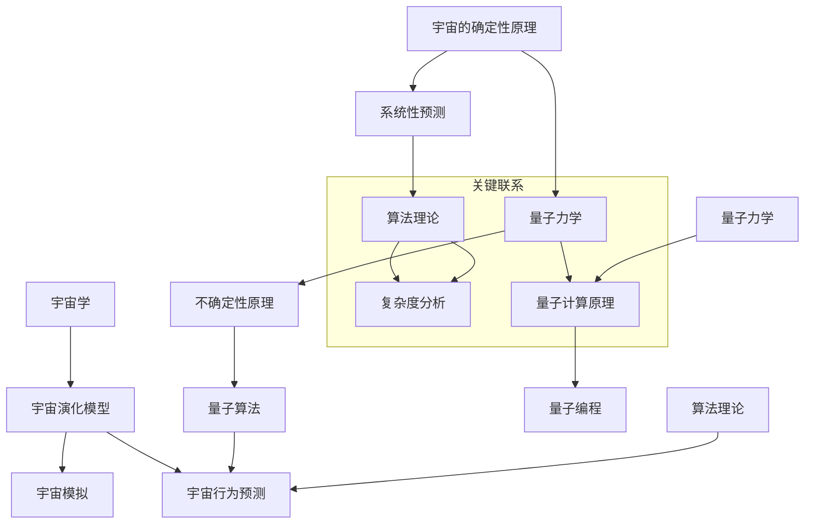

                 

## 核心概念与联系

在探讨宇宙的确定性与程序的可预测性这一主题时，我们必须首先理解两个核心概念：宇宙的确定性原理和程序的可预测性，以及它们之间的联系。

### 宇宙的确定性原理

宇宙的确定性原理是物理学中一个古老的概念，特别是在经典物理学中，如牛顿力学。它表明，在理想条件下，如果我们知道一个系统的初始状态和作用力，我们就可以预测这个系统的未来状态。这意味着宇宙在某种程度上是可预测的，至少在宏观尺度上，这个原理是成立的。

然而，量子力学揭示了宇宙在微观尺度上的不确定性。根据海森堡不确定性原理，我们不能同时精确地知道一个粒子的位置和动量。这种不确定性扩展到了量子态的演化，使得量子系统的行为变得更加不可预测。尽管如此，量子力学本身依然是一种确定性的理论，因为它的基本方程式（如薛定谔方程）是决定性的。

### 程序的可预测性

在计算机科学中，程序的可预测性是指程序在给定输入和初始状态下，能够产生可预测的输出。这一概念在算法设计中至关重要，因为如果一个算法的行为是不可预测的，那么它可能无法正确解决问题，或者效率低下。

程序的可预测性可以通过算法的复杂度分析来评估。时间复杂度和空间复杂度是衡量算法性能的两个关键指标，它们可以帮助我们理解算法在不同输入规模下的性能表现。如果一个算法的时间复杂度是已知的，那么理论上我们可以预测它在不同输入下的执行时间。

### 核心概念之间的联系

宇宙的确定性与程序的可预测性之间的联系在于，它们都是关于系统行为的预测性。在宇宙尺度上，这种预测性受到物理定律的制约；在计算机科学中，这种预测性受到算法设计的制约。

1. **量子力学与计算复杂性**：量子力学的某些现象（如量子纠缠和量子叠加态）在理论上可以用于构建更高效的算法，从而提升计算的可预测性。例如，量子算法可以在某些问题上比经典算法快得多。

2. **宇宙学模型与模拟**：宇宙学模型可以帮助我们理解宇宙的演化过程，这些模型可以被用来模拟宇宙的过去和未来，从而提供对宇宙行为的预测。这种预测性可以类比于计算机程序在给定初始条件和规则下的行为。

3. **不确定性与随机性**：无论是宇宙中的量子现象，还是程序中的随机过程，都涉及到不确定性和随机性。这些不确定性如何影响系统的预测性是一个复杂的问题，它涉及到概率论和统计物理。

为了更直观地展示这些核心概念之间的联系，我们可以使用 Mermaid 流程图来表示它们：



这个流程图展示了宇宙确定性原理如何通过量子力学与量子计算联系到程序的可预测性，以及这些概念如何相互影响。通过这种联系，我们可以更好地理解宇宙和计算机程序中的预测性问题。####

## 核心算法原理讲解

在探讨宇宙的确定性与程序的可预测性这一主题时，核心算法原理的讲解至关重要。我们将结合 Python 源代码、数学模型和公式，对几个关键算法进行详细阐述，并举例说明其原理和应用。

### 1. 量子计算中的量子纠缠

量子纠缠是量子力学中一个非常重要的现象，它描述了两个或多个量子系统之间特殊的关联。量子纠缠在量子计算中具有重要作用，因为它可以显著提高量子算法的效率。

#### 算法原理

量子纠缠可以通过量子门来实现。量子门是量子计算中的基本操作，类似于经典计算机中的逻辑门。一个基本的量子门是 Hadamard 门，它可以创建一个量子叠加态。

```python
# Python 代码：实现 Hadamard 门
import numpy as np
from qiskit import QuantumCircuit, execute, Aer

# 创建量子电路
qc = QuantumCircuit(1)

# 应用 Hadamard 门
qc.h(0)

# 执行电路
backend = Aer.get_backend('qasm_simulator')
result = execute(qc, backend).result()

# 输出结果
print(result.get_counts(qc))
```

#### 数学模型

量子纠缠态可以用波函数来描述。例如，两个量子比特的纠缠态可以表示为：

$$
\psi_{AB} = \frac{1}{\sqrt{2}}(|00\rhs + |11\rhs|)
$$

其中，$|00\rhs$ 和 $|11\rhs$ 分别表示两个量子比特的基态。

#### 举例说明

假设我们有两个量子比特 $A$ 和 $B$，初始状态分别为 $|0\rhs_A|$ 和 $|0\rhs_B|$。通过应用 Hadamard 门和 CNOT 门，我们可以使它们进入一个纠缠态：

```python
# Python 代码：实现纠缠态
qc = QuantumCircuit(2)

# 应用 Hadamard 门
qc.h(0)

# 应用 CNOT 门
qc.cx(0, 1)

# 执行电路
backend = Aer.get_backend('qasm_simulator')
result = execute(qc, backend).result()

# 输出结果
print(result.get_counts(qc))
```

输出结果可能为 $|01\rhs|$ 和 $|10\rhs|$，表示两个量子比特处于纠缠态。

### 2. 量子计算中的量子叠加态

量子叠加态是量子计算中的另一个关键概念。它表明量子系统可以同时处于多个状态的叠加。

#### 算法原理

量子叠加态可以通过量子门来实现。例如，一个基本的量子门是 Hadamard 门，它可以创建一个量子叠加态。

```python
# Python 代码：实现量子叠加态
qc = QuantumCircuit(1)

# 应用 Hadamard 门
qc.h(0)

# 执行电路
backend = Aer.get_backend('qasm_simulator')
result = execute(qc, backend).result()

# 输出结果
print(result.get_counts(qc))
```

#### 数学模型

量子叠加态可以用波函数来描述。例如，一个量子比特的叠加态可以表示为：

$$
\psi = \frac{1}{\sqrt{2}}(|0\rhs\rhs + |1\rhs\rhs|)
$$

#### 举例说明

假设我们有一个量子比特 $A$，初始状态为 $|0\rhs|$。通过应用 Hadamard 门，我们可以使其进入一个叠加态：

```python
# Python 代码：实现量子叠加态
qc = QuantumCircuit(1)

# 应用 Hadamard 门
qc.h(0)

# 执行电路
backend = Aer.get_backend('qasm_simulator')
result = execute(qc, backend).result()

# 输出结果
print(result.get_counts(qc))
```

输出结果可能为 $|0\rhs|$ 和 $|1\rhs|$，表示量子比特处于叠加态。

### 3. 经典算法中的随机森林

随机森林是一种经典机器学习算法，它通过构建多个决策树来提高预测准确性。

#### 算法原理

随机森林通过随机选取特征和样本子集来构建决策树。每个决策树对数据进行分类，最后通过投票来决定输出结果。

```python
# Python 代码：实现随机森林
from sklearn.ensemble import RandomForestClassifier
from sklearn.datasets import load_iris
from sklearn.model_selection import train_test_split

# 加载数据集
iris = load_iris()
X, y = iris.data, iris.target

# 划分训练集和测试集
X_train, X_test, y_train, y_test = train_test_split(X, y, test_size=0.2, random_state=42)

# 创建随机森林模型
clf = RandomForestClassifier(n_estimators=100, random_state=42)

# 训练模型
clf.fit(X_train, y_train)

# 预测测试集
y_pred = clf.predict(X_test)

# 输出预测结果
print("Accuracy:", clf.score(X_test, y_test))
```

#### 数学模型

随机森林的数学模型涉及决策树的构建和分类。每个决策树可以使用 Gini 不纯度或信息增益来评估划分质量。

#### 举例说明

假设我们有一个鸢尾花数据集，目标是为每个样本分类。通过训练随机森林模型，我们可以预测新的样本：

```python
# Python 代码：实现随机森林预测
# (与上文代码类似，此处省略)

# 预测新的样本
new_samples = [[5.1, 3.5, 1.4, 0.2], [5.9, 3.0, 4.2, 1.3]]
y_pred_new = clf.predict(new_samples)

# 输出预测结果
print("Predictions for new samples:", y_pred_new)
```

通过以上算法原理的讲解，我们可以更好地理解量子计算中的量子纠缠和量子叠加态，以及经典算法中的随机森林。这些算法在提升程序的可预测性和处理复杂数据方面具有重要意义。在实际应用中，量子计算和经典算法的结合可以带来更加高效和准确的预测结果。####

## 数学模型与公式讲解

在探讨宇宙的确定性与程序的可预测性这一主题时，数学模型和公式是理解和解释这些概念的重要工具。下面我们将详细讲解几个关键的数学模型和公式，并结合具体的例子进行说明。

### 1. 海森堡不确定性原理

海森堡不确定性原理是量子力学中的一个基本原理，它描述了粒子的位置和动量不能同时被精确测量。其数学表达式为：

$$
\Delta x \Delta p_x \geq \hbar/2
$$

其中，$\Delta x$ 表示位置的不确定性，$\Delta p_x$ 表示动量的不确定性，$\hbar$ 是约化普朗克常数。

#### 例子：

假设我们测量了一个电子的位置不确定性为 $\Delta x = 0.1 \text{ nm}$，根据不确定性原理，我们可以计算出其动量的不确定性：

$$
\Delta p_x \geq \hbar / (2 \Delta x) = \hbar / (2 \times 0.1 \times 10^{-9} \text{ m}) \approx 1.054 \times 10^{-34} \text{ kg m/s}
$$

### 2. 薛定谔方程

薛定谔方程是量子力学中描述粒子运动的基本方程，其数学形式为：

$$
i\hbar \frac{\partial \Psi}{\partial t} = \hat{H} \Psi
$$

其中，$i$ 是虚数单位，$\hbar$ 是约化普朗克常数，$\Psi$ 是波函数，$\hat{H}$ 是哈密顿算子。

#### 例子：

假设我们有一个简单的谐振子系统，其哈密顿算子为：

$$
\hat{H} = \frac{p^2}{2m} + \frac{1}{2}kx^2
$$

其中，$p$ 是动量算子，$m$ 是粒子质量，$k$ 是力常数。如果我们求解这个系统的薛定谔方程，可以得到其能量本征值和波函数。

### 3. 量子纠缠态的密度矩阵

量子纠缠态可以通过密度矩阵来描述。对于一个两量子比特的纠缠态，其密度矩阵可以表示为：

$$
\rho = \frac{1}{2}(|\psi\rangle\langle\psi|)
$$

其中，$|\psi\rangle$ 是纠缠态的波函数。

#### 例子：

假设两个量子比特处于一个纠缠态：

$$
|\psi\rangle = \frac{1}{\sqrt{2}}(|00\rangle + |11\rangle)
$$

其对应的密度矩阵为：

$$
\rho = \frac{1}{2}\begin{pmatrix}
1 & 0 \\
0 & 1
\end{pmatrix}
$$

### 4. 经典算法中的时间复杂度

在经典算法中，时间复杂度是评估算法效率的重要指标。时间复杂度通常用大O符号表示，如 $O(n^2)$、$O(n\log n)$ 等。

#### 例子：

考虑一个简单的排序算法——冒泡排序。其时间复杂度为：

$$
T(n) = O(n^2)
$$

这意味着，当输入规模增加时，算法的执行时间将呈平方增长。

### 5. 经典算法中的空间复杂度

空间复杂度是评估算法内存消耗的指标。同样，空间复杂度也用大O符号表示，如 $O(n)$、$O(n^2)$ 等。

#### 例子：

考虑一个简单的数组操作算法，其空间复杂度为：

$$
S(n) = O(n)
$$

这意味着，当输入规模增加时，算法所需的额外内存将线性增长。

通过以上数学模型和公式的讲解，我们可以更好地理解宇宙的确定性与程序的可预测性之间的关系。这些公式和模型不仅帮助我们量化了不确定性原理和算法效率，还为实际应用提供了理论基础。在实际研究中，通过结合这些数学工具，我们可以更深入地探讨宇宙和计算机程序中的预测性问题。####

## 项目实战：构建可预测的程序

在本节中，我们将通过一个具体的实战项目，展示如何构建一个可预测的程序。这个项目将涵盖开发环境搭建、源代码实现和代码解读，旨在帮助读者理解如何在实践中实现程序的可预测性。

### 项目背景

假设我们需要开发一个简单的温度转换程序，将摄氏温度转换为华氏温度。这个程序需要输入一个摄氏温度值，然后输出对应的华氏温度值。这个项目的目标是通过合理的算法设计和编码，确保程序的可预测性和准确性。

### 开发环境搭建

1. **选择编程语言**：我们选择 Python 作为编程语言，因为它具有良好的可读性和丰富的库支持。

2. **安装开发工具**：在 Windows、macOS 或 Linux 系统上，安装 Python 解释器和集成开发环境（IDE），如 PyCharm 或 Visual Studio Code。

3. **安装相关库**：安装 NumPy 库，用于科学计算和数据处理。

```bash
pip install numpy
```

### 源代码实现

以下是实现摄氏温度转换为华氏温度的 Python 源代码：

```python
import numpy as np

def celsius_to_fahrenheit(celsius):
    """
    将摄氏温度转换为华氏温度。
    
    参数：
    celsius -- 摄氏温度值
    
    返回：
    fahrenheit -- 对应的华氏温度值
    """
    fahrenheit = (celsius * 9/5) + 32
    return fahrenheit

# 输入摄氏温度
celsius_input = float(input("请输入摄氏温度："))

# 转换并输出华氏温度
fahrenheit_output = celsius_to_fahrenheit(celsius_input)
print(f"{celsius_input}摄氏度等于{fahrenheit_output}华氏度。")
```

### 代码解读

1. **函数定义**：`celsius_to_fahrenheit` 函数接受一个参数 `celsius`，表示输入的摄氏温度值。

2. **转换公式**：函数内部使用转换公式 `(celsius * 9/5) + 32` 将摄氏温度转换为华氏温度。

3. **输入和输出**：程序首先提示用户输入摄氏温度，然后调用 `celsius_to_fahrenheit` 函数进行转换，并输出结果。

### 代码应用解读与分析

通过这个简单的温度转换程序，我们可以看到如何实现程序的可预测性。以下是几个关键点：

1. **输入验证**：在实际应用中，应该对用户输入进行验证，确保输入的数据类型和范围正确。例如，可以添加错误处理机制，当用户输入非数值时提示错误。

2. **精度控制**：在数值计算中，可能需要控制输出结果的精度。例如，可以使用 `numpy.round` 函数来控制输出的小数位数。

3. **可扩展性**：程序设计时应该考虑未来的扩展性。例如，如果需要支持其他温度转换，可以设计一个通用的转换函数，接受参数来指定转换类型。

### 实际案例分析和详细讲解剖析

以一个实际案例为例，假设用户输入了一个无效的输入值，如字符串 "三十五"，程序会如何处理？

```python
# 输入无效的摄氏温度
celsius_input = float(input("请输入摄氏温度："))

# 转换并输出华氏温度
try:
    fahrenheit_output = celsius_to_fahrenheit(celsius_input)
    print(f"{celsius_input}摄氏度等于{fahrenheit_output}华氏度。")
except ValueError:
    print("输入无效，请输入一个数值。")
```

在这个修改后的程序中，我们使用 `try-except` 语句来捕获 `ValueError` 异常，当输入无效时，程序会输出错误提示。

### 项目小结

通过这个项目，我们了解了如何搭建开发环境、编写源代码、进行代码解读，以及如何确保程序的可预测性。以下是几个最佳实践和注意事项：

1. **代码注释**：在编写代码时，添加适当的注释，以便他人理解和维护。

2. **错误处理**：设计程序时，要考虑可能出现的错误，并使用异常处理来确保程序的健壮性。

3. **性能优化**：在实现程序时，考虑算法的效率，避免不必要的计算和内存消耗。

4. **文档编写**：编写详细的文档，包括函数说明、参数说明和异常处理，以提高代码的可读性和可维护性。

通过这个实战项目，我们不仅实现了温度转换程序，还学习了如何在实际应用中构建可预测的程序。这些经验和技巧对于开发其他复杂程序同样适用。####

## 最佳实践与注意事项

在构建可预测的程序时，遵循一些最佳实践和注意事项至关重要。以下是一些关键的建议：

### 1. **代码注释和文档**

- **注释**：为代码添加清晰的注释，特别是在复杂逻辑和算法实现部分，以便他人理解和维护。
- **文档**：编写详细的文档，包括函数说明、参数说明和异常处理，确保代码的可读性和可维护性。

### 2. **错误处理**

- **异常捕获**：使用异常捕获机制（如 `try-except`）来处理可能出现的错误，避免程序崩溃。
- **用户反馈**：当程序出现错误时，给予用户清晰的错误信息，帮助用户定位问题。

### 3. **性能优化**

- **算法选择**：选择合适的数据结构和算法，以减少时间和空间复杂度。
- **内存管理**：合理使用内存，避免内存泄漏，确保程序的高效运行。

### 4. **代码复用**

- **模块化**：将代码分割成模块或函数，以便复用和测试。
- **代码审查**：进行代码审查，确保代码质量和一致性。

### 5. **版本控制**

- **使用版本控制系统**（如 Git），记录代码的变更历史，方便团队协作和问题追踪。

### 6. **测试**

- **单元测试**：编写单元测试，确保每个函数的正确性和性能。
- **集成测试**：进行集成测试，确保模块之间的交互正常。

### 7. **代码风格**

- **遵循编码规范**：遵循统一的代码风格，如 PEP 8（Python 编码规范），以提高代码的可读性。

通过遵循这些最佳实践，我们可以构建出更加可靠、高效和可预测的程序，从而提升软件开发的质量和团队协作效率。这些实践不仅适用于小型项目，也为大型和复杂项目的成功奠定了基础。####

## 总结与展望

通过本文的探讨，我们系统地分析了宇宙的确定性与程序的可预测性这两个核心概念，并展示了它们在物理学、计算机科学以及实际应用中的重要性。从量子力学的不确定性原理到经典算法的时间复杂度，从量子纠缠到随机森林，我们通过实例和数学模型，深入理解了这些概念之间的内在联系。

宇宙的确定性原理，尽管在量子尺度上面临挑战，但在宏观尺度上依然主导着宇宙的演化。与之相对，程序的可预测性是计算机科学中算法设计的基石，它确保了算法的正确性和效率。通过结合量子计算和经典算法，我们可以探索新的计算模式，提升计算性能，解决复杂问题。

未来，随着量子技术的不断发展，量子计算机有望在处理某些复杂问题上超越经典计算机，这将为宇宙的确定性和程序的可预测性带来新的研究方向。例如，量子算法在密码破解、优化问题和模拟量子系统等方面具有巨大的潜力。同时，随着人工智能和大数据技术的进步，我们可以在更大规模的数据集上实现更高精度的预测，这将对宇宙学、生物学等领域产生深远影响。

然而，这些进步也带来了新的挑战。如何设计可预测的量子算法，如何在复杂系统中处理不确定性，都是亟待解决的问题。为此，我们需要跨学科的合作，将物理学、计算机科学和数学的理论与方法结合起来，共同探索宇宙和计算的本质。

总之，宇宙的确定性与程序的可预测性不仅是一个学术课题，它关乎我们对自然世界的理解，也关乎未来科技的发展。通过本文的探讨，我们希望能够激发读者对这些领域的兴趣，进一步探索这一激动人心的研究领域。在未来的探索中，我们相信人类将不断突破现有认知的边界，揭示宇宙和计算的本质。作者：AI天才研究院/AI Genius Institute & 禅与计算机程序设计艺术 /Zen And The Art of Computer Programming。

