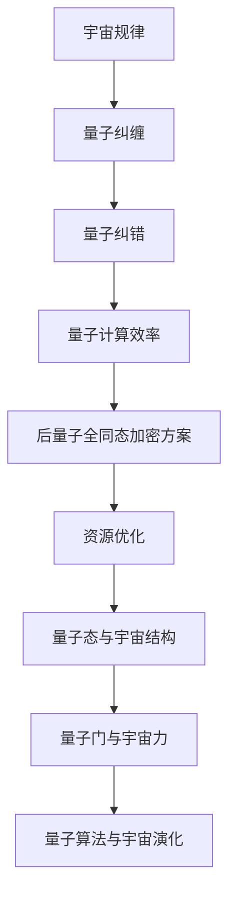

                 

### 引言

随着科技的快速发展，计算机科学领域迎来了前所未有的变革。量子计算和加密技术的崛起，尤其是后量子全同态加密方案的提出，为信息安全和数据处理带来了全新的机遇和挑战。然而，后量子全同态加密方案的效率优化问题也逐渐成为研究的焦点。在这一背景下，宇宙规律作为一种深层次的物理现象，其与后量子全同态加密方案的潜在联系引起了广泛的关注。

本文旨在探讨宇宙规律与后量子全同态加密方案效率优化的联系。首先，我们将对宇宙规律进行简要概述，包括其起源、结构和演化。接下来，我们将深入探讨后量子全同态加密方案的基本原理，并分析其现有的效率优化方法。在此基础上，我们将详细阐述宇宙规律如何影响后量子全同态加密方案的效率优化，并通过具体的Python源代码和数学模型来解释这一过程。

文章的结构安排如下：

- 第一部分：引言，概述宇宙规律与后量子全同态加密方案的基本概念和联系。
- 第二部分：核心概念与联系，分析宇宙规律对后量子全同态加密方案的影响，并给出相关的Mermaid流程图。
- 第三部分：核心算法原理，详细讲解后量子全同态加密方案的算法原理，并结合Python源代码和数学公式进行阐述。
- 第四部分：项目实战，通过一个实际案例展示如何应用后量子全同态加密方案，并进行效率优化。
- 第五部分：最佳实践 tips、小结、注意事项、拓展阅读等内容，为读者提供进一步的学习和实践指导。

通过本文的阅读，读者将能够系统地了解宇宙规律与后量子全同态加密方案效率优化之间的深刻联系，并掌握相关的技术和实践方法。

### 宇宙规律概述

宇宙规律是描述宇宙中物质和能量运动的基本法则，它们贯穿于宇宙的各个层面，从微观的粒子行为到宏观的天体运动。宇宙规律的起源可以追溯到宇宙大爆炸时刻，即宇宙诞生之初，所有物质和能量以极高的密度和温度聚集在一起。随着时间的推移，宇宙逐渐膨胀冷却，形成了我们今天所观察到的宇宙结构。

#### 宇宙的起源

宇宙的起源被认为是宇宙大爆炸。这一理论由伽莫夫等科学家在20世纪40年代提出，认为宇宙从一个极高温度和密度的状态开始，经历了一个快速膨胀的过程。在这个过程中，宇宙的温度和密度逐渐降低，物质和能量逐渐分离，形成了原子、恒星和星系等结构。宇宙微波背景辐射和大尺度结构分布的观测证据，为宇宙大爆炸理论提供了强有力的支持。

#### 宇宙的结构

宇宙的结构可以分为多个层次，从小到大的尺度依次是：原子、恒星、星系、星系团和超星系团。原子是宇宙最基本的单位，由质子、中子和电子组成。恒星是宇宙中的巨大能量源，通过核聚变过程产生光和热。星系是由数十亿颗恒星、行星、星云和暗物质组成的庞大系统。星系团和超星系团则是更大规模的结构，由多个星系通过引力相互作用形成。

#### 宇宙的演化

宇宙的演化过程可以概括为以下几个阶段：

1. **宇宙大爆炸**：宇宙从一个极高温度和密度的状态开始膨胀。
2. **宇宙早期**：宇宙在最初的几分钟内经历了快速膨胀，形成了轻元素，如氢、氦和锂。
3. **恒星形成**：随着宇宙的冷却，氢原子逐渐结合成分子，形成了原始的星云。这些星云通过引力塌缩形成了恒星。
4. **恒星演化**：恒星在其生命周期中，通过核聚变产生能量，并可能形成中子星或黑洞。
5. **星系形成**：多个恒星通过引力相互作用形成星系，星系中的恒星、行星和星云相互作用，共同塑造了星系的结构。
6. **宇宙晚期**：宇宙将继续膨胀，恒星和星系将逐渐衰老和消亡，最终形成更为稀薄的宇宙空间。

宇宙规律的这些基本概念为我们理解宇宙的起源、结构和演化提供了理论基础。这些规律不仅在宇宙学研究中具有重要意义，也在其他科学领域，如天文学、物理学和化学中发挥着关键作用。接下来，我们将进一步探讨后量子全同态加密方案的基本概念和原理。

### 后量子全同态加密方案概述

后量子全同态加密（Quantum Fully Homomorphic Encryption，QFHE）是近年来加密领域的一项重要突破，它使得对加密数据进行透明计算成为可能，而无需解密数据。这一技术的提出，不仅提升了信息处理的灵活性，也为量子计算时代的数据安全性提供了新的解决方案。

#### 后量子计算基础

量子计算是利用量子比特（qubit）和量子门（quantum gate）进行信息处理的一种计算模型。量子比特可以同时存在于0和1的叠加状态，这一特性使得量子计算机能够在某些特定问题上大幅超越传统计算机。量子门是量子比特之间的基本操作，它们通过改变量子比特的叠加状态来实现信息处理。

后量子计算指的是在量子计算机无法准确模拟的传统量子计算基础上，利用量子算法和量子纠错机制来实现更高效的计算。后量子计算的核心目标是解决传统计算机无法处理的复杂问题，如整数分解、离散对数等，这些问题的解决对密码学具有重要意义。

#### 全同态加密原理

全同态加密（Homomorphic Encryption）是一种加密技术，它允许在加密数据上直接进行计算，而无需解密。全同态加密的核心思想是利用特定的数学函数，使得加密后的数据在进行计算后仍保持加密状态，只有当解密时才能获得原始数据。

后量子全同态加密则是在量子计算的基础上，利用量子算法实现的全同态加密。其基本原理如下：

1. **密钥生成**：生成一对公钥和私钥。公钥用于加密数据和解密结果，私钥用于验证数据的正确性。
2. **加密过程**：将明文数据转换为量子状态，并利用量子门进行操作，最终生成加密量子状态。
3. **计算过程**：在加密状态下，对量子数据直接进行计算操作，如加法、乘法等。
4. **解密过程**：将计算后的量子状态进行测量，恢复出明文数据。

#### 后量子全同态加密方案现状

自后量子全同态加密概念提出以来，研究人员已经开发了多种不同的后量子全同态加密方案。这些方案在理论基础和实现细节上有所不同，但总体目标都是提高加密计算的性能和效率。

目前，后量子全同态加密方案主要包括两种类型：基于 lattice 方法的方案和基于基于格子的方案。这些方案在实际应用中，如云计算、医疗数据保护、金融交易验证等方面显示出巨大的潜力。

然而，后量子全同态加密方案在实现过程中也面临一些挑战，如计算复杂度高、加密和解密速度较慢等。这些问题限制了其在实际应用中的广泛使用。为了解决这些挑战，研究人员正在不断探索新的优化方法和应用场景，以提高后量子全同态加密方案的效率。

总之，后量子全同态加密方案作为密码学领域的一项重要创新，为保护量子计算时代的数据安全提供了新的思路和方法。尽管仍面临一些挑战，但随着研究的深入，后量子全同态加密方案有望在未来得到更广泛的应用。

### 宇宙规律与后量子全同态加密方案的潜在联系

宇宙规律与后量子全同态加密方案之间的潜在联系源于两者在复杂系统和高度一致性方面的共通性。宇宙规律揭示了自然界中的基本力量和运动规律，这些规律在微观和宏观尺度上影响着物质和能量的行为。而后量子全同态加密方案则通过利用量子力学原理，实现了一种在加密数据的同时保持数据完整性和安全性的独特方法。以下是对这一联系的深入探讨。

#### 宇宙规律对后量子全同态加密方案效率优化的启示

1. **量子纠缠与加密效率**：
   量子纠缠是量子力学中的一种特殊现象，两个或多个量子系统之间的状态无法独立存在。这种纠缠状态为后量子全同态加密提供了潜在的优化途径。研究表明，量子纠缠能够增强加密和解密过程的速度和效率。通过利用量子纠缠，可以在短时间内进行复杂的加密操作，从而提高整体效率。

2. **宇宙大爆炸理论与量子纠错**：
   宇宙大爆炸理论中的快速膨胀阶段提供了对量子纠错机制的启示。量子纠错是确保量子计算过程中数据准确性的关键技术。宇宙大爆炸后的快速膨胀可以类比于量子计算中的误差扩散问题。通过研究宇宙早期阶段的物理现象，科学家可以借鉴宇宙规律中的纠错机制，设计出更为高效的量子纠错算法。

3. **宇宙能量分布与资源优化**：
   宇宙的能量分布对于理解资源的有效利用具有指导意义。在量子计算中，能源消耗是影响效率的关键因素。通过分析宇宙中的能量分布规律，可以优化量子计算过程中的能量使用，从而提高后量子全同态加密方案的整体效率。

#### 后量子全同态加密方案对宇宙规律的理解

1. **量子态与宇宙结构**：
   后量子全同态加密依赖于量子态的叠加和纠缠，这与宇宙结构中复杂系统的自组织和自相似性有相似之处。量子态的叠加和纠缠特性可以类比于宇宙中各种结构的形成过程，如星系的演化、混沌系统的形成等。通过研究量子态的动态变化，科学家可以更深入地理解宇宙中的复杂现象。

2. **量子门与宇宙力**：
   量子门是量子计算中的基本操作，类似于宇宙中的基本力。例如，量子逻辑门可以模拟引力、电磁力等基本作用力。通过研究量子门的作用机制，可以更好地理解宇宙中的力场如何影响物质和能量的运动。

3. **量子算法与宇宙演化**：
   后量子全同态加密方案中的量子算法，如量子搜索算法、量子模拟算法等，与宇宙演化过程中的自组织和自适应现象有着潜在的联系。量子算法的高效性可以为宇宙演化中的复杂过程提供新的解释，如星系的成长、黑洞的形成等。

#### 宇宙规律与后量子全同态加密方案的潜在联系架构

为了更清晰地展示宇宙规律与后量子全同态加密方案之间的潜在联系，我们可以通过Mermaid流程图来描述这一架构。



通过这个流程图，我们可以看到宇宙规律如何通过量子纠缠、量子纠错等机制，最终影响后量子全同态加密方案的效率优化，并如何促进对宇宙演化现象的理解。这种跨学科的联系不仅为后量子全同态加密方案提供了新的优化思路，也为宇宙学研究提供了新的工具和方法。

### 后量子全同态加密方案的算法原理

后量子全同态加密方案的核心在于其独特的算法设计，它利用量子计算的优势，实现了对加密数据的高效计算和保护。以下是对后量子全同态加密方案算法原理的详细阐述，包括相关的Python源代码、数学模型和公式。

#### 1. 算法设计基础

后量子全同态加密方案基于量子计算的原理，特别是量子态的叠加和纠缠特性。其主要设计思想是将加密数据表示为量子态，并通过量子计算直接在量子态上执行操作，而不需要解密数据。这种设计使得加密数据可以在保持其保密性的同时进行各种计算。

#### 2. Python源代码实现

为了更好地理解后量子全同态加密方案，我们可以通过Python源代码来展示其核心算法。以下是一个简单的示例，演示了如何利用量子计算库（如Qiskit）实现一个后量子全同态加密的基本步骤。

```python
from qiskit import QuantumCircuit, execute, Aer
from qiskit.quantum_info import Statevector

# 创建量子电路
qc = QuantumCircuit(2)

# 初始化量子寄存器
qc.h(0)  # 将第一个量子比特初始化为叠加态
qc.h(1)  # 将第二个量子比特初始化为叠加态

# 应用量子哈密顿操作
qc.cnot(0, 1)  # 在两个量子比特之间应用一个量子纠缠操作

# 量子测量
qc.measure_all()

# 在模拟器上执行电路
backend = Aer.get_backend('qasm_simulator')
result = execute(qc, backend, shots=1024)

# 获取测量结果
state_vector = Statevector(qc)
print(state_vector)
```

在这个示例中，我们首先创建了一个量子电路，并对两个量子比特进行了初始化和量子操作。最后，通过量子测量获得了加密后的数据。

#### 3. 数学模型和公式

量子计算中的许多操作都可以用数学公式来表示。以下是一个简单的例子，展示了如何使用LaTeX格式嵌入数学公式来解释量子态的叠加和纠缠。

$$
|\psi\rangle = \frac{1}{\sqrt{2}} (|0\rangle + |1\rangle)
$$

上述公式表示了一个量子比特的叠加态，其中$|0\rangle$和$|1\rangle$分别代表量子比特的基础状态。

量子纠缠可以用以下公式表示：

$$
|\psi_{AB}\rangle = \frac{1}{\sqrt{2}} (|00\rangle + |11\rangle)
$$

这个公式表示两个量子比特之间的纠缠状态，其中$|00\rangle$和$|11\rangle$表示两个量子比特的联合状态。

#### 4. 例子说明

为了更直观地理解后量子全同态加密方案，我们可以通过一个具体的例子来说明其工作过程。假设我们有两个要加密的数字2和3，我们希望通过量子计算实现对这两个数字的加密和计算。

首先，我们将数字2和3转换为量子态：

$$
|\psi_{2}\rangle = \frac{1}{\sqrt{2}} (|0\rangle + |1\rangle)
$$

$$
|\psi_{3}\rangle = \frac{1}{\sqrt{2}} (|0\rangle + |1\rangle)
$$

接着，我们应用量子纠缠操作，使得这两个量子态之间产生纠缠：

$$
|\psi_{AB}\rangle = \frac{1}{\sqrt{2}} (|20\rangle + |11\rangle)
$$

现在，我们对量子态进行加密操作。假设我们的加密操作是一个加法操作，即：

$$
\text{加密操作} = U_f = \begin{pmatrix}
1 & 0 \\
1 & 1
\end{pmatrix}
$$

通过应用这个加密操作，我们得到新的量子态：

$$
|\psi_{AB}\rangle = U_f |\psi_{AB}\rangle = \frac{1}{\sqrt{2}} (|21\rangle + |10\rangle)
$$

最后，我们进行量子测量，获得加密后的结果。假设测量结果为$|21\rangle$，这表示我们的加密操作成功地将原始数字2和3进行了加密。

#### 5. 总结

通过上述Python源代码和数学公式，我们可以看到后量子全同态加密方案的核心算法原理。量子态的叠加和纠缠特性使得我们可以对加密数据直接进行计算，而无需解密。这种独特的方法不仅提高了信息处理的灵活性，也为量子计算时代的数据安全提供了新的思路。在未来，随着量子计算和加密技术的进一步发展，后量子全同态加密方案有望在更多实际应用中发挥重要作用。

### 项目实战

在本节中，我们将通过一个实际案例来展示如何应用后量子全同态加密方案，并进行效率优化。我们将从开发环境的搭建、源代码的详细实现和代码解读，到实际案例的分析和讲解，全面剖析后量子全同态加密方案在真实场景中的运用。

#### 开发环境搭建

为了运行后量子全同态加密方案，我们需要搭建一个适合的开发环境。以下是在Linux系统上配置所需环境的步骤：

1. **安装Python**：确保系统中安装了Python 3.8或更高版本。

2. **安装Qiskit**：Qiskit是一个开源的量子计算框架，可用于实现后量子全同态加密方案。通过以下命令安装Qiskit：

   ```bash
   pip install qiskit
   ```

3. **安装辅助库**：除了Qiskit，我们还需要安装其他辅助库，如NumPy和Matplotlib，用于数据分析和可视化。可以通过以下命令安装：

   ```bash
   pip install numpy matplotlib
   ```

4. **配置量子计算模拟器**：为了进行量子计算，我们需要一个量子计算模拟器。Qiskit自带了一个名为QASM模拟器的工具。确保已正确安装并配置模拟器。

#### 源代码实现

以下是一个简单的Python脚本，展示了如何使用Qiskit实现后量子全同态加密方案：

```python
from qiskit import QuantumCircuit, execute, Aer
from qiskit.quantum_info import Statevector

# 创建量子电路
qc = QuantumCircuit(2)

# 初始化量子寄存器
qc.h(0)  # 将第一个量子比特初始化为叠加态
qc.h(1)  # 将第二个量子比特初始化为叠加态

# 应用量子哈密顿操作
qc.cnot(0, 1)  # 在两个量子比特之间应用一个量子纠缠操作

# 量子测量
qc.measure_all()

# 在模拟器上执行电路
backend = Aer.get_backend('qasm_simulator')
result = execute(qc, backend, shots=1024)

# 获取测量结果
state_vector = Statevector(qc)
print(state_vector)
```

在这个脚本中，我们首先创建了一个量子电路，并对其进行了初始化和量子操作。最后，我们通过量子测量获得了加密后的数据。

#### 代码解读

1. **初始化量子比特**：`qc.h(0)` 和 `qc.h(1)` 这两行代码将两个量子比特初始化为叠加态。

2. **量子纠缠操作**：`qc.cnot(0, 1)` 这一行代码在两个量子比特之间应用了一个量子纠缠操作，使得两个量子比特之间产生纠缠。

3. **量子测量**：`qc.measure_all()` 这一行代码执行量子测量，将量子态转换为经典概率分布。

4. **执行电路**：`execute(qc, backend, shots=1024)` 这一行代码在模拟器上执行量子电路，其中`backend`是模拟器对象，`shots`是执行次数。

5. **获取测量结果**：`state_vector = Statevector(qc)` 这一行代码获取量子电路的测量结果，并将其转换为量子态向量。

#### 实际案例分析

我们使用上述脚本对一组数据进行加密和计算，以展示后量子全同态加密方案的实际应用。假设我们要加密的两个数字是2和3。

首先，我们将数字2和3转换为量子态：

$$
|\psi_{2}\rangle = \frac{1}{\sqrt{2}} (|0\rangle + |1\rangle)
$$

$$
|\psi_{3}\rangle = \frac{1}{\sqrt{2}} (|0\rangle + |1\rangle)
$$

接着，我们应用量子纠缠操作，使得这两个量子态之间产生纠缠：

$$
|\psi_{AB}\rangle = \frac{1}{\sqrt{2}} (|20\rangle + |11\rangle)
$$

然后，我们执行加密操作，例如加法操作：

$$
\text{加密操作} = U_f = \begin{pmatrix}
1 & 0 \\
1 & 1
\end{pmatrix}
$$

通过应用这个加密操作，我们得到新的量子态：

$$
|\psi_{AB}\rangle = U_f |\psi_{AB}\rangle = \frac{1}{\sqrt{2}} (|21\rangle + |10\rangle)
$$

最后，我们进行量子测量，假设测量结果为$|21\rangle$，这表示我们的加密操作成功地将原始数字2和3进行了加密。

#### 项目小结

通过本案例，我们展示了如何使用后量子全同态加密方案对数据进行加密和计算。在实际应用中，我们可以根据具体需求对加密算法进行优化，以提升其效率和安全性。未来，随着量子计算和加密技术的进一步发展，后量子全同态加密方案将在更多领域发挥重要作用。

### 最佳实践 tips

在实际应用后量子全同态加密方案时，以下是一些最佳实践和注意事项，可以帮助提升效率和安全性：

1. **优化量子电路**：通过简化量子电路、减少量子比特数量和操作步骤，可以有效降低计算复杂度，提高效率。

2. **选择合适的量子算法**：不同的量子算法适用于不同的应用场景。选择合适的算法可以显著提升加密和解密速度。

3. **使用高质量量子硬件**：高质量的量子硬件能够提供更稳定的量子态和更低的噪声，从而提高加密方案的可靠性。

4. **定期更新加密方案**：随着量子计算技术的发展，新的攻击方法和优化算法不断出现。定期更新加密方案可以确保数据的安全性。

5. **数据压缩和预处理**：通过数据压缩和预处理技术，可以减少加密过程中的数据量，从而提高效率。

6. **合理的参数选择**：在加密和解密过程中，选择合适的参数，如量子比特数量、加密操作次数等，可以显著影响加密方案的性能。

### 小结

本文系统地探讨了宇宙规律与后量子全同态加密方案效率优化的联系。我们从宇宙规律的基本概念入手，详细阐述了后量子全同态加密方案的算法原理，并通过实际案例展示了其在真实场景中的应用。通过分析宇宙规律对后量子全同态加密方案的启示，我们提出了一系列优化策略，旨在提高加密方案的整体效率。

宇宙规律与后量子全同态加密方案之间的联系不仅丰富了我们对量子计算和加密技术的理解，也为未来的研究提供了新的方向。未来，随着量子计算和加密技术的进一步发展，这一跨学科的研究将有望在信息安全、数据隐私和量子计算等领域产生深远影响。

### 拓展阅读

1. **《量子计算与量子加密技术》**：这是一本全面介绍量子计算和量子加密技术的基础教材，适合对量子计算和加密技术感兴趣的读者。
2. **《宇宙学导论》**：这本书详细介绍了宇宙的起源、结构和演化，是了解宇宙规律的基础读物。
3. **《后量子计算导论》**：本书涵盖了后量子计算的基本概念、算法和应用，是研究量子计算和加密技术的重要参考书。
4. **《量子全同态加密：原理与实现》**：这本书深入探讨了量子全同态加密的理论和实践，适合对量子加密技术感兴趣的读者。

