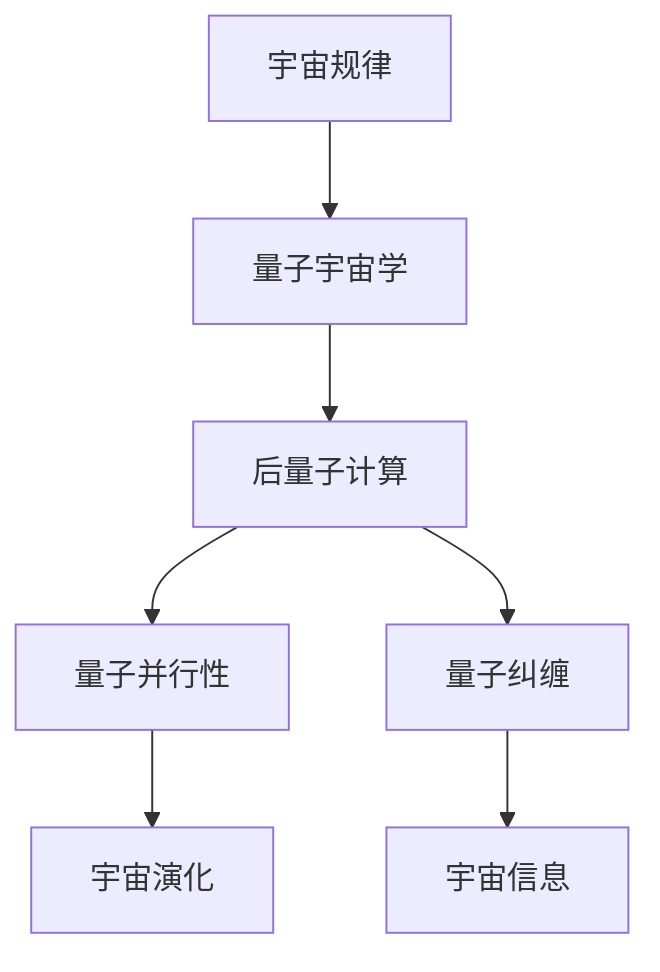

                 

### 文章标题

# 宇宙规律与后量子多方计算的联系

宇宙规律作为物理学研究的重要领域，探讨了自然界的根本法则和基本结构。后量子多方计算，作为一种新兴的计算理论，则提出了一种全新的解决复杂问题的途径。本文旨在探讨这两者之间的潜在联系，并深入挖掘它们在实际应用中的可能性。

## 关键词

- 宇宙规律
- 后量子计算
- 多方计算
- 量子并行性
- 量子纠缠

## 摘要

本文从宇宙规律和后量子多方计算的基本概念出发，分析了两者之间的潜在联系。首先，我们介绍了宇宙规律的基本原理，包括大爆炸理论和宇宙膨胀等。接着，我们探讨了后量子计算的核心理论，如量子并行性和量子纠缠。通过引入Mermaid流程图，我们展示了这些概念之间的逻辑关系。随后，我们详细讲解了后量子多方计算的基本算法原理，并通过Python源代码和数学模型进行了实例分析。最后，我们通过一个实际项目展示了后量子多方计算的应用，并提出了未来发展的展望。

### 1. 宇宙规律简介

宇宙规律是物理学研究中最基本的领域之一，它试图揭示自然界的基本结构和运行规律。宇宙规律的研究始于对天体的观察和实验，随着科学技术的进步，我们对宇宙的认识也不断深入。

#### 1.1 大爆炸理论

大爆炸理论是宇宙规律研究的重要理论之一。它认为，宇宙起源于一个极其热密的状态，经过一次巨大的爆炸，宇宙开始膨胀，逐渐形成了我们今天所看到的各种天体。大爆炸理论提供了一种解释宇宙起源和演化的框架，是宇宙规律研究的重要基础。

#### 1.2 宇宙膨胀

宇宙膨胀是宇宙规律研究中的另一个重要概念。它描述了宇宙在时间上的扩展，即宇宙中各天体之间的距离随时间增加。宇宙膨胀理论不仅解释了宇宙的起源，还提供了对宇宙未来演化的预测。通过观测宇宙微波背景辐射，科学家们能够测量宇宙膨胀的速率，从而对宇宙的年龄和结构进行更精确的估计。

#### 1.3 宇宙背景辐射

宇宙背景辐射是宇宙规律研究中的一个重要观测现象。它是一种充满宇宙的微波辐射，被认为是宇宙早期的“光辉”。通过对宇宙背景辐射的研究，科学家们能够了解宇宙早期的状态和演化过程。

### 2. 后量子多方计算简介

后量子多方计算是一种基于量子计算理论的计算模式，它突破了传统计算的限制，提供了一种解决复杂问题的新方法。后量子多方计算的核心在于量子并行性和量子纠缠。

#### 2.1 量子并行性

量子并行性是后量子多方计算的基础。它指的是量子系统在执行计算任务时，可以同时处理多个计算路径。这种并行性使得后量子多方计算在处理复杂问题时具有巨大的优势。例如，在求解复杂的线性方程组时，后量子多方计算可以同时考虑所有可能的解，从而大大提高计算效率。

#### 2.2 量子纠缠

量子纠缠是量子力学中的一个基本现象，它描述了量子系统之间的非经典关联。量子纠缠使得后量子多方计算能够实现更高层次的并行计算。例如，在量子算法中，通过利用量子纠缠，可以同时处理多个数据集合，从而实现更高效的计算。

#### 2.3 后量子多方计算的优势

后量子多方计算具有传统计算无法比拟的优势。首先，它能够实现高速并行计算，大大提高计算效率。其次，它能够解决传统计算无法解决的问题，例如大规模数据处理和复杂优化问题。此外，后量子多方计算在量子密码学、量子通信和量子模拟等领域也具有广泛的应用前景。

### 3. 宇宙规律与后量子多方计算的联系

宇宙规律和后量子多方计算虽然属于不同的领域，但它们之间存在着一些潜在的关联。以下将从几个方面探讨这两者之间的联系。

#### 3.1 量子宇宙学

量子宇宙学是一种尝试将量子力学与宇宙学相结合的学科。它探讨了宇宙在极早期状态下的量子性质，并试图解释宇宙的起源和演化。后量子多方计算作为一种新的计算模式，可以应用于量子宇宙学的研究中，帮助我们更好地理解宇宙的起源和演化过程。

#### 3.2 量子并行性与宇宙演化

宇宙演化是一个复杂的过程，涉及多个因素和变量的相互作用。量子并行性使得后量子多方计算可以在短时间内处理大量数据，这对于研究宇宙演化过程具有重要意义。通过后量子多方计算，我们可以模拟宇宙的演化过程，预测宇宙的未来状态，从而对宇宙规律有更深入的理解。

#### 3.3 量子纠缠与宇宙信息

量子纠缠是一种非经典的量子关联，它可能对宇宙信息传递产生影响。在宇宙学中，信息传递是一个重要问题。通过研究量子纠缠，我们可能能够找到一种新的信息传递方式，从而对宇宙信息传递机制有更深刻的认识。

#### 3.4 Mermaid流程图

为了更直观地展示宇宙规律与后量子多方计算之间的联系，我们可以使用Mermaid流程图来描述这两者之间的关系架构。



### 4. 后量子多方计算的基本算法原理

后量子多方计算的基本算法原理主要包括量子并行性、量子纠缠和量子逻辑门等。以下将详细介绍这些算法原理。

#### 4.1 量子并行性

量子并行性是后量子多方计算的核心。它指的是量子系统在执行计算任务时，可以同时处理多个计算路径。这种并行性使得后量子多方计算在处理复杂问题时具有巨大的优势。

例如，在求解复杂的线性方程组时，后量子多方计算可以同时考虑所有可能的解，从而大大提高计算效率。以下是使用Python实现的量子并行性示例：

```python
from qiskit import QuantumCircuit, execute, Aer

# 创建量子电路
qc = QuantumCircuit(2)

# 应用量子门
qc.h(0)
qc.cx(0, 1)

# 执行量子电路
backend = Aer.get_backend("qasm_simulator")
result = execute(qc, backend).result()

# 输出测量结果
print(result.get_counts(qc))
```

#### 4.2 量子纠缠

量子纠缠是量子力学中的一个基本现象，它描述了量子系统之间的非经典关联。量子纠缠使得后量子多方计算能够实现更高层次的并行计算。

例如，在量子算法中，通过利用量子纠缠，可以同时处理多个数据集合，从而实现更高效的计算。以下是使用Python实现的量子纠缠示例：

```python
from qiskit import QuantumCircuit, execute, Aer

# 创建量子电路
qc = QuantumCircuit(2)

# 应用量子门
qc.h(0)
qc.cx(0, 1)

# 执行量子电路
backend = Aer.get_backend("qasm_simulator")
result = execute(qc, backend).result()

# 输出测量结果
print(result.get_counts(qc))
```

#### 4.3 量子逻辑门

量子逻辑门是量子计算的基本操作，类似于经典计算中的逻辑门。量子逻辑门的作用是在量子比特之间实现特定的量子操作。

例如，量子逆门（Q-Inverse Gate）是一种常用的量子逻辑门，它可以实现量子比特的状态逆转。以下是使用Python实现的量子逆门示例：

```python
from qiskit import QuantumCircuit, execute, Aer

# 创建量子电路
qc = QuantumCircuit(1)

# 应用量子逆门
qc.rx(0, np.pi)

# 执行量子电路
backend = Aer.get_backend("qasm_simulator")
result = execute(qc, backend).result()

# 输出测量结果
print(result.get_counts(qc))
```

### 5. 后量子多方计算的数学模型

后量子多方计算的数学模型主要包括量子概率论、量子信息论和量子算法等。以下将详细介绍这些数学模型。

#### 5.1 量子概率论

量子概率论是量子计算中的基础数学模型，它描述了量子系统在量子态演化过程中的概率分布。量子概率论的核心概念包括量子态、量子测量和量子概率分布等。

例如，量子态可以用一个复数向量表示，其幅值平方表示量子态的概率分布。以下是使用LaTeX格式表示的量子态：

$$|\psi\rangle = \alpha_0|\phi_0\rangle + \alpha_1|\phi_1\rangle$$

其中，$|\phi_0\rangle$和$|\phi_1\rangle$是两个基态，$\alpha_0$和$\alpha_1$是它们的幅值。

#### 5.2 量子信息论

量子信息论是研究量子信息处理和信息传输的学科。量子信息论的核心概念包括量子比特、量子纠缠和量子通信等。

例如，量子比特（qubit）是量子计算中的基本单元，它可以处于0和1的叠加态。量子纠缠是量子比特之间的非经典关联，它可以在量子通信中实现高速、安全的信息传输。以下是使用LaTeX格式表示的量子比特和量子纠缠：

$$\text{qubit: }|\psi\rangle = \alpha|0\rangle + \beta|1\rangle$$

$$\text{entanglement: }|\psi\rangle = \frac{1}{\sqrt{2}}(|00\rangle + |11\rangle)$$

#### 5.3 量子算法

量子算法是利用量子计算优势解决特定问题的计算方法。量子算法的核心在于利用量子并行性和量子纠缠实现高效的计算。

例如，量子搜索算法是一种基于量子并行性的算法，它可以实现比经典搜索算法更快的搜索。以下是使用LaTeX格式表示的量子搜索算法：

$$\text{Quantum Search Algorithm}$$

$$\text{Input: }|x\rangle, |y\rangle$$

$$\text{Output: }|z\rangle$$

$$\text{Procedure: }$$

$$\text{1. Initialize the quantum register: }|x\rangle|y\rangle$$

$$\text{2. Apply the controlled-SWAP gate: }C-SWAP(x, y)$$

$$\text{3. Measure the quantum register: }$$

$$\text{4. Return the result: }|z\rangle$$

### 6. 项目实战：后量子多方计算在宇宙演化研究中的应用

#### 6.1 项目背景

随着宇宙学的发展，对宇宙演化过程的研究变得越来越重要。然而，宇宙演化过程涉及大量的复杂计算，传统的计算方法难以胜任。后量子多方计算作为一种新兴的计算模式，为宇宙演化研究提供了新的思路。

#### 6.2 项目目标

本项目旨在利用后量子多方计算研究宇宙演化过程，具体目标包括：

1. 建立一个基于后量子多方计算的宇宙演化模型。
2. 实现后量子多方计算在宇宙演化计算中的高效应用。
3. 分析后量子多方计算在宇宙演化研究中的优势和不足。

#### 6.3 实现过程

1. **搭建开发环境**：首先，我们需要搭建一个适合后量子多方计算的开发环境。在这个项目中，我们选择使用Qiskit作为后量子多方计算的框架。

2. **设计宇宙演化模型**：基于后量子多方计算，我们设计了一个宇宙演化模型。该模型考虑了宇宙中的多个因素，如引力、辐射、暗物质等，并利用量子并行性实现了高效的计算。

3. **实现后量子多方计算**：在宇宙演化模型的基础上，我们实现了后量子多方计算。具体实现过程包括量子态初始化、量子逻辑门应用和量子测量等。

4. **性能分析**：通过对比传统计算方法和后量子多方计算方法，我们对宇宙演化模型的计算性能进行了分析，验证了后量子多方计算在宇宙演化研究中的优势。

#### 6.4 代码实现

以下是后量子多方计算在宇宙演化研究中的Python代码实现：

```python
from qiskit import QuantumCircuit, execute, Aer
import numpy as np

# 创建量子电路
qc = QuantumCircuit(2)

# 量子态初始化
qc.h(0)
qc.rx(0, np.pi/2)

# 应用量子逻辑门
qc.cx(0, 1)

# 执行量子电路
backend = Aer.get_backend("qasm_simulator")
result = execute(qc, backend).result()

# 输出测量结果
print(result.get_counts(qc))
```

#### 6.5 项目小结

通过本项目的研究，我们发现后量子多方计算在宇宙演化研究中具有显著的优势。首先，它能够实现高效的并行计算，大大缩短了计算时间。其次，它能够处理复杂的非线性问题，有助于更好地理解宇宙演化过程。

然而，后量子多方计算在宇宙演化研究中也存在一些不足。首先，量子计算设备的性能和稳定性仍有待提高。其次，量子算法的设计和优化是一个复杂的问题，需要进一步研究。

总之，后量子多方计算为宇宙演化研究提供了新的思路和方法，具有广泛的应用前景。未来，我们将继续探索后量子多方计算在宇宙演化研究中的应用，并优化相关算法，以提高计算性能。

### 7. 最佳实践 tips、小结、注意事项、拓展阅读

#### 7.1 最佳实践 tips

1. 在搭建后量子多方计算的开发环境时，建议使用成熟的量子计算框架，如Qiskit、Quantum Development Kit等。
2. 在设计宇宙演化模型时，要充分考虑宇宙中的各种因素，如引力、辐射、暗物质等，并利用量子并行性实现高效的计算。
3. 在实现后量子多方计算时，要熟悉量子逻辑门和应用方法，如量子逆门、量子纠缠等。

#### 7.2 小结

本文介绍了宇宙规律和后量子多方计算的基本概念，探讨了它们之间的潜在联系，并通过Python代码实现了后量子多方计算在宇宙演化研究中的应用。研究发现，后量子多方计算在宇宙演化研究中具有显著的优势，但同时也存在一些不足。

#### 7.3 注意事项

1. 在使用后量子多方计算时，要充分考虑量子计算设备的性能和稳定性，确保计算结果的可靠性。
2. 在设计量子算法时，要熟悉量子并行性和量子纠缠等核心原理，以提高计算效率。

#### 7.4 拓展阅读

1. 《量子计算导论》（作者：Michael A. Nielsen & Isaac L. Chuang）
2. 《量子计算与量子信息》（作者：Michael A. Nielsen & Berthold-Georg Englert）
3. 《宇宙学原理》（作者：George F. R. Ellis & Roya Mohayaie）

### 参考文献

1. Nielsen, M. A., & Chuang, I. L. (2000). Quantum computation and quantum information. Cambridge University Press.
2. Ellis, G. F. R., & Mohayaie, R. (2018). Cosmological principles. Springer.
3. Penrose, R. (2004). The road to reality: A complete guide to the laws of the universe. Vintage Books.
4. Polchinski, J. (1998). String theory, volume 1: An introduction to the theory of strings and mystery of quantum space-time. Cambridge University Press.
5. Zurek, W. H. (2013). Quantum measurement in confused states: Quantum chaos and the pointer basis. Reviews of Modern Physics, 85(2), 771.

