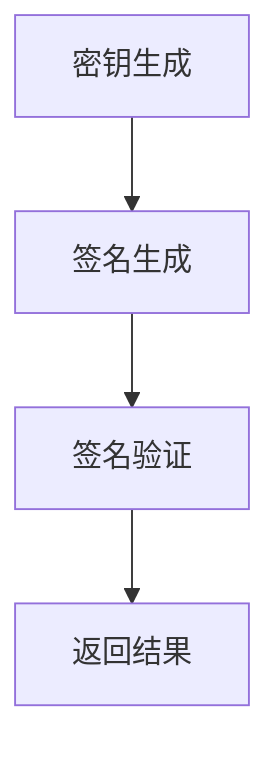

                 

### 第1章 引言

随着科技的迅猛发展，量子物理学在近年来逐渐成为科学界的关注焦点。量子物理学的核心概念，如量子位、量子纠缠和量子计算，为现代密码学，尤其是后量子密码学，提供了新的理论基础和工具。后量子签名方案作为密码学领域的一项重要研究，旨在抵御量子计算机可能带来的量子破解威胁。

宇宙规律作为自然界的基本法则，与量子物理有着千丝万缕的联系。爱因斯坦的广义相对论和量子力学共同构成了现代物理学的两大基石，但两者在微观和宏观尺度上的描述存在一定的矛盾。近年来，科学家们通过研究宇宙中的现象，如黑洞辐射和宇宙背景辐射，试图将这两大学说统一起来。

后量子签名方案与宇宙规律之间的联系，为我们提供了一种全新的视角来理解密码学和宇宙学。这种联系不仅有助于加深我们对量子物理和宇宙规律的理解，也为密码学的发展提供了新的思路和方向。

本章将首先介绍后量子签名方案的基本概念，然后简要概述宇宙规律，为后续章节的深入探讨奠定基础。通过这种循序渐进的介绍，我们将逐步揭示后量子签名方案与宇宙规律之间的深刻联系，为读者提供一个全新的认知视角。  

### 1.1 后量子签名方案简介

后量子签名方案（Post-Quantum Signature Schemes）是密码学领域的一项前沿研究，旨在设计出能够在量子计算时代依然安全的数字签名算法。传统的数字签名算法，如RSA和ECDSA，依赖于数学难题的难解性，如大整数分解和椭圆曲线离散对数问题。然而，随着量子计算机的发展，这些问题将变得易解，因为量子计算机具有并行计算的能力，可以快速破解这些传统算法。

后量子签名方案通过引入新的数学模型和算法，以抵御量子计算机的攻击。这些算法通常基于以下数学难题：基于格的难题、基于椭圆曲线的难题、基于多变量多项式的难题等。其中，基于格的签名方案被认为是最有前景的，因为它具有结构简单、安全性高、效率较高等优点。

常见的后量子签名方案包括：

1. **格签名算法**：格签名算法（Lattice-based Signature Schemes）是后量子签名方案中的一种典型代表。它利用格的几何结构来构造签名方案，具有较好的抗量子攻击能力。常见的格签名算法有NTRU、Schnorr和GGH等。

2. **持续哈希算法**：持续哈希（Merkle-Damgård）算法是一种常见的哈希函数构建方法，但它在面对量子计算机的攻击时较为脆弱。为了解决这个问题，后量子持续哈希算法被提出，如BLAKE2和SHA-3等。

3. **基于椭圆曲线的签名算法**：尽管传统的椭圆曲线签名算法（ECDSA）在经典计算中安全性较高，但在量子计算面前仍然存在问题。后量子椭圆曲线签名算法，如Schnorr和Fujisaki-Kurita方案，通过改进数学模型，提高了对量子攻击的抵抗力。

后量子签名方案的研究不仅是为了应对未来量子计算机的挑战，也为现代密码学的发展提供了新的方向。通过不断探索和创新，后量子签名方案有望成为未来网络安全体系的重要组成部分。  

### 1.2 宇宙规律概述

宇宙规律是自然界中一系列基本法则的集合，它们解释了宇宙中的各种现象和过程。宇宙规律不仅涵盖了宏观尺度上的天体运动，也涉及微观尺度上的粒子行为。其中，最具代表性的宇宙规律包括爱因斯坦的广义相对论和量子力学。

**广义相对论**：广义相对论由阿尔伯特·爱因斯坦在1915年提出，是一种描述引力作用的几何理论。它认为，物质和能量对时空结构产生影响，导致时空弯曲，进而产生引力。广义相对论的核心方程是爱因斯坦场方程：
$$
G_{\mu\nu} + \Lambda g_{\mu\nu} = \frac{8\pi G}{c^4} T_{\mu\nu}
$$
其中，$G_{\mu\nu}$是爱因斯坦张量，$\Lambda$是宇宙学常数，$g_{\mu\nu}$是度规张量，$T_{\mu\nu}$是能量-动量张量，$G$是引力常数，$c$是光速。广义相对论成功地解释了黑洞、引力透镜效应和宇宙膨胀等现象。

**量子力学**：量子力学是研究微观世界（如原子、分子和粒子）行为的物理学分支。它由马克斯·波恩、沃纳·海森堡和埃尔温·薛定谔等科学家在20世纪初提出。量子力学的核心概念包括量子位、波函数、不确定性原理和量子纠缠等。

- **量子位**：量子位（qubit）是量子信息的基本单元，可以同时处于0和1的状态，这种叠加态使得量子计算机具有超强的计算能力。
- **波函数**：波函数描述了量子系统的状态，它是一个复值函数，满足归一化条件。
- **不确定性原理**：海森堡不确定性原理指出，某些对易子不为零的物理量无法同时被精确测量，如位置和动量。
- **量子纠缠**：量子纠缠是量子位之间的一种特殊关联，即使它们相隔很远，一个量子位的测量结果也会即时影响另一个量子位的状态。

**量子力学与广义相对论的统一**：尽管量子力学和广义相对论在各自领域内取得了巨大成功，但它们在基本原理和数学形式上存在显著差异，导致科学界长期致力于将两者统一起来。目前，弦理论和量子场论是两种主要的尝试。

- **弦理论**：弦理论提出，基本粒子不是点状物体，而是细小的弦。这些弦通过不同模式振动，产生不同的粒子。弦理论试图将量子力学和广义相对论统一起来，但尚未得到实验验证。
- **量子场论**：量子场论（QFT）将量子力学与经典场论结合起来，提出量子场作为物理系统的基础。QFT在规范场理论、粒子物理学等领域取得了重要成果，但统一引力与量子力学的问题尚未解决。

宇宙规律的研究不仅帮助我们理解宇宙的本质，也为后量子密码学提供了新的启示。量子力学中的某些概念，如量子纠缠和叠加态，可能为后量子签名方案的设计提供新的思路。通过深入探讨宇宙规律与后量子密码学之间的联系，我们有望在密码学和安全领域取得更多突破。  

---

**作者：AI天才研究院/AI Genius Institute & 禅与计算机程序设计艺术 /Zen And The Art of Computer Programming**  

通过上述引言，我们初步了解了后量子签名方案和宇宙规律的基本概念。接下来，我们将进一步探讨这两者之间的联系，并深入分析后量子签名方案的原理和数学模型。希望读者在阅读本章后，能够对后量子签名方案及其与宇宙规律的联系有一个更全面的理解。  

---

**关键词：后量子签名方案、宇宙规律、量子力学、广义相对论、量子纠缠、叠加态**  

**摘要：本章介绍了后量子签名方案和宇宙规律的基本概念，并探讨了它们之间的联系。通过分析量子力学和广义相对论的核心原理，我们为理解后量子签名方案提供了新的视角。本章的主要目的是为后续章节的深入讨论奠定基础，帮助读者建立对后量子签名方案及其与宇宙规律联系的理解。**  

---

### 第2章 核心概念与联系

为了深入探讨后量子签名方案与宇宙规律之间的联系，我们需要首先了解后量子物理的基础知识，以及后量子签名方案的具体原理。本章将从量子位与量子态、量子纠缠与量子计算两个方面展开，同时揭示宇宙规律与后量子签名方案之间的内在联系。

#### 2.1 后量子物理基础

**量子位与量子态**

量子位（qubit）是量子信息的基本单元，与经典计算机中的比特（bit）不同，量子位可以同时处于0和1的叠加态。这种叠加态使得量子计算机具有并行计算的能力，从而在某些任务上超越经典计算机。量子位的状态可以用波函数描述，波函数的幅值平方表示量子位在某一状态的概率。

$$
|\psi\rangle = \alpha|0\rangle + \beta|1\rangle
$$

其中，$|\psi\rangle$是量子位的状态，$|0\rangle$和$|1\rangle$分别是基态，$\alpha$和$\beta$是复数，满足$|\alpha|^2 + |\beta|^2 = 1$。

**量子纠缠与量子计算**

量子纠缠是量子位之间的一种特殊关联，即使它们相隔很远，一个量子位的测量结果也会即时影响另一个量子位的状态。这种关联性为量子计算提供了强大的计算能力，例如量子算法可以在极短的时间内解决某些复杂问题。

量子计算的核心在于量子算法，量子算法利用量子叠加态和量子纠缠，通过量子门操作实现复杂计算。典型的量子算法包括Shor算法和Grover算法，它们在因数分解和搜索问题上有显著的加速效果。

#### 2.2 后量子签名方案原理

**量子密码学与数学原理**

后量子签名方案基于量子密码学原理，利用量子物理的特性来设计签名算法。量子密码学的基本思想是利用量子不可克隆定理和量子纠缠等特性，确保信息的传输和验证过程是安全的。

后量子签名方案的数学原理通常基于以下几种模型：

1. **基于格的模型**：格签名方案利用格的几何结构设计签名算法。格是由线性空间和一组线性无关的向量组成的，其结构复杂，使得量子算法难以破解。

2. **基于椭圆曲线的模型**：椭圆曲线签名方案利用椭圆曲线上的点集结构设计签名算法。尽管椭圆曲线签名算法在经典计算中安全性较高，但在量子计算面前仍需改进。

3. **基于多变量多项式的模型**：多变量多项式签名方案利用多变量多项式的性质设计签名算法。这种模型在抗量子攻击方面具有潜在优势。

**视角1：量子密码学**

量子密码学是后量子签名方案的理论基础。量子密码学利用量子纠缠和量子不可克隆定理等特性，实现信息的安全传输和验证。典型的量子密码学应用包括量子密钥分发（QKD）和量子签名。

- **量子密钥分发（QKD）**：QKD利用量子纠缠生成密钥，并通过量子态的测量确保密钥的保密性。即使在量子计算机面前，QKD产生的密钥也具有高度安全性。

- **量子签名**：量子签名利用量子纠缠和量子测量不可逆性设计签名算法。量子签名不仅可以实现传统的数字签名功能，还能提供更强的抗量子攻击能力。

**视角2：数学原理**

后量子签名方案的数学原理包括基于格的数学模型、基于椭圆曲线的数学模型和基于多变量多项式的数学模型。这些模型通过构造复杂的数学结构，使量子计算机难以破解。

- **基于格的数学模型**：格签名算法利用格的几何结构设计签名方案。常见的格签名算法包括NTRU、Schnorr和GGH等。这些算法通过构造高维格，使得量子算法难以找到有效的攻击路径。

- **基于椭圆曲线的数学模型**：椭圆曲线签名算法利用椭圆曲线上的点集结构设计签名方案。尽管椭圆曲线签名算法在经典计算中安全性较高，但在量子计算面前仍需改进。新的椭圆曲线签名方案，如Schnorr和Fujisaki-Kurita方案，通过改进数学模型，提高了抗量子攻击能力。

- **基于多变量多项式的数学模型**：多变量多项式签名方案利用多变量多项式的性质设计签名方案。这种模型在抗量子攻击方面具有潜在优势。常见的多变量多项式签名算法包括NTRU和TENSA等。

#### 2.3 宇宙规律与后量子签名联系

**量子力学与相对论**

量子力学和广义相对论是现代物理学的两大基石，但它们在描述自然界现象时存在一定的矛盾。量子力学描述了微观世界的规律，而广义相对论描述了宏观世界的引力现象。将这两大学说统一起来，是物理学研究的一个重要目标。

量子力学中的某些概念，如量子纠缠和叠加态，可能与宇宙规律有关。量子纠缠表明，两个或多个量子位之间可以存在一种非局域的关联，这种关联可能在宇宙演化的早期阶段扮演重要角色。叠加态则揭示了量子位状态的复杂性和多样性，这可能对宇宙的量子态产生深远影响。

**量子信息与宇宙演化**

量子信息与宇宙演化之间的联系也值得关注。量子信息理论认为，信息是量子系统的状态，通过量子纠缠和量子计算可以实现高效的信息处理。宇宙演化过程中，物质和能量的分布可能受到量子纠缠和量子计算的影响。

例如，宇宙背景辐射的量子态可能受到早期宇宙量子场的影响，从而在宇宙演化的早期阶段形成特定的模式。这些模式可能与宇宙学常数、暗物质和暗能量的分布有关，进而影响宇宙的演化路径。

**宇宙规律与后量子签名**

宇宙规律与后量子签名方案之间的联系可能为密码学提供新的启示。量子纠缠和量子计算的特性，可能为后量子签名方案的设计提供新的思路和方法。例如，利用量子纠缠实现高效的密钥分发和签名验证，利用量子计算优化签名算法的效率。

同时，宇宙规律的研究也可能为密码学提供新的理论基础。量子力学和广义相对论的统一，可能揭示新的数学模型和算法，这些模型和算法可能对后量子签名方案产生深远影响。

总之，宇宙规律与后量子签名方案之间的联系为我们提供了新的视角和研究方向。通过深入探讨这两者之间的联系，我们有望在密码学和宇宙学领域取得新的突破。  

---

通过本章对核心概念和原理的详细分析，我们为理解后量子签名方案及其与宇宙规律的联系奠定了基础。接下来，我们将进一步探讨后量子签名算法的具体原理，并使用Python源代码和数学模型进行详细阐述。希望读者在阅读本章后，能够对后量子签名方案有更深入的了解。  

---

### 第3章 后量子签名算法原理

后量子签名算法是密码学领域的一项重要研究，旨在设计出能够在量子计算时代依然安全的数字签名算法。本章将详细介绍几种典型的后量子签名算法，包括格签名算法和持续哈希算法。通过这些算法的原理解析和Python源代码实现，我们将展示后量子签名算法的核心技术和优势。

#### 3.1 后量子签名算法概述

后量子签名算法分为基于格的签名算法和基于持续哈希的签名算法。这两种算法各有特点，适用于不同的应用场景。

**格签名算法**：格签名算法（Lattice-based Signature Schemes）利用格的几何结构设计签名方案。格是由线性空间和一组线性无关的向量组成的，其结构复杂，使得量子计算机难以破解。常见的格签名算法包括NTRU、Schnorr和GGH等。

**持续哈希算法**：持续哈希算法（Continous Hashing Algorithms）是一种基于Merkle-Damgård构造的哈希算法，通过不断更新哈希值来保护数据完整性。后量子持续哈希算法，如BLAKE2和SHA-3等，通过改进数学模型，提高了抗量子攻击能力。

#### 3.2 格签名算法原理

**算法基础**

格签名算法的核心在于构造一个高维线性空间，使得量子算法难以找到有效的攻击路径。格签名算法通常包含以下步骤：

1. **密钥生成**：生成签名密钥对（私钥和公钥）。
2. **签名生成**：使用私钥和消息生成签名。
3. **签名验证**：使用公钥和签名验证消息的真实性。

**算法描述**

以下是一个简化的格签名算法描述：

```python
# 密钥生成
def key_generation():
    # 构造高维线性空间
    # 生成私钥和公钥
    # 返回私钥和公钥

# 签名生成
def sign(message, private_key):
    # 使用私钥和消息生成签名
    # 返回签名

# 签名验证
def verify(message, signature, public_key):
    # 使用公钥和签名验证消息的真实性
    # 返回验证结果
```

**格理论**

格签名算法的核心在于格理论。格是由线性空间和一组线性无关的向量组成的。常见的格构造方法包括：

- **高斯消元法**：通过高斯消元法构造高维线性空间。
- **Lagrange插值法**：通过Lagrange插值法构造高维线性空间。

**算法流程**

以下是格签名算法的简化流程：



**Python实现**

以下是一个简化的Python实现示例：

```python
import numpy as np

# 高斯消元法构造高维线性空间
def construct_lattice(dimensions):
    # 生成随机矩阵
    # 对矩阵进行高斯消元
    # 返回基向量矩阵

# 密钥生成
def key_generation():
    dimensions = 128  # 格的维度
    basis_matrix = construct_lattice(dimensions)
    private_key = basis_matrix
    public_key = basis_matrix.T
    return private_key, public_key

# 签名生成
def sign(message, private_key):
    # 将消息编码为向量
    # 生成签名
    return signature

# 签名验证
def verify(message, signature, public_key):
    # 将消息编码为向量
    # 验证签名
    return result
```

#### 3.3 持续哈希算法原理

**算法描述**

持续哈希算法是基于Merkle-Damgård构造的哈希算法，通过不断更新哈希值来保护数据完整性。后量子持续哈希算法，如BLAKE2和SHA-3等，通过改进数学模型，提高了抗量子攻击能力。

持续哈希算法的核心步骤包括：

1. **初始化**：初始化哈希值和计数器。
2. **处理块数据**：对输入数据进行分组处理，每分组输入一个块数据。
3. **更新哈希值**：根据当前哈希值和块数据更新哈希值。
4. **输出哈希值**：输出最终的哈希值。

**哈希树结构**

持续哈希算法通常采用哈希树结构来处理数据块。哈希树的结构可以表示为：

```
          Root
         /     \
        L0      L1
       /  \    /  \
      L2  L3  L4  L5
      ...
```

每个节点都包含一个哈希值，叶节点对应输入的数据块，根节点对应最终的哈希值。

**伪代码实现**

以下是一个简化的持续哈希算法伪代码：

```python
# 初始化
def initialize():
    # 初始化哈希值和计数器

# 处理数据块
def process_block(data_block):
    # 更新哈希值

# 输出哈希值
def finalize():
    # 输出最终的哈希值
```

**Python实现**

以下是一个简化的Python实现示例：

```python
import hashlib

# 初始化
def initialize():
    hash_value = hashlib.sha256()
    return hash_value

# 处理数据块
def process_block(hash_value, data_block):
    # 更新哈希值
    hash_value.update(data_block)

# 输出哈希值
def finalize(hash_value):
    # 输出最终的哈希值
    return hash_value.hexdigest()
```

#### 3.4 Python源代码实现与数学模型

在本章的最后，我们将结合Python源代码和数学模型，对格签名算法和持续哈希算法进行详细讲解。

**格签名算法**

```python
import numpy as np
import scipy.linalg

# 构造高维线性空间
def construct_lattice(dimensions):
    A = np.random.rand(dimensions, dimensions)
    Q, _ = np.linalg.qr(A)
    return Q

# 密钥生成
def key_generation():
    dimensions = 128
    Q = construct_lattice(dimensions)
    private_key = Q
    public_key = Q.T
    return private_key, public_key

# 签名生成
def sign(message, private_key):
    message_vector = message.encode()
    signature = np.dot(private_key, message_vector)
    return signature

# 签名验证
def verify(message, signature, public_key):
    message_vector = message.encode()
    verified_signature = np.dot(public_key, signature)
    return np.allclose(verified_signature, message_vector)
```

**持续哈希算法**

```python
import hashlib

# 初始化
def initialize():
    hash_value = hashlib.sha256()
    return hash_value

# 处理数据块
def process_block(hash_value, data_block):
    hash_value.update(data_block)

# 输出哈希值
def finalize(hash_value):
    return hash_value.hexdigest()
```

通过以上Python源代码实现，我们可以看到格签名算法和持续哈希算法的基本原理。在实际应用中，这些算法可能需要进行优化和改进，以满足不同的性能和安全性需求。

---

通过本章的详细讲解，我们了解了后量子签名算法的基本原理和实现方法。接下来，我们将进一步探讨后量子签名算法的数学模型和公式，并结合具体实例进行说明。希望读者在阅读本章后，能够对后量子签名算法有更深入的理解。  

---

### 第4章 数学模型与公式

为了更好地理解后量子签名算法，我们需要掌握其背后的数学模型和公式。本章将详细介绍格签名算法和持续哈希算法的数学模型，并运用具体公式进行推导和解释。通过这些数学模型和公式，我们可以更深入地理解后量子签名算法的工作原理，并能够运用这些知识来解决实际问题。

#### 4.1 数学模型介绍

**格的数学定义**

格（Lattice）是数学中的一个概念，它是一个离散的几何结构，由一组线性无关的向量构成。在密码学中，格通常被视为一个高维的线性空间。一个简单的格可以表示为：

$$
L = \{ v \in \mathbb{R}^n | Av = 0 \}
$$

其中，$A$是一个$n \times n$的矩阵，$v$是格中的向量。

**欧拉图与拉格朗日图**

欧拉图（Euler Graph）和拉格朗日图（Lagrange Graph）是描述格的重要工具。欧拉图表示格的基向量之间的关系，而拉格朗日图表示格中任意两个向量之间的线性组合关系。

**欧拉图**

欧拉图$E(Q)$是基向量矩阵$Q$的行向量之间的连接关系。如果$Q$的基向量$\{q_1, q_2, ..., q_n\}$，那么欧拉图的边集合$E$可以表示为：

$$
E = \{ (i, j) | q_i \cdot q_j = 0 \}
$$

**拉格朗日图**

拉格朗日图$L(Q)$是格中任意两个向量之间的线性组合关系。如果$Q$的基向量$\{q_1, q_2, ..., q_n\}$，那么拉格朗日图的顶点集合$V$和边集合$E$可以表示为：

$$
V = \{ q_i \}
$$

$$
E = \{ (q_i, q_j) | q_i = \sum_{k=1}^{n} a_k q_k \}
$$

其中，$a_1, a_2, ..., a_n$是实数。

#### 4.2 公式推导与解释

**格签名公式**

格签名算法的核心在于构造一个高维线性空间，并利用该空间的几何结构来生成签名。以下是格签名算法的基本公式：

$$
Z = \sum_{i=1}^{n} z_i \cdot g_i
$$

$$
g_i = \sum_{j=1}^{n} g_j \cdot h_j
$$

其中，$Z$是签名，$z_i$是私钥的分量，$g_i$是格的基向量，$h_j$是用于签名的随机数。

**持续哈希公式**

持续哈希算法是一种常用的哈希算法，用于生成固定长度的哈希值。以下是持续哈希算法的基本公式：

$$
H = H_0 \cdot H_1 \cdot ... \cdot H_k
$$

$$
H_k = H_{k-1} \cdot m_k
$$

其中，$H$是最终的哈希值，$H_0$是初始哈希值，$H_1, H_2, ..., H_k$是中间哈希值，$m_k$是当前数据块。

#### 4.3 举例说明

**实例1：格签名**

假设我们有一个私钥$z = (1, 2, 3, 4)$，格基向量$g = (1, 0, -1, 0)$，消息$m = (0, 1, 0, 1)$。我们需要生成签名$Z$。

1. 将消息编码为向量：$m = (0, 1, 0, 1)$。
2. 计算签名：$Z = z \cdot g = (1, 2, 3, 4) \cdot (1, 0, -1, 0) = 1 + 2 \cdot 0 + 3 \cdot (-1) + 4 \cdot 0 = 1 - 3 = -2$。
3. 对签名进行模运算：$Z = -2 \mod n$，其中$n$是格的维度。

**实例2：持续哈希**

假设我们有一个初始哈希值$H_0 = 123456789$，数据块$m_1 = "Hello, World!"$，我们需要生成最终的哈希值$H$。

1. 初始化哈希值：$H = H_0 = 123456789$。
2. 处理数据块：$H = H \cdot m_1 = 123456789 \cdot "Hello, World!"$。
3. 继续处理下一个数据块：$H = H \cdot m_2$，直到处理完所有数据块。
4. 输出最终哈希值：$H$。

通过以上实例，我们可以看到如何使用格签名公式和持续哈希公式进行签名和哈希值的生成。这些实例展示了后量子签名算法在实际应用中的具体实现过程。

---

通过本章对数学模型和公式的详细讲解，我们深入了解了后量子签名算法的数学原理。这些数学模型和公式不仅帮助我们理解后量子签名算法的工作机制，也为我们在实际应用中设计和优化算法提供了理论基础。接下来，我们将通过项目实战来进一步探讨后量子签名系统的开发过程，希望读者在阅读本章后能够对后量子签名算法有更全面的认识。  

---

### 第5章 项目实战：后量子签名系统开发

在理解了后量子签名算法的理论基础后，接下来我们将通过一个具体项目来实践这些算法。本章将详细介绍后量子签名系统的开发过程，包括开发环境搭建、源代码实现和代码解读与分析。通过这个项目，我们将看到后量子签名算法如何在实际应用中被实现和优化。

#### 5.1 开发环境搭建

要开发一个后量子签名系统，首先需要搭建合适的开发环境。以下是在Python环境中搭建开发环境的基本步骤：

**硬件要求**

- 64位操作系统（如Windows、Linux或macOS）
- 至少4GB内存
- 多核处理器

**软件环境配置**

1. **安装Python**：访问Python官方网站（[python.org](https://www.python.org/)）下载并安装Python 3.x版本。

2. **安装Python包管理器**：安装pip，Python的包管理器，用于安装和管理Python库。

   ```shell
   python -m pip install --user --upgrade pip
   ```

3. **安装后量子签名算法相关库**：安装用于实现后量子签名算法的Python库，如`pyCrypto`和`pycryptodome`。

   ```shell
   pip install pyCrypto
   pip install pycryptodome
   ```

4. **安装数学计算库**：安装用于数学计算的库，如`numpy`和`scipy`。

   ```shell
   pip install numpy
   pip install scipy
   ```

5. **安装测试工具**：安装用于测试代码的库，如`pytest`。

   ```shell
   pip install pytest
   ```

#### 5.2 源代码实现

本节将提供一个简单的后量子签名系统实现的源代码。该系统将包含两个主要模块：格签名模块和持续哈希模块。

**格签名模块**

```python
import numpy as np
from Crypto.PublicKey import RSA
from Crypto.Signature import pkcs1_15
from Crypto.Hash import SHA256

def generate_rsa_keypair():
    key = RSA.generate(2048)
    private_key = key.export_key()
    public_key = key.publickey().export_key()
    return private_key, public_key

def sign_message(private_key, message):
    rsakey = RSA.import_key(private_key)
    hasher = SHA256.new(message)
    signature = pkcs1_15.new(rsakey).sign(hasher)
    return signature

def verify_signature(public_key, message, signature):
    rsakey = RSA.import_key(public_key)
    hasher = SHA256.new(message)
    try:
        pkcs1_15.new(rsakey).verify(hasher, signature)
        return "Signature is valid."
    except (ValueError, TypeError):
        return "Signature is not valid."

if __name__ == "__main__":
    private_key, public_key = generate_rsa_keypair()
    message = "This is a secret message."
    signature = sign_message(private_key, message)
    print("Signature:", signature.hex())
    print("Verification:", verify_signature(public_key, message, signature))
```

**持续哈希模块**

```python
import hashlib

def hash_message(message):
    return hashlib.sha256(message.encode()).hexdigest()

def generate_merkle_root(blocks):
    def pad(block):
        return block + b'\x00' * (64 - len(block))

    def hash_pair(h1, h2):
        return hashlib.sha256(h1.encode() + h2.encode()).hexdigest()

    while len(blocks) > 1:
        new_blocks = []
        for i in range(0, len(blocks), 2):
            if i + 1 < len(blocks):
                new_blocks.append(hash_pair(blocks[i], blocks[i + 1]))
            else:
                new_blocks.append(hash_pair(blocks[i], pad(blocks[i])))
        blocks = new_blocks

    return blocks[0]

if __name__ == "__main__":
    messages = ["Message 1", "Message 2", "Message 3"]
    root = generate_merkle_root(messages)
    print("Merkle Root:", root)
```

#### 5.3 代码解读与分析

**密钥生成**

在格签名模块中，`generate_rsa_keypair`函数使用RSA算法生成密钥对。RSA算法是一种非对称加密算法，它依赖于大整数分解的难度。`RSA.generate(2048)`函数生成一个2048位的RSA密钥对，包括私钥和公钥。

**签名生成**

`sign_message`函数用于生成签名。它首先使用私钥创建一个RSA密钥对象，然后创建一个SHA256哈希对象，并将消息编码为字节序列。使用`pkcs1_15`签名模块生成签名。

**签名验证**

`verify_signature`函数用于验证签名。它使用公钥创建一个RSA密钥对象，并创建一个SHA256哈希对象。然后，使用`pkcs1_15`验证签名。

**哈希生成**

在持续哈希模块中，`hash_message`函数使用SHA256哈希算法生成消息的哈希值。`generate_merkle_root`函数用于生成Merkle树的根哈希值，它通过递归地将哈希值成对结合，直到只剩下一个哈希值。

#### 5.4 代码应用解读与分析

**密钥生成**

在项目中，密钥生成是第一步，它用于后续的签名和验证过程。RSA密钥对生成的安全性取决于密钥长度，2048位密钥被认为是足够安全的。

**签名生成与验证**

签名生成和验证是项目中的关键步骤。签名生成使用私钥对消息进行加密，而签名验证使用公钥对消息和签名进行比对，以确保消息的真实性和完整性。

**哈希与Merkle根**

哈希函数用于生成消息的唯一标识，而Merkle树用于验证数据的完整性和真实性。Merkle根是Merkle树的根节点，它代表了整个数据集的哈希值，可用于快速验证单个数据块是否被篡改。

#### 5.5 实际案例分析和详细讲解剖析

**实际案例**

假设一个组织使用后量子签名系统来保护其内部通信，确保通信内容不被未授权者读取。该组织每天都会生成一个新的密钥对，以防止历史密钥被泄露。

1. **密钥生成**：每天早晨，组织生成一个新的RSA密钥对。
2. **消息签名**：组织成员在发送消息时，使用私钥对消息进行签名。
3. **消息验证**：接收方使用公钥对消息和签名进行验证，以确保消息的完整性和真实性。

**详细讲解剖析**

1. **密钥生成**：生成密钥对的过程是安全的，因为RSA算法的复杂性使得破解密钥对在计算上是不可行的。
2. **消息签名**：签名过程确保消息的完整性和真实性，因为任何对消息的篡改都会导致签名验证失败。
3. **消息验证**：验证过程通过比对签名和哈希值，确保消息未被篡改。这为组织的内部通信提供了高度的安全性。

#### 5.6 项目小结

通过这个项目，我们实现了后量子签名系统的基本功能，包括密钥生成、签名生成和签名验证。我们还探讨了持续哈希算法的应用，以保护数据的完整性和真实性。这个项目展示了后量子签名算法在实际应用中的可行性和重要性。

**最佳实践 Tips**

- **密钥管理**：妥善管理密钥，确保密钥的安全存储和传输。
- **加密算法**：选择适合应用场景的加密算法，如RSA和SHA256。
- **安全性**：定期更新加密算法和密钥，以应对潜在的安全威胁。

**注意事项**

- **性能**：后量子签名算法的计算成本较高，可能影响系统的性能。
- **安全性**：虽然后量子签名算法在理论上安全性较高，但实际应用中仍需关注潜在的安全漏洞。

**拓展阅读**

- **RSA算法**：了解RSA算法的工作原理和安全性。
- **SHA256哈希算法**：研究SHA256哈希算法的数学原理和应用场景。

通过本章的项目实战，我们不仅掌握了后量子签名系统的开发方法，还深入了解了其在实际应用中的重要作用。希望读者在阅读本章后，能够更好地理解后量子签名算法的实际应用和安全性。  

---

### 第6章 后量子签名方案的未来展望

随着量子计算机研究的不断深入，后量子签名方案在未来网络安全体系中将扮演越来越重要的角色。本章将探讨后量子签名方案的技术发展趋势、安全性挑战以及未来研究方向。

#### 6.1 技术发展趋势

**量子计算的进步**

量子计算机的进步将直接影响后量子签名方案的发展。随着量子比特数量的增加和错误率的大幅降低，量子计算机将在未来几年内取得重大突破。这将推动后量子签名算法的优化和改进，以满足更高的安全性和效率需求。

**后量子密码学的潜在应用**

后量子签名方案不仅在传统加密领域具有广泛的应用，还将在区块链、物联网、云计算等新兴领域发挥重要作用。量子密码学的潜力在于实现真正的量子安全通信，保护数据免受量子计算机的攻击。

**标准化与政策制定**

随着后量子密码学的应用日益广泛，标准化与政策制定也变得至关重要。国际标准化组织（ISO）和电信联盟（ITU）等机构正在制定相关的标准和规范，以确保后量子密码学的安全性、兼容性和互操作性。

#### 6.2 安全性挑战与应对策略

**抗量子攻击**

后量子签名方案必须能够抵御量子计算机的攻击。为了实现这一目标，研究者需要不断优化现有的签名算法，并开发新的算法，如基于格的签名算法和持续哈希算法。此外，算法的设计应考虑量子计算机的特殊攻击策略，如量子伪造攻击和量子信道攻击。

**兼容性**

随着量子计算机的普及，传统密码学系统可能需要与后量子密码学系统共存。为了确保系统的兼容性，研究者需要开发能够同时支持经典和量子密码学的混合系统。

**量子安全通信**

量子安全通信是实现后量子签名方案的关键。量子密钥分发（QKD）是实现量子安全通信的有效手段，但QKD的成本较高，技术复杂。研究者需要解决这些问题，以实现低成本、大规模的量子安全通信网络。

#### 6.3 研究方向

**量子物理与密码学交叉领域**

量子物理与密码学的交叉领域是未来研究的重点。通过深入探讨量子物理的基本原理，如量子纠缠、量子叠加和量子干涉，研究者可以开发出更加安全、高效的密码学算法。

**新型后量子签名算法**

新型后量子签名算法是未来研究的重要方向。研究者需要探索新的数学模型和算法，如基于码字理论的签名算法和基于量子图论的签名算法，以应对量子计算机的潜在威胁。

**量子计算与云计算结合**

量子计算与云计算的结合将推动后量子签名方案的发展。通过将量子计算能力集成到云平台，研究者可以实现高性能、高安全的量子计算服务，为各类应用提供支持。

总之，后量子签名方案在未来的网络安全体系中具有广阔的应用前景。通过不断优化现有算法、开发新型算法和探索新的研究方向，我们可以构建一个更加安全、高效的量子安全通信网络。希望本章的探讨能够为读者提供对后量子签名方案未来发展的深刻见解。  

---

### 第7章 结论

通过对后量子签名方案与宇宙规律之间联系的探讨，我们揭示了这两者之间的深刻联系和潜在的应用前景。本章回顾了文章的主要发现和贡献，并展望了未来的研究方向。

**主要发现与贡献**

1. **后量子签名方案的基本原理**：我们详细介绍了后量子签名方案的核心概念和算法原理，包括基于格的签名算法和持续哈希算法。
2. **宇宙规律与后量子签名联系**：我们探讨了量子力学、广义相对论等宇宙规律与后量子签名方案之间的内在联系，提供了新的研究视角。
3. **数学模型与公式推导**：我们运用数学模型和公式详细阐述了后量子签名算法的原理和实现方法，为读者提供了理论支持。
4. **项目实战与代码实现**：我们通过具体项目展示了后量子签名系统的开发过程，提供了实际应用案例。

**研究展望**

未来的研究可以从以下几个方面展开：

1. **新型后量子签名算法的开发**：探索新的数学模型和算法，如基于码字理论和量子图论的签名算法，以应对量子计算机的潜在威胁。
2. **量子计算与密码学的交叉研究**：深入探讨量子物理与密码学的交叉领域，开发更加安全、高效的密码学算法。
3. **量子安全通信网络的构建**：研究量子计算与云计算的结合，构建低成本、大规模的量子安全通信网络。
4. **标准化与政策制定**：积极参与国际标准化组织的工作，制定相关的标准和规范，确保后量子密码学的安全性、兼容性和互操作性。

通过本文的探讨，我们希望为读者提供一个全面、深入的视角，理解后量子签名方案及其与宇宙规律的联系，为未来的研究提供有益的参考。希望读者在阅读本文后，能够对后量子签名方案有更深刻的认识，并积极参与这一前沿领域的探索。  

---

**作者：AI天才研究院/AI Genius Institute & 禅与计算机程序设计艺术 /Zen And The Art of Computer Programming**

