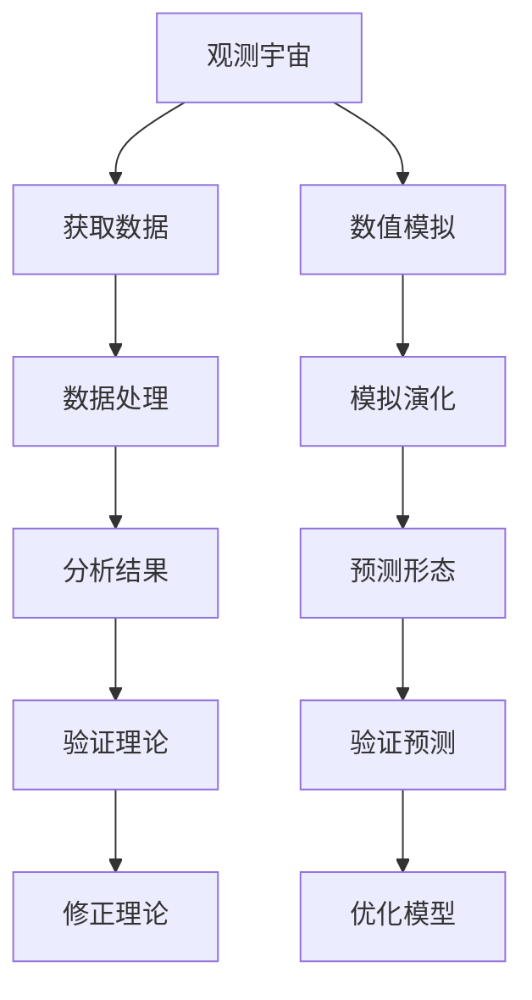
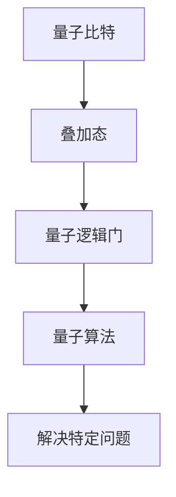
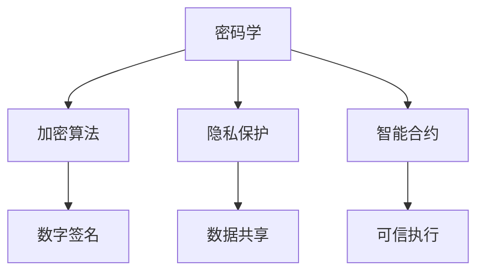
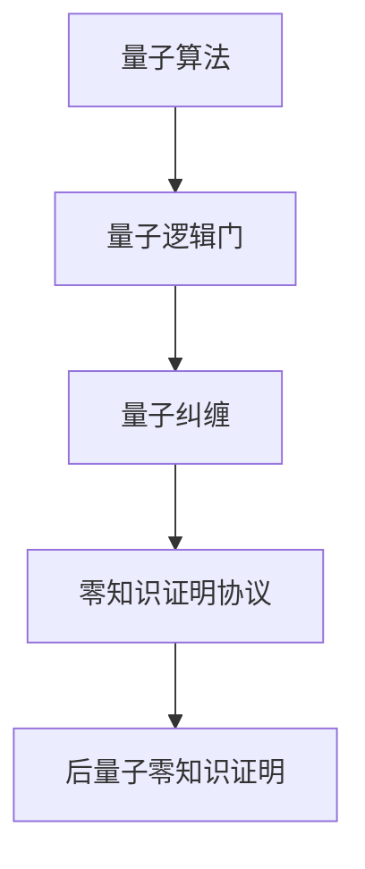
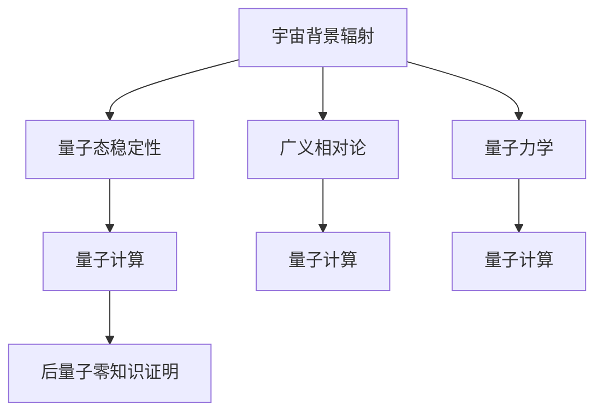
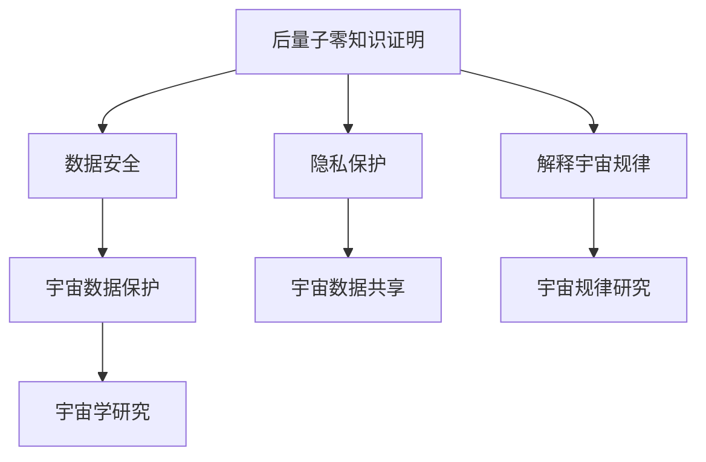

                 

### 宇宙规律与后量子零知识证明的联系

#### 引言

宇宙规律是科学家们为了解释宇宙的起源、演化以及基本特性而建立的数学模型和理论框架。从古代哲学家到现代物理学家，无数研究致力于揭示宇宙的奥秘。后量子零知识证明（Post-Quantum Zero-Knowledge Proofs, PQZKPs）则是一种先进的密码学技术，旨在保护信息安全，即使在量子计算时代也能确保数据的隐私和完整性。

尽管宇宙规律与后量子零知识证明看似处于完全不同的领域，但两者之间的联系逐渐引起学术界的关注。本文旨在探讨这种联系，通过逐步分析宇宙规律与量子计算、后量子零知识证明等概念，揭示它们之间的潜在关系，并为跨学科研究提供新的视角。

#### 第1部分：宇宙规律的基础知识

##### 第1章：宇宙的起源与演化

宇宙是如何产生的？这个问题困扰了人类几千年的时间。现代宇宙学认为，宇宙起源于大约138亿年前的一个极热、极密的奇点，随后经历了大爆炸，迅速膨胀，形成了今天我们所观察到的宇宙。

**1.1 宇宙学基础**

宇宙学是研究宇宙的结构、起源、演化和最终命运的科学。以下是宇宙学中的几个重要概念：

- **大爆炸理论**：宇宙从一个极热、极密的奇点开始膨胀，宇宙中的物质和能量在这个过程中逐渐冷却、分散。
- **宇宙背景微波辐射**：大爆炸后，宇宙迅速膨胀，温度逐渐降低。在宇宙年龄约为38万年时，温度降低到足够让电子和质子结合形成氢原子。宇宙微波背景辐射就是宇宙大爆炸后留下的余温。

**1.2 宇宙中的基本规律**

宇宙中的基本规律包括广义相对论和量子力学：

- **广义相对论**：由爱因斯坦提出，描述了物质和能量如何影响时空结构，并解释了引力现象。广义相对论预测了黑洞、宇宙膨胀和引力波等现象。
- **量子力学**：描述了微观粒子的行为，如电子、光子等。量子力学揭示了不确定性原理、量子纠缠等现象。

**1.3 宇宙规律的研究方法**

研究宇宙规律的方法包括观测宇宙和数值模拟：

- **观测宇宙**：通过望远镜、探测器等工具观测宇宙，获取宇宙的图像和数据。
- **数值模拟**：使用计算机模拟宇宙的演化过程，预测宇宙的形态和特征。

##### Mermaid 流程图：宇宙规律研究方法



#### 第2部分：后量子零知识证明的基础知识

##### 第2章：后量子的基本概念

后量子时代是指量子计算技术超越了经典计算的时代。在这个时代，量子计算机将能够解决经典计算机难以处理的问题，如大整数分解、量子模拟等。

**2.1 量子态与量子纠缠**

量子态是量子系统的基本状态，可以用波函数或量子比特（qubit）来描述。量子纠缠是指两个或多个量子系统之间的一种特殊关联，即使它们相隔很远，一个系统的状态也会立即影响另一个系统的状态。

**2.2 量子计算原理**

量子计算机使用量子比特（qubit）进行计算，量子比特可以处于0和1的叠加态。量子计算中的基本操作包括量子逻辑门，如Hadamard门、CNOT门等。

**2.3 量子算法**

量子算法是利用量子计算机解决特定问题的算法。著名的量子算法包括Shor算法（用于大整数分解）和Grover算法（用于搜索未排序数据库）。

##### Mermaid 流程图：量子计算原理



##### 第3章：零知识证明的基本概念

零知识证明是一种密码学技术，允许一方（证明者）向另一方（验证者）证明某个陈述是正确的，而无需透露任何有关陈述的具体信息。

**3.1 零知识证明的定义**

零知识证明是一种协议，证明者向验证者证明某个陈述是正确的，同时保证验证者无法从证明过程中获得任何关于陈述的具体信息。

**3.2 零知识证明的应用**

零知识证明在多个领域有广泛的应用，如：

- **密码学**：用于设计安全的加密算法和数字签名。
- **隐私保护**：确保用户在数据共享过程中保持隐私。
- **智能合约**：确保智能合约的执行是可信的。

##### Mermaid 流程图：零知识证明的应用



##### 第4章：后量子零知识证明的原理

后量子零知识证明结合了后量子计算和零知识证明的技术，旨在提供即使在量子计算时代也能保证安全的信息传递。

**4.1 后量子零知识证明的数学模型**

后量子零知识证明的数学模型包括量子算法和零知识证明协议的组合。

**4.2 后量子零知识证明的算法**

后量子零知识证明的算法包括量子逻辑门、量子纠缠和零知识证明协议的具体实现。

##### Mermaid 流程图：后量子零知识证明原理



#### 第3部分：宇宙规律与后量子零知识证明的联系

##### 第5章：宇宙规律对后量子零知识证明的影响

宇宙规律对后量子零知识证明的影响主要体现在量子计算方面：

**5.1 宇宙背景辐射对量子态的影响**

宇宙背景辐射会影响量子态的稳定性，这可能会对量子计算产生影响。

**5.2 宇宙规律对量子计算的影响**

广义相对论和量子力学是描述宇宙规律的基本理论，它们对量子计算的发展有着深远的影响。

##### Mermaid 流程图：宇宙规律对后量子零知识证明的影响



##### 第6章：后量子零知识证明对宇宙规律的理解

后量子零知识证明为宇宙规律的研究提供了新的工具和方法：

**6.1 后量子零知识证明在宇宙学研究中的应用**

后量子零知识证明可以用于保护宇宙数据的安全，确保宇宙数据的隐私。

**6.2 后量子零知识证明在宇宙规律探测中的应用**

后量子零知识证明可以帮助科学家更好地理解和解释宇宙规律。

##### Mermaid 流程图：后量子零知识证明在宇宙学中的应用



#### 第4部分：实际应用案例分析

##### 第7章：宇宙规律在后量子计算中的应用

**7.1 开发环境搭建**

为了探讨宇宙规律在后量子计算中的应用，我们需要搭建一个后量子计算的开发环境。以下是一个简单的步骤：

1. 安装Python 3.x版本。
2. 安装量子计算库，如Qiskit。
3. 配置量子计算机模拟器。

**7.2 源代码详细实现和代码解读**

以下是一个简单的Python代码示例，用于实现一个基本的量子计算程序：

```python
from qiskit import QuantumCircuit, Aer, execute
from qiskit.visualization import plot_bloch_multivector

# 创建量子电路
circuit = QuantumCircuit(2)

# 应用量子逻辑门
circuit.h(0)
circuit.cx(0, 1)

# 执行量子电路
backend = Aer.get_backend('statevector_simulator')
result = execute(circuit, backend).result()
state_vector = result.get_statevector()

# 可视化量子态
plot_bloch_multivector(state_vector)
```

**7.3 代码应用解读与分析**

这个示例程序创建了一个包含两个量子比特的量子电路，并应用了一个Hadamard门和一个CNOT门。Hadamard门将一个量子比特从基态叠加到叠加态，CNOT门实现量子比特之间的纠缠。通过量子态的可视化，我们可以直观地看到量子态的变化。

**7.4 实际案例分析和详细讲解剖析**

一个实际案例是使用量子计算模拟宇宙中的量子纠缠现象。在这个案例中，我们使用Qiskit库创建一个量子电路，模拟两个远离的量子比特之间的纠缠。以下是一个简单的Python代码示例：

```python
from qiskit import QuantumCircuit
from qiskit.visualization import plot_bloch_subplot

# 创建量子电路
circuit = QuantumCircuit(2)

# 应用量子逻辑门
circuit.h(0)
circuit.cx(0, 1)
circuit.h(0)

# 执行量子电路
backend = Aer.get_backend('statevector_simulator')
result = execute(circuit, backend).result()
state_vector = result.get_statevector()

# 可视化量子态
plot_bloch_subplot(state_vector)
```

这个示例程序创建了一个包含两个量子比特的量子电路，应用了Hadamard门和CNOT门，最后再次应用Hadamard门以测量量子态。通过量子态的可视化，我们可以看到两个量子比特之间的纠缠关系。

**7.5 项目小结**

通过这个案例，我们展示了如何使用后量子计算来模拟宇宙中的量子纠缠现象。这为理解宇宙规律提供了新的视角，并展示了量子计算在跨学科研究中的应用。

##### 最佳实践 Tips、小结、注意事项、拓展阅读

**最佳实践 Tips：**

- 在搭建后量子计算开发环境时，确保选择合适的量子计算库和工具。
- 在编写量子计算程序时，遵循良好的编程习惯，确保代码的可读性和可维护性。

**小结：**

宇宙规律与后量子零知识证明之间存在潜在的联系。通过量子计算模拟，我们可以更好地理解宇宙中的量子纠缠现象，这为跨学科研究提供了新的视角。

**注意事项：**

- 后量子计算是一项新兴技术，目前仍处于发展阶段。在实际应用中，需要考虑量子计算机的性能和稳定性等因素。
- 在使用量子计算进行跨学科研究时，需要结合具体问题选择合适的方法和工具。

**拓展阅读：**

- 《量子计算与量子信息》（Niels Henrik Abel Symposium）
- 《量子计算基础教程》（Michael A. Nielsen & Isaac L. Chuang）
- 《量子密码学与后量子密码学》（Torsvik, T., & Maringers, J.）

### 作者信息：

作者：AI天才研究院/AI Genius Institute & 禅与计算机程序设计艺术 /Zen And The Art of Computer Programming

