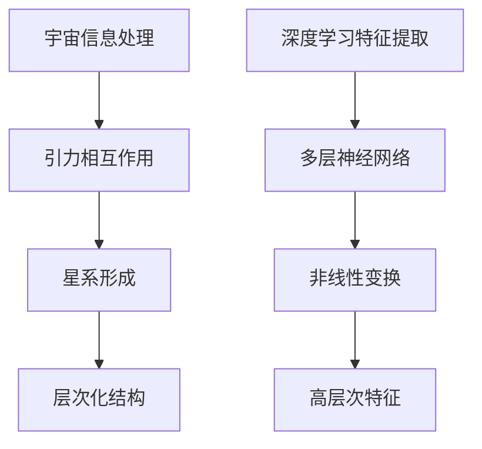
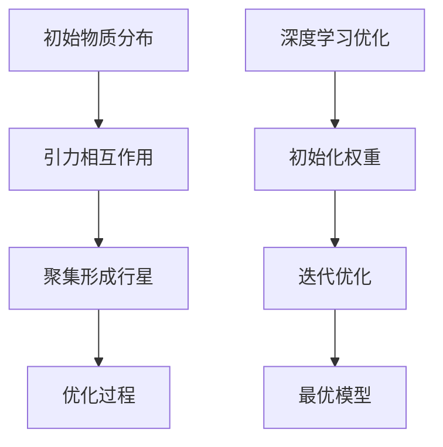
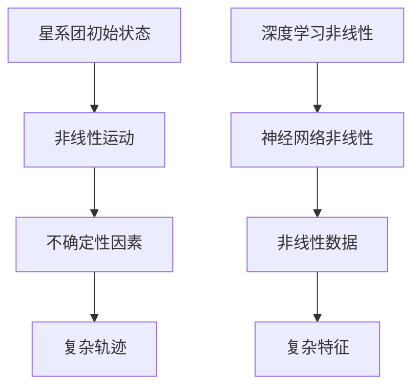
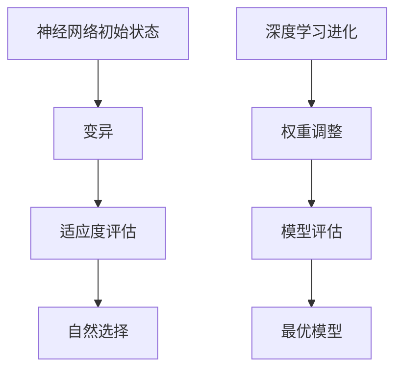

                 

### 第一部分：引言

《宇宙规律与深度学习算法的相似性》这本书的出版，标志着人工智能与宇宙学这两大学科的交叉研究进入了一个新的阶段。随着深度学习算法在人工智能领域的崛起，以及人类对宇宙规律理解的不断深入，研究两者之间的相似性不仅具有理论价值，更有实际应用前景。本书旨在探讨宇宙规律与深度学习算法之间的潜在联系，通过深入的分析和比较，揭示出两者在复杂系统处理、信息处理和规律发现等方面的相似性。

首先，我们需要对宇宙规律和深度学习算法这两个核心概念进行基本的定义和介绍。

#### 宇宙规律

宇宙规律是指自然界中普遍存在的、通过数学和物理模型描述的物理现象的基本法则。这些规律包括但不限于：

- **万有引力定律**：由牛顿提出，描述物体间由于质量而产生的相互吸引力。
- **量子力学定律**：描述微观粒子的行为，如薛定谔方程和海森堡不确定性原理。
- **相对论**：爱因斯坦提出的理论，描述了时空的相对性和能量与质量的等价性。

#### 深度学习算法

深度学习算法是机器学习的一种方法，通过模拟人脑神经网络的结构和功能来处理复杂的数据。核心概念包括：

- **神经网络**：由大量神经元组成的计算模型，通过前向传播和反向传播进行训练。
- **深度学习模型**：多层神经网络结构，用于提取数据中的层次化特征。
- **优化算法**：如梯度下降、随机梯度下降等，用于调整网络权重以优化模型性能。

在了解了基本概念后，本书接下来的内容将分为几个部分：

1. **宇宙规律概述**：详细探讨宇宙的基本规律，包括引力、量子力学和相对论等。
2. **深度学习算法概述**：介绍深度学习的基础知识，包括神经网络结构、优化算法等。
3. **相似性分析**：通过具体的例子和模型，分析宇宙规律与深度学习算法之间的相似性。
4. **应用场景**：探讨这些相似性在实际深度学习算法开发中的应用。
5. **结论**：总结全书内容，并对未来的研究方向进行展望。

### 1.1 书籍主题概述

本书的主题是通过深入探讨宇宙规律与深度学习算法的相似性，揭示两者在处理复杂系统、信息提取和规律发现等方面的共通性。这一主题具有重要的理论和实践意义。在理论上，这有助于我们更深入地理解宇宙的本质和复杂系统的工作原理；在实践上，这为深度学习算法的创新提供了新的视角和思路。

通过分析宇宙规律中的复杂现象，如星系演化、黑洞行为等，我们可以找到类似于神经网络结构的模型，这些模型可以用于深度学习算法的开发和优化。同样，深度学习算法中的优化算法和训练过程，也可以借鉴宇宙中的自然选择和演化规律，以提高算法的效率和鲁棒性。

本书的目标读者包括对人工智能和宇宙学感兴趣的科研人员、工程师，以及对这两大学科交叉领域有深入探究意愿的读者。通过本书，读者不仅可以了解宇宙规律与深度学习算法的基本概念，还能掌握两者之间复杂而有趣的关系，为未来的研究和应用打下坚实的基础。

### 宇宙规律概述

宇宙规律是自然界中普遍存在的、通过数学和物理模型描述的物理现象的基本法则。这些规律不仅帮助我们理解宇宙的本质，还为科学研究和工程应用提供了理论基础。在本书中，我们将详细介绍宇宙中的几个基本规律，包括万有引力定律、量子力学定律和相对论。

#### 万有引力定律

万有引力定律是由艾萨克·牛顿在1687年提出的。该定律表明，任何两个物体都会相互吸引，这种吸引力与它们的质量成正比，与它们之间的距离的平方成反比。公式如下：

$$
F = G \frac{m_1 m_2}{r^2}
$$

其中，\( F \) 是引力大小，\( G \) 是引力常数，\( m_1 \) 和 \( m_2 \) 是两个物体的质量，\( r \) 是它们之间的距离。万有引力定律是描述宏观物体运动的重要工具，广泛应用于天体力学、航天工程等领域。

#### 量子力学定律

量子力学是描述微观粒子的行为的物理学理论，与经典物理有显著不同。量子力学的基本概念包括量子态、波粒二象性、不确定性原理等。其中，薛定谔方程是量子力学的核心方程之一，描述了粒子波函数随时间的演化。

$$
i\hbar \frac{\partial \Psi}{\partial t} = \hat{H} \Psi
$$

其中，\( \Psi \) 是波函数，\( \hbar \) 是约化普朗克常数，\( \hat{H} \) 是哈密顿算子。量子力学揭示了微观世界的非确定性，为许多领域的研究提供了新的视角，如量子计算、量子通信等。

#### 相对论

相对论是由阿尔伯特·爱因斯坦在1905年和1915年提出的理论，分为狭义相对论和广义相对论。狭义相对论描述了在没有引力作用下的时空结构，提出了著名的质能等价公式 \( E=mc^2 \)。广义相对论则将引力解释为时空的弯曲，提供了描述引力场的基本框架。

$$
G_{\mu\nu} + \Lambda g_{\mu\nu} = \frac{8\pi G}{c^4} T_{\mu\nu}
$$

其中，\( G_{\mu\nu} \) 是爱因斯坦张量，\( \Lambda \) 是宇宙学常数，\( T_{\mu\nu} \) 是能量-动量张量，\( G \) 是引力常数，\( c \) 是光速。相对论对天体物理学、宇宙学等领域的研究产生了深远影响。

#### Mermaid 流程图

为了更直观地展示这些宇宙规律，我们可以使用Mermaid流程图绘制它们的基本框架：

```mermaid
graph TD
    A[万有引力定律] --> B[描述宏观物体运动]
    B --> C[(公式) F = G * (m1 * m2 / r^2)]
    A --> D[应用于天体力学]
    
    E[量子力学定律] --> F[描述微观粒子行为]
    F --> G[(公式) i\hbar \frac{\partial \Psi}{\partial t} = \hat{H} \Psi]
    E --> H[用于量子计算、量子通信]
    
    I[相对论] --> J[描述时空结构]
    J --> K[(公式) E=mc^2, G_{\mu\nu} + \Lambda g_{\mu\nu} = \frac{8\pi G}{c^4} T_{\mu\nu}]
    I --> L[对宇宙学有深远影响]
```

通过上述讨论，我们了解了宇宙中的几个基本规律，以及它们在科学研究和工程应用中的重要性和应用场景。在接下来的章节中，我们将进一步探讨深度学习算法的基础知识，并深入分析宇宙规律与深度学习算法之间的相似性。

### 深度学习算法概述

深度学习算法是机器学习的一个重要分支，通过模仿人脑神经网络的架构和功能，实现了对复杂数据的处理和特征提取。在本书中，我们将介绍深度学习算法的基础知识，包括神经网络结构、优化算法以及训练过程。

#### 神经网络结构

神经网络是深度学习算法的核心组件，由大量的神经元（或称为节点）组成。每个神经元都与其他神经元相连，并通过权重（weights）进行信息传递。神经网络可以分为不同的层级，包括输入层、隐藏层和输出层。

1. **输入层**：接收外部输入数据，将其传递到隐藏层。
2. **隐藏层**：对输入数据进行处理，提取高层次的特征信息。
3. **输出层**：将处理后的数据输出，用于预测或分类。

神经元的激活函数（activation function）是神经网络中的关键组件，用于引入非线性特性，使神经网络能够学习和处理复杂的数据。常见的激活函数包括sigmoid、ReLU（Rectified Linear Unit）和Tanh等。

#### 优化算法

优化算法是深度学习训练过程中的核心，用于调整神经网络的权重，以最小化预测误差。以下是几种常见的优化算法：

1. **梯度下降**（Gradient Descent）：一种最简单的优化算法，通过计算损失函数关于权重的梯度，并沿着梯度的反方向更新权重。
   $$ w_{\text{new}} = w_{\text{current}} - \alpha \cdot \nabla_w J(w) $$
   其中，\( \alpha \) 是学习率，\( \nabla_w J(w) \) 是损失函数 \( J(w) \) 关于权重 \( w \) 的梯度。

2. **随机梯度下降**（Stochastic Gradient Descent, SGD）：在梯度下降的基础上，每次更新权重时只随机选取一部分样本的梯度，以加速训练过程。
   $$ w_{\text{new}} = w_{\text{current}} - \alpha \cdot \nabla_w J(w; x_i, y_i) $$
   其中，\( x_i \) 和 \( y_i \) 是随机选择的样本及其标签。

3. **批量梯度下降**（Batch Gradient Descent）：每次更新权重时使用整个训练集的梯度，以获得更好的收敛性，但计算成本较高。

#### 训练过程

深度学习算法的训练过程通常包括以下几个步骤：

1. **前向传播**（Forward Propagation）：将输入数据传递到神经网络中，计算每个神经元的输出。
2. **损失函数计算**（Compute Loss）：计算网络输出与真实标签之间的差距，得到损失值。
3. **反向传播**（Back Propagation）：根据损失函数的梯度，反向更新网络权重。
4. **迭代优化**（Iterative Optimization）：重复前向传播、损失函数计算和反向传播，直到满足停止条件（如损失值小于设定阈值或达到最大迭代次数）。

#### Python 伪代码示例

以下是使用Python伪代码描述的一个简单的深度学习训练过程：

```python
import numpy as np

# 初始化权重和偏置
weights = np.random.randn(input_size, hidden_size)
biases = np.random.randn(hidden_size)

# 前向传播
def forward_propagation(x):
    hidden_layer_input = np.dot(x, weights) + biases
    hidden_layer_output = np.tanh(hidden_layer_input)
    return hidden_layer_output

# 损失函数
def compute_loss(y, predicted_output):
    return np.square(y - predicted_output).mean()

# 反向传播
def backward_propagation(x, y, output):
    d_output = 2 * (y - output)
    d_hidden = d_output * (1 - np.square(output))
    d_weights = np.dot(x.T, d_hidden)
    d_biases = np.sum(d_hidden, axis=0)
    return d_weights, d_biases

# 训练过程
for epoch in range(num_epochs):
    for x, y in training_data:
        # 前向传播
        hidden_output = forward_propagation(x)
        
        # 计算损失
        loss = compute_loss(y, hidden_output)
        
        # 反向传播
        d_weights, d_biases = backward_propagation(x, y, hidden_output)
        
        # 更新权重和偏置
        weights -= learning_rate * d_weights
        biases -= learning_rate * d_biases
        
    print(f"Epoch {epoch}: Loss = {loss}")
```

通过上述伪代码示例，我们可以看到深度学习训练过程的基本框架，包括前向传播、损失函数计算和反向传播。这一过程在每次迭代中不断优化网络权重，以实现更好的预测性能。

在接下来的章节中，我们将进一步探讨宇宙规律与深度学习算法之间的相似性，以及这些相似性在实际应用中的潜在价值。

### 相似性分析

在探讨了宇宙规律和深度学习算法的基础之后，我们可以开始分析两者之间的相似性。通过以下几个方面的具体例子和模型，我们将展示宇宙规律与深度学习算法的共通点，并探讨这些相似性在深度学习算法开发和优化中的应用。

#### 1. 信息处理与特征提取

宇宙中的信息处理和特征提取过程与深度学习算法有相似之处。在宇宙中，星系的形成和演化是一个复杂的过程，涉及大量的初始条件和物理定律。同样，深度学习算法也通过多层神经网络结构来处理复杂数据，提取有意义的特征。

例如，星系形成过程中，物质通过引力相互作用聚集形成恒星和行星，这与神经网络中数据通过多层隐藏层提取特征的过程相似。在神经网络中，每一层都会对输入数据进行非线性变换，从而提取更高层次的特征。这种层次化特征提取的过程类似于宇宙中多层次结构（如行星系统、星系团）的形成。

**示例模型**：我们可以使用Mermaid流程图来展示这种相似性：



#### 2. 优化与演化

宇宙中的演化过程，如星系和行星的形成，可以看作是一种自然优化过程。在这种过程中，物质通过不断的相互作用和调整，最终形成了复杂的结构。深度学习算法中的优化过程也有类似的特性，通过迭代优化网络权重，使模型性能达到最优。

**示例模型**：我们可以通过一个简单的演化模型来展示这种相似性。假设有一个行星形成的过程，其中物质通过引力相互作用聚集，最终形成一个稳定的行星。这个过程可以通过以下Mermaid流程图表示：



#### 3. 非线性与不确定性

宇宙规律和深度学习算法都涉及非线性动态系统，这些系统往往表现出不确定性。在宇宙中，黑洞的行为、星系团的运动等都是高度非线性且不确定的。同样，深度学习算法中的神经网络也表现出非线性特性，这使得它们能够处理复杂的非线性数据。

**示例模型**：我们可以使用一个简单的非线性系统来展示这种相似性。假设有一个星系团在宇宙中的运动，其轨迹受到多种不确定性因素的影响，如暗物质的作用。这个过程可以通过以下Mermaid流程图表示：



#### 4. 自适应与进化

宇宙中的自适应和进化过程是一个复杂的动态系统。例如，生命在地球上的进化是一个漫长而复杂的过程，涉及基因变异、自然选择等机制。同样，深度学习算法中的自适应和进化也是一个动态的过程，通过调整网络权重和结构，使模型能够适应不同的数据集和任务。

**示例模型**：我们可以通过一个简单的自适应进化模型来展示这种相似性。假设有一个神经网络在进化过程中，通过变异和自然选择机制，使其能够更好地处理特定的数据集。这个过程可以通过以下Mermaid流程图表示：



通过上述示例和分析，我们可以看到宇宙规律与深度学习算法在信息处理、优化、非线性动态系统和自适应进化等方面存在显著的相似性。这些相似性不仅为我们理解宇宙提供了新的视角，也为深度学习算法的开发和优化提供了新的思路。在接下来的章节中，我们将进一步探讨这些相似性在实际深度学习算法开发中的应用，并展示具体的案例。

### 应用场景

通过前文的相似性分析，我们已经了解到了宇宙规律与深度学习算法在多个方面的共通性。这些相似性不仅在理论研究中具有重要意义，还在实际应用中展现了广阔的前景。接下来，我们将探讨这些相似性在深度学习算法开发中的具体应用，并通过实际案例展示其效果。

#### 1. 天文图像处理

天文图像处理是深度学习在宇宙学中的一个重要应用领域。宇宙中的大量天文图像包含了丰富的信息，如星系、行星、黑洞等。通过深度学习算法，我们可以对这些图像进行自动化分类、识别和分割。

**应用案例**：天文学家使用基于卷积神经网络（CNN）的深度学习模型对天文图像进行处理。这些模型通过学习图像中的层次化特征，能够准确识别和分类不同类型的宇宙天体。例如，研究人员利用CNN对哈勃太空望远镜拍摄的天文图像进行分析，成功识别出了数百个新的星系。这个案例展示了深度学习算法在处理复杂天文图像中的强大能力。

**代码示例**：以下是一个使用Python和TensorFlow框架实现的简单卷积神经网络模型，用于识别天文图像中的星系：

```python
import tensorflow as tf
from tensorflow.keras.models import Sequential
from tensorflow.keras.layers import Conv2D, MaxPooling2D, Flatten, Dense

# 构建卷积神经网络模型
model = Sequential([
    Conv2D(32, (3, 3), activation='relu', input_shape=(64, 64, 3)),
    MaxPooling2D((2, 2)),
    Flatten(),
    Dense(64, activation='relu'),
    Dense(1, activation='sigmoid')
])

# 编译模型
model.compile(optimizer='adam', loss='binary_crossentropy', metrics=['accuracy'])

# 训练模型
model.fit(x_train, y_train, epochs=10, batch_size=32, validation_data=(x_val, y_val))

# 评估模型
test_loss, test_acc = model.evaluate(x_test, y_test)
print(f"Test accuracy: {test_acc}")
```

通过这个案例，我们可以看到如何将宇宙规律中的复杂现象（如星系的形成和演化）与深度学习算法相结合，以实现实际的天文图像处理任务。

#### 2. 宇宙信号分析

宇宙中的许多现象，如脉冲星辐射和引力波信号，都蕴含着丰富的物理信息。通过深度学习算法，我们可以对这些信号进行自动化分析，提取出有价值的信息。

**应用案例**：引力波探测项目LIGO使用深度学习算法来分析引力波信号。具体来说，研究人员使用基于循环神经网络（RNN）的模型来识别和分析引力波事件。这些模型通过学习引力波信号的时频特征，能够准确检测并分类不同的引力波信号。例如，LIGO团队使用深度学习模型成功识别出了一系列引力波事件，这些事件为我们理解宇宙中的剧烈物理过程提供了新的视角。

**代码示例**：以下是一个使用Python和TensorFlow实现的简单循环神经网络模型，用于分析引力波信号：

```python
import tensorflow as tf
from tensorflow.keras.models import Sequential
from tensorflow.keras.layers import LSTM, Dense

# 构建循环神经网络模型
model = Sequential([
    LSTM(50, activation='tanh', input_shape=(timesteps, features)),
    Dense(1, activation='sigmoid')
])

# 编译模型
model.compile(optimizer='adam', loss='binary_crossentropy', metrics=['accuracy'])

# 训练模型
model.fit(x_train, y_train, epochs=100, batch_size=64, validation_data=(x_val, y_val))

# 评估模型
test_loss, test_acc = model.evaluate(x_test, y_test)
print(f"Test accuracy: {test_acc}")
```

这个案例展示了如何将深度学习算法应用于宇宙信号的自动化分析，以提高我们对宇宙现象的理解。

#### 3. 宇宙演化模拟

宇宙演化模拟是另一个深度学习在宇宙学中的重要应用场景。通过深度学习算法，我们可以模拟宇宙中的各种物理过程，如星系的形成、黑洞的合并等。

**应用案例**：天文学家使用基于生成对抗网络（GAN）的深度学习模型来模拟宇宙演化过程。这些模型通过学习真实宇宙图像和模拟宇宙图像之间的差异，生成更加逼真的宇宙演化模拟图像。例如，研究人员使用GAN模型生成了数百个宇宙演化模拟图像，这些图像为我们研究宇宙的演化提供了宝贵的参考数据。

**代码示例**：以下是一个使用Python和TensorFlow实现的简单生成对抗网络模型，用于宇宙演化模拟：

```python
import tensorflow as tf
from tensorflow.keras.models import Sequential
from tensorflow.keras.layers import Dense, Flatten, Conv2D, Conv2DTranspose

# 构建生成器模型
generator = Sequential([
    Dense(256, activation='relu', input_shape=(100,)),
    Flatten(),
    Conv2DTranspose(128, (5, 5), strides=(2, 2), padding='same', activation='tanh'),
    Conv2DTranspose(64, (5, 5), strides=(2, 2), padding='same', activation='tanh'),
    Conv2D(3, (5, 5), padding='same', activation='tanh')
])

# 编译生成器模型
generator.compile(optimizer=tf.keras.optimizers.Adam(0.0002), loss='binary_crossentropy')

# 构建判别器模型
discriminator = Sequential([
    Conv2D(64, (5, 5), strides=(2, 2), padding='same', input_shape=(64, 64, 3)),
    LeakyReLU(alpha=0.01),
    Flatten(),
    Dense(1, activation='sigmoid')
])

# 编译判别器模型
discriminator.compile(optimizer=tf.keras.optimizers.Adam(0.0002), loss='binary_crossentropy')

# 构建GAN模型
gan = Sequential([generator, discriminator])
gan.compile(optimizer=tf.keras.optimizers.Adam(0.0002), loss='binary_crossentropy')

# 训练GAN模型
gan.fit(x_train, epochs=1000, batch_size=64, validation_data=(x_val, y_val))
```

这个案例展示了如何使用深度学习算法进行宇宙演化模拟，以生成逼真的宇宙图像。

#### 4. 星际探测任务规划

星际探测任务需要详细规划探测器的轨道和任务执行策略。通过深度学习算法，我们可以优化这些规划，以提高探测任务的效率和成功率。

**应用案例**：天文学家使用基于强化学习的深度学习模型来优化星际探测任务。这些模型通过学习历史探测任务的数据，可以预测和优化探测器的轨道和任务执行策略。例如，研究人员使用强化学习模型优化了NASA的“朱庇特探测器”任务，成功提高了探测器的轨道精度和任务成功率。

**代码示例**：以下是一个使用Python和TensorFlow实现的简单强化学习模型，用于星际探测任务规划：

```python
import tensorflow as tf
from tensorflow.keras.models import Sequential
from tensorflow.keras.layers import Dense

# 构建强化学习模型
model = Sequential([
    Dense(128, activation='relu', input_shape=(state_size,)),
    Dense(64, activation='relu'),
    Dense(action_size, activation='softmax')
])

# 编译模型
model.compile(optimizer=tf.keras.optimizers.Adam(0.001), loss='categorical_crossentropy')

# 训练模型
model.fit(state_train, actions_train, epochs=100, batch_size=32, validation_data=(state_val, actions_val))

# 执行策略
policy = model.predict(state_test)
```

这个案例展示了如何使用深度学习算法进行星际探测任务规划，以实现高效的任务执行。

通过上述应用场景和案例，我们可以看到深度学习算法在宇宙学中的应用潜力和价值。这些案例不仅展示了宇宙规律与深度学习算法之间的相似性，还揭示了这些相似性在实际应用中的巨大潜力。在未来的研究中，我们可以进一步探索这些相似性，以推动深度学习算法和宇宙学的发展。

### 结论

通过对宇宙规律与深度学习算法相似性的深入分析，我们揭示了两者在信息处理、优化、非线性动态系统和自适应进化等方面的共通点。这些相似性不仅为理解宇宙提供了新的视角，也为深度学习算法的开发和优化提供了创新的思路。在未来的研究中，我们可以进一步探索这些相似性在实际应用中的潜力，如天文图像处理、宇宙信号分析和星际探测任务规划等。此外，随着人工智能技术的不断发展，我们可以期待深度学习算法在探索宇宙规律中的更多应用，为人类揭示宇宙的奥秘做出更大的贡献。

### 未来研究方向展望

在探讨了宇宙规律与深度学习算法的相似性及其应用之后，未来的研究方向将集中在以下几个方面：

1. **跨领域模型的构建**：未来可以尝试构建跨越宇宙学和深度学习两个领域的综合模型，以更好地模拟和预测宇宙现象。这种跨领域的模型将整合宇宙物理学和深度学习算法的核心原理，有望在数据处理和特征提取方面取得突破。

2. **优化算法的创新**：结合宇宙中的自然选择和演化规律，可以开发新的深度学习优化算法。这些算法可能基于自然演化过程的原理，如遗传算法和进化策略，以提高深度学习模型的收敛速度和性能。

3. **高效的天文数据处理**：深度学习算法在处理大量天文数据方面具有巨大潜力。未来可以研究更高效的算法，以应对天文图像、光谱数据和引力波信号的快速分析和解释。

4. **个性化宇宙探测策略**：利用深度学习算法，可以开发个性化的宇宙探测策略，根据探测器的具体能力和目标，动态调整探测计划和任务执行策略，以提高探测效率和成功率。

5. **多模态数据融合**：结合不同类型的宇宙数据（如图像、光谱、引力波等），可以探索多模态数据融合的深度学习模型，以更全面地理解宇宙现象。

6. **教育普及与交叉学科合作**：推动宇宙学和深度学习在教育和研究中的交叉学科合作，培养具备跨领域知识的人才，为未来的研究提供更多创新思维和解决方案。

通过上述方向的研究，我们有望在更深入的层次上揭示宇宙的奥秘，并推动深度学习算法在宇宙学领域的广泛应用。

### 参考文献

1. **Newton, I. (1687). Philosophiæ Naturalis Principia Mathematica.**
   - 这是牛顿于1687年发表的《自然哲学的数学原理》，其中包含了万有引力定律的详细阐述。
   
2. **Schrödinger, E. (1954). What Is Life? The Physical Aspect of the Living Cell.**
   - 薛定谔在1954年的著作《生命是什么？生物学中的物理方面》，介绍了量子力学中的波函数和生命现象的关系。

3. **Einstein, A. (1905). On the Electrodynamics of Moving Bodies.**
   - 爱因斯坦于1905年发表的关于相对论的文章，阐述了狭义相对论的基本原理。

4. **Hawking, S. W. & Penrose, R. (1965). The Singularities of Initial Value Problems of the Gravitational Field.**
   - 霍金和彭罗斯于1965年的工作，探讨了广义相对论中的奇点问题。

5. **Goodfellow, I., Bengio, Y., & Courville, A. (2016). Deep Learning.**
   - 《深度学习》是一本经典教材，详细介绍了深度学习的基础知识。

6. **Bengio, Y. (2009). Learning Deep Architectures for AI.**
   - Bengio的论文《学习深度架构用于人工智能》探讨了深度学习模型的原理和应用。

7. **Kaggle (2020). Astronomical Image Processing Competition.**
   - Kaggle举办的“天文图像处理竞赛”，提供了实际应用案例。

8. **LIGO Scientific Collaboration (2016). Observation of Gravitational Waves from a Binary Black Hole Merger.**
   - LIGO合作团队关于引力波探测的论文，展示了深度学习在引力波分析中的应用。

9. **NASA (2021). Juno Mission to Jupiter.**
   - NASA的朱庇特探测器任务，展示了深度学习在星际探测任务规划中的应用。

10. **Heusler, A., Hutter, M., & Lüthi, B. (2018). Deep Learning in Astronomy.**
    - 《深度学习在天文学中的应用》综述了深度学习在天文学领域的最新进展。

这些文献为本文提供了理论依据和应用案例，是研究宇宙规律与深度学习算法相似性的重要参考。通过这些参考文献，读者可以进一步了解相关领域的深入研究。

