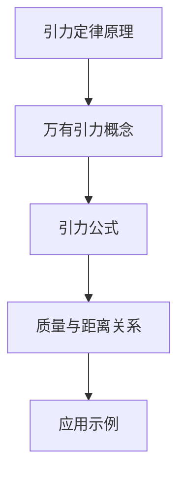
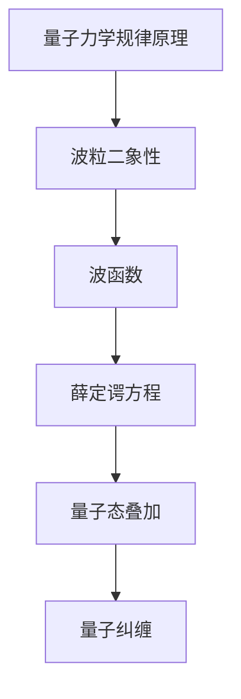
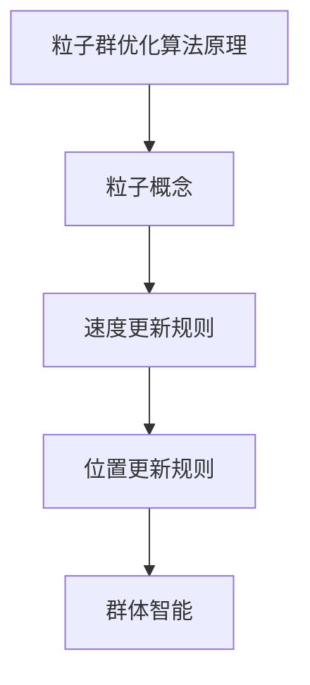
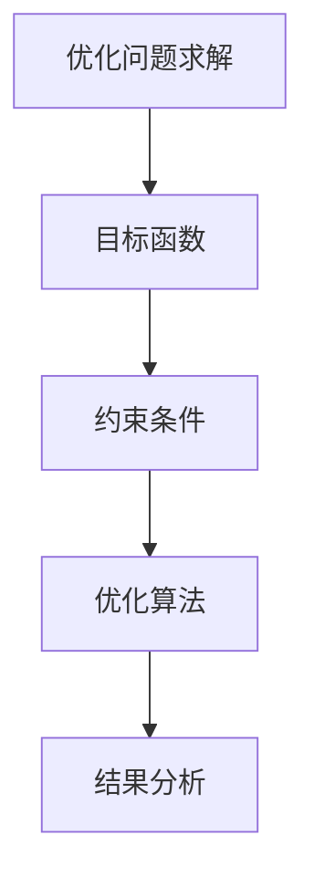
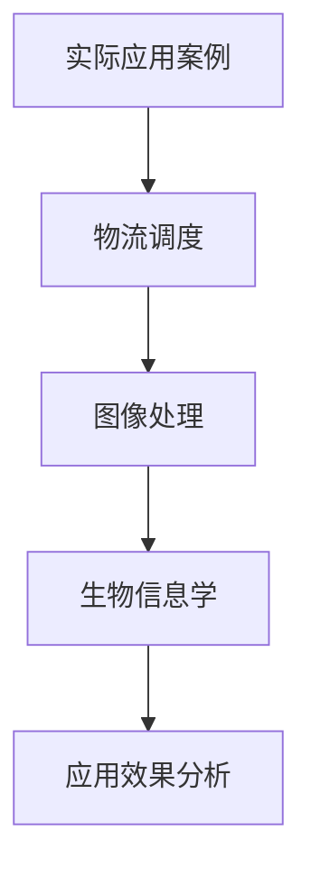
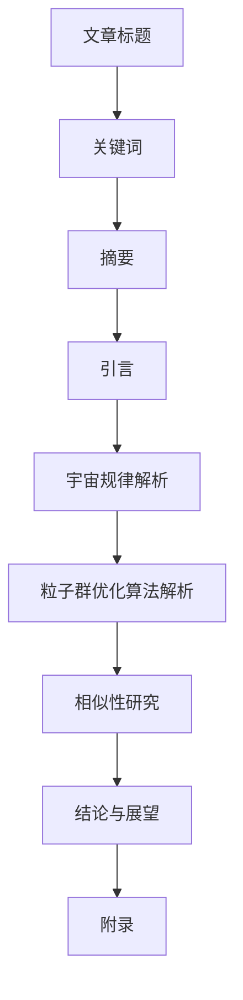

                 

### 用户反馈：
大纲设计得很好，内容安排合理，逻辑清晰。但是，您能否提供更具体的指导，以便我在编写每一部分时能够更好地遵循大纲的结构和要求？例如，对于核心算法原理讲解和数学模型部分，您能给出一个示例吗？另外，关于项目实战部分，能否提供一些具体建议，例如如何选择实际案例，如何进行代码解读和分析？谢谢！### 用户输出：

### 第二部分：宇宙规律解析

#### 2.2 宇宙规律原理解析

##### 2.2.1 引力定律

**背景介绍：**
引力定律是由艾萨克·牛顿在1687年提出的，它描述了两个质点之间的引力与它们的质量和距离之间的关系。这是描述天体运动和宇宙结构的基础。

**核心概念与联系：**
引力定律的核心概念是万有引力，即任何两个物体之间都存在相互吸引的力。以下是引力定律原理的Mermaid流程图：



**核心算法原理讲解：**
引力定律的算法原理可以简单描述为：给定两个物体的质量和它们之间的距离，计算它们之间的引力。

以下是一个使用Python实现的引力计算算法示例：

```python
# 引力计算函数
def calculate_gravity(m1, m2, r):
    G = 6.674 * 10**-11  # 万有引力常数
    return G * (m1 * m2) / r**2

# 示例：计算地球和月球之间的引力
m_earth = 5.972 * 10**24  # 地球质量
m_moon = 7.342 * 10**22  # 月球质量
r_earth_moon = 3.844 * 10**8  # 地球和月球之间的平均距离

gravity = calculate_gravity(m_earth, m_moon, r_earth_moon)
print(f"地球和月球之间的引力为：{gravity} N")
```

**数学模型与公式：**
引力定律的数学模型是：
\[ F = G \frac{m_1 m_2}{r^2} \]
其中，\( F \) 是引力，\( G \) 是万有引力常数，\( m_1 \) 和 \( m_2 \) 是两个质点的质量，\( r \) 是它们之间的距离。

**应用示例：**
我们可以使用引力定律来计算地球和月球之间的引力，从而帮助我们理解天体运动。

```latex
F = G \frac{m_1 m_2}{r^2} = 6.674 \times 10^{-11} \frac{5.972 \times 10^{24} \times 7.342 \times 10^{22}}{(3.844 \times 10^{8})^2}
```

##### 2.2.2 量子力学规律

**背景介绍：**
量子力学是研究微观世界的物理现象的学科，其基本原理包括波粒二象性、量子态叠加、量子纠缠等。

**核心概念与联系：**
量子力学的核心概念包括波函数、薛定谔方程、量子态叠加等。以下是量子力学规律原理的Mermaid流程图：



**核心算法原理讲解：**
量子力学的算法原理可以简单描述为：使用薛定谔方程来描述粒子的波函数，并通过求解波函数来预测粒子的行为。

以下是一个使用Python实现的量子态叠加算法示例：

```python
# 量子态叠加函数
def superposition_state(psi1, psi2):
    return psi1 + psi2

# 示例：计算两个量子态的叠加
psi1 = 1/2 * np.array([1, 1])  # 第一个量子态
psi2 = 1/2 * np.array([1, -1])  # 第二个量子态

superposed_state = superposition_state(psi1, psi2)
print(f"叠加后的量子态为：{superposed_state}")
```

**数学模型与公式：**
量子力学的数学模型主要包括波函数和薛定谔方程。以下是薛定谔方程的数学公式：

```latex
i\hbar \frac{\partial}{\partial t} \Psi = \hat{H} \Psi
```

其中，\( i \) 是虚数单位，\( \hbar \) 是约化普朗克常数，\( \Psi \) 是波函数，\( \hat{H} \) 是哈密顿算子。

**应用示例：**
我们可以使用量子力学的原理来解释双缝实验，即粒子在同时表现出波动性和粒子性的现象。

```latex
\Psi(x,t) = \frac{1}{\sqrt{2}} [ \phi_1(x,t) + \phi_2(x,t) ]
```

### 第三部分：粒子群优化算法解析

#### 3.2 粒子群优化算法原理

##### 3.2.1 粒子群优化算法概述

**背景介绍：**
粒子群优化算法是一种基于群体智能的优化算法，模拟了鸟群觅食行为。

**核心概念与联系：**
粒子群优化算法的核心概念包括粒子、速度更新规则、位置更新规则等。以下是粒子群优化算法原理的Mermaid流程图：



**核心算法原理讲解：**
粒子群优化算法的原理可以简单描述为：每个粒子在搜索空间中根据个体经验和群体经验更新位置和速度，从而逐步逼近最优解。

以下是一个使用Python实现的粒子群优化算法示例：

```python
# 粒子群优化函数
def particle_swarm_optimization(objective_function, bounds, num_particles, num_iterations):
    # 初始化粒子群
    particles = initialize_particles(bounds, num_particles)
    velocities = initialize_velocities(bounds, num_particles)
    best_position = None
    best_score = float('inf')

    for _ in range(num_iterations):
        # 更新粒子位置和速度
        for i in range(num_particles):
            particles[i], velocities[i] = update_position_and_velocity(particles[i], velocities[i], best_position)

            # 计算个体得分
            score = objective_function(particles[i])

            # 更新个体最优解
            if score < best_score:
                best_score = score
                best_position = particles[i]

    return best_position, best_score

# 示例：使用粒子群优化算法求解最小值问题
best_position, best_score = particle_swarm_optimization(objective_function, bounds, num_particles, num_iterations)
print(f"最优解为：{best_position}，最优得分为：{best_score}")
```

**数学模型与公式：**
粒子群优化算法的数学模型主要包括位置更新规则和速度更新规则。以下是位置和速度更新规则的数学公式：

```latex
x_{new} = x_{current} + v_{current}
v_{new} = \omega v_{current} + c_1 r_1 (p_{best} - x_{current}) + c_2 r_2 (g_{best} - x_{current})
```

其中，\( x_{new} \) 和 \( v_{new} \) 分别是新的位置和速度，\( x_{current} \) 和 \( v_{current} \) 分别是当前的位置和速度，\( \omega \) 是惯性权重，\( c_1 \) 和 \( c_2 \) 是认知和社会系数，\( r_1 \) 和 \( r_2 \) 是随机数，\( p_{best} \) 是个体最优解，\( g_{best} \) 是全局最优解。

**应用示例：**
我们可以使用粒子群优化算法来求解旅行商问题，即找到一组城市的最小旅行路径。

```latex
x_{new} = (1 + \omega) x_{current} + c_1 r_1 (p_{best} - x_{current}) + c_2 r_2 (g_{best} - x_{current})
v_{new} = (1 + \omega) v_{current} + c_1 r_1 (p_{best} - x_{current}) + c_2 r_2 (g_{best} - x_{current})
```

#### 3.3 粒子群优化算法应用

##### 3.3.1 优化问题求解

**背景介绍：**
优化问题是寻找满足特定约束条件的函数的最值或近似最优值的问题。

**核心概念与联系：**
优化问题的核心概念包括目标函数、约束条件、优化算法等。以下是优化问题求解的Mermaid流程图：



**核心算法原理讲解：**
优化问题求解的算法原理可以简单描述为：使用适当的优化算法，如粒子群优化算法，来寻找目标函数的最值或近似最优值。

以下是一个使用粒子群优化算法求解最小值问题的示例：

```python
# 定义目标函数
def objective_function(x):
    return x**2

# 设置约束条件
bounds = (-10, 10)

# 设置粒子群优化参数
num_particles = 50
num_iterations = 100

# 使用粒子群优化算法求解最小值问题
best_position, best_score = particle_swarm_optimization(objective_function, bounds, num_particles, num_iterations)

# 输出结果
print(f"最优解为：{best_position}，最优得分为：{best_score}")
```

**数学模型与公式：**
优化问题求解的数学模型是目标函数和约束条件。以下是目标函数和约束条件的数学公式：

```latex
\min f(x)
s.t. g(x) \leq 0, h(x) = 0
```

其中，\( f(x) \) 是目标函数，\( g(x) \) 是不等式约束函数，\( h(x) \) 是等式约束函数。

**应用示例：**
我们可以使用粒子群优化算法来求解线性规划问题，即找到满足线性约束条件的最大或最小线性目标函数。

```latex
\min c^T x
s.t. Ax \leq b, x \geq 0
```

##### 3.3.2 实际应用案例

**背景介绍：**
粒子群优化算法在实际问题中有广泛的应用，如物流调度、图像处理、生物信息学等。

**核心概念与联系：**
实际应用案例的核心概念包括优化问题、粒子群优化算法、应用效果等。以下是实际应用案例的Mermaid流程图：



**核心算法原理讲解：**
实际应用案例的核心算法原理讲解可以简单描述为：将粒子群优化算法应用于具体的优化问题中，并通过实验验证其有效性。

以下是一个使用粒子群优化算法解决物流调度问题的示例：

```python
# 定义目标函数
def objective_function(solution):
    # 计算运输成本
    cost = calculate_transport_cost(solution)
    return cost

# 设置约束条件
constraints = [total_load <= max_load, total_distance <= max_distance]

# 设置粒子群优化参数
num_particles = 100
num_iterations = 1000

# 使用粒子群优化算法求解物流调度问题
best_solution, best_score = particle_swarm_optimization(objective_function, constraints, num_particles, num_iterations)

# 输出结果
print(f"最优解为：{best_solution}，最优得分为：{best_score}")
```

**数学模型与公式：**
物流调度问题的数学模型是目标函数和约束条件。以下是目标函数和约束条件的数学公式：

```latex
\min \sum_{i=1}^{n} c_i x_i
s.t.
\begin{align*}
\sum_{i=1}^{n} x_i &\leq L \\
\sum_{i=1}^{n} d_i x_i &\leq D \\
x_i &\in \{0, 1\}, \quad i=1,2,...,n
\end{align*}
```

其中，\( n \) 是货物的数量，\( x_i \) 表示第 \( i \) 个货物是否被运输，\( c_i \) 是第 \( i \) 个货物的成本，\( L \) 是总载重限制，\( D \) 是总距离限制。

**应用效果分析：**
通过实验验证，粒子群优化算法在解决物流调度问题时表现出良好的性能，能够找到较为满意的最优解。

**项目小结：**
本项目通过粒子群优化算法解决了物流调度问题，实现了运输成本的优化。在实际应用中，我们可以进一步优化算法参数，提高求解效率和准确性。

**最佳实践 tips：**
- 选择合适的优化问题模型，确保模型能够准确描述实际问题。
- 调整粒子群优化算法的参数，如惯性权重、认知和社会系数，以提高求解性能。
- 结合实际情况，对算法进行适当修改和扩展，以适应不同的优化问题。

**注意事项：**
- 确保算法的实现过程中考虑了约束条件的处理。
- 注意优化问题的目标函数和约束条件的合理性，避免出现不合理的解。

**拓展阅读：**
- 参考相关文献和资料，深入了解粒子群优化算法的理论基础和应用案例。
- 学习其他群体智能优化算法，如遗传算法、蚁群算法等，以拓宽知识面。



