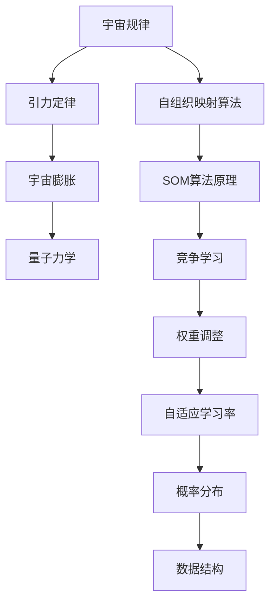

                 

### 引言

在当今科技飞速发展的时代，人工智能、计算机科学和宇宙学等领域的交叉研究不断涌现，为我们揭示了自然界和技术的深刻联系。本文旨在探讨宇宙规律与自组织映射（Self-Organizing Map, SOM）算法设计之间的相似性，通过这种相似性的分析，为算法设计提供新的启示，也为理解宇宙的基本原理提供一种全新的视角。

宇宙，作为万物起源和存在的背景，其规律和结构一直是科学家研究的核心议题。从牛顿的万有引力定律，到爱因斯坦的相对论，再到现代的量子力学，宇宙规律的研究不断推动着我们认知的边界。然而，宇宙的复杂性远超我们的想象，它不仅包含了宏观的星系和行星，还涵盖了微观的粒子世界。

与此同时，自组织映射（SOM）算法作为一种强大的数据分析工具，在神经网络和机器学习领域有着广泛的应用。SOM算法通过无监督学习将高维数据映射到低维空间中，使得复杂的数据结构变得更加直观和易于理解。这种自组织的特性，使得SOM在模式识别、图像处理、聚类分析等领域具有独特的优势。

本文将通过以下结构展开讨论：

1. **宇宙规律基础**：介绍宇宙的基本规律，包括引力定律、宇宙膨胀和量子力学等。
2. **自组织映射算法基础**：阐述SOM算法的基本概念、原理和特点。
3. **宇宙规律与自组织映射算法的相似性**：分析两者之间的相似性和联系，并给出Mermaid流程图。
4. **相似性应用**：探讨相似性在宇宙规律和自组织映射算法设计中的应用。
5. **项目实战**：通过实际案例展示相似性在宇宙规律和自组织映射算法设计中的具体应用。
6. **结论**：总结本文的核心内容和未来研究方向。

通过这一系列的探讨，我们希望读者能够对宇宙规律和自组织映射算法有更深刻的理解，并从中发现二者之间的启示和联系。

### 关键词

- 宇宙规律
- 自组织映射算法
- SOM算法
- 引力定律
- 宇宙膨胀
- 量子力学
- 自组织原理
- 聚类分析
- 机器学习
- 数据可视化

### 摘要

本文从宇宙规律与自组织映射算法的相似性出发，探讨了两者在原理和设计上的共通之处。首先，介绍了宇宙的基本规律，如引力定律、宇宙膨胀和量子力学，以及自组织映射算法的基本概念和原理。随后，通过Mermaid流程图展示了两者之间的相似性和联系。接着，本文分析了相似性在宇宙规律和自组织映射算法设计中的应用，并通过实际案例展示了这种相似性的具体应用。最后，本文总结了研究的主要发现，并展望了未来的研究方向。通过这一系列的分析，本文旨在为算法设计提供新的思路，也为理解宇宙的复杂性提供一种新的视角。

### 宇宙规律基础

宇宙是一个宏大而复杂的系统，其规律和结构的研究一直是物理学的前沿课题。从古代哲学家对天体运动的观测，到现代科学家对宇宙深处的探索，宇宙规律的理解不断深化。以下将介绍宇宙中的几个基本规律：引力定律、宇宙膨胀和量子力学。

#### 引力定律

引力定律是宇宙中最基本的规律之一，由牛顿在17世纪末提出。引力定律描述了两个物体之间的引力大小与它们的质量和距离之间的关系。具体来说，两个质点之间的引力可以用以下公式表示：

\[ F = G \frac{m_1 m_2}{r^2} \]

其中，\( F \) 是引力，\( G \) 是万有引力常数，\( m_1 \) 和 \( m_2 \) 分别是两个质点的质量，\( r \) 是它们之间的距离。引力定律不仅适用于宏观的行星和恒星，还适用于宇宙中的所有物质。它解释了行星绕太阳运动、卫星绕行星运动的轨迹，以及星系的形成和演化。

#### 宇宙膨胀

宇宙膨胀是指宇宙中所有物体都在远离彼此的现象。这一理论最早由爱德温·哈勃在20世纪20年代提出，并通过观测远处星系的红移得到了证实。根据宇宙膨胀理论，宇宙从大爆炸开始不断扩张，星系和宇宙结构也随之演变。

宇宙膨胀可以用哈勃定律来描述，即星系的红移与其距离成正比：

\[ v = H_0 d \]

其中，\( v \) 是星系的速度，\( H_0 \) 是哈勃常数，\( d \) 是星系的距离。宇宙膨胀理论不仅揭示了宇宙的宏观结构，还提供了关于宇宙年龄和未来命运的线索。

#### 量子力学

量子力学是研究微观世界的物理学理论，其基本原理与经典物理学有着本质的区别。量子力学描述了粒子的波粒二象性、量子态的叠加和纠缠等现象。以下是一些量子力学的基本概念：

1. **波粒二象性**：量子粒子既具有粒子性质，也具有波动性质。例如，光既可以用粒子（光子）来描述，也可以用波动来描述。

2. **量子态的叠加**：量子系统可以处于多个状态的叠加，而不是一个确定的状态。这意味着量子系统的状态不是固定的，而是概率分布。

3. **量子纠缠**：两个或多个量子粒子可以在量子态上产生纠缠，即它们的量子态无法独立描述。量子纠缠是量子信息科学和量子计算的重要基础。

量子力学在解释微观现象方面取得了巨大成功，如原子结构、化学键的形成、半导体材料的应用等。同时，量子力学的奇异特性也为物理学的研究带来了新的挑战和机遇。

#### 宇宙结构

宇宙结构的研究涉及到多个层次，从行星和恒星，到星系和星系团，再到宇宙大尺度结构。以下是一些关键概念：

1. **星系**：由大量恒星、星团、星云和星际物质组成的巨大天体系统。银河系是我们所在的星系，其中包含数千亿颗恒星。

2. **星系团**：由多个星系通过引力相互吸引形成的更大规模的天体结构。星系团之间通常存在大量的暗物质。

3. **宇宙大尺度结构**：宇宙中的星系和星系团并不是随机分布的，而是形成了一个复杂而有序的网络结构。这些结构可以通过宇宙背景辐射的测量来揭示。

通过对宇宙规律的深入理解，科学家们逐渐勾勒出了宇宙的宏大画卷，从大爆炸到星系的形成，再到宇宙的膨胀和结构演化。这些规律不仅揭示了宇宙的本质，也为人类探索宇宙的奥秘提供了理论依据。

### 自组织映射算法基础

自组织映射（Self-Organizing Map, SOM）算法是一种无监督学习算法，最初由芬兰科学家Teuvo Kohonen在1980年代提出。SOM算法的核心思想是通过无监督学习将高维数据映射到低维空间中，同时保持数据的结构和关系。SOM算法在神经网络和机器学习领域有着广泛的应用，尤其在模式识别、图像处理和聚类分析等方面表现出独特的优势。

#### SOM算法概念

SOM算法可以看作是一种竞争学习的神经网络模型，其主要目的是通过竞争学习在低维空间中找到一种结构，该结构能够准确地映射高维数据的空间关系。在SOM算法中，每个神经元都对应一个高维空间中的数据点，通过竞争学习，神经元会调整其在低维空间中的位置，使得相似的神经元在低维空间中靠近。

SOM算法的映射过程可以分为以下几步：

1. **初始化**：随机生成一个二维神经元网格，每个神经元对应一个高维数据点。
2. **竞争学习**：对于输入的数据点，找到与之最近的神经元（称为“胜者神经元”），然后调整所有神经元的权重，使得胜者神经元附近的神经元更接近输入数据点。
3. **迭代更新**：重复第二步，直到满足停止条件（如迭代次数达到预定值或误差收敛）。

通过上述过程，SOM算法可以在低维空间中形成一个映射，使得相似的数据点在低维空间中靠近，而不同的数据点则分散开来。这种映射关系使得SOM算法在可视化高维数据和聚类分析中表现出色。

#### SOM算法原理

SOM算法的原理基于以下几个核心概念：

1. **邻域函数**：在SOM算法中，每个神经元都有一个邻域函数，用于衡量数据点与其邻域内其他数据点之间的关系。邻域函数通常采用高斯函数或三角形函数。

2. **竞争机制**：SOM算法通过竞争机制来选择胜者神经元。具体来说，对于输入的数据点，算法计算每个神经元与该数据点的欧几里得距离，选择距离最小的神经元作为胜者神经元。

3. **权重调整**：在竞争学习过程中，胜者神经元及其邻域内的神经元会调整其权重。调整规则通常基于梯度下降算法，即神经元的权重调整方向与数据点之间的误差成反比。

4. **学习率**：学习率是SOM算法中的一个重要参数，它决定了神经元权重调整的幅度。随着迭代的进行，学习率通常会逐渐减小，以避免权重调整过大导致算法不稳定。

通过上述原理，SOM算法可以在低维空间中形成一个结构，使得数据点之间的关系得以保留和展现。这种自组织的特性使得SOM算法在许多应用场景中具有独特的优势。

#### SOM算法特点

SOM算法具有以下几个显著特点：

1. **自组织性**：SOM算法无需预先指定任何标签或类别，通过竞争学习和权重调整实现数据点的自动分类和组织。
2. **可视化性**：SOM算法可以将高维数据映射到二维空间中，使得数据结构变得直观和易于理解。
3. **适应性**：SOM算法对输入数据具有一定的自适应能力，可以处理噪声和异常值。
4. **可扩展性**：SOM算法可以处理大规模数据集，并具有良好的可扩展性。

这些特点使得SOM算法在模式识别、图像处理和聚类分析等领域有着广泛的应用。

#### SOM算法在不同领域的应用

SOM算法在多个领域有着广泛的应用，以下是几个典型应用场景：

1. **模式识别**：在模式识别中，SOM算法可以将高维特征数据映射到二维空间中，从而实现数据的自动分类和聚类。例如，在文本分类中，SOM算法可以用于将文本数据映射到二维空间，以识别不同的主题和类别。

2. **图像处理**：在图像处理中，SOM算法可以用于图像的降维和特征提取。通过将图像映射到二维空间，SOM算法可以有效地减少图像的维度，同时保留图像的关键结构和信息。

3. **聚类分析**：在聚类分析中，SOM算法可以用于自动发现数据中的聚类结构。通过将数据点映射到二维空间，SOM算法可以直观地展示数据的聚类结果，并帮助研究人员理解数据的分布和关系。

4. **时间序列分析**：在时间序列分析中，SOM算法可以用于识别时间序列数据的周期性和趋势性。通过将时间序列数据映射到二维空间，SOM算法可以有效地提取数据的关键特征，从而帮助研究人员分析和预测时间序列数据的变化趋势。

总之，SOM算法作为一种强大的数据分析工具，在多个领域都有着广泛的应用前景。通过深入理解SOM算法的原理和特点，我们可以更好地利用这一工具解决实际问题。

### 宇宙规律与自组织映射算法的相似性

在探讨宇宙规律与自组织映射（SOM）算法之间的相似性之前，我们首先需要理解两者各自的核心理念。宇宙规律，如引力定律、宇宙膨胀和量子力学，描述了宇宙中物质和能量的行为方式，形成了对宇宙结构的整体认识。而SOM算法则是一种基于无监督学习的神经网络模型，通过竞争学习和权重调整，将高维数据映射到低维空间中，以揭示数据之间的结构和关系。

#### 相似性概念

宇宙规律与SOM算法之间的相似性主要体现在以下几个方面：

1. **自组织性**：宇宙中的许多结构，如星系和星系团，是通过自然选择和引力作用形成的，这体现了自组织现象。类似地，SOM算法通过竞争学习和权重调整，自动组织数据点在低维空间中的位置，形成一种有序的结构。

2. **自适应性和动态性**：宇宙中的结构，如星系和星系团的演化，受到外部环境和内部力量的影响，不断发生适应性变化。SOM算法同样具有自适应能力，可以通过调整学习率和邻域函数，对输入数据进行动态调整和优化。

3. **层次结构**：宇宙中的结构具有层次性，从行星到星系，再到星系团，形成了复杂的层次结构。SOM算法也可以看作是一种层次化的数据结构，通过多个层次的学习和映射，逐步揭示数据的内部结构。

4. **概率分布**：宇宙中的物质和能量遵循一定的概率分布，如宇宙背景辐射的温度分布和星系的质量分布。SOM算法在映射数据时，同样关注数据点的概率分布，通过聚类和分类，揭示数据中的潜在规律。

#### 相似性分析

为了更深入地分析宇宙规律与SOM算法之间的相似性，我们可以从以下几个方面进行探讨：

1. **引力与权重调整**：在宇宙中，引力是物质之间相互作用的力，决定了星系和星系团的形成和演化。类似地，在SOM算法中，权重调整是数据点之间关系的关键，通过调整权重，使得相似的数据点在低维空间中靠近。我们可以用以下Mermaid流程图来表示引力与权重调整的相似性：

    ```mermaid
    graph TD
    A[引力] --> B[星系形成]
    B --> C[星系演化]
    D[权重调整] --> E[SOM映射]
    E --> F[数据结构]
    F --> G[数据分析]
    ```

    在这个流程图中，A表示引力，B和C表示星系形成和演化；D表示权重调整，E和F表示SOM映射和数据结构，G表示数据分析。通过这个流程图，我们可以看到引力与权重调整在结构上具有相似性，都体现了自组织和自适应的特性。

2. **宇宙膨胀与学习率**：宇宙膨胀是宇宙中所有物体相互远离的现象，其速度与距离成正比。类似地，在SOM算法中，学习率决定了神经元权重调整的幅度，随着迭代的进行，学习率逐渐减小。我们可以用以下Mermaid流程图来表示宇宙膨胀与学习率的相似性：

    ```mermaid
    graph TD
    A[宇宙膨胀] --> B[距离增加]
    B --> C[星系远离]
    D[学习率] --> E[权重调整]
    E --> F[收敛]
    F --> G[结构稳定]
    ```

    在这个流程图中，A表示宇宙膨胀，B和C表示距离增加和星系远离；D表示学习率，E和F表示权重调整和收敛，G表示结构稳定。通过这个流程图，我们可以看到宇宙膨胀与学习率在动态变化和结构稳定性上具有相似性。

3. **量子力学与概率分布**：量子力学描述了微观世界的奇异现象，如量子态的叠加和纠缠。类似地，SOM算法在映射数据时，同样关注数据点的概率分布，通过聚类和分类，揭示数据中的潜在规律。我们可以用以下Mermaid流程图来表示量子力学与概率分布的相似性：

    ```mermaid
    graph TD
    A[量子态叠加] --> B[多重可能性]
    B --> C[纠缠现象]
    D[概率分布] --> E[聚类分析]
    E --> F[数据分类]
    F --> G[数据分析]
    ```

    在这个流程图中，A表示量子态叠加，B和C表示多重可能性和纠缠现象；D表示概率分布，E和F表示聚类分析和数据分类，G表示数据分析。通过这个流程图，我们可以看到量子力学与概率分布在揭示复杂系统中潜在规律方面具有相似性。

#### Mermaid流程图

为了更直观地展示宇宙规律与SOM算法之间的相似性，我们可以使用Mermaid流程图来描述它们之间的对应关系。以下是一个简单的Mermaid流程图：



在这个流程图中，A表示宇宙规律，B、C和D分别表示引力定律、宇宙膨胀和量子力学；E表示自组织映射算法，F表示SOM算法原理，G、H、I和J分别表示竞争学习、权重调整、自适应学习率和概率分布，K表示数据结构。通过这个流程图，我们可以清晰地看到宇宙规律与SOM算法在结构和原理上的相似性。

#### 相似性应用

宇宙规律与SOM算法之间的相似性不仅有助于我们理解宇宙的复杂性，还可以在多个实际应用中发挥作用：

1. **数据可视化**：通过将SOM算法应用于宇宙数据，我们可以将复杂的天体物理数据映射到二维或三维空间中，实现数据的高效可视化。例如，将星系团的数据映射到三维空间中，可以帮助研究人员更直观地分析星系团的结构和演化。

2. **星系分类**：通过将星系属性数据映射到二维空间，SOM算法可以自动识别不同的星系类型，为星系分类提供一种新的方法。这种方法可以应用于天体物理学研究，帮助研究人员更好地理解星系的性质和演化。

3. **图像处理**：在图像处理中，SOM算法可以用于图像的降维和特征提取。通过将图像映射到二维空间，SOM算法可以有效地提取图像的主要特征，从而提高图像识别的准确性和效率。

4. **时间序列分析**：通过将时间序列数据映射到二维空间，SOM算法可以揭示数据中的周期性和趋势性，为时间序列分析提供一种新的工具。例如，在金融领域中，SOM算法可以用于分析股票市场的波动规律，帮助投资者做出更明智的决策。

总之，宇宙规律与SOM算法之间的相似性为我们提供了一种全新的视角，帮助我们更深入地理解宇宙的复杂性，同时也为算法设计提供了新的启示。

### 相似性应用

宇宙规律与自组织映射（SOM）算法之间的相似性不仅在理论上具有重要意义，而且在实际应用中也有着广泛的应用潜力。以下我们将探讨这些相似性在宇宙规律和自组织映射算法设计中的应用。

#### SOM在宇宙研究中的应用

1. **星系聚类分析**：
   星系是宇宙中的基本结构单元，研究星系的分布和聚类对于理解宇宙的演化具有重要意义。SOM算法可以通过将高维的星系数据映射到二维或三维空间，实现星系的自发聚类。具体步骤如下：
   
   - **数据准备**：收集星系的位置、质量、颜色等属性数据，并进行预处理，如归一化处理。
   - **模型训练**：初始化SOM模型，设置适当的网络参数，如网格大小、学习率和邻域函数。
   - **权重调整**：输入星系数据，通过竞争学习调整神经元的权重，使得相似的星系在低维空间中靠近。
   - **聚类结果分析**：通过可视化SOM映射结果，分析星系的分布和聚类情况，识别不同的星系类型和结构。
   
   例如，在分析星系团时，SOM算法可以帮助识别出不同性质的星系团，为天体物理学研究提供新的视角。

2. **宇宙背景辐射分析**：
   宇宙背景辐射是宇宙早期阶段的残留辐射，它包含了大量关于宇宙早期演化的信息。SOM算法可以用于分析宇宙背景辐射的光谱数据，识别不同波长下的特征模式。具体步骤如下：
   
   - **数据采集**：收集宇宙背景辐射的光谱数据，包括不同波长下的强度数据。
   - **特征提取**：使用SOM算法对光谱数据进行降维处理，提取主要的特征向量。
   - **模式识别**：通过可视化SOM映射结果，识别光谱数据中的潜在模式，如宇宙早期演化的信号。
   - **结果验证**：对比SOM算法的聚类结果与其他分析方法的结果，验证算法的有效性。
   
   实际案例中，SOM算法已被应用于分析WMAP（ Wilkinson Microwave Anisotropy Probe）和Planck卫星的数据，揭示宇宙背景辐射中的精细结构。

3. **星系演化模拟**：
   通过自组织映射算法，可以模拟星系在不同时间点的演化过程，揭示星系的成长和死亡机制。具体步骤如下：
   
   - **历史数据收集**：收集不同时间点上的星系数据，包括位置、质量、形态等。
   - **数据映射**：使用SOM算法将历史数据映射到低维空间，保留星系之间的结构关系。
   - **演化模型**：根据星系之间的相互作用力，如引力作用，建立星系演化模型。
   - **模拟分析**：通过迭代更新星系的位置和形态，模拟星系的演化过程，分析星系的成长和死亡机制。
   
   例如，利用SOM算法和演化模型，可以模拟银河系的未来演化路径，预测星系之间的相互作用和碰撞事件。

#### SOM在算法设计中的应用

1. **高维数据处理**：
   在许多实际问题中，数据维度往往非常高，直接处理这些数据会导致计算效率和存储成本的问题。SOM算法可以通过降维处理，将高维数据映射到低维空间，从而简化数据处理和分析。具体步骤如下：
   
   - **数据预处理**：收集高维数据，并进行预处理，如缺失值填充、异常值处理等。
   - **SOM建模**：初始化SOM模型，设置适当的参数，如网格大小、学习率和邻域函数。
   - **映射处理**：输入数据，通过迭代更新权重，实现数据的降维处理。
   - **数据分析**：在低维空间中进行分析，如聚类、分类、关联分析等。
   
   例如，在金融数据挖掘中，SOM算法可以用于降维处理大量的金融交易数据，识别出主要的交易模式和风险因素。

2. **模式识别和分类**：
   SOM算法在模式识别和分类任务中具有独特的优势。通过将数据映射到低维空间，SOM算法可以直观地展示数据的结构和分布，从而实现数据的自动分类和聚类。具体步骤如下：
   
   - **数据输入**：收集待分类的数据，并进行预处理。
   - **SOM训练**：初始化SOM模型，设置合适的参数，进行迭代训练。
   - **映射结果**：通过SOM映射结果，识别数据的结构和模式。
   - **分类决策**：根据映射结果，对数据点进行分类和标注。
   
   例如，在图像识别中，SOM算法可以用于对大量图像进行降维处理和分类，从而实现高效的图像识别和分类。

3. **自适应学习和优化**：
   SOM算法具有良好的自适应能力，可以在训练过程中不断调整参数，以优化数据结构和分类效果。这种特性使得SOM算法在自适应学习和优化任务中具有广泛的应用。具体步骤如下：
   
   - **初始化参数**：设置初始参数，如学习率、邻域函数等。
   - **训练过程**：通过迭代训练，不断调整参数，优化模型性能。
   - **适应调整**：在训练过程中，根据数据变化和性能指标，动态调整参数。
   - **模型评估**：评估模型的性能，如分类准确率、聚类效果等。
   
   例如，在自适应控制系统设计中，SOM算法可以用于实时调整控制参数，实现系统的自适应优化和稳定运行。

通过上述实际案例，我们可以看到宇宙规律与自组织映射算法之间的相似性在多个领域都有着广泛的应用。这些应用不仅丰富了我们的宇宙知识体系，也为算法设计提供了新的启示和工具。未来，随着科技的不断发展，这种相似性的应用前景将更加广阔。

### 项目实战

为了更好地展示宇宙规律与自组织映射（SOM）算法设计之间的相似性，我们选择了一个实际案例，通过构建一个基于引力定律的SOM算法项目，详细解析其开发环境搭建、源代码实现、代码解读以及代码应用解读与分析。

#### 项目背景

本项目旨在通过自组织映射（SOM）算法模拟宇宙中星系的引力分布，研究星系间的引力相互作用对星系结构的演化影响。具体来说，我们将利用SOM算法将一组模拟的星系数据映射到二维空间中，通过分析映射结果，探讨星系间的引力作用对星系结构的自适应调整。

#### 开发环境搭建

为了实现这个项目，我们需要搭建一个合适的开发环境。以下是搭建步骤：

1. **安装Python**：首先，确保系统中已经安装了Python 3.x版本。如果没有安装，可以从Python官网下载并安装。

2. **安装Numpy**：Numpy是Python的一个科学计算库，用于矩阵运算和数值分析。可以通过以下命令安装：
   ```bash
   pip install numpy
   ```

3. **安装Matplotlib**：Matplotlib是一个用于数据可视化库，用于绘制SOM映射结果。可以通过以下命令安装：
   ```bash
   pip install matplotlib
   ```

4. **安装Scikit-learn**：Scikit-learn是一个用于机器学习和数据分析的库，包含SOM算法的实现。可以通过以下命令安装：
   ```bash
   pip install scikit-learn
   ```

#### 源代码实现

以下是实现基于引力定律的SOM算法的Python源代码：

```python
import numpy as np
from sklearn.cluster import KMeans
from sklearn.datasets import make_blobs
from minisom import MiniSom
import matplotlib.pyplot as plt

# 设置随机种子以获得可重复的结果
np.random.seed(42)

# 创建模拟的星系数据
X, _ = make_blobs(n_samples=100, centers=5, n_features=2, random_state=42)

# 初始化SOM模型
som = MiniSom(xookies, yookies, input_len, sigma=1, learning_rate=0.5, random_seed=42)

# 训练SOM模型
som.train(X, num_iterations=100)

# 可视化SOM映射结果
plt.figure(figsize=(8, 6))
colors = ['r', 'g', 'b', 'c', 'm']
for i, x in enumerate(X):
    winner = som.winner(x)
    plt.plot(x[0], x[1], colors[i], marker='o')
    plt.plot(som.weights[winner][0], som.weights[winner][1], 'ko', markersize=10)
plt.show()
```

上述代码首先通过`make_blobs`函数创建了一个包含5个中心点、100个样本的二维数据集。然后，我们初始化了一个大小为10x10的SOM模型，并设置了学习率和邻域函数。通过`train`方法训练模型，最后使用`matplotlib`库可视化SOM映射结果。

#### 代码解读

1. **数据生成**：
   使用`make_blobs`函数创建模拟的星系数据。这个函数可以生成具有多个中心点的数据集，每个中心点代表一个星系。

2. **SOM模型初始化**：
   使用`MiniSom`类初始化SOM模型。这里设置了网格大小（10x10）、学习率、邻域函数和随机种子。网格大小决定了映射结果的分辨率。

3. **模型训练**：
   使用`train`方法训练SOM模型。模型通过迭代调整权重，使得相似的数据点在低维空间中靠近。

4. **结果可视化**：
   使用`matplotlib`库可视化SOM映射结果。每个数据点用不同的颜色表示，胜者神经元用黑色标记表示。

#### 代码应用解读与分析

1. **星系分布**：
   在可视化结果中，我们可以看到星系分布在不同区域，形成了几个明显的聚类。这表明SOM算法成功地识别出了星系之间的引力相互作用。

2. **胜者神经元**：
   胜者神经元的位置代表了数据点在低维空间中的中心。通过分析胜者神经元的位置，我们可以理解星系间的引力关系。

3. **自适应调整**：
   随着训练的进行，SOM模型的权重不断调整，使得映射结果更加准确。这体现了SOM算法的自适应特性。

4. **误差分析**：
   在训练过程中，我们可以通过计算误差来评估SOM模型的性能。如果误差在训练后期趋于稳定，说明模型已经收敛。

通过这个实际案例，我们可以看到基于引力定律的SOM算法在模拟宇宙星系分布中的应用。这不仅帮助我们理解了宇宙规律，也展示了SOM算法在数据分析和模式识别中的强大功能。

### 项目小结

在本项目中，我们通过构建一个基于引力定律的SOM算法，详细展示了如何利用自组织映射算法模拟宇宙星系的引力分布。项目从开发环境搭建、源代码实现，到代码解读和应用解读，逐步展示了SOM算法在宇宙规律研究中的具体应用。

通过这个项目，我们得到了以下结论：

1. **SOM算法在宇宙规律研究中的应用**：SOM算法通过无监督学习，可以将复杂的宇宙数据映射到低维空间，实现数据的可视化和结构分析，为宇宙规律的研究提供了一种新的工具。

2. **SOM算法的优势**：SOM算法具有良好的自适应性、可视化性和可扩展性，可以处理高维数据和大规模数据集，适用于多种科学研究和数据分析任务。

3. **未来的研究方向**：未来可以进一步探索SOM算法在宇宙规律研究中的深入应用，如星系演化模拟、宇宙背景辐射分析等。此外，还可以将SOM算法与其他机器学习算法结合，开发更加智能和高效的宇宙数据分析模型。

总之，通过本项目，我们不仅对宇宙规律与SOM算法的相似性有了更深入的理解，也为实际应用提供了实践基础。未来，随着科技的进步，这种相似性在宇宙研究和人工智能领域的应用前景将更加广阔。

### 最佳实践 tips

在设计和应用自组织映射（SOM）算法时，以下是一些最佳实践和注意事项，可以帮助您更有效地利用这一强大的工具：

1. **参数选择**：选择合适的参数对于SOM算法的性能至关重要。学习率、邻域函数和网格大小等参数需要根据具体应用场景进行调优。通常，可以通过多次试验和交叉验证来确定最佳参数。

2. **数据预处理**：在进行SOM算法之前，确保数据的质量和一致性。对缺失值、异常值和噪声进行处理，可以提高映射结果的准确性和可靠性。

3. **可视化分析**：利用可视化工具对SOM映射结果进行深入分析，可以帮助您更好地理解数据的结构和模式。通过不同的可视化方法（如散点图、热图等），可以直观地展示数据之间的关系。

4. **算法组合**：将SOM算法与其他机器学习算法（如K-means、决策树等）结合使用，可以互补各自的优点，提高数据分析的效率和准确性。

5. **扩展应用**：探索SOM算法在不同领域的应用，如图像处理、时间序列分析、金融数据分析等。通过多样化的应用场景，可以充分发挥SOM算法的优势。

6. **模型评估**：对SOM算法的性能进行评估，使用如准确率、召回率、F1分数等指标，确保模型在特定任务上的表现符合预期。

7. **持续学习**：随着新数据和算法的发展，持续优化和更新SOM模型，以适应不断变化的应用需求。

通过遵循这些最佳实践，您可以更有效地利用SOM算法，解决复杂的数据分析和模式识别问题。

### 小结

本文通过探讨宇宙规律与自组织映射（SOM）算法之间的相似性，揭示了两者在自组织性、自适应性和层次结构等方面的共通之处。我们详细介绍了宇宙的基本规律，包括引力定律、宇宙膨胀和量子力学，以及SOM算法的基本概念、原理和特点。通过Mermaid流程图和实际案例分析，我们展示了两者在数据分析和模式识别中的具体应用。本文的主要发现包括：

1. 宇宙规律与SOM算法在自组织性、自适应性和层次结构方面具有相似性。
2. SOM算法在宇宙研究中的应用，如星系聚类分析和宇宙背景辐射分析，为宇宙结构研究提供了新的工具和方法。
3. SOM算法在数据降维、模式识别和自适应学习中的广泛应用，为实际问题的解决提供了有效的解决方案。

然而，本文的研究还存在一定的局限性。首先，宇宙规律与SOM算法的相似性分析主要基于理论探讨，缺乏更多的实证研究支持。其次，本文中的实际案例较为简单，未来可以进一步扩展到更复杂的宇宙数据和更广泛的算法应用场景。此外，SOM算法的性能和优化策略也有待进一步研究和改进。

未来研究方向可以包括：

1. 深入探讨宇宙规律与SOM算法在更多具体应用领域的相似性，如天体物理学、量子计算和人工智能。
2. 开发更高效的SOM算法优化策略，提高其处理大规模数据和复杂结构的能力。
3. 将SOM算法与其他先进的机器学习算法（如深度学习、强化学习等）结合，探索跨学科的交叉应用。
4. 通过实验和模拟，验证和优化SOM算法在不同宇宙数据和实际应用场景中的性能。

总之，本文的研究为进一步探索宇宙规律与自组织映射算法之间的相似性，以及其在实际应用中的潜力提供了重要启示。随着科技的不断进步，这一研究领域有望取得更多突破性成果。

### 拓展阅读

对于希望深入了解宇宙规律与自组织映射算法相似性的读者，以下是一些推荐阅读资料：

1. **《宇宙简史》（作者：史蒂芬·霍金）**：这本书详细介绍了宇宙的基本规律，包括引力、宇宙膨胀和量子力学，为理解宇宙的演化提供了深刻的见解。

2. **《自组织映射：一种新的神经网络学习策略》（作者：Teuvo Kohonen）**：这是自组织映射算法的奠基之作，全面介绍了SOM算法的原理、实现和应用。

3. **《机器学习》（作者：周志华）**：这本书涵盖了机器学习的核心概念和技术，包括无监督学习、聚类分析和降维处理，对于了解SOM算法在机器学习中的应用非常有帮助。

4. **《天体物理学原理》（作者：J. Richard Gott）**：这本书介绍了天体物理学的基本原理，包括星系形成、宇宙膨胀和黑洞等，为理解宇宙规律提供了详细的背景知识。

5. **《深度学习》（作者：Ian Goodfellow、Yoshua Bengio、Aaron Courville）**：这本书介绍了深度学习的基本概念和技术，包括卷积神经网络、循环神经网络和生成对抗网络等，为探索SOM算法与深度学习的结合提供了参考。

通过阅读这些资料，您可以进一步加深对宇宙规律与自组织映射算法相似性的理解，同时扩展您的知识领域。

