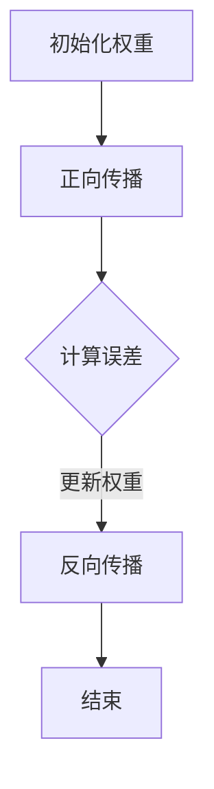

                 

# 宇宙规律与自适应神经网络设计的相似性

## 关键词

宇宙规律、自适应神经网络、相似性分析、非线性、误差反向传播算法、数学模型

## 摘要

本文探讨了宇宙规律与自适应神经网络设计之间的相似性，从宇宙演化的非线性现象、自适应机制以及宇宙基本结构等方面，分析了两者在复杂系统处理上的共通之处。通过对宇宙膨胀公式和神经网络权重更新公式的详细讲解，我们揭示了两者在非线性关系和自适应调整上的内在联系。此外，本文还通过案例分析，进一步阐述了自适应神经网络在宇宙学研究中的应用潜力，为跨学科研究提供了新的视角。

---

## 第一部分：宇宙规律概述

### 宇宙演化规律

宇宙的演化是一个复杂而迷人的过程。宇宙的膨胀理论是现代宇宙学的基础之一。根据这个理论，宇宙从大爆炸开始不断膨胀，而这种膨胀不仅没有停止，反而随着时间的推移而加速。这个现象可以用暗能量的概念来解释。暗能量是一种充填在整个宇宙中的、具有负压强的物质，它对宇宙的膨胀起着巨大的推动作用。

**宇宙膨胀公式**：
\[ H = H_0 \times e^{q_0 t} \]

在这个公式中，\( H \) 表示宇宙的膨胀速度，\( H_0 \) 是宇宙的哈勃常数，\( q_0 \) 是宇宙的质量密度参数，\( t \) 是时间。这个公式清晰地描述了宇宙膨胀速度与时间的关系，反映了宇宙的加速膨胀特性。

### 黑洞与引力波

黑洞是宇宙中最神秘和最具挑战性的天体之一。它是由极端密集的物质组成，甚至连光也无法逃脱。黑洞的存在可以通过引力波来检测。引力波是时空的波动，它们在宇宙中传播，可以由黑洞碰撞产生。近年来，LIGO实验成功探测到多个引力波事件，这为我们了解黑洞的性质和宇宙的演化提供了重要的实验证据。

**引力波的产生与检测**：

1. **产生**：黑洞在碰撞合并的过程中，会产生强烈的引力扰动，这些扰动以引力波的形式传播。
2. **检测**：LIGO通过激光干涉的方法来检测引力波。当引力波经过地球时，会引起时空的微小扭曲，这个变化可以通过激光干涉仪测量出来。

### 宇宙基本结构

宇宙的基本结构包括星系、星团和星云等。星系是宇宙中最常见的结构，它由数十亿颗恒星、行星、星云等组成。星系的形成和演化是一个复杂的过程，涉及到引力的相互作用、物质的聚集和能量的释放。

**星系的形成与演化**：

1. **基本结构**：星系通常由一个中心超大质量黑洞、一个银心球状星团、多个恒星盘和多个恒星晕组成。
2. **形成机制**：星系的形成可能源于原始气体云的坍塌，气体云在引力作用下逐渐聚集形成恒星和星系。
3. **演化过程**：星系在漫长的演化过程中，会经历恒星的形成和死亡、星系之间的碰撞和合并等过程。

**星团与星云**：

1. **星团的形成与分类**：星团是由多个恒星组成的聚集体，可以分为球状星团和疏散星团。
2. **星云的类型与形成**：星云是宇宙中的气体和尘埃云，它们可以是由恒星风或超新星爆发形成的。

---

### 第二部分：自适应神经网络设计

#### 神经网络基本概念

神经网络是由大量简单单元（神经元）组成的复杂网络，通过学习输入数据与输出数据之间的关系，实现从输入到输出的映射。神经网络的基本结构包括输入层、隐藏层和输出层。

**神经网络的结构**：

1. **前馈神经网络**：数据从输入层经过隐藏层，最终到达输出层。
2. **卷积神经网络**：特别适用于处理图像数据，通过卷积操作提取特征。
3. **循环神经网络**：适用于处理序列数据，具有记忆功能。

**神经网络的激活函数**：

激活函数是神经网络中的一个关键组件，用于引入非线性。常见的激活函数包括：

1. **Sigmoid函数**：\( \sigma(x) = \frac{1}{1 + e^{-x}} \)
2. **ReLU函数**：\( f(x) = \max(0, x) \)
3. **Tanh函数**：\( \tanh(x) = \frac{e^x - e^{-x}}{e^x + e^{-x}} \)

#### 自适应神经网络的原理

自适应神经网络通过不断调整网络权重，以优化输出。误差反向传播算法是实现自适应调整的核心算法。

**误差反向传播算法**：

1. **算法原理**：通过计算输出层的误差，反向传播到隐藏层和输入层，更新每个神经元的权重。
2. **伪代码实现**：

```python
for each training example (x, y):
    forward_pass(x)  # 计算输出值 y'
    compute_error(y, y')  # 计算误差 E
    backward_pass()  # 反向传播更新权重
```

**Mermaid流程图展示**：



**权重自适应更新**：

自适应神经网络的权重更新通常依赖于优化算法。常见的优化算法包括：

1. **梯度下降**：通过计算误差的梯度来更新权重。
2. **动量优化**：结合之前更新方向的动量，以减少震荡。
3. **Adam优化**：结合了梯度下降和动量优化，具有自适应学习率。

#### 自适应神经网络的应用

自适应神经网络在多个领域都有广泛的应用。

**图像识别**：

1. **LeNet-5算法应用**：LeNet-5是一种早期用于手写数字识别的卷积神经网络。
2. **手写数字识别实例**：通过训练，神经网络可以识别手写数字图像。

**自然语言处理**：

1. **词嵌入与词向量**：将词汇映射到高维空间，以便神经网络处理。
2. **语言模型训练**：通过训练，神经网络可以生成概率最高的句子。
3. **机器翻译案例**：通过训练，神经网络可以实现不同语言之间的翻译。

---

### 第三部分：相似性分析

#### 核心概念联系

宇宙演化中的非线性现象和自适应机制与神经网络中的非线性激活函数和自适应调整存在紧密联系。

**非线性与自适应**：

1. **宇宙演化中的非线性现象**：宇宙的演化过程中，非线性作用显著，如黑洞碰撞产生的引力波。
2. **神经网络中的非线性激活函数**：激活函数引入了非线性，使得神经网络能够处理复杂的输入数据。

**复杂性与自适应性**：

1. **宇宙中复杂结构的形成**：星系、星团等复杂结构的形成是一个自组织过程。
2. **神经网络对复杂数据的处理**：神经网络通过自适应调整，能够处理各种复杂的数据模式。

#### 数学模型与公式

**宇宙膨胀公式**：

\[ H = H_0 \times e^{q_0 t} \]

**神经网络权重更新公式**：

\[ \Delta w = - \eta \times \frac{\partial E}{\partial w} \]

这两个公式展示了宇宙演化与神经网络训练中的相似性。在宇宙膨胀公式中，\( H \) 表示宇宙膨胀速度，\( H_0 \) 是宇宙的哈勃常数，\( q_0 \) 是宇宙的质量密度参数，\( t \) 是时间。而在神经网络权重更新公式中，\( \Delta w \) 表示权重更新量，\( \eta \) 是学习率，\( E \) 是误差，\( \frac{\partial E}{\partial w} \) 是误差关于权重的梯度。

#### 相似性案例分析

**宇宙演化与神经网络训练**

1. **案例描述**：宇宙中星系的演化可以通过神经网络训练过程中的权重调整来模拟。
2. **分析过程**：星系在演化过程中会经历各种非线性现象，如碰撞和合并。这些现象可以通过神经网络中的非线性激活函数和自适应调整机制来模拟。

**宇宙结构模型与神经网络结构**

1. **模型比较**：宇宙结构模型和神经网络结构在自适应机制和非线性关系上具有相似性。
2. **相似性分析**：两者都通过自适应调整来处理复杂系统，并在非线性关系中发挥作用。

---

### 第四部分：结论与展望

**相似性分析的意义**

宇宙规律与自适应神经网络设计之间的相似性为跨学科研究提供了新的视角。这种相似性不仅揭示了宇宙演化的复杂性和自适应机制，也为神经网络的设计和应用提供了灵感。

**未来发展趋势**

1. **自适应算法的改进**：随着计算能力的提升，自适应算法将继续优化，以适应更复杂的任务。
2. **宇宙规律的研究**：通过宇宙观测技术的进步，我们将更深入地了解宇宙演化规律，为神经网络设计提供新的理论基础。

---

## 作者信息

作者：AI天才研究院/AI Genius Institute & 禅与计算机程序设计艺术 /Zen And The Art of Computer Programming

---

本文通过对宇宙规律与自适应神经网络设计之间的相似性进行深入分析，探讨了两者在非线性关系、自适应调整和复杂系统处理上的共通之处。通过数学模型和实际案例，我们揭示了这种相似性的本质，为跨学科研究提供了新的视角和思路。在未来，这种相似性分析有望推动宇宙学和神经科学的发展，为解决复杂问题提供新的工具和方法。

