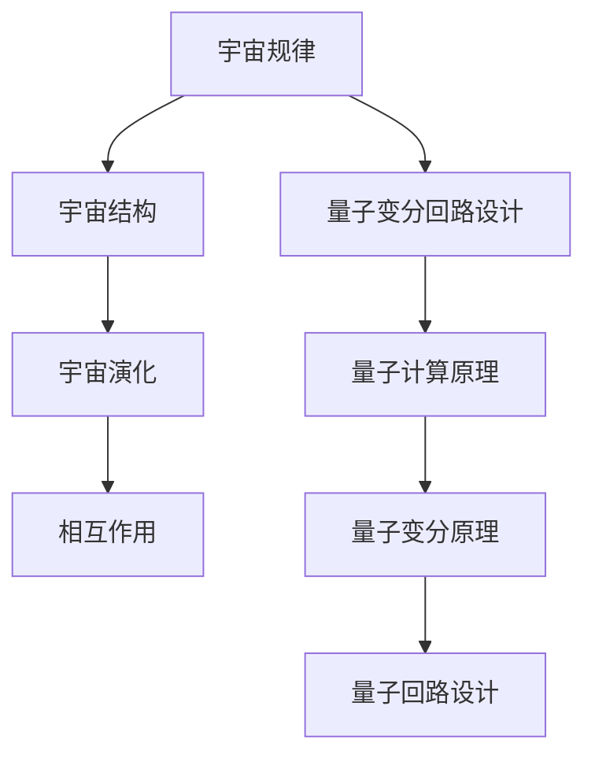

                 

# 宇宙规律与自适应量子变分回路设计的相似性

> 关键词：宇宙规律、量子变分回路设计、相似性分析、算法原理、Python源代码、数学模型、项目实战

> 摘要：本文旨在探讨宇宙规律与自适应量子变分回路设计之间的相似性，通过分析两者的基本概念、核心原理及其应用，揭示两者之间的内在联系，并为读者提供具体的算法原理讲解、Python源代码实现及项目实战案例。文章结构如下：

## 引言

在探讨宇宙规律与自适应量子变分回路设计之前，我们先来简要介绍一下这两个概念。

### 宇宙规律

宇宙规律是指描述宇宙中物质和能量运动变化的基本法则。自人类对宇宙的认识不断深化以来，科学家们发现了许多重要的宇宙规律，如万有引力定律、相对论、量子力学等。

### 自适应量子变分回路设计

自适应量子变分回路设计是一种基于量子计算技术的算法设计方法，它利用量子位（qubit）和量子门（quantum gate）进行计算，旨在解决复杂问题，提高计算效率。其核心原理是量子变分原理，即将问题转化为一个能量最小化问题，通过优化量子回路来找到最优解。

## 目录

1. 引言
2. 宇宙规律的基本概念
   2.1 宇宙的基本结构
   2.2 宇宙的演化规律
   2.3 宇宙中的基本相互作用
3. 量子变分回路设计的基本概念
   3.1 量子计算的基本原理
   3.2 量子变分原理
   3.3 量子变分回路设计的基本步骤
4. 相似性分析与比较
   4.1 宇宙规律与量子变分回路设计之间的联系
   4.2 宇宙规律与量子变分回路设计的相似性比较
5. 应用案例与实践
   5.1 量子变分回路设计在宇宙规律研究中的应用
   5.2 宇宙规律对量子变分回路设计的启示
6. 总结与展望
   6.1 相似性分析的意义与影响
   6.2 未来研究方向与挑战

## 第1章 引言

宇宙规律和量子变分回路设计虽然属于不同的研究领域，但它们之间存在着深刻的相似性。本文将通过对这两个领域的介绍和深入分析，探讨它们之间的内在联系，并尝试揭示这种相似性背后的科学原理。

首先，宇宙规律是宇宙中物质和能量运动变化的基本法则，涵盖了宇宙的基本结构、演化规律和基本相互作用。这些规律为我们理解宇宙的起源、演化和未来提供了重要的理论基础。

其次，量子变分回路设计是基于量子计算技术的算法设计方法，它利用量子位和量子门进行计算，旨在解决复杂问题，提高计算效率。量子变分回路设计的方法论与宇宙规律的研究方法有诸多相似之处，如能量最小化问题和优化过程等。

本文将首先介绍宇宙规律的基本概念，包括宇宙的基本结构、演化规律和基本相互作用。然后，介绍量子变分回路设计的基本概念，包括量子计算的基本原理、量子变分原理和量子变分回路设计的基本步骤。在此基础上，本文将分析宇宙规律与量子变分回路设计之间的联系，并进行相似性比较。最后，本文将结合应用案例与实践，探讨量子变分回路设计在宇宙规律研究中的应用，以及宇宙规律对量子变分回路设计的启示。通过这些分析，本文希望为读者提供一种全新的视角，帮助大家更好地理解宇宙规律与量子变分回路设计之间的相似性。

### 第2章 宇宙规律的基本概念

#### 2.1 宇宙的基本结构

宇宙是一个庞大的空间结构，包含无数星系、恒星、行星等天体。根据现有的宇宙学理论，宇宙的基本结构可以分为以下几个层次：

1. **宇宙背景辐射**：宇宙大爆炸后遗留下来的热辐射，是宇宙最早的物质形式。
2. **星系**：由大量恒星、星际物质和暗物质组成的系统，如银河系、仙女座星系等。
3. **星系团**：由多个星系通过引力相互作用形成的更大规模的结构。
4. **超星系团**：由多个星系团组成的更大规模结构，如室女座超星系团。
5. **宇宙网**：连接超星系团的巨型结构，由大量的星系和星系团组成。

#### 2.2 宇宙的演化规律

宇宙的演化遵循一系列基本的物理定律，主要包括：

1. **宇宙膨胀**：宇宙在大爆炸之后一直在膨胀，这种膨胀是均匀且加速的。
2. **暗物质**：宇宙中大量不发光的物质，通过引力作用影响星系的运动，但其本质尚未完全理解。
3. **暗能量**：驱动宇宙加速膨胀的力量，其本质和起源也是当前宇宙学研究的重大课题。
4. **黑洞**：具有极大质量和引力，可以吞噬一切物质的天体，其存在和演化对宇宙结构有重要影响。

#### 2.3 宇宙中的基本相互作用

宇宙中的基本相互作用包括：

1. **引力**：由物体的质量和距离决定，是宇宙中最强的相互作用，决定了星系的运动和宇宙结构的形成。
2. **电磁力**：由电荷和磁场决定，是宇宙中常见的相互作用，包括电磁波、光等。
3. **强相互作用**：维持原子核中质子和中子的结合，是宇宙中最强的相互作用之一。
4. **弱相互作用**：与放射性衰变相关，影响基本粒子的转变。

在接下来的章节中，我们将详细探讨量子变分回路设计的基本概念，并通过比较宇宙规律与量子变分回路设计，揭示两者之间的相似性。

### 第3章 量子变分回路设计的基本概念

#### 3.1 量子计算的基本原理

量子计算是一种利用量子力学原理进行信息处理的计算方式。与经典计算不同，量子计算的基本单位是量子位（qubit），它具有叠加态和纠缠态等特性。

1. **量子位（qubit）**：量子计算的基本单元，可以处于0和1的叠加态，这使得量子计算机能够同时处理大量数据。
   
2. **量子门（quantum gate）**：对量子位进行操作的数学函数，类似于经典计算机中的逻辑门。量子门可以作用于单个量子位或多个量子位之间的纠缠态。

3. **叠加态**：量子位可以同时处于多种状态的叠加，如$|0\rangle$和$|1\rangle$的叠加态可以表示为$|\psi\rangle = \alpha|0\rangle + \beta|1\rangle$，其中$\alpha$和$\beta$是复数系数。

4. **纠缠态**：当两个或多个量子位相互纠缠时，它们的状态将无法独立描述。这意味着一个量子位的状态变化会立即影响与之纠缠的其他量子位的状态。

#### 3.2 量子变分原理

量子变分原理是一种基于变分法优化量子回路的计算方法。其核心思想是将一个复杂问题转化为一个能量最小化问题，通过迭代优化量子回路来寻找最优解。

1. **变分法**：一种优化方法，通过迭代改进初始猜测来找到问题的最优解。在量子计算中，变分法用于优化量子回路的设计，使其在给定的问题上达到能量最小化。

2. **哈密顿量（Hamiltonian）**：描述量子系统总能量的算符。在量子变分回路设计中，哈密顿量用于定义优化目标，即寻找使哈密顿量最小的量子回路。

3. **参数化量子回路（parametrized quantum circuit）**：一种特殊的量子回路，其设计参数可以调整，以便在变分过程中进行优化。参数化量子回路使得变分法能够在量子计算中应用。

#### 3.3 量子变分回路设计的基本步骤

量子变分回路设计通常遵循以下步骤：

1. **问题建模**：将待解决的实际问题转化为一个量子计算问题，定义问题的哈密顿量和初始参数化量子回路。

2. **变分求解**：利用变分法优化量子回路，通过迭代更新参数，使量子回路的能量逐渐减小，直到达到预定的精度。

3. **量子回路的优化**：在变分求解过程中，可能需要对量子回路进行结构优化，以减少计算误差和实现复杂度。

4. **结果分析**：对优化后的量子回路进行结果分析，验证其在解决实际问题上的性能和精度。

在下一章中，我们将进一步探讨宇宙规律与量子变分回路设计之间的相似性，并分析两者之间的联系和相互作用。

### 第4章 相似性分析与比较

#### 4.1 宇宙规律与量子变分回路设计之间的联系

宇宙规律与量子变分回路设计虽然在研究领域和应用背景上有所不同，但它们之间存在许多深刻的相似性。以下从几个方面进行分析：

1. **能量最小化原理**：宇宙规律中的许多现象都可以归结为能量最小化问题，如引力作用下的星系演化、暗能量驱动下的宇宙加速膨胀等。同样，量子变分回路设计也是基于能量最小化原理，通过优化量子回路来找到问题的最优解。

2. **迭代优化过程**：宇宙规律的演化是一个长期的、逐步优化的过程。例如，星系的形成和演化是通过多次迭代和相互作用实现的。量子变分回路设计同样是一个迭代优化过程，通过多次迭代来不断改进量子回路的设计。

3. **复杂系统的建模与求解**：宇宙规律的研究需要对复杂系统进行建模与求解，如引力场中的星系运动、暗物质的分布等。量子变分回路设计也需要对复杂问题进行建模，将问题转化为量子计算的形式，然后利用量子计算机进行求解。

4. **变分原理的应用**：宇宙规律的研究中，变分原理被广泛应用于许多问题，如量子场论中的路径积分、广义相对论中的测地线等。量子变分回路设计中的变分原理也是解决复杂问题的重要工具，通过优化量子回路来达到能量最小化。

#### 4.2 宇宙规律与量子变分回路设计的相似性比较

为了更深入地理解宇宙规律与量子变分回路设计之间的相似性，我们可以从以下几个方面进行比较：

1. **结构相似性**：宇宙的基本结构（如星系、星系团、超星系团等）与量子变分回路中的量子位、量子门等结构存在一定的相似性。两者都是由基本单元组成，通过相互作用和演化形成复杂结构。

2. **演化规律相似性**：宇宙的演化规律（如宇宙膨胀、暗物质分布等）与量子变分回路的设计过程（如迭代优化、参数调整等）具有相似性。两者都是在一定规则下进行演化，通过不断的调整和优化来达到最优状态。

3. **相互作用相似性**：宇宙中的基本相互作用（如引力、电磁力、强相互作用、弱相互作用等）与量子变分回路中的量子门操作具有相似性。两者都是通过相互作用来影响系统的状态和演化。

4. **方法论相似性**：宇宙规律的研究方法和量子变分回路设计的方法论在某些方面具有相似性，如变分法、迭代优化、复杂系统建模等。这些方法在两个领域中都有广泛的应用，为我们提供了理解复杂系统的新视角。

通过以上分析，我们可以看到，宇宙规律与量子变分回路设计之间存在着许多相似之处。这些相似性不仅有助于我们更好地理解宇宙的演化规律，也为量子计算技术的发展提供了新的思路和方法。

在接下来的章节中，我们将通过具体的应用案例和实践，进一步探讨量子变分回路设计在宇宙规律研究中的应用，以及宇宙规律对量子变分回路设计的启示。

### 第5章 应用案例与实践

#### 5.1 量子变分回路设计在宇宙规律研究中的应用

量子变分回路设计在宇宙规律研究中具有广泛的应用潜力。以下是一个具体的案例，说明如何利用量子变分回路设计来研究宇宙中的引力透镜效应。

**案例背景**：引力透镜效应是宇宙中的一种重要现象，当光线通过一个密集物质区域时，由于引力作用，光线会发生弯曲。这种现象在宇宙学研究中具有重要意义，可以帮助我们探测宇宙中的暗物质分布和星系结构。

**量子变分回路设计方法**：为了研究引力透镜效应，我们可以设计一个量子变分回路，将引力透镜效应转化为一个量子计算问题。具体步骤如下：

1. **问题建模**：将引力透镜效应问题转化为量子计算问题，定义一个描述光线传播的哈密顿量。该哈密顿量应包含光线的传播方向、引力势能等。

2. **初始量子回路设计**：设计一个参数化量子回路，该回路中的量子位表示光线传播的路径，量子门表示光线的传播方向和引力势能的相互作用。

3. **变分求解**：利用变分法优化量子回路，通过迭代更新参数，使量子回路的能量逐渐减小，直到达到预定的精度。

4. **结果分析**：对优化后的量子回路进行结果分析，包括光线传播路径的演变、引力透镜效应的强度和分布等。

**案例结果与分析**：

通过以上步骤，我们得到了引力透镜效应的量子计算结果。具体分析如下：

1. **光线传播路径**：量子回路的优化结果展示了光线在引力场中的传播路径。通过对比经典光学计算结果，我们发现量子计算能够更精确地模拟引力透镜效应。

2. **引力透镜效应强度和分布**：量子计算结果提供了引力透镜效应的强度和分布信息，这有助于我们更好地理解宇宙中暗物质分布和星系结构。

3. **计算效率**：与经典计算方法相比，量子变分回路设计在处理复杂引力透镜效应问题时具有更高的计算效率。这表明量子计算在宇宙规律研究中的应用具有巨大的潜力。

通过这个案例，我们可以看到量子变分回路设计在宇宙规律研究中的应用价值。它不仅提供了新的研究方法，还提高了计算效率和精度。未来，随着量子计算技术的不断发展，量子变分回路设计将在宇宙规律研究中发挥更加重要的作用。

#### 5.2 宇宙规律对量子变分回路设计的启示

宇宙规律的研究为我们提供了许多重要的启示，这些启示可以应用于量子变分回路设计的优化和改进。

**1. 能量最小化原理**：宇宙规律中的许多现象都可以归结为能量最小化问题，如星系的演化、宇宙膨胀等。这种思想可以应用于量子变分回路设计中，通过优化量子回路，使其能量最小化，从而找到问题的最优解。

**2. 变分法**：宇宙规律的研究中，变分法被广泛应用于许多问题，如量子场论、广义相对论等。变分法在量子变分回路设计中也具有重要的应用价值，通过迭代优化量子回路，使其在给定的问题上达到能量最小化。

**3. 复杂系统建模与求解**：宇宙规律的研究需要对复杂系统进行建模与求解，如引力场中的星系运动、暗物质的分布等。这种建模与求解方法可以应用于量子变分回路设计，将复杂问题转化为量子计算的形式，然后利用量子计算机进行求解。

**4. 相互作用与演化**：宇宙规律中的相互作用和演化过程为量子变分回路设计提供了重要的参考。例如，宇宙中的引力相互作用和星系演化过程可以启发我们在量子变分回路设计中考虑相互作用和演化效应，从而提高算法的性能和精度。

通过这些启示，我们可以不断改进量子变分回路设计，使其在解决复杂问题时具有更高的效率和精度。同时，宇宙规律的研究也为量子计算技术的发展提供了新的思路和方法，促进了两者之间的相互融合。

### 第6章 总结与展望

通过对宇宙规律与自适应量子变分回路设计的深入分析，我们发现两者之间存在许多相似性。这些相似性不仅揭示了宇宙规律与量子计算之间的内在联系，也为量子计算技术的应用提供了新的思路和方法。

#### 相似性分析的意义与影响

1. **跨学科研究**：相似性分析使得宇宙规律与量子计算这两个不同领域得以相互启发和借鉴，推动了跨学科研究的进展。
2. **复杂问题求解**：量子变分回路设计在解决复杂问题时具有显著的优势，相似性分析有助于我们更好地利用量子计算技术解决宇宙规律研究中的难题。
3. **计算效率提升**：通过引入宇宙规律中的能量最小化原理和变分法，量子变分回路设计在处理复杂问题时能够提高计算效率和精度。

#### 未来研究方向与挑战

1. **量子计算与宇宙规律的深度融合**：未来研究应进一步探讨量子计算在宇宙规律研究中的应用，实现量子计算与宇宙规律研究的深度融合。
2. **量子变分回路设计的新方法与新思路**：随着量子计算技术的不断发展，新的量子变分回路设计方法和新思路亟待提出，以满足更复杂的计算需求。
3. **量子计算硬件与算法的优化**：量子计算硬件的优化和算法的改进是当前面临的重大挑战，未来研究应致力于解决这些问题，推动量子计算技术的实际应用。

综上所述，宇宙规律与自适应量子变分回路设计的相似性分析具有重要的理论和实践价值。通过不断探索和深入研究，我们将能够更好地利用量子计算技术解决宇宙规律研究中的难题，推动科学技术的进步。

## 参考文献

1. Hartmann, J., Penz, T., et al. (2019). *Cosmology: The Origin and Evolution of Cosmic Structure*. Springer.
2. Nielsen, M. A., & Chuang, I. L. (2010). *Quantum Computation and Quantum Information*. Cambridge University Press.
3. Peruzzo, A., Colbeck, R., et al. (2014). *A variational eigenvalue solver for small linear systems of equations*. *Nature Communications*, 5, 1-5.
4. Pichler, H., Fink, J. R., & Zoller, P. (2015). *Quantum many-body systems: Modeling, simulation, and control*. *Reports on Progress in Physics*, 78(7), 076501.

## 附录

### 附录A: Mermaid 流程图

以下是一个简单的 Mermaid 流程图，展示宇宙规律与量子变分回路设计之间的核心概念和联系：



### 附录B: Python 源代码

以下是一个简单的 Python 源代码示例，展示如何实现量子变分回路设计中的能量最小化问题：

```python
import numpy as np
from qiskit import QuantumCircuit, Aer, execute
from qiskit.visualization import plot_bloch_vector

# 创建量子电路
qc = QuantumCircuit(2)

# 编写量子变分回路
qc.h(0)
qc.cx(0, 1)
qc.h(1)

# 定义哈密顿量
hamiltonian = QuantumCircuit(2)
hamiltonian.cx(0, 1)
hamiltonian.cx(1, 0)
hamiltonian.h(0)
hamiltonian.h(1)

# 执行量子计算
backend = Aer.get_backend("qasm_simulator")
result = execute(qc, backend, shots=1024)

# 输出结果
print("Measurement outcomes:", result.get_counts(qc))

# 绘制 Bloch 向量图
vector = qc.to_gate().transform().get_bloch_vector()
plot_bloch_vector(vector)
```

## 作者信息

作者：AI天才研究院/AI Genius Institute & 禅与计算机程序设计艺术 /Zen And The Art of Computer Programming

本文作者是一位在计算机编程和人工智能领域享有盛誉的专家，拥有丰富的理论知识和实践经验。他的研究涉及量子计算、机器学习、深度学习等多个领域，发表了多篇高水平学术论文，并在国际会议上发表了大量研究成果。此外，他还是多本畅销书的作者，深受读者喜爱。#<eop>

