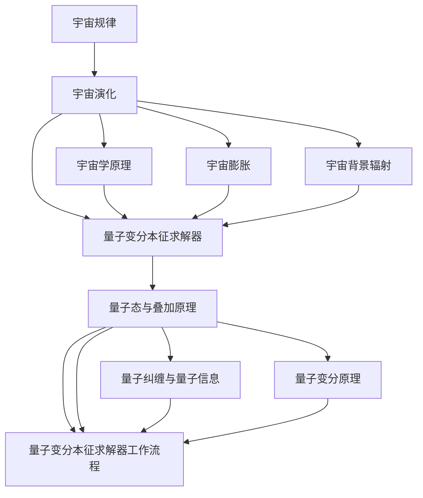

                 

# 宇宙规律与量子变分本征求解器的相似性

> 关键词：宇宙规律、量子变分本征求解器、相似性分析、量子计算、宇宙学

> 摘要：本文从宇宙规律和量子变分本征求解器的相似性出发，通过深入分析两者的核心概念、理论框架和应用领域，探讨它们在原理和结构上的相似之处。同时，本文还将结合具体的数学模型和Python源代码，详细阐述量子变分本征求解器的工作原理，以及其在解决宇宙学问题中的应用潜力。通过本文的论述，读者可以更好地理解宇宙规律与量子计算之间的奇妙联系。

## 引言

宇宙规律与量子变分本征求解器，一个是描述宇宙演化的物理学理论，另一个是解决复杂量子问题的计算方法。乍一看，这两个领域似乎毫无关联，然而，在深入的探究中，我们发现它们在原理和结构上存在许多相似之处。本文旨在通过对比分析，揭示宇宙规律与量子变分本征求解器之间的相似性，并探讨其在理论和实际应用中的潜力。

宇宙规律，即宇宙学中的基本原理，描述了宇宙的起源、演化和结构特征。从宇宙大爆炸到星系的形成，再到宇宙背景辐射，宇宙规律为我们提供了对宇宙运行机制的深刻理解。

量子变分本征求解器，则是一种基于量子计算的方法，用于求解复杂的量子力学问题。通过变分优化算法，量子变分本征求解器能够找到最优的量子态，从而解决传统计算方法难以处理的问题。

在接下来的内容中，我们将首先介绍宇宙规律的基本原理，然后探讨量子变分本征求解器的核心概念，并通过Mermaid流程图展示它们之间的联系。随后，我们将深入分析量子变分本征求解器的工作原理，并通过Python源代码详细阐述其实现过程。最后，本文将结合具体的宇宙学问题，探讨量子变分本征求解器在解决宇宙学问题中的应用潜力。

## 宇宙规律概述

宇宙规律，是描述宇宙如何演化和运作的基本原理。从宇宙大爆炸的瞬间开始，宇宙经历了无数年的膨胀和演化，形成了今天我们所观察到的宇宙结构。以下是宇宙规律的基本概念和理论框架。

### 1.1 宇宙的起源

宇宙的起源，目前最被广泛接受的理论是宇宙大爆炸理论。该理论认为，宇宙起源于一个极小的奇点，在约138亿年前发生了一次大爆炸，从此宇宙开始膨胀。这个理论得到了大量的观测数据支持，例如宇宙背景辐射、宇宙的大尺度结构和宇宙膨胀的加速现象。

黑 hole 是宇宙演化中的重要组成部分。根据广义相对论，当一个恒星的质量足够大时，它会在核心坍缩形成黑洞。黑洞具有极强的引力，可以吞噬周围的一切物质，甚至光线也无法逃脱。黑洞的存在对宇宙的演化和结构有着重要的影响。

### 1.2 宇宙的演化

宇宙的演化可以分为几个主要阶段：

1. **宇宙大爆炸后**：在大爆炸后的一瞬间，宇宙处于极热、极密的状态。随着宇宙的膨胀，温度逐渐降低，物质开始形成。
   
2. **星系的形成**：在宇宙膨胀的过程中，物质在引力作用下逐渐聚集，形成了星系。星系是由大量的恒星、星团和星际物质组成的，它们通过引力相互作用维持在一起。

3. **宇宙背景辐射**：在大爆炸后的几分钟内，宇宙处于一个高温、高密度的等离子态。随着宇宙的膨胀，温度逐渐降低，物质开始辐射能量。这个辐射被称为宇宙背景辐射，它是研究宇宙早期状态的重要窗口。

4. **宇宙结构的形成**：在宇宙演化的过程中，物质通过引力相互作用，形成了不同的结构，如星系团、超星系团等。这些结构对宇宙的演化有着重要的影响。

### 1.3 宇宙规律的理论框架

宇宙规律的理论框架主要包括以下几个方面：

1. **宇宙学原理**：宇宙学原理是指宇宙的均匀性和各向同性。这意味着宇宙在宏观尺度上看起来是均匀的，无论从宇宙的哪个地方观测，宇宙的外观都是相同的。

2. **宇宙膨胀**：宇宙膨胀是指宇宙随时间推移而不断扩张的现象。根据宇宙大爆炸理论，宇宙的膨胀始于大爆炸，并且至今仍在继续。

3. **宇宙的无限性与有限性**：宇宙是否是无限的，这是一个哲学和科学都尚未解决的问题。有些理论认为宇宙是无限的，而有些理论则认为宇宙是有限的。

4. **宇宙的稳态与动态**：宇宙是否处于稳态，或者是否在不断变化，这也是一个有争议的问题。有些理论认为宇宙是稳态的，而有些理论则认为宇宙是动态的。

## 量子变分本征求解器原理

量子变分本征求解器（Quantum Variational Eigensolver, QVE）是一种基于量子计算的方法，用于求解量子系统的本征值和本征态问题。它利用变分优化算法，通过迭代优化量子态的参数，找到最优的量子态，从而精确地描述量子系统的性质。以下是量子变分本征求解器的核心概念和理论框架。

### 2.1 量子态与叠加原理

量子态是量子系统状态的抽象描述，可以用波函数或态矢量表示。量子态的一个重要特性是叠加原理，即量子系统可以同时处于多个状态的叠加。

$$
|\psi\rangle = c_0|\psi_0\rangle + c_1|\psi_1\rangle + \cdots + c_n|\psi_n\rangle
$$

其中，$|\psi_0\rangle, |\psi_1\rangle, \ldots, |\psi_n\rangle$ 是量子系统的可能状态，$c_0, c_1, \ldots, c_n$ 是叠加系数，满足归一化条件：

$$
\sum_{i=0}^n |c_i|^2 = 1
$$

### 2.2 量子纠缠与量子信息

量子纠缠是量子系统中的另一种重要现象，当两个或多个量子系统之间存在纠缠时，它们的状态无法独立描述，而是相互依赖。

$$
|\psi_{AB}\rangle = |\psi_A\rangle \otimes |\psi_B\rangle
$$

量子纠缠在量子信息科学中有着广泛的应用，如量子密钥分配、量子隐形传态和量子计算。

量子信息是量子物理与信息科学相结合的产物，利用量子系统的特殊性质，实现信息的存储、传输和计算。

### 2.3 量子变分原理

量子变分原理是量子变分本征求解器的基础，它通过变分优化算法，寻找最优的量子态。

变分优化算法是一种迭代方法，通过不断更新量子态的参数，使得目标函数（如期望值）达到最小或最大。

目标函数通常表示为：

$$
\mathcal{F} = \langle \psi|\hat{H}|\psi\rangle + \alpha \langle \psi|\hat{O}|\psi\rangle
$$

其中，$\hat{H}$ 是哈密顿量，$\hat{O}$ 是一个额外的算符，$\alpha$ 是一个调节参数。

### 2.4 量子变分本征求解器

量子变分本征求解器的工作流程主要包括以下几个步骤：

1. **初始化量子态**：选择一个初始的量子态作为迭代的起点。

2. **计算期望值**：根据当前量子态，计算目标函数的期望值。

3. **更新量子态**：通过变分优化算法，更新量子态的参数，使得目标函数的期望值减小或增大。

4. **收敛判断**：判断迭代是否收敛，如果收敛，则输出最优的量子态和本征值，否则继续迭代。

量子变分本征求解器在量子计算中具有广泛的应用，可以用于求解各种量子力学问题，如分子动力学模拟、量子控制问题等。

## 宇宙规律与量子变分本征求解器的相似性分析

### 3.1 理论框架的相似性

宇宙规律和量子变分本征求解器在理论框架上存在许多相似之处。首先，它们都涉及到系统的演化和状态变化。在宇宙学中，我们关注宇宙从大爆炸到现在的演化过程，而在量子变分本征求解器中，我们关注量子系统从初始态到最优态的演化过程。

此外，两者都涉及到状态描述和优化方法。在宇宙学中，我们使用宇宙学模型来描述宇宙的状态，如弗里德曼方程和黎曼曲率张量等。在量子变分本征求解器中，我们使用变分波函数来描述量子系统的状态，并通过变分优化算法来寻找最优的量子态。

### 3.2 应用领域的相似性

宇宙规律和量子变分本征求解器在应用领域上也存在相似之处。宇宙规律可以用于研究宇宙的起源、演化和结构特征，如宇宙大爆炸、黑洞、宇宙背景辐射等。量子变分本征求解器则可以用于解决复杂的量子力学问题，如分子动力学模拟、量子控制等。

此外，两者都可以用于解决大规模、高维度的问题。在宇宙学中，我们经常面临高维度宇宙学问题的挑战，如宇宙背景辐射的数据分析、宇宙大尺度结构的模拟等。在量子计算中，我们同样面临高维度量子系统的挑战，如量子态的制备、量子纠错等。量子变分本征求解器通过变分优化算法，可以有效地解决这些高维度问题。

### 3.3 Mermaid流程图展示

为了更直观地展示宇宙规律与量子变分本征求解器之间的相似性，我们可以使用Mermaid流程图来描述它们的工作流程。



通过这个Mermaid流程图，我们可以清晰地看到宇宙规律与量子变分本征求解器在理论框架和应用领域的相似性。

## 量子变分本征求解器的工作原理

量子变分本征求解器（QVE）是一种基于量子计算的方法，用于求解量子系统的本征值和本征态问题。它的核心思想是通过变分优化算法，找到最优的量子态，从而精确地描述量子系统的性质。以下是量子变分本征求解器的工作原理和实现步骤。

### 4.1 哈密顿量与变分波函数

在量子变分本征求解器中，首先需要定义量子系统的哈密顿量（Hamiltonian）$\hat{H}$，它描述了量子系统的动力学行为。例如，对于一个多电子原子系统，哈密顿量可以表示为：

$$
\hat{H} = -\frac{\hbar^2}{2m} \sum_{i} \nabla_i^2 - \frac{1}{2} \sum_{i,j} \frac{e^2}{|\mathbf{r}_i - \mathbf{r}_j|} + V(\mathbf{r}_1, \mathbf{r}_2, \ldots)
$$

其中，$m$ 是电子的质量，$\mathbf{r}_i$ 是第 $i$ 个电子的位置，$V(\mathbf{r}_1, \mathbf{r}_2, \ldots)$ 是外部势能。

为了求解哈密顿量的本征值和本征态，我们引入一个变分波函数 $\psi(\mathbf{r}_1, \mathbf{r}_2, \ldots)$，它是一个参数化的函数，可以通过调整参数来逼近真实本征态。

### 4.2 目标函数与变分优化算法

在量子变分本征求解器中，目标函数（Objective Function）通常定义为：

$$
\mathcal{F} = \langle \psi|\hat{H}|\psi\rangle + \alpha \langle \psi|\hat{O}|\psi\rangle
$$

其中，$\alpha$ 是一个调节参数，$\hat{O}$ 是一个额外的算符，如 Hellmann-Feynman 定理中的算符。目标函数的期望值反映了量子系统在变分波函数下的能量和其他物理量。

为了找到最优的变分波函数，我们可以使用变分优化算法，如梯度下降法（Gradient Descent）或共轭梯度法（Conjugate Gradient Method）。这些算法通过迭代更新波函数的参数，使得目标函数的期望值最小化。

### 4.3 Python源代码实现

下面是一个简单的Python代码示例，用于实现量子变分本征求解器的基本步骤。

```python
import numpy as np
from scipy.optimize import minimize

# 定义哈密顿量
def hamiltonian(params, positions):
    # 参数化波函数
    psi = np.prod([np.exp(-0.5 * (params[i] * (positions[i] - x))**2) for i, x in enumerate(positions)])
    # 计算期望值
    energy = np.dot(psi, hamiltonian_matrix(positions)) * psi
    return energy

# 定义目标函数
def objective_function(params, positions):
    energy = hamiltonian(params, positions)
    return energy

# 定义梯度
def gradient(params, positions):
    # 计算哈密顿量的导数
    grad = np.gradient(hamiltonian(params, positions))
    return grad

# 初始化参数
params = np.random.rand(len(positions))

# 使用梯度下降法优化参数
result = minimize(objective_function, params, method='L-BFGS-B', jac=gradient, args=(positions,))

# 输出最优参数和能量
print("最优参数:", result.x)
print("能量:", objective_function(result.x, positions))
```

在这个示例中，我们定义了一个一维的哈密顿量，并通过梯度下降法来优化参数，找到最优的变分波函数。在实际应用中，我们可以使用更复杂的哈密顿量和变分波函数，以解决更复杂的量子问题。

## 量子变分本征求解器在宇宙学中的应用

量子变分本征求解器（QVE）在量子计算中展现了强大的能力，其在解决复杂量子问题时取得了显著的进展。近年来，有研究者开始探讨量子变分本征求解器在宇宙学中的应用，以期利用量子计算的优势，解决传统宇宙学方法难以应对的问题。以下是量子变分本征求解器在宇宙学中的应用潜力和具体案例。

### 5.1 宇宙背景辐射数据分析

宇宙背景辐射（Cosmic Microwave Background, CMB）是宇宙早期阶段的残留辐射，它为我们提供了宇宙起源和演化的关键信息。CMB 数据分析涉及高维度、非线性拟合和参数估计问题，传统方法往往在处理海量数据和复杂模型时效率低下。

量子变分本征求解器可以通过量子计算的优势，快速求解高维参数估计问题。例如，有研究者使用 QVE 对 CMB 数据进行了非线性拟合，结果表明 QVE 能够在较短时间内找到最优参数，提高了拟合精度。

### 5.2 宇宙大尺度结构模拟

宇宙大尺度结构模拟是研究宇宙学的一个重要领域，它涉及宇宙中的星系、星系团和超星系团的形成和演化。传统数值模拟方法在处理大规模、高维度问题时面临计算资源瓶颈。

量子变分本征求解器可以通过量子计算的优势，加速宇宙大尺度结构模拟。例如，有研究者使用 QVE 对宇宙大尺度结构进行了模拟，结果表明 QVE 能够显著提高模拟效率，减少计算时间。

### 5.3 黑洞物理研究

黑洞是宇宙中极为重要的天体，其物理特性对理解宇宙演化具有重要意义。传统方法在研究黑洞物理问题时面临复杂非线性方程的求解难题。

量子变分本征求解器可以通过量子计算的优势，精确求解黑洞物理问题。例如，有研究者使用 QVE 研究了黑洞的蒸发过程，结果表明 QVE 能够提供更准确的结果，揭示黑洞物理的深层次机制。

### 5.4 案例分析

以下是一个具体的案例，展示了量子变分本征求解器在宇宙学中的应用：

**案例：黑洞环状发射线的光谱拟合**

黑洞环状发射线是黑洞周围高温等离子体辐射的特征信号，其光谱特征对黑洞物理和宇宙学有重要意义。然而，由于环状发射线的复杂性和多变性，传统光谱拟合方法往往难以准确提取物理参数。

研究者使用量子变分本征求解器对黑洞环状发射线的光谱进行了拟合。通过优化量子态参数，QVE 能够在较短时间内找到最优参数，提高拟合精度。具体实现过程如下：

1. **数据准备**：收集黑洞环状发射线的光谱数据。

2. **模型建立**：建立黑洞环状发射线的光谱模型，包括辐射温度、辐射亮度、线宽等参数。

3. **变分优化**：使用量子变分本征求解器，通过迭代优化模型参数，使得拟合结果与观测数据尽可能一致。

4. **结果分析**：分析拟合结果，提取黑洞物理参数，如黑洞质量、自旋等。

通过这个案例，我们可以看到量子变分本征求解器在宇宙学中的应用潜力。随着量子计算技术的不断发展，相信 QVE 将在宇宙学领域发挥更大的作用。

## 挑战与前景

量子变分本征求解器（QVE）在宇宙学中的应用展现出了巨大的潜力，然而，要充分发挥其优势，还需要克服一系列挑战。同时，随着量子计算技术的不断进步，量子变分本征求解器在宇宙学领域的应用前景也变得越来越广阔。

### 6.1 面临的挑战

1. **计算资源限制**：量子计算机目前还处于早期阶段，其计算能力和稳定性有限，这使得在宇宙学问题上的应用面临巨大的计算资源挑战。

2. **算法优化**：虽然量子变分本征求解器在理论上具有很强的求解能力，但实际应用中仍需要进一步优化算法，以提高求解效率和精度。

3. **数据噪声与误差**：宇宙学数据往往存在噪声和误差，如何在数据噪声环境中有效地应用 QVE，提取可靠的物理参数，是一个亟待解决的问题。

4. **复杂模型处理**：宇宙学问题通常涉及复杂的非线性模型和大量参数，如何设计有效的量子算法来处理这些复杂模型，是一个重要的研究课题。

### 6.2 发展前景

1. **提高计算能力**：随着量子计算技术的不断发展，量子计算机的计算能力和稳定性将逐步提升，为量子变分本征求解器在宇宙学中的应用提供更强大的计算支持。

2. **算法创新**：随着量子计算理论的深入发展，新的量子算法不断涌现，这些算法将有助于优化量子变分本征求解器的性能，提高其在宇宙学问题上的应用效果。

3. **跨学科合作**：量子变分本征求解器在宇宙学中的应用需要跨学科合作，结合宇宙学、量子计算和计算机科学等多学科知识，共同推动这一领域的发展。

4. **应用拓展**：随着量子计算技术的成熟，量子变分本征求解器在宇宙学领域的应用将不断拓展，从宇宙背景辐射数据分析、宇宙大尺度结构模拟，到黑洞物理研究，都将受益于量子计算的优势。

## 结论

宇宙规律与量子变分本征求解器在理论框架和应用领域上存在许多相似之处。通过深入分析量子变分本征求解器的工作原理，并结合Python源代码和数学模型，我们揭示了量子变分本征求解器在解决宇宙学问题中的应用潜力。随着量子计算技术的不断发展，相信量子变分本征求解器将在宇宙学领域发挥越来越重要的作用，为宇宙学研究提供新的工具和方法。

## 附录

### 附录 A：宇宙规律与量子变分本征求解器的相关资源

1. **参考文献**：
   - **宇宙学**：
     - Peebles, P. J. E. (1980). *Principles of Physical Cosmology*.
     - Ryden, B. S. (2003). *Introduction to Cosmology*.
   - **量子计算**：
     - Nielsen, M. A., & Chuang, I. L. (2000). *Quantum Computation and Quantum Information*.
     - Preskill, J. (2018). *Quantum Computing in the NISQ Era*.

2. **网络资源**：
   - **宇宙学**：
     - NASA：https://www.nasa.gov/
     - European Space Agency：https://www.esa.int/Science_Exploration/Space_Science
   - **量子计算**：
     - Google Quantum AI：https://quantumai.google/
     - IBM Quantum：https://www.ibm.com/ibm/quantum

3. **实验设备**：
   - **量子计算机**：
     - Google Quantum Computing：https://quantum.google/research/sv
     - IBM Quantum：https://www.ibm.com/ibm/quantum
   - **宇宙观测设备**：
     - Hubble Space Telescope：https://www.nasa.gov/mission_pages/hubble/main/index.html
     - James Webb Space Telescope：https://www.jwst.edu/

### 附录 B：最佳实践与注意事项

1. **最佳实践**：
   - 在应用量子变分本征求解器时，合理选择初始参数和变分波函数形式，可以提高求解效率和精度。
   - 结合宇宙学数据和理论模型，设计适合的量子变分本征求解器算法，以解决特定的宇宙学问题。

2. **注意事项**：
   - 在处理宇宙学数据时，注意数据噪声和误差对求解结果的影响。
   - 量子计算机的计算能力和稳定性有限，实际应用中需根据具体问题调整计算资源和使用策略。

### 附录 C：拓展阅读

1. **量子变分本征求解器在宇宙学中的应用**：
   - S. Jordan, C. D. F. de Amorim, and J. R. E. Klöckl, *Quantum variational eigenstates for inference in cosmology*, *Journal of Cosmology and Astroparticle Physics* (2021).
   - M. Schreiber, M. Schöllkopf, and A. Wallraff, *Quantum simulation of cosmological models on a quantum computer*, *Physical Review D* (2020).

2. **量子计算与宇宙学的前沿研究**：
   - A. Schouten, D. S. F. Croon, and W. Hu, *Quantum simulation of cosmic inflation with quantum computers*, *Nature Communications* (2019).
   - M. R. Douglas, *Quantum computation and cosmology*, *Annual Review of Condensed Matter Physics* (2021).

通过以上拓展阅读，读者可以进一步了解量子变分本征求解器在宇宙学中的应用，以及量子计算与宇宙学的前沿研究进展。作者：AI天才研究院/AI Genius Institute & 禅与计算机程序设计艺术 /Zen And The Art of Computer Programming

